### Java - 底层建筑 - JVM - 第9篇 - 方法区

#### 运行时数据区结构图

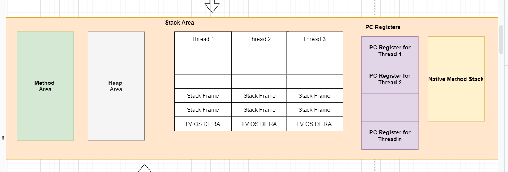

方法区 | 堆区 | 栈 Stack | 本地方法栈 Native Method Stack


#### 栈、堆、方法区之间的交互关系

- 


- 从创建对象的角度来看

  就是说是用来存储类CLass的信息，比如Person


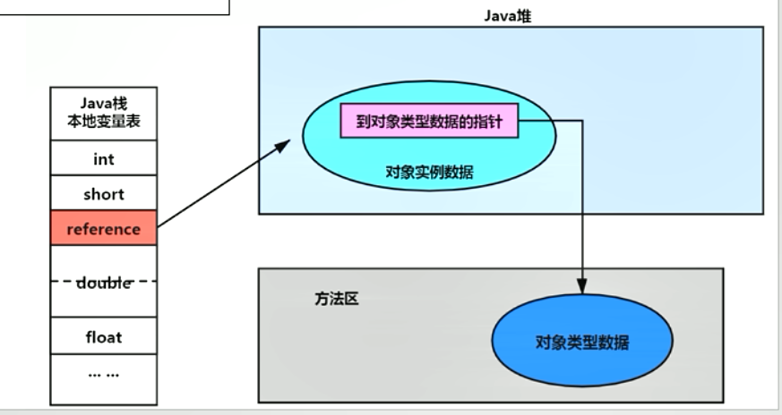

#### 方法区的基本理解


- 《Java虚拟机规范》中明确说明：**“尽管所有的方法区在逻辑上是属于堆的一部分，但是一些简单的实现可能不会选择区进行垃圾收集或者压缩”**。但是对于HotSpot虚拟机而言，方法区还有个名字叫 Non-Heap（非堆），目的就是要和堆分开
- 所以，**方法区看作是一块独立于Java堆的内存空间**，实际就是MetaSpace

- 方法区（Method Area）和堆一样，是各个线程共享的内存区域
- 方法区在JVM启动的时候被创建，并且它的实际物理内存空间中和Java堆区都一样可以是不连续的
- 方法区的大小，和堆空间一样，可以选择固定大小或者可拓展
- 方法区的大小决定了系统可以保存多少个类，如果系统定义了太多的类，导致方法区溢出，虚拟机就会抛出内存溢出错误：java.lang.OutOfMemory:PermGen space 或者 java.lang.OutOfMemory:Metaspace
  - **如加载了大量的第三方jar包。或者Tomcat部署的工程过多。大量动态生成反射类**
- 关闭JVM就会释放或者区域的内存

#### Hotspot中方法区的演进

- 在JDK7以及之前，习惯上把方法区称为**永久代**Permanent。在JDK8以及以后，使用**元空间**MetaSpace取代了永久代
- 本质上。方法区和永久代并不等价。仅仅只堆Hotspot而言的。《Java虚拟机规范》对如何实现方法区。不做统一要求。
  - 现在看来，当年使用永久代，不是好的idea，导致Java程序更容易OOM（超过 -XX:MaxPermSize 上限）


- 到了JDK8，终于完全废弃了永久代的概念，改用和JRockit、J9一样在本地内存中实现的元空间（Metaspace）
- 元空间的本质和永久代类似，都是JVM规范中方法区的体现，不过元空间与永久代最大区别就是：**元空间不在虚拟机设置的内容中，而是使用本地内存**
- 永久代、元空间不仅仅是名字改了，内部结构也进行了调整
- 根据《Java虚拟机规范》的规定，如果方法区无法满足新的内存分配需要的时候，将抛出OOM异常

#### 设置方法区大小和OOM

- 方法区的大小不必是固定的，JVM可以根据应用的需要动态调整
- JDK7以及以前
  - **通过 -XX:PermSize 来设置永久代的初始分配空间，默认值是 20.75M**
  - **通过-XX:MaxPermSize 来设定永久代的最大可分配空间，32位机器默认时64M，64位机器默认是82M**
  - 当JVM加载的类的信息容量超过了这个值，就会抛出异常 java.lang.OutOfMemoryError:PermGen space

测试代码：

```java
public class Test {
    public static void main(String[] args) {
        System.out.println("start...");
        try{
            Thread.sleep(1000000);
        }catch (InterruptedException e){
            e.printStackTrace();
        }
        System.out.println("end");
    }
}
```

```sh
F:\项目\note>jps
16356 Test
21268 RemoteMavenServer36
19512
19324 Launcher
3468 Jps

F:\项目\note>jinfo -flag MetaspaceSize  16356
-XX:MetaspaceSize=21807104 # 21807104/1024/1024 = 20 M
```


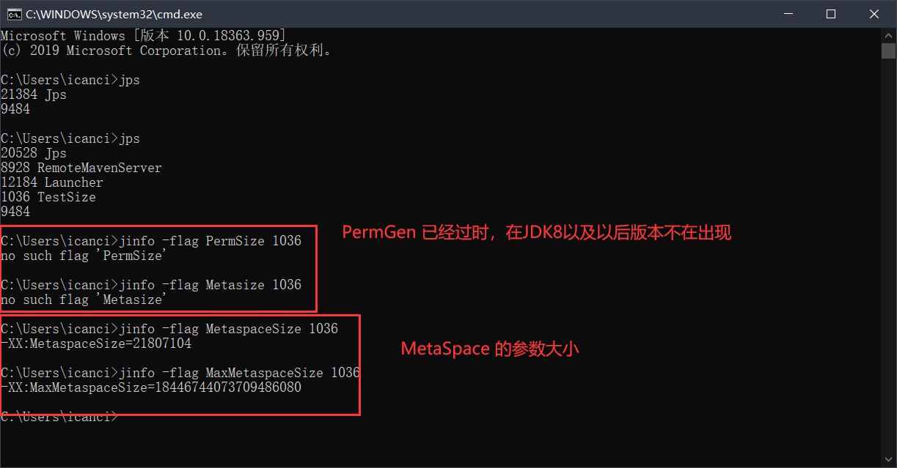

- JDK8以及以后
  - 元数据区大小可以使用参数 -XX:MetaspaceSize 和 -XX:MaxMetaspaceSize 指定
  - 默认值依赖于平台。windows下，-XX:MetaspaceSize 是21M，-XX:MaxMetaspaceSize 的值是-1，即没有限制
  - 与永久代不同，如果不指定大小，默认情况下，虚拟机会耗尽所有的可用系统内存，如果元数据区发生溢出，虚拟机一样会抛出异常 OutOfMemoryError:Metaspace
  - -XX:MetaspaceSize 设置初始值的大小。对于64位服务端的JVM来说，其默认的 -XX:MetaspaceSize 值为21 M，这就是最高水线。一旦触及这个水位线，Full GC 将会被触发并卸载没用的类。然后这个高水位线会被重置。新的水位线取决于GC之后释放了多少空间。如果释放过多，就适当降低该值，如果释放过低，就提升该值，前提是不超过 -XX:MaxMetaspaceSize
  - 如果初始化的高为太低，上述的调整就会发生很多次，可以发现执行了多次Full GC，建议将 -XX:MetaspaceSize设置一个较高的值

---

---

- 演示OOM

```java

/**
 * JDK8
 * VM:-XX:MetaspaceSize=10M -XX:MaxMetaspaceSize=10M
 */
public class OomTest extends ClassLoader {
    public static void main(String[] args) {
        int j = 0;
        try {
            OomTest oomTest = new OomTest();
            for (int i = 0; i < 10000; i++) {
                // 用于生成类的二进制字节码
                ClassWriter classWriter = new ClassWriter(0);
                // 指明版本号
                // 指明访问权限
                // 类的名字
                // 包名
                // 父类
                // 接口
                classWriter.visit(Opcodes.V1_8, Opcodes.ACC_PUBLIC, "Class" + i, null, "java/lang/Object", null);
                // 返回 byte[]
                byte[] bytes = classWriter.toByteArray();
                // 类的加载
                oomTest.defineClass("Class" + i, bytes, 0, bytes.length);
                j++;
            }
        } catch (Exception e) {
            e.printStackTrace();
        } finally {
            System.out.println(j);
        }
    }
}

```

默认的可拓展的方式是可以执行10000的，但是加入了VM Option

` -XX:MetaspaceSize=10m -XX:MaxMetaspaceSize=10m`

之后就是报OOM

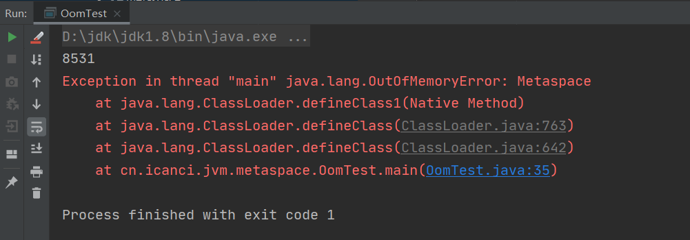

---

---

#### 如何解决OOM

- 要解决OOM异常或者heap space异常，一般的手段是首先通过内存映射分析工具如（Eclipse Memory Analyzer）对dump出来的堆转储快照进行分析，重点是确认内存中的对象是否是必要的，也就是先分清楚到底是出现了内存泄漏（Memory Leak）还是内存溢出（Memory Overflow）
- 如果只是内存泄漏，可以进一步通过工具检查泄漏对象到GC Roots的引用链。于是就能找到泄漏对象是通过怎样的路径与GC Roots相关联并导致垃圾回收器无法自动回收，掌握了泄漏对象的类型信息，以及GC Roots的引用链信息，就可以比较准确的定位出泄漏代码的位置
- 如果不存在内存泄漏，也就是说内存中的对象必须要存活，那就应该检查虚拟机的堆参数 （-Xms  -Xmx）与机器物理内存对比看是否还可以调大，从代码上检查是否存在某些对象的生命周期过长、持有状态时间过长、尝试减少运行期的内存消耗

#### 方法区的内部结构

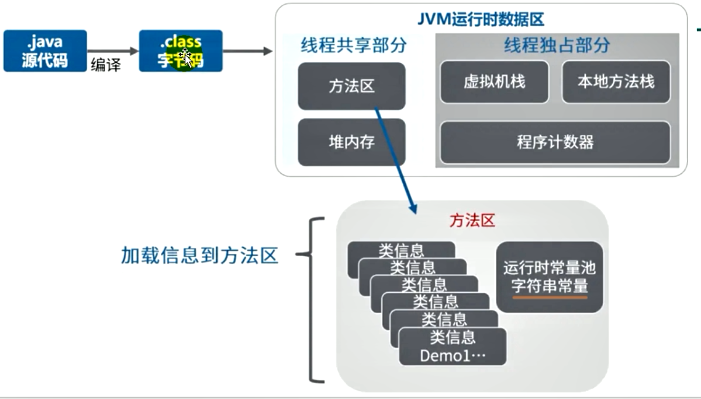

#### 方法区存储什么？

- 《深入理解Java虚拟机》书种对方法区（Method Area）存储的内容描述如下：它用户存储已经被虚拟机加载的**类型信息、常量、静态变量、即时编译器编译之后的代码缓存等**


**类型信息**

- 对每个加载的类型（类Class、接口interface 、枚举enum、注解annotation），JVM必须在方法区存储以下类型信息
  - 这个类型的完整有效名称（全名=包名.类名）
  - 这个类型的直接父类的完整有效名（对于interface或是java.lang.Object）都没有父类
  - 这个类型的修饰符（public abstract，final的某个子集）
  - 这个类型直接接口的一个有序列表

**域（Field）信息**

- JVM必须在方法区中保存类型的所有域相关的信息以及域的声明顺序
- 域的相关信息包括：域名称、域类型、域修饰符（public private protected static final volatile transient 的某个子集）

**方法（Method）的信息**

- JVM必须保存所有方法的以下信息，同域信息一样包括声明顺序
  - 方法名称
  - 方法的返回类型（或者void）
  - 方法参数的数量和类型（按顺序）
  - 方法的修饰符 （public private protected static final  synchronized native abstract 的某个子集）
  - 方法的字节码（bytecodes）、操作数栈、局部变量表以及大小（abstract和native方法除外）
  - 异常表（abstract和native方法除外）
    - 每个异常处理的开始位置、结束位置、代码处理在程序计数器中的偏移地址、被捕获的异常类的常量池索引

**non-final 的类变量**

- 静态变量和类关联在一起，随着类的加载和而加载它们成为类数据在逻辑上的一部分，
- 类变量被类的所有实例共享，即使没有类实例的时候你也可以访问它

```java
public class MethodAreaTest {
    public static void main(String[] args) {
        Order order = null;
        // 虽然为null 但是是可以调用的
        System.out.println(order.count);
        System.out.println(order.number);
        order.hello();
    }
}

class Order {
    public static int count = 1;
    public static final int number = 2;

    public static void hello() {
        System.out.println("Order.hello");
    }
}
```

**补充说明：全局常量：static final**

- 被声明为final的类变量的处理方式不同，其在编译器就会被分配了

```java
  public static int count;
    descriptor: I
    flags: ACC_PUBLIC, ACC_STATIC

  public static final int number;
    descriptor: I
    flags: ACC_PUBLIC, ACC_STATIC, ACC_FINAL
	// 编译就已经赋值了
    ConstantValue: int 2

```

#### 运行时常量池的理解

**运行时常量池 VS 常量池**

- 方法区，内部包含了运行时常量池
- 字节码文件，内部包含了常量池
- 要弄清楚方法区，需要理解清楚ClassFile，因为加载类的信息都在方法区
- 要弄清楚方法区的运行时常量池，需要理解清楚ClassFile中的常量池

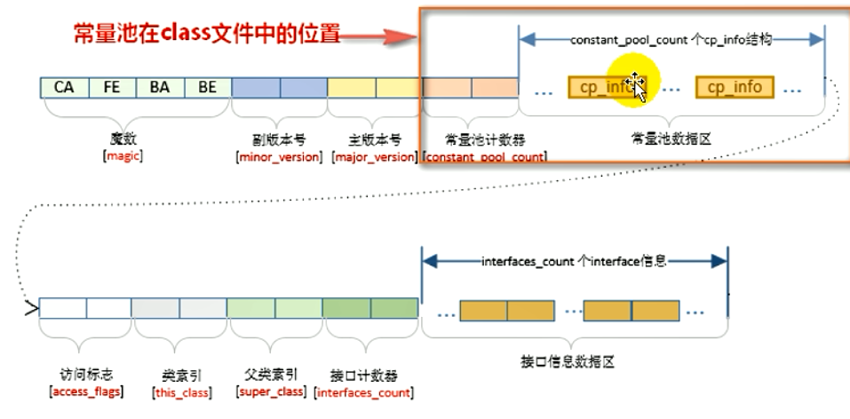

- 一个有效的字节码文件除了包含类的版本信息、字段、方法以及接口等描述信息外，还包含一项信息那就是常量池表（Constant Pool Table） 还包括了各种字面量和对类型、域、方法的符号引用等

**为什么需要常量池**

- 一个Java源文件中的类、接口、编译后会产生一个字节码文件，而Java中的字节码需要数据支持，通常这种数据类型会很大以至于不能直接存到字节码里面，换另一种方式，可以存到常量池，这个字节码包含了指向常量池的引用，在动态链接的时候会用到运行时常量池

- **常量池中有什么**
  - 数值型
  - 字符串型
  - 类引用
  - 字段引用
  - 方法引用

- **小结**
  - 常量池。可以看作是一张表。虚拟机指令根据这张常量表找到要执行的类名、方法名、参数类型、字面量等类型

#### 运行时常量池

- 运行时常量池（Runtime Constant Pool） 是方法区的一部分
- 常量池表（Constant Pool Teble）是Class文件的一部分，**用于存放编译器生成的各种字面量与符号引用，这部分内容将在类加载之后存放在方法区的运行时常量池中**
- 运行时常量池，在加载类和接口道虚拟机后，就会创建对应的运行时常量池
- JVM为每个已经加载的类型（类和接口）都维护一个常量池，池中的数据项像数组项一样，是通过索引访问的
- 运行时常量池中包含多种不同的常量，包括编译器就已经明确的数值字面量，也包括道运行期解析后才能够获得的方法或者字段引用。此时不再是常量池中的符号地址了，这里换为真实地址
  - 运行时常量池，相对于Class文件常量池的另一重要特性：**具备动态性**
- 运行时常量池类似于传统编程语言的符号表，（Symbol table），但是他所包含的数据却比符号表更加丰富一些、
- 当创建类或者接口的时候的运行时常量池的时候，如果构造运行时常量池所需的内存空间超过了方法区所能提供的最大值，则JVM会抛出 OutOfMemeoryError 异常

#### 方法区的使用举例

- 实例代码

```java
package cn.icanci.jvm.metaspace;

/**
 * @author icanci
 */
public class MethodAreaDemo {
    public static void main(String[] args) {
        int x = 500;
        int y = 100;
        int a = x / y;
        int b = 50;
        System.out.println(a + b);
    }
}

```

- 反编译之后的代码

```java
Classfile /E:/IdeaHome/maven/jvm/target/classes/cn/icanci/jvm/metaspace/MethodAreaDemo.class
  Last modified 2020-8-23; size 652 bytes
  MD5 checksum 9cbb47eeba7f5e0c93d2a604cceded9f
  Compiled from "MethodAreaDemo.java"
public class cn.icanci.jvm.metaspace.MethodAreaDemo
  minor version: 0
  major version: 52
  flags: ACC_PUBLIC, ACC_SUPER
Constant pool:
   #1 = Methodref          #5.#24         // java/lang/Object."<init>":()V
   #2 = Fieldref           #25.#26        // java/lang/System.out:Ljava/io/PrintStream;
   #3 = Methodref          #27.#28        // java/io/PrintStream.println:(I)V
   #4 = Class              #29            // cn/icanci/jvm/metaspace/MethodAreaDemo
   #5 = Class              #30            // java/lang/Object
   #6 = Utf8               <init>
   #7 = Utf8               ()V
   #8 = Utf8               Code
   #9 = Utf8               LineNumberTable
  #10 = Utf8               LocalVariableTable
  #11 = Utf8               this
  #12 = Utf8               Lcn/icanci/jvm/metaspace/MethodAreaDemo;
  #13 = Utf8               main
  #14 = Utf8               ([Ljava/lang/String;)V
  #15 = Utf8               args
  #16 = Utf8               [Ljava/lang/String;
  #17 = Utf8               x
  #18 = Utf8               I
  #19 = Utf8               y
  #20 = Utf8               a
  #21 = Utf8               b
  #22 = Utf8               SourceFile
  #23 = Utf8               MethodAreaDemo.java
  #24 = NameAndType        #6:#7          // "<init>":()V
  #25 = Class              #31            // java/lang/System
  #26 = NameAndType        #32:#33        // out:Ljava/io/PrintStream;
  #27 = Class              #34            // java/io/PrintStream
  #28 = NameAndType        #35:#36        // println:(I)V
  #29 = Utf8               cn/icanci/jvm/metaspace/MethodAreaDemo
  #30 = Utf8               java/lang/Object
  #31 = Utf8               java/lang/System
  #32 = Utf8               out
  #33 = Utf8               Ljava/io/PrintStream;
  #34 = Utf8               java/io/PrintStream
  #35 = Utf8               println
  #36 = Utf8               (I)V
{
  public cn.icanci.jvm.metaspace.MethodAreaDemo();
    descriptor: ()V
    flags: ACC_PUBLIC
    Code:
      stack=1, locals=1, args_size=1
         0: aload_0
         1: invokespecial #1                  // Method java/lang/Object."<init>":()V
         4: return
      LineNumberTable:
        line 6: 0
      LocalVariableTable:
        Start  Length  Slot  Name   Signature
            0       5     0  this   Lcn/icanci/jvm/metaspace/MethodAreaDemo;

  public static void main(java.lang.String[]);
    descriptor: ([Ljava/lang/String;)V
    flags: ACC_PUBLIC, ACC_STATIC
    Code:
      stack=3, locals=5, args_size=1
         0: sipush        500
         3: istore_1
         4: bipush        100
         6: istore_2
         7: iload_1
         8: iload_2
         9: idiv
        10: istore_3
        11: bipush        50
        13: istore        4
        15: getstatic     #2                  // Field java/lang/System.out:Ljava/io/PrintStream;
        18: iload_3
        19: iload         4
        21: iadd
        22: invokevirtual #3                  // Method java/io/PrintStream.println:(I)V
        25: return
      LineNumberTable:
        line 8: 0
        line 9: 4
        line 10: 7
        line 11: 11
        line 12: 15
        line 13: 25
      LocalVariableTable:
        Start  Length  Slot  Name   Signature
            0      26     0  args   [Ljava/lang/String;
            4      22     1     x   I
            7      19     2     y   I
           11      15     3     a   I
           15      11     4     b   I
}
SourceFile: "MethodAreaDemo.java"

Process finished with exit code 0

```

- 图解

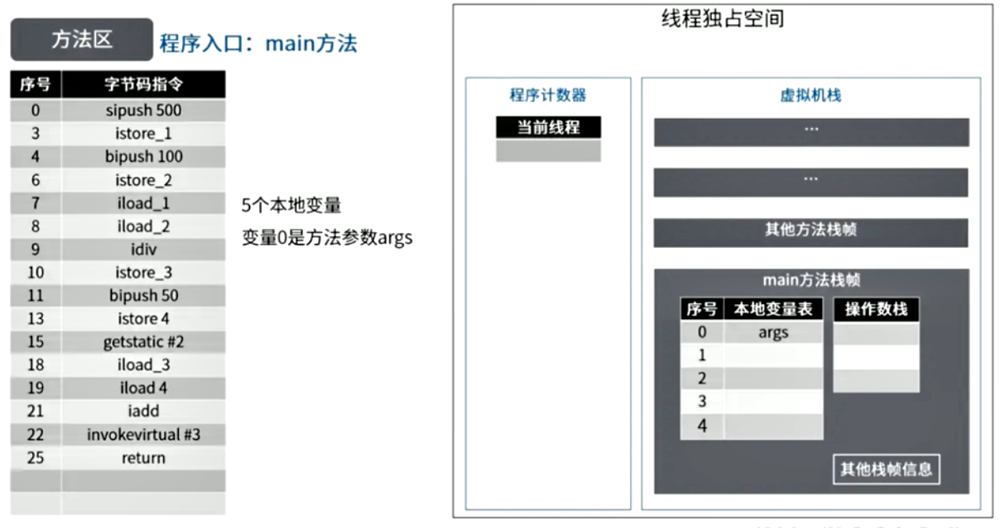


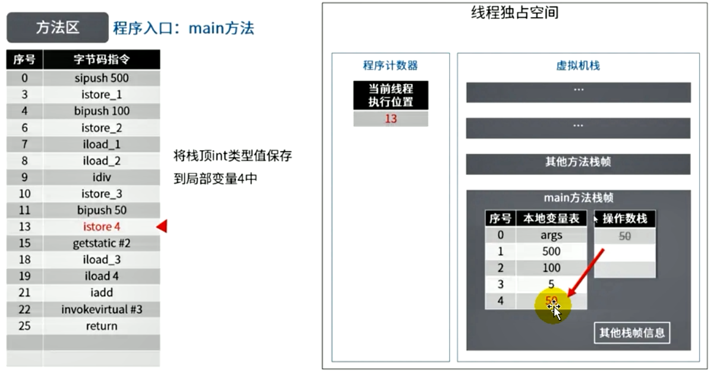

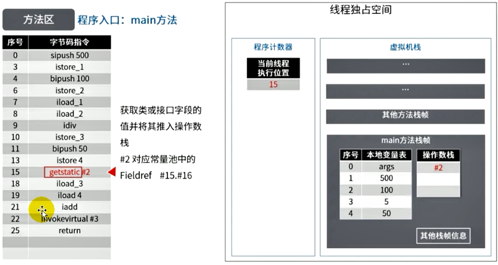

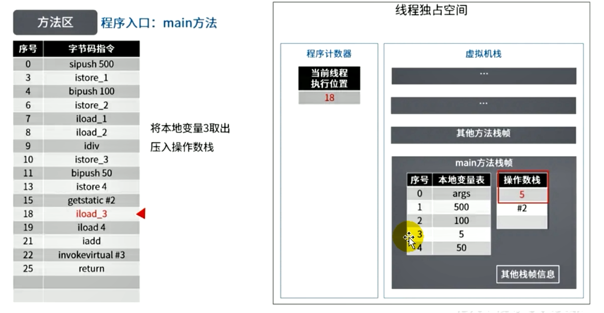

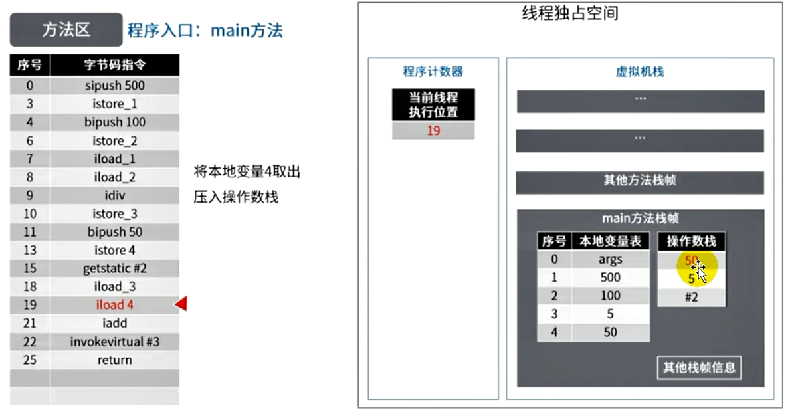

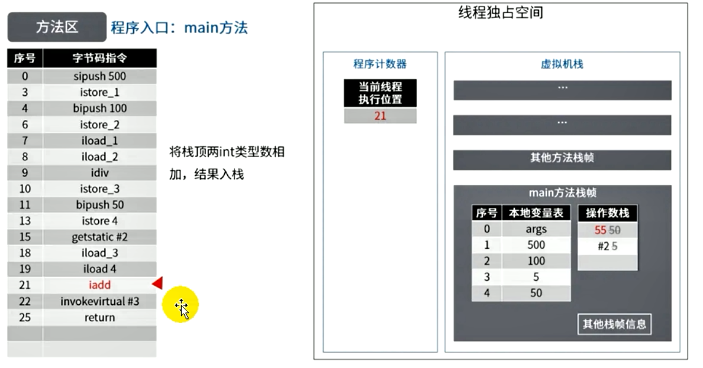

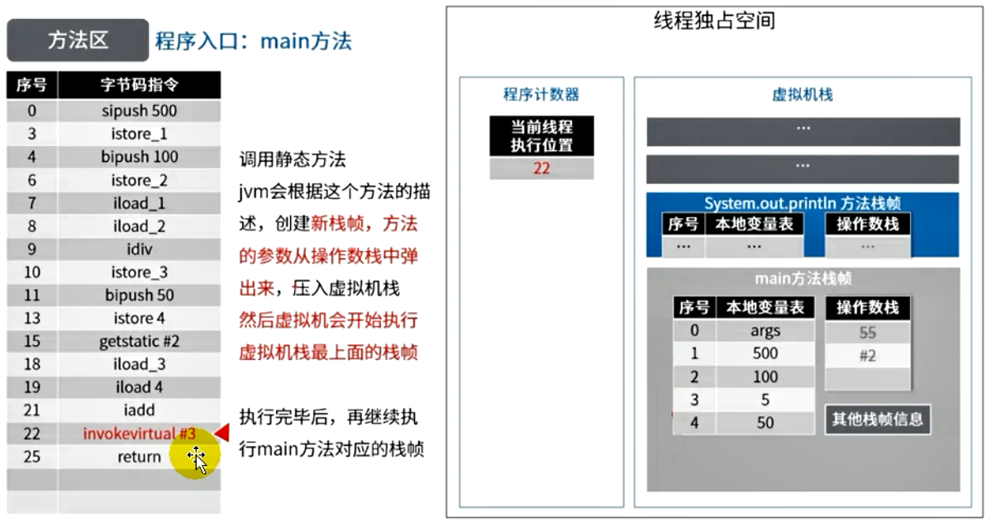

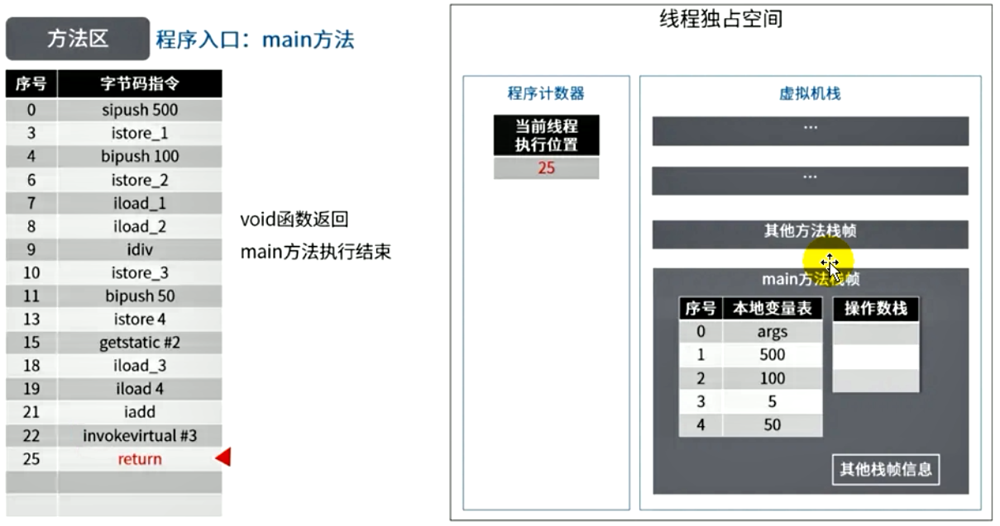

#### 方法区的演进细节

- 首先明确：只有Hotspot才有永久代
- BEA Jrockit、IBM J9 等来说，是不存在永久代的概念的，原则上如何实现属于虚拟机的细节，不受《Java虚拟机规范》的约束
- Hotspot中方法区的变化
  - JDK1.6之前 用永久代（permanent generation） 静态变量存放在永久代上
  - JDK1.7 有永久代，但是已经逐步“去永久代”，字符串常量池、静态变量移除，保存在堆中
  - JDK1.8之后 无永久代。类型信息、字段、方法、常量保存在本地内存的元空间，但是字符串常量池、静态变量仍在堆


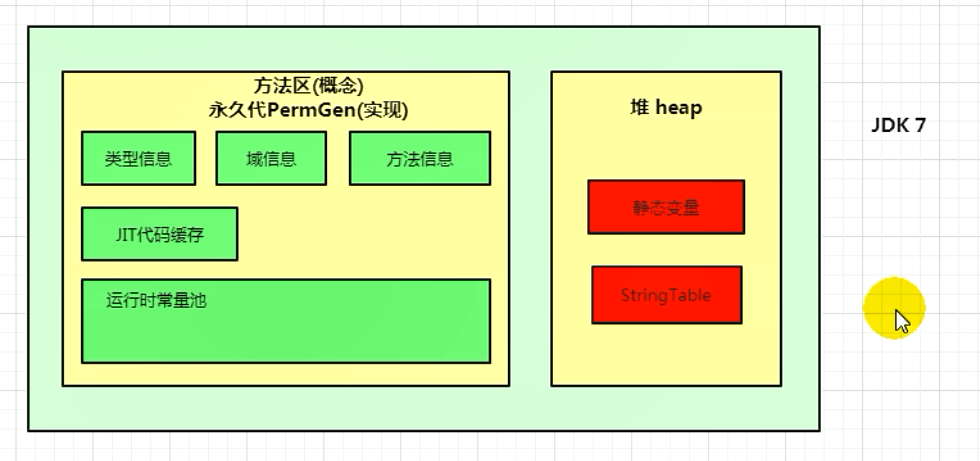

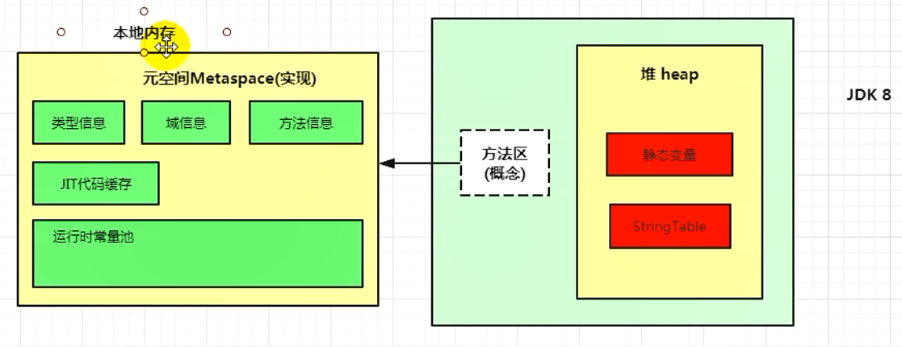

#### 永久代为什么要被元空间替换

- 随着JDK8的到来，Hotspot中再也见不到永久代了，但是这不意味着类的元数据消失了。这些元数据被移到了一个与 **堆不相连的本地内存区域，这个区域叫做元空间**
- 由于元空间分配在本地内存中，元空间的最大分配空间就是系统的可用内存空间 
- 永久代的设置空间大小时很难确定的
  - 元空间和永久代的区别就是：元空间不在虚拟机中，而是使用本地内存。因此，默认情况下，元空间的大小仅仅受本地内存限制
- 对永久代进行调优时很困难的

- **方法区的垃圾回收主要就是回收两部分内容：常量池中废弃的常量和不在使用的类型**

#### StringTable为什么需要调整

- JDK7中将StringTable放到了堆空间中。因为永久代的回收效率很低，在full GC才会触发。而Full GC是老年代不足、永久代不足才会触发。
- 这就导致StringTable回收效率不高，而我们在开发中会有大量的字符串被创建，回收效率低，导致永久代内存不足。放到堆里，能及时回收内存

- **静态引用对应的对象实体始终都存在堆空间**

#### 方法区的垃圾回收行为

- 有些人认为方法区，（如Hotspot虚拟机中的元空间或者永久代）是没有垃圾回收行为的。其实不然
- 《Java虚拟机规范》对方法区的约束是十分宽松的，提到过可以要求虚拟机在方法区中实现垃圾收集。事实上 也确实有未实现或者未能完整实现方法区类型卸载的收集器存在（Java11中的ZGC就不支持类卸载）
- 一般来说**这个区域的回收效果比较难以令人满意，尤其是类的卸载，条件相当苛刻**，但是这部分的回收时**确实有必要的**

- 方法区主要存放两大类常量：字面量和符号引用。字面量比较的是比较接近Java语言的常量概念。如文本字符串，被声明为final的常量值等。而符号引用则属于编译原理方面的概念，包括下面这三类常量
  - 类和接口的全限定名
  - 字段的名称和描述符
  - 方法的名称和描述符
- Hotspot虚拟机对常量池的回收策略是很明确的，**只要常量池中的常量没有被任何地方引用，就可以被回收**
- 回收废弃常量与回收Java堆中的对象非常相似

#### 总结

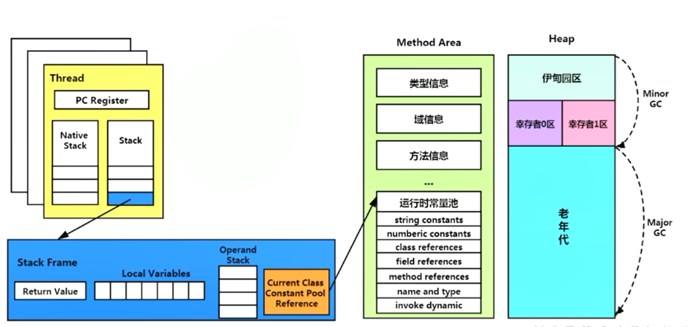

- 说一下JVM内存模型，有哪些区？分别是干嘛的
- Java8的内存分代改进
- JVM内存分哪几个区域？每个区域的作用是什么
- JVM的内存分布/内存结构？栈和堆的区别？堆的结构？为什么需要两个Survivor区
- Eden和Survivor的比例分配
- JVM内存分区，为什么要有新生代和老年代
- JVM的运行时数据区
- 什么时候对象会进入老年代