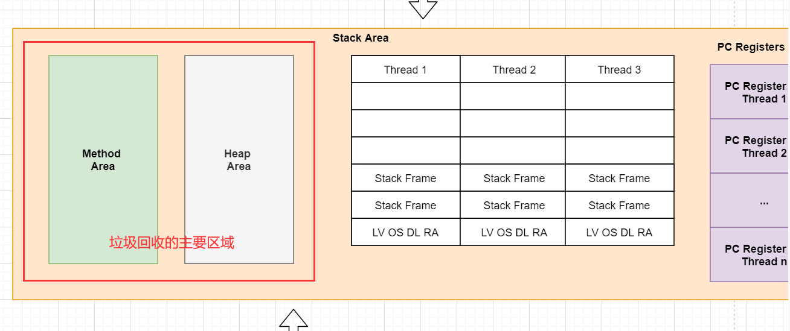
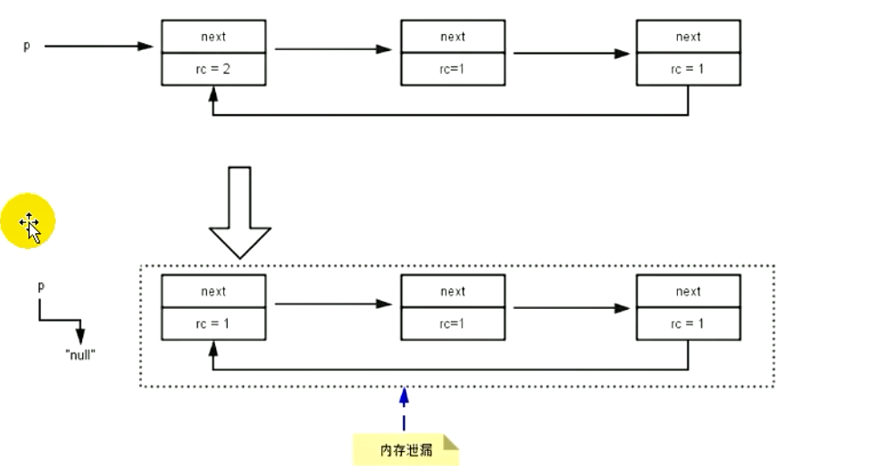
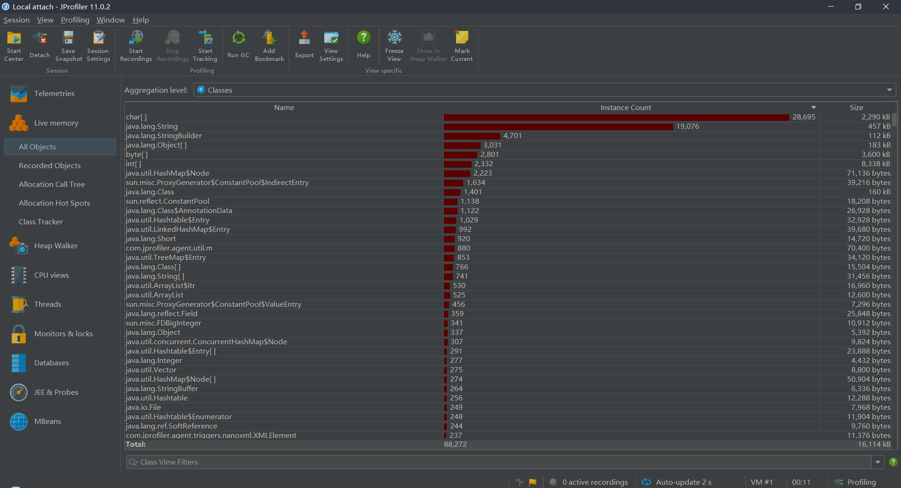
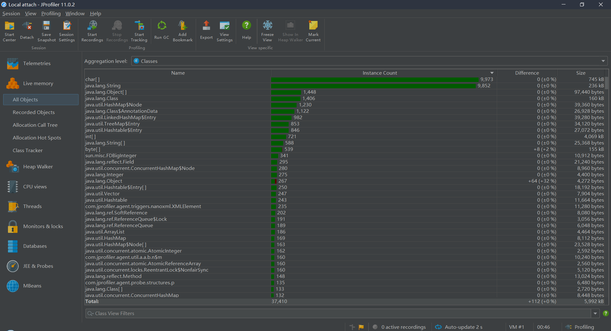
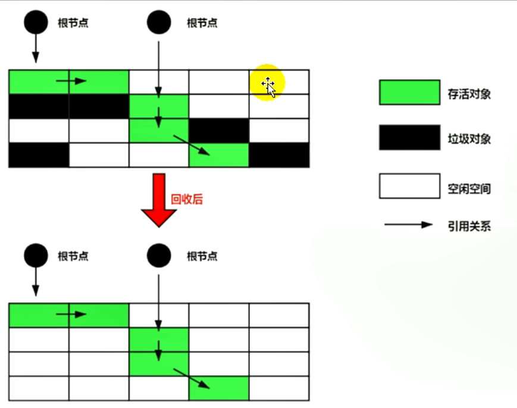
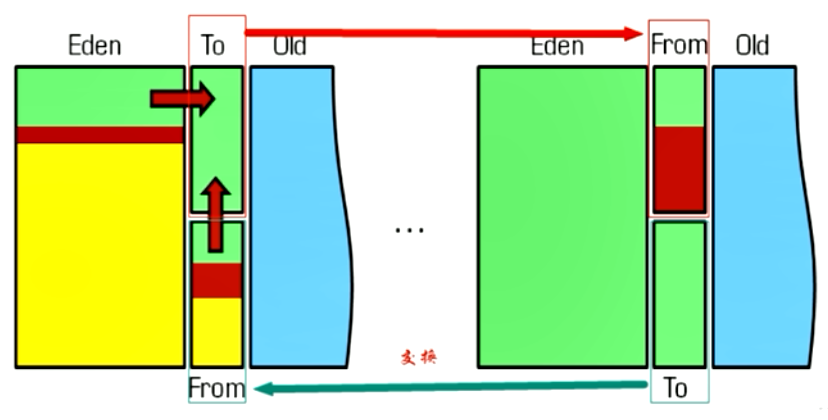
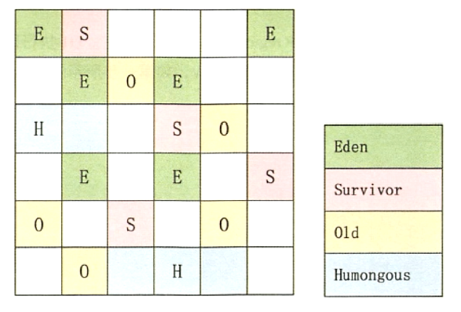

### 第15篇 - 垃圾回收相关算法

> 不用一行一行的去看实现原理，概述性，面试喜欢问。

垃圾回收主要针对就是方法区metaspace和堆的Eden, Old区。




#### 垃圾标记

##### 垃圾标记阶段：对象是否存活的判断

- 在堆里存放着几乎所有的Java对象实例，在GC执行垃圾回收之前，首先**需要区分出内存中哪些是存活对象，哪些是已经死亡的对象**。只有被标记为死亡的对象，GC才会执行垃圾回收，释放掉其所占用的内存空间，因此这个过程我们称为 **垃圾标记阶段**
- 那么在JVM中究竟是怎样标记一个死亡对象呢？简答来说，当一个对象已经不再被任何存活对象引用的时候，就可以宣判为已经死亡
- 判断对象存活一般有两种方式：**引用计数法和可达性分析算法**

##### 《方式一：引用计数算法》

- 引用计数算法（Reference Counting）比较简单，堆每个对象保存一个完整的整型的 **引用计算属性，用于记录对象被引用的情况**
- 对于一个对象A，只要有一个对象引用类A，则A的引用计数器+1，当引用失效的时候，引用计数器就减去1，只要对象A的引用计数器为0；即表示A不可能再被使用，可进行回收
- 优点：
  - 实现简单，垃圾对象便于识别；判定效率高，回收没有延迟性
- 缺点：
  - 她需要单独的字段存储计数器，这样的做法增加了 **储存空间的开销**
  - 每次复制都需要更新计数器，伴随着加法和减法操作，这增加了 **时间开销**
  - 引用计数器有一个严重的问题，即 **无法处理循环引用**的情况，这是一条致命的缺陷，导致在Java的垃圾回收器中没有使用到这类算法。

- 循环引用



- 实例代码

```java
package cn.icanci.jvm;

/**
 * @Author: icanci
 */
public class GCTest {
    private byte[] bigSize = new byte[5 * 1024 * 1024];
    Object reference = null;

    public static void main(String[] args) {
        GCTest obj1 = new GCTest();
        GCTest obj2 = new GCTest();

        obj1.reference = obj2;
        obj2.reference = obj1;
        obj2 = null;
        obj1 = null;
        System.gc();
    }
}

```


- 如果不小心直接把 Obj1.reference 和 Obj2.reference置为null。则在Java堆当中的两块内存依然有相互引用，无法回收。

**小结**

- 引用计数算法，是很多语言的资源回收选择，入Python，支持引用计数和垃圾收集机制
- 具体哪种是最优是要看场景的，业界有大规模实践中进保留引用计数机制，以提高吞吐量的尝试
- Java并没有选择引用计数，是因为其存在一个基本的难题，就是很难处理循环引用问题
- Python如何解决?
  - 手动解除：很好理解，就是在合适的时机，解除引用关系
  - 使用弱引用weakref，weakref是Python的标准库，为了解决循环引用

##### 《方式二：可达性分析（或者根搜索算法、追踪性垃圾收集）》

- 相当于引用计数算法而言，可达性分析算法不仅仅具有简单和执行高效等特点，更重要的是该算法可以有效的解决 **引用计数算法中循环引用的问题，防止内存泄漏的发生**
- 相对于引用计数算法，这里的可达性分析就是 **Java、C#选择的**，这种类型的垃圾收集通常也叫做 **追踪性垃圾收集（Tracing Garbage Collection）**

- 所谓 "GC Roots"根集合就是一组必须活跃的引用
- 基本思路
  - 可达性分析算法是以根对象集合（GC Roots）为起始点，按照从上至下的方式 **搜索被根对象集合所连接的目标对象是否可达**
  - 使用可达性分析算法后，内存中的存活对象都会被根对象集合直接或者间接连接着，搜索所走过的路径叫做 **引用链（Reference Chain）**
  - 如果目标对象没有任何引用链相连，则是不可达的，就意味着该对象已经死亡，可以标记为垃圾对象
  - 在可达性分析算法中，只有能够被根对象集合直接或者间接连接的对象才是存活对象


- 在Java语言中，GC Roots 包括以下几类元素
  - 虚拟机栈中引用的对象
    - 比如：各个线程被调用的方法中使用到的参数、局部变量
  - 本地方法栈JNI（本地方法）引用的对象
    - 比如：Java类的引用静态变量
  - 方法区中常量引用对象
    - 比如：字符串常量池（StringTable）里的引用
  - 所有同步锁synchronized持有的对象
  - Java虚拟机内部的引用
    - 基本数据类型对应的Class对象，一些常驻得异常对象（NullPointerException、OutOfMemory）系统类加载器
  - 反射Java虚拟机内部情况得JMXBean、JVMTI中注册得回调、本地代码缓存
  - 除了这些固定的GC Roots集合以外，根据用户所选用的垃圾收集器以及当前回收内存区域不同，还可以有其他对象“临时性”的加入，共同构成完成GC Roots 集合，比如：分代收集和局部回收（Partial GC）
  - 小技巧
    - 由于Root 采用栈方式存储变量和指针，所以如果一个指针，它保存了堆内存里面的对象，但是自己又不存放再堆内存里面，那它就是一个Root

- 注意
  - 如果要使用可达性分析算来判断内存是否可回收，那么分析工作必须在一个能报障一致性的快照中进行，这点不满足的话分析结果的准确性就无法保证
  - 这点也是导致GC进行时必须"Stop The World"的一个重要原因
    - 即使是号称（几乎）不会发生停顿的CMS收集器中 **枚举根节点的时候也是必须要停顿的**

#### 对象的finalization机制

- Java语言提供了对象终止（finalization）机制来允许开发人员提供 **对象被销毁之前的自定义处理逻辑**，在对象销毁前，加一些逻辑代码，比如加一些输出信息之类的。
- 当垃圾回收器发现没有引用指向一个对象，即：垃圾回收此对象之前，总会先调用这个对象的finalize() 方法
- finalize()方法允许在子类中被重新，**用于在对象被回收时进行资源释放**，通常在这个方法中进行一些资源释放和清理的工作，比如关闭文件、套接字和数据库连接等

- 永远不要主动调用某个对象的 finalize() 方法，应该交给垃圾回收机制调用，理由包括下面三点
  - 在finalize()时可能导致对象复活
  - finalize()方法的执行时间是没有报障的，它完全由GC线程决定，极端情况下，若不发生GC，则finalize()方法没有执行机会
  - 一个糟糕的finalize()会严重影响GC性能

- 从功能上来说，finalize()方法与C++中的析构函数类似
- 由于finalize()方法的存在，**虚拟机中的对象一般处于三种可能的状态**

#### 对象生存还是死亡

- 如果从所有根节点都无法访问到某个对象，说明对象已经不再使用了，一般来说，此对象需要被回收，但是事实上，也并非是 “非死不可”的，这时候它们暂时处于”缓刑“的状态，**一个无法触及的对象由可能再某个条件下”复活“自己** 如果这样，那么对它的回收就是不合理的。为此虚拟机定义对象可能的三种状态
  - **可触及的：**从根节点开始，可以达到这个对象
  - **可复活的：**对象所有的引用都被释放，但是可能再finalize()中复活，但是只有一次复活的机会
  - **不可触及的：**对象的finalize()被调用，并且没有复活，那么就会进入不可触及状态。不可触及的状态不可能被复活，因为 finalize()只调用一次
  
- 以上三种状态，只有在对象不可触及的时候才可以被回收

- **具体过程：判断一个对象objA是否可被回收，至少要经历2次标记过程**
  - 如果对象objA到GC Roots没有引用连接，则进行第一次标记
  
  - 进行筛选，判断此对象是否有执行finalize()方法，
    - 如果没有重写finalize()方法，或者finalize()方法已经被虚拟机调用过，则虚拟机视为”没有必要执行“，objA被判断是不可触及的
    
    - 如果对象objA重写了finalize()方法，且还未执行过，那么objA会被插入到F-Queue队列中，由一个虚拟机自动创建的、低优先级的  Finalizer（下图所示） 线程触发其 finalize()方法执行。[VisualVM 下载页面](https://visualvm.github.io/download.html)
    
      
    
    - **finalize()方法是对象逃亡的最后机会**，稍后GC会对 F-Queue队列中的对象进行第二次标记     
  
- **代码演示可复活的对象**

```java
package JVM.GC;

public class CanReliveObj {
    // 类变量，属于 GC Roots
    public static CanReliveObj obj;

    @Override
    protected void finalize() throws Throwable {
        super.finalize();
        System.out.println("调用当前类重写的finalize()方法");
        // 当前对象与引用链上任意一个对象建立了联系
        obj = this;
    }

    public static void main(String[] args) {
        try {
            obj = new CanReliveObj();
            // 对象第一次调用自己
            obj = null;
            if (obj == null) {
                System.out.println("obj is dead");
            } else {
                System.out.println("obj is alive");
            }
            System.gc();
            System.out.println("第一次GC");
            Thread.sleep(2000);//Finalize优先级低，所以暂停两秒
            if (obj == null) {
                System.out.println("obj is dead");
            } else {
                System.out.println("obj is alive");
            }
            System.out.println("第二次GC");
            obj = null;
            System.gc();
            if (obj == null) {
                System.out.println("obj is dead");
            } else {
                System.out.println("obj is alive");
            }
        } catch (Exception e) {
            e.printStackTrace();
        }
    }
}

/*
obj is dead
第一次GC
调用当前类重写的finalize()方法
obj is alive
第二次GC
obj is dead
 */

```

#### 使用MAT查看GC  Roots溯源

- MAT 是Memory Analyzer的简称 它是一款功能强大的Java堆内存分析器，用于查找内存泄漏以及查看内存消耗情况
- MAT是基于Eclipse开发的，是一款免费的性能分析工具  
  - 官网 ： http://eclipse.org/mat/ 

- **获取dump文件**
- 实例代码

```java
package cn.icanci.jvm.string;

import java.util.ArrayList;
import java.util.Date;
import java.util.Scanner;

/**
 * @Author: icanci
 */
public class GcRootsTest {
    public static void main(String[] args) {
        ArrayList<Object> numList = new ArrayList<>();
        Date birth = new Date();
        for (int i = 0; i < 100; i++) {
            numList.add(String.valueOf(i));
            try {
                Thread.sleep(10);
            } catch (Exception e) {
                e.printStackTrace();
            }
        }
        System.out.println("数据添加完毕，请操作");
        new Scanner(System.in).nextLine();
        numList = null;
        birth = null;
        System.out.println("numList birth 已经置空，请操作");
        new Scanner(System.in).nextLine();
        System.out.println("结束");
    }
}

```

- 使用VisualVM即可生成


- 然后使用MAT打开查看


#### 使用Jprofiler进行GC Roots溯源





#### 垃圾清除 Sweep

##### 方式一标记-清除算法 Mark Sweep

- 当成功区分处内存中存活对象和死亡对象之后，GC接下来的任务就是执行垃圾回收，释放掉无用对象所占用的内存空间，以便有足够的可用内存空间为新对象分配内存
- 目前在JVM中比较常见的三种垃圾收集算法是 **标记-清除算法（Mark-Sweep）、复制算法（Copying）、标记-压缩算法（Mark-Compact）**

- **背景**
  - 标记-清除算法（Mark-Sweep）是一种非常基础和常见的垃圾收集算法，该算法被 J.McCarthy等人在1960年提出并应用于Lisp语言
- 执行过程
  - 当堆中的有效空间（available memory）被耗尽的时候，就会停止整个程序，（也称为 Stop The World）然后进行两项工作，第一项是标记，第二项是清除
  - **标记：**Collector从引用根节点开始遍历，标记所有**被引用的对象**，一般是在对象的Header中记录为可达对象 （标记的是非清除对象）
  - **清除：**Collector对堆内存从头到尾进行线性的遍历，如果发现某个对象在其Header中没有标记为可达对象，则将其回收



- **缺点**
  - 效率不算高
  - 在进行GC的时候，需要停止整个应用程序，导致用户体验差
  - 这种方式清理出来的空闲内存是不连续的，产生内存碎片，需要维护一个空闲列表
- **注意：何为清除**
  - 这里所说的清除不是真的置空，而是把需要清除的对象地址保存在空闲的列表里，下次有新的对象需要加载的时候，判断垃圾位置的空间是否足够，够就存放

##### 方式二 复制算法

- **背景**
  - 为了解决标记-清除算法在垃圾回收效率方面的缺陷，复制算法出现
- 核心思想，
  - 将或者的内存空间分为两块，每次只使用其中一块，在垃圾回收的时候将正在使用的内存的活着的对象复制到未使用的内存块中，之后清除正在使用的内存块中的所有对象，交换两个内存的角色，最后完成垃圾回收


- **优点**
  - 没有标记和清除过程，实现简单，运行高效
  - 复制过去之后保证空间的连续性，不会出现”碎片“问题
- **缺点**
  - 很明显，需要2倍的空间
  - 对于G1这种拆分未大量 region 的GC，复制而不是移动，意味着GC需要维护region之间对象的引用关系，不管是内存或者实现开销都不小
- **特别的**
  - 如果系统中的垃圾对象很多，复制算法需要复制的存活对象数量不会太大，或者非常低才行

- **应用场景**
  - 在新生代，对常规的应用的垃圾回收，一次通常可以回收 70%~99%的内存 空间，回收性价比很高，所以现在的商业虚拟机都是使用这种方式作为收集算法回收新生代



##### 方式三 标记 - 压缩（整理）算法

- **背景**
  - 复制算法的高效性是建立在存活对象少、垃圾对象多的前提下的，这种情况在新生代经常发生，但是在老年代，更常见的是大部分对象都是存活对象。如果依然使用复制算法，因为存活的对象很多，复制的成本也很高。因此 **老年代的特征需要其他的算法**
  - 标记清除算法可以应用在老年代中。但是执行效率低效，而且在执行完内存回收之后还会产生内存碎片，所以JVM的设置者在此基础上，**标记 - 压缩算法** 诞生

 

- 执行过程
  - 第一阶段和标记清除算法一样，从根节点开始标记所有被引用的对象
  - 第二阶段将所有的存活对象压缩到内存的一端，按照顺序排放
  - 之后，清理边界外所有的空间

- 标记-压缩算法的最终效果等同于 标记 - 清除算法执行完成之后，在进行一次内存碎片整理，因此，也可以称之为 **标记-清除-压缩（Mark-Sweep-Compact）算法**
- 二者的本质是标记清除算法是一种 **非移动式的回收算法** 标记-压缩是 **移动式的** 是否移动回收后的存活对象是一个优点缺点并存的风险决策

- **优点**
  - 消除了 标记-清除 算法种，内存区域分散的缺点。我们需要给新对象分配内存的时候，JVM只需要持有一个内存的起始地址即可
  - 消除了复制算法当中，内存减半的高额代价
- **缺点**
  - 从效率上说，标记-整理算法要低于复制算法
  - 移动对象的同时，如果对象被引用，还需要调整引用的地址
  - 移动过程种，需要全程暂停用户应用程序 即 STW

##### 小结


- 效率上来说，复制算法是当之无愧的老大吗，但是浪费了太多内存
- 标记整理相对更平滑一点

#### 分代收集算法

- 没有一种算法可以完全取代其他算法，它们都有自己的优点和缺点
- 所以采用 **不同生命周期的对象可以采取不同的收集方式，以便提供回收效率**
- 核心思想：具体问题具体分析

- **几乎所有的GC都是采用分代收集（Generational Collecting）算法执行垃圾回收的**
- Hotspot虚拟机
  - 年轻代：区域相对老年代较小，对象生命周期短，存活率低，回收频繁 。 此时使用复制算法是最快的，同时借助了 S0和S1区
  - 老年代：区域较大，对象生命周期长，存活率高、回收不及年轻代频繁。这个时候一般使用标记-清除或者标记清除与标记整理一起出现

- 以HotSpot中的CMS回收器为例，CMS是基于 Mark-Sweep实现的。对于对象的回收效率很高。对于碎片问题，CMS采用基于Mark-Compact算法的Serial Old回收器作为补偿措施：当内存回收热点（碎片导致的 Concurrent Mode Failure时），将采用Serial  Old 执行Full GC对老年代进行内存的整理

#### 增量收集算法和分区算法

**增量收集算法**

- 在上述的算法，在垃圾回收的过程中，都会出现STW的状态，影响程序的运行，所以增量收集（Incremental Collecting ）算法的诞生
- 基本思想
  - 如果一次性将所有的垃圾进程处理，需要造成系统长时间的停顿，所以可以让垃圾收集线程和应用程序线程交替执行。每次 **垃圾回收线程只收集一小部分区域空间，接着切换到应用线程，依此反复，直到完成**
  - 总的来说，基础仍然时传统的 标记-清除算法和复制算法。增量收集算法 **通过对线程间冲突的妥善管理，允许垃圾收集线程以分阶段的方式完成标记、清理、或复制工作**
- **缺点**
  - 使用这种方式，由于在垃圾回收过程中，间断性的还执行了应用程序代码，所以能减少系统的停顿时间，但是线程上下文切换，会使得垃圾回收的总体成本上升，**造成系统的吞吐量下降**

**分区算法**

- 一般来说，在相同的条件下，堆空间越大，一次GC时所需要的时间就越长，GC产生的停顿就越长。为了控制好停顿时间，将堆分为不同的区块，从而减少一次GC的影响。
- 分代算法按照对象的生命周期长短划分为2个部分，分区算法整整个堆划分为连续的不同小空间
- 每个小空间独立使用，独立回收，可以一次控制多个小区



