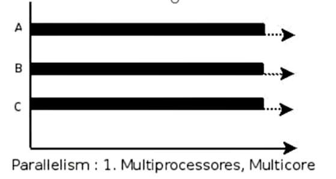
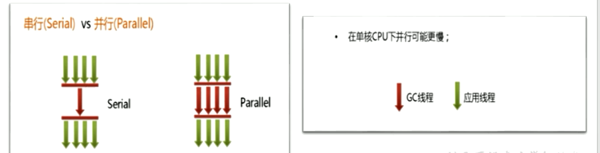
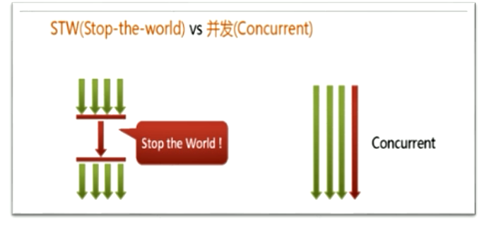

### Java - 底层建筑 - JVM - 第16篇 - 垃圾回收相关概念

#### System.gc()的理解

- 默认情况下，通过System.gc()或者Runtime.getRuntime().gc()的调用，**会显示触发Full GC**，同时对老年代和新生代进行回收，尝试释放被丢弃对象占用的内存
- 然后System.gc() 调用附带也该免责声明，无法保证对垃圾收集器的调用
- JVM实现着可以通过System.gc() 调用来决定JVM的GC行为 ，而一般情况下，垃圾回收应该自自动进行的 **无需手动触发，否则就太过于麻烦了** 

#### 内存溢出与内存泄漏

##### 内存溢出

- 内存溢出相对于内存泄漏来讲，尽管更容易被理解，但是同样的，内存溢出也是引发程序崩溃的罪魁祸首之一
- 由于GC一直在发展，所以一般情况下，除非应用程序占用的内存增长速度非常快，造成垃圾回收已经跟不上内存消耗的速度，否则不是很容易出现OOM的情况
- 大多情况下，GC会进行各种年龄段的垃圾回收，实在不行了就放发招，来一次Full GC，这个时候会释放大量的内存
- javadoc中对OutOfMemoryError的解释是，**没有空闲内存，并且垃圾收集器也无法提供更多内存**

- 首先说没有空闲内存的情况：说明Java虚拟机的堆内存不够，
  - **Java虚拟机的堆内存设置不够**
  - 比如：可能存在内存泄漏问题；也有可能是堆的大小不合理，比如我们要处理比较可观的数据量，但是没有显示指定JVM堆大小或者指定数值偏小。我们可以通过 -Xms -Xmx 来调整
  - **代码中创建了大量的大对象，并且长时间不能被垃圾收集器收集（存在引用）**
  - 对于老版本的Oracle JDK ，永久代的大小是有限的。并且JVM对永久代垃圾回收非常不积极。所以永久代出现 OutOfMemoryError 非常常见，尤其是在运行大量动态生成的场合；类似intern字符串缓存占用太多空间
  - 随着元空间的引入，方法区内存已经不再那么窘迫。所以响应的OOM有所改观，出现OOM，异常信息变成了“java.lang.OutOfMemoryError:Metaspace "  直接内存不足，也会导致OOM

- 这里隐含着一层意思，在抛出OutOfMemoryError之前，通常垃圾收集器会被触发尽其所能去收集空间
  - 在引用机制分析中，涉及到JVM会去尝试回收**软引用指向的对象等**
  - 在java.nio.Bits.reserveMemory()方法中，我们能清楚的看到，System.gc() 会被调用，以清理空间
- 当然，也不是任何情况下垃圾回收器都会被触发的
  - 比如我们去分配一个超级大的对象，JVM判断垃圾收集器不能解决这个问题，就直接抛出OutOfMemoryError

##### 内存泄漏

- 也称作”存储渗漏“ **严格来说：只有对象不会被程序用到了，但是GC又不能回收他们的情况，才叫内存泄漏**
- 但是实际情况很多时候一些不太好的实践（或疏忽）会导致对象的生命周期变得很长，甚至OOM。也可以叫做 **宽泛意义上的 内存泄漏**
- 尽管内存泄漏不会立刻引起程序崩溃，但是一旦发生，程序中的内存就会被逐步蚕食，直到发生OutOfMemoryError
- 这里的内存不是指的物理内存，而是虚拟机内存大小


**举例**

- 单例模式
  - 单例的生命周期和应用程序时一样长的，所以单例程序中，如果持有对象外部引用的话，那么这个外部对象时不能被回收的，则会导致内存泄漏的发生
- 一些提供close的资源未关闭而导致内存泄漏
  - 数据库连接 网络连接 和IO连接必须手动close，否则不能回收

#### Stop The World

- Stop The World 简称STW，指的是GC事件发生的过程中，会产生应用程序的停顿，**停顿产生的时候整个应用程序线程都会被暂停，没有任何响应** 有点卡死的感觉
  - 可达性分析的枚举根节点（GC Roots）会导致所有的Java执行线程停顿，
    - 分析工作必须在一个确保一致性的快照中进行
    - 一致性指的是整个分析过程系统像是冻结在某个点上
    - **如果出现分析过程中对象引用关系还在不断地变化，则分析地结果无法保证**
- 被STW中断地应用会在完成GC之后恢复，频繁中段会让用户感觉像是网速不快造成电影卡带一样。

- STW事件和采用哪款GC无关，所有地GC都有整个事件
- 哪怕是G1也不能完全避免STW，只能说垃圾回收器越来越优秀，回收效率越来越高。尽可能地缩短了暂停地时间
- STW是JVM**后台自动发起和完成的** 在用户不可见的情况下，把用户正常的工作线程全部停掉
- 开发中不要使用System.gc() 会导致Stop-the-world的发生

#### 垃圾回收的并行与并发

- **并发**
  - 操作系统中，一个时间段有几个程序都处于启动到运行完毕之间，且这几个程序都是在同一个处理器上运行
  - 并发不是真正的 ”同时进行“ 只是CPU的时间片轮转，让用户觉得很快，没有切换的感觉


- **并行**
  - 当系统有一个以上的CPU的时候，一个CPU执行一个进程，另一个CPU可以执行另外一个进程。两个进程互不抢占CPU资源。可以同时进行，我们称之为并行（Parallel）
  - 其实决定并行的不是CPU的数量，而是CPU的核心数量，一个CPU多核心也可以并行



- **二者对比**
  - 并发：指的是多个事情，在 **同一个时间段内同时发生了**
  - 并行：指的是多个事情，在 **同一个时间点上同时发生了**
  - 并发的多个任务是相互抢占资源的
  - 并行的读个任务是不相互抢占资源的
  - 只有多个CPU或者一个CPU多核心的情况中，才会发生并行

- **垃圾回收的并发与并行**
- 并行（Parallel）：指多条垃圾回收线程并行工作，但此时用户线程仍处于等待状态
  - 如 ParNew Parallel Scavenge Parallel Old
- 串行（Serial）
  - 单线程执行
  - 如果内存不够，程序暂停，启动JVM垃圾回收器进行垃圾回收。回收完在启动程序的线程



- 并发（Concurrent）
  - 指用户线程与垃圾收集器线程同时执行。垃圾回收线程执行的时候不会停顿用户程序的执行
    - 用户程序继续执行，垃圾在另外一个核心上执行
    - CMS G1



#### 安全点和安全区域

- 程序执行时并非在所有地方都能停下来开始GC，只有在特定位置才能停下来开始GC。这些位置称为 “安全点（Safe Point）”
- Safe Point的选择十分重要。**如果太少可能导致GC等待的时间太长，太频繁就会导致运行时的性能问题** 
- 通常会根据**“是否具有让程序长时间执行的特性”**为标准。比如：选择一些执行指令作为 Safe Point ，**如方法调用、循环跳转、异常跳转等**

- 如何在GC发生时，检查所有的线程都跑到最近的安全点停顿下来呢？
  - **抢断式中断（目前没有虚拟机采用）**
  - 首先中断所有线程，如有线程不在安全的，就恢复线程，让线程跑到安全点
  - **主动式中断**
  - 设置一个中断标志，各个线程运行到Safe Point的时候主动轮询这个标志，为true，就将自己进行中断挂起
- 安全区域
  - 指一段代码片段，对象的引用关系不会发生变化。这个区域的任何位置开始GC都是安全的

#### Java中的引用

> 具体的解释见 ： **Java基础学习/Java - 多线程 - 增强篇 - 四种引用类型.md**


**Java中有四种引用类型，分别是如下四种**

- 强引用
- 软引用
- 弱引用
- 虚引用

##### 强引用

- 在Java中默认声明的就是强引用，如下代码：

```java
// 只要 o 还指向Object对象，对象 o 就不会被GC回收
Object o = new Object();
o = null;
```

- 只要强引用存在，GC就永远不会回收被引用的对象，就算是内存不足的时候，JVM也会直接抛出 **OutOfMemoryError**，也不会去回收。
- 如果想中断强引用与对象之间的联系，可以显示的将强引用赋值为null，这个时候就等待GC回收对对象即可。

##### 软引用

- 软引是用来描述一些非必须但是仍有用的对象。**在内存足够的时候，软引用对象不会被回收，只有在内存不足的时候，系统会回收软引用对象，如果回收了软引用对象之后仍然没有足够的内存，才会抛出内存溢出异常** 这种特性非常适合用来做**缓存**
- 在JDK1.2之后，使用 java.lang.ref.SoftReference类来表示软引用
- 下面举例说明：先配置IDEA执行代码的VM参数 `-Xms2M -Xmx3M`JVM初始内存设为2M，最大可用内存为3M

```java
/**
 * VM参数：-Xms2M -Xmx3M
 */
public class Test2 {
    public static void main(String[] args) {
        byte[] bytes = new byte[1024 * 1024 * 3];
    }
}

// Exception in thread "main" java.lang.OutOfMemoryError: Java heap space
```

- 现在设置为软引用，如下代码所示

```java
/**
 * VM参数：-Xms2M -Xmx3M
 */
public class TestSoftReferenceOom {

    private static List<Object> list = new ArrayList();

    public static void main(String[] args) {
        testReferenceOom();
    }

    public static void testReferenceOom() {
        for (int i = 0; i < 10; i++) {
            byte[] b = new byte[1024 * 1024];
            SoftReference<byte[]> reference = new SoftReference<>(b);
            list.add(reference);
        }
        
        // 触发一次GC 注意：并不是一定会立刻执行GC
        System.gc();

        for (int i = 0; i < list.size(); i++) {
            Object obj = ((SoftReference) list.get(i)).get();
            System.out.print(obj + " ");
        }
    }
}

// null null null null null null null null null [B@1540e19d 
```

- 此时我们发现，无论创建了多少对象，之前的对象都为null，只保留了最后一个对象，这就说明了在内存空间不足的情况下，软引用会被回收
- 值得注意的一点 , 即使有 byte[] b引用指向对象, 且 b 是一个strong reference, 但是 SoftReference sr 指向的对象仍然被回收了，这是因为Java的编译器发现了在之后的代码中, b已经没有被使用了, 所以自动进行了优化。 
- 这时候稍稍改动一下代码如下

```java
/**
 * VM参数：-Xms2M -Xmx3M
 */
public class TestSoftReferenceOom {

    private static List<Object> list = new ArrayList();

    public static void main(String[] args) {
        testReferenceOom();
    }

    public static void testReferenceOom() {
        byte[] b = null;
        for (int i = 0; i < 10; i++) {
            b = new byte[1024 * 1024];
            SoftReference<byte[]> reference = new SoftReference<>(b);
            list.add(reference);
        }
        
        // 触发一次GC 注意：并不是一定会立刻执行GC
        System.gc();

        for (int i = 0; i < list.size(); i++) {
            Object obj = ((SoftReference) list.get(i)).get();
            System.out.print(obj + " ");
        }
    }
}

// Exception in thread "main" java.lang.OutOfMemoryError: Java heap space
```

- 此时b是强引用，无法被回收。报错

##### 弱引用

- 弱引用的引用强度比软引用还要低一些，只有JVM在GC的之后，**无论弱引用有没有被引用，都要被回收**
- 在JDK1.2之后，在java.lang.ref.WeekReference来创建弱引用
- 代码示例

```java
/**
 * VM参数：-Xms2M -Xmx3M
 */
public class TestSoftReferenceOom {

    private static List<Object> list = new ArrayList();

    public static void main(String[] args) {
        testWeakReferenceOom();
    }

    public static void testWeakReferenceOom() {

        for (int i = 0; i < 10; i++) {
            byte[] b = new byte[1024 * 1024];
            WeakReference<byte[]> reference = new WeakReference<>(b);
            list.add(reference);
        }
        System.gc();

        for (int i = 0; i < list.size(); i++) {
            Object obj = ((WeakReference) list.get(i)).get();
            System.out.print(obj + " ");
        }
    }
}

// null null null null null null null null null null 
```

- 此时我们发现，所有的引用都为null

##### 虚引用

-  虚引用是最弱的一种引用关系，如果一个对象仅持有虚引用，那么它就和没有任何引用一样，它随时可能会被回收 
-  在JDK1.2之后的 java.util.ref.PhantomReference
-  发现它只有一个构造函数和一个 get() 方法，而且它的 get() 方法仅仅是返回一个null，也就是说将永远无法通过虚引用来获取对象，虚引用必须要和 ReferenceQueue 引用队列一起使用。 

```java
public class PhantomReference<T> extends Reference<T> {

    public T get() {
        return null;
    }

    public PhantomReference(T referent, ReferenceQueue<? super T> q) {
        super(referent, q);
    }
}

```

-  那么传入它的构造方法中的 ReferenceQueue 又是如何使用的呢？ 

##### 引用队列

- 引用队列可以与软引用、弱引用以及虚引用一起配合使用，当垃圾回收器准备回收一个对象时，如果发现它还有引用，那么就会在回收对象之前，把这个引用加入到与之关联的引用队列中去。
- 程序可以通过判断引用队列中是否已经加入了引用，来判断被引用的对象是否将要被垃圾回收，这样就可以在对象被回收之前采取一些必要的措施。
- 与软引用、弱引用不同，虚引用必须和引用队列一起使用

##### 拓展 - WeakHashMap

- WeakHashMap类及其实现WeakHashMap类在java.util包内，它实现了Map接口，是HashMap的一种实现，它使用弱引用作为内部数据的存储方案。

```java
public void test() {
    Map map;
    // 弱引用 HashMap
    map = new WeakHashMap();
    for (int i = 0; i < 10000; i++) {
        map.put("key" + i, new byte[i]);
    }
    // 强引用HashMap
    map = new HashMap();
    for (int i = 0; i < 10000; i++) {
        map.put("key" + i, new byte[i]);
    }
}
```

- WeakHashMap会在系统内存紧张时使用弱引用，自动释放掉持有弱引用的内存数据。但如果WeakHashMap的key都在系统内持有强引用，那么WeakHashMap就退化为普通的HashMap，因为所有的表项都无法被自动清理。

##### 总结

| 类型   | 回收时间                                | 使用场景                                                     |
| ------ | --------------------------------------- | ------------------------------------------------------------ |
| 强引用 | 一直存活，除非GC Roots不可达            | 所有程序的场景，基本对象，自定义对象等。                     |
| 软引用 | 内存不足时会被回收                      | 一般用在对内存非常敏感的资源上，用作缓存的场景比较多，例如：网页缓存、图片缓存 |
| 弱引用 | 只能存活到下一次GC前                    | 生命周期很短的对象，例如ThreadLocal中的Key。                 |
| 虚引用 | 随时会被回收， 创建了可能很快就会被回收 | 业界暂无使用场景， 可能被JVM团队内部用来跟踪JVM的垃圾回收活动 |