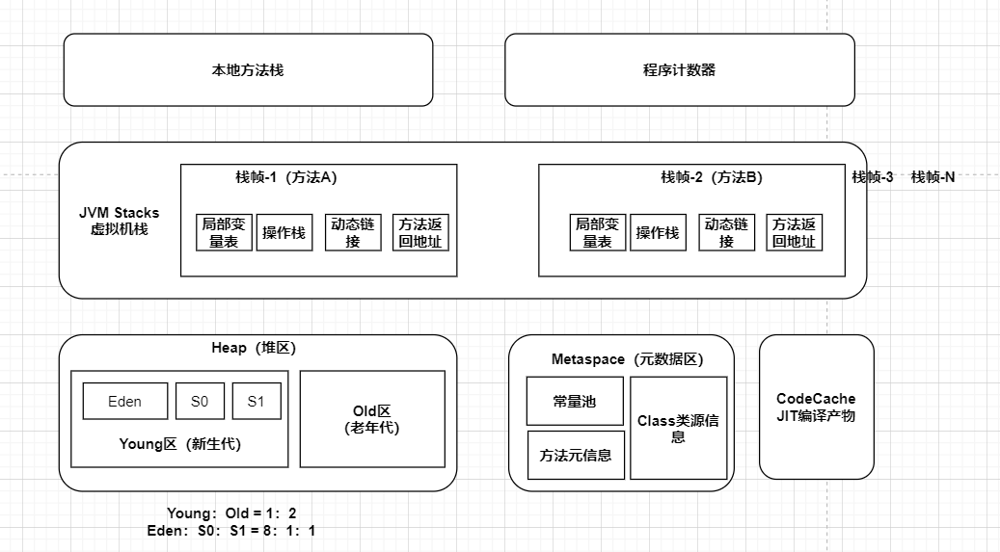
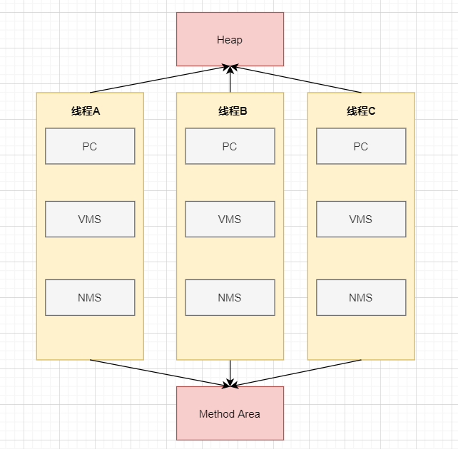

### Java - 底层建筑 - JVM - 第3篇 - 运行时数据区概述和线程

JVM 可以分为 5 个部分，分别是：

- 1.类加载器（Class Loader）：加载字节码文件到内存。
- 2.运行时数据区（Runtime Data Area）：JVM 核心内存空间结构模型。
- 3.执行引擎（Execution Engine）：对 JVM 指令进行解析，翻译成机器码，解析完成后提交到操作系统中。
- 4.本地库接口（Native Interface）：供 Java 调用的融合了不同开发语言的原生库。
- 5.本地方法库（Native Libraies）：Java 本地方法的具体实现。

#### 内存

- 内存是非常重要的系统资源，是硬盘和CPU的中间仓库和桥梁，承载着操作系统和应用程序的实时运行。
- JVM的内存布局规定了Java在运行过程中内存申请、分配、管理的策略，保证了JVM的高效稳定运行。
- **不同的JVM对于内存的划分方式和管理机制存在着部分差异。**结合JVM虚拟机规范，来谈论一下经典的JVM内存布局

#### 线程共享

- Java虚拟机定义了若干种程序运行期间会使用到的运行时数据区，其中有一下会随着虚拟机的启动而创建，岁着虚拟机的销毁而销毁。
- 另外一些则是与线程一一对应的，这些与线程对应的数据区域会随着线程开始和结束而创建和销毁
- 灰色的是单独线程私有的，红色的是多个线程共享的
  - 每个线程：独立包括程序计数器、栈、本地栈
  - 线程间共享：堆、堆外内存（永久代或者元空间、代码缓存）

#### Runtime

- 每个JVM只有一个Runtime实例。即为运行时环境，相当于内存结构的中间的哪个框框：运行时环境。

#### 线程

- 线程是一个程序里面的运行单元。JVM允许一个应用有多个线程并行执行
- 在HotSpot JVM 里，每个线程都与操作系统的本地线程直接映射。
  - 当一个Java线程准备好执行以后，此时一个操作系统的本地线程也同时创建，Java线程执行结束之后，本地线程也会回收
- 操作系统负责所有线程的安排调度到任何一个可用的CPU上，一旦本地线程初始化成功，它就会调用Java线程中的run()方法
- **守护线程、普通线程**

#### JVM系统线程

- 如果你使用jconsole或者是任何一个调试工具。都能看到在后台有许多线程在运行。这些后台线程不包括调用 public static void main(String[] args)的main线程以及所有这个main线程自己创建的线程
- 这些主要的后台系统线程在Hotspot JVM 主要是以下几个
  - **虚拟机线程：** 这种线程的操作是需要JVM达到安全点才会出现，这些操作必须在不同的线程种发生的原因是他们都需要JVM达到安全点，这样堆才不会变化，这种线程的执行类型包括 "stop-the-world"的垃圾收集器，线程栈收集，线程挂起以及偏向锁撤销
  - **周期任务线程：**这种线程是时间周期事件的体现（比如中断），他们一般用于周期性操作的任务调度
  - **GC线程：**这种线程对在JVM里面不同种类的垃圾收集行为提供了支持
  - **编译线程：**这种线程会在运行时将字节码编译到本地代码
  - **信号调度线程：**这种线程接受信号并发送给JVM，在它内部通过调用适当的方法进行处理。