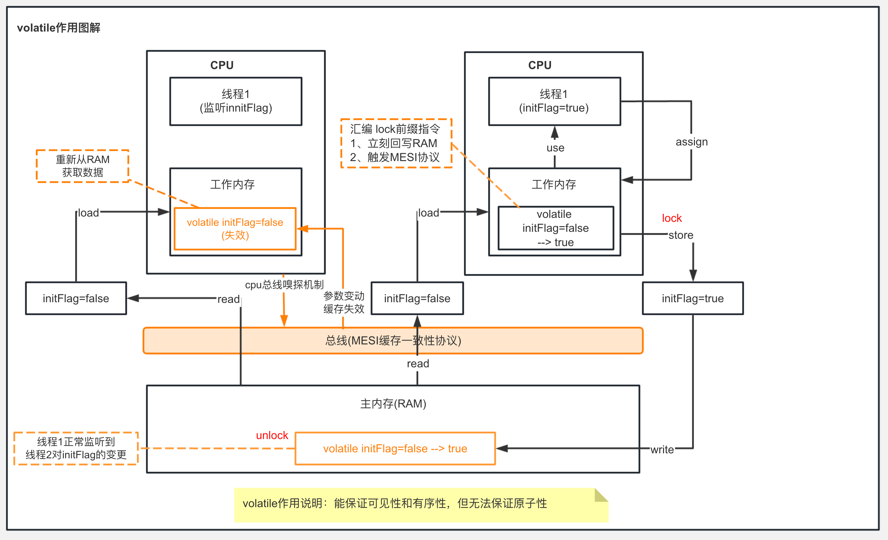

## JMM内存模型（Java 线程内存模型）

### Java 内存模型是什么？

Java 内存模型（Java Memory Model，JMM）用于屏蔽掉各种硬件和操作系统的内存访问差异，以实现让 Java 程序在各种平台下都能达到一致的并发效果。

**JMM 规范了 Java 虚拟机与计算机内存是如何协同工作的**：**规定了一个线程如何和何时可以看到由其他线程修改过后的共享变量的值，以及在必须时如何同步的访问共享变量。**

Java 堆和方法区是多个线程共享的数据区域。多个线程可以操作堆和方法区中的同一个数据。局部变量，方法定义参数和异常处理参数不会在线程之间共享，它们不会有内存可见性问题，也不受内存模型影响。 Java 内存模型的英文名称为 Java Memory Model(JMM)，其并不像 JVM 内存结构一样真实存在，而是一个抽象的概念。

从抽象的角度来看，JMM 定义了线程和主内存之间的抽象关系：

* 线程之间的共享变量存储在主内存（Main Memory）中
* 每个线程都有一个私有的本地内存（Local Memory），本地内存是 JMM 的一个抽象概念，并不真实存在，它涵盖了缓存、写缓冲区、寄存器以及其他的硬件和编译器优化。本地内存中存储了该线程以读/写共享变量的拷贝副本。
* 从更低的层次来说，主内存就是硬件的内存，而为了获取更好的运行速度，虚拟机及硬件系统可能会让工作内存优先存储于寄存器和高速缓存中。
* Java 内存模型中的线程的工作内存（working memory）是 cpu 的寄存器和高速缓存的抽象描述。而 JVM 的静态内存储模型（JVM 内存模型）只是一种对内存的物理划分而已，它只局限在内存，而且只局限在 JVM 的内存。

关于**主内存与工作内存之间的具体交互协议**，即一个变量如何从主内存拷贝到工作内存、如何从工作内存同步到主内存之间的实现细节，

JMM 定义了以下八种操作来完成：

* **lock（锁定）** ：作用于主内存的变量，把一个变量标识为一条线程独占状态。
* **unlock（解锁）** ：作用于主内存变量，把一个处于锁定状态的变量释放出来，释放后的变量才可以被其他线程锁定。
* **read（读取）** ：作用于主内存变量，把一个变量值从主内存传输到线程的工作内存中，以便随后的 load 动作使用
* **load（装载）** ：作用于工作内存的变量，它把 read 操作从主内存中得到的变量值放入工作内存的变量副本中。
* **use（使用）** ：作用于工作内存的变量，把工作内存中的一个变量值传递给执行引擎，每当虚拟机遇到一个需要使用变量的值的字节码指令时将会执行这个操作。
* **assign（赋值）** ：作用于工作内存的变量，它把一个从执行引擎接收到的值赋值给工作内存的变量，每当虚拟机遇到一个给变量赋值的字节码指令时执行这个操作。
* **store（存储）** ：作用于工作内存的变量，把工作内存中的一个变量的值传送到主内存中，以便随后的 write 的操作。
* **write（写入）** ：作用于主内存的变量，它把 store 操作从工作内存中一个变量的值传送到主内存的变量中。

### Volatile同步机制底层原理

其实类似于CPU读取内存，需要设计缓存的模型。

`volatile是Java虚拟机提供的轻量级的同步机制`，volatile相当于是轻量级的synchronized。如果一个变量使用volatile，则它比使用synchronized的成本更加低，因为`它不会引起线程上下文的切换和调度`。

通俗点讲就是说一个变量如果用volatile修饰了，则Java可以确保所有线程看到这个变量的值是一致的，如果某个线程对volatile修饰的共享变量进行更新，那么其他线程可以立马看到这个更新，这就是所谓的`线程可见性(内存可见性)`。

首先要将变量从主内存拷贝的自己的工作内存空间，然后对变量进行操作，操作完成后再将变量写回主内存，不能直接操作主内存中的变量，工作内存中存储着主内存中的变量副本拷贝(注意此处的变量与Java中常见变量定义的区别)。
注意这里的“变量”，通常指实例对象的变量和数组引用。如果是类的静态成员变量仍然这样理解，将会出错。

比如这里的`InitFlag`，是一个共享变量，但是第一个线程恢复不了了，因为每一个线程都是搞了一个副本再跑。

这里加了`Volatile`就能解决这个问题，保证多线程之间的可见性。

之前Volatile是总线加锁（性能太低）

cpu从主内存读取数据到高速缓存，会在总线对这个数据加锁，这样其它cpu没法去读或写这个数据，直到这个cpu使用完数据释放锁之后其它cpu才能读取该数据。

#### MESI缓存一致性协议

现在是MESI缓存一致性协议

多个cpu从主内存读取同一个数据到各自的高速缓存，当其中某个cpu修改了缓存里的数据，该数据会马上同步回主内存，其它cpu通过**总线嗅探机制**（类似于消息队列监听）可以感知到数据的变化从而将自己缓存里的数据失效。

