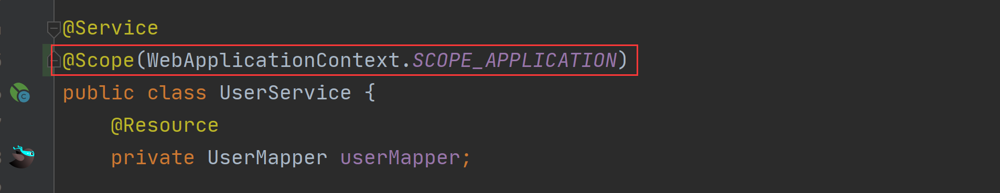

# [Bean 作用域是啥？它有几种类型？](https://www.cnblogs.com/vipstone/p/16641846.html)

Spring 框架作为一个管理 Bean 的 IoC 容器，那么 Bean 自然是 Spring 中的重要资源了，那 Bean 的作用域是什么意思？又有几种类型呢？接下来我们一起来看。

> PS：Java 中的公共类可称之为 Bean 或 Java Bean。

## 1.作用域

**Bean 的作用域是指 Bean 在 Spring 整个框架中的某种行为模式。比如 singleton 单例作用域，就表示 Bean 在整个 Spring 中只有一份，它是全局共享的，当有人修改了这个值之后，那么另一个人读取到的就是被修改后的值**。
举个例子，比如我们在 Spring 中定义了一个单例的 Bean 对象 user（默认作用域为单例），具体实现代码如下：

```java
@Component
public class UserBean {
    @Bean
    public User user() {
        User user = new User();
        user.setId(1);
        user.setName("Java"); // 此行为重点：用户名称为 Java
        return user;
    }
}
```


然后，在 A 类中使用并修改了 user 对象，具体实现代码如下：

```java
@Controller
public class AController {
    @Autowired
    private User user;
    public User getUser() {
        User user = user;
        user.setName("MySQL"); // 此行为重点：将 user 名称修改了
        return user;
    }
}
```


最后，在 B 类中也使用了 user 对象，具体实现代码如下：

```java
@Controller
public class BController {
    @Autowired
    private User user;
    public User getUser() {
        User user = user;
        return user;
    }
}
```


此时我们访问 B 对象中的 getUser 方法，就会发现此时的用户名为 A 类中修改的“MySQL”，而非原来的“Java”，这就说明 Bean 对象 user 默认就是单例的作用域。如果有任何地方修改了这个单例对象，那么其他类再调用就会得到一个修改后的值。

## 2.作用域分类

在 Spring 中，Bean 的常见作用域有以下 5 种：

1. singleton：单例作用域；
2. prototype：原型作用域（多例作用域）；
3. request：请求作用域；
4. session：会话作用域；
5. application：全局作用域。

**注意：后 3 种作用域，只适用于 Spring MVC 框架。**

### 2.1 singleton

- 官方说明：(Default) Scopes a single bean definition to a single object instance for each Spring IoC container.
- 描述：该作用域下的 Bean 在 IoC 容器中只存在一个实例：获取 Bean（即通过 applicationContext.getBean等方法获取）及装配 Bean（即通过 [@Autowired](https://github.com/Autowired) 注入）都是同一个对象。
- 场景：通常**无状态**的 Bean 使用该作用域。无状态表示 Bean 对象的属性状态不需要更新。
- 备注：**Spring 默认选择该作用域。**

### 2.2 prototype

- 官方说明：Scopes a single bean definition to any number of object instances.
- 描述：每次对该作用域下的 Bean 的请求都会创建新的实例：获取 Bean（即通过 applicationContext.getBean 等方法获取）及装配 Bean（即通过 [@Autowired](https://github.com/Autowired) 注入）都是新的对象实例。
- 场景：通常**有状态**的 Bean 使用该作用域。

### 2.3 request

- 官方说明：Scopes a single bean definition to the lifecycle of a single HTTP request. That is, each HTTP request has its own instance of a bean created off the back of a single bean definition. Only valid in the context of a web-aware Spring ApplicationContext.
- 描述：每次 Http 请求会创建新的 Bean 实例，类似于 prototype。
- 场景：一次 Http 的请求和响应的共享 Bean。
- 备注：限定 Spring MVC 框架中使用。

### 2.4 session

- 官方说明：Scopes a single bean definition to the lifecycle of an HTTP Session. Only valid in the context of a web-aware Spring ApplicationContext.
- 描述：在一个 Http Session 中，定义一个 Bean 实例。
- 场景：用户会话的共享 Bean, 比如：记录一个用户的登陆信息。
- 备注：限定 Spring MVC 框架中使用。

### 2.5 application

- 官方说明：Scopes a single bean definition to the lifecycle of a ServletContext. Only valid in the context of a web-aware Spring ApplicationContext.
- 描述：在一个 Http Servlet Context 中，定义一个 Bean 实例。
- 场景：Web 应用的上下文信息，比如：记录一个应用的共享信息。
- 备注：限定 Spring MVC 框架中使用。

## 3.作用域设置

我们可以通过 [@scope](https://github.com/scope) 注解来设置 Bean 的作用域，它的设置方式有以下两种：

1. 直接设置作用域的具体值，如：[@scope](https://github.com/scope)("prototype")；
2. 设置 ConfigurableBeanFactory 和 WebApplicationContext 提供的 SCOPE_XXX 变量，如 [@scope](https://github.com/scope)(ConfigurableBeanFactory.SCOPE_PROTOTYPE)。

具体设置代码如下：




## 总结

Bean 的作用域是指 Bean 在 Spring 整个框架中的某种行为模式。Bean 的常见作用域有 5 种：singleton（单例作用域）、prototype（原型作用域）、request（请求作用域）、session（请求作用域）、application（全局作用域），注意后 3 种作用域只适用于 Spring MVC 框架。