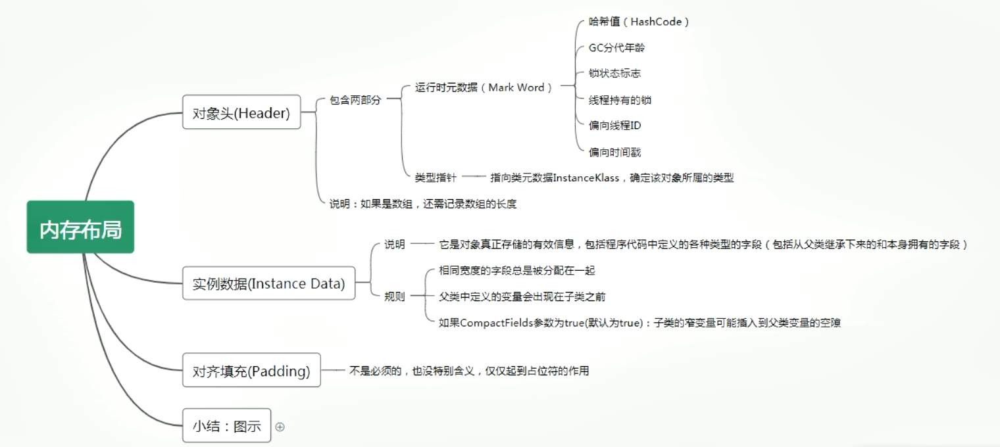
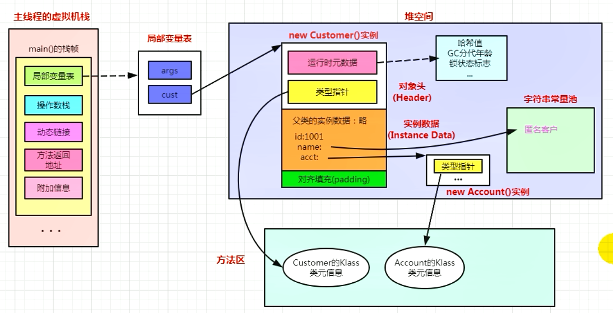
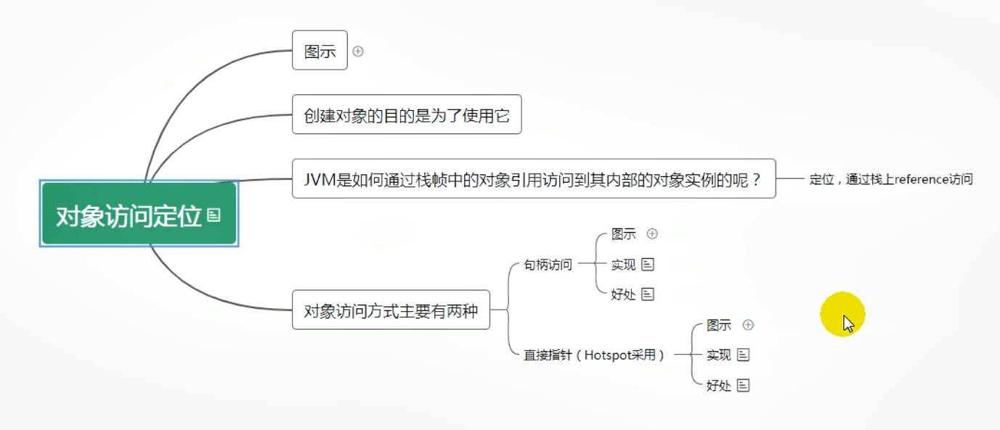
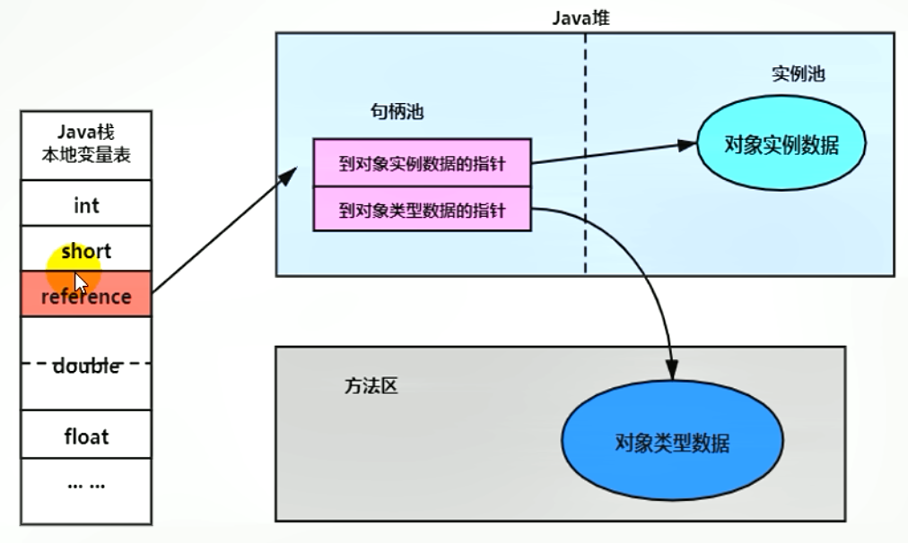

### Java - 底层建筑 - JVM - 第10篇 - 对象的实例化内存布局与访问定位

#### 对象的的实例化


- 实例代码

```java
package cn.icanci.jvm.metaspace;

/**
 * @Author: icanci
 */
public class ObjectTest {
    public static void main(String[] args) {
        ObjectTest objectTest = new ObjectTest();
    }
}

```

- Javap命令反编译

```java
Classfile /E:/IdeaHome/maven/jvm/target/classes/cn/icanci/jvm/metaspace/ObjectTest.class
  Last modified 2020-8-23; size 461 bytes
  MD5 checksum 250e31f1cead14786c196d7e3b3c3fc0
  Compiled from "ObjectTest.java"
public class cn.icanci.jvm.metaspace.ObjectTest
  minor version: 0
  major version: 52
  flags: ACC_PUBLIC, ACC_SUPER
Constant pool:
   #1 = Methodref          #4.#19         // java/lang/Object."<init>":()V
   #2 = Class              #20            // cn/icanci/jvm/metaspace/ObjectTest
   #3 = Methodref          #2.#19         // cn/icanci/jvm/metaspace/ObjectTest."<init>":()V
   #4 = Class              #21            // java/lang/Object
   #5 = Utf8               <init>
   #6 = Utf8               ()V
   #7 = Utf8               Code
   #8 = Utf8               LineNumberTable
   #9 = Utf8               LocalVariableTable
  #10 = Utf8               this
  #11 = Utf8               Lcn/icanci/jvm/metaspace/ObjectTest;
  #12 = Utf8               main
  #13 = Utf8               ([Ljava/lang/String;)V
  #14 = Utf8               args
  #15 = Utf8               [Ljava/lang/String;
  #16 = Utf8               objectTest
  #17 = Utf8               SourceFile
  #18 = Utf8               ObjectTest.java
  #19 = NameAndType        #5:#6          // "<init>":()V
  #20 = Utf8               cn/icanci/jvm/metaspace/ObjectTest
  #21 = Utf8               java/lang/Object
{
  public cn.icanci.jvm.metaspace.ObjectTest();
    descriptor: ()V
    flags: ACC_PUBLIC
    Code:
      stack=1, locals=1, args_size=1
         0: aload_0
         1: invokespecial #1                  // Method java/lang/Object."<init>":()V
         4: return
      LineNumberTable:
        line 6: 0
      LocalVariableTable:
        Start  Length  Slot  Name   Signature
            0       5     0  this   Lcn/icanci/jvm/metaspace/ObjectTest;

  public static void main(java.lang.String[]);
    descriptor: ([Ljava/lang/String;)V
    flags: ACC_PUBLIC, ACC_STATIC
    Code:
      stack=2, locals=2, args_size=1
         0: new           #2                  // class cn/icanci/jvm/metaspace/ObjectTest
         3: dup
         4: invokespecial #3                  // Method "<init>":()V
         7: astore_1
         8: return
      LineNumberTable:
        line 8: 0
        line 9: 8
      LocalVariableTable:
        Start  Length  Slot  Name   Signature
            0       9     0  args   [Ljava/lang/String;
            8       1     1 objectTest   Lcn/icanci/jvm/metaspace/ObjectTest;
}
SourceFile: "ObjectTest.java"

Process finished with exit code 0

```

#### 对象创建的六个步骤

##### 判断对象的对应的类是否加载、链接、初始化

- 虚拟机遇到一条new指令，首先要去检查这个指令的参数能否在Metaspace的常量池中定位到一个类的符号引用，并且检查这个符号引用代表的类是否已经被加载、解析、和初始化（即判断类元信息是否存在），如果没有，那么在双亲委派机制模式下，使用当前类加载器以及ClassLoader+全限定名为key查找对应的class文件，如果没有找到文件，就抛出 ClassNotFoundException异常。如何找到，则进行类加载，并生成对应的Class类对象

##### 为对象分配内存

- 首先区计算对象占用空间的大小，接着在内存中划分一块内存给新的对象，如果实例成员变量是引用变量，仅仅分配引用变量空间即可，也就是4个字节大小
- **如果内存规整**
  - 指针碰撞
    - 如果内存是规整的，那么虚拟机将采用指针碰撞法（Bump The Pointer）来为对象分配内存
    - 意思是所有用过的内存在一边，空闲的内存在另一边，中间放着一个指针作为分界点的指示器，分配内存就仅仅是把指针向空闲的那边挪动一段与对象大小相等的举例罢了，如果垃圾回收器选择的是Serial、ParNew这种基于压缩算法的，虚拟机采用这种分配方式。一般使用带有compact（整理）过程的收集器的时候，使用指针碰撞
- **如果内存不规整**
  - 虚拟机需要维护一个列表
  - 空闲列表分配
  - 如果对象不是规整的，已经使用的内存和未使用的内存相互交错，那么虚拟机将采用的是空闲列表法来为对象分配内存。意思是虚拟机维护了一个列表，记录上哪些内存是可用的吗，再分配的时候从列表中找到一块足够大的空间划分给对象实例，并更新列表上的内容，这种分配方式成为“空闲列表（Free List）”

##### 处理并发安全问题

- 采用CAS失败重试、区域加锁保证更新的原子性
- 每个线程预先分配一块TLAB - 通过-XX:+/-UseTLAB参数来设定

##### 初始化分配到的空间

- 所有属性是设置默认时值，保证对象实例字段再不赋值的时候可以直接使用
  - 属性的默认初始化
  - 显示初始化 （执行init方法进行初始化）
  - 代码块中初始化（执行init方法进行初始化）
  - 构造器中初始化（执行init方法进行初始化）

##### 设置对象的对象头

- 将对象的所属类（即类的元数据信息）、对象的HashCode和对象的GC信息、锁信息、等数据存储再对象的对象头中。在这个过程具体设置方式取决于JVM的实现

##### 执行init方法进行初始化

- 在Java程序员的视角看来，初始化才正式开始。初始化成员变量、执行实例化代码块，调用类的构造方法，并把堆内对象首地址赋值给引用变量
- 因此一般来说（由字节码中是否跟随着有 invokespecial指令决定），new指令之后会执行方法，把对象按照程序员的意愿进行初始化，这样一个真正的可用的对象才算完全的创建出来

#### 对象的内存布局



##### 对象头（Header）

- 运行时元数据（Mark World）
  - 哈希值
  - GC分代年龄
  - 锁状态标志
  - 线程持有的锁
  - 偏向线程ID
  - 偏向时间戳
- 类型指针
  - 指向类元素数据的InstanceClass，确定该对象的所属类型
- 注意：如果是数组，还要记录数组的长度

##### 实例数据（Instance Data）

- 它是对象真正存储的有效信息，包括程序代码中定义的各种类型的字段（包括从父类继承下来的和本身拥有的字段）
- 规则
  - 相同宽度的字段总是被分配到一起
  - 父类中定义的变量会出现在子类之前
  - 如果CompactFields参数为true（默认为true）：子类的窄变量可能插入到父类变量的空隙

##### 对齐填充（Padding）

- 不是必须的，也没有特殊的含义，仅仅是占位符

##### 图示

```java
package cn.icanci.jvm.metaspace;

/**
 * @Author: icanci
 */
public class Customer {
    int id = 1001;
    String name;
    Account acct;

    {
        name = "匿名用户";
    }

    public Customer() {
        acct = new Account();
    }
}

class Account {

}
```

```java
package cn.icanci.jvm.metaspace;

/**
 * @Author: icanci
 */
public class ConsumerTest {
    public static void main(String[] args) {
        Customer customer = new Customer();
    }
}

```




#### 对象的访问定位

- JVM是如何通过栈帧中的对象引用访问到其内部的对象实例呢?


**对象访问定位**



**句柄访问**

- 优点：reference中存储稳定句柄地址，对象被移动（垃圾收集时候移动对象很普遍）时会改变句柄中的实例数据指针即可，reference本身不需要被修改

- 缺点：需要多占用一些空间



**直接指针访问**


