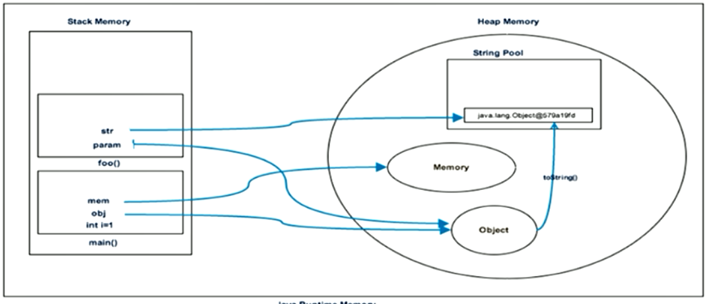
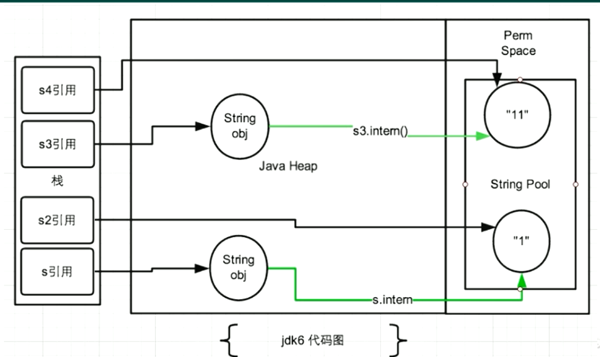
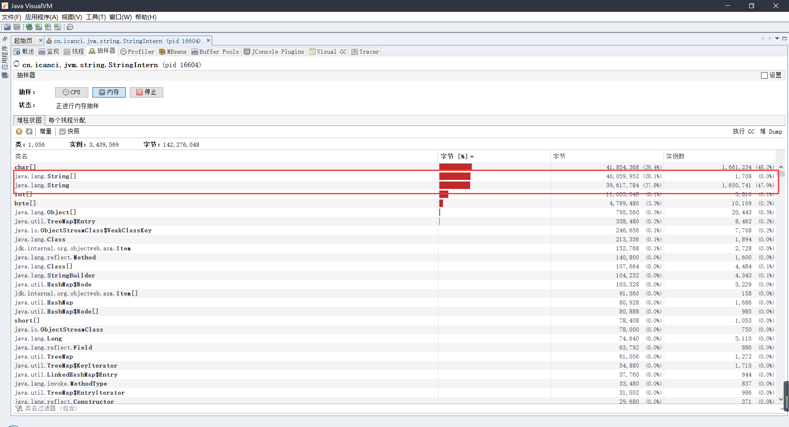

### Java - 底层建筑 - JVM - 第13篇 - StringTable

#### String的基本特性

- String：字符串，使用一对 "" 引起来表示
  - String s1 = "hello";
  - String s2 = new String("hello");
- String：声明为final的，不可被继承
- String 实现了Serializable接口：表示字符串是支持序列化的，实现了Comparable接口：表示String可以比较大小
- 在JDK8以及之前，String内部定义了**final char[] value** 用来存储字符串数据，JDK9之后使用 **byte[]**

- String：代表不可变的字符序列。简称：不可变性
  - 当对字符串重新赋值的时候，需要重写指定内存区域赋值，而不是修改原有的value进行赋值
  - 不能对现有的字符串进行连接操作，也需要重新指定内存区域，不是修改原有的value进行赋值
  - 当调用String的replace()方法修改指定字符或者字符串的时候，也需要重新指定内存区域赋值，不能使用原有的value赋值
- 通过字面量的方式（区别于new）给一个字符串赋值，此时的字符串声明在常量池中

- **字符串常量池中是不会存储相同内容的字符串的**
- String的String Pool 是一个固定大小的HashTable 默认长度为1009，如果放进去String Pool 的String非常多，就会造成Hash冲突严重，从而导致链表很长，而链表长了之后，会直接影响调用 String.intern()的性能
- 使用 **-XX:StringTableSize** 可设置StringTable的长度
- 在JDK6中的StringTable是固定的，就是1009的长度，如果字符串常量池中的字符串过多就会导致效率下降很快，StirngTableSize设置没有要求
- 在JDK7中，StringTable的默认长度为 60013，JDK7没有要求
- JDK8开始1009 是可设置的最小值 
- Stirng#intern()方法：如果字符串常量池中没有对应的字符串的话，就添加在常量池

#### String的内存分配

- 在Java语言中有8种基本数据类型和String，这些类型为了使它们在运行速度中更快，更节省内存。都提供了常量池
- 常量池就相似于一个Java系统级别提供的缓存。8中基本类型都是系统协调的，**String类型的常量池比较特殊，主要的使用方法有2种**
  - 直接使用双引号声明String的对象会直接存储在常量池种
  - 如果不是使用双引号声明的String对象，可以使用String提供的intern() 方法

- 在JDK6以及以前，字符串常量池存放在永久代
- JDK7种Oracle对字符串池的逻辑做了很大的改变，将 **字符串常量池的位置调整到Java堆内**
  - 所有的字符串都保存在堆中，和其他普通对象一样，这样可以让你在进行调优的时候仅仅需要调整堆大小就可以了
  - 字符串常量池的概念原本使用的比较多，但是这个改动使得我们有足够的理由考虑使用String.intern();
- Java8元空间，字符串常量在堆

- **StringTable为什么需要调整**
  - 之前的永久代比较小，放大量的字符串，会占用很大的空间
  - 永久代垃圾回收的频率很低

- Java语言规范要求完全相同的字符字面常量，应该包含同样的Unicode字符序列，并且必须是指向同一个String类实例

```java
package cn.icanci.jvm.string;

/**
 * @Author: icanci
 */
public class Memory {
    public static void main(String[] args) {
        int i = 1;
        Object obj = new Object();
        Memory mem = new Memory();
        mem.foo(obj);
    }

    public void foo(Object param) {
        String str = param.toString();
        System.out.println(str);
    }
}

```



#### 字符串的拼接操作

- **常量与常量**的拼接结果在常量池，原理是编译期优化
- 常量池中不会存在相同内容的常量
- **只要其中有一个是变量，结果就在堆中**。变量拼接的原理是StringBuilder
- 如果拼接的结果调用intern()方法，则主动将常量池中还没有的字符串对象放入池中，并返回此对象的地址

#### 拼接操作的原理

- 实例代码

```java
package cn.icanci.jvm.string;

/**
 * @Author: icanci
 */
public class CreateStringDemo {
    public static void main(String[] args) {
        String str = "hello ";
        String str2 = "world";
        String s = str + str2;
        System.out.println(s);
    }
}

```

-  javap 反编译之后的字节码

```java
 0 ldc #2 <hello >
 2 astore_1
 3 ldc #3 <world>
 5 astore_2
 6 new #4 <java/lang/StringBuilder>
 9 dup
10 invokespecial #5 <java/lang/StringBuilder.<init>>
13 aload_1
14 invokevirtual #6 <java/lang/StringBuilder.append>
17 aload_2
18 invokevirtual #6 <java/lang/StringBuilder.append>
21 invokevirtual #7 <java/lang/StringBuilder.toString>
24 astore_3
25 getstatic #8 <java/lang/System.out>
28 aload_3
29 invokevirtual #9 <java/io/PrintStream.println>
32 return

```

- **String拼接的原理**：只要是变量，就先创建一个StringBuilder对象，然后调用StringBuilder的append()方法，分别拼接两个字符串，拼接结束之后，调用StringBuilder的toString()方法，返回为新的字符串
  - 在JDK5.0之前使用的是StringBuffer进行拼接，在JDK5.0之后，StringBuilder出现，然后使用了StringBuilder来拼接
- 拼接的实际操作如下

```java
StringBuilder sb = new StringBuilder();
sb.append("hello ");
sb.append("world");
sb.toString(); // 类似于 new String("hello world");
```

- 字符串拼接操作，不一定是使用的是StringBuilder，如果两边都是final的字符串常量或者常量引用，仍然使用编译器优化，此时不使用StringBuilder的方式
- 针对final修饰类、方法、基本数据类型、引用数据类型的量的结果的时候，能使用fianl就使用final

- 在使用StringBuilder和StringBuffer的时候，如果已知具体的大小，可以进行有参构造函数，创建一个指定初始大小的数组，可以避免返回扩容转移数组，耗费空间和资源

#### intern() 的使用

- 如果不是双引号声明的String对象，可以使用String提供的intern方法：intern方法会从字符串常量池中查询当前字符串是否存在，若不存在，就会将当前字符串放入常量池中
  - String myInfo = new String("icanci.cn").intern();
- 也就是说，如果在任意字符串上调用String#intern方法，那么其返回结果所指向的哪个类实例，必须和直接以常量形式出现的字符串实例完全相同。因此，下列表达式的值必为true
  - ("a"+"b"+"c").intern() == "abc"
- 通俗点讲，Interned String 就是确保字符串在内存中只有一份拷贝，这样可以节约内存空间，加快字符串操作任务的执行速度。注意：这个值会被存放在字符串内部池（String Intern Pool）
- 只要字符串对象调用了 intern() 方法，那么返回值是指向字符串常量池中的数据

- 实例代码

```java
package cn.icanci.jvm.string;

/**
 * @Author: icanci
 */
public class StringInternDemo {
    public static void main(String[] args) {
        String s = new String("1");
        s.intern();
        String s2 = new String("1");
        System.out.println(s == s2);
        String s3 = new String("1") + new String("2");
        s3.intern();
        String s4 = "11";
        System.out.println(s3 == s4);
    }
}

// 打印结果
// false
// false
```

- **题目**
- new String("ab") 会创建几个对象？

```java
package cn.icanci.jvm.string;

/**
 * @Author: icanci
 */
public class StringNewDemo {
    public static void main(String[] args) {
        String ab = new String("ab");
    }
}

```

```java
 0 new #2 <java/lang/String>
 3 dup
 4 ldc #3 <ab>
 6 invokespecial #4 <java/lang/String.<init>>
 9 astore_1
10 return

```

- 从上面反编译看出，创建了两个对象，一个放在堆中，一个放在了字符串常量池  ldc指令	
- 如果之前常量池是有的，就字符串的值就直接引用到此常量

- new String("a") + new String("b") 创建了几个对象

```java
package cn.icanci.jvm.string;

/**
 * @Author: icanci
 */
public class StringNewDemo {
    public static void main(String[] args) {
        String ab = new String("b") + new String("b");
    }
}

```

```java
 0 new #2 <java/lang/StringBuilder>
 3 dup
 4 invokespecial #3 <java/lang/StringBuilder.<init>>
 7 new #4 <java/lang/String>
10 dup
11 ldc #5 <b>
13 invokespecial #6 <java/lang/String.<init>>
16 invokevirtual #7 <java/lang/StringBuilder.append>
19 new #4 <java/lang/String>
22 dup
23 ldc #5 <b>
25 invokespecial #6 <java/lang/String.<init>>
28 invokevirtual #7 <java/lang/StringBuilder.append>
31 invokevirtual #8 <java/lang/StringBuilder.toString>
34 astore_1
35 return

```

- 创建了哪些对象
  - new StringBuilder()
  - new String("a")
  - 常量池中的 "a"
  - new String("b")
  - 常量池中的 "b"
- 深入刨析StringBuilderd的toString()方法
  - 对象 new String("ab")
  - **注意：toString()方法的调用，在字符串常量池中没有生成 "ab"**

- 实例代码 

```java
package cn.icanci.jvm.string;

/**
 * @Author: icanci
 */
public class StringInternDemo {
    public static void main(String[] args) {
        String s = new String("1");
        // 调用此方法之前，字符串常量池已经有了 "1"
        s.intern();
        // 此时 s 指的是堆空间的地址
        // 此时 s2 指向的是常量池中的地址
        String s2 = "1";
        // JDK6：false
        // JDK7/8：false
        System.out.println(s == s2);
        // 因为 new String("1") + new String("1"); 这个过程没有把"11"放在常量池
        // 此时 s3 的地址就是相当于 new String("11"); 字符串常量池没有"11"
        String s3 = new String("1") + new String("1");
        // 在字符串常量池生成"11"
        // 这个"11"如何理解
        // 在JDK6中就是创建了一个新的对象
        // 在JDK7中，调用 s3.intern(),字符串常量池中 "11"的值就是创建对象的地址
        s3.intern();
        // 使用的是上一行代码执行时，在常量池中生成的"11" 的地址
        String s4 = "11";
        // JDK6：false
        // JDK7/8：true
        System.out.println(s3 == s4);
    }
}

```

- 反编译

```java
 0 new #2 <java/lang/String>
 3 dup
 4 ldc #3 <1>
 6 invokespecial #4 <java/lang/String.<init>>
 9 astore_1
10 aload_1
11 invokevirtual #5 <java/lang/String.intern>
14 pop
15 ldc #3 <1>
17 astore_2
18 getstatic #6 <java/lang/System.out>
21 aload_1
22 aload_2
23 if_acmpne 30 (+7)
26 iconst_1
27 goto 31 (+4)
30 iconst_0
31 invokevirtual #7 <java/io/PrintStream.println>
34 new #8 <java/lang/StringBuilder>
37 dup
38 invokespecial #9 <java/lang/StringBuilder.<init>>
41 new #2 <java/lang/String>
44 dup
45 ldc #3 <1>
47 invokespecial #4 <java/lang/String.<init>>
50 invokevirtual #10 <java/lang/StringBuilder.append>
53 new #2 <java/lang/String>
56 dup
57 ldc #3 <1>
59 invokespecial #4 <java/lang/String.<init>>
62 invokevirtual #10 <java/lang/StringBuilder.append>
65 invokevirtual #11 <java/lang/StringBuilder.toString>
68 astore_3
69 aload_3
70 invokevirtual #5 <java/lang/String.intern>
73 pop
74 ldc #12 <11>
76 astore 4
78 getstatic #6 <java/lang/System.out>
81 aload_3
82 aload 4
84 if_acmpne 91 (+7)
87 iconst_1
88 goto 92 (+4)
91 iconst_0
92 invokevirtual #7 <java/io/PrintStream.println>
95 return

```



- 练习

```java
package cn.icanci.jvm.string;

/**
 * @Author: icanci
 */
public class StringInternDemo2 {
    public static void main(String[] args) {
        // 拓展
        // 执行完之后，字符串常量池不存在 "11" 
        String s3 = new String("1") + new String("1");
        // 在字符串常量池生成 "11"
        String s4 = "11";
        String s5 = s3.intern();
        System.out.println(s3 == s4);
        System.out.println(s4 == s5);
    }
}


// 打印
// false
// true
```

**总结**

- jdk6中，将这个字符串对象尝试放入串池
  - 如果串池中有，则不会放入，返回已有的串池中的对象的地址
  - 如果没有，**会把此对象复制一份**，放入串池，并返回串池中的对象地址
- jdk7中，将这个字符串对象尝试放入串池
  - 如果串池中有，则并不会放入。返回已有的串池中的对象的地址
  - 如果没有，**会把此对象的引用地址复制一份**，放入串池，并返回串池中引用地址地址


#### intern()的空间效率测试：空间角度

- 实例代码

```java
package cn.icanci.jvm.string;

/**
 * @Author: icanci
 */
public class StringIntern {
    static final int MAX_COUNT = 1000 * 10000;
    static final String[] arr = new String[MAX_COUNT];

    public static void main(String[] args) {
        Integer[] data = {1, 2, 3, 4, 5, 6, 7, 8, 9, 1};
        long start = System.currentTimeMillis();
        for (int i = 0; i < MAX_COUNT; i++) {
            // 花费的时间：2815 ms String 实例 1000W
            // arr[i] = new String(String.valueOf(data[i % data.length]));
            // 花费的时间：1304 ms
            arr[i] = new String(String.valueOf(data[i % data.length])).intern();
        }
        long end = System.currentTimeMillis();
        System.out.println("花费的时间：" + (end - start) + " ms");
        try {
            Thread.sleep(1000000);
        } catch (InterruptedException e) {
            e.printStackTrace();
        }
    }

}

```




- 对于程序中大量的重复的字符串，可以使用intern() 方法节省空间

- 大的社交网站，需要内存中存储大量的字符串。如果都调用 intern() 方法，就会明显降低内存的大小

#### StringTable的垃圾回收

- 实例代码

```java
package cn.icanci.jvm.string;

/**
 * @Author: icanci
 *
 * VM: -Xms15m -Xmx15m -XX:+PrintStringTableStatistics -XX:+PrintGCDetails
 */
public class StringGCTest {
    public static void main(String[] args) {
        for (int i = 0; i < 100; i++) {
            String.valueOf(i).intern();
        }
    }
}

```

- 控制台结果

```java
Heap
 PSYoungGen      total 4608K, used 2079K [0x00000000ffb00000, 0x0000000100000000, 0x0000000100000000)
  eden space 4096K, 50% used [0x00000000ffb00000,0x00000000ffd07f58,0x00000000fff00000)
  from space 512K, 0% used [0x00000000fff80000,0x00000000fff80000,0x0000000100000000)
  to   space 512K, 0% used [0x00000000fff00000,0x00000000fff00000,0x00000000fff80000)
 ParOldGen       total 11264K, used 0K [0x00000000ff000000, 0x00000000ffb00000, 0x00000000ffb00000)
  object space 11264K, 0% used [0x00000000ff000000,0x00000000ff000000,0x00000000ffb00000)
 Metaspace       used 3494K, capacity 4498K, committed 4864K, reserved 1056768K
  class space    used 387K, capacity 390K, committed 512K, reserved 1048576K
SymbolTable statistics:
Number of buckets       :     20011 =    160088 bytes, avg   8.000
Number of entries       :     14191 =    340584 bytes, avg  24.000
Number of literals      :     14191 =    604960 bytes, avg  42.630
Total footprint         :           =   1105632 bytes
Average bucket size     :     0.709
Variance of bucket size :     0.713
Std. dev. of bucket size:     0.844
Maximum bucket size     :         6
StringTable statistics:
Number of buckets       :     60013 =    480104 bytes, avg   8.000
Number of entries       :      1876 =     45024 bytes, avg  24.000
Number of literals      :      1876 =    163400 bytes, avg  87.100
Total footprint         :           =    688528 bytes
Average bucket size     :     0.031
Variance of bucket size :     0.031
Std. dev. of bucket size:     0.177
Maximum bucket size     :         2

Process finished with exit code 0

```

- 上述的情况没有发生GC
- 实例代码 增大数据量

```java
package cn.icanci.jvm.string;

/**
 * @Author: icanci
 *
 * VM: -Xms15m -Xmx15m -XX:+PrintStringTableStatistics -XX:+PrintGCDetails
 */
public class StringGCTest {
    public static void main(String[] args) {
        for (int i = 0; i < 100000; i++) {
            String.valueOf(i).intern();
        }
    }
}

```

- 执行结果

```java
[GC (Allocation Failure) [PSYoungGen: 4096K->488K(4608K)] 4096K->696K(15872K), 0.0063979 secs] [Times: user=0.00 sys=0.00, real=0.01 secs] 
Heap
 PSYoungGen      total 4608K, used 3802K [0x00000000ffb00000, 0x0000000100000000, 0x0000000100000000)
  eden space 4096K, 80% used [0x00000000ffb00000,0x00000000ffe3c950,0x00000000fff00000)
  from space 512K, 95% used [0x00000000fff00000,0x00000000fff7a020,0x00000000fff80000)
  to   space 512K, 0% used [0x00000000fff80000,0x00000000fff80000,0x0000000100000000)
 ParOldGen       total 11264K, used 208K [0x00000000ff000000, 0x00000000ffb00000, 0x00000000ffb00000)
  object space 11264K, 1% used [0x00000000ff000000,0x00000000ff034000,0x00000000ffb00000)
 Metaspace       used 3497K, capacity 4498K, committed 4864K, reserved 1056768K
  class space    used 387K, capacity 390K, committed 512K, reserved 1048576K
SymbolTable statistics:
Number of buckets       :     20011 =    160088 bytes, avg   8.000
Number of entries       :     14191 =    340584 bytes, avg  24.000
Number of literals      :     14191 =    604960 bytes, avg  42.630
Total footprint         :           =   1105632 bytes
Average bucket size     :     0.709
Variance of bucket size :     0.713
Std. dev. of bucket size:     0.844
Maximum bucket size     :         6
StringTable statistics:
Number of buckets       :     60013 =    480104 bytes, avg   8.000
Number of entries       :     61367 =   1472808 bytes, avg  24.000
Number of literals      :     61367 =   3495800 bytes, avg  56.965
Total footprint         :           =   5448712 bytes
Average bucket size     :     1.023
Variance of bucket size :     0.808
Std. dev. of bucket size:     0.899
Maximum bucket size     :         5

Process finished with exit code 0

```

#### G1的String去重操作

- 背景：对许多Java应用，（有大有小）做的测试结果得出以下结果
  - 堆存活数据集合里面的String对象占用了25%
  - 堆存活数据集合里面重复的对象有13.5%
  - String的平均长度时45
- 许多大规模的Java应用瓶颈在于内存，**Java堆中存活的数据集合差不多25是String对象，但是有一半是重复的，浪费了空间，所以有了G1对String的去重操作**

