### Java - 底层建筑 - JVM - 第17篇 - 垃圾回收器

#### GC分类与性能指标

##### GC分类

- 垃圾回收器没有在规范中进行过多的规定，可以由不同厂商、不同版本的JVM来实现
- 由于JDK的版本在高速迭代，现在已经有了很多版本
- 从不同角度分析垃圾回收器，可以将GC分为不同的类型

- **按照线程数分，可以分为串行垃圾回收器和并行垃圾回收器**


-  串行回收指的是在同一时间段内只允许有一个CPU用于执行垃圾回收操作，此时工作线程被暂停，直至垃圾收集工作结束
  - 在诸如但CPU处理器或者较小的应用内存等硬件平台不是特别优越的场合，串行回收器的性能表现可以超过并行回收器和并发回收器。所以 **串行回收默认被应用在客户端的Client模式下的JVM中**
  - 在并发能力较强的CPU上，并行回收器产生的停顿时间要短于串行回收器
- 和串行回收相反，并行收集可以运用多个CPU共同执行垃圾回收，因此提升了应用的吞吐量，不过并行回收仍然与串行回收一样，采用独占式，使用 “Stop the World”机制

- **按照工作模式分，可以分为并发式垃圾回收器和独占式垃圾回收器**
  - 并发式垃圾回收器与应用程序线程交替工作，以尽可能较少程序的停顿时间
  - 独占式垃圾回收器（Stop The World）一旦运行，就停止程序中所有的用户线程，直到垃圾回收过程完全结束

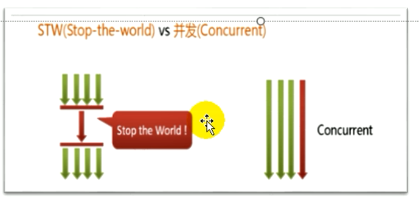

- **按照碎片处理方式分，可以分为压缩式垃圾回收器和非压缩式垃圾回收器**
  - 压缩式垃圾回收器会在回收完成之后，对存活的对象进行压缩整理，消除回收后的碎片
  - 非压缩式的垃圾回收器不进行这操作
- **按照工作的内部区间划分，又可以分为年轻代垃圾回收器和老年代垃圾回收器**

##### 性能指标

- **吞吐量：运行用户代码的时间占总运行时间的比例**
  - （总运行时间：程序的运行时间+内存回收的时间）
- 垃圾收集器开销：吞吐量的补数，垃圾收集所有时间与总运行时间的比例
- **暂停时间：执行垃圾回收的时候，程序的工作线程被暂停的时间**
- 收集频率：相对于应用程序的执行，收集操作发生的频率
- **内存占用：Java堆区所占用的内存大小**
- 快速：一个对象从诞生到回收所经历的时间

- **吞吐量、暂停时间、内存占用 共同构成了一个“不可能三角”**
- 简单来说：吞吐量、暂停时间

###### 评估GC的性能指标：吞吐量（Throughput）

- 吞吐量就是CPU用于运行用户代码的时间与CPU总消耗时间的比值，即吞吐量 = 运行用户代码时间 / 
  （用户代码时间 + 垃圾收集时间）
  - 虚拟机运行100分钟，垃圾收集1分钟，那么吞吐量就是 99%
- 这种情况下，应用程序能容忍比较高的暂停时间，因此，高吞吐量的应用程序有更长的时间基准，快速响应式不必考虑的
- 吞吐量优先，意外着在单位时间内，STW的时间最短：0.2+02 = 0.4


###### 评估GC的性能指标：暂停时间（pause time）

- 暂停时间 式指一个时间段内应用程序线程暂停，让GC执行的状态
  - GC期间100毫秒的暂停时间，说明这100毫秒期间没有任何应用程序是活动的
- 暂停时间优先 意味着让单次 STW的时间最短，0.1+0.1+0.1+0.1+0.1 = 0.5

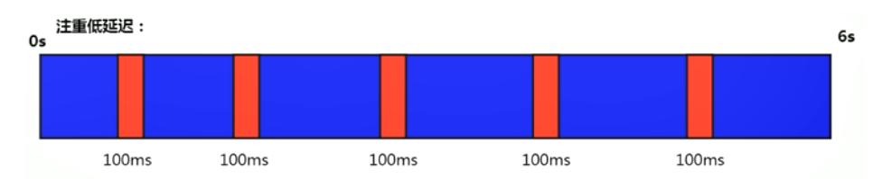

###### 吞吐量和暂停时间的对比

- 高吞吐量较好是因为让程序的最终用户感觉只有用户程序在做“生产性”工作，直觉上，吞吐量越高程序运行越快
- 低暂停时间（低延迟）较好因此从最终用户的角度看不管是GC还是其他原因导致一个应用被挂起始终是不好的，这取决于应用程序的类型，**有时候甚至短暂的200毫秒都可能打断用户的体验**，所以对于一个**交互式应用程序**具有低的较大的暂停时间是很有必要的
- 然后高吞吐量和低暂停时间是一对相互竞争的目标（矛盾）
- 在设计或者使用GC算法的时候，我们必须确定我们的目标：一个GC算法只能针对两个目标之一，或者尝试找到一个二者的折中
- 现在标准：**在最大吞吐量优先的情况下，降低停顿时间**

###### 关于GC控制台打印的一些参数说明

```markdown
jstat -gc 2764 250 20   //2764表示进程id ，250表示250毫秒打印一次 ，20表示一共打印20次
S0C：第一个幸存区的大小
S1C：第二个幸存区的大小
S0U：第一个幸存区的使用大小
S1U：第二个幸存区的使用大小
EC：伊甸园区的大小
EU：伊甸园区的使用大小
OC：老年代大小
OU：老年代使用大小
MC：方法区大小
MU：方法区使用大小
CCSC:压缩类空间大小
CCSU:压缩类空间使用大小
YGC：年轻代垃圾回收次数
YGCT：年轻代垃圾回收消耗时间
FGC：老年代垃圾回收次数
FGCT：老年代垃圾回收消耗时间
GCT：垃圾回收消耗总时间
```

#### 不同的垃圾回收器概述

- 垃圾收集器是Java的招牌能力 极大的提高了开发效率，这也是面试的重点
- **虚拟机发展历史**
  - 1999年随JDK1.3.1一起来的是串行方式的Serial Gc ，它是第一款GC。ParNew垃圾收集器是serial收集器的多线程版本
  - 2002年2月26日，Parallel Gc和concurrent Mark SweepGC跟随JDK1.4.2—起发布
  - Parallel Gc在JDK6之后成为HotSpot默认GC。
  - 2012年，在JDK1.7u4版本中，G1可用。
  - 2017年，JDK9中G1变成默认的垃圾收集器，以替代CMS。
  - 2018年3月，JDK10中G1垃圾回收器的并行完整垃圾回收，实现并行性来改善最坏情况下的延迟。
  - 2018年9月，JDK11发布。引入Epsilon垃圾回收器，又被称为"No-Op(无操作)" S回收器。同时，引入ZGC:可伸缩的低延迟垃圾回收器(Experimental)。
  - 2019年9月，JDK13发布。增强ZGC，自动返回未用堆内存给操作系统。
  - 2020年3月，JDK14发布。删除CMS垃圾回收器。扩展ZGC在macoS和windows上的应用

**7款经典垃圾收集器**（在JDK11的ZGC之前）

- 串行回收器：Serial、Serial Old
- 并行收集器：ParNew、Parallel、Scavenge、Parallel Old
- 并发回收器：CMS、G1

#### 垃圾回收器的组合关系

**7款经典垃圾回收器与垃圾分代之间的关系**


- 新生代收集器：Serial、ParNew、Parallel 、Scavenge
- 老年代收集器：Serial Old、Parallel Old、CMS
- 整堆收集器：G1

**组合关系**

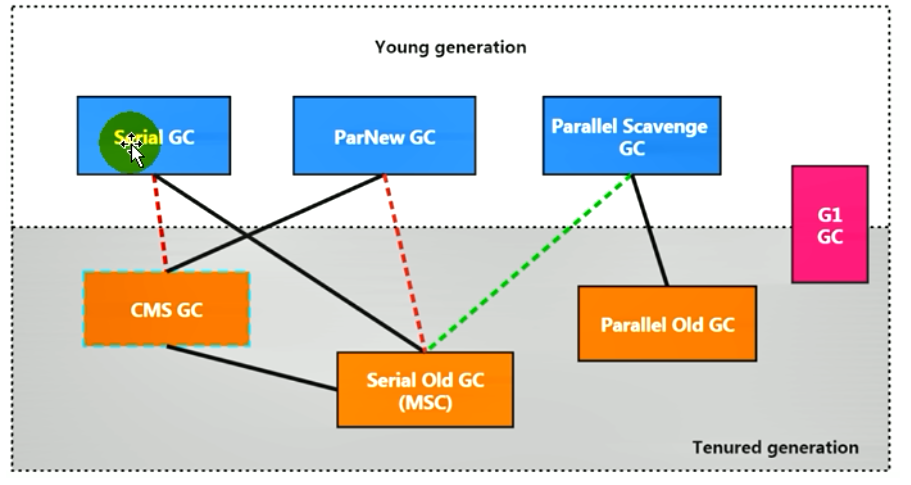

- 两个收集器间有连线，表明它们可以搭配使用:

  - Serial/Serial old、Seria1/CMS、ParNew/Serial old、ParNew/CMS、Parallel Scavenge/Serial old、Parallel Scavenge/Parallel old、G1;
  - 其中serial old作为CMS出现"concurrent Mode Failure"失败的后备预案。

  - (红色虚线)由于维护和兼容性测试的成本，在JDK 8时将serial+CMS、ParNew+Serial old这两个组合声明为废弃（JEP 173），并在JDK 9中完全取消了，这些组合的支持（EP214），即:移除。
  - (绿色虚线)JDK14中:弃用Parallel Scavenge和Serial0ld Gc组合(JEP336)
  - （青色虚线)DK 14中:]删除CMS垃圾回收器(EP 363)

- 为什么要有很多收集器，一个不够吗?闳为Java的使用场景很多，移动端，服务器等。所以就需要针对不同的场景，提供不同的垃圾收集器，提高垃圾收集的性能。
- 虽然我们会对各个收集器进行比较，但并非为了挑选一个最好的收集器出来。没有一种放之四海皆准、任何场景下都适用的完美收集器存在，更加没有万能的收集器。所以**我们选择的只是对具体应用最合适的收集器。**

#### 查看默认的垃圾收集器

- -XX:+PrintCommandLineFlags 查看命令行参数，包括使用的垃圾收集器 JDK8没有使用G1收集器，JDK9才开始

```java
-XX:InitialHeapSize=266668608 -XX:MaxHeapSize=4266697728 -XX:+PrintCommandLineFlags -XX:+UseCompressedClassPointers -XX:+UseCompressedOops -XX:-UseLargePagesIndividualAllocation -XX:+UseParallelGC 
```

- 执行命令行指令：jinfo -flag 相关垃圾回收器参数 进程id


#### Serial回收器 - 串行回收

- Serial收集器是最基本、历史最悠久的垃圾收集器了。JDK1.3之前回收新生代唯一的选择
- Serial收集器作为Hotspot中Client模式下的默认新生代垃圾收集器
- **Serial收集器采用复制算法、串行回收和”Stop-the-world“ 机制的方式执行内存回收**
- 除了年轻代之外，Serial收集器还提供用于执行老年代垃圾收集的Serial Old收集器。**Serial Old 收集器同样采用了串行回收和”Stop the World“机制 只不过内存回收算法使用的是 标记-压缩算法**
  - Serial Old 是运行在Client模式下默认的老年代垃圾收集器
  - Serial Old 在Server模式下主要有两个用途
    - 与新生代的Parallel Scavenge 配合使用
    - 作为老年代CMS收集器的后备垃圾收集方案

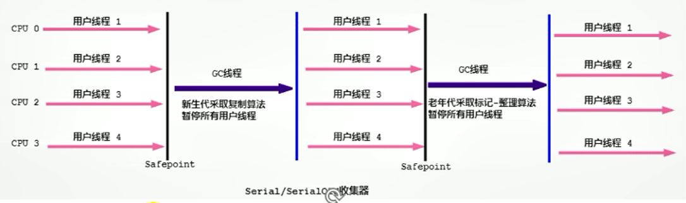

- 这个收集器是一个单线程的收集器，但它的”单线程“的意义并不仅仅说明它 **只会使用一个CPU或一条收集线程去完成垃圾收集工作**，更重要的是在它进行垃圾收集的时候，**必须暂停其他所有的工作线程**，直到它收集结束（Stop - The - World）

- **优势：简单而高效**（和其他收集器的单线程比），对于限定的单个CPU的环境来说，Serial 收集器由于没有线程相互的开销，专心做垃圾收集自然可以获得最高的单线程的收集效率
  - 运行在Client模式下的虚拟机是个不粗的选择

- 在用户的桌面应用场景中，可用内存一般不大（几十MB至一两百MB），可以在较短时间内完成垃圾收集（几十ms至一百多ms），只要不频繁发生,。使用串行回收器是可以接受的。
- 在HotSpot虚拟机中，使用-XX:+UseSerialGC参数可以指定年轻代和老年代都使用串行收集器。
  - 等价于新生代用serial Gc，且老年代用Serial old Gc

**总结**

- 了解即可，现在已经不用串行的了。而且在限定单核CPU才可以使用，现在都不是单核的了
- 对于交互性较强的应用而言，这是不可以接受的 JavaWeb都不使用串行

#### ParNew回收器- 并行回收

- 如果说Serial GC是年轻代中的单线程垃圾收集器，那么ParNew收集器则是serial收集器的多线程版本。
  - Par是Parallel的缩写，New:只能处理的是新生代

- ParNew收集器除了采用**并行回收**的方式执行内存回收外，两款垃圾收集器之间几乎没有任何区别。ParNew收集器在年轻代中同样也是采用**复制算法、"stop-the-World"机制**
- ParNew是很多JVM运行在server模式下新生代的默认垃圾收集器。

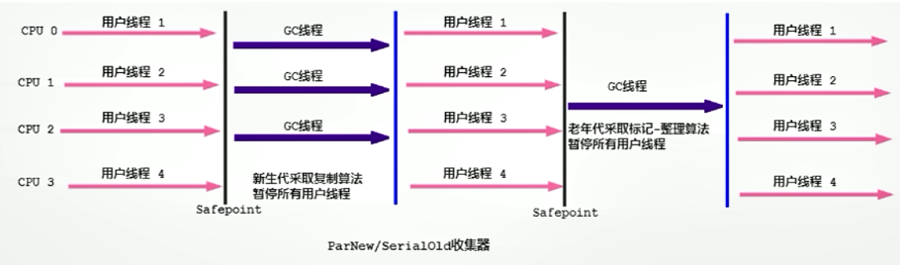

- 对于新生代，回收次数频繁，使用并行方式高效
- 对于老年代，回收次数少，使用串行方式节省资源（CPU并行需要切换线程，串行可以省去切换线程的资源）

- ParNew收集器是基于并行回收，就可以判断ParNew收集器的回收效率在任何场景下都会比Serial收集器更高效
  - ParNew收集器在多CPU环境下，可以利用多核心的资源，可以更快完成
  - 但是 **在单个CPU的环境下，ParNew收集器不比Serial收集器跟高效**
- 因为除了 Serial 外，目前只有ParNew GC 能与CMS收集器配合工作

- 参数配置：-XX:UseParNewGC 手动设置是否开启 -XX:ParallelGCThreads 限制线程数量，默认开启个CPU数据相同的线程数

#### Parallel回收器 - 吞吐量优先

- HotSpot的年轻代中除了拥有ParNew收集器是基于并行回收的以外，Parallel scavenge收集器同样也采用了**复制算法、并行回收和"stop the World"机制。**
- 那么Parallel收集器的出现是否多此一举?

  - 和ParNew收集器不同，Parallel Scavenge收集器的目标则是达到一个**可控制的吞吐量（Throughput）**，它也被称为吞吐量优先的垃圾收集器。
  - 自适应调节策略也是Parallel scavenge与ParNew一个重要区别。
- 高吞吐量则可以高效率地利用CPU时间，尽快完成程序的运算任别主要**适合在后台运算而不需要太多交互的任务**。因此，常见在服务器环境中使用，例如：批处理、订单处理、工资支付、科学计算的应用程序
- Parallel old收集器，用来代替老年代的serial old收集器。
- Parallel old收集器采用了**标记-压缩算法**，但同样也是**基于并行回收和”Stop - the World“机制**


- 在程序吞吐量优先的应用场景中，Parallel 收集器和Parallel Old的结合在Server模式下的内存回收性能很不错
- Java8中默认是此收集器

- **参数设置**
  - -XX:+UseParallelGC 手动设置年轻代使用Parallel并行收集器执行回收任务
  - -XX:+UseParallelOldGC 手动指定老年代都是使用并行回收收集器
    - 分别适用于新生代和老年代，JDK8默认开启
    - 上面的两个参数，开启一个，另外一个也会激活
  - -XX:ParallelGCThreads 设置年轻代并行收集器的线程数，一般与CPU相等，以避免过多对的线程数影响垃圾收集行呢个
    - 默认情况下，当CPU的数量小于8个，ParallelGCThreads 的值等于CPU数量
    - 当CPU数量大于8个，ParallelGCThreads 的值等于 3+[[5*CPU_Count]/8]
  - -XX:MaxGCPauseMillis 设置垃圾收集器最大停顿时间（也就是STW的时间）单位是毫秒
    - 为了尽可能把停顿的时间控制在 MaxGCPauseMillis 内，收集器工作的时候会设置堆的大小或者其他的参数
    - **使用此参数需要谨慎**
  - -XX:GCTimeRatio 垃圾回收时间占总时间的比例（= 1/（N+1）） 用于衡量吞吐量的大小
    - 取值范围（1~100 ） 默认99
  - -XX:+UseAdaptiveSizePolicy 设置具有自适应调节

#### CMS垃圾回收器 - 低延迟

- 在JDK1.5 时期，Hotspot推出了一款在 **强交互应用**中几乎可认为时代意义的垃圾收集器:CMS (Concurrent-Mark-Sweep)收集器，**这款收集器是HotSpot虚拟机中第一款真正意义上的并发收集器，它第一次实现了让垃圾收集线程与用户线程同时工作。** 
- CMS收集器的关注点是尽可能缩短垃圾收集时用户线程的停顿时间。停顿时间越短（低延迟）就越适合与用户交互的程序，良好的响应速度能提升用户体验
  - **目前很大一部分的Java应用集中在互联网站或者B/s系统的服务端上，这类应用尤其重视服务的响应速度，希望系统停顿时间最短，以给用户带来较好的体验。**
  - CMS收集器就非常符合这类应用的需求。
- CMS的垃圾收集算法采用**标记-清除**算法，并且也会"Stop-the-world"

- CMS 不能作为老年代的收集器，却无法与JDK1.4 中已经存在新生代收集器Parallel Scavenge 配合工作，所以采用CMS来收集老年代，新生代只能选择ParNew或者Serial收集器中选择一个
- 在G1出现之前，CMS使用还是非常广泛的，一直到今天仍然有很多系统使用CMS GC

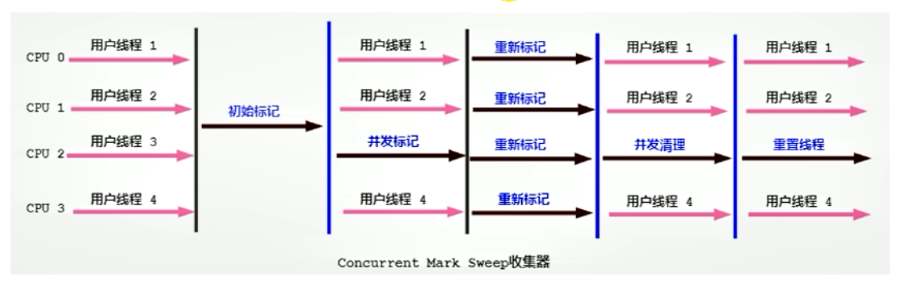

**CMS工作原理**

- CMS整个过程比之前的收集器都要复杂，整个过程分为4个主要阶段，即初始标记阶段、并发标记阶段、重新标记阶段和并发清除阶段
- 初始标记（Initial-Mark）阶段：在这个阶段，程序中所有的工作线程都会因为”STW“机制而出现短暂的暂停，这个阶段的任务**仅仅是为了标记出GC Roots能直接关联的对象** 一旦标记完成之后就会恢复之前被暂停的所有应用线程，由于直接关联对象比较小，所以这里 **速度非常快**
- 并发标记（Concurrent-Mark）阶段：从GC Roots的 **直接关联对象开始遍历整个对象图的过程**，这个过程**耗时长**但是**不需要停顿用户线程**，可以与垃圾回收线程一起并发执行
- 重新标记（Remark）阶段：由于在并发标记阶段中，程序的工作线程会和垃圾收集线程同时运行或者交叉运行，因此为了 **修正并发标记期间，因用户程序继续运作而导致标记产生变动的那一部分对象标记记录**，这个阶段的停顿稍长，但是也远比并发标记阶段段。
- 并发清除（Concurrent-Sweep）阶段：**清理删除掉标记的已经判断为死亡的对象，释放内存空间** 因为不需要移动 存活对象，所以也是并发执行

- 尽管CMS收集器采用的并发回收（非独占式），但是在其 **初始化标记进而再次标记这两个阶段仍需要执行”Stop the world“机制**来暂停工作线程。只不过时间很短
- **由于最耗费时间的并发标记与并发清除阶段都不需要暂停工作，所以整体的回收是低停顿的**
- 另外，由于在垃圾收集阶段用户线程没有中断，所以**在CMS回收过程中，还应该确保应用程序用户线程有足够的内存可用**。因此，CMS收集器不能像其他收集器那样等到老年代几乎完全被填满了再进行收集，而是**当堆内存使用率达到某一阈值时，便开始进行回收**，以确保应用程序在CNS工作过程中依然有足够的空间支持应用程序运行。要是CMS运行期间预留的内存无法满足程序需要，就会出现一次“**Concurrent Mode Failure**”失败，这时虚拟机将启动后备预案:临时启用Serial old收集器来重新进行老年代的垃圾收集，这样停顿时间就很长了。

- CMS使用标记清除算法，不可避免会有内存碎片。CMS只能选择空闲列表进行内存分配。无法使用指针碰撞
- 有人觉得MarkSweep会造成内存碎片，那么为什么不把算法换成Mark Compact?
  - 因为在并发清除的时候，用户线程还在执行，那要是把地址修改，明显不合适。所以标记压缩真适合STW的场景使用

- **CMS优点**
  - 并发收集
  - 低延迟
- **CMS的弊端**
  - 会产生内存碎片。
  - CMS收集器对CPU资源非常敏感
  - CMS收集器无法处理浮动垃圾

- CMS设置的参数
  - -XX:+UseConcMarkSweepGC 手动指定使用CMS收集器执行内存任务
    - 开启该参数之后，会自动将 -XX:+UseParNewGC 打开。即：ParNew(Young区)+CMS(Old区)+Serial Old  的组合
  - -XX:CMSInitiatingOccupanyFraction 设置内存使用率的阈值。达到阈值就开始回收
  - JDK5之前默认为68%，6之后为92%，如果内存增长缓慢，可以设置一个稍大的值，可以有效降低CMS的触发频率
  - -XX:+UseCMSCompactAtFullCollection用于指定在执行完Full GC 后对内存空间进行压缩整理，以此避免内存碎片的产生。不过由于内存压缩整理过程无法并发执行，所带来的问题就是停顿时间变得更长了。
  - -XX:CMSFullGCsBeforeCompaction设置在执行多少次Full GC后对内存空间进行压缩整理。
  - -XX:ParallelCMSThreads设置CMS的线程数量。CMS默认启动的线程数是（ParallelGcThreads+3)/4，ParallelGcThreads是年轻代并行收集器的线程数。当CPU资源比较紧张时，受到cMs收集器线程的影响，应用程序的性能在垃圾回收阶段可能会非常糟糕，

#### 小结

- Hotspot有这么多的垃圾回收器，那么如果有人问：Serial GC、Parallel GC、Concurrent Mark Sweep GC 这三个有什么不同呢？
- **口令**
- 如果你要最小化使用内存和并行开销，请选Serial GC
- 如果你想要最大化应用程序的吞吐量，请选Parallel GC
- 如果你想要最小化GC的中断或停顿时间，请选CMS GC

- 其他：JDK9中CMS标记过时。JDK14全面删除CMS

#### G1垃圾收集器 - 区域化分代式

##### 简介

- 既然已经有了前面几个强大的GC，为什么还要发布Garbage First （G1）GC？
- 因为应用程序对应的 **业务越来越庞大、复杂、用户越来越多**，而实际需求不满足。就迫使新的GC出现
- 也是为了适应现在 **不断扩大的内存和不断增加的处理器数量**，进一步降低暂停时间（pause time），同时兼顾良好的吞吐量
- **官方给G1设定的目标式在延迟可控的情况下获得尽可能高的吞吐量，素以才担当起”全能收集器“的重任与期望**

- 为什么名字叫做Garbage First（G1）?
- 因为G1是一个并行回收器，他把内存分割为很多不相关的区域（Region）（物理上不连续的） 使用不同的Region来表示Eden、幸存者0区、幸存者1区、老年代
- G1 GC 有计划的避免Java堆中进行全区域的垃圾扫描。而是跟踪各个Region里面垃圾堆积的价值大小（回收所获得的空间大小以及回收所需时间的经验值），在后台维护一个优先列表，**每次根据允许的收集时间，优先回收价值最大的Region。**
- 由于这种方式的侧重点在于回收垃圾最大量的区间（Region)，所以我们给G1一个名字:垃圾优先（Garbage First） 。
- Gl (Garbage-First）是一款面向服务端应用的垃圾收集器，**主要针对配备多核cPu及大蜜量内存的机器**，以极高概率满足cC停顿时间的同时，还兼具高吞吐量的性能特征。
- 在JDK1.7版本正式启用，移除了Experimental的标识，是**JDK 9以后的默认垃圾回收器**，取代了cMS回收器以及Parallel + Parallel old组合。被oracle官方称为**“全功能的垃圾收集器”。**
- 与此同时，CMS已经在JDK 9中被标记为废弃（deprecated）。在jdk8中还不是默认的垃圾回收器，需要使用-XX:+UseG1Gc来启用。

##### G1回收器的特点（优点）

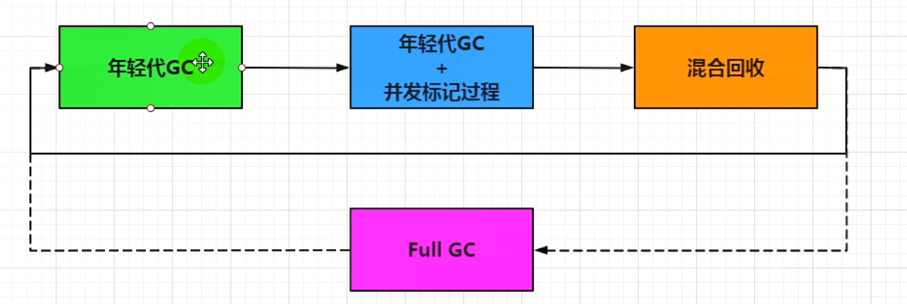

**并行与并发**

- 并行性:G1在回收期间，可以有多个Gc线程同时工作，有效利用多核计算能力。此时用户线程STW
- 并发性:G1拥有与应用程序交替执行的能力，部分工作可以和应用程序同时执行，因此，一般来说，不会在整个回收阶段发生完全阻塞应用程序的情况

**分代收集**

- 从分代上看，**G1依然属于分代型垃圾回收器**，它会区分年轻代和老年代，年轻代依然有Eden区和survivor区。但从堆的结构上看，它不要求整个Eden区、年轻代或者老年代都是连续的，也不再坚持固定大小和固定数量。
- 将**堆空间分为若干个区域（Region)，这些区域中包含了逻辑上的年轻代和老年代**。
- 和之前的各类回收器不同，它**同时兼顾年轻代和老年代**。对比其他回收器，或者工作在年轻代，或者工作在老年代;

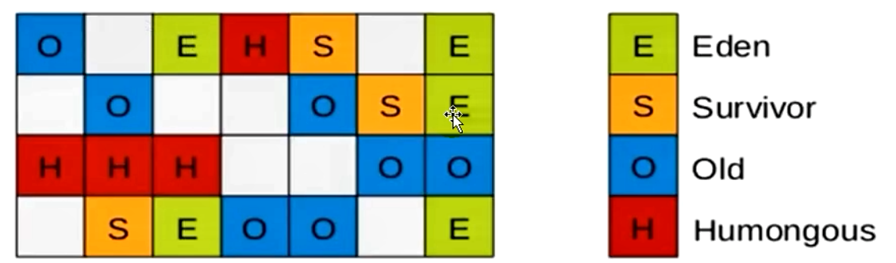

**空间整合**

- CMS：”标记-清除”算法、内存碎片、若干次GC后进行一次碎片整理
- G1将内存划分为一个个的region。内存的回收是以region作为基本单位的。Region之间是复制算法，但整体上实际可看作是标记-压缩（Mark-Compact)算法，两种算法都可以避免内存碎片。这种特性有利于程序长时间运行，分配大对象时不会因为无法找到连续内存空间而提前触发下一次Gc。尤其是当Java堆非常大的时候，G1的优势更加明显。

**可预测的停顿时间模型 （软实时：Soft Real-Time）**

- 这是G1 相对于CMS的另一大优势，G1除了追求低停顿外，还能建立可预测的停顿时间模型，能让使用者明确指定在一个长度为M毫秒的时间片段内，消耗在垃圾收集上的时间不得超过N毫秒。
- 由于分区的原因，G1可以只选取部分区域进行内存回收，这样缩小了回收的范围，因此对于全局停顿情况的发生也能得到较好的控制。
- G1跟踪各个Region里面的垃圾堆积的价值大小（回收所获得的空间大小以及回收所需时间的经验值），在后台维护一个优先列表**，每次根据允许的收集时间，优先回收价值最大的Region。**保证了G1收集器在有限的时间内可以获取尽可能高的收集效率。
- 相比于CMs GC，G1未必能做到cMs在最好情况下的延时停顿，但是最差情况要好很多。

##### G1回收器的缺点

- 相较于CMS，G1还不具备全方位、压倒性优势。比如在用户程序运行过程中，G1无论是为了垃圾收集产生的内存占用（Footprint）还是程序运行时的额外执行负载（overload）都要比CMS要高。
- 从经验上来说，在小内存应用上CMS的表现大概率会优于G1，而G1在大内存应用上则发挥其优势。平衡点在6-8GB之间。

##### G1回收器的参数设置

- -XX:+UseG1GC 手动指定使用G1收集器执行内存回收任务。
- -XX:G1HeapRegionsize设置每个Region的大小。值是2的幂，范围是1MB到32MB之间，目标是根据最小的Java堆大小划分出约2048个区域。默认是堆内存的1/2000。
- -XX:MaxGCPauseMillis设置期望达到的最大Gc停顿时间指标(JVM会尽力实现，但不保证达到)。默认值是200ms
- -XX:ParallelGCThread设置STW工作线程数的值。最多设置为8

- -XX:ConcGCThreads设置并发标记的线程数。将n设置为并行垃圾回收线程数(ParallelGcThreads)的1/4左右。
- -XX:InitiatingHeapoccupancyPercent 设置触发并发Gc周期的Java堆占用率阈值。超过此值，就触发Gc。默认值是45。

**G1回收器的常见操作步骤**

- G1的设置原则就是简化JVM的性能调优，开发人员只需要简单的三步即可完成调优
- 第一步：开启G1垃圾收集器
- 第二步：设置堆的最大内存
- 第三步：设置最大的停顿时间

- G1中提供了三种垃圾回收模式：YoungGC、Mixed GC和Full GC 在不同的条件下被触发

##### G1回收器的适用场景

- 面向服务端应用，针对具有大内存、多处理器的机器。(在普通大小的堆里表现并不惊喜)
- 最主要的应用是需要低Gc延迟，并具有大堆的应用程序提供解决方案;
- 如:在堆大小约6GB或更大时，可预测的暂停时间可以低于0.5秒;(G1通过每次只清理一部分而不是全部的Region的增量式清理来保证每次GC停顿时间不会过长）。
- 用来替换掉JDK1.5中的CMS收集器;在下面的情况时，使用G1可能比CMS好:
  - 超过50%的Java堆被活动数据占用;
  - 对象分配频率或年代提升频率变化很大;
  - Gc停顿时间过长（长于0.5至1秒）。
- HotSpot垃圾收集器里，除了G1以外，其他的垃圾收集器使用内置的JVM线程执行GC的多线程操作，而G1 GC可以采用应用线程承担后台运行的Gc工作，即当JVM的Gc线程处理速度慢时，系统会调用应用程序线程帮助加速垃圾回收过程。 

##### 分区Region：化整为零

- 使用G1收集器时，它将整个Java堆划分成约2048个大小相同的独立Region块，每个Region块大小根据堆空间的实际大小而定，整体被控制在1MB到32MB之间，且为2的N次幂，即1MB，2MB，4MB，8MB，16MB，32MB。可以通过-Xx:GlHeapRegionsize设定。**所有的Region大小相同，且在JVM生命周期内不会被改变。**
- 虽然还保留有新生代和老年代的概念，但新生代和老年代不再是物理隔离的它们都是一部分Region（不需要连续）的集合。通过Region的动态分配方式实现逻辑上的连续。

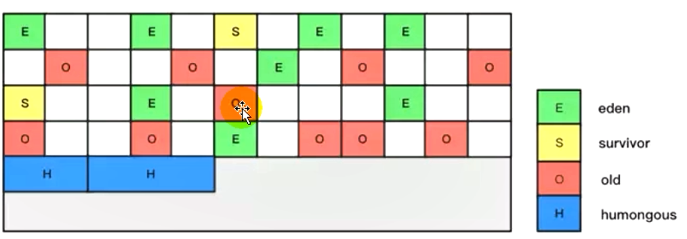

- 一个region有可能属于Eden，Survivor或者old/Tenured内存区域。但是一个region只可能属于一个角色。图中的E表示该region属于Eden内存区域，s表示属于survivor内存区域，o表示属于old内存区域。图中空白的表示未使用的内存空间
- Gl垃圾收集器还增加了一种新的内存区域，叫做Humongous内存区域，如图中的H块。主要用于存储大对象，如果超过1.5个region，就放到H。

- **设置H的原因**
  - 对于堆中的大对象，默认直接会被分配到老年代，但是如果它是一个短期存在的大对象就会对垃圾收集器造成负面影响。为了解决这个问题，G1划分了一个Humongous区，它用来专门存放大对象。**如果一个H区装不下一个大对象，那么G1会寻找连续的H区来存储。**为了能找到连续的H区，有时候不得不启动Full GC。G1的大多数行为都把H区作为老年代的一部分来看待。

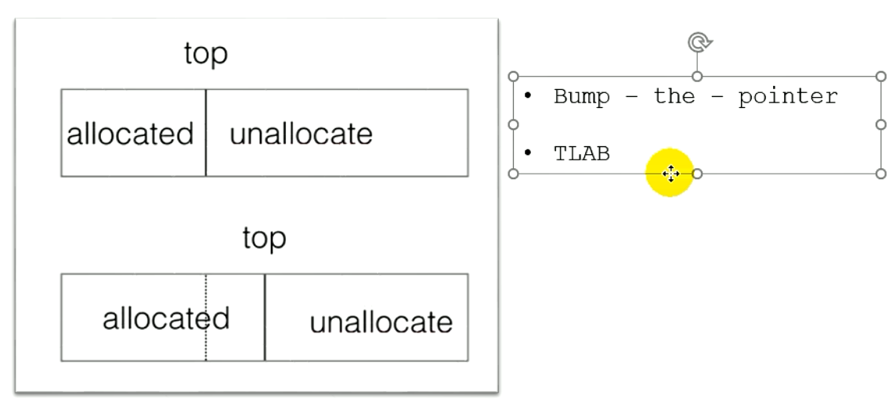

##### G1回收垃圾的过程

- 主要包括以下三个环节
  - 年轻代 GC （Young GC）
  - 老年代并发标记过程（Concurrent Marking）
  - 混合回收（Mixed GC）
  - （如果需要。单线程、独占式、高强度的Full GC还是继续存在的，它针对GC的评估失败提供了一种失败保护机制，即强力回收）

- 顺时针，Young GC -> Young GC + Concurrent mark -> Mixed GC 顺序进行垃圾回收

- 应用程序分配内存，当年轻代的Eden区用尽时开始年轻代回收过程;G1的年轻代收集阶段是一个并行的独占式收集器。在年轻代回收期，G1 Gc暂停所有应用程序线程，启动多线程执行年轻代回收。然后从年轻代区间移动存活对象到survivor区间或者老年区间，也有可能是两个区间都会涉及。
- 当堆内存使用达到一定值（默认45%）时，开始老年代并发标记过程。
- 标记完成马上开始混合回收过程。对于一个混合回收期，G1 Gc从老年区间移动存活对象到空闲区间，这些空闲区间也就成为了老年代的一部分。和年轻代不同，老年代的G1回收器和其他GC不同，G1的老年代回收器不需要整个老年代被回收，一次只需要扫描/回收小部分老年代的Region就可以了。同时，这个老年代Region是和年轻代一起被回收的
- 举个例子:一个web服务器，Java进程最大堆内存为4G，每分钟响应1500个请求，每45秒钟会新分配大约2G的内存。G1会每45秒钟进行一次年轻代回收，每31个小时整个堆的使用率会达到45%，会开始老年代并发标记过程，标记完成后开始四到五次的混合回收。

##### Remembered Set

- 一个对象被不同区域引用的问题
- 一个Region不可能是孤立的，一个Region中的对象可能被其他任意Region中对象引用，
- 判断对象存活时，是否需要扫描整个Java堆才能保证准确?
- 在其他的分代收集器，也存在这样的问题（而G1更突出）

- 回收新生代也不得不同时扫描老年代?
- 这样的话会降低Minor Gc的效率;

**解决方法**

- 无论G1还是其他分代收集器，JVM都是使用Remembered Set来避免全局扫描:
- 每个Region都有一个对应的Remembered Set;
- 每次Reference类型数据写操作时，都会产生一个write Barrier暂时中断操作;
- 然后检查将要写入的引用指向的对象是否和该Reference类型数据在不同的Region（其他收集器:检查老年代对象是否引用了新生代对象）﹔
- 如果不同，通过cardTable把相关引用信息记录到引用指向对象的所在Region对应的Remembered set中;
- 当进行垃圾收集时，在Gc根节点的枚举范围加入Remembered Set;就可以保证不进行全局扫描，也不会有遗漏。

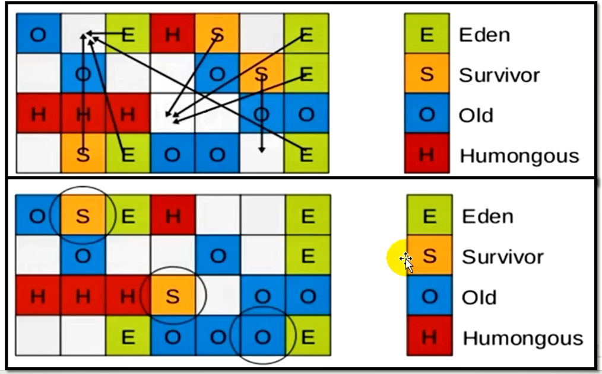

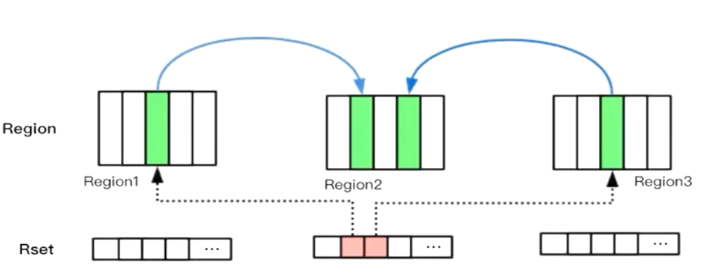

##### G1回收过程一：年轻代GC

- 当JVM启动的时候，G1先准备好Eden区，程序在执行的过程中不断创建对象到Eden区，当Eden区空间耗尽的时候，G1会启动一次年轻代垃圾回收过程
- 年轻代垃圾回收只会回收Eden区和Survivor区
- YGC时，首先G1停止应用程序的执行（stop-The-world），G1创建回收集（Collection set），回收集是指需要被回收的内存分段的集合，年轻代回收过程的回收集包含年轻代Eden区和survivor区所有的内存分段。

- **第一阶段。扫描根**
  - 根是指static变量指向的对象，正在执行的方法调用链条上的局部变量等。根引用连同RSet记录的外部引用作为扫描存活对象的入口。
- **第二阶段，更新RSet。**
  - 处理dirty card queue(见备注)中的card，更新RSet。此阶段完成后，**RSet可以准确的反映老年代对所在的内存分段中对象的引用。**
- **第三阶段，处理RSet。**
  - 识别被老年代对象指向的Eden中的对象，这些被指向的Eden中的对象被认为是存活的对象。
- **第四阶段，复制对象。**
  - 此阶段，对象树被遍历，Eden区内存段中存活的对象会被复制到survivor区中空的内存分段，Survivor区内存段中存活的对象如果年龄未达阈值，年龄会加1，达到阀值会被会被复制到old区中空的内存分段。如果survivor空间不够，Eden空间的部分数据会直接晋升到老年代空间。
- **第五阶段，处理引用。**
  - 处理Soft，Weak，Phantom，Final，JNI eak等引用。最终Eden空间的数据为空，止工作，而目标内存中的对象都是连续存储的，没有碎片，所以复制过程可以达到内存整理的效果，减少碎片。

##### G1回收过程二：并发标记过程

- **初始标记阶段**
  - 标记从根节点直接可达的对象。这个阶段是STw的，并且会触发一次年轻代GC。
- **根区域扫描(Root Region Scanning)**
  - G1 GC扫描survivor区直接可达的老年代区域对象，并标记被引用的对象。这一过程必须在young 6c之前完成。
- **并发标记(Concurrent Marking)**
  - 在整个堆中进行并发标记(和应用程序并发执行)，此过程可能被young GC中断。在并发标记阶段，若发现区域对象中的所有对象都是垃圾，那这个区域会被立即回收。同时，并发标记过程中，会计算每个区域的对象活性(区域中存活对象的比例)。
- **再次标记(Remark)**
  - 由于应用程序持续进行，需要修正上一次的标记结果。是的。G1中采用了比CMS更快的初始快照算法:snapshot-at-the-beginning (SATB)
- **独占清理(cleanup,STW)**
  - 计算各个区域的存活对象和Gc回收比例，并进行排序识别可以混合回收的区域。为下阶段做铺垫。是STW的。
  - 这个阶段并不会实际上去做垃圾的收集
- **并发清理阶段**
  - 识别并清理完全空闲的区域。

##### G1回收过程三：混合回收

- 当越来越多的对象晋升到老年代old region时，为了避免堆内存被耗尽，虚拟机会触发一个混合的垃圾收集器，即Mixed Gc，该算法并不是一个old Gc，除了回收整个Young Region，还会回收一部分的old Region。这里需要注意:是一部分老年代，而不是全部老年代。可以选择哪些old Region进行收集，从而可以对垃圾回收的耗时时间进行控制。也要注意的是Mixed Gc并不是Full GC。

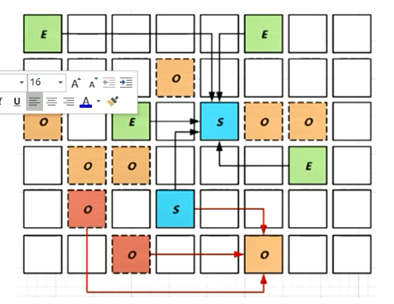

- 并发标记结束以后，老年代中百分百为垃圾的内存分段被回收了，部分为垃圾的内存分段被计算了出来。默认情况下，这些老年代的内存分段会分8次（可以通过-xx:G1MixedGccountTarget设置）被回收。
- 混合回收的回收集(Collection Set）包括八分之一的老年代内存分段，Eden区内存分段，Survivor区内存分段。混合回收的算法和年轻代回收的算法完全一样，只是回收集多了老年代的内存分段。具体过租请参考上面的年轻代回收过程。
- 由于老年代中的内存分段默认分8次回收，G1会优先回收垃圾多的内存分段。垃圾占内存分段比例越高的，越会被先回收。并且有一个阈值会决定内存分段是否被回收，-XX:G1MixedGCLiveThresholdPercent，默认为65%，意思是垃圾占内存分段比例要达到65%才会被回收。如果垃圾占比太低，意味着存活的对象占比高，在复制的时候会花费更多的时间。
- 混合回收并不一定要进行8次。有一个阈值-xX:G1HeapwastePercent，默认值为10%，混合回收并不一定要进行8次。有一个阈值-XX:G1HeapwastePercent，默认值为10%，存的比例低于10%，则不再进行混合回收。因为GC会花费很多的时间但是回收到的内存却很少。

##### G1回收过程四：Full GC

- G1的初衷就是要避免Full GC的出现。但是如果上述方式不能正常工作，G1会停止应用程序的执行（Stop-The-World），使用单线程的内存回收算法进行垃圾回收，性能会非常差，应用程序停顿时间会很长。
- 要避免Full GC的发生，一旦发生需要进行调整。什么时候会发生Full Gc呢?比如堆内存太小，当G1在复制存活对象的时候没有空的内存分段可用，则会回退到full gc，这种情况可以通过增大内存解决。
- 导致G1Full GC的原因可能有两个:
  - Evacuation的时候没有足够的to-space来存放晋升的对象;
  - 并发处理过程完成之前空间耗尽。

##### G1回收过程：补充

- 从Oracle官方透露出来的信息可获知，回收阶段(Evacuation)其实本也有想过设计成与用户程序一起并发执行，但这件事情做起来比较复杂，考虑到G1只是回收一部分Region, 停顿时间是用户可控制的，所以并不迫切去实现，而**选择把这个特性放到了G1之后出现的低延迟垃圾收集器(即ZGC)** 中。另外，还考虑到G1不是仅仅面向低延迟，停顿用户线程能够最大幅度提高垃圾收集效率，为了保证吞吐量所以才选择了完全暂停用户线程的实现方案。

##### G1回收器优化建议

- 年轻代大小
  - 避免使用-Xmn或-XX:NewRatio等相关选项显示设置年轻代大小
  - 固定年轻代的大小会覆盖暂停时间目标
- 暂停时间目标不要太过严苛
  - G1 GC的吞吐量目标是90%的应用程序时间和10%的垃圾回收时间
  - 评估G1 GC的吞吐量时，暂停时间目标不要太严苛。目标太过严苛表示你愿意承受更多的垃圾回收开销，而这些会直接影响到吞吐量。

#### 7种经典的垃圾回收器总结

- 在具体使用的时候，根据不同的情况选择不同的垃圾回收器

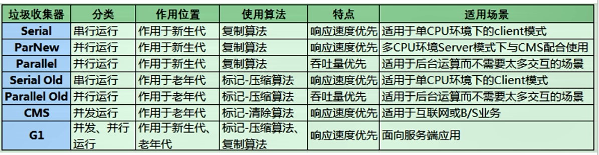

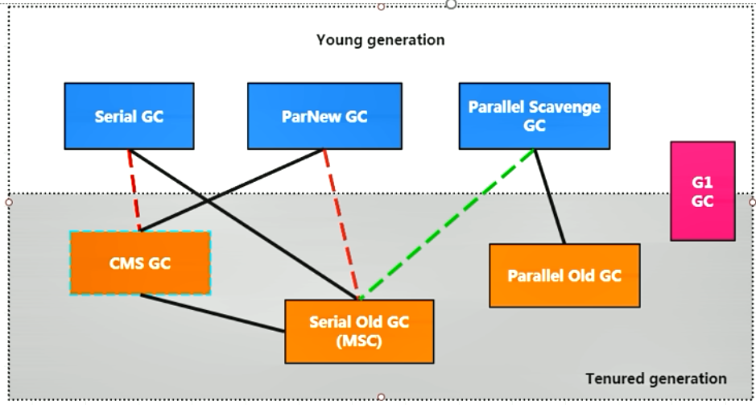

**如何选择垃圾回收器**

- Java垃圾收集器的配置对于JVM优化来说是一个很重要的选择，选择合适的垃圾收集器可以让JVM的性能有一个很大的提升。
- 优先调整堆的大小让JVM自适应完成。
- 如果内存小于10OM，使用串行收集器
- 如果是单核、单机程序，并且没有停顿时间的要求，串行收集器
- 如果是多CPU、需要高吞吐量、允许停顿时间超过1秒，选择并行或者VM自己选择
- 如果是多CPU、追求低停顿时间，需快速响应（比如延迟不能超过1秒，如互联网应用），使用并发收集器
- 官方推荐G1，性能高。**现在互联网的项目，基本都是使用G1。**

**观点**

- 没有最好的收集器，更没有万能的收集器
- 调优永远是针对特定场景、特定需求、不存在一劳永逸的收集器

#### 常用的显示GC日志的参数

- 内存分配与垃圾回收的参数列表
- -XX:+PrintGC  输出Gc日志。类似:-verbose:gc
- -XX:+PrintGCDetails  输出Gc的详细日志
- -XX:+PrintGCTimestamps输出Gc的时间戳（以基准时间的形式)
- -XX:+PrintGCDatestamps输出Gc的时间戳（以日期的形式，如2013-05-04T21:53:59.234+0800)
- -XX :+PrintHeapAtGC 在进行GC前后打印出堆栈信息
- -Xloggc:../logs/gc.log 日志文件的输出路径  

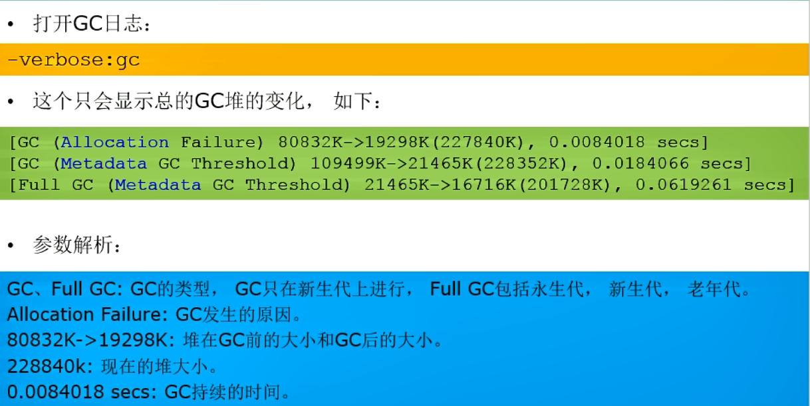

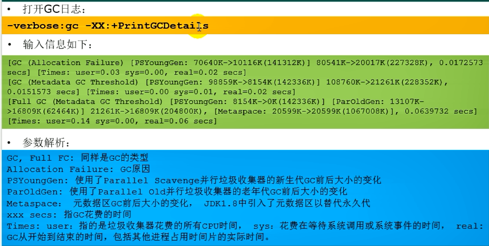

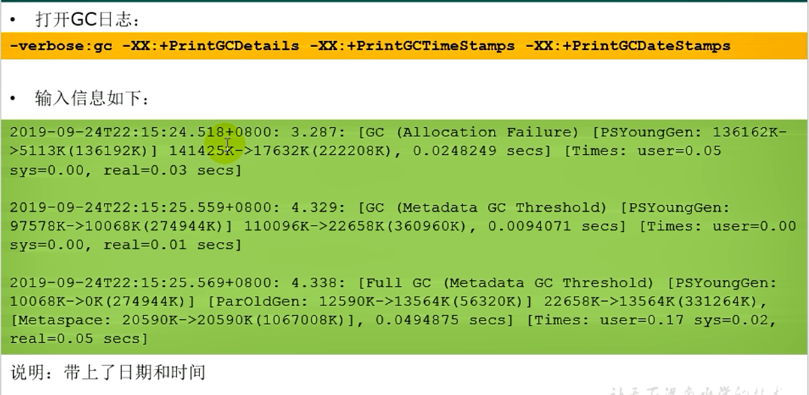

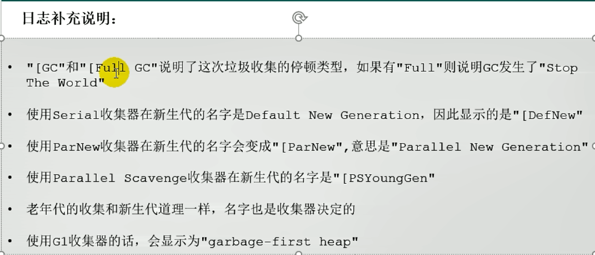

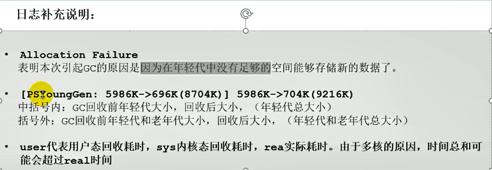

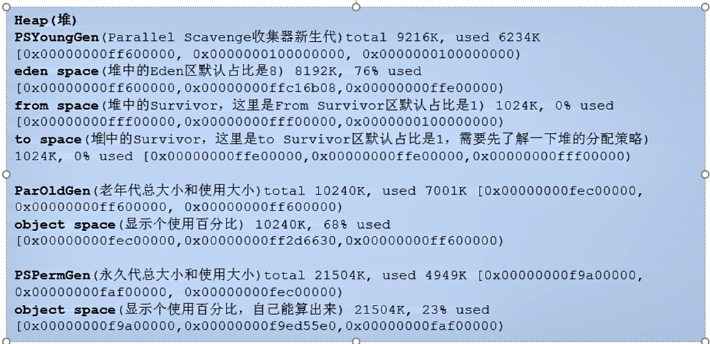


#### GC日志中垃圾回收参数数据的分析


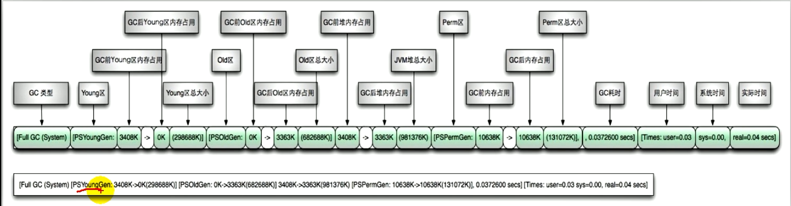

- **分析工具分析**

```java
package cn.icanci.jvm.metaspace;

import java.nio.ByteBuffer;
import java.util.ArrayList;

/**
 * @Author: icanci
 * VM:-XX:+PrintGCDetails -Xloggc:./logs/gc.log
 */
public class BufferTest {
    // 20MB
    private static final int BUFFER = 1024 * 1024 * 20;

    public static void main(String[] args) {
        ArrayList<ByteBuffer> list = new ArrayList<>();
        int count = 0;
        try {
            while (true) {
                ByteBuffer allocate = ByteBuffer.allocateDirect(BUFFER);
                list.add(allocate);
                count++;
            }
        } catch (Exception e) {
            e.printStackTrace();
        } finally {
            System.out.println(count);
        }
    }
}

```

- **日志文件**

```logs
Java HotSpot(TM) 64-Bit Server VM (25.131-b11) for windows-amd64 JRE (1.8.0_131-b11), built on Mar 15 2017 01:23:53 by "java_re" with MS VC++ 10.0 (VS2010)
Memory: 4k page, physical 16666788k(8554300k free), swap 19188920k(4455436k free)
CommandLine flags: -XX:InitialHeapSize=266668608 -XX:MaxHeapSize=4266697728 -XX:+PrintGC -XX:+PrintGCDetails -XX:+PrintGCTimeStamps -XX:+UseCompressedClassPointers -XX:+UseCompressedOops -XX:-UseLargePagesIndividualAllocation -XX:+UseParallelGC 
2.293: [GC (System.gc()) [PSYoungGen: 6560K->1128K(76288K)] 6560K->1136K(251392K), 0.0023961 secs] [Times: user=0.00 sys=0.00, real=0.00 secs] 
2.296: [Full GC (System.gc()) [PSYoungGen: 1128K->0K(76288K)] [ParOldGen: 8K->1017K(175104K)] 1136K->1017K(251392K), [Metaspace: 3993K->3993K(1056768K)], 0.0065845 secs] [Times: user=0.02 sys=0.00, real=0.01 secs] 
Heap
 PSYoungGen      total 76288K, used 1748K [0x000000076b380000, 0x0000000770880000, 0x00000007c0000000)
  eden space 65536K, 2% used [0x000000076b380000,0x000000076b535018,0x000000076f380000)
  from space 10752K, 0% used [0x000000076f380000,0x000000076f380000,0x000000076fe00000)
  to   space 10752K, 0% used [0x000000076fe00000,0x000000076fe00000,0x0000000770880000)
 ParOldGen       total 175104K, used 1017K [0x00000006c1a00000, 0x00000006cc500000, 0x000000076b380000)
  object space 175104K, 0% used [0x00000006c1a00000,0x00000006c1afe470,0x00000006cc500000)
 Metaspace       used 4025K, capacity 4568K, committed 4864K, reserved 1056768K
  class space    used 451K, capacity 460K, committed 512K, reserved 1048576K

```

- 可以用一些工具去分析这些gc日志。 
- 常用的日志分析工具有:GCViewer、GCEasy、GcHisto、GCLogViewer、Hpjmeter、garbagecat等。
-  https://gceasy.io/ 

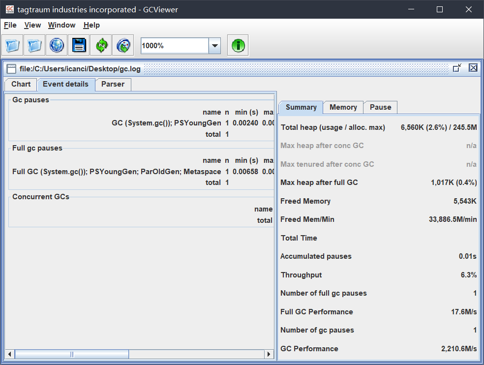

#### 垃圾回收器的新发展

- GC仍然处于飞速发展之中，目前的默认选项G1 GC在不断的进行改进，很多我们原来认为的缺点，例如串行的Full GC、card Table扫描的低效等，都已经被大幅改进，例如，JDK 10以后，Full Gc已经是并行运行，在很多场景下，其表现还略优于Parallel Gc的并行Full GC实现。
- 即使是serial Gc，虽然比较古老，但是简单的设计和实现未必就是过时的，它本身的开销，不管是GC相关数据结构的开销，还是线程的开销，都是非常小的，所以随着云计算的兴起，在Serverless等新的应用场景下，Serial GC找到了新的舞台
- 比较不幸的是CMS Gc，因为其算法的理论缺陷等原因，虽然现在还有非常大的用户群体，但在JDK9中已经被标记为废弃，并在JDK14版本中移除。

##### Open JDK12的shenandoah Gc:低停顿时间的Gc（实验性）

- Shenandoah，无疑是众多GC中最孤独的一个。是第一款不由oracle公司团队领导开发的HotSpot垃圾收集器。不可避免的受到官方的排挤。比如号称openJDK和oracleDK没有区别的oracle公司仍拒绝在oracleJDK12中支持Shenandoah。
- Shenandoah垃圾回收器最初由RedHat进行的一项垃圾收集器研究项目PauselessGC的实现，旨在针对JVM上的内存回收实现低停顿的需求。在2014年贡献给OpenJDK
- Red Hat研发Shenandoah团队对外宣称，Shenandoah垃圾回收器的暂停时间与堆大小无关，这意味着无论将堆设置为200 MB还是200GB，99.9%的目标都垃圾收集的停顿时间限制在十毫秒以内。不过实际使用性能将取决于实际工作堆的大小和工作负载。

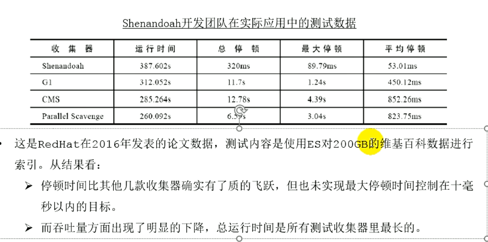

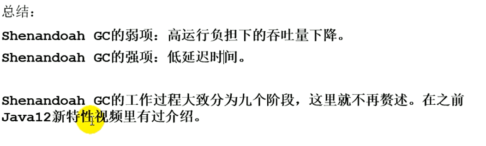

##### 令人震惊、具有革命性的ZGC

- zGcshenandoah目标高度相似，**在尽可能对吞吐量影响不大的前提下，实现在任意堆内存大小下都可以把垃圾收集的停顿时间限制在十毫秒以内的低延迟**。
- 《深入理解Java虚拟机》一书中这样定义ZGC: zGc收集器是一款基于Region内存布局的，（暂时）不设分代的，使用了读屏障、染色指针和内存多重映射等技术来实现**可并发的标记-压缩算法**的，以**低延迟为首要目标**的一款垃圾收集器。
- ZGC的工作过程可以分为4个阶段:**并发标记-并发预备重分配-并发重分配-并发重映射**等。
- ZGC几乎在所有地方并发执行的，除了**初始标记的是STW**的。所以停顿时间几乎就耗费在初始标记上，这部分的实际时间是非常少的。

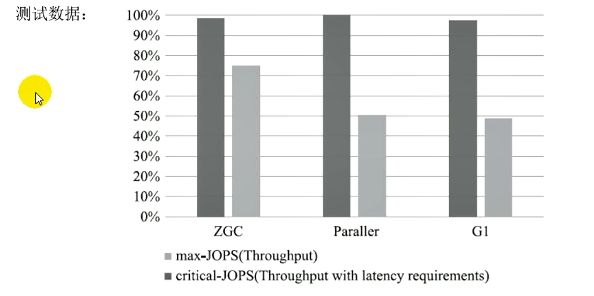

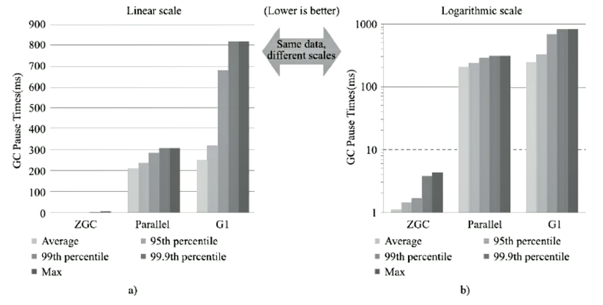

- 虽然zGC还在试验状态，没有完成所有特性，但此时性能已经相当亮眼，用“令人震惊、革命性”来形容，不为过。
- **未来将在服务端、大内存、低延迟应用的首选垃圾收集器。**

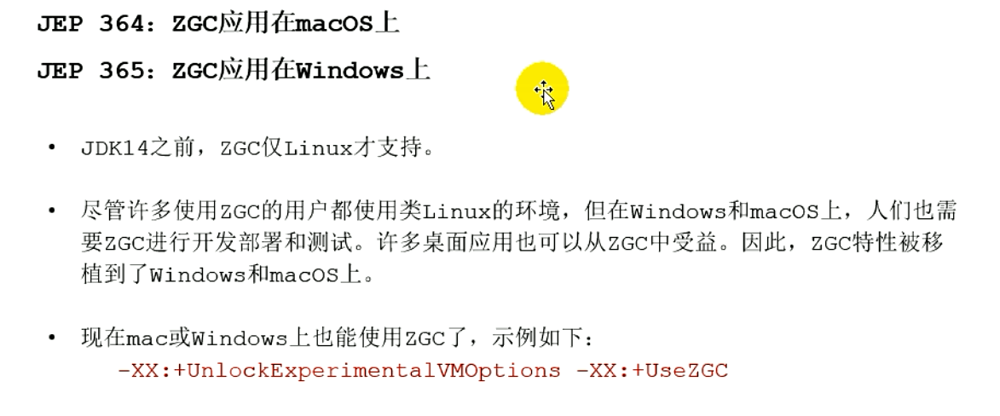

#### 其他垃圾收集器：AliGC


