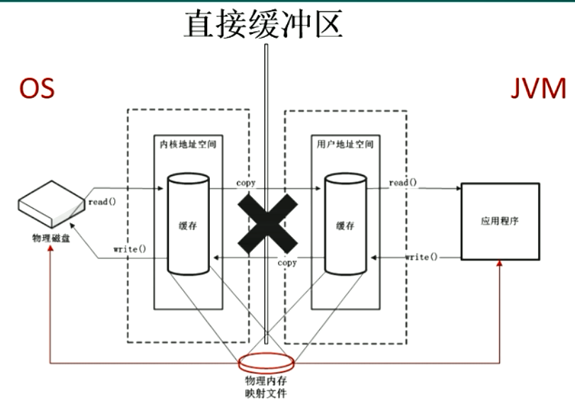
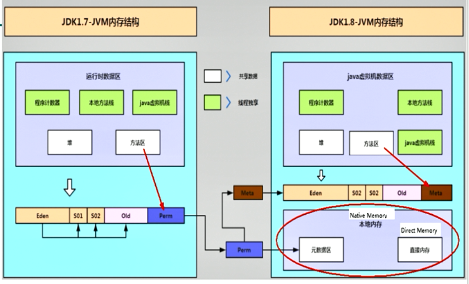

### Java - 底层建筑 - JVM - 第11篇 - 直接内存

#### 直接内存概述

- 直接内存不是虚拟机运行时数据区的一部分。也不是《Java虚拟机规范》中定义的内存区域
- 直接内存是在Jaav堆外的、直接向系统申请的内存空间
- 来源于NIO，通过存在堆中的DirectByteBuffer操作Native内存
- 通常访问直接内存的速度高于Java堆，也就是读写性能更高
  - 因此出于性能考虑，读写频繁的场合可能会考虑使用直接内存
  - Java的NIO库允许Java程序使用直接内存，用户数据缓冲区

#### 非直接缓冲区

- 读写文件，需要与磁盘交互，需要由用户态切换到内核态。在内核态的时候，需要内存如上图的操作，使用IO，见上图。这里需要两份内存存储数据，效率低

#### 直接缓冲区

- 使用NIO的时候，上图。操作系统划出的直接缓存区可以被Java代码直接访问，只有一份，NIO适合对大文件的读写操作。

#### 注意点

- 也可能导致OutOfMemoryError异常
- 由于直接内存存在在Java堆外，因此它的大小不会直接受限于-Xmx指定的最大堆大小，但是系统内存是有限的，Java堆和直接内存的总和依旧受限于操作系统能给出的操作内存
- **缺点**
  - 分配回收成本高
  - 不受JVM内存回收管理 
- 直接内存的大可以通过 MaxDirectMemorySize 设置
- 如果不指定，默认与堆的最大值 -Xmx参数保持一致

- **Java Process Memory  = Java Heap + native Memory**