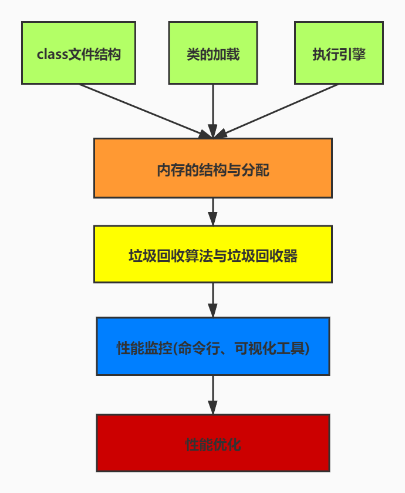
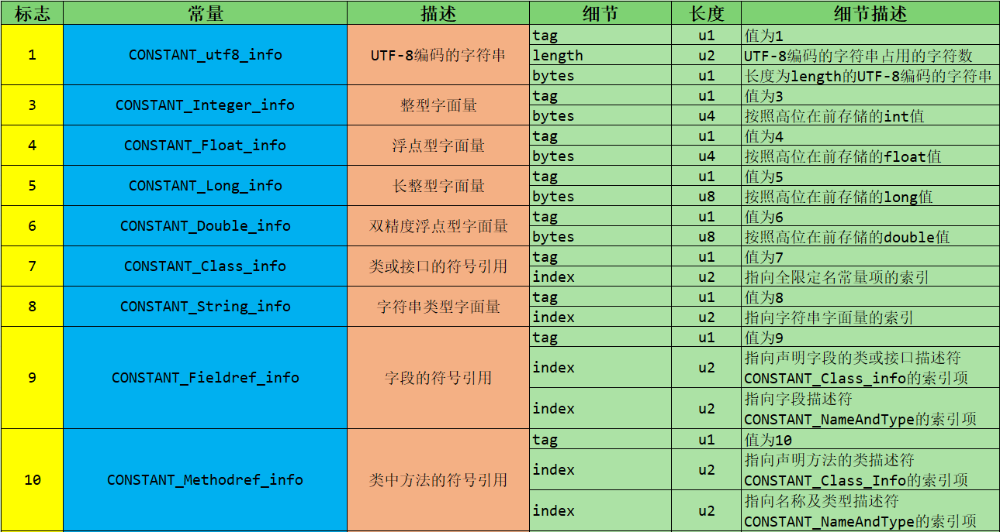

### Java-底层建筑-JVM-第18篇-Class文件

#### JVM基本组成 基于Hotspot虚拟机


#### 学习的过程 - 从上到下



#### 字节码文件的跨平台性

**Java 语言**

- 当Java源代码成功编译成字节码之后，如果想在不同的平台上运行，不需要再次编译。
- 这个优势不是很吸引人了，因为Python、PHP、Perl、Ruby、Lisp等语言都有强大的解释器
- 跨平台已经几乎称为一门语言的必选特性

**Java 虚拟机**

- **Java虚拟机不和包含Java在内的任何语言进行绑定，它只和 ".class" 文件这种特定的二进制文件格式关联**
- 无论是哪一种语言，只要能够将源文件编译成正确的Class文件，那么这种语言就可以在虚拟机上运行。可以说，统一而强大的Class文件结构，就是Java虚拟机的基石和桥梁。


**Class字节码的规范性**

- 所有的JVM都遵循Java虚拟机规范，也就是说所有的JVM环境都是一样的，这样一来字节码文件可以在各种JVM中运行
- **想要一个Java程序正确的运行在JVM中，Java源码就必须要被编译为符合JVM规范的字节码**
- **前端编译器的主要任务就是负责将符合Java语法规范的Java代码编译成符合JVM规范的字节码**
- javac是一个能够将Java源码编译为字节码的前端编译器
- javac编译器将Java源代码编译为一个有效的字节码文件过程中经历了4个步骤，分别是：**词法解析、语法解析、语义解析以及生成字节码**


- Oracle 发布的JDK软件包括2部分内容
  - 一部分是将Java源码编译成Java虚拟机的指令集的编译器
  - 一部分是用于实现Java虚拟机的运行时环境

#### Java的前端编译器


- javac 就是JDK提供的前端编译器

- Hotspot VM没有强制要求前端编译器只能使用javac来实现编译字节码，其实只要编译结果符合JVM规范即可被JVM识别
- 在Java的前端编译器领域，除了javac之外，还有一种经常使用的前端编译器，那就是Eclipse中的**ECJ（Eclipse Compiler for Java）编译器**  ，和javac不同的是，ECJ是一种增量编译器
- 在Eclipse中，当开发人员编写完代码之后，使用 “ctrl + s”，保存的时候，ECJ采用的是局部编译，也就是把没有编译的地方重编译，而非每次都全量编译
- ECJ不仅仅是Eclipse的默认内置前端编译器，Tomcat中也是使用ECJ进行编译JSP文件
- 默认情况下，IDEA还是使用的是javac编译器

#### 透过字节码指令看代码执行细节举例

**BAT面试题**

- 类文件结构有几个部分？
- 知道字节码吗？字节码都有哪些？ Integer x = 5; int y = 5; 比较 x == y 都有哪些步骤？(class 是字节码文件)

**代码举例1**

```java
public class IntegerTest {
    public static void main(String[] args) {
        Integer x = 5;
        int y = 5;

        System.out.println(x == y);

        Integer i1 = 10;
        Integer i2 = 10;
        System.out.println(i1 == i2);


        Integer i3 = 128;
        Integer i4 = 128;
        System.out.println(i3 == i4);

    }
}

```


**代码举例2**

```java
public class StringTest {
    public static void main(String[] args) {
        String str = new String("hello") +
                new String("world");
        String str2 = "helloword";
        System.out.println(str2 == str);

    }
}

```


**代码举例3**

```java
/**
 * 非静态成员变量的初始化过程：
 * 1. 默认初始化
 * 2. 显示初始化 / 代码块中初始化
 * 3. 构造器初始化
 * 4. 有了对象之后，可以 对象.setter方法 或者 对象.属性的方式赋值
 *
 */
class Father {
    int x = 10;

    public Father() {
        this.print();
        x = 20;
    }

    public void print() {
        System.out.println("Father.x = " + x);
    }
}

class Son extends Father {
    int x = 30;

    public Son() {
        this.print();
        x = 40;
    }

    public void print() {
        System.out.println("Son.x = " + x);
    }
}

public class SonTest {
    public static void main(String[] args) {
        Father f = new Son();
        System.out.println(f.x);
    }
}

/**
 * Son.x = 0
 * Son.x = 30
 * 20
 */
```


#### Class文件到底存储的是什么

- 源代码经过编译器编译之后就会生成字节码文件，字节码是一种二进制的类文件。它的内容是JVM指令，而不像C、C++经由编译器直接生成机器码

#### 什么是字节码指令（Byte Code）

- Java虚拟机的指令由一个字节长度的、代表着某种特定操作含义的**操作码（opcode）**以及跟随器后的零至多个代表此操作数的所需参数的操作数（operand）所构成。虚拟机中许多指令并不包含操作数，只有一个操作码，如下：操作码+操作数 


- 如何解读供虚拟机执行的二进制字节码？

- **解读Class文件的三种方式**
  - 方式一：一个一个二进制的看，使用Binary Viewer
  - 方式二：使用idea安装 jclasslib bytecode viewer 插件实现阅读
  - 方式三：安装Jclasslibib客户端
  - 方式四：使用自带的javap指令

#### Class文件本质和内部数据类型

- 官方文档地址： https://docs.oracle.com/javase/specs/jvms/se8/html/index.html 
- Class类的本质：任何一个Class文件都对应着唯一一个类或者接口的定义信息，但是反过来说，Class文件实际上它并不一定以磁盘文件的形式存在，Class文件是一组8字节为基础单位的 **二进制流**
- Class文件的格式：Class不像XML等描述语言，由于它没有任何分隔符号。所以存在其中的数据项，无论是字节顺序还是数量，都是被严格限定的，哪个字节代表啥意思，长度是多少，先后顺序如何，都不允许改变
- Class文件格式采用类似C语言结构体的方式进行存储数据，这种结构只有两种数据类型：**无符号数**和**表**
  - 无符号数属于基本的数据类型，以u1、u2、u4、u8 来分别代表1个字节、2个字节、4个字节、和8个字节的无符号数，无符号数可以用来描述数字、索引引用、数量值或者按照UTF-8编码构成的字符串值
  - 表是由多个无符号数或者其他表作为数据项构成的符合数据类型，所有表都习惯性以"_info" 结尾，用于描述有层次关系的符合结构的数据，整个Class文件本质上就是一张表。由于表没有固定长度，所以通常会在前面加个数说明

#### Class文件的结构

- Class文件的结构并不是一成不变的，随着Java虚拟机的不断发展，总是不可避免的对Class文件做出一些调整，但是其基本结构和框架是非常稳定的
- **Class文件的总体结构如下**
  - 魔数
  - Class文件版本
  - 常量池
  - 访问标志
  - 类索引、父类索引、接口索引集合
  - 字段表集合
  - 方法表集合
  - 属性表集合


- 举例

```java
// Java文件
public class Demo {
    private int num = 1;

    public int add() {
        num = num + 2;
        return num;
    }
}

```

```java
// 字节码文件
package cn.icanci.java;

public class Demo {
    private int num = 1;

    public Demo() {
    }

    public int add() {
        this.num += 2;
        return this.num;
    }
}

```

##### Class字节码文件结构

| 类型           | 名称                | 说明                   | 长度    | 数量                  |
| -------------- | ------------------- | ---------------------- | ------- | --------------------- |
| u4             | magic               | 魔数,识别Class文件格式 | 4个字节 | 1                     |
| u2             | minor_version       | 副版本号(小版本)       | 2个字节 | 1                     |
| u2             | major_version       | 主版本号(大版本)       | 2个字节 | 1                     |
| u2             | constant_pool_count | 常量池计数器           | 2个字节 | 1                     |
| cp_info        | constant_pool       | 常量池表               | n个字节 | constant_pool_count-1 |
| u2             | access_flags        | 访问标识               | 2个字节 | 1                     |
| u2             | this_class          | 类索引                 | 2个字节 | 1                     |
| u2             | super_class         | 父类索引               | 2个字节 | 1                     |
| u2             | interfaces_count    | 接口计数器             | 2个字节 | 1                     |
| u2             | interfaces          | 接口索引集合           | 2个字节 | interfaces_count      |
| u2             | fields_count        | 字段计数器             | 2个字节 | 1                     |
| field_info     | fields              | 字段表                 | n个字节 | fields_count          |
| u2             | methods_count       | 方法计数器             | 2个字节 | 1                     |
| method_info    | methods             | 方法表                 | n个字节 | methods_count         |
| u2             | attributes_count    | 属性计数器             | 2个字节 | 1                     |
| attribute_info | attributes          | 属性表                 | n个字节 | attributes_count      |

##### Class文件版本号和平台的对应

| 主版本（十进制） | 副版本（十进制） | 编译器版本 |
| ---------------- | ---------------- | ---------- |
| 45               | 3                | 1.1        |
| 46               | 0                | 1.2        |
| 47               | 0                | 1.3        |
| 48               | 0                | 1.4        |
| 49               | 0                | 1.5        |
| 50               | 0                | 1.6        |
| 51               | 0                | 1.7        |
| 52               | 0                | 1.8        |
| 53               | 0                | 1.9        |
| 54               | 0                | 1.10       |
| 55               | 0                | 1.11       |

##### Class文件数据类型

| 数据类型 | 定义                                                         | 说明                                                         |
| -------- | ------------------------------------------------------------ | ------------------------------------------------------------ |
| 无符号数 | 无符号数可以用来描述数字、索引引用、数量值或按照utf-8编码构成的字符串值。 | 其中无符号数属于基本的数据类型。 以u1、u2、u4、u8来分别代表1个字节、2个字节、4个字节和8个字节 |
| 表       | 表是由多个无符号数或其他表构成的复合数据结构。               | 所有的表都以“_info”结尾。 由于表没有固定长度，所以通常会在其前面加上个数说明。 |

##### 类型描述符

| 标志符 | 含义                                                 |
| ------ | ---------------------------------------------------- |
| B      | 基本数据类型byte                                     |
| C      | 基本数据类型char                                     |
| D      | 基本数据类型double                                   |
| F      | 基本数据类型float                                    |
| I      | 基本数据类型int                                      |
| J      | 基本数据类型long                                     |
| S      | 基本数据类型short                                    |
| Z      | 基本数据类型boolean                                  |
| V      | 代表void类型                                         |
| L      | 对象类型，比如：`Ljava/lang/Object;`                 |
| [      | 数组类型，代表一维数组。比如：`double[][][] is [[[D` |

##### 常量类型和结构

| 类型                             | 标志(或标识) | 描述                   |
| -------------------------------- | ------------ | ---------------------- |
| CONSTANT_utf8_info               | 1            | UTF-8编码的字符串      |
| CONSTANT_Integer_info            | 3            | 整型字面量             |
| CONSTANT_Float_info              | 4            | 浮点型字面量           |
| CONSTANT_Long_info               | 5            | 长整型字面量           |
| CONSTANT_Double_info             | 6            | 双精度浮点型字面量     |
| CONSTANT_Class_info              | 7            | 类或接口的符号引用     |
| CONSTANT_String_info             | 8            | 字符串类型字面量       |
| CONSTANT_Fieldref_info           | 9            | 字段的符号引用         |
| CONSTANT_Methodref_info          | 10           | 类中方法的符号引用     |
| CONSTANT_InterfaceMethodref_info | 11           | 接口中方法的符号引用   |
| CONSTANT_NameAndType_info        | 12           | 字段或方法的符号引用   |
| CONSTANT_MethodHandle_info       | 15           | 表示方法句柄           |
| CONSTANT_MethodType_info         | 16           | 标志方法类型           |
| CONSTANT_InvokeDynamic_info      | 18           | 表示一个动态方法调用点 |

##### 常量类型和结构细节




##### 访问标志

| 标志名称       | 标志值 | 含义                                                         |
| -------------- | ------ | ------------------------------------------------------------ |
| ACC_PUBLIC     | 0x0001 | 标志为public类型                                             |
| ACC_FINAL      | 0x0010 | 标志被声明为final，只有类可以设置                            |
| ACC_SUPER      | 0x0020 | 标志允许使用invokespecial字节码指令的新语义，JDK1.0.2之后编译出来的类的这个标志默认为真。（使用增强的方法调用父类方法） |
| ACC_INTERFACE  | 0x0200 | 标志这是一个接口                                             |
| ACC_ABSTRACT   | 0x0400 | 是否为abstract类型，对于接口或者抽象类来说，次标志值为真，其他类型为假 |
| ACC_SYNTHETIC  | 0x1000 | 标志此类并非由用户代码产生（即：由编译器产生的类，没有源码对应） |
| ACC_ANNOTATION | 0x2000 | 标志这是一个注解                                             |
| ACC_ENUM       | 0x4000 | 标志这是一个枚举                                             |

##### 字段表访问标志

| 标志名称      | 标志值 | 含义                       |
| ------------- | ------ | -------------------------- |
| ACC_PUBLIC    | 0x0001 | 字段是否为public           |
| ACC_PRIVATE   | 0x0002 | 字段是否为private          |
| ACC_PROTECTED | 0x0004 | 字段是否为protected        |
| ACC_STATIC    | 0x0008 | 字段是否为static           |
| ACC_FINAL     | 0x0010 | 字段是否为final            |
| ACC_VOLATILE  | 0x0040 | 字段是否为volatile         |
| ACC_TRANSTENT | 0x0080 | 字段是否为transient        |
| ACC_SYNCHETIC | 0x1000 | 字段是否为由编译器自动产生 |
| ACC_ENUM      | 0x4000 | 字段是否为enum             |

##### 类索引、父类索引、接口索引

| 长度 | 含义                         |
| ---- | ---------------------------- |
| u2   | this_class                   |
| u2   | super_class                  |
| u2   | interfaces_count             |
| u2   | interfaces[interfaces_count] |

##### 属性的通用格式

| 类型 | 名称                 | 数量             | 含义       |
| ---- | -------------------- | ---------------- | ---------- |
| u2   | attribute_name_index | 1                | 属性名索引 |
| u4   | attribute_length     | 1                | 属性长度   |
| u1   | info                 | attribute_length | 属性表     |

##### 数据类型和默认初始值对应

| 类型      | 默认初始值 |
| --------- | ---------- |
| byte      | (byte)0    |
| short     | (short)0   |
| int       | 0          |
| long      | 0L         |
| float     | 0.0f       |
| double    | 0.0        |
| char      | \u0000     |
| boolean   | false      |
| reference | null       |

#### 分别解释其作用

##### 魔数 Magic Number

- 每个Class文件开头4个字节的无符号整数称为魔数（Magic Number）
- 它的唯一作用就是确定这个文件能否作为一个被虚拟机接受的有效合法的Class文件，也就是说：魔数是Class文件的标识符
- 魔数值固定为：0xCAFEBABE 不会改变
- 如果一个Class文件不是以 0xCAFEBABE 开头，虚拟机会抛出以下错误

```java
java.lang.ClassFormatError: Incompatible magic value 2026569402 in class file cn/icanci/Main
	at java.lang.ClassLoader.defineClass1(Native Method)
	at java.lang.ClassLoader.defineClass(ClassLoader.java:763)
	at java.security.SecureClassLoader.defineClass(SecureClassLoader.java:142)
	at java.net.URLClassLoader.defineClass(URLClassLoader.java:467)
	at java.net.URLClassLoader.access$100(URLClassLoader.java:73)
	at java.net.URLClassLoader$1.run(URLClassLoader.java:368)
	at java.net.URLClassLoader$1.run(URLClassLoader.java:362)
	at java.security.AccessController.doPrivileged(Native Method)
	at java.net.URLClassLoader.findClass(URLClassLoader.java:361)
	at java.lang.ClassLoader.loadClass(ClassLoader.java:424)
	at sun.misc.Launcher$AppClassLoader.loadClass(Launcher.java:335)
	at java.lang.ClassLoader.loadClass(ClassLoader.java:357)
	at sun.launcher.LauncherHelper.checkAndLoadMain(LauncherHelper.java:495)
Error: A JNI error has occurred, please check your installation and try again
Exception in thread "main" 
Process finished with exit code 1

```

- 使用魔数而不是拓展名来进行识别主要是基于安全方面的考虑，因为拓展名可以被随便的改动

##### Class文件的版本号

- 紧接着魔数的4个字节存储的是Class文件的版本号。同样也是4个字节。第5个和第6个字节所代表的含义是编译的副版本号 minor_version ，而第7个和第8个字节就是编译的主版本号 major_version
- 它们共同构成了Class文件的格式版本号，比如某个Class文件的主版本号为M。副本版号为m，那么这个Class文件的格式版本号就确定为M.m
- 版本号和Java编译器的关系在下表

| 主版本（十进制） | 副版本（十进制） | 编译器版本 |
| ---------------- | ---------------- | ---------- |
| 45               | 3                | 1.1        |
| 46               | 0                | 1.2        |
| 47               | 0                | 1.3        |
| 48               | 0                | 1.4        |
| 49               | 0                | 1.5        |
| 50               | 0                | 1.6        |
| 51               | 0                | 1.7        |
| 52               | 0                | 1.8        |
| 53               | 0                | 1.9        |
| 54               | 0                | 1.10       |
| 55               | 0                | 1.11       |

- Java的版本号是从45开始的，JDK1.1之后的每个JDK大版本发布主版本号向上加1
- **不同版本的Java编译器的Class文件对应的版本是不一样的。目前，高版本的Java虚拟机可以执行由低版本编译器生成的Class文件，但是低版本的Java虚拟机不能执行由高版本编译器生成的Class文件，否则JVM会抛出java.lang.UnsupportedClassVersionError异常**
- **java.lang.UnsupportedClassVersionError: cn/icanci/java/StringTest : Unsupported major.minor version 52.0**
- 在实际应用中，由于开发环境和生产环境的不同，可能会导致该问题的发生，因此，需要在开发的时候，注意统一版本号
- Java虚拟机JDK版本为1.k(k>=2)时，对应的Class文件格式版本号范围为 45.0 ~ 44+k.0 (包含2端)

##### 常量池

- 常量池是Class文件中最为丰富的区域之一。常量池对于Class文件中的字段和方法解析也有着至关重要的作用
- 随着Java虚拟机的不断发展，常量池的内容也日渐丰富。可以说，常量池是整个Class文件的基石


- 在版本号之后，紧跟着的就是常量池的数量，以及若干个常量池的池表项

- 常量池中常量的数量是不固定的，所以在常量池的入口需要放置一项u2类型的无符号数，代表常量池的容量计数值（constant_pool_count）。与Java中语言习惯不一样的是，这个容量是从1开始而不是从0开始。

- 

- 由上表可知，Class文件使用了一个前置的容量计数器（constant_pool_count-1）加若干个连续的数据项（constant_pool）的形式来描述常量池的内容。我们把这一系列连续常量池称为常量池集合

- 在**常量池表项**中，用于存放编译时期生成的各种**字面量**和**符合引用**，这部分内容将类加载后进入方法区的**运行时常量池**中进行存放

  | 类型                             | 标志(或标识) | 描述                   |
  | -------------------------------- | ------------ | ---------------------- |
  | CONSTANT_utf8_info               | 1            | UTF-8编码的字符串      |
  | CONSTANT_Integer_info            | 3            | 整型字面量             |
  | CONSTANT_Float_info              | 4            | 浮点型字面量           |
  | CONSTANT_Long_info               | 5            | 长整型字面量           |
  | CONSTANT_Double_info             | 6            | 双精度浮点型字面量     |
  | CONSTANT_Class_info              | 7            | 类或接口的符号引用     |
  | CONSTANT_String_info             | 8            | 字符串类型字面量       |
  | CONSTANT_Fieldref_info           | 9            | 字段的符号引用         |
  | CONSTANT_Methodref_info          | 10           | 类中方法的符号引用     |
  | CONSTANT_InterfaceMethodref_info | 11           | 接口中方法的符号引用   |
  | CONSTANT_NameAndType_info        | 12           | 字段或方法的符号引用   |
  | CONSTANT_MethodHandle_info       | 15           | 表示方法句柄           |
  | CONSTANT_MethodType_info         | 16           | 标志方法类型           |
  | CONSTANT_InvokeDynamic_info      | 18           | 表示一个动态方法调用点 |

###### 常量池计数器 

- constant_pool_count (常量池计数器)
- 由于常量池的数量的不固定，时长时短，所以需要放置两个字节来标识常量池容量的计数值
- 常量池容量计数值（u2类型），**从1开始**，表示常量池中有多少项常量，即constant_pool_count=1 表示常量池中有0个常量项
- Demo的值为：


- 其值为0x0016，也就是22
- 需要注意的是，这实际上只有21项常量，索引范围为1-21.为什么？
- 通常我们写代码都是从0开始的，但是这里常量池从1开始，是因为它把第0项常量池空出来了 ，这是为了满足后面某些指向常量池的索引值的数据在指定情况下需要表达“不引用任何一个常量池项目”的含义，这种情况下可以用索引值0来表示

###### 常量池表

- constant_pool 是一种表结构，以 1~constant_pool_count-1 为索引，表明了后面又多少个常量项
- 常量池主要存放两大类常量：**字面量（Literal）和符号引用（Symbolic Reference）**
- 它包含了Class文件结构以及其子结构中引用的所有的字符串常量、类或者接口名、字段名和其他常量。常量池中的每一项都具备相同的特征。第1个字节作为类型标记，用于确定该项的格式，这个字节称为tag byte （标记字节、标签字节）

  | 类型                             | 标志(或标识) | 描述                   |
  | -------------------------------- | ------------ | ---------------------- |
  | CONSTANT_utf8_info               | 1            | UTF-8编码的字符串      |
  | CONSTANT_Integer_info            | 3            | 整型字面量             |
  | CONSTANT_Float_info              | 4            | 浮点型字面量           |
  | CONSTANT_Long_info               | 5            | 长整型字面量           |
  | CONSTANT_Double_info             | 6            | 双精度浮点型字面量     |
  | CONSTANT_Class_info              | 7            | 类或接口的符号引用     |
  | CONSTANT_String_info             | 8            | 字符串类型字面量       |
  | CONSTANT_Fieldref_info           | 9            | 字段的符号引用         |
  | CONSTANT_Methodref_info          | 10           | 类中方法的符号引用     |
  | CONSTANT_InterfaceMethodref_info | 11           | 接口中方法的符号引用   |
  | CONSTANT_NameAndType_info        | 12           | 字段或方法的符号引用   |
  | CONSTANT_MethodHandle_info       | 15           | 表示方法句柄           |
  | CONSTANT_MethodType_info         | 16           | 标志方法类型           |
  | CONSTANT_InvokeDynamic_info      | 18           | 表示一个动态方法调用点 |

- 15、16、18 是JDK7出现的，表示支持动态调用

**字面量和符号引用**

- 在对常量进行解读之前，我们需要搞清楚几个概念
- 常量池主要存放两大类变量：字面量（Literal）和符号引用（Symbolic References）如下表


- **全限定类名** cn/icanci/java/Demo 这个就是类的全限定名，仅仅是把包名的"."替换为"/"，为了使得连续的多个全限定名之间不产生混淆，在使用时候最后一般会加一个";"，表示全限定名结束
- **简单名称** 简单名称指的是没有类型和参数修饰的方法或者字段名称，上面例子中的add() 方法和 num 字段的简单名称都是add和num
- **描述符** **描述符的作用是用来描述字段的数据类型、方法的参数列表（包括数量、类型以及顺序）和返回值。** 根据描述符规则，基本数据类型（byte、char、double、float、int、long、short、boolean）以及代表无返回值的void类型都用一个大写字符来表示，而对象类型则用字符L加对象的全限定名来表示 （数据类型：基本数据类型、引用数据类型），详见下表：


- 用描述符描述方法的时候，按照先参数列表，后返回值的顺序描述，参数列表按照参数列表的严格顺序放在一组小括号“()”里面，如方法 java.lang.String.toString() 的描述符为 ()Ljava/lang/String; 方法int adc(int[] x ,int y) 的描述符为([II]) I
- 补充说明
  - 虚拟机在加载Class文件的才会进行动态连接，也就是说，Class文件中不会保存各个方法和字段的最终内存布局信息，因此，这些字段和方法的符号引用不经过转换时无法被虚拟机使用的。**当虚拟机运行的时候，需要从常量池中获得对应的符号引用，再在类加载的过程中的解析阶段，将其替换为直接引用，并翻译到具体的内存地址中去**
  - 符号引用和直接引用的区别和关联
    - 符号引用：符号引用以 **一组符号 ** 来描述所引用目标，符号可以时任何形式的字面量，只要使用时能无歧义的定位到目标即可，**符号引用与虚拟机的内存布局无关**，引用的目标不一定已经加载到了内存中
    - 直接引用：直接引用可以是直接 **指向目标的指针、相对偏移量或者是一个能直接定位到目标的句柄，直接引用是与虚拟机实现的内存布局相关的，**同一个符号引用在不同虚拟机实例上翻译出来的直接引用一般不会相同。如果有了直接引用，那就说明引用的目标必定已经存在与内存中了

**解析常量池中所有的数据**

- 常量类型和结构


###### 总结

- 这14种表（或者常量项结构）的共同特点是：表一开始的第一位是一个u1类型的标志位（tag），代表当前这个常量项使用的是哪种结构，即哪种常量类型
- 在常量池列表种，CONSTANT_Utf8_info 常量项是一种改进过的UTF-8编码格式来存储诸如文字字符串、类或者接口的全限定名、字段或者方法的简单名称以及描述符等常量字符串信息
- 这14个常量结构还有一个特点是，其中13个常量项占用的字节固定，只有CONSTANT_Utf8_info 占用字节不固定，其大小由length决定，为什么呢？**因为常量池存储的内容可知，其存放的是字面量和符号引用，最终这些内容都是会是一个字符串，这些字符串的大小是在编写程序时才确定**，比如定义一个类，类名可以取长取短，所以在没有编译之前，大小不固定，编译之后，通过utf-8编码，就可以知道其长度。

---

- 常量池：可以理解为Class文件之中的资源仓库，它是Class文件结构中与其他项目关联最多的数据类型（后面很多数据类型都会指向此处，也是占用Class文件空间最大的数据项目之一）
- 常量池中为什么要包含这些内容：Java代码在进行javac编译的时候，并不像C、C++那样有**连接**这一步骤，而是在虚拟机加载Class文件的时候进行动态链接。也就是说，**在Class文件中不会保存各个方法，字段的最终内存信息，因此这些字段、方法的符号引用不经过运行期间转换的话无法得到真正的内存入口地址，也就无法直接被虚拟机使用。** 当虚拟机运行的时候，需要从常量池中获得对应的符号引用，再在类创建的时候或者运行时候解析、翻译到具体的内存地址中。关于类的创建和动态链接内容，在虚拟机类加载过程中再进行详细解释。

##### 访问标识

- 访问标识（access_flag、访问标记、访问标志）
- 在常量池后，紧跟着访问标记，该标记使用两个字节标识，用于识别一些类或者接口层次的访问信息，包括：这个Class是类还是接口；是否定义为 public 类型；是否定义为 abstract 类型，是否声明为 fianl等，各种访问标记如下：


- 类的访问权限通常以 ACC_ 开头的常量
- 每一种类型都表示通过设置访问标志的32位中的特定位来实现的，比如：如果是 public final 的类，则该标记为 ACC_PUBLIC | ACC_FINAL
- 使用ACC_SUPER 可以让类更准确的定位到父类的方法 super.method()，现代编译器都会设置并且使用这个标记


- 带有ACC_INTERFACE标志的class文件表示的是接口而不是类，反之则表示的是类而不是接口
  - 如果有一个class文件被设置了 ACC_INTERFACE 标志，那么同时也得设置 ACC_ABSTRACT 标志，同时它不能再设置为 ACC_FINAL、ACC_SUPER、ACC_ENUM 标志
  - 如果没有设置ACC_INTERFACE标志，那么这个class文件可以具有上表除了ACC_ANNOTATION 外的其他所有标志，当然ACC_FINAL 和 ACC_ABSTRACT 着类互斥的标志除外，这两个标志不得同时设置
- ACC_SUPER 标志用于确定类或者接口里面的 ***invokespecial*** 指令使用的是哪一种执行语义。**针对Java虚拟机指令集的编译器都应该设置这个标志**。对于JavaSE 8 以及后续版本来说，无论Class文件中这个类的标志的实际值是什么，也不管Class文件的版本号是多少，JVM为每个Class文件都设置了ACC_SUPER标志
- ACC_SUPER 标志是为了向后兼容的由旧的Java编译器所编译的代码而设计的。目前的ACC_SUPER标志是由JDK1.0.2 之前的编译器生成的 access_flags 中是没有确定含义的，如果设置了该标志，那么 Oracle 的Java虚拟机实现会将其忽略
- ACC_SYNTHETIC 标志意味着该类或者该接口是由编译器生成的，而不是由源代码生成的
- 注解类型必须设置 ACC_ANNOTATION 标志，如果设置了ACC_ANNOTATION标志，那么也必须设置ACC_INTERFACE标志
- ACC_ENUM标志表名该类或者父类为枚举类型
- 表中没有使用access_flags 标志是为未来拓展而预留的，预留的标记在编译器中设置为0，Java虚拟机实现也应该忽略他们。

##### 类索引、父类索引、接口索引集合

- 在访问标记后，会指定该类的类别、父类类别以及实现的接口，格式如下：


- 这三项数据来确定这个类的继承关系
  - 类索引用于确定这个类的全限定名
  - 父类索引用于确定这个类的父类的全限定名。由于Java语言不允许多继承，所以父类索引只有一个，除了java.lang.Object之外，所有的Java类都有父类。因此除了java.lang.Object 外，所有Java类的父类索引都不能为0
  - 接口索引集合就是用来描述这个类实现了哪些接口，这些被实现的接口将按 implements 语句（如果这个类本身就是一个接口，就应该是 extends 语句）后的接口顺序从左到右排列到接口索引集合中。
- **this_class （类索引）**
  - 2字节无符号整数，指向常量池的索引。它提供了类的全限定名，如 cn/icanci/java/Demo。this_class 的值必须是对常量池中的某项的一个有效的索引值。常量池在这个索引处的成员必须是 CONSTANT_Class_info 类结构体，该结构体表示这个class文件所定义的类或者接口。
- **super_class (父类索引)**
  - 2字节无符号整数，指向常量池的索引，它提供了当前类的父类全限定名。如果没有继承任何类，其默认继承的就是java/lang/Object 类，同时，由于Java不支持多继承，所以其父类只有一个。
  - super_class 指向的父类不能为final
- **interfaces**
  - 指向常量池索引集合，它提供了一个符号引用到所有已经实现的接口
  - 由于一个类可以实现多个接口，因此需要以数组形式保存多个接口的索引，表示接口的每个索引也是一个指向常量池的CONSTANT_Class （当然这里就必须是接口，不能是类）
- **interfaces_count （接口计数器）**
  - interfaces_count 项的值表示当前类或者接口的直接接口的数量
- **interfaces[interfaces_count]（接口索引集合）**
  - interfaces [] 中每个成员的值必须是常量池表中某项有效的索引值，它的长度为 interfaces_count，每个成员interfaces[i] 必须为CONSTANT_Class_info 结构，其中 0<=i < interfaces_count
  - 在interfaces[] 中，各个成员所表示的接口顺序和对应的源代码中给定的接口顺序是一致的（从左到右），也就是说 interfaces[0] 对应的是源代码中最左边的接口。

##### 字段表集合

- **fields**
  - 用于描述接口或者类中声明的变量。字段（field）包括**类级别变量和实例级变量**，但是不包括方法内部、代码块内部声明的局部变量
  - 字段叫什么名字、字段定义的数据类型，这些都是无法固定的，只能引用常量池中的常量来描述
  - 它指向常量池索引几个，它描述了每个字段的完整信息。比如**字段的标识符、访问修饰符（public 、private、protected）、是类变量还是实例变量（static修饰符）、是否是常量（final修饰）**等
  - 注意事项
    - 字段表集合中不会列出对外部类或者实现的接口中继承而来的字段，但有可能列出原本Java代码中不存在的字段。比如在内部类中为了保持对外部类的访问性，会自动添加指向外部类实例的字段
    - 在Java语言中字段是无法重载的，两个字段的数据类型、修饰符不管是不是相同。都必须使用不一样的名称，但是对于字节码来说，如果两个字段的描述符不一致，那么字段重名就是合法的。

###### 字段计数器

- **fields_count （字段计数器）**
  - fields_count 的值表示当前class文件fields表的成员个数。使用2个字节表示
  - fields表中的每一个成员都是一个 field_info 结构，用于表示该类或者接口所声明的所有类或者实例字段，不包括方法内部声明的变量，也不包括从父类或者父接口继承的那些字段

###### 字段表

- **fields[] 字段表**

  - fields 表中的每个成员都必须是一个 fields_info 结构的数据项，用于表示当前类或者接口中某个字段的完整描述
  - 一个字段的信息包括如下这些信息。在这些信息中，**各个修饰符都是布尔值，要么有，要么没有**
    - 作用域（public、private、proteced修饰符）
    - 是实例变量还是类变量（static修饰符）
    - 可变性（final）
    - 并发可见性（volatile修饰符，是否强制从主内存读写）
    - 可否序列化（transient 修饰符）
    - 字段数据类型（基本数据类型、对象、数组）
    - 字段名称
  - 字段表结构：字段作为一个表，有其自己的结构

  

  - **字段表访问标识**：一个字段可以被各种关键字去修饰，比如：作用域修饰符（public、private、protected）、static修饰符、final修饰符、volatile修饰符。因此，可以像类一样，使用一些标记来标记字段。字段的访问标记有如下这些：

  

  
  - **字段名索引**：根据字段名索引的值，查询常量池中指定索引项即可
  - **描述符索引：** **描述符的作用是用来描述字段的数据类型、方法的参数列表（包括数量、类型以及顺序）和返回值。** 根据描述符规则，基本数据类型（byte、char、double、float、int、long、short、boolean）以及代表无返回值的void类型都用一个大写字符来表示，而对象类型则用字符L加对象的全限定名来表示 （数据类型：基本数据类型、引用数据类型），详见下表：

  
  - 属性表集合：一个字段还可能拥有一些属性，用于存储更多的额外信息。比如初始化值、一些注释信息等。属性个数存在attribute_count 中，属性具体内容存放在 attributes数组中。
  - 对于常量属性而言，attribute_length 值恒为2

##### 方法表集合

- **methods：指向常量池索引集合，它完整描述了每个方法的签名**
  - 在字节码文件中，**每一个method_info 项都对应着一个类或者接口中的方法信息**。比如方法的访问修饰符（public、private、protected），方法的返回值类型以及方法的参数信息等
  - 如果这个方法不是抽象的或者不是native的，那么字节码中会体现出来
  - 一方面，methods表只描述当前类火接口中声明的方法，不包括从父类或者父接口继承的方法。另一方面，methods表可能会出现由编译器自动添加的方法，最典型的就是编译器产生的方法信息（比如：类(接口) 初始化方法<client> 和实例初始化方法 <init>()）
- **使用注意事项**
  -  在 Java 语言中，要重载(Overload)一个方法，除了要与原方法具有相同的简单名称之外，还要求必须拥有一个与原方法不同的特征签名，特征签名就是一个方法中各个参数在常量池中的字段符号引用的集合，也就是因为返回值不会包含在特征签名之中，因此 Java 语言里无法仅仅依靠返回值的不同来对一个已有方法进行重载。
  - 但在 Class 文件格式中，特征签名的范围更大一些，只要描述符不是完全一致的两个方法就可以共存。也就是说，如果两个方法有相同的名称和特征签名，但返回值不同，那么也是可以合法共存于同一个 Class 文件中。
  - 也就是说，尽管 Java 语法规范并不允许在一个类或者接口中声明多个方法签名相同的方法，但是和 Java 语法规范相反，字节码文件中却恰恰允许存放多个方法签名相同的方法，唯一的条件就是这些方法之间的返回值不能相同 

###### 方法计数器

- **methods_count (方法计数器)**
  - methods_count 的值表示当前class文件的methods表的成员个数。使用两个字节表示
  - methods 表中每个成员都是一个method_info 结构

###### 方法表

- methods 表中的每个成员都必须是一个 method_info 结构，用于表示当前类或接口中某个方法的完整描述。如果某个 method_info 结构的 access_flags 项既没有设置 ACC_NATIVE 标志也没有设置 ACC_ABSTRACT 标志，那么该结构中也应包含实现这个方法所有的 Java 虚拟机指令 
- method_info 结构可以表示类和接口中定义的所有方法，包括实例方法、类方法、实例初始化方法和类或接口初始化方法
- 方法表的结构实际跟字段表是一样的，方法表结构如下


- **方法表访问标志**： 跟字段表一样，方法表也有访问标志，而且他们的标志有部分相同，部分则不同，方法表的具体访问标志如下： 


##### 属性表集合

- 方法表集合之后的属性表集合，**指的是 Class 文件所携带的辅助信息**，比如该 Class 文件的源文件的名称。以及任何带有 RetentionPolicy.CLASS 或者 RetentionPolicy.RUNTIME 的注解。这类信息通常被用于 Java 虚拟机的验证和运行，以及 Java 程序的调试，**一般无需深入了解**

- 此外，字段表、方法表都可以有自己的属性表。用于描述某些场景专有的信息

- 属性表集合的限制没有那么严格，不再要求各个属性表具有严格的顺序，并且只要不与已有的属性名重复，任何人实现的编译器都可以向属性表中写入自己定义的属性信息，但 Java 虚拟机运行时会忽略掉它不认识的属性

###### attributes_count(属性计数器)

- attributes_count 的值表示当前 Class 文件属性表的成员个数。属性表中每一项都是一个 attribute_info 结构

###### attributes[] (属性表)

- 属性表的每个项的值必须是 attribute_info 结构。属性表的结构比较灵活，各种不同的属性只要满足以下结构即可

- **属性的通用格式**


-  即只需说明属性的名称以及占用位数的长度即可，属性表具体的结构可以去自定义 
- **属性类型**
- 属性表实际上可以有很多类型，上面看到的 Code 属性只是其中一种， Java 8 里面定义了23种属性，下面这些是虚拟机中预定义的属性：


###### 部分属性详解

- ConstantValue 属性

- ConstantValue 属性表示一个常量字段的值。位于 field_info 结构的属性表中

- ```java
  ConstantValue_attribute {
      u2 attribute_name_index;
      u4 attribute_length;
      u2 constantvalue_index; //字段值在常量池中的索引，常量池在该索引处的项给出该属性表示的常量值。(例如，值是 long 型的，在常量池中便是 CONSTANT_Long)
  }
  ```

- Deprecated 属性

- ```java
  Deprecated_attribute {
      u2 attribute_name_index;
      u4 attribute_length;
  }
  ```

- Code 属性

- Code 属性就是存放方法体里面的代码，但是，并非所有方法表都有 Code 属性，像接口或者抽象方法，他们没有具体的方法体，因此也就不会有 Code 属性了

- Code 属性表的结构，如下：


- 可以看到：Code 属性表的前两项跟属性表是一致的，即 Code 属性表遵循属性表的结构，后面那些则是他自定义的结构 

- **InnerClasses 属性**

- 为了方便说明特别定义一个表示类或接口的 Class 格式为 C。如果 C 的常量池中包含某个 CONSTANT_Class_info 成员，且这个成员所表示的类或接口不属于任何一个包，那么 C 的 ClassFile 结构的属性表中就必须含有对应的 InnerClasses 属性。InnerClasses 属性是在 JDK 1.1 中为了支持内部类和内部接口而引入的，位于 ClassFile 结构的属性表

- **LineNumberTable 属性**

- LineNumberTable 属性是可选变长属性，位于 Code 结构的属性表

- LineNumberTable 属性是**用来描述 Java 源码行号与字节码行号之间的对应关系**，这个属性可以用来在调试的时候定位代码执行的行数
  - start_pc，即字节码行号；line_number，即 Java 源代码行号

- 在 Code 属性的属性表中，LineNumberTable 属性可以按照任意顺序出现，此外，多个 LineNumberTable 属性可以共同表示一个行号在源文件中表示的内容，即 LineNumberTable 属性不需要与源文件的行一一对应

- LineNumberTable 属性表结构：

```java
LineNumberTable_attribute {
    u2 attribute_name_index;
    u4 attribute_length;
    u2 line_number_table_length;
    {
        u2 start_pc;
        u2 line_number;
    } line_number_table[line_number_table_length];
}
```

- **LocalVariableTable 属性**

- LocalVariableTable 是可选变长属性，位于 Code 属性的属性表中。它被调试器**用于确定方法在执行过程中局部变量的信息。**在 Code 属性的属性中，LocalVariableTable 属性可以按照任意顺序出现。Code 属性中的每个局部变量最多只能有一个 LocalVariableTable 属性。
  - start_pc + length 表示这个变量在字节码中的生命周期起始和结束的偏移位置(this 生命周期从头0到结尾10)
  - index 就是这个变量在局部变量表中的槽位(槽位可复用)
  - name 就是变量名称
  - Descriptor 表示局部变量类型描述
- LocalVariableTable 属性表结构： 

```java
LocalVariableTable_attribute {
    u2 attribute_name_index;
    u4 attribute_length;
    u2 local_variable_table_length;
    {
        u2 start_pc;
        u2 length;
        u2 name_index;
        u2 descriptor_index;
        u2 index;
    } local_variable_table[local_variable_table_length];
}
```

- **Signature 属性**

- Signature 属性是可选的定长属性，位于 ClassFile，field_info 或 method_info 结构的属性表中。在 Java 语言中，任何类、接口、初始化方法或成员的泛型签名如果包含了类型变量(Type Variables)或参数化类型(Parameterized Types)，则 Signature 属性会为它记录泛型签名信息

- **SourceFile 属性**

- SourceFile 属性结构


- 可以看到，其长度总是固定的8个字节

- **其他属性**

- Java 虚拟机中预定义的属性有20多个，这里就不一一介绍了，通过上面几个属性的介绍，只要领会其精髓，其他属性的解读也是易如反掌

#### 小结

- 本章主要介绍了 Class 文件的基本格式

- 随着 Java 平台的不断发展，在将来，Class 文件的内容也一定会做进一步的扩充，但是其基本的格式和结构不会做重大调整

- 从 Java 虚拟机的角度看，通过 Class 文件，可以让更多的计算机语言支持 Java 虚拟机平台。因此，Class 文件结构不仅仅是 Java 虚拟机的执行入口，更是 Java 生态圈的基础和核心

#### 使用 javap 指令解析 Class 文件

- 自己分析类文件结构太麻烦了！Oracle 提供了 javap 工具

- 当然这些信息中，有些信息(如本地变量表、指令和代码行偏移量映射表、常量池中方法的参数名称等等)需要在使用 javac 编译成 Class 文件时，指定参数才能输出，比如，你直接 javac xx.java，就不会再生成对应的局部变量表等信息，如果你使用 javac -g xx.java 就可以生成所有相关信息了。如果你使用的是 Eclipse，则默认情况下，Eclipse 在编译时会帮你生成局部变量表、指令和代码行盘一辆映射表等信息

- 通过反编译生成的汇编代码，我们可以深入的了解 Java 代码的工作机制。比如我们看到的 i++，这行代码实际运行时是先获取变量 i 的值，然后将这个值加1，最后再将加1后的值赋值给变量 i

##### 解析字节码的作用

- 通过反编译生成的字节码文件，我们可以深入的了解 Java 代码的工作机制。但是，自己分析类文件结构太麻烦了，除了使用第三方的 jclasslib 工具之外，Oracle 官方也提供了工具：javap

- javap 是 JDK 自带的反解析工具。它的作用就是根据 Class 字节码文件，反解析出当前类对应的 Code 区(字节码指令)、局部变量表、异常表和代码行偏移量映射表、常量池等信息

- 通过局部变量表，我们可以查看局部变量的作用域范围、所在槽位等信息，甚至可以看到槽位复用等信息

##### javac -g 操作

- 解析字节码文件得到的信息中，有些信息(如局部变量表、指令和代码行偏移量映射表、常量池中方法的参数名称等等)需要在使用 javac 编译成 Class 文件时，指定参数才能输出

- 比如，你直接 javac xx.java，就不会在生成对应的局部变量表等信息，如果你使用 javac -g xx.java 就可以生成所有相关信息了。如果你使用的 Eclipse 或 IDEA，则默认情况下，Eclipse、IDEA 在编译时会帮你生成局部变量表、指令和代码行偏移量映射表等信息

##### javap 的用法

- javap 的用法格式：javap

- 其中，classes 就是你要反编译的 Class 文件

- 在命令行中直接输入 javap 或 javap -help 可以看到 javap 的 options 有如下选项：


- 一般常用的是 -v -l -c 三个选项

- javap -l 会输出行号和本地变量表信息

- javap -c 会对当前 Class 字节码进行反编译生成汇编代码

- javap -v classxx 除了包含 -c 内容外，还会输出行号、局部变量表信息、常量池等信息

#### 总结

- 通过 javap 命令可以查看一个 Java 类反汇编得到的 Class 文件版本号、常量池、访问标识、变量表、指令代码行号表等信息。不显式类索引、父类索引、接口索引集合、()、()等结构

- 通过对前面的例子代码反汇编文件的简单分析，可以发现，一个方法的执行通常会涉及下面几块内存的操作

- Java 栈中：局部变量表、操作数栈

- Java 堆： 通过对象的地址引用去操作

- 常量池

- 其他如帧数据区、方法区的剩余部分等情况，测试中没有显示出来，这里说明一下

- 平常，我们比较关注的是 Java 类中每个方法的反汇编中的指令操作过程，这些指令都是顺序执行的，可以参考官方文档查看每个指令含义