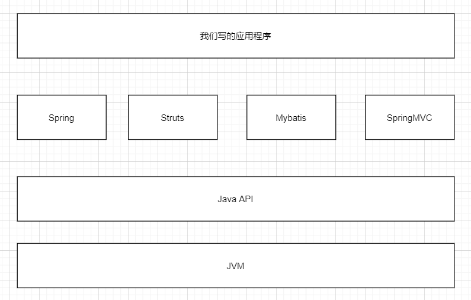
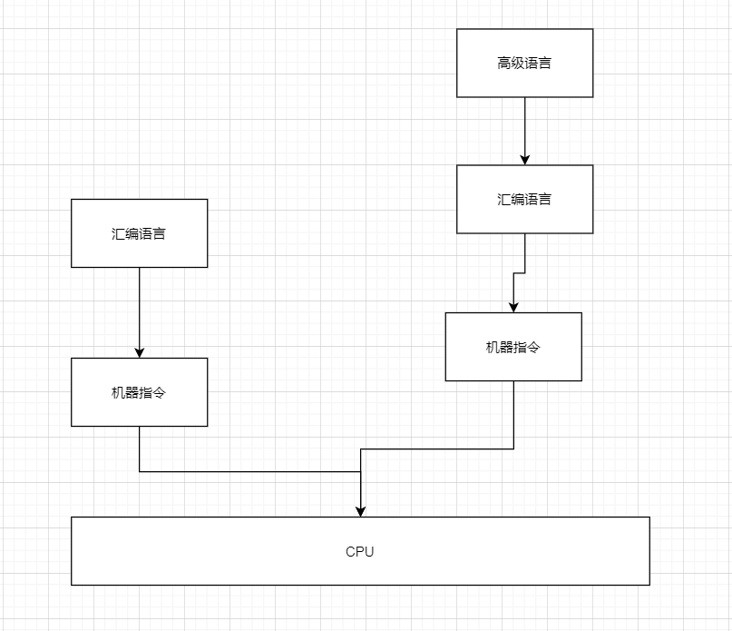
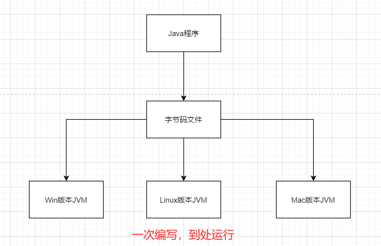
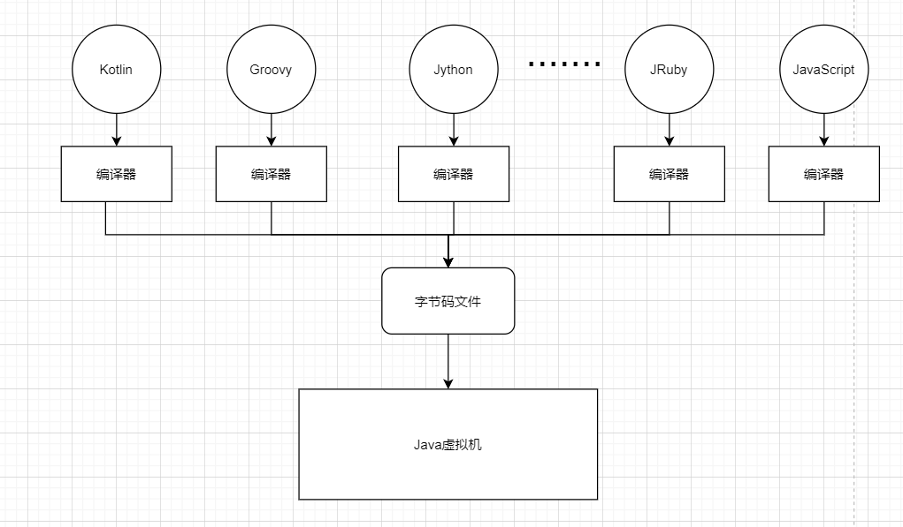
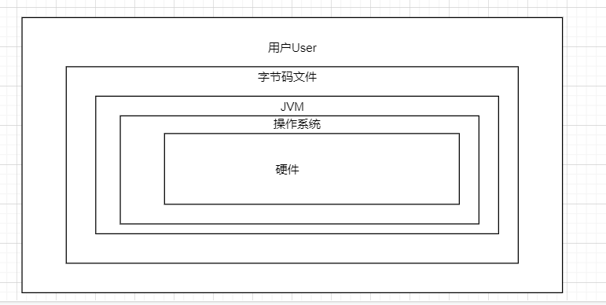
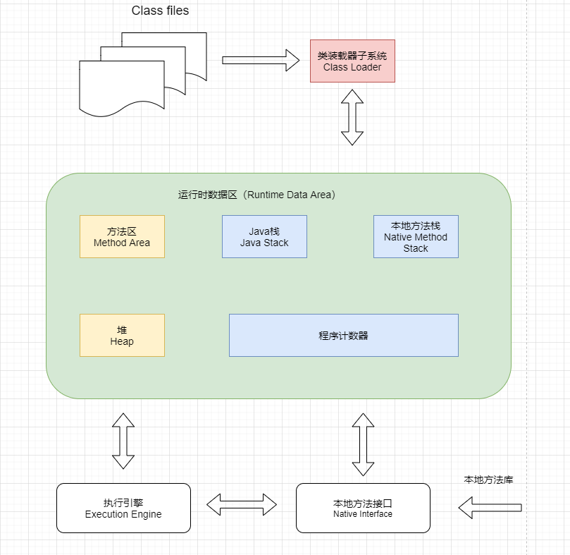
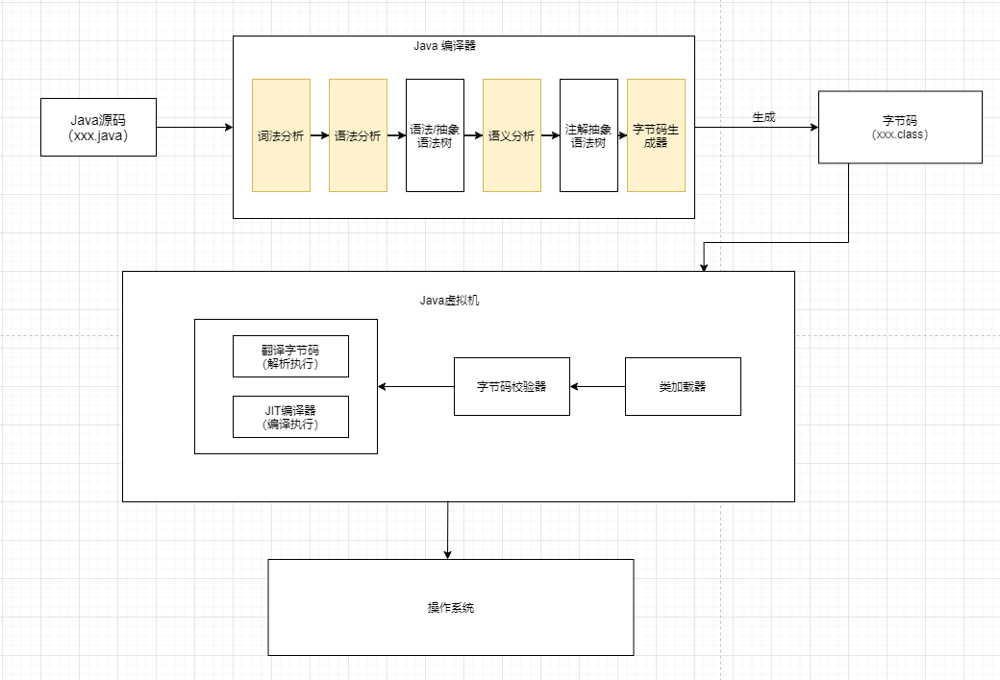

### Java - 底层建筑 - JVM - 第1篇 - 开篇概述

**我们在学习过程中的真实系统架构如下 - 所有的操作都是基于JVM来进行的**

**我们学习的大部分都是上层建筑 - 框架 已经封装好的**

#### 开发人员应该如何看待上层框架

- 一些有一定工作经验的开发人员，觉得框架、微服务才是重点，基础不重要，这是本末倒置
- 如果我们把核心类库比作数学公式的话，那么Java虚拟机的知识就是公式的推导过程

#### 架构师每天在思考什么？

- 如何让系统更快
- 如何避免系统出现瓶颈

#### 为什么需要学习JVM？

- 面试需要？
- 为了系统性能？
- 极客的精神

#### Java 跨平台的语言

#### JVM 跨语言的平台

#### 虚拟机

- 所谓虚拟机（Virtual Machine），就是一台虚拟的计算机，他是一款软件，用来执行一系列虚拟计算机指令。大体上，虚拟机可以分为系统虚拟机和程序虚拟机
- Visual Box 和 VMware救赎徐系统虚拟机，完全对物理机的仿真 
- 程序虚拟机代表就是Java虚拟机，是为了运行程序而设计
- Java的核心就是Java虚拟机 - **JVM**
- **Java虚拟机就是二进制字节码的运行环境**
  - 一次编译，到处运行
  - 自动内存管理
  - 自动垃圾回收功能

#### JVM的位置

#### JVM的整体结构

#### Java代码执行流程

#### JVM的架构模型

- Java编译器输入的指令流基本上是一种基于**栈的指令集架构**，另一种架构是基于 **寄存器的指令集架构 **

#### JVM的生命周期

- **虚拟机的启动**
  - Java虚拟机的启动时通过引导类加载器（Bootstrap Class Loader）创建一个初始类（initial Class ）来实现的。这个类是由虚拟机的具体实现指定的
- **虚拟机的执行**
  - 一个运行中的Java虚拟机有着一个清晰的任务：执行Java程序
  - 程序开始执行时他才运行，程序结束的时候他就停止
  - **执行一个所谓的Java程序的时候，真真正正执行的是一个Java虚拟机的进程**
- **虚拟机的退出**
  -  程序的正常执行结束
  - 程序在执行过程中遇到了异常或错误而异常终止
  - 由于操作系统出现错误而导致Java虚拟机进程终止
  - 某线程调用Runtime类或者System类的exit方法，或者Runtime类的halt方法，并且Java安全管理起页允许这次exit或者halt操作
  - 除此之外，JNI（Java Native Interface）规范描述了用JNI Invocation API 来加载或卸载Java虚拟机时候，Java虚拟机退出的情况

#### JVM的发展历程

- jdk1.0 - Sun - Sun Classic VM 第一款商用Java虚拟机
  - 只提供解释器
  - 如果使用JIT编译器，就要进行外挂。但是不能共存  
  - HotSpot内置此虚拟机
- jdk1.2 - Sun - Exact VM
  - 准确式内存管理
  - 具备现在高效能虚拟机的雏形
  - 热点探测 / 编译器解释器混合工作
- **jdk1.3 - Sun - HotSpot VM**
  - 至今也在使用

- **BEA  - JRockit  VM - 2008 被甲骨文收购**
  - 不包含解析器实现 全部代码使用即时编译器实现 
  - 是世界上最快的虚拟机

- **IBM - J9**
  - 最有影响力的三大商用虚拟机之一

- KVM和CDC/CLDC HotSpot
  - 老人机 传感器
- Azul VM
  - 与特定硬件平台，快
- Liquid VM
  - 运行在自己家的系统上
- Apache Harmomy 
  - 被Sun公司抵制

- Microsoft JVM
  - 为了支持  IE3 中的 Java Applets

- Taobao JVM
  - 基于OpenJDK 开发的定制版 AlibabaJDK
- Dalvik VM
  - 谷歌开发的，应用于Android系统
- Graal VM
  - 执行任何的程序