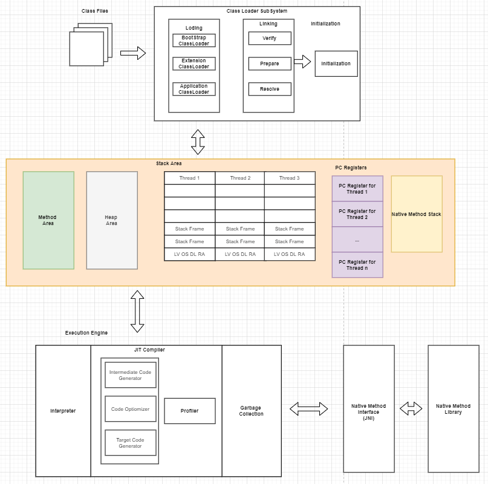
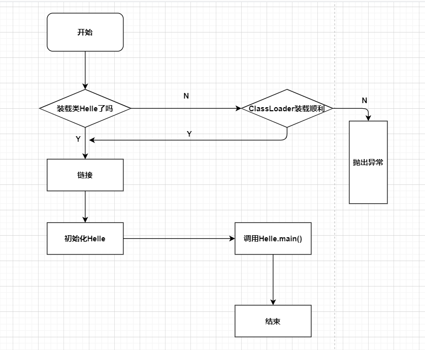
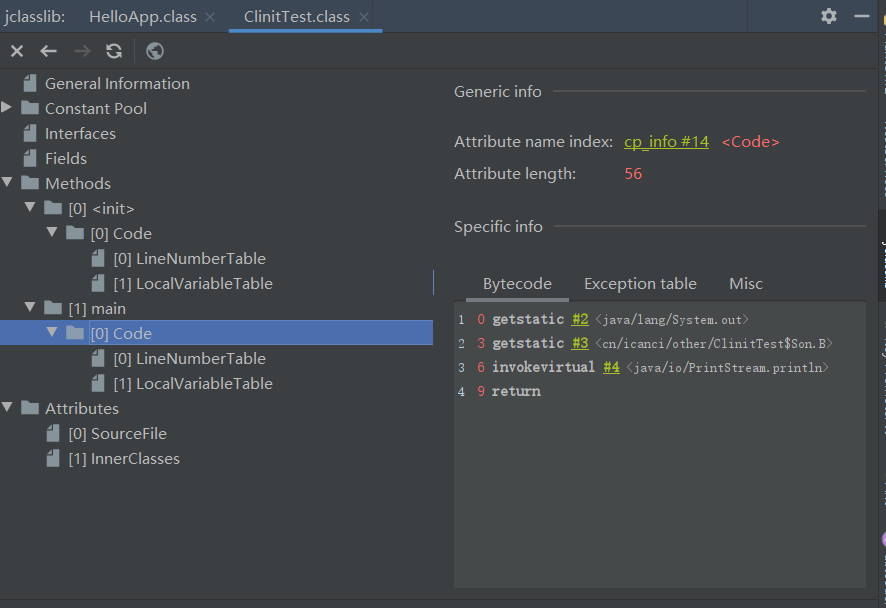
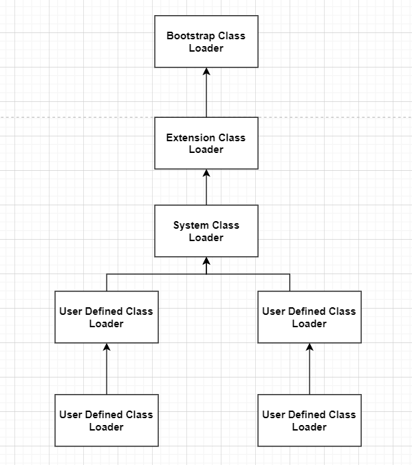
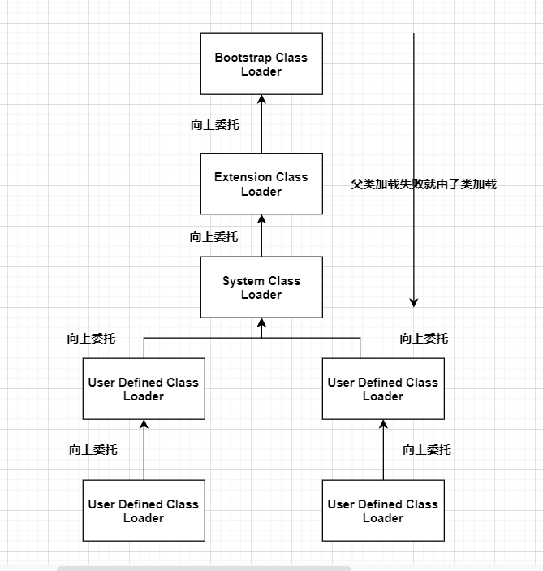

### Java - 底层建筑 - JVM - 第2篇 - 类加载子系统

#### JVM 内存的结构



#### 类加载器子系统的作用

- 具体图在上面
- 类加载器子系统负责从文件系统或者网络中加载Class文件，class文件在文件开始由特定的文件标识，是一个**魔数**
- ClassLoader只负责class文件的加载，至于class文件是否可以运行，则由 Execution Engine决定
- 加载的类信息存放于一块称为方法区的内存空间。除了类信息外，方法区中还会存放运行时常量池的信息，可能还包括字符串字面量和数字常量（这部分常量信息是Class文件中常量池部分的内存映射）

#### 类加载器ClassLoader角色

- class file 存在本地磁盘上，可以理解为设计师画在图纸上的模板，而最终这个模板在执行的时候是要加载到JVM当中来根据这个文件实例化出n个一摸一样的实例
- class file 加载到JVM中，被称为DNA元数据模板，放在方法区
- 在 .class 文件 -> JVM -> 最终称为元数据模板，此过程就要一个运输工具（类装载器Class Loader）扮演一个快递员的角色

#### 类的加载过程




**加载**

- 通过一个类的全限定名获取定义此类的二进制字节流
- 将这个字节流代表的静态存储结构转化为方法区的运行时数据结构
- **在内存中生成一个代表这个类的java.lang.Class对象**，作为方法区的这个类的各种数据的访问入口

**加载 .class 文件的方式**

- 从本地系统中直接加载
- 通过网络获取，典型场景：Web Applet
- 从Zip压缩包中获取，称为日后jar、war格式的基础
- 运行时计算生成，使用最多的就是：动态代理技术
- 从其他文件生成，典型场景：JSP应用
- 从专有数据库中提取.class文件，比较少见
- 从加密文件中获取，典型的防Class文件被反编译的保护措施

**链接**

- **验证**
  - 目的在于确保Class文件的字节流中包含信息符合当前的虚拟机要求，保证被加载类的正确性，不会危害虚拟机的自身安全
  - 注意包括四种验证，文件格式验证，元数据验证，字节码验证，符号引用验证
- **准备**
  - 为类变量分配内存并且设置该类变量的默认初始值，即0值
  - **这里不包含用final修饰的static，因为final在编译的时候就会分配了，准备阶段会显示初始化**
  - **这里不会为实例变量分配初始化**，类变量会分配在方法区中，而实例变量是会随着对象一起分配到Java堆中
- **解析**
  - 就常量池内的符号引用转化为直接引用的过程
  - 事实上，解析操作往往会随着JVM在执行完初始化之后再执行
  - 符号引用就是一组符号来描述所引用的目标。符号引用得字面量形式明确定义在《Java虚拟机规范》的Class文件格式中，直接引用的就是直接指向目标的指针、相对偏移或者一个简介定位到目标的句柄
  - 解析动作主要针对类或者接口、字段、类方法、接口方法、方法类型。对应常量池中的CONSTANT_Class_info、CONSTANT_Fieldref_info、CONSTANT_Methodref_info等

```java
public class HelloApp {

    // prepare：a 赋值为默认值-零值
    // 初始化的时候：a赋值为1
    // 数据的类型不一样，初始值也不一样
    private static int a = 1;

    public static void main(String[] args) {
        System.out.println(a);
    }
}

```

**初始化操作**

- 初始化阶段就是执行类构造器方法<clinit>()的过程
- 此方法不需要定义，是Javac编译器自动收集类中所有的类变量的赋值动作和静态代码块中的语句合并而来
- 构造器方法中指令按语句再源文件中出现的顺序执行
- <clinit>()不同于类的构造器。（关联：构造器是虚拟机视角下的<init>()）
- 若该类有父类，JVM会保证子类的<clinit>()执行之前，父类的<clinit>()已经执行完毕
- 虚拟机必须保证一个类的<clinit>() 方法在多线程下被同步加锁

```java
public class ClinitTest {
    static class Father {
        public static int A = 1;

        static {
            A = 2;
        }
    }

    static class Son extends Father {
        public static int B = A;
    }

    public static void main(String[] args) {
        // 加载Father类
        // 加载Son类
        System.out.println(Son.B);
    }
}

```



#### 类加载器分类

- JVM支持两种类型的类加载器，分别是**引导类加载器（Bootstrap ClassLoader）**和 **自定义加载器（User-Defined ClassLoader）**
- 从概念上讲，自定义类加载器一般指的是程序中由开发人员自定义的一类类加载器，但是Java虚拟机规范没有这样定义，而是**将所有的派生于抽象类ClassLoader的类加载器都划分为自定义类加载器**
- 无论加载器的类型如何划分，在程序中我们最常见的类加载器只有3个，如下



```java
public class ClassLoaderTest {
    public static void main(String[] args) {
        // 获取系统类加载器
        ClassLoader systemClassLoader = ClassLoader.getSystemClassLoader();
        // sun.misc.Launcher$AppClassLoader@18b4aac2
        System.out.println(systemClassLoader);
        // 获取其上层：拓展类加载器
        ClassLoader parent = systemClassLoader.getParent();
        // sun.misc.Launcher$ExtClassLoader@1540e19d
        System.out.println(parent);
        // 获取顶层加载器 BootStrapClassLoader 获取不到 因为C/C++写的
        ClassLoader parent1 = parent.getParent();
        // null
        System.out.println(parent1);

        // 对于用户来说 默认使用的是系统类加载器
        ClassLoader classLoader = ClassLoaderTest.class.getClassLoader();
        // sun.misc.Launcher$AppClassLoader@18b4aac2
        System.out.println(classLoader);
        // sun.misc.Launcher$ExtClassLoader@1540e19d
        ClassLoader parent2 = classLoader.getParent();
        System.out.println(parent2);
        // 在上层
        // null
        ClassLoader parent3 = parent2.getParent();
        System.out.println(parent3);
        
        // Java的核心类库都是使用引导类加载的
        // String 类是使用引导类加载器加载的
        ClassLoader classLoader1 = String.class.getClassLoader();
        System.out.println(classLoader1);
    }
}

```

**虚拟机自带的加载器**

- 启动类加载器（引导类加载器 Bootstrap ClassLoader）
  - 这个类加载使用C/C++语言实现的，嵌套在JVM内部
  - 它用来加载Java的核心库（JAVA_HOME/jre/lib/rt.jar、resources.jar或者sun.boot.class.path路径下的内容），用于提供JVM自身需要的类
  - 并不继承自java.lang.ClassLoader ，没有父加载器
  - 加载拓展类和应用程序类加载器，并指定为他们的父加载器
  - 处于安全考虑，Bootstrap启动类只加载包名为 java、javax、sun等开头的类

- 拓展类加载器 （Extension ClassLoader）
  - Java语言编写，由 sun.misc.Launcher&ExtClassLoader 实现
  - 派生于ClassLoader类
  - 父类加载器为启动类加载器
  - 从java.ext.dirs系统属性所指定的目录中加载类库，或者从JDK的安装目录jre/lib/ext子目录（拓展目录）下加载类库。如果用户创建的Jar放在此目录下，也会自带由拓展类加载器加载。

- 应用程序类加载器（系统类加载器 AppClassLoader）
  - Java语言编写，由 sun.misc.Launcher&AppClassLoader实现
  - 派生于ClassLoader类
  - 父类加载器为拓展类加载器
  - 它负责加载的是环境变量classpath或者系统属性 java.class.path 指定路径下的类库
  - **该类加载时程序中默认的类加载器**，一般来说，Java应用程序都是由它来完成加载
  - 通过ClassLoader#getSystemClassLoader()方法可以获取到该类加载器

```java
public class ClassLoaderTest1 {
    public static void main(String[] args) {
        System.out.println("启动类加载器");
        URL[] urLs = Launcher.getBootstrapClassPath().getURLs();
        for (URL urL : urLs) {
            System.out.println(urL.toString());
        }

        System.out.println("拓展类加载器");
        String property = System.getProperty("java.ext.dirs");
        for (String path : property.split(";")) {
            System.out.println(path);
        }
    }
}

```

```java
启动类加载器
file:/D:/jdk/jdk1.8/jre/lib/resources.jar
file:/D:/jdk/jdk1.8/jre/lib/rt.jar
file:/D:/jdk/jdk1.8/jre/lib/sunrsasign.jar
file:/D:/jdk/jdk1.8/jre/lib/jsse.jar
file:/D:/jdk/jdk1.8/jre/lib/jce.jar
file:/D:/jdk/jdk1.8/jre/lib/charsets.jar
file:/D:/jdk/jdk1.8/jre/lib/jfr.jar
file:/D:/jdk/jdk1.8/jre/classes
拓展类加载器
D:\jdk\jdk1.8\jre\lib\ext
C:\WINDOWS\Sun\Java\lib\ext
```

#### 用户自定义类加载器

- 在Java的日常应用程序开发中，类的加载几乎是由上述3种类加载器相互配合执行的，在必要的时候，我们还可以自定义类加载器，来定制类的加载方式
- 为什么需要自定义类加载器？
  - 隔离加载类
  - 修改类加载的方式
  - 拓展加载源
  - 防止源码泄漏
- 用户自定义类加载器实现步骤
  - 开发人员可以通过继承抽象类 java.lang.ClassLoader类的方法，实现自己的类加载器，以满足一些特殊的要求
  - 在JDK1.2之前，在自定义类加载器的时候，总是会去继承ClassLoader类并重写loadClass()方法，从而实现自定义的类加载器，但是在JDK1.2之后，已经不在建议用户去覆盖loadClass()方法，而是建议把自定义类加载逻辑写在findClass()方法中
  - 在编写自定义类加载器的时候，如果没有太过于复杂的有要求，可以直接继承URLClassLaoder类，这样可以避免自己编写findClass() 方法以及器获取字节码流的方式，使得自定义类加载器编写更加简洁

#### 获取ClassLoader的途径

- 获取当前类的ClassLoader
  - clazz.getClassLoader()
- 获取当前线程上下文的ClassLoader
  - Thread.currentThread().getContextClassLoader()
- 获取系统的ClassLoader
  - ClassLoader.getSystemClassLoader()
- 获取调用者的ClassLoader
  - DriverManager.getCallerClassLoader

#### 双亲委派机制

- Java虚拟机对class文件采用的是**按需加载**的方式，也就是说当需要使用该类的时候才会将它的class文件加载到内存生成class对象。而且加载某个类的class文件的时候，Java虚拟机采用的是 **双亲委派机制** ，也就是把请求交给父类处理，它是一种任务委派机制



- 工作原理
  - 如果一个类加载器收到了类加载的请求，它并不会自己先去加载，而是把这个请求委托给父类的加载器去执行
  - 如果父类加载器还存在器父类加载器，则进一步向上委托，一次递归请求最终到达顶层的启动类加载器
  - 如果父类加载器可以完成类加载任务，就成功返回，如果父类加载器无法完成此任务，子加载器才会尝试自己去加载，这就是双亲委派机制
- 接口是由引导类加载器加载，而接口的实现则是由系统类加载器加载

- 优势
  - 避免类的重复加载
  - 保护程序安全，防止核心API被随意篡改
    - 自定义类：java.lang.String
    - 自定义类：java.lang.IcStart  `抛出异常 java.lang.SecurityException: Prohibited package name: java.lang`

#### 沙箱安全机制

- 自定义String类，但是在加载自定义String类的时候会率先使用引导类加载器加载，而引导类加载器在加载的过程中会先加载JDK自带的文件(rt.jar包中的java\lang\String.class)，报错信息是没有main方法，就是因为加载的是 rt.jar 包中的String类。这样就可以保证对Java核心源代码的保护，这就是**沙箱安全机制**

#### 其他

- 在JVM中表示两个Class对象是否为同一个类存在的两个必要条件
  - 类的完整类名必须一致 - 也就是**全限定类名必须完全一致**
  - 加载这个类的ClassLoader(指的是ClassLoader实例对象)必须相同
- 换句话说，在JVM中，即使这两个类对象(Class对象)来源于同一个Class文件，被同一个虚拟机加载，只要加载它们的ClassLoader对象不同，那么这两个类对象也是不相等的

- JVM必须知道一个类型是由启动加载器的还是由用户加载器加载的。如果一个类型是由用户类加载器加载的，那么JVM会**将这个类加载器的一个引用作为类型信息的一部分保存在方法区内**，当解析一个类型到另一个类型的引用的时候，JVM需要保证这两个类型的加载器是相同的。

#### 类的主动使用和被动使用

- 主动使用的七种情况
  - 创建类的实例
  - 访问某个类的或者接口的静态变量，或者对该静态变量赋值
  - 调用类的静态方法
  - 反射(Class.forName("xxx.xxx.xxx"))
  - 初始化一个类的子类
  - Java虚拟机启动的时候被标记为启动类的类
  - Java7开始支持动态的语言支持
    - java.lang.invoke.MethodHandle 实例的解析结果
    - REF_getStatic、REF_putStatic、REF_invokeStatic对应的类没有初始化，则初始化
- 除了以上的七种情况，其他使用Java类的方式都被看作是对**类的被动使用**，都**不会导致类的初始化**

