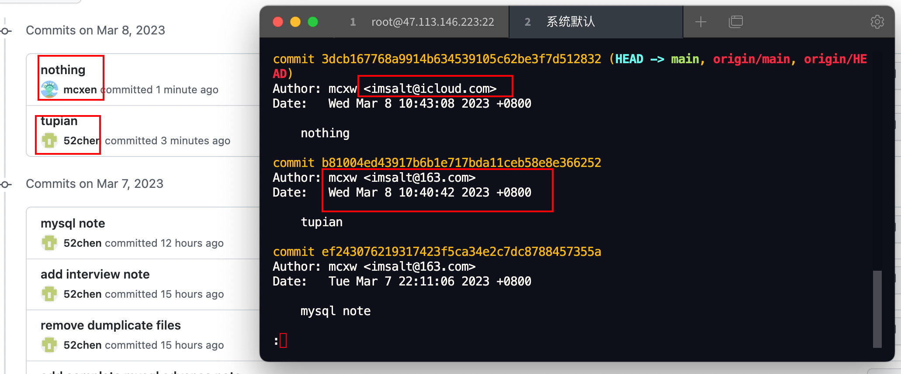
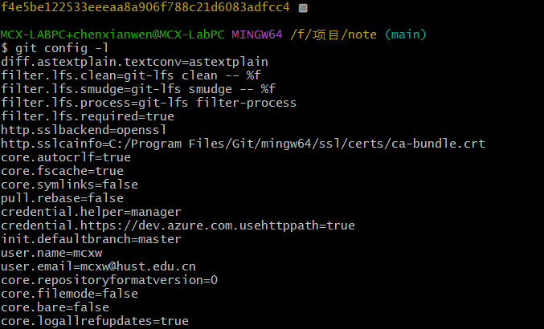
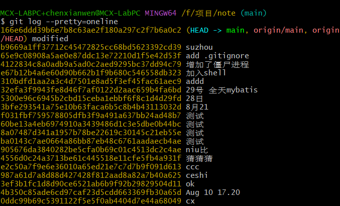
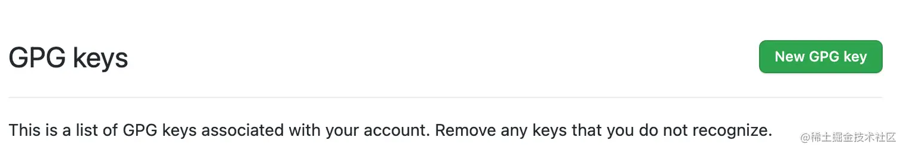

## Git快速

### git常用

先来创建一个版本库：先在自己本地找一个合适的地方通过下面的命令创建一个空的目录：

```shell
$ mkdir gitspace
```

然后进入该目录下，通过如下命令把这个目录变成Git可以管理的仓库：

```sh
$ git init
```

可以看到在当前目录下多了一个 .git 的目录，这个目录是Git来跟踪管理版本库的，这样就把git仓库建好啦。

接着使用git add命令将该文本文件添加到仓库中：

```sh
git add demo1.txt
```

添加当前目录下的所有文件到暂存区：

```
git add .
```

rm命令删除的是工作区里的文件，如果要从版本库中删除文件，那么就需要使用git rm命令删除，并且删除后记得使用`git add` . 再用`git commit -m "delete" `命令提交。

```bash
git rm demo2.txt
```

如果删除的是工作区的文件，后来发现删除错了，那么可以通过git checkout命令用版本库里的文件进行恢复：

```lua
$ git checkout -- demo2.txt
```

进行设置，在命令行输入以下代码设置你的名字和Email地址：

```sh
$ git config --global user.name "MCX-air"
$ git config --global user.email "imsalt@icloud.com"
```

> '我猜测这里的email，可能会是使得github的用户名字发生改变的原因，它自动去匹配了imsalt@163.com的github账户。
>
> 

git config -l 可以查看现在的git环境详细配置：

```sh
git config --system --list #查看系统configgit 
git config --global  --list #查看当前用户（global）配置
git config --local  --list #查看当前仓库配置信息
```



用git commit命令，把文件提交到仓库：

```sh
git commit -m "提交demo1.txt到仓库"
```

注：-m后面输入的是本次提交的说明，也就是注释，可以随便输入，一般开发是就注释下这次修改的内容和说明等等。 这时候我们已经提交了一个版本的文件到仓库上了，那如果这时候需要修改该文件的内容。

可以先运行下下面的命令，查看仓库当前的状态：

```lua
git status
```

这时候可以看到demo1已经modified了，但是还没有提交修改。还可以使用git diff命令，查看修改的内容：

```
git diff demo1.txt
```

### 版本管理

可以使用git log命令查看历史信息：

```bash
git log
```

如果我们刚刚添加的hello world内容有误，怎么办？那么就需要将文件回退到上一个版本，这时候就需要使用到git reset命令了。

```css
git reset --hard HEAD^
```

版本已经回退到了上一个版本（提交demo1到仓库那个版本）。 注意：HEAD表示当前版本，则HEAD^表示上一个版本，那么上上版本就是HEAD^^。

刚刚添加的hello word是对的，我们又想回到刚刚的那个版本怎么办呢？可以直接在文本添加然后在提交上去。当然这不是这里要说的办法。我们还是可以使用git reset命令来进行回滚到最新版本。这里使用的命令是：

```css
git reset --hard commit_id
```

这里不能用HEAD而必须使用commit_id ，因为最新版本在之前返回时已经被删除了，而这里的commitid可以通过刚刚提到的git log命令加上参数：--pretty=oneline来获取：

```ini
git log --pretty=oneline
```



所以回滚到最新版本就是：

```css
git reset --hard 75b036995f2ba5a6ebabaad22ce0a3d916c1b393
```

### 查看当前的远程库

可以使用`git remote`命令，它会列出每个远程库的简短名字。例如：

```
[T:wooden-dummy] (master)$ git remote
origin
```


可以看到这个库有一个名为`origin`的远程仓库。

可以配置参数`-v(--verbose)`来显示对应的克隆地址：

```
git remote -v
origin  https://...wooden-dummy.git (fetch)
origin  https://...wooden-dummy.git (push)
```

可以使用`git remote show`命令查看更多的关于远程git仓库的信息。

### 给当前库添加远程库

我们可以用`remote add`给项目增加一个新的远程git仓库，语法为：

```
git remote add <shortname> <url>
```

比方说我们在本地通过脚手架生成了一个项目，然后希望通过将该项目放到线上去，但是如果克隆项目必须当前目录为空目录。我们需要通过shell添加远程库：

```
git remote add origin https://...wooden-dummy.git
```

然后通过上面的`git remote -v`来查看刚刚添加的远程仓库是否添加上去了。

### 远程仓库的重命名与移除

可以使用`git remote rename` 来修改一个仓库的简写名字。比如，我们将现有的`origin`重命名为`old-origin`：

```
git remote rename origin old-origin
```

然后查看改的结果：

```
git remote -v
old-origin	http://xxx.git (fetch)
old-origin	http://xxx.git (push)
```

假设我们的远程git仓库挪到了一个新的域名，老的仓库不需要了，我们可以使用`git remote remove`来移除。比如，我们移除上面的`old-origin`源：

```
git remote remove old-origin
```

### git clone、git pull和git fetch的区别

#### git clone 

git clone 是将其他仓库克隆到本地，包括被 clone 仓库的版本变化，因此本地无需是一个仓库，且克隆将设置额外的远程跟踪分支。因为是克隆来的，所以 .git 文件夹里存放着与远程仓库一模一样的版本库记录，clone 操作是一个从无到有的克隆操作。

基本用法：

```
$ git clone <版本库的URL> [本地目录名]
```

如果不指定本地目录，则会在本地生成一个远程仓库同名的目录。

#### git pull

git pull 是拉取远程分支更新到本地仓库再与本地分支进行合并，即：git pull = git fetch + git merge

基本用法：

```
$ git pull <远程主机名> [远程分支名]:[本地分支名]
```

如果不指定远程分支名和本地分支名，则会将远程 master 分支拉取下来和本地的当前分支合并。

#### git fetch

理解 fetch 的关键, 是理解 FETCH_HEAD，FETCH_HEAD 指的是：某个 branch 在服务器上的最新状态。这个列表保存在 .git/FETCH_HEAD 文件中，其中每一行对应于远程服务器的一个分支。
当前分支指向的 FETCH_HEAD，就是这个文件第一行对应的那个分支。一般来说，存在两种情况：

- 如果没有显式的指定远程分支，则远程分支的 master 将作为默认的 FETCH_HEAD
- 如果指定了远程分支，就将这个远程分支作为 FETCH_HEAD

git fetch 更新本地仓库的两种用法：

```bash
# 方法一
$ git fetch origin master                #从远程的origin仓库的master分支下载代码到本地的origin master
$ git log -p master.. origin/master      #比较本地的仓库和远程参考的区别
$ git merge origin/master                #把远程下载下来的代码合并到本地仓库，远程的和本地的合并
# 方法二
$ git fetch origin master:temp           #从远程的origin仓库的master分支下载到本地并新建一个分支temp
$ git diff temp                          #比较master分支和temp分支的不同
$ git merge temp                         #合并temp分支到master分支
$ git branch -d temp                     #删除temp
```

区别

1. **是否需要本地初始化仓库**

git clone 不需要，git pull 和 git fetch 需要。

 

2. **是否可以指定分支推送到远程**

git clone下来的项目可以直接推送到远程，git pull 和 git fetch 需要先执行 git remote add 添加远程仓库后才能 push。

### git分支

我们可以通过命令git branch查看分支，会列出所有的分支，当前分支前面会添加一个星号。

```sh
git branch dev  #当前的分支的信息

git checkout dev #切换到哪一个分支
```

那么可以将dev分支上的内容合并到master分支上么？是可以的，在master分支下使用git merge dev命令即可

可以使用下面的命令删除dev分支：

```
git brach -d dev
```

或者

```
$ git branch -d newtest
Deleted branch newtest (was c1501a2
```


### GIT GPG

#### 安装 GPG

在 macOS 下通过 Homebrew 来安装

```css
brew install gpg 
```

#### 使用 GPG，生成公钥和私钥

在终端下执行命令

```css
gpg --full-generate-key
```

此处：全部默认即可；除用户/邮箱/密码 自定义

#### 显示和导出公钥和私钥

```scss
gpg --list-keys //查看所有keys
gpg --list-public-keys //查看所有公钥
gpg --list-secret-keys //查看所有私钥
```


```sh
mcxw@mcxAir ~ % gpg -k
[keyboxd]
---------
pub   ed25519 2023-11-24 [SC]
      C81E6413FEA5499BA888E****2999E5E89
uid             [ 绝对 ] mcxen (github邮件地址) <im***t@icloud.com>
sub   cv25519 2023-11-24 [E]

# C81E6413FEA5499BA开头的就是ID
```


上面看到的都是精简的内容，如果要看到完整的内容，通过如下命令

```scss
gpg --armor --export <邮箱或者指纹字符串或者长密钥 ID> //查看完整的公钥
gpg --armor --export-secret-keys <邮箱或者指纹字符串或者长密钥 ID> //查看完整的私钥
```


```sh
mcxw@mcxAir ~ % cd Downloads 
mcxw@mcxAir Downloads % gpg --output mygpgkey_pub.gpg --armor --export C81E6413FEA5499BA****
#上面直接生成文件
mcxw@mcxAir Downloads % gpg --armor --export C81E6413FEA5499BA888E7D6D05*****
-----BEGIN PGP PUBLIC KEY BLOCK-----

mDMEZWCanRYJKwYBBAHaRw8BAQdAxQLfXmdhVogjQMIvPIc1wrrBVP24NET3DKdl
a73EkzW0Lm1jeGVuIChnaXRodWLpgq7ku7blnLDlnYApIDxpbXNhbHRAaWNsb3Vk
LmNvbT6IkwQTFgoAOxYhBMgeZBP+pUmbqIjn1tBcdFKZnl6JBQJlYJqdAhsDBQsJ
CAcCAiICBhUKCQgLAgQWAgMBA*****

-----END PGP PUBLIC KEY BLOCK-----
mcxw@mcxAir Downloads % 

```


GitHub 的 Commit 加密

访问https://github.com/settings/keys, 点击右侧的 `New GPG keys`，将公钥输入进去，**注意是公钥，不是私钥**，得到的结果如下图。



本地电脑设置密钥，打开终端输入：

```lua
git config --global gpg.program gpg
git config --global user.signingkey <长密钥 ID>
git config --global commit.gpgsign true //让每次 commit 自动要求签名，如果不增加则需要 git commit -S -m "内容"，每次加上 -S 参数。
```

但是在 `git commit` 的时候总会遇到问题

```vbnet
error: gpg failed to sign the data
fatal: failed to write commit object
```

如何解决：

- 注意： M1 芯片安装 pinentry-mac 的目录是 /opt/homebrew/bin/pinentry-mac

```sh
brew upgrade gnupg  # This has a make step which takes a while 
brew link --overwrite gnupg 
brew install pinentry-mac 
echo "pinentry-program /opt/homebrew/bin/pinentry-mac" >> ~/.gnupg/gpg-agent.conf 
killall gpg-agent 
vim ~/.zshrc -> 
#在文件中输入： export GPG_TTY=(tty) 
vim ~/bash_profile -> 
#在文件中输入： export GPG_TTY=(tty)
```


重启电脑，打开控制台 

```sh
echo "test" | gpg --clearsign # 弹出 输入密码框即成功
```


### Git提交信息规范

Git 每次提交代码，都要写 Commit message（提交说明）


```
$ git commit -m "hello world"
```

上面代码的-m 参数，就是用来指定 `commit mesage` 的。

如果一行不够，可以只执行`git commit`，就会跳出文本编辑器，让你写多行.

```
$ git commit
```

#### Commit message 的格式

每次提交，Commit message 都包括三个部分：Header，Body 和 Footer。

```
<Header>

<Body>

<Footer>
```

其中，Header 是必需的，Body 和 Footer 可以省略。

#### Header

Header 部分只有一行，包括三个字段：type（必需）、scope（可选）、subject（必需）。

```
<type>: <subject>
```

**type**

type 用于说明 commit 的类别，只允许使用下面 7 个标识。

- feat：新功能（feature）
- fix：修补 bug
- docs：文档（documentation）
- style： 格式（不影响代码运行的变动）
- refactor：重构（即不是新增功能，也不是修改 bug 的代码变动）
- test：增加测试
- chore：构建过程或辅助工具的变动

**subject**

subject 是 commit 目的的简短描述，不超过 50 个字符。

- 以动词开头，使用第一人称现在时，比如 change，而不是 changed 或 changes
- 第一个字母小写
- 结尾不加句号（.）

#### Body

Body 部分是对本次 commit 的详细描述，可以分成多行。下面是一个范例。

```
More detailed explanatory text, if necessary.  Wrap it to
about 72 characters or so.

Further paragraphs come after blank lines.

- Bullet points are okay, too
- Use a hanging indent
```

有两个注意点。

- 使用第一人称现在时，比如使用 change 而不是 changed 或 changes。
- 应该说明代码变动的动机，以及与以前行为的对比。

#### Footer

Footer 部分只用于两种情况：

- 关联 Issue
- 关闭 Issue

**关联 Issue**

本次提交如果和摸个 issue 有关系则需要写上这个，格式如下：

```
Issue #1, #2, #3
```

**关闭 Issue**

如果当前提交信息解决了某个 issue，那么可以在 Footer 部分关闭这个 issue，关闭的格式如下：

```
Close #1, #2, #3
```

#### Revert

还有一种特殊情况，如果当前 commit 用于撤销以前的 commit，则必须以`revert:`开头，后面跟着被撤销 Commit 的 Header。

```
revert: feat(pencil): add 'graphiteWidth' option

This reverts commit 667ecc1654a317a13331b17617d973392f415f02.
```

Body 部分的格式是固定的，必须写成 `This reverts commit <hash>.`，其中的`hash`是被撤销 commit 的 SHA 标识符。

如果当前 commit 与被撤销的 commit，在同一个发布（release）里面，那么它们都不会出现在 Change log 里面。如果两者在不同的发布，那么当前 commit，会出现在 Change log 的`Reverts`小标题下面。

#### 例子

```
feat: 添加了分享功能

给每篇博文添加了分享功能

- 添加分享到微博功能
- 添加分享到微信功能
- 添加分享到朋友圈功能

Issue #1, #2
Close #1
```

## 