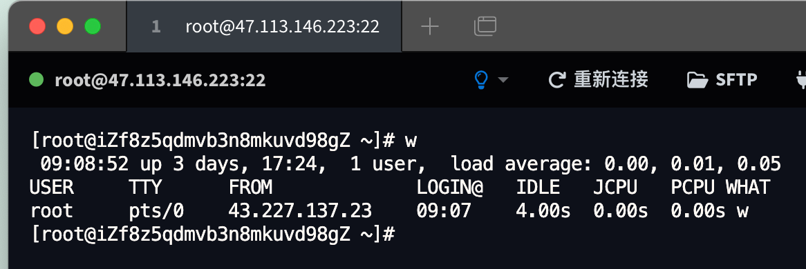
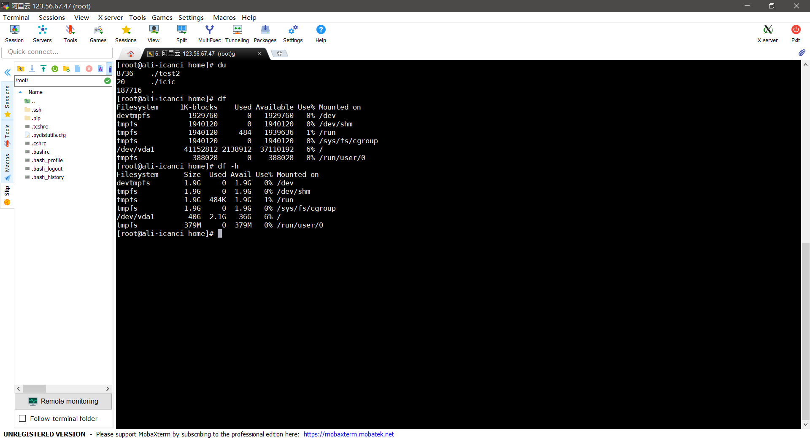
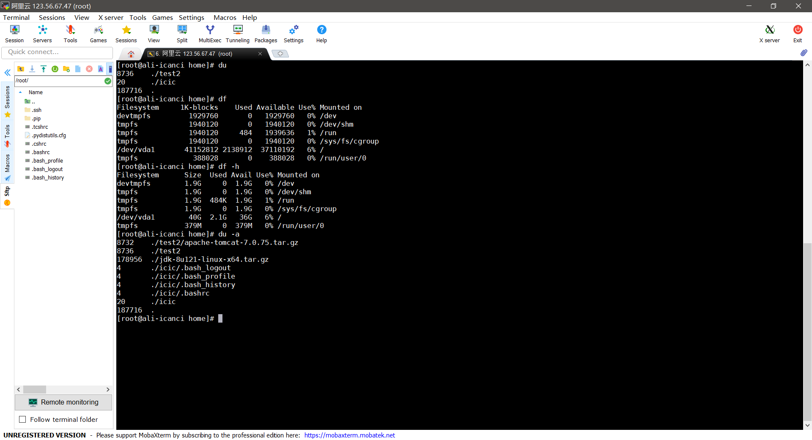
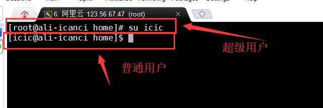
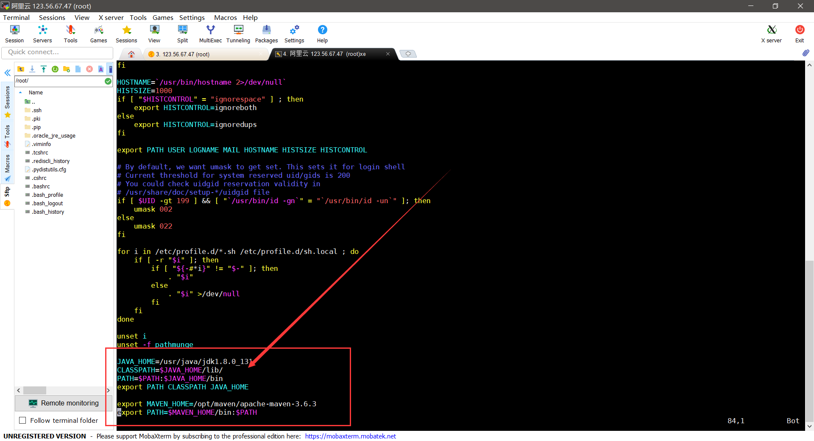
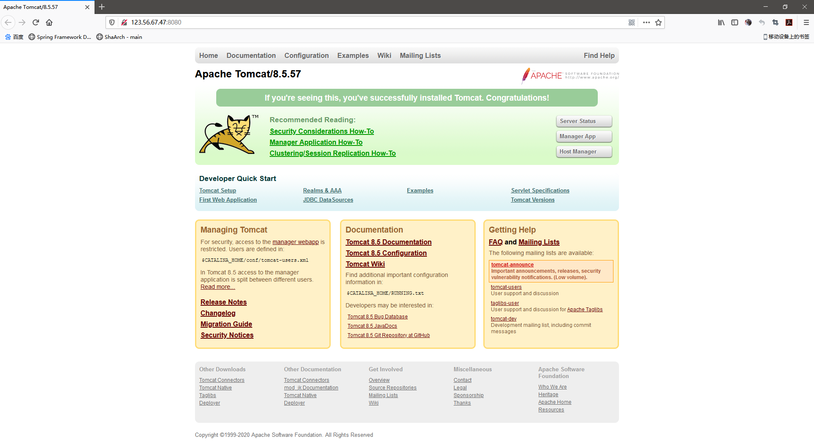

# Linux 基础笔记

## Linux入门基础

**前言：为什么需要学习**

因为消息队列（Kafka、RabbitMQ），缓存（Redis），搜索引擎（ES），分布式，集群（需要购买多台服务器）

本次教程系统基于CentOS 7 学习。

**学习方式**

- 认识Linux（Linux一切皆文件：文件就读写 权限）
- 基本的命令 （重点：Git有一些基本的命令（文件操作、目录管理、文件属性、Vim编辑器、账号管理、磁盘管理））
- 软件的安装和部署（Java、Tomcat、Docker）

> 为什么需要学习Linux

很多的大型项目是部署在Linux系统上的，所有的Java岗位都需要Linux

### 环境搭建

需要配置安全组，入口规则和出口规则：其实就是开发端口

然后获取公网地址：xxx.xxx.xxx.xxx

设置root密码：qqq111...

使用 `MobaXterm` 连接 如下


使用TABBY连接：


> ## 修改阿里云丑陋的名字
>
> 1.通过命令`hostname`可以知道当前的主机名称
> 2.通过命令`hostnamectl set-hostname hello`可以将主机名修改为hello
>
> ```sh
> root@iZf8z5qdmvb3n8mkuvd98gZ ~]# hostname
> iZf8z5qdmvb3n8mkuvd98gZ
> [root@iZf8z5qdmvb3n8mkuvd98gZ ~]# hostnamectl set-hostname ali
> ```
>
> 3.重启服务
> 
>
> 4.重新连接即可
>
> ```sh
> [root@iZf8z5qdmvb3n8mkuvd98gZ ~]# hostnamectl set-hostname ali
> [root@iZf8z5qdmvb3n8mkuvd98gZ ~]# 
>  SSH  47.113.146.223: session closed
> 按任意键重新连接
> 
>  SSH  Connecting to 47.113.146.223
>  SSH  Host key fingerprint:
>  SSH   ecdsa-sha2-nistp256  gtEDLe8UPh6zobgAGZ5Row6oW0UFugi6xFWpywChG5k= 
>  SSH  尝试已保存的密码
> Last login: Mon Mar 20 22:20:08 2023 from 43.227.139.34
> 
> Welcome to Alibaba Cloud Elastic Compute Service !
> 
> [root@ali ~]# uptime
>  22:24:31 up 2 min,  1 user,  load average: 0.07, 0.03, 0.01
> [root@ali ~]# 
> ```
>
> 

### 设置网络：

因为本地装的vm virualbox时常崩溃，所以下载了一个vmware，参照一些教程配置以后，依然ping不通本机和外网，报错network is unreachable。

**找到的有效解决方法是：**
修改虚拟机文件/etc/sysconfig/network-scripts/ifcfg-eth0，将ONBOOT=no 改成ONBOOT= yes
然后重启网络，`service network restart`


`ip addr`查看ip地址


> Windows ssh客户端：
>
> 
>
> [WindTerm_2.6.0](https://github.com/kingToolbox/WindTerm/releases/download/2.6-prerelease/WindTerm_2.6.0_Prerelease_1_Windows_Portable_x86_64.zip)
>
> 


## 走进Linux系统

> 开机登录

开机会启动很多程序，在Windows里面叫做服务（Service），在Linux中叫做守护进程（daemon）

登录方式有3种：

- 命令行登录

- ssh登录

  > **Telnet命令** 用于登录远程主机，对远程主机进行管理。telnet因为采用明文传送报文，安全性不好，很多Linux服务器都不开放telnet服务，而改用更安全的ssh方式了。但仍然有很多别的系统可能采用了telnet方式来提供远程登录，因此弄清楚telnet客户端的使用方式仍是很有必要的。

- 图形界面登录

- 最高权限账户为root，可以操作一切


> 关机

在Linux领域内大多用在服务器上，很少遇到关机的操作。毕竟遇到关机的操作

### 关机的指令为：shutdown 

```shell
sync # 将数据有内存同步在硬盘中

shutdown # 关机指令，可以通过 man shutdown 看一下帮助文档 以下是例子

shutdown -h 10 # 计算机将在10分钟后关闭

shutdown -h now # 立马关机

shutdown -h 20:39 # 在今天20:39关机

shutdown -h +10 # 在十分钟之后关机

shutdown -r now # 立刻重启

shutdown -r +10 # 十分钟之后重启

reboot # 就是重启 相当于 shutdown -r now

halt # 关闭系统 等同于 shutdown -h now 和 poweroff
```

**不管是重启还是关闭系统，首先就要执行 sync 命令，把内存中的数据存储到磁盘中**

### 系统的目录结构

- 一切皆文件
- 根目录 / ，所有文件都挂载在这个节点

```shell
ls /
```

你会看到下图所示


树状目录结构：


- /bin ：bin 是 Binary的缩写，这个目录存放着最经常使用的命令
- /boot：这里存放着是启动Linux是使用的一些核心文件，包括一些核心文件和镜像文件
- /dev：dev是Device（设备）的缩写。存放的是Linux的外部设备，在Linux中访问设备的方式和访问文件的方式是相同的
- **/etc：这个目录用来存放所有系统管理所需要的配置文件和子目录，redis、Tomcat、JDK**

#### /etc的文件结构：

- /etc/resolv.conf  是DNS配置文件。在网卡配置文件中进行配置，默认情况下 网卡配置文件DNS优先于/etc/resolv.conf。
- /etc/hostname 在Centos 7，配置主机名，查看修改。
- /etc/hosts  ip与域名对应关系 ，解析域名（主机名），用/etc/hosts搭建网站的测试环境 (虚拟机)。不同服务器之间相互访问。
- /etc/fstab   file system table ：文件系统挂载表，开机的时候设备与入口对应关系 开机自动挂载列表。
- /etc/rc.local  开机自启
- /etc/inittab（centos 6）运行级别的配置文件
- /etc/profile  环境变量配置文件
- /etc/bashrc  命令别名
- /etc/motd   文件中的内容 会在用户登录系统之后显示出来
- /etc/issue /etc/issue.net 文件中的内容 会在用户登录系统之前显示出来


- **/home：用户的主目录，在Linux中，每个用户都有自己的目录，一般目录名是以用户的账户名命名的**
- /lib：这个目录存放着系统最基本的动态连接共享库，其作用类似于Windows里面的DLL文件
- /lost+found：这个目录一般情况下是空的，当系统非法关机之后，这里就存放了一些文件
- /media：Linux系统会自动识别一些设备，如U盘、光驱等，当识别后，Linux会把识别的设备挂载在这个目录下
- /mnt：系统提供该目录的是为了让用户临时挂载别的文件系统的，我们可以将光驱挂载在/mnt/ 上，然后进入该目录就可以查看光驱里面的内容了
- **/opt：这个是给主机额外安装软件所摆放的目录，比如你安装一个ORACLE数据库就可以直接放在这个目录下，默认是空的**
- /proc：这个目录是一个虚拟的目录，它是系统内存的映射，我们可以通过直接访问这个目录来获取系统信息
- **/root：该目录是系统管理员。也称超级管理员的用户主目录**
- /sbin：s就是Super User的意思，这里是系统管理员使用的系统管理程序
- /srv： 该目录存放一些系统启动之后需要提取的数据
- /sys：这是Linux2.6内核的一个很大的变化，该目录下安装了2.6内核中新出现的一个文件系统sysfs
- **/tmp：这个目录是用来存储一些临时文件的，用完就丢掉的文件可以放在这个目录下**
- **/usr：这是一个非常重要的目录。用户的很多应用程序和文件都放在这个目录下，类似于Windows下的program files目录**
- /usr/bin：系统用户使用的应用程序
- /usr/sbin：超级管理员使用的比较高级的管理程序和系统守护程序
- /usr/src：内核源码默认的存放目录
- **/var：这个目录存放着不断扩充的东西，我们习惯将那些经常被修改的目录放在这个目录下。包括各种日志文件**
- /run：是一个临时文件系统，存储系统启动以来的信息。当系统重启。这个目录下的文件应该被删除或者清除
- /www：存放服务器网站相关的资源，环境，网站的项目

### Linux操作系统

#### 内核锁

多核处理器下，会存在多个进程处于内核态的情况，而在内核态下，进程是可以访问所有内核数据的，因此要对共享数据进行保护，即互斥处理；
**linux内核锁机制有信号量、互斥锁、自旋锁还有原子操作**

##### 信号量Semaphore

用来解决进程/线程之间的同步和互斥问题的一种通信机制，是用来保证两个或多个关键代码不被并发调用。
信号量（Saphore）由一个值和一个指针组成，指针指向等待该信号量的进程。信号量的值表示相应资源的使用情况

1. 信号量S>=0时，S表示可用资源的数量。执行一次P操作意味着请求分配一个资源，因此S的值减1
2. 当S<0时，表示已经没有可用资源，S的绝对值表示当前等待该资源的进程数。请求者必须等待其他进程释放该类资源，才能继续运行。而执行一个V操作意味着释放一个资源，因此S的值加1
3. 若S<0，表示有某些进程正在等待该资源，因此要唤醒一个等待状态的进程，使之运行下去。 
   信号量是选择睡眠的方式来对共享工作停止访问的。
   也就是说信号量通过PV操作同步解决了进程/线程对临界资源利用的冲突问题；

##### 互斥锁Mutex

互斥锁同样也是对线程间（不能对进程）同步和互斥的一种另一种机制。
互斥锁更多的是强调对共享资源的锁定作用，当一个线程占用了当前共享资源，使用互斥锁将其lock住之后，其他线程就无法访问，必须等到unlock之后，其他线程才能利用共享资源里面的内容；
 互斥锁是选择睡眠的方式来对共享工作停止访问的。
也就是说互斥锁通过对共享资源的锁定和互斥解决利用资源冲突问题；

##### 自旋锁Spin lock

是为实现保护共享资源而提出一种锁机制。其实，自旋锁与互斥锁比较类似，它们都是为了解决对某项资源的互斥使用。无论是互斥锁，还是自旋锁，在任何时刻，最多只能有一个保持者，也就说，在任何时刻最多只能有一个执行单元获得锁。但是两者在调度机制上略有不同。对于互斥锁，如果资源已经被占用，资源申请者只能进入睡眠状态。但是自旋锁不会引起调用者睡眠，如果自旋锁已经被别的执行单元保持，**调用者就一直循环在那里看是否该自旋锁的保持者已经释放了锁**，"自旋"一词就是因此而得名。

##### 原子操作Atomic

所谓原子操作，就是“不可中断的一个或一系列操作”。
原子操作，就是不能被更高等级中断抢夺优先的操作。既然提这个问题，就说深一点。由于操作系统大部分时间处于开中断状态，所以，一个程序在执行的时候可能被优先级更高的线程中断。而有些操作是不能被中断的，不然会出现无法还原的后果，这时候，这些操作就需要原子操作。就是不能被中断的操作。
硬件级的原子操作：在单处理器系统（UniProcessor）中，能够在单条指令中完成的操作都可以认为是“原子操作”，因为中断只发生在指令边缘。在多处理器结构中（Symmetric Multi-Processor）就不同了，由于系统中有多个处理器独立运行，即使能在单条指令中完成的操作也有可能受到干扰。在X86平台生，CPU提供了在指令执行期间对总线加锁的手段。CPU上有一根引线#HLOCK pin连到北桥，如果汇编语言的程序中在一条指令前面加上前缀"LOCK"，经过汇编以后的机器代码就使CPU在执行这条指令的时候把#HLOCK pin的电位拉低，持续到这条指令结束时放开，从而把总线锁住，这样同一总线上别的CPU就暂时不能通过总线访问内存了，保证了这条指令在多处理器环境中的原子性。对于其他平台的CPU，实现各不相同，有的是通过关中断来实现原子操作（sparc），有的通过CMPXCHG系列的指令来实现原子操作（IA64）。本文主要探讨X86平台下原子操作的实现

##### 互斥锁与信号量的区别：

1、信号量一般以同步的方式对共享资源进行控制，而互斥锁通过互斥的方式对共享资源对其进行控制；
2、信号量可以对进程的共享资源进行控制，而互斥锁不行；
3、信号量的值为非负整数，而互斥锁的值只能为0或1；
4、互斥量的加锁和解锁必须由同一线程分别对应使用，信号量可以由一个线程释放，另一个线程得到；mutex和二值信号量的区别在于mutex必须是同一个进程来释放

##### 自旋锁与互斥锁的区别：

1、因为自旋锁不会引起调用者睡眠，所以效率比较高
2、自旋锁比较适用于锁使用者保持锁时间比较短的情况。
3、自旋锁容易造成死锁，所以需要安全使用它；

seq_lock(顺序锁)：是对读写锁的优化。也就是写锁不被读锁所阻塞。写者写的同时，读者可以读。

RCU(读-拷贝)：在访问RCU保护的资源时，读者不需要任何等待，而写者访问它时首先得拷贝一个副本，然后对父辈修改，最后在没有任何对读者操作，把指向原来的数据的指针指向新的数据。

## Linux基本命令

### 基本的命令在哪里？

在终端键入下面的命令来查找 `ls` 的位置：

```
whereis ls

# 结果
ls: /bin/ls /usr/share/man/man1/ls.1.gz
```

可以看到有一条 `/bin/ls`，说明这个命令在这个目录下，我们 ls 一下 `/bin`：

```
ls /bin
# 结果：包含绿色的可执行文件
```

这些绿色的可执行文件其实有许多就是我们经常使用的命令，现在知道命令在哪里了吧。

**ls 等命令是谁写得？**

Linux 发展到现在，它上面有很多很常用的命令，这些**命令是一些大牛用 C 语言写的**，而且都是开源的，为了方便安装，业界将这些命令整理成一个软件包可供用户使用：[ Coreutils](https://directory.fsf.org/wiki/Coreutils)，该软件包里面就是一些比较常用的命令的源代码，后面我会带着大家一起编译它。

**什么是 Linux 的 Shell 解释器**？

`Shell` 的概念源自 `UNIX` 的命令解释器，它**解释用户输入的命令，然后调用内核相应的类库来执行相应的功能**。在linux系统中，当我们输入用户名和密码登陆之后，我们就开始执行一个shell解释器程序，通常是 /bin/bash，当然也可以是别的，比如/bin/sh。

常用的 Linux 下的解释器有，`bash`，`sh`，`csh`，`ksh`，在 `ubuntu` 下使用的是 `bash`，这里就以 `bash` 来作为解释器来介绍。centos也是bash。

`bash` 其实也是一个程序，那么它在哪里呢？键入下面的命令：

```
whereis bash

# 机器不同结果可能有些不同
bash: /bin/bash /etc/bash.bashrc /usr/share/man/man1/bash.1.gz
```

可见，`bash` 也在 `/bin` 目录下。

了解了什么是 Shell 解释器， ls 命令的执行原理也就差不多清楚了：**当我们在终端键入 ls 命令，系统会去当前环境变量下查找 ls 这个命令对应的可执行文件 `/bin/ls`，然后由当前终端对应的解释器 bash 来解析 ls 这个命令，并由 bash 解释器调用内核功能来列出当前目录下的内容**。

 Linux Shell 的命令机制，它主要由下面两部分组成：

1. **`Coreutils` 提供具体的命令功能的实现**，就是一个个的 C 语言写的工具，例如：`ls.c`，你自己也可以写这些工具。
2. **`Bash` 等命令解释器来解释具体的命令**，例如：`ls` 命令，由 `Bash` 来解析 `Coreutils` 提供的 `ls.c` 的功能，**解析过程其实就是调用 Linux 系统底层类库来在屏幕上列出当前目录下的内容**。

#### w命令

w命令用于显示目前登入系统的用户信息。





### 文件属性

> 看懂文件属性

Linux系统是一种典型的多用户系统，不同的用户处于不同的地位，拥有不同的权限。为了保护系统的安全性，Linux系统对不同的用户访问同一文件（包括目录文件）的权限做了不同的规定。

使用命令 `ls -l` 可以得到文件的详细信息，比如：

```bash
drw-r--r-- 1 root root 818 Mar  5 13:23 1.txt
lrwxrwxrwx 1 root root   5 Mar  8 15:42 2 -> 1.txt
-rw-r--r-- 1 root root  13 Mar  8 15:48 2.txt
```

我们可以把每一条信息分为 `8` 个部分，比如上面第一条信息可以分为：

| 文件类型 |  权限信息   | 连结数 | 拥有者 | 用户组 | 文件容量 |   修改日期    |   文件名   |
| :------: | :---------: | :----: | :----: | :----: | :------: | :-----------: | :--------: |
|   `d`    | `rwxr-xr-x` |  `5`   | `root` | `root` |  `4096`  | `Sep 7 19:52` | `dotemacs` |


`Linux` 中文件可以分为 `5` 个类型， `ls -l` 输出的每条信息中的 **第一个字符** 就用于表示文件类型。

**文件类型**

各个文件类型及其字符表示为：

| 表示字符 |           文件类型           |
| :------: | :--------------------------: |
|   `d`    |             目录             |
|   `-`    |             文件             |
|   `l`    |          符号链接等          |
|   `b`    |      可供储存的接口设备      |
|   `c`    | 串行端口设备，如键盘、鼠标等 |


**权限信息**

接下来的字符中，以三个为一组，且均为『rwx』 的三个参数的组合。

其中，[ r ]代表可读(read)、[ w ]代表可写(write)、[ x ]代表可执行(execute)。

要注意的是，这三个权限的位置不会改变，如果没有权限，就会出现减号[ - ]而已。

每个文件的属性由左边第一部分的10个字符来确定（如下图）：


从左至右用0-9这些数字来表示。

第0位确定文件类型，第1-3位确定属主（该文件的所有者）拥有该文件的权限。第4-6位确定属组（所有者的同组用户）拥有该文件的权限，第7-9位确定其他用户拥有该文件的权限。

其中：

第1、4、7位表示读权限，如果用"r"字符表示，则有读权限，如果用"-"字符表示，则没有读权限；

第2、5、8位表示写权限，如果用"w"字符表示，则有写权限，如果用"-"字符表示没有写权限；

第3、6、9位表示可执行权限，如果用"x"字符表示，则有执行权限，如果用"-"字符表示，则没有执行权限。

**r(Read，读取)：**对文件而言，具有读取文件内容的权限；对目录来说，具有浏览目录的权
**w(Write,写入)：**对文件而言，具有新增、修改文件内容的权限；对目录来说，具有删除、移动目录内文件的权限。
**x(eXecute，执行)：**对文件而言，具有执行文件的权限；对目录了来说该用户具有进入目录的权限。

**连接数**

实际就是硬连接的个数之和，软连接不算


**文件拥有者**

对于文件来说，它都有一个特定的所有者，也就是对该文件具有所有权的用户。

同时，在Linux系统中，用户是按组分类的，一个用户属于一个或多个组。

文件所有者以外的用户又可以分为文件所有者的同组用户和其他用户。

因此，Linux系统按文件所有者、文件所有者同组用户和其他用户来规定了不同的文件访问权限。

在以上实例中，boot 文件是一个目录文件，属主和属组都为 root。

**身份表示符：**

| 表示符 |       代表的身份       |
| :----: | :--------------------: |
|  `u`   |      文件的拥有者      |
|  `g`   | 文件的拥有者所在用户组 |
|  `o`   |         其他人         |
|  `a`   |        所有用户        |

**操作表示符：**

| 表示符 | 代表的操作 |
| :----: | :--------: |
|  `+`   |  添加权限  |
|  `-`   |  去除权限  |
|  `=`   |  设定权限  |


 **chgrp：更改文件属组** 

```
chgrp [-R] 属组名 文件名
```

-R：递归更改文件属组，就是在更改某个目录文件的属组时，如果加上-R的参数，那么该目录下的所有文件的属组都会更改。

**chown：更改文件属主，也可以同时更改文件属组**

```
chown [–R] 属主名 文件名 
chown [-R] 属主名：属组名 文件名
```

将目录`/usr/meng`及其下面的所有文件、子目录的文件主改成 liu：

```shell
chown -R liu /usr/meng
```

**chmod：更改文件9个属性**

```
chmod [-R] xyz 文件或目录
```

Linux文件属性有两种设置方法，一种是数字（常用的只数字），一种是符号。

Linux文件的基本权限就有九个，分别是owner/group/others三种身份各有自己的read/write/execute权限。


**权限分数**

先复习一下刚刚上面提到的数据：文件的权限字符为：『-rwxrwxrwx』， 这九个权限是三个三个一组的！其中，我们可以使用数字来代表各个权限，各权限的分数对照表如下：

```
r:4     w:2         x:1

可读可写不可执行	rw- 6
可读可写可执行	 	rwx 7

chmod 777 设置所有用户都可以访问
```

每种身份(owner/group/others)各自的三个权限(r/w/x)分数是需要累加的，例如当权限为：[-rwxrwx---] 分数则是：

- owner = rwx = 4+2+1 = 7
- group = rwx = 4+2+1 = 7
- others= --- = 0+0+0 = 0

```
chmod 770 filename
```

---


### 文件内容查看

> 概述

Linux系统中使用以下命令来查看文件的内容：

- cat 由第一行开始显示文件内容
- tac 从最后一行开始显示，可以看出 tac 是 cat 的倒着写！
- nl  显示的时候，顺道输出行号！
- more 一页一页的显示文件内容
- less 与 more 类似，但是比 more 更好的是，他可以往前翻页！（空格 翻页，上下键代表翻动页面，退出是q命令,查找字符串 使用 `/需要查询的字符` ）向下查询 `?需要查询的字符` `n` 继续寻找下一个，大写的`N`则向上）
- head 只看头几行 （head -n 20）
- tail 只看尾巴几行  （head -n 20）

---

##### cat

由第一行开始显示文件内容

**文件合并**

可以使用cat命令，有两种实现的方式，一种将两个文件合并的到一个新的文件，另一种将一个文件追加到另一个文件的末尾。

方法一：使用cat命令从文件中读入两个文件，然后将重定向到一个新的文件。这种方法可以一次性合并任意多个文件。用法示例：
将file1.txt和file2.txt合并到file.txt

```sh
$ cat file1.txt file2.txt > file.txt
```


方法二：只使用cat命令读入一个文件，然后使用>>将文本流追加到另一个文件的末位。
用法示例：
将file1.txt追加到file2.txt的末尾

```sh
$ cat file1.txt >> file2.txt
```


##### more

作用：以分页的形式显示文件内容

语法： more fileName

操作说明:

- 回车键  向下滚动一行

- 空格键  向下滚动一屏
- b  返回上一屏
- q或者Ctrl+C 退出more

举例：

more /etc/profile 以分页方式显示/etc目录下的profile文件内容

---


`head`

- `head -n 10 spring.ini`，查看当前文件的前 10 行内容

##### tail

作用：查看文件末尾的内容

语法：tail [-f] fileName

说明:

- -f ：动态读取文件末尾内容并显示，通常用于日志文件的内容输出

举例：

```
tail /etc/profile 显示/etc目录下的profile文件末尾10行的内容

tail -20 /etc/profile 显示/etc目录下的profile文件末尾20行的内容

tail -f /itcast/my.log 动态读取/itcast目录下的my.log文件末尾内容并显示
```


`tail -n <num>：`显示文件末尾的 num 行。例如，tail -n 10 将显示文件的最后 10 行。

`tail n +<num>：`显示从文件第 num 行开始的所有内容。例如，tail -n +10 将从文件的第 10 行开始，显示该行及之后的所有行。


##### 文件查找find

作用：在指定目录下查找文件
语法：find dirName -option fileName

举例：
find  .  –name “*.java”		在当前目录及其子目录下查找.java结尾文件
find  /itcast  -name “*.java”	在/itcast目录及其子目录下查找.java结尾的文件

##### 文本查找grep

作用：从指定文件中查找指定的文本内容
语法：grep word fileName

举例：
grep Hello HelloWorld.java	查找HelloWorld.java文件中出现的Hello字符串的位置
grep hello *.java		查找当前目录中所有.java结尾的文件中包含hello字符串的位置


##### Linux文件浏览退出

- Esc：在vi的插入模式或者底行命令模式下进入命令模式

- q：用来退出 man 手册查看命令或者配置文件的状态，或者more、less等命令查看文件的状态

- exit：一般用于退出会话式程序或者交互式命令行，如ssh远程连接，切换 shell（Linux中）

- quit：一般用于图形界面的退出


##### wc  (Word Count)  

wc  (Word Count)  命令的功能为统计指定文件中的字节数、字数、行数，并将统计结果显示输出。

  **1．**  **命令格式：**

  wc [选项]文件...

  **2．**  **命令功能：**

  统计指定文件中的字节数、字数、行数，并将统计结果显示输出。该命令统计指定文件中的字节数、字数、行数。如果没有给出文件名，则从标准输入读取。wc同时也给出所指定文件的***计数。

  **3．**  **命令参数：**

  -c 统计字节数。

  -l 统计行数。

  -m 统计字符数。这个标志不能与 -c 标志一起使用。

  -w 统计字数。一个字被定义为由空白、跳格或换行字符分隔的字符串。

  -L 打印最长行的长度。

  -help 显示帮助信息

  --version 显示版本信息


### 文件目录管理

##### mkdir

作用：创建目录    语法：mkdir [-p] dirName

说明：

- -p：确保目录名称存在，不存在的就创建一个。通过此选项，可以实现多层目录同时创建

举例：

- mkdir itcast 在当前目录下，建立一个名为itcast的子目录

- mkdir -p itcast/test  在工作目录下的itcast目录中建立一个名为test的子目录，若itcast目录不存在，则建立一个

##### 文件目录操作命令  rm

作用：删除文件或者目录

语法：rm [-rf] name

说明：

- -r：将目录及目录中所有文件（目录）逐一删除，即递归删除

- -f：无需确认，直接删除

举例：

- rm -r itcast/  删除名为itcast的目录和目录中所有文件，删除前需确认
- rm -rf itcast/  无需确认，直接删除名为itcast的目录和目录中所有文件
- rm -f hello.txt  无需确认，直接删除hello.txt文件

##### cp**拷贝命令** **cp**

作用：用于复制文件或目录 语法：cp [-r] source dest

说明:

- -r：如果复制的是目录需要使用此选项，此时将复制该目录下所有的子目录和文件

举例：

- cp hello.txt itcast/      将hello.txt复制到itcast目录中
- cp hello.txt ./hi.txt      将hello.txt复制到当前目录，并改名为hi.txt
- cp -r itcast/ ./itheima/  将itcast目录和目录下所有文件复制到itheima目录下 这个重复执行之后就是把这个文件夹也复制了一份到目的地。
- cp -r itcast/* ./itheima/ 将itcast目录下所有文件复制到itheima目录下

##### mv拷贝或移动

作用：为文件或目录改名、或将文件或目录移动到其它位置

语法：mv source dest

举例：

- mv hello.txt hi.txt          将hello.txt改名为hi.txt
- mv hi.txt itheima/         将文件hi.txt移动到itheima目录中
- mv hi.txt itheima/hello.txt  将hi.txt移动到itheima目录中，并改名为hello.txt
- mv itcast/ itheima/        如果itheima目录不存在，将itcast目录改名为itheima
- mv itcast/ itheima/        如果itheima目录存在，将itcast目录移动到itheima目录中

##### 打包压缩tar

作用：对文件进行打包、解包、压缩、解压

语法：tar [-zcxvf] fileName [files]

包文件后缀为.tar表示只是完成了打包，并没有压缩

包文件后缀为.tar.gz表示打包的同时还进行了压缩

说明：

- -z：z代表的是gzip，通过gzip命令处理文件，gzip可以对文件压缩或者解压
- -c：c代表的是create，即创建新的包文件
- -x：x代表的是extract，实现从包文件中还原文件
- -v：v代表的是verbose，显示命令的执行过程
- -f：f代表的是file，用于指定包文件的名称

举例：

打包

- tar -cvf hello.tar ./*  将当前目录下所有文件打包，打包后的文件名为hello.tar
- tar -zcvf hello.tar.gz ./*  将当前目录下所有文件打包并压缩，打包后的文件名为hello.tar.gz


解包

- tar -xvf hello.tar  将hello.tar文件进行解包，并将解包后的文件放在当前目录
- tar -zxvf hello.tar.gz  将hello.tar.gz文件进行解压，并将解压后的文件放在当前目录
- tar -zxvf hello.tar.gz -C /usr/local   将hello.tar.gz文件进行解压，并将解压后的文件放在/usr/local目录


#### 拓展：Linux 链接LN

Linux 链接分两种，一种被称为硬链接（Hard Link），另一种被称为符号链接（Symbolic Link）。

情况下，**ln** 命令产生硬链接。

##### 连接定义


**硬连接**

硬连接指通过索引节点来进行连接。在 Linux 的文件系统中，保存在磁盘分区中的文件不管是什么类型都给它分配一个编号，称为索引节点号(Inode Index)。在 Linux 中，多个文件名指向同一索引节点是存在的。比如：A 是 B 的硬链接（A 和 B 都是文件名），则 A 的目录项中的 inode 节点号与 B 的目录项中的 inode 节点号相同，即一个 inode 节点对应两个不同的文件名，两个文件名指向同一个文件，A 和 B 对文件系统来说是完全平等的。删除其中任何一个都不会影响另外一个的访问。

ls -li查看node

```sh
mcxw@mcxAir ~ % ls -li
total 0
 424619 drwx------@  8 mcxw  staff   256 Mar 21 20:54 Applications
 910125 drwxr-xr-x   4 mcxw  staff   128 Dec 24 10:19 Code
  36931 drwx------+  4 mcxw  staff   128 Mar  9 16:29 Desktop
  36975 drwx------@ 12 mcxw  staff   384 Mar 14 09:11 Documents
  36977 drwx------@ 54 mcxw  staff  1728 Mar 21 14:36 Downloads
  36933 drwx------@ 89 mcxw  staff  2848 Mar 20 15:37 Library
  36973 drwx------   4 mcxw  staff   128 Dec 22 07:59 Movies
  36927 drwx------+  5 mcxw  staff   160 Feb 18 08:31 Music
  36929 drwx------+  5 mcxw  staff   160 Jan  7 19:36 Pictures
  36969 drwxr-xr-x+  4 mcxw  staff   128 Dec 20 13:58 Public
1004391 drwxr-xr-x   3 mcxw  staff    96 Dec 26 19:32 Sunlogin
1003484 drwxr-xr-x   2 mcxw  staff    64 Dec 26 19:25 Sunlogin Files
4998096 drwxr-xr-x   4 mcxw  staff   128 Mar  1 23:50 models
5357139 drwxr-xr-x  20 mcxw  staff   640 Mar  1 23:52 stable-diffusion
```


硬连接的作用是允许一个文件拥有多个有效路径名，这样用户就可以建立硬连接到重要文件，以防止“误删”的功能。其原因如上所述，因为对应该目录的索引节点有一个以上的连接。只删除一个连接并不影响索引节点本身和其它的连接，只有当最后一个连接被删除后，文件的数据块及目录的连接才会被释放。也就是说，文件真正删除的条件是与之相关的所有硬连接文件均被删除。

**软连接**(符号连接)

另外一种连接称之为符号连接（Symbolic Link），也叫软连接。软链接文件有类似于 Windows 的快捷方式。它实际上是一个特殊的文件。在符号连接中，文件实际上是一个文本文件，其中包含的有另一文件的位置信息。比如：A 是 B 的软链接（A 和 B 都是文件名），A 的目录项中的 inode 节点号与 B 的目录项中的 inode 节点号不相同，A 和 B 指向的是两个不同的 inode，继而指向两块不同的数据块。但是 A 的数据块中存放的只是 B 的路径名（可以根据这个找到 B 的目录项）。A 和 B 之间是“主从”关系，如果 B 被删除了，A 仍然存在（因为两个是不同的文件），但指向的是一个无效的链接。

##### 文件创建连接

```shell
ln -s <path to the file/folder to be linked> <the path of the link to be created>
```

`ln` 是链接命令。`-s` 标记表示这个链接应该是软链接。`-s` 也可以写成`-symbolic`。

默认情况下，`ln` 命令创建硬链接。接下来是 `path to the file (or folder)`，是你想要链接的文件（或文件夹）的路径（即为其创建快捷方式）。

最后一个参数是 `path to link`，链接本身（快捷方式）。

##### 文件夹创建连接

和上面类似，我们使用：

```shell
ln -s /home/james james
```

这将创建一个名为“ james”的符号链接文件夹，其中将包含 `/home/james` 的内容。对此链接文件夹的任何更改也会影响原始文件夹。

##### 删除连接

在删除符号链接之前，你可能需要确认文件或文件夹是符号链接，以免损坏文件。

一种方法是：

```shell
ls -l <path-to-assumed-symlink>
```

在终端上运行此命令将显示文件的属性。如果结果中第一个字符是小写字母 “l”，则表示文件/文件夹是符号链接。

你还将在末尾看到一个箭头（->），指示符号链接指向的文件/文件夹。


使用以下语法：

```shell
unlink <path-to-symlink>
```

如果程序没问题，这就删除符号链接。


```bash
[root@ali-icanci home]# ls 
jdk-8u121-linux-x64.tar.gz  test2
# 创建一个f1文件
[root@ali-icanci home]# touch f1
[root@ali-icanci home]# ls
f1  jdk-8u121-linux-x64.tar.gz  test2
# 创建一个 硬链接
[root@ali-icanci home]# ln f1 f2

# 创建一个 软链接
[root@ali-icanci home]# ln -s f1 f3

[root@ali-icanci home]# ls
f1  f2  f3  jdk-8u121-linux-x64.tar.gz  test2

# 给f1输入一些字符串
[root@ali-icanci home]# echo "hello" >> f1

[root@ali-icanci home]# cat f1
hello
[root@ali-icanci home]# cat f2
hello
[root@ali-icanci home]# cat f3
hello

```

删除f1之后，查看f2和f3的区别

```bash
[root@ali-icanci home]# ls
f1  f2  f3  jdk-8u121-linux-x64.tar.gz  test2
[root@ali-icanci home]# rm -rf f1
[root@ali-icanci home]# ls
f2  f3  jdk-8u121-linux-x64.tar.gz  test2
[root@ali-icanci home]# cat f3
cat: f3: No such file or directory
#软连接的f3就没法读取了
[root@ali-icanci home]# cat f2
#hard link的f2还可以访问
hello
```

可以得到以下全部结论：

- 删除符号连接f3,对f1,f2无影响；
- 删除硬连接f2，对f1,f3也无影响；
- 删除原文件f1，对硬连接f2没有影响，导致符号连接f3失效；
- 同时删除原文件f1,硬连接f2，整个文件会真正的被删除
- touch 命令是新建一个文件


### 系统管理

Systemd 并不是一个命令，而是一组命令，涉及到系统管理的方方面面。

#### systemctl

`systemctl`是 Systemd 的主命令，用于管理系统。

> ```bash
> # 重启系统
> $ sudo systemctl reboot
> 
> # 关闭系统，切断电源
> $ sudo systemctl poweroff
> 
> # CPU停止工作
> $ sudo systemctl halt
> 
> # 暂停系统
> $ sudo systemctl suspend
> 
> # 让系统进入冬眠状态
> $ sudo systemctl hibernate
> 
> # 让系统进入交互式休眠状态
> $ sudo systemctl hybrid-sleep
> 
> # 启动进入救援状态（单用户状态）
> $ sudo systemctl rescue
> ```

### 网络管理

#### 防火墙

```sh
#查看已经开放的端口：

firewall-cmd --list-ports

 #开启端口

firewall-cmd --zone=public --add-port=80/tcp --permanent

 #命令含义：

–zone #作用域

–add-port=80/tcp #添加端口，格式为：端口/通讯协议

–permanent #永久生效，没有此参数重启后失效

 #重启防火墙

firewall-cmd --reload #重启firewall

systemctl stop firewalld.service #停止firewall

systemctl disable firewalld.service #禁止firewall开机启动
```

### 磁盘管理

> 概述

Linux磁盘管理好坏直接关系到整个系统的性能问题。

Linux磁盘管理常用命令为 df、du。

- df ：列出文件系统的整体磁盘使用量
- du：检查磁盘空间使用量

> df

df命令参数功能：检查文件系统的磁盘空间占用情况。可以利用该命令来获取硬盘被占用了多少空间，目前还剩下多少空间等信息。

语法：

```
df [-ahikHTm] [目录或文件名]
```

选项与参数：

- -a ：列出所有的文件系统，包括系统特有的 /proc 等文件系统；
- -k ：以 KBytes 的容量显示各文件系统；
- -m ：以 MBytes 的容量显示各文件系统；
- -h ：以人们较易阅读的 GBytes, MBytes, KBytes 等格式自行显示；
- -H ：以 M=1000K 取代 M=1024K 的进位方式；
- -T ：显示文件系统类型, 连同该 partition 的 filesystem 名称 (例如 ext3) 也列出；
- -i ：不用硬盘容量，而以 inode 的数量来显示
- 

> du

Linux du命令也是查看使用空间的，但是与df命令不同的是Linux du命令是对文件和目录磁盘使用的空间的查看，还是和df命令有一些区别的，这里介绍Linux du命令。

语法：

```
du [-ahskm] 文件或目录名称
```

选项与参数：

- -a ：列出所有的文件与目录容量，**因为默认仅统计目录底下的文件量而已。**
- -h ：以人们较易读的容量格式 (G/M) 显示；
- -s ：列出总量而已，而不列出每个各别的目录占用容量；
- -S ：不包括子目录下的总计，与 -s 有点差别。
- -k ：以 KBytes 列出容量显示；
- -m ：以 MBytes 列出容量显示；
- 

通配符 * 来代表每个目录。

与 df 不一样的是，du 这个命令其实会直接到文件系统内去搜寻所有的文件数据。

#### 磁盘挂载与卸除

根文件系统之外的其他文件要想能够被访问，都必须通过“关联”至根文件系统上的某个目录来实现，此关联操作即为“挂载”，此目录即为“挂载点”,解除此关联关系的过程称之为“卸载”

Linux 的磁盘挂载使用mount命令，卸载使用umount命令。

磁盘挂载语法：

```
mount [-t 文件系统] [-L Label名] [-o 额外选项] [-n] 装置文件名 挂载点
```

磁盘卸载命令 umount 语法：

```
umount [-fn] 装置文件名或挂载点
```

选项与参数：

- -f ：强制卸除！可用在类似网络文件系统 (NFS) 无法读取到的情况下；
- -n ：不升级 /etc/mtab 情况下卸除。

卸载/dev/hdc6

```
[root@www ~]# umount /dev/hdc6
```


### 其他命令

##### 不挂断地运行指定命令nohup

nohup 命令：英文全称 no hang up（不挂起），用于不挂断地运行指定命令，退出终端不会影响程序的运行

语法格式： nohup Command [ Arg … ] [&]

参数说明：

Command：要执行的命令

Arg：一些参数，可以指定输出文件

&：让命令在后台运行

举例：

nohup java -jar boot工程.jar &> hello.log & 后台运行java -jar命令，并将日志输出到hello.log文件

##### Bash输入输出>

首先，bash中0，1，2三个数字分别代表STDIN_FILENO、STDOUT_FILENO、STDERR_FILENO，即标准输入（一般是键盘），标准输出（一般是显示屏，准确的说是用户终端控制台），标准错误（出错信息输出）。

输入输出可以重定向，所谓重定向输入就是在命令中指定具体的输入来源，譬如 cat < test.c
将test.c重定向为cat命令的输入源。输出重定向是指定具体的输出目标以替换默认的标准输出，譬如ls >1.txt将ls的结果从标准输出重定向为1.txt文本。

有时候会看到如 ls >> 1.txt这类的写法，> 和的区别在于：> 用于新建而>>用于追加。即ls >1.txt会新建一个1.txt文件并且将ls的内容输出到新建的1.txt中，

而ls >>1.txt则用在1.txt已经存在，而我们只是想将ls的内容追加到1.txt文本中的时候。如果这个时候会覆盖

&就是为了让bash将2解释成标准错误而不是文件2。


##### crontab

Linux **crontab** 是用来定期执行程序的命令。

当安装完成操作系统之后，默认便会启动此任务调度命令。

**crond** 命令每分钟会定期检查是否有要执行的工作，如果有要执行的工作便会自动执行该工作。

**注意：**新创建的 cron 任务，不会马上执行，至少要过 2 分钟后才可以，当然你可以重启 cron 来马上执行。

```
crontab [ -u user ] { -l | -r | -e }
```

**说明：**

crontab 是用来让使用者在固定时间或固定间隔执行程序之用，换句话说，也就是类似使用者的时程表。

-u user 是指设定指定 user 的时程表，这个前提是你必须要有其权限(比如说是 root)才能够指定他人的时程表。如果不使用 -u user 的话，就是表示设定自己的时程表。

**参数说明**：

- -e : 执行文字编辑器来设定时程表，内定的文字编辑器是 VI，如果你想用别的文字编辑器，则请先设定 VISUAL 环境变数来指定使用那个文字编辑器(比如说 setenv VISUAL joe)
- -r : 删除目前的时程表
- -l : 列出目前的时程表

```sh
*    *    *    *    *
-    -    -    -    -
|    |    |    |    |
|    |    |    |    +----- 星期中星期几 (0 - 6) (星期天 为0)
|    |    |    +---------- 月份 (1 - 12) 
|    |    +--------------- 一个月中的第几天 (1 - 31)
|    +-------------------- 小时 (0 - 23)
+------------------------- 分钟 (0 - 59)
```

使用者也可以将所有的设定先存放在文件中，用 crontab file 的方式来设定执行时间。

| 执行时间                 | 格式      |
| :----------------------- | :-------- |
| 每分钟定时执行一次       | * * * * * |
| 每小时定时执行一次       | 0 * * * * |
| 每天定时执行一次         | 0 0 * * * |
| 每周定时执行一次         | 0 0 * * 0 |
| 每月定时执行一次         | 0 0 1 * * |
| 每月最后一天定时执行一次 | 0 0 L * * |
| 每年定时执行一次         | 0 0 1 1 * |

每一分钟执行一次 /bin/ls：

```
* * * * * /bin/ls
```

在 12 月内, 每天的早上 6 点到 12 点，每隔 3 个小时 0 分钟执行一次 /usr/bin/backup：

```
0 6-12/3 * 12 * /usr/bin/backup
```

周一到周五每天下午 5:00 寄一封信给 alex@domain.name：

```
0 17 * * 1-5 mail -s "hi" alex@domain.name < /tmp/maildata
```


##### echo

`echo`

- `echo $JAVA_HOME`，查看指定系统变量的值，这里查看的是自己配置的 JAVA_HOME。
- `echo "字符串内容"`，输出 "字符串内容"
- `echo > aa.txt`，清空 aa.txt 文件内容（类似的还有：`: > aa.txt`，其中 : 是一个占位符, 不产生任何输出）


##### history

最近执行的2个命令(不包括history)

```sh
[root@ali ~]# history 3
  405  ./src/redis-server redis.conf 
  406  ./src/redis-cli 
  407  history 3
```

##### lscpu 查看cpu信息

```sh
[root@ali ~]# lscpu
Architecture:          x86_64
CPU op-mode(s):        32-bit, 64-bit
Byte Order:            Little Endian
CPU(s):                2
On-line CPU(s) list:   0,1
Thread(s) per core:    2
Core(s) per socket:    1
Socket(s):             1
NUMA node(s):          1
Vendor ID:             GenuineIntel
CPU family:            6
Model:                 85
Model name:            Intel(R) Xeon(R) Platinum 8269CY CPU @ 2.50GHz
Stepping:              7
CPU MHz:               2500.002
BogoMIPS:              5000.00
Hypervisor vendor:     KVM
Virtualization type:   full
L1d cache:             32K
L1i cache:             32K
L2 cache:              1024K
L3 cache:              36608K
NUMA node0 CPU(s):     0,1
```


### 进程管理-**线程和进程**

> 什么是进程

- Linux中，每一个程序都有一个自己的进程，每一个进程都有一个id号
- 每一个进程，都会有一个父进程
- 进程可以有2种存在方式：前台、后台运行
- 一般的话都是后台运行的

**线程和进程**

进程是具有一定独立功能的程序关于某个数据集合上的一次运行活动，是操作系统进行资源分配和调度的一个独立单位；线程是进程的一个实体，是CPU调度和分派的基本单位，是比进程更小的能独立运行的基本单位。线程的划分尺度小于进程，这使得多线程程序的并发性高；进程在执行时通常拥有独立的内存单元，而线程之间可以共享内存。使用多线程的编程通常能够带来更好的性能和用户体验，但是多线程的程序对于其他程序是不友好的，因为它可能占用了更多的CPU资源。当然，也不是线程越多，程序的性能就越好，因为线程之间的调度和切换也会浪费CPU时间。时下很时髦的Node.js就采用了单线程异步I/O的工作模式。

**init**

init 进程是系统中所有进程的父进程，它是[启动 Linux 系统](http://www.tecmint.com/linux-boot-process/)后第一个运行的程序；它管理着系统上的所有其它进程。它由内核自身启动，因此理论上说它没有父进程。

init 进程的进程 ID 总是为 1。它是所有孤儿进程的收养父母。（它会收养所有孤儿进程）。在较新的linux系统上，都使用systemd 取代了init，成为系统的第一个进程（PID 等于 1），其他进程都是它的子进程。systemd为系统启动和管理提供了完整的解决方案。它提供了一组命令。字母`d`是守护进程（daemon）的缩写。查看systemd 的版本:`$ systemctl --version`.Systemd 这个名字的含义，就是它要守护整个系统。


（上图为 Systemd 架构图）


程序由它的进程 ID（PID）和它父进程的进程 ID（PPID）识别，因此进程可以被分类为：

- 父进程 - 这些是在运行时创建其它进程的进程。
- 子进程 - 这些是在运行时由其它进程创建的进程。

**僵尸进程**

僵尸进程的危害主要是占用进程描述符。在出现大量僵尸进程的时候，系统会杀死产生僵尸进程的父进程（因为僵尸进程的产生主要是因为父进程出错，没有获取子进程的状态）。在杀死父进程后，僵尸进程就会全部变成孤儿进程，由Init接管，回收资源 

> 命令
>
> ps：查看当前系统中正在执行的各种进程的信息
>
> - -a ：显示当前系统运行所有的进程信息（当前的进程）
> - -u：以用户的信息显示进程
> - -x：显示后台运行的进程的参数

```bash
ps -aux | grep mysql/redis/java

# | 在Linux这个叫做管道符 A|B 把A的结果发给B

# grep 查找文件中符合条件的字符串
```

ps -xx|grep

**ps -ef 可以查看父进程的信息**  看父进程可以使用目录树来查看

```bash
pstree 
	-p 显示父id
	-u 显示用户组
pstree -pu
```

结束任务：杀掉进程，等价于 Window结束进程

`kill -9 进程id 强制结束`

在执行过程中，取决于它的环境一个进程会从一个状态转变到另一个状态。在 Linux 中，一个进程有下面的可能状态：

- Running - 此时它正在运行（它是系统中的当前进程）或准备运行（它正在等待分配 CPU 单元）。
- Waiting - 在这个状态，进程正在等待某个事件的发生或者系统资源。另外，内核也会区分两种不同类型的等待进程；可中断等待进程interruptible waiting processes - 可以被信号中断，以及不可中断等待进程uninterruptible waiting processes- 正在等待硬件条件，不能被任何事件/信号中断。
- Stopped - 在这个状态，进程已经被停止了，通常是由于收到了一个信号。例如，正在被调试的进程。
- Zombie - 该进程已经死亡，它已经停止了但是进程表process table中仍然有它的条目。

它显示被选中的系统中活跃进程的信息，如下图所示：

```
# ps # ps -e | head 
```


glances 是一个相对比较新的系统监控工具，它有一些比较高级的功能：

```
# glances
```


## Shell编程


在 Linux 下有一门脚本语言叫做：**Shell 脚本**，这个脚本语言可以帮助我们简化很多工作，例如编写自定义命令等，所以还是很有必要学习它的基本用法的，一个简单的 `hello.sh` 脚本像下面这样，**第一行 `#!/bin/bash` 标识该 Shell 脚本由哪个 Shell 解释**：

```
#!/bin/bash 

echo "Hello World!"
```

**赋予权限才可以执行**：

```
# 赋予可执行权限
chmod a+x hello.sh

# 执行
./hello.sh

# 结果
Hello World!
```

Shell 的编写流程：

1. 编写 Shell 脚本
2. 赋予可执行权限
3. 执行，调试

下面来介绍具体的语法。

### Shell 关键字

常用的关键字如下：

1. echo：打印文字到屏幕
2. exec：执行另一个 Shell 脚本
3. read：读标准输入
4. expr：对整数型变量进行算术运算
5. test：用于测试变量是否相等、 是否为空、文件类型等
6. exit：退出

看个例子：

```
#!/bin/bash 

echo "Hello Shell"

# 读入变量
read VAR
echo "VAR is $VAR"

# 计算变量
expr $VAR - 5

# 测试字符串
test "Hello"="HelloWorld"

# 测试整数
test $VAR -eq 10

# 测试目录
test -d ./Android

# 执行其他 Shell 脚本
exec ./othershell.sh

# 退出
exit
```

运行前，你需要新建一个 `othershell.sh` 的文件，让它输出 `I'm othershell`，并且中途需要一次输入，我这里输入的是 10：

```
Hello Shell
10
VAR is 10
5
I'm othershell
```

学习任何一门语言都要了解它的变量定义方法，Shell 也不例外。

### Shell 变量

Shell 变量分为 3 种：

1. 用户自定义变量
2. 预定义变量
3. 环境变量

定义变量需要注意下面 2 点：

1. 等号前后不要有空格：`NUM=10`
2. 一般变量名用大写：`M=1`

使用 `$VAR` 调用变量：

```
echo $VAR
```

#### 1. 用户自定义变量

这种变量**只支持字符串类型**，不支持其他字符，浮点等类型，常见有这 3 个前缀：

1. `unset`：删除变量
2. `readonly`：标记只读变量
3. `export`：指定全局变量

一个例子：

```
#!/bin/bash 

# 定义普通变量
CITY=SHENZHEN

# 定义全局变量
export NAME=cdeveloper

# 定义只读变量
readonly AGE=21

# 打印变量的值
echo $CITY
echo $NAME
echo $AGE

# 删除 CITY 变量
unset CITY
# 不会输出 SHENZHEN
echo $CITY
```

运行结果：

```
SHENZHEN
cdeveloper
21
```

#### 2. 预定义变量

**预定义变量常用来获取命令行的输入**，有下面这些：

1. $0 ：脚本文件名
2. $1-9 ：第 1-9 个命令行参数名
3. $# ：命令行参数个数
4. $@ ：所有命令行参数
5. $* ：所有命令行参数
6. $? ：前一个命令的退出状态，**可用于获取函数返回值**
7. $$ ：执行的进程 ID

一个例子：

```
#!/bin/bash 

echo "print $"
echo "\$0 = $0"
echo "\$1 = $1"
echo "\$2 = $2"
echo "\$# = $#"
echo "\$@ = $@"
echo "\$* = $*"
echo "\$$ = $$"
echo "\$? = $?"
```

执行`./hello.sh 1 2 3 4 5` 的结果：

```
print $

# 程序名
$0 = ./hello.sh

# 第一个参数
$1 = 1

# 第二个参数
$2 = 2

# 一共有 5 个参数
$# = 5

# 打印出所有参数
$@ = 1 2 3 4 5

# 打印出所有参数
$* = 1 2 3 4 5

# 进程 ID
$$ = 9450

# 之前没有执行其他命令或者函数
$? = 0
```

#### 3. 环境变量

环境变量默认就存在，常用的有下面这几个：

1. HOME：用户主目录
2. PATH：系统环境变量 PATH
3. TERM：当前终端
4. UID：当前用户 ID
5. PWD：当前工作目录，绝对路径

还是看例子：

```
#!/bin/bash

echo "print env"

echo $HOME
echo $PATH
echo $TERM
echo $PWD
echo $UID
```

运行结果：

```
print env

# 当前主目录
/home/orange

# PATH 环境变量
/home/orange/anaconda2/bin:后面还有很多

# 当前终端
xterm-256color

# 当前目录
/home/orange

# 用户 ID
1000
```

Shell 变量就介绍到这里，下面来介绍 Shell 的变量运算。

### Shell 变量运算

我们经常需要在 Shell 脚本中计算，掌握基本的运算方法很有必要，下面就是 4 种比较常见的运算方法，功能都是将 m + 1：

1. m=$[ m + 1 ]
2. m=`expr $m + 1` # 用 `` 字符包起来
3. let m=m+1
4. m=$(( m + 1 ))

来看一个实际的例子：

```
#!/bin/bash 

m=1
m=$[ m + 1 ]
echo $m

m=`expr $m + 1`
echo $m

# 注意：+ 号左右不要加空格
let m=m+1
echo $m

m=$(( m + 1 ))
echo $m
```

运行结果：

```
2
3
4
5
```

了解了基本的运算方法，下面进一步来学习 Shell 的语句。

### Shell 语句

Shell 语句跟高级语言有些类似，也包括分支，跳转，循环，下面就带着大家一个一个突破。

1. if 语句

这个跟高级语言的 `if - else - if` 类似，只是格式有些不同而已，也来看个例子吧：

```
#!/bin/bash 

read VAR

# 下面这两种判断方法都可以，使用 [] 注意左右加空格
#if test $VAR -eq 10
if [ $VART -eq 10 ]
then
	echo "true"
else
	echo "false"
fi	
```

2. case 语句

case 语句有些复杂，要注意格式：

```
#!/bin/bash 

read NAME
# 格式有点复杂，一定要注意
case $NAME in
	"Linux")
		echo "Linux"
		;;
	"cdeveloper")
		echo "cdeveloper"
		;;
	*)
		echo "other"
		;;
esac
```

运行结果：

```
# 输入 Linux
Linux
Linux

# 输入 cdeveloper
cdeveloper
cdeveloper

# 输入其他的字符串
hello
other
```

3. for 循环

这是一个 for 循环基本使用例子，挺简单的，有点类似 Python：

```
#!/bin/bash 

# 普通 for 循环
for ((i = 1; i <= 3; i++))
do
	echo $i
done


# VAR 依次代表每个元素 
for VAR in 1 2 3
do
	echo $VAR
done
```

运行结果：

```
1
2
3
```

4. while 循环

注意与 for 循环的区别：

```
#!/bin/bash 

VAR=1

# 如果 VAR 小于 10，就打印出来
while [ $VAR -lt 10 ]
do
	echo $VAR
#	VAR 自增 1
	VAR=$[ $VAR + 1 ]
done
```

运行结果：

```
1
2
3
4
5
6
7
8
9
```

5. until 循环

until 语句与上面的循环的**不同点是它的结束条件为 1**：

```
#!/bin/bash 

i=0  

# i 大于 5 时，循环结束 
until [[ "$i" -gt 5 ]]     
do  
	echo $i
	i=$[ $i + 1 ]
done
```

6. break

Shell 中的 `break` 用法与高级语言相同，都是**跳出循环**，来看个例子：

```
#!/bin/bash 

for VAR in 1 2 3
do
#	如何 VAR 等于 2 就跳出循环
	if [ $VAR -eq 2 ]
	then
		break
	fi

	echo $VAR
done
```

运行结果：

```
1
```

7. continue

`continue` 用来**跳过本次循环**，进入下一次循环，再来看看上面的例子：

```
#!/bin/bash 

for VAR in 1 2 3
do
#	如果 VAR 等于 2，就跳过，直接进入下一次 VAR = 3 的循环	
	if [ $VAR -eq 2 ]
	then
		continue	
	fi
	
	echo $VAR
done
```

运行结果：

```
1
3
```

下面介绍 Shell 编程中比较重要的函数，好像每种编程语言的函数都很重要。

### Shell 函数

函数可以用一句话解释：**带有输入输出的具有一定功能的黑盒子**，相信有过编程经验的同学不会陌生。那么，我们先来看看 Shell 中函数定义的格式。

#### 1. 定义函数

有 2 种常见格式：

```
function fun_name()
{
		
}

fun_name()
{
	
}
```

例如：

```
#!/bin/bash 

function hello_world()
{
	echo "hello world fun"
	echo $1 $2
	return 1
}

hello()
{
	echo "hello fun"
}
```

#### 2. 调用函数

如何调用上面的 2 个函数呢？

```
# 1. 直接用函数名调用 hello 函数
hello

# 2. 使用「函数名 函数参数」来传递参数
hello_world 1 2

# 3. 使用「FUN=`函数名 函数参数`」 来间接调用
FUN=`hello_world 1 2`
echo $FUN
```

#### 3. 获取返回值

如何获取 `hello_world` 函数的返回值呢？还记得 `$?` 吗？

```
hello_world 1 2
# $? 可用于获取前一个函数的返回值，这里结果是 1 
echo $?
```

#### 4. 定义本地变量

使用 `local` 来在函数中定义本地变量：

```
fun()
{
	local x=1
	echo $x
}
```

俗话说，**程序 3 分靠写，7 分靠调**，下面我们就来看看如何调试 Shell 程序。

### Shell 调试

使用下面的命令来**检查是否有语法错误**：

```
sh -n script_name.sh
```

使用下面的命令来**执行并调试 Shell 脚本**：

```
sh -x script_name.sh
```

来看个实际的例子，我们来调试下面这个 `test.sh` 程序：

```
#!/bin/bash

for VAR in 1 2 3
do
	if [ $VAR -eq 2 ]
	then
		continue	
	fi
	echo $VAR
done
```

首先检查有无语法错误：

```
sh -n test.sh
```

没有输出，说明没有错误，开始实际调试：

```
sh -x test.sh
```

调试结果如下：

```
+ [ 1 -eq 2 ]
+ echo 1
1
+ [ 2 -eq 2 ]
+ continue
+ [ 3 -eq 2 ]
+ echo 3
3
```

其中**带有 `+` 表示的是 `Shell` 调试器的输出**，**不带 `+` 表示我们程序的输出**。

### Shell 易错点

这里我总结了一些初学 Shell 编程容易犯的错误，大多都是语法错误：

1. `[]` 内不能嵌套 `()`，可以嵌套 `[]`
2. `$[ val + 1 ]` 是变量加 1 的常用方法
3. `[]` 在测试或者计算中里面的内容最好**都加空格**
4. 单引号和双引号差不多，单引号更加严格，双引号可以嵌套单引号
5. 一定要注意语句的格式，例如缩进


## Vim编辑器

`yum install vim`

Vim是从 vi 发展出来的一个文本编辑器。代码补完、编译及错误跳转等方便编程的功能特别丰富，在程序员中被广泛使用。

简单的来说， vi 是老式的字处理器，不过功能已经很齐全了，但是还是有可以进步的地方。

vim 则可以说是程序开发者的一项很好用的工具。

所有的 Unix Like 系统都会内建 vi 文书编辑器，其他的文书编辑器则不一定会存在。

连 vim 的官方网站 (http://www.vim.org) 自己也说 vim 是一个程序开发工具而不是文字处理软件。

vim 键盘图：


> 三种使用模式

基本上 vi/vim 共分为三种模式，分别是**命令模式（Command mode）**，**输入模式（Insert mode）**和**底线命令模式（Last line mode）**。这三种模式的作用分别是：

### **命令模式：**

用户刚刚启动 vi/vim，便进入了命令模式。

此状态下敲击键盘动作会被Vim识别为命令，而非输入字符。比如我们此时按下i，并不会输入一个字符，i被当作了一个命令。

以下是常用的几个命令：

- **i** 切换到输入模式，以输入字符。
- **x** 删除当前光标所在处的字符。
- **:** 切换到底线命令模式，以在最底一行输入命令。（如果是编辑模式，需要先退出编辑模式）

若想要编辑文本：启动Vim，进入了命令模式，按下i，切换到输入模式。

命令模式只有一些最基本的命令，因此仍要依靠底线命令模式输入更多命令。

### **输入模式：**

在命令模式下按下i就进入了输入模式。

在输入模式中，可以使用以下按键：

- **字符按键以及Shift组合**，输入字符
- **ENTER**，回车键，换行
- **BACK SPACE**，退格键，删除光标前一个字符
- **DEL**，删除键，删除光标后一个字符
- **方向键**，在文本中移动光标
- **HOME**/**END**，移动光标到行首/行尾
- **Page Up**/**Page Down**，上/下翻页
- **Insert**，切换光标为输入/替换模式，光标将变成竖线/下划线
- **ESC**，退出输入模式，切换到命令模式

**底线命令模式**

在命令模式下按下:（英文冒号）就进入了底线命令模式。

底线命令模式可以输入单个或多个字符的命令，可用的命令非常多。

在底线命令模式中，基本的命令有（已经省略了冒号）：

- q 退出程序
- w 保存文件

按ESC键可随时退出底线命令模式。

> Vim 按键说明

除了上面简易范例的 i, Esc, :wq 之外，其实 vim 还有非常多的按键可以使用。

**第一部分：一般模式可用的光标移动、复制粘贴、搜索替换等**

| 移动光标的方法     |                                                              |
| :----------------- | ------------------------------------------------------------ |
| h 或 向左箭头键(←) | 光标向左移动一个字符                                         |
| j 或 向下箭头键(↓) | 光标向下移动一个字符                                         |
| k 或 向上箭头键(↑) | 光标向上移动一个字符                                         |
| l 或 向右箭头键(→) | 光标向右移动一个字符                                         |
| [Ctrl] + [f]       | 屏幕『向下』移动一页，相当于 [Page Down]按键 (常用)          |
| [Ctrl] + [b]       | 屏幕『向上』移动一页，相当于 [Page Up] 按键 (常用)           |
| [Ctrl] + [d]       | 屏幕『向下』移动半页                                         |
| [Ctrl] + [u]       | 屏幕『向上』移动半页                                         |
| +                  | 光标移动到非空格符的下一行                                   |
| -                  | 光标移动到非空格符的上一行                                   |
| n< space>          | 那个 n 表示『数字』，例如 20 。按下数字后再按空格键，光标会向右移动这一行的 n 个字符。 |
| 0 或功能键[Home]   | 这是数字『 0 』：移动到这一行的最前面字符处 (常用)           |
| $ 或功能键[End]    | 移动到这一行的最后面字符处(常用)                             |
| H                  | 光标移动到这个屏幕的最上方那一行的第一个字符                 |
| M                  | 光标移动到这个屏幕的中央那一行的第一个字符                   |
| L                  | 光标移动到这个屏幕的最下方那一行的第一个字符                 |
| G                  | 移动到这个档案的最后一行(常用)                               |
| nG                 | n 为数字。移动到这个档案的第 n 行。例如 20G 则会移动到这个档案的第 20 行(可配合 :set nu) |
| gg                 | 移动到这个档案的第一行，相当于 1G 啊！(常用)                 |
| n< Enter>          | n 为数字。光标向下移动 n 行(常用)                            |

| x, X     | 在一行字当中，x 为向后删除一个字符 (相当于 [del] 按键)， X 为向前删除一个字符(相当于 [backspace] 亦即是退格键) (常用) |
| -------- | ------------------------------------------------------------ |
| nx       | n 为数字，连续向后删除 n 个字符。举例来说，我要连续删除 10 个字符， 『10x』。 |
| dd       | 删除游标所在的那一整行(常用)                                 |
| ndd      | n 为数字。删除光标所在的向下 n 行，例如 20dd 则是删除 20 行 (常用) |
| d1G      | 删除光标所在到第一行的所有数据                               |
| dG       | 删除光标所在到最后一行的所有数据                             |
| d$       | 删除游标所在处，到该行的最后一个字符                         |
| d0       | 那个是数字的 0 ，删除游标所在处，到该行的最前面一个字符      |
| yy       | 复制游标所在的那一行(常用)                                   |
| nyy      | n 为数字。复制光标所在的向下 n 行，例如 20yy 则是复制 20 行(常用) |
| y1G      | 复制游标所在行到第一行的所有数据                             |
| yG       | 复制游标所在行到最后一行的所有数据                           |
| y0       | 复制光标所在的那个字符到该行行首的所有数据                   |
| y$       | 复制光标所在的那个字符到该行行尾的所有数据                   |
| p, P     | p 为将已复制的数据在光标下一行贴上，P 则为贴在游标上一行！举例来说，我目前光标在第 20 行，且已经复制了 10 行数据。则按下 p 后， 那 10 行数据会贴在原本的 20 行之后，亦即由 21 行开始贴。但如果是按下 P 呢？那么原本的第 20 行会被推到变成 30 行。(常用) |
| J        | 将光标所在行与下一行的数据结合成同一行                       |
| c        | 重复删除多个数据，例如向下删除 10 行，[ 10cj ]               |
| u        | 复原前一个动作。(常用)                                       |
| [Ctrl]+r | 重做上一个动作。(常用)                                       |

**第二部分：一般模式切换到编辑模式的可用的按钮说明**

| 进入输入或取代的编辑模式 |                                                              |
| :----------------------- | ------------------------------------------------------------ |
| i, I                     | 进入输入模式(Insert mode)：i 为『从目前光标所在处输入』， I 为『在目前所在行的第一个非空格符处开始输入』。(常用) |
| a, A                     | 进入输入模式(Insert mode)：a 为『从目前光标所在的下一个字符处开始输入』， A 为『从光标所在行的最后一个字符处开始输入』。(常用) |
| o, O                     | 进入输入模式(Insert mode)：这是英文字母 o 的大小写。o 为『在目前光标所在的下一行处输入新的一行』；O 为在目前光标所在处的上一行输入新的一行！(常用) |
| r, R                     | 进入取代模式(Replace mode)：r 只会取代光标所在的那一个字符一次；R会一直取代光标所在的文字，直到按下 ESC 为止；(常用) |
| [Esc]                    | 退出编辑模式，回到一般模式中(常用)                           |

**第三部分：一般模式切换到指令行模式的可用的按钮说明**

| 指令行的储存、离开等指令                                     |                                                              |
| :----------------------------------------------------------- | ------------------------------------------------------------ |
| :w                                                           | 将编辑的数据写入硬盘档案中(常用)                             |
| :w!                                                          | 若文件属性为『只读』时，强制写入该档案。不过，到底能不能写入， 还是跟你对该档案的档案权限有关啊！ |
| :q                                                           | 离开 vi (常用)                                               |
| :q!                                                          | 若曾修改过档案，又不想储存，使用 ! 为强制离开不储存档案。    |
| 注意一下啊，那个惊叹号 (!) 在 vi 当中，常常具有『强制』的意思～ |                                                              |
| :wq                                                          | 储存后离开，若为 :wq! 则为强制储存后离开 (常用)              |
| **ZZ**                                                       | **这是大写的 Z 喔！若档案没有更动，则不储存离开，若档案已经被更动过，则储存后离开！** |
| :w [filename]                                                | 将编辑的数据储存成另一个档案（类似另存新档）                 |
| :r [filename]                                                | 在编辑的数据中，读入另一个档案的数据。亦即将 『filename』 这个档案内容加到游标所在行后面 |
| :n1,n2 w [filename]                                          | 将 n1 到 n2 的内容储存成 filename 这个档案。                 |
| :! command                                                   | 暂时离开 vi 到指令行模式下执行 command 的显示结果！例如 『:! ls /home』即可在 vi 当中看 /home 底下以 ls 输出的档案信息！ |
| **:set nu**                                                  | 显示行号，设定之后，会在每一行的前缀显示该行的行号           |
| **:set nonu**                                                | 与 set nu 相反，为取消行号！                                 |

### Vim查找

在 normal 模式下按下 `/` 即可进入查找模式，输入要查找的字符串并按下回车。 Vim 会跳转到第一个匹配。按下 `n` 查找下一个，按下 `N` 查找上一个。

Vim 查找支持正则表达式，例如 `/vim$` 匹配行尾的 `"vim"`。 需要查找特殊字符需要转义，例如 `/vim\$` 匹配 `"vim$"`。

> 注意查找回车应当用 `\n`，而替换为回车应当用 `\r`（相当于 `<CR>`）。

**其他查找模式**

- `?`（按住 Shift + `/`）往上查找。
- `q/` 查看查找历史，选中一项后回车可以重新查找。
- `q?` 查看向上查找历史。

#### 大小写敏感查找

在查找模式中加入 `\c` 表示大小写不敏感查找，`\C` 表示大小写敏感查找。例如：

```
/foo\c
```

将会查找所有的 `"foo"`, `"FOO"`, `"Foo"` 等字符串。

#### 大小写敏感配置

Vim 默认采用大小写敏感的查找，为了方便我们常常将其配置为大小写不敏感：

```
" 设置默认进行大小写不敏感查找
set ignorecase
" 如果有一个大写字母，则切换到大小写敏感查找
set smartcase 
```

> 将上述设置粘贴到你的 `~/.vimrc`，重新打开 Vim 即可生效。

#### 查找当前单词

在 normal 模式下按下 `*` 即可查找光标所在单词（word）， 要求每次出现的前后为空白字符或标点符号。例如当前为 `foo`， 可以匹配 `foo bar` 中的 `foo`，但不可匹配 `foobar` 中的 `foo`。 这在查找函数名、变量名时非常有用。

按下 `g*` 即可查找光标所在单词的字符序列，每次出现前后字符无要求。 即 `foo bar` 和 `foobar` 中的 `foo` 均可被匹配到。

#### 其他设置

`:set incsearch` 可以在敲键的同时搜索，按下回车把移动光标移动到匹配的词； 按下 Esc 取消搜索。

`:set wrapscan` 用来设置到文件尾部后是否重新从文件头开始搜索。

### 查找与替换

`:s`（substitute）命令用来查找和替换字符串。语法如下：

```
:{作用范围}s/{目标}/{替换}/{替换标志}
```

例如 `:%s/foo/bar/g` 会在全局范围(`%`)查找 `foo` 并替换为 `bar`，所有出现都会被替换（`g`）。

#### 作用范围

作用范围分为当前行、全文、选区等等。

当前行：

```
:s/foo/bar/g
```

全文：

```
:%s/foo/bar/g
```

选区，在 Visual 模式下选择区域后输入 `:`，Vim 即可自动补全为 `:'<,'>`。

```
:'<,'>s/foo/bar/g
```

2-11 行：

```
:5,12s/foo/bar/g
```

当前行 `.` 与接下来两行 `+2`：

```
:.,+2s/foo/bar/g
```

#### 替换标志符

上文中命令结尾的 `g` 即是替换标志之一，表示全局 `global` 替换（即替换目标的所有出现）。 还有很多其他有用的替换标志：

空替换标志表示只替换从光标位置开始，目标的第一次出现：

```
:%s/foo/bar
```

`i` 表示大小写不敏感查找，`I` 表示大小写敏感：

```
:%s/foo/bar/i
# 等效于模式中的\c（不敏感）或\C（敏感）
:%s/foo\c/bar
```

`c` 表示需要确认，例如全局查找 `"foo"` 替换为 `"bar"` 并且需要确认：

```
:%s/foo/bar/gc
```

回车后 Vim 会将光标移动到每一次 `"foo"` 出现的位置，并提示

```
replace with bar (y/n/a/q/l/^E/^Y)?
```

按下 `y` 表示替换，`n` 表示不替换，`a` 表示替换所有，`q` 表示退出查找模式， `l` 表示替换当前位置并退出。`^E` 与 `^Y` 是光标移动快捷键，参考： [Vim 中如何快速进行光标移动](https://harttle.land/2015/11/07/vim-cursor.html)。

### 高亮设置

### 高亮颜色设置

如果你像我一样觉得高亮的颜色不太舒服，可以在 `~/.vimrc` 中进行设置：

```
highlight Search ctermbg=yellow ctermfg=black 
highlight IncSearch ctermbg=black ctermfg=yellow 
highlight MatchParen cterm=underline ctermbg=NONE ctermfg=NONE
```

上述配置指定 Search 结果的前景色（foreground）为黑色，背景色（background）为灰色； 渐进搜索的前景色为黑色，背景色为黄色；光标处的字符加下划线。

> 更多的 CTERM 颜色可以查阅：http://vim.wikia.com/wiki/Xterm256_color_names_for_console_Vim

#### 禁用/启用高亮

有木有觉得每次查找替换后 Vim 仍然高亮着搜索结果？ 可以手动让它停止高亮，在 normal 模式下输入：

```
:nohighlight
" 等效于
:nohl
```

其实上述命令禁用了所有高亮，只禁用搜索高亮的命令是 `:set nohlsearch`。 下次搜索时需要 `:set hlsearch` 再次启动搜索高亮。

#### 延时关闭高亮

怎么能够让 Vim 查找/替换后一段时间自动取消高亮，发生查找时自动开启呢？

```
" 当光标一段时间保持不动了，就禁用高亮
autocmd cursorhold * set nohlsearch
" 当输入查找命令时，再启用高亮
noremap n :set hlsearch<cr>n
noremap N :set hlsearch<cr>N
noremap / :set hlsearch<cr>/
noremap ? :set hlsearch<cr>?
noremap * *:set hlsearch<cr>
```

> 将上述配置粘贴到 `~/.vimrc`，重新打开 vim 即可生效。

#### 一键关闭高亮

如果延时禁用搜索高亮仍然不够舒服，可以设置快捷键来一键禁用/开启搜索高亮：

```
noremap n :set hlsearch<cr>n
noremap N :set hlsearch<cr>N
noremap / :set hlsearch<cr>/
noremap ? :set hlsearch<cr>?
noremap * *:set hlsearch<cr>

nnoremap <c-h> :call DisableHighlight()<cr>
function! DisableHighlight()
    set nohlsearch
endfunc
```

希望关闭高亮时只需要按下 `Ctrl+H`，当发生下次搜索时又会自动启用。

## 账号管理

> 简介

Linux系统是一个多用户多任务的分时操作系统，任何一个要使用系统资源的用户，都必须首先向系统管理员申请一个账号，然后以这个账号的身份进入系统。

用户的账号一方面可以帮助系统管理员对使用系统的用户进行跟踪，并控制他们对系统资源的访问；另一方面也可以帮助用户组织文件，并为用户提供安全性保护。

每个用户账号都拥有一个唯一的用户名和各自的口令。

用户在登录时键入正确的用户名和口令后，就能够进入系统和自己的主目录。

实现用户账号的管理，要完成的工作主要有如下几个方面：

- 用户账号的添加、删除与修改。
- 用户口令的管理。
- 用户组的管理。

> 用户账号的管理

用户账号的管理工作主要涉及到用户账号的添加、修改和删除。

添加用户账号就是在系统中创建一个新账号，然后为新账号分配用户号、用户组、主目录和登录Shell等资源。

> 添加账号 useradd

```
useradd 选项 用户名
```

参数说明：

- 选项 :

- - -c comment 指定一段注释性描述。
  - -d 目录 指定用户主目录，如果此目录不存在，则同时使用-m选项，可以创建主目录。
  - -g 用户组 指定用户所属的用户组。
  - -G 用户组，用户组 指定用户所属的附加组。
  - -m　使用者目录如不存在则自动建立。
  - -s Shell文件 指定用户的登录Shell。
  - -u 用户号 指定用户的用户号，如果同时有-o选项，则可以重复使用其他用户的标识号。

- 用户名 :

- - 指定新账号的登录名。

```bash
# 此命令创建了一个用户 icanci ，其中-m选项用来为登录名 icanci 产生一个主目录

[root@ali-icanci home]# useradd -m icanci
[root@ali-icanci home]# ls
icanci  jdk-8u121-linux-x64.tar.gz  test2
```

```bash
[root@ali-icanci home]# cat /etc/passwd
root:x:0:0:root:/root:/bin/bash
bin:x:1:1:bin:/bin:/sbin/nologin
daemon:x:2:2:daemon:/sbin:/sbin/nologin
adm:x:3:4:adm:/var/adm:/sbin/nologin
lp:x:4:7:lp:/var/spool/lpd:/sbin/nologin
sync:x:5:0:sync:/sbin:/bin/sync
shutdown:x:6:0:shutdown:/sbin:/sbin/shutdown
halt:x:7:0:halt:/sbin:/sbin/halt
mail:x:8:12:mail:/var/spool/mail:/sbin/nologin
operator:x:11:0:operator:/root:/sbin/nologin
games:x:12:100:games:/usr/games:/sbin/nologin
ftp:x:14:50:FTP User:/var/ftp:/sbin/nologin
nobody:x:99:99:Nobody:/:/sbin/nologin
systemd-network:x:192:192:systemd Network Management:/:/sbin/nologin
dbus:x:81:81:System message bus:/:/sbin/nologin
polkitd:x:999:998:User for polkitd:/:/sbin/nologin
sshd:x:74:74:Privilege-separated SSH:/var/empty/sshd:/sbin/nologin
postfix:x:89:89::/var/spool/postfix:/sbin/nologin
chrony:x:998:996::/var/lib/chrony:/sbin/nologin
nscd:x:28:28:NSCD Daemon:/:/sbin/nologin
tcpdump:x:72:72::/:/sbin/nologin
icanci:x:1000:1000::/home/icanci:/bin/bash
[root@ali-icanci home]#
```

 增加用户账号就是在/etc/passwd文件中为新用户增加一条记录，同时更新其他系统文件如/etc/shadow, /etc/group等。 

> 删除帐号

如果一个用户的账号不再使用，可以从系统中删除。

删除用户账号就是要将/etc/passwd等系统文件中的该用户记录删除，必要时还删除用户的主目录。

删除一个已有的用户账号使用userdel命令，其格式如下：

```
userdel 选项 用户名
```

常用的选项是 **-r**，它的作用是把用户的主目录一起删除。

```
[root@ali-icanci home]# userdel -r icanci
```

此命令删除用户kuangshen在系统文件中（主要是/etc/passwd, /etc/shadow, /etc/group等）的记录，同时删除用户的主目录。

> 修改帐号

修改用户账号就是根据实际情况更改用户的有关属性，如用户号、主目录、用户组、登录Shell等。

修改已有用户的信息使用usermod命令，其格式如下：

```
usermod 选项 用户名
```

常用的选项包括-c, -d, -m, -g, -G, -s, -u以及-o等，这些选项的意义与useradd命令中的选项一样，可以为用户指定新的资源值。

例如：

```
usermod -d /home/233 ic
```

> Linux下如何切换用户

1.切换用户的命令为：su username 【username是你的用户名哦】

2.从普通用户切换到root用户，还可以使用命令：sudo su

3.在终端输入exit或logout或使用快捷方式ctrl+d，可以退回到原来用户，其实ctrl+d也是执行的exit命令

4.在切换用户时，如果想在切换用户之后使用新用户的工作环境，可以在su和username之间加-，例如：【su - root】

$表示普通用户

\#表示超级用户，也就是root用户



查看主机名：

```bash
[root@ali-icanci home]# hostname
ali-icanci
[root@ali-icanci home]# hostname icic 修改主机名
```

> 用户口令的管理

用户管理的一项重要内容是用户口令的管理。用户账号刚创建时没有口令，但是被系统锁定，无法使用，必须为其指定口令后才可以使用，即使是指定空口令。

指定和修改用户口令的Shell命令是passwd。超级用户可以为自己和其他用户指定口令，普通用户只能用它修改自己的口令。

命令的格式为：

```
passwd 选项 用户名
```

可使用的选项：

- -l 锁定口令，即禁用账号。
- -u 口令解锁。
- -d 使账号无口令。
- -f 强迫用户下次登录时修改口令。

如果默认用户名，则修改当前用户的口令。

```bash
[root@ali-icanci home]# passwd icic
Changing password for user icic.
New password:
BAD PASSWORD: The password is shorter than 8 characters
Retype new password:
passwd: all authentication tokens updated successfully.
```

例如，假设当前用户是 icic，则下面的命令修改该用户自己的口令：

```
$ passwdOld icic
password:******
New password:*******
Re-enter new password:*******
```

如果是超级用户，可以用下列形式指定任何用户的口令：

```
# passwd icic
New password:*******
Re-enter new password:*******
```

普通用户修改自己的口令时，passwd命令会先询问原口令，验证后再要求用户输入两遍新口令，如果两次输入的口令一致，则将这个口令指定给用户；而超级用户为用户指定口令时，就不需要知道原口令。

为了系统安全起见，用户应该选择比较复杂的口令，例如最好使用8位长的口令，口令中包含有大写、小写字母和数字，并且应该与姓名、生日等不相同。

为用户指定空口令时，执行下列形式的命令：

```
# passwd -d icic # 删除密码，也不能登录了
```

此命令将用户 icic的口令删除，这样用户 icic下一次登录时，系统就不再允许该用户登录了。

passwd 命令还可以用 -l(lock) 选项锁定某一用户，使其不能登录，例如：

```
# passwd -l icic
```

#### 用户组管理

每个用户都有一个用户组，系统可以对一个用户组中的所有用户进行集中管理。不同Linux 系统对用户组的规定有所不同，如Linux下的用户属于与它同名的用户组，这个用户组在创建用户时同时创建。

用户组的管理涉及用户组的添加、删除和修改。组的增加、删除和修改实际上就是对/etc/group文件的更新。

> 增加一个新的用户组使用groupadd命令

```
groupadd 选项 用户组
```

可以使用的选项有：

- -g GID 指定新用户组的组标识号（GID）。
- -o 一般与-g选项同时使用，表示新用户组的GID可以与系统已有用户组的GID相同。

实例1：

```
# groupadd group1
```

```bash
[root@ali-icanci home]# groupadd ic
[root@ali-icanci home]# cat /etc/group
```


此命令向系统中增加了一个新组group1，新组的组标识号是在当前已有的最大组标识号的基础上加1。

实例2：

```
# groupadd -g 101 group2
```

此命令向系统中增加了一个新组group2，同时指定新组的组标识号是101。

> 如果要删除一个已有的用户组，使用groupdel命令

```
groupdel 用户组
```

例如：

```
# groupdel group1
```

此命令从系统中删除组group1。

> 修改用户组的属性使用groupmod命令

```
groupmod 选项 用户组
```

常用的选项有：

- -g GID 为用户组指定新的组标识号。
- -o 与-g选项同时使用，用户组的新GID可以与系统已有用户组的GID相同。
- -n新用户组 将用户组的名字改为新名字

```
# 此命令将组group2的组标识号修改为102。
groupmod -g 102 group2
# 将组group2的标识号改为10000，组名修改为group3。
groupmod –g 10000 -n group3 group2
```

> 切换组

如果一个用户同时属于多个用户组，那么用户可以在用户组之间切换，以便具有其他用户组的权限。

用户可以在登录后，使用命令newgrp切换到其他用户组，这个命令的参数就是目的用户组。例如：

```
$ newgrp root
```

这条命令将当前用户切换到root用户组，前提条件是root用户组确实是该用户的主组或附加组。

> /etc/passwd

完成用户管理的工作有许多种方法，但是每一种方法实际上都是对有关的系统文件进行修改。

与用户和用户组相关的信息都存放在一些系统文件中，这些文件包括/etc/passwd, /etc/shadow, /etc/group等。

下面分别介绍这些文件的内容。

**/etc/passwd文件是用户管理工作涉及的最重要的一个文件。**

Linux系统中的每个用户都在/etc/passwd文件中有一个对应的记录行，它记录了这个用户的一些基本属性。

这个文件对所有用户都是可读的。它的内容类似下面的例子：

```
＃ cat /etc/passwdroot:x:0:0:Superuser:/:daemon:x:1:1:System daemons:/etc:bin:x:2:2:Owner of system commands:/bin:sys:x:3:3:Owner of system files:/usr/sys:adm:x:4:4:System accounting:/usr/adm:uucp:x:5:5:UUCP administrator:/usr/lib/uucp:auth:x:7:21:Authentication administrator:/tcb/files/auth:cron:x:9:16:Cron daemon:/usr/spool/cron:listen:x:37:4:Network daemon:/usr/net/nls:lp:x:71:18:Printer administrator:/usr/spool/lp:
```

从上面的例子我们可以看到，/etc/passwd中一行记录对应着一个用户，每行记录又被冒号(:)分隔为7个字段，其格式和具体含义如下：

```
用户名:口令:用户标识号:组标识号:注释性描述:主目录:登录Shell
```

1）"用户名"是代表用户账号的字符串。

通常长度不超过8个字符，并且由大小写字母和/或数字组成。登录名中不能有冒号(:)，因为冒号在这里是分隔符。

为了兼容起见，登录名中最好不要包含点字符(.)，并且不使用连字符(-)和加号(+)打头。

2）“口令”一些系统中，存放着加密后的用户口令字。

虽然这个字段存放的只是用户口令的加密串，不是明文，但是由于/etc/passwd文件对所有用户都可读，所以这仍是一个安全隐患。因此，现在许多Linux 系统（如SVR4）都使用了shadow技术，把真正的加密后的用户口令字存放到/etc/shadow文件中，而在/etc/passwd文件的口令字段中只存放一个特殊的字符，例如“x”或者“*”。

3）“用户标识号”是一个整数，系统内部用它来标识用户。

一般情况下它与用户名是一一对应的。如果几个用户名对应的用户标识号是一样的，系统内部将把它们视为同一个用户，但是它们可以有不同的口令、不同的主目录以及不同的登录Shell等。

通常用户标识号的取值范围是0～65 535。0是超级用户root的标识号，1～99由系统保留，作为管理账号，普通用户的标识号从100开始。在Linux系统中，这个界限是500。

4）“组标识号”字段记录的是用户所属的用户组。

它对应着/etc/group文件中的一条记录。

5)“注释性描述”字段记录着用户的一些个人情况。

例如用户的真实姓名、电话、地址等，这个字段并没有什么实际的用途。在不同的Linux 系统中，这个字段的格式并没有统一。在许多Linux系统中，这个字段存放的是一段任意的注释性描述文字，用作finger命令的输出。

6)“主目录”，也就是用户的起始工作目录。

它是用户在登录到系统之后所处的目录。在大多数系统中，各用户的主目录都被组织在同一个特定的目录下，而用户主目录的名称就是该用户的登录名。各用户对自己的主目录有读、写、执行（搜索）权限，其他用户对此目录的访问权限则根据具体情况设置。

7)用户登录后，要启动一个进程，负责将用户的操作传给内核，这个进程是用户登录到系统后运行的命令解释器或某个特定的程序，即Shell。

Shell是用户与Linux系统之间的接口。Linux的Shell有许多种，每种都有不同的特点。常用的有sh(Bourne Shell), csh(C Shell), ksh(Korn Shell), tcsh(TENEX/TOPS-20 type C Shell), bash(Bourne Again Shell)等。

系统管理员可以根据系统情况和用户习惯为用户指定某个Shell。如果不指定Shell，那么系统使用sh为默认的登录Shell，即这个字段的值为/bin/sh。

用户的登录Shell也可以指定为某个特定的程序（此程序不是一个命令解释器）。

利用这一特点，我们可以限制用户只能运行指定的应用程序，在该应用程序运行结束后，用户就自动退出了系统。有些Linux 系统要求只有那些在系统中登记了的程序才能出现在这个字段中。

8)系统中有一类用户称为伪用户（pseudo users）。

这些用户在/etc/passwd文件中也占有一条记录，但是不能登录，因为它们的登录Shell为空。它们的存在主要是方便系统管理，满足相应的系统进程对文件属主的要求。

常见的伪用户如下所示：

```
伪 用 户 含 义bin 拥有可执行的用户命令文件sys 拥有系统文件adm 拥有帐户文件uucp UUCP使用lp lp或lpd子系统使用nobody NFS使用
```

> /etc/shadow

**1、除了上面列出的伪用户外，还有许多标准的伪用户，例如：audit, cron, mail, usenet等，它们也都各自为相关的进程和文件所需要。**

由于/etc/passwd文件是所有用户都可读的，如果用户的密码太简单或规律比较明显的话，一台普通的计算机就能够很容易地将它破解，因此对安全性要求较高的Linux系统都把加密后的口令字分离出来，单独存放在一个文件中，这个文件是/etc/shadow文件。有超级用户才拥有该文件读权限，这就保证了用户密码的安全性。

**2、/etc/shadow中的记录行与/etc/passwd中的一一对应，它由pwconv命令根据/etc/passwd中的数据自动产生**

它的文件格式与/etc/passwd类似，由若干个字段组成，字段之间用":"隔开。这些字段是：

```
登录名:加密口令:最后一次修改时间:最小时间间隔:最大时间间隔:警告时间:不活动时间:失效时间:标志
```

1. "登录名"是与/etc/passwd文件中的登录名相一致的用户账号
2. "口令"字段存放的是加密后的用户口令字，长度为13个字符。如果为空，则对应用户没有口令，登录时不需要口令；如果含有不属于集合 { ./0-9A-Za-z }中的字符，则对应的用户不能登录。
3. "最后一次修改时间"表示的是从某个时刻起，到用户最后一次修改口令时的天数。时间起点对不同的系统可能不一样。例如在SCO Linux 中，这个时间起点是1970年1月1日。
4. "最小时间间隔"指的是两次修改口令之间所需的最小天数。
5. "最大时间间隔"指的是口令保持有效的最大天数。
6. "警告时间"字段表示的是从系统开始警告用户到用户密码正式失效之间的天数。
7. "不活动时间"表示的是用户没有登录活动但账号仍能保持有效的最大天数。
8. "失效时间"字段给出的是一个绝对的天数，如果使用了这个字段，那么就给出相应账号的生存期。期满后，该账号就不再是一个合法的账号，也就不能再用来登录了。

> /etc/group

用户组的所有信息都存放在/etc/group文件中。

将用户分组是Linux 系统中对用户进行管理及控制访问权限的一种手段。

每个用户都属于某个用户组；一个组中可以有多个用户，一个用户也可以属于不同的组。

当一个用户同时是多个组中的成员时，在/etc/passwd文件中记录的是用户所属的主组，也就是登录时所属的默认组，而其他组称为附加组。

用户要访问属于附加组的文件时，必须首先使用newgrp命令使自己成为所要访问的组中的成员。

用户组的所有信息都存放在/etc/group文件中。此文件的格式也类似于/etc/passwd文件，由冒号(:)隔开若干个字段，这些字段有：

```
组名:口令:组标识号:组内用户列表
```

1. "组名"是用户组的名称，由字母或数字构成。与/etc/passwd中的登录名一样，组名不应重复。
2. "口令"字段存放的是用户组加密后的口令字。一般Linux 系统的用户组都没有口令，即这个字段一般为空，或者是*。
3. "组标识号"与用户标识号类似，也是一个整数，被系统内部用来标识组。
4. "组内用户列表"是属于这个组的所有用户的列表/b]，不同用户之间用逗号(,)分隔。这个用户组可能是用户的主组，也可能是附加组。


## Linux安装软件

### 应用程序安装的原理

我们知道，在 `Windows` 下双击安装包即可安装软件，非常的简单方便，但是这种方法是针对大部分普通用户的，作为计算机高手，你可不能止步与表面功夫。因此，我们必须了解系统在安装软件时所做的事情。

`Windows` 安装软件大概的过程如下：

1. 在用户指定的安装目录下建立安装程序目录
2. 拷贝相关 `dll` 动态库到安装目录
3. 拷贝 `exe` 可执行文件到安装目录
4. 拷贝配置文件到安装目录，比如 `Windows` 下的 `ini` 配置文件
5. 把启动配置或者程序依赖的配置放入注册表中
6. 如果是服务程序，注册并且启动该服务

`Linux` 安装软件大概的过程如下：

1. 建立安装目录
2. 拷贝类库
3. 拷贝可执行程序
4. 根据需要选择性配置和启动服务

2 者的安装过程几乎是相同的，只是安装方式有些不同。在 `Windows` 下我们经常使用图形界面来安装，而在 `Linux` 下经常通过命令行来安装，我们后面介绍。对于卸载过程，2 者也是相同的，都是**安装的过程逆过程**。

另外需要注意以下 2 点：

1. `Linux` 下的 `/usr` 目录相当于 `Windows` 下的 `ProgramFile` 目录
2. `Linux` 下的动态库后缀是 `.so` 而 `Windows` 下是 `.dll`

`Linux` 的软件安装主要有 3 种方法，下面一一介绍。

常见的 `Linux` 下的安装包有如下两种：

1. rpm: 红帽 Linux 用的安装包格式
2. ded: Debian Linux 用的安装包格式


安装软件有三种方式

- rpm （JDK，在线发布一个SpringBoot项目）
- 解压缩（Tomcat，通过外网访问，发布网站）
- yum在线安装（安装Docker，直接安装运行）

### RPM

rpm 执行安装包
二进制包（Binary）以及源代码包（Source）两种。二进制包可以直接安装在计算机中，而源代码包将会由RPM自动编译、安装。源代码包经常以src.rpm作为后缀名。

常用命令组合：

 

```sh
－ivh：安装显示安装进度--install--verbose--hash
－Uvh：升级软件包--Update；
－qpl：列出RPM软件包内的文件信息[Query Package list]；
－qpi：列出RPM软件包的描述信息[Query Package install package(s)]；
－qf：查找指定文件属于哪个RPM软件包[Query File]；
－Va：校验所有的RPM软件包，查找丢失的文件[View Lost]；
－e：删除包
```


常用参数：

安装Install/Upgrade/Erase options:

```sh
-i, --install           install package(s)
-v, --verbose           provide more detailed output
-h, --hash            print hash marks as package installs (good with -v)
-e, --erase            erase (uninstall) package
-U, --upgrade=<packagefile>+   upgrade package(s)
－-replacepkge          无论软件包是否已被安装，都强行安装软件包
--test              安装测试，并不实际安装
--nodeps             忽略软件包的依赖关系强行安装
--force              忽略软件包及文件的冲突


```

查询Query options (with -q or --query):

```sh
-a, --all             query/verify all packages
-p, --package           query/verify a package file
-l, --list            list files in package
-d, --docfiles          list all documentation files
-f, --file            query/verify package(s) owning file
```

### YUM

#### yum常用命令

- \1. 列出所有可更新的软件清单命令：**yum check-update**
- \2. 更新所有软件命令：**yum update**
- \3. 仅安装指定的软件命令：**yum install <package_name>**
- \4. 仅更新指定的软件命令：**yum update <package_name>**
- \5. 列出所有可安裝的软件清单命令：**yum list**
- \6. 删除软件包命令：**yum remove <package_name>**
- \7. 查找软件包命令：**yum search <keyword>**
- \8. 清除缓存命令:
  - **yum clean packages**: 清除缓存目录下的软件包
  - **yum clean headers**: 清除缓存目录下的 headers
  - **yum clean oldheaders**: 清除缓存目录下旧的 headers
  - **yum clean, yum clean all (= yum clean packages; yum clean oldheaders)** :清除缓存目录下的软件包及旧的 headers

使用 yum 安装软件包之前，需指定好 yum 下载 RPM 包的位置，此位置称为 yum 源。换句话说，yum 源指的就是软件安装包的来源。

使用 yum 安装软件时至少需要一个 yum 源。yum 源既可以使用网络 yum 源，也可以将本地光盘作为 yum 源。接下来就给大家介绍这两种 yum 源的搭建方式。

**网络 yum 源搭建**

一般情况下，只要你的主机网络正常，可以直接使用网络 yum 源，不需要对配置文件做任何修改，这里对 yum 源配置文件做一下简单介绍。

网络 yum 源配置文件位于 /etc/yum.repos.d/ 目录下，文件扩展名为"*.repo"（只要扩展名为 "*.repo" 的文件都是 yum 源的配置文件）。

```sh
[root@localhost ~]# ls /etc/yum.repos.d/
CentOS-Base.repo
CentOS-Media.repo
CentOS-Debuginfo.repo.bak
CentOS-Vault.repo
```

可以看到，该目录下有 4 个 yum 配置文件，通常情况下 CentOS-Base.repo 文件生效。我们可以尝试打开此文件，命令如下：

```sh
[root@localhost yum.repos.d]# vim /etc/yum.repos.d/ CentOS-Base.repo
[base]
name=CentOS-$releasever - Base
mirrorlist=http://mirrorlist.centos.org/? release= $releasever&arch=$basearch&repo=os
baseurl=http://mirror.centos.org/centos/$releasever/os/$basearch/
gpgcheck=1
gpgkey=file:///etc/pki/rpm-gpg/RPM-GPG-KEY-CentOS-6
…省略部分输出…
```


此文件中含有 5 个 yum 源容器，这里只列出了 base 容器，其他容器和 base 容器类似。base 容器中各参数的含义分别为：

- [base]：容器名称，一定要放在[]中。
- name：容器说明，可以自己随便写。
- mirrorlist：镜像站点，这个可以注释掉。
- baseurl：我们的 yum 源服务器的地址。默认是 CentOS 官方的 yum 源服务器，是可以使用的。如果你觉得慢，则可以改成你喜欢的 yum 源地址。
- enabled：此容器是否生效，如果不写或写成 enabled 则表示此容器生效，写成 enable=0 则表示此容器不生效。
- gpgcheck：如果为 1 则表示 RPM 的数字证书生效；如果为 0 则表示 RPM 的数字证书不生效。
- gpgkey：数字证书的公钥文件保存位置。不用修改。


### 安装步骤

首先备份/etc/yum.repos.d/CentOS-Base.repo

```
mv /etc/yum.repos.d/CentOS-Base.repo /etc/yum.repos.d/CentOS-Base.repo.backup
```

下载对应版本 repo 文件, 放入 /etc/yum.repos.d/ (操作前请做好相应备份)

- [CentOS5](http://mirrors.163.com/.help/CentOS5-Base-163.repo) ：http://mirrors.163.com/.help/CentOS5-Base-163.repo
- [CentOS6](http://mirrors.163.com/.help/CentOS6-Base-163.repo) ：http://mirrors.163.com/.help/CentOS6-Base-163.repo
- [CentOS7](http://mirrors.163.com/.help/CentOS7-Base-163.repo) ：http://mirrors.163.com/.help/CentOS7-Base-163.repo

```
wget http://mirrors.163.com/.help/CentOS7-Base-163.repo
mv CentOS7-Base-163.repo CentOS-Base.repo
```

运行以下命令生成缓存

```
yum clean all
yum makecache
```

除了网易之外，国内还有其他不错的 yum 源，比如中科大和搜狐。

中科大的 yum 源，安装方法查看：https://lug.ustc.edu.cn/wiki/mirrors/help/centos

sohu 的 yum 源安装方法查看: http://mirrors.sohu.com/help/centos.html

阿里云的源：https://developer.aliyun.com/mirror/centos

**如果失败了：**

删除yum.repos.d目录下所有文件

rm -f /etc/yum.repos.d/*
 然后重新下载阿里的：

wget -O /etc/yum.repos.d/CentOS-Base.repo http://mirrors.aliyun.com/repo/Centos-7.repo
清理缓存：

yum clean all

> 建议加入epel源
>
> EPEL(Extra Packages for Enterprise Linux) 是由 Fedora Special Interest Group 维护的 Enterprise Linux（RHEL、CentOS）中经 常用到的包。
>
> 下面以 CentOS 7 为例讲解如何使用本镜像站的 epel 镜像。CentOS 8 同样可用该方法。
>
> 首先从 CentOS Extras 这个源里安装 epel-release：
>
> ```shell
> sudo yum install epel-release
> ```

### RabbitMQ-安装

echo "export LC_ALL=en_US.UTF-8"  >>  /etc/profile
source /etc/profile
下面两个安装方法，任选其一即可，推荐方法一：
2 方法一（推荐）
第一步：执行
curl -s https://packagecloud.io/install/repositories/rabbitmq/rabbitmq-server/script.rpm.sh | sudo bash
第二步，执行：
curl -s https://packagecloud.io/install/repositories/rabbitmq/erlang/script.rpm.sh | sudo bash
第三步：sudo yum install rabbitmq-server-3.8.2-1.el7.noarch


**RabbitMQ常用命令**

添加admin用户：
rabbitmqctl add_user admin password
rabbitmqctl set_user_tags admin administrator


开启web管理界面
rabbitmq-plugins enable rabbitmq_management


浏览器访问ip: 15672
用admin，密码password即可登录

http://192.168.198.128:15672/#/


停止RabbitMQ
$rabbitmqctl stop

设置开机启动
$ systemctl enable rabbitmq-server

启动RabbitMQ
$ systemctl start rabbitmq-server

看看端口有没有起来，查看状态

$ rabbitmqctl status

要检查RabbitMQ服务器的状态，请运行：

systemctl status rabbitmq-server


### JDK安装

- rpm下载地址http://www.oracle.com/technetwork/java/javase/downloads/index.html 

- 安装Java环境

  - ```bash
    1.查看云端目前支持安装的JDK版本
    yum search java|grep jdk
    2.选择JDK版本，并安装
    yum install -y java-1.8.0-openjdk
    3.检查是否安装成功
    java -version
    4.查看JDK的安装目录
    find / -name 'java'
    ```
  
-  

  - 测试 一个SpringBoot项目已经成功跑起来
  
  - 应该修改如下
  
- 

### Tomcat安装

安装Tomcat之前，必须先安装JDK

1、安装好了Java环境后我们可以测试下Tomcat！准备好Tomcat的安装包！

2、将文件移动到/usr/tomcat/下，并解压！

```
[root@ali-icanci ic]# mv apache-tomcat-8.5.57.tar.gz /usr/
[root@ali-icanci ic]# cd /
[root@ali-icanci /]# ls
bin  boot  dev  etc  home  lib  lib64  lost+found  media  mnt  opt  proc  root  run  sbin  srv  sys  tmp  usr  var
[root@ali-icanci /]# cd usr/
[root@ali-icanci usr]# ls
apache-tomcat-8.5.57.tar.gz  bin  etc  games  include  java  lib  lib64  libexec  local  sbin  share  src  tmp
[root@ali-icanci usr]# tar -zxvf apache-tomcat-8.5.57.tar.gz
```

3、运行Tomcat，进入bin目录，和我们以前在Windows下看的都是一样的

```
[root@ali-icanci usr]# ls
apache-tomcat-8.5.57  apache-tomcat-8.5.57.tar.gz  bin  etc  games  include  java  lib  lib64  libexec  local  sbin  share  src  tmp
[root@ali-icanci usr]# cd apache-tomcat-8.5.57
[root@ali-icanci apache-tomcat-8.5.57]# ls
bin  BUILDING.txt  conf  CONTRIBUTING.md  lib  LICENSE  logs  NOTICE  README.md  RELEASE-NOTES  RUNNING.txt  temp  webapps  work
[root@ali-icanci apache-tomcat-8.5.57]# cd bin/
[root@ali-icanci bin]# ls
bootstrap.jar       ciphers.bat                   configtest.bat  digest.sh         shutdown.sh      tomcat-native.tar.gz  version.sh
catalina.bat        ciphers.sh                    configtest.sh   setclasspath.bat  startup.bat      tool-wrapper.bat
catalina.sh         commons-daemon.jar            daemon.sh       setclasspath.sh   startup.sh       tool-wrapper.sh
catalina-tasks.xml  commons-daemon-native.tar.gz  digest.bat      shutdown.bat      tomcat-juli.jar  version.bat
[root@ali-icanci bin]# ./startup.sh
Using CATALINA_BASE:   /usr/apache-tomcat-8.5.57
Using CATALINA_HOME:   /usr/apache-tomcat-8.5.57
Using CATALINA_TMPDIR: /usr/apache-tomcat-8.5.57/temp
Using JRE_HOME:        /usr
Using CLASSPATH:       /usr/apache-tomcat-8.5.57/bin/bootstrap.jar:/usr/apache-tomcat-8.5.57/bin/tomcat-juli.jar
Tomcat started.
[root@ali-icanci bin]#

# 执行：startup.sh -->启动tomcat
# 执行：shutdown.sh -->关闭tomcat
./startup.sh
./shutdown.sh

此时外网就可以访问了

```



4、确保Linux的防火墙端口是开启的，如果是阿里云，需要保证阿里云的安全组策略是开放的！

```
# 查看firewall服务状态systemctl status firewalld
# 开启、重启、关闭、firewalld.service服务
# 开启service firewalld start
# 重启service firewalld restart
# 关闭service firewalld stop
# 查看防火墙规则firewall-cmd --list-all    
# 查看全部信息firewall-cmd --list-ports  
# 只看端口信息
# 开启端口开端口命令：firewall-cmd --zone=public --add-port=80/tcp --permanent
重启防火墙：systemctl restart firewalld.service
命令含义：
--zone #作用域
--add-port=80/tcp  #添加端口，格式为：端口/通讯协议
--permanent   #永久生效，没有此参数重启后失效
```

### 安装Docker（yum安装）

> 基于 CentOS 7 安装

1. 官网安装参考手册：https://docs.docker.com/install/linux/docker-ce/centos/
2. 确定你是CentOS7及以上版本

```bash
cat /etc/redhat-release


[root@ali-icanci bin]# cat /etc/redhat-release
CentOS Linux release 7.7.1908 (Core)
[root@ali-icanci bin]#
```

3.  yum安装gcc相关（需要确保 虚拟机可以上外网 ） 

```bash
yum -y install gcc
yum -y install gcc-c++ //执行此命令即可
```

4. 卸载旧版本 

```bash

[root@ali-icanci bin]# yum -y remove docker docker-common docker-selinux docker-engine
Loaded plugins: fastestmirror
No Match for argument: docker
No Match for argument: docker-common
No Match for argument: docker-selinux
No Match for argument: docker-engine
No Packages marked for removal
[root@ali-icanci bin]#
```

5. 安装需要的软件包 

```bash
yum install -y yum-utils device-mapper-persistent-data lvm2
```

6. 设置stable镜像仓库 

```bash
# 错误
yum-config-manager --add-repo https://download.docker.com/linux/centos/docker-ce.repo
## 报错
[Errno 14] curl#35 - TCP connection reset by peer
[Errno 12] curl#35 - Timeout

# 正确推荐使用国内的
yum-config-manager --add-repo http://mirrors.aliyun.com/docker-ce/linux/centos/docker-ce.repo
```

7. 更新yum软件包索引 

```bash
yum makecache fast
```

8. 安装Docker CE 

```bash
yum -y install docker-ce docker-ce-cli containerd.io
```

9. 启动docker 

```bash
systemctl start docker
```

10. 测试

```
docker version
docker run hello-world
docker images
```

```bash
root@ali-icanci bin]# docker -v
Docker version 19.03.12, build 48a66213fe

[root@ali-icanci bin]# docker run hello-world
Unable to find image 'hello-world:latest' locally
latest: Pulling from library/hello-world
0e03bdcc26d7: Pull complete
Digest: sha256:d58e752213a51785838f9eed2b7a498ffa1cb3aa7f946dda11af39286c3db9a9
Status: Downloaded newer image for hello-world:latest

Hello from Docker!
This message shows that your installation appears to be working correctly.

To generate this message, Docker took the following steps:
 1. The Docker client contacted the Docker daemon.
 2. The Docker daemon pulled the "hello-world" image from the Docker Hub.
    (amd64)
 3. The Docker daemon created a new container from that image which runs the
    executable that produces the output you are currently reading.
 4. The Docker daemon streamed that output to the Docker client, which sent it
    to your terminal.

To try something more ambitious, you can run an Ubuntu container with:
 $ docker run -it ubuntu bash

Share images, automate workflows, and more with a free Docker ID:
 https://hub.docker.com/

For more examples and ideas, visit:
 https://docs.docker.com/get-started/
 
[root@ali-icanci bin]# docker images
REPOSITORY          TAG                 IMAGE ID            CREATED             SIZE
hello-world         latest              bf756fb1ae65        6 months ago        13.3kB
[root@ali-icanci bin]#
```

### Mysql安装

```sh
rpm -Uvh  http://dev.mysql.com/get/mysql57-community-release-el7-9.noarch.rpm 安装

yum -y install mysql-community-server --nogpgcheck   一键安装

systemctl status mysqld		查看mysql服务状态
systemctl start mysqld		启动mysql服务

netstat -tunlp			查看已经启动的服务
netstat –tunlp | grep mysql

ps –ef | grep mysql			查看mysql进程

grep 'temp' /var/log/mysqld.log
s?r&po_8+pRw
mysql -u root –p		登录mysql（使用临时密码登录）

\#修改密码

set global validate_password_length=4;		设置密码长度最低位数

set global validate_password_policy=LOW;		设置密码安全等级低，便于密码可以修改成root

set password = password('root');		设置密码为root

\#开启访问权限

grant all on *.* to 'root'@'%' identified by 'root';

flush privileges;
```


### SELinux导致安装失败

SELinux 是内置于 Linux 内核中的强制访问控制 (MAC) 执行器。它限制了可能对系统构成威胁的个别服务的权限。没有 SELinux 的 CentOS 系统依赖于其所有特权软件应用程序的配置。单个错误配置可能会危及整个系统。

#### 第 1 步：检查 SELinux 状态

> SELinux 服务在 CentOS 和大多数其他基于 RHEL 的系统上默认启用。
>
> 首先使用以下命令检查系统上 SELinux 的状态：

```
sestatus
```

SELinux 开启状态：`sudo getenforce`

- 有如下三种状态，默认是 Enforcing
  - Enforcing（开启）
  - Permissive（开启，但是只起到警告作用，属于比较轻的开启）
  - Disabled（关闭）
- 临时关闭：
  - 命令：`sudo setenforce 0`
- 临时开启：
  - 命令：`sudo setenforce 1`
- 永久关闭：
  - 命令：`sudo vim /etc/selinux/config`
  - 将：`SELINUX=enforcing` 改为 `SELINUX=disbaled`，配置好之后需要重启系统。


SELinux 状态的输出示例

> SELinux 可能会阻止应用程序的正常运行。如果出现以下情况，服务将拒绝访问：

- 文件标签错误。
- 不兼容的应用程序尝试访问被禁止的文件。
- 服务在不正确的安全策略下运行。
- 检测到入侵。

#### 第 2 步：禁用 SELinux

> 暂时禁用 SELinux，请在终端中输入以下命令：

```
sudo setenforce 0
```

> 在`sudo setenforce 0`中，你可以使用`permissive`而不是 0。
>
> 此命令将 SELinux 模式从`target`改为`permissive`


## Linux后端部署

### jar包部署

jar 包部署方式非常简单，几乎只需要一行命令即可搞定，因为 Spring Boot 内嵌 Tomcat ，开箱即 用的感觉真的很爽。

上文阐述过后端项目的打 jar 包的过程，是在 Linux 节点**2**上进行的，打包好的后端项目 jar 包成品 位于 target 目录，

我们只需要进入 target 目录中执行如下命令即可在后台部署项目: nohup java -jar helloworld.jar