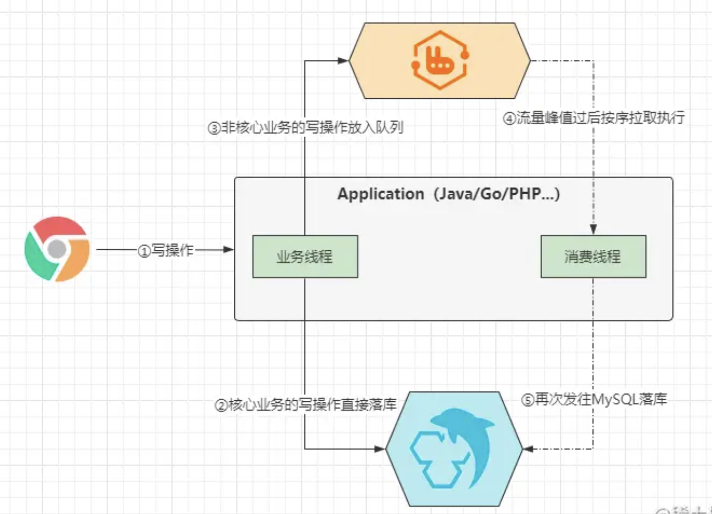
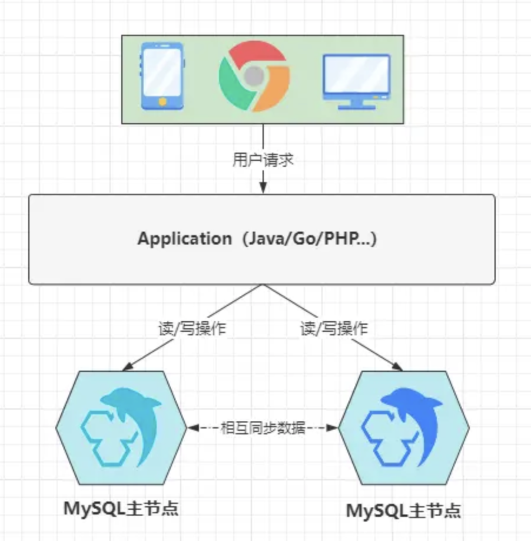

# (十六)MySQL调优篇：单机数据库如何在高并发场景下健步如飞？

[竹子爱熊猫](https://juejin.cn/user/862486453028888/posts)

全解MySQL数据库

## 引言

  在当前的`IT`开发行业中，系统访问量日涨、并发暴增、线上瓶颈等各种性能问题纷涌而至，性能优化成为了现时代中一个炙手可热的名词，无论是在开发、面试过程中，性能优化都是一个常谈常新的话题。而`MySQL`作为整个系统的后方大本营，由于是基于磁盘的原因，性能瓶颈往往也会随着流量增大而凸显出来。

  但在一个业务系统中，性能优化其实可以从多个角度出发考虑，如 **架构优化、前端调优、中间件调优、网关调优、容器调优、JVM调优、接口调优、服务器调优、数据库调优....** 等，从优化类型上而言，主体可以分为三类：

- ①**结构/架构优化**：优化应用系统整体架构做到性能提升的目的。如：读写分离、集群热备、分布式架构、引入缓存/消息/搜索中间件、分库分表、中台架构（大数据中台、基础设施中台）等。
- ②**配置/参数优化**：调整应用系统中各层面的配置文件、启动参数达到优化性能的目标。如：JVM、服务器、数据库、操作系统、中间件、容器、网关参数调整等。
- ③**代码/操作优化**：开发者编写程序时，从代码、操作方面进行调节，达到效率更高的初衷。如：代码中使用更优秀的算法思想/设计模式、SQL优化、对中间件的操作优化等。

> 本章则重点讲述`MySQL`的性能优化策略，一般`MySQL`都是整个业务系统中，调优选项的重中之重，毕竟`MySQL`作为系统大本营，当它出现瓶颈时，会影响整个系统其他节点的运行，比如：
> 当`MySQL`出现了性能瓶颈时，就算`Java`程序没出现瓶颈，也会因此受到限制，这也是著名的木桶效应：**一个木桶能装多少水，完全取决于木桶中最短的那块木板**。

## 一、系统中性能优化的核心思维

  性能调优与线上排查问题一样，是建立在经验的基础之上才能做好的，对于调优要实事求是，任何的调优手段或技巧不要纸上谈兵，只有经过实践的才能用于生产环境，千万不要将一些没有实际依据的调优策略用于线上环境，否则可能会导致原本好好运行的应用程序，反而由于调优被调到崩溃。

### 1.1、单个节点层面调优的核心思想

  在一个程序中，所有的业务执行实体都为线程，应用程序的性能跟线程是直接挂钩的。而程序中的一条线程必须要经过`CPU`的调度才可执行，线程执行时必然也会需要数据、产生数据，最终也会和内存、磁盘打交道。因而单个节点的性能表现，不可避免的会跟`CPU`、内存、磁盘沾上关系。
线程越多，需要的`CPU`调度能力也就越强，需要的内存也越大，磁盘`IO`速率也会要求越快。因此`CPU`、内存、磁盘，这三者之间的任意之一达到了瓶颈，程序中的线程数量也会达到极限。达到极限后，系统的性能会成抛物线式下滑，从而可能导致系统整体性能下降乃至瘫痪。

> 由于如上原因，在考虑性能优化时，必然不能让`CPU`、内存、磁盘等资源的使用率达到`95%+`，一般而言，最大利用率控制在`80-85%`左右的最佳状态。

  同时，由于程序的性能跟线程挂钩，所以线程工作模型也是影响性能的重要因素。目前程序设计中主要存在三种线程处理模型：`BIO、NIO、AIO（NIO2）`，`BIO`是最传统的一对一处理模型，也就是一个客户端请求分配一条线程处理。`NIO`的最佳实践为`reactor`模型，而`proactor`模型又作为了`NIO2/AIO`的落地者。绝大部分情况下，`AIO`的性能优于`NIO`，而`NIO`的性能又远超于`BIO`。

> 所以在做性能优化时，你应该要清楚系统的性能瓶颈在哪儿，到底是要调哪个位置？是线程模型？或是`CPU`调度？还是内存回收？亦是磁盘`IO`速率？针对不同层面有不同的优化方案，并非为了追求“热词/潮流”而盲目的调优。

### 1.2、优秀且适用的系统架构胜过千万次调优

  一个单体架构（`Tomcat+MySQL`）部署的系统遇到性能问题时，能力再强，本事再大，任凭使出浑身解数也无法将其调到处理万级并发的程序，正常服务器部署的一台`MySQL`服务做到极致调优也难以在一秒内承载`5000+`的`QPS`。一味的追求极致的优化，其实也难以解决真正大流量下的并发冲击，因此一套优秀的系统架构胜过自己千万次的调优。

  当然，也并非说项目实现时，越多的技术加进来越好，一套完善的分布式架构就必然比单体架构要好吗？其实也不见得，因为当引入的技术越多，所需要考虑的问题也会更多，耗费的成本也会越高，一个项目收益`60W`，结果用上最好的配置（高端的开发者+顶级的服务器+完善的分布式架构）成本耗费`200W`，这值得吗？答案显而易见。因此，并没有最好的技术架构，只有最适用的架构，能从现有环境及实际业务出发，选用最为合适的技术体系，这才是我们应该做的事情。如：

- 项目业务中读写参半，单节点难以承载压力，项目集群、双主热备值得参考。
- 项目业务中写大于读，引入消息中间件、`DB`分库、项目集群也可以考虑。
- 项目业务中读大于写，引入缓存/搜索中间件、动静分离、读写分离是些不错的选择。
- .......

> 当你的系统原有架构遇到性能瓶颈时，你甚至可以考虑进一步做架构优化，如：设计多级分布式缓存、缓存中间件做集群、消息中间件做集群、`Java`程序做集群、数据库做分库分表、搜索中间件做集群.....，慢慢的，你的系统会越来越庞大复杂，需要处理的问题也更为棘手，但带来的效果也显而易见，随着系统的结构不断变化，承载百万级、千万级、亿级、乃至更大级别的流量也并非难事。

  但只有当你的业务流量/访问压力在选用其他架构无法承载时，你才应该考虑更为庞大的架构。当然，如果项目在起步初期就有预估会承载巨大的流量压力，那么提前考虑也很在理，采用分布式/微服务架构也并非失策，因为对比其他架构体系而言，微服务架构的拓展性更为灵活。但也需要记住：分布式/微服务体系是很好，但它不一定适用于你的项目。

### 1.3、预防大于一切，调优并非“临时抱佛脚”

  当问题出现时再想办法解决，这种策略永远都属于下下策，防范于未然才是最佳方案，提前防范问题出现主要可分为两个阶段：

- ①项目初期预测未来的流量压力，提前根据业务设计出合适的架构，确保上线后可以承载业务的正常增长。
- ②项目上线后，配备完善的监控系统，在性能瓶颈来临前设好警报线，确保能够在真正的性能瓶颈到来之前解决问题。

对于项目初期的架构思考，值得牢记的一点是：不要“卡点”设计，也不能过度设计造成性能过剩，举例：

> 项目上线后的正常情况下，流量大概在“一木桶”左右，结果你设计时直接整出一个承载“池塘”级别的流量结构，这显然是不合理的，毕竟架构体系越庞大，项目的成本也自然就越高。
> 当然，也不能说正常情况下压力在“一木桶”左右，就只设计出一套仅能够承载“一木桶”流量的结构，这种“卡点”设计的策略也不可取，因为你需要适当考虑业务增长带来的风险，如果“卡点”设计，那么很容易让项目上线后，短期内就遭遇性能瓶颈。
> 因此，如果项目正常的访问压力大概在“桶”级别，那将结构设计到“缸”级别最合理，这样即不必担心过度设计带来的性能过剩，导致成本增高，也无需考虑卡点设计造成的：项目短期遭遇性能瓶颈。
> 但设计时的这个度，必须由你自己根据项目的业务场景和环境去思量，不存在千篇一律的方法可教。

有人曾说过：**“如果你可以根据业务情景设计出一套能确保业务增长，且在线上能稳定运行三年时间以上的结构，那你就是位业内的顶尖架构”**，但老话说的好：“计划永远赶不上变化”，就算思考到业务的每个细节，也不可能设计出一套一劳永逸的结构出现，我们永远无法判断意外和明天哪个先来。因而，项目上线后，配备完善的监控警报系统也是必不可少的。不过值得注意的是：

> 监控系统的作用并不是用来提醒你项目“嗝屁”了的，而是用来提醒你：线上部署的应用系统可能会“嗝屁”或快“嗝屁”了，毕竟当项目灾难已经发生时再给警报，那到时候的情况就是：“亡羊补牢，为时已晚”。
> 通常情况下，在监控系统上面设置的性能阈值都会比最大极限值要低`5~15%`，如：最大极限值是`85%`，那设置告警值一般是`75%`左右就会告警，不会真达到`85%`才告警，只有这样做才能留有足够的时间让运维和开发人员介入排查。当系统发出可能“嗝屁”的警告时，开发和运维人员就应当立即排查相关的故障隐患，然后再通过不断的修改和优化，提前将可能会出现的性能瓶颈解决，这才是性能调优的正确方案。
> 因此，最终结论为：**绝不能等到系统奔溃才去优化，预防胜于一切**。

### 1.4、无需追求完美，理性权衡利弊

  “追求极致，做到完美”这点是大部分开发者的通病，很多人会因为这个思想导致自己在面临一些问题时束手无策，比如举个例子：

> 业务：`MacBookPro`一元购活动，预计访问压力：`10000QPS`。
> 环境：单台机器只能承载`2000QPS`，目前机房中还剩余两台空闲服务器。
> 状况：此时就算将空闲的两台机器加上去，也无法顶住目前的访问压力。
> 此时你会怎么做？很多人都会茫然、会束手无策，这看起来好像是没办法的事情呀.....

但事实真的如此吗？并非如此，其实这种情况也有多种解决方案，如：

- ①停掉系统中部分非核心的业务，将服务器资源暂时让给该业务。
- ②抛弃掉部分用户的请求，只接受处理部分用户的请求，对于抛弃的用户请求直接返回信息提示。
- ③........

这些方案是不是可以解决上面的哪个问题呢？答案是肯定的，所以适当舍弃一部分是这种场景下最佳方案，千万不能抱有追求完美的想法，例如：

- 系统中的服务不能停啊，得保持正常服务啊，否则影响程序功能的完善性。
- 用户的请求怎么能抛，用户的访问必须得响应啊，否则影响用户体验感。

但事实告诉你的是：类似于京东、淘宝、`12306`等这些国内的顶级门户网站，在处理高并发场景时照样如此。好比阿里，在双十一的时候都会抽调很多冷门业务的服务器资源给淘宝使用，也包括你在参与这些电商平台的抢购或秒杀类活动时，你是否遇到过如下情况：

- 服务器繁忙，请稍后重试......
- 服务器已满，排队中.....
- 前方拥堵，排队中，当前第`x`位.....

> 如果当你遇到了这些情况，答案显而易见，你的请求压根就没有到后端，在前端就给你`pass`了，然后给你返回了一个字符串，让你傻傻的等待，实则你的请求早就被抛弃了.....

  这个例子要告诉大家的是：在处理棘手问题或优化性能时，无需刻意追求完美，理性权衡利弊后，适当的做出一些决断，抛弃掉一部分不重要的，起码比整个系统挂掉要好，何况之后也同样可以恢复。

### 1.5、性能调优的通核心步骤

  性能优化永远是建立在性能瓶颈之上的，如果你的系统没有出现瓶颈，那则无需调优，调优之前需要牢记的一点是：**不要为了调优而调优，而是需要调优时才调**。

> 这就好比古代的赛马，本来你拥有一匹上等马，在赛马活动中基本上每次都能拿到不菲的成绩，但你嫌它还不够好，就一直想办法给马喂各种秘方，最终可能会导致拥有的这匹上等马吃出问题，这明显与初衷背道而驰，所以要牢记：**千万不要为了调优而调优**！就好比刚刚的上等马例子中，只有当上等马真正的出现问题时，比如近期拉肚子、近期腿受伤了.....等这类情况出现时，再对症下药，给马喂对应的“良药”，以此来保证上等马可正常工作。

  而发现性能瓶颈的方式有两种，一种是你的应用中具备完善的监控系统，能够提前感知性能瓶颈的出现。另一种则是：应用中没有搭载监控系统，性能瓶颈已经发生，从而导致应用频繁宕机。大型的系统一般都会搭载完善的监控系统，但大多数中小型项目却不具备该条件，因此，大部分中小型项目发现性能瓶颈时，大多数情况下已经“嗝屁”了。

通常而言，性能优化的步骤可分为如下几步：

- ①发现性能瓶颈：如有监控系统，那它会主动发出警报；如若没有，那出现瓶颈时应用肯定会出问题，如：无响应、响应缓慢、频繁宕机等。
- ②排查瓶颈原因：排查瓶颈是由于故障问题导致的，还是真的存在性能瓶颈。
- ③定位瓶颈位置：往往一个系统都会由多个层面协同工作，然后对外提供服务，当发现性能瓶颈时，应当确定瓶颈的范围，如：网络带宽瓶颈、Java应用瓶颈、数据库瓶颈等。
- ④解决性能瓶颈：定位到具体的瓶颈后对症下药，从结构、配置、操作等方面出发，着手解决瓶颈问题。

本章则重点是阐述`MySQL`相关的调优操作，但需要先提前说明的是：

> 单层面的性能调优其实只能当成锦上添花的作用，但绝对不能成为系统性能高/低、响应快/慢、吞吐量大/小的决定性要素。应用系统的性能本身就还算可以，那么调优的作用是让其性能更佳。但如若项目结构本身就存在问题，那么能够带来的性能提升也是有限的，如果你想让你的项目快到飞起，那么还需要从多个层面共同着手才能达到目的。

## 二、MySQL的性能优化实践

  其实`MySQL`的优化，在大型企业中都会有专业的`DBA`来负责，但作为一个后端开发者，我们也应该具备这个能力，毕竟大多数企业中都未曾划分出`DBA`这类的岗位，因此当`MySQL`需要做调优时，这个活最终也会落到后端身上。当然，更重要的一点是：**这些内容掌握后，能够让大家面试造火箭的能力更上一层楼**。

### 2.1、MySQL调优的五个维度

  聊到`MySQL`的性能优化，其实也可以从多个维度出发，共计优化项如下：

- ①客户端与连接层的优化：调整客户端`DB`连接池的参数和`DB`连接层的参数。
- ②`MySQL`结构的优化：合理的设计库表结构，表中字段根据业务选择合适的数据类型、索引。
- ③`MySQL`参数优化：调整参数的默认值，根据业务将各类参数调整到合适的大小。
- ④整体架构优化：引入中间件减轻数据库压力，优化`MySQL`架构提高可用性。
- ⑤编码层优化：根据库表结构、索引结构优化业务`SQL`语句，提高索引命中率。

纵观现在`MySQL`中的各类优化手段，基本上都是围绕着上述的五个维度展开，这五个性能优化项中，通常情况下，带来的性能收益排序为`④ > ② > ⑤ > ③ > ①`，不过带来的性能收益越大，也就意味着成本会更高，因此大家在调优时，一定要记得按需进行，不要过度调优，否则也会带来额外的成本开销！

*OK，闲话说了一大堆，现在也就开始真正的调优方案剖析，一起来聊聊吧~*

### 2.2、MySQL连接层优化策略

  从[《SQL执行篇》](https://juejin.cn/post/7145102393988874253)这章中可以得知：一个用户请求最终会在`Java`程序中分配一条线程处理，最终会变成一条`SQL`发往`MySQL`执行，而`Java`程序、`MySQL-Server`之间是通过建立网络连接的方式进行通信，这些连接在`MySQL`中被称为数据库连接，本质上在`MySQL`内部也是一条条工作线程负责执行`SQL`语句，那么思考一个问题：**数据库连接数是越大越好吗？**

> 对于这个问题，答案是`NO`，这是为什么呢？既然说一个客户端连接是一条线程，那数据库的最大连接数调整到`1W`，岂不是代表着同时可以支持`1W`个客户端同时操作啦？在不考虑硬件的情况下确实如此，但结合硬件来看待，答案就不相同的，一起来聊聊原因。

数据库连接数越大，也就意味着内部创建出的工作线程会越多，线程越多代表需要的`CPU`配置得更高，比如现在有`300`个客户端连接，内部创建了`300`条工作线程处理，但服务器的`CPU`仅有`32`个核心，那当前服务器最多只能支持`32`条线程同时工作，那其他`268`条线程怎么办呢？为了其他线程能够正常执行，`CPU`就会以时间片调度的模式工作，不同核心在不同线程间反复切换执行，但由于线程数远超核心数，因此会导致线程上下文切换的开销，远大于线程执行的开销。

> 正是由于上述原因，所以数据库的连接数该设置成多少合适呢？这就是一个值得探讨的问题，而连接池又会分为客户端连接池、服务端连接池，客户端连接池是指`Java`自身维护的数据库连接对象，如`C3P0、DBCP、Druid、HikariCP...`等连接池。服务端连接池是指`MySQL-Server`的连接层中，自身维护的一个连接池，用来实现线程复用的目的。

对于`MySQL`连接池的最大连接数，这点无需咱们关心，重点调整的是客户端连接池的连接数，为啥呢？因为`MySQL`实例一般情况下只为单个项目提供服务，你把应用程序那边的连接数做了限制，自然也就限制了服务端的连接数。但为啥不将`MySQL`的最大连接数和客户端连接池的最大连接数保持一致呢？这是由于有可能你的数据库实例不仅仅只为单个项目提供服务，比如你有时候会通过终端工具远程连接`MySQL`，如果你将两个连接池的连接数保持一致，就很有可能导致`MySQL`连接数爆满，最终造成终端无法连上`MySQL`。

> 好的，话接正题，客户端的连接池大小该如何设置呢？先来借鉴一下`PostgreSQL`提供的计算公式：
> **最大连接数 = (CPU核心数 \* 2) + 有效磁盘数**

这个公式其实不仅仅只适用于`PostgreSQL`，在`MySQL、Oracle...`中同样适用，但公式中有一点比较令人产生疑惑，即“有效磁盘数”，这是个啥？其实是指`SSD`固态硬盘，如果部署数据库的服务器，其硬盘是`SSD`类型，那么在发生磁盘`IO`基本上不会产生阻塞。因为`SSD`相较于传统的机械硬盘，它并没有的磁片，无需经过旋转磁面的方式寻址，所以`SSD`硬盘的情况下，可以再`+1`。

比如目前服务器的硬件配置为`CPU：16core`、硬盘类型：`SSD`，此时最佳的最大连接数则为`16*2+1=33`，而常驻连接数可以调整到`30`左右，这组配置绝对是当前场景下的最佳配置，如若再调大连接数，这反而会让性能更慢，因为会造成线程上下文切换的额外开销。

> 但是要注意：`C3P0、DBCP、Druid、HikariCP...`等连接池的底层本质上是一个线程池，对于线程池而言，想要处理足够高的并发，那应该再配备一个较大的等待队列，也就是当目前池中无可用连接时，其他的用户请求/待执行的`SQL`语句则会加入队列中阻塞等待。

当然，上述这个公式虽说能够应对绝大部分情况，但实际业务中，还需要考虑`SQL`的执行时长，比如一类业务的`SQL`执行只需`10ms`，而另一类`SQL`由于业务过为繁琐，每次调用时会产生一个大事务，一次执行下来可能需要`5s+`，那这两种情况都采用相同的连接池可以吗？可以是可以，但大事务会影响其他正常的`SQL`，因此想要完美的解决这类问题，最好再单独开一个连接池，为大事务或执行耗时较长的`SQL`提供服务。

#### 2.2.1、偶发高峰类业务的连接数配置

啥叫偶发高峰类业务呢？就类似于滴滴打车这类业务，在早晚上下班时间段、周末假期时间段，其流量显然会比平常高很多，对于这类业务，常驻线程数不适合太多，因为并发来临时会导致创建大量连接，而并发过后一直保持数据库连接会导致资源被占用，所以对于类似的业务，可以将最大连接数按之前的公式配置，而常驻连接数则可以配成`CPU`核数`+1`，同时缩短连接的存活时间，及时释放空闲的数据库连接，以此确保资源的合理分配。

> 当然，这里用滴滴举例子，是为了说明偶发高峰类业务的概念，但实际滴滴的日常并发也不低，所以这个理论套上去是不合适的，这里主要是举例说明，不要深入纠结这个栗子！只是为了告诉大家类似场景下的配置规则。

#### 2.2.2、分库分表情况下的连接数配置

前面叭叭了一大堆，但那些都是建立在单库情况下的配置，对于读写分离、双主双写、分库分表的情况下，就不适合这样配置，毕竟部署了多个`MySQL`节点，也就意味着拥有多台服务器的硬件资源，因此在数据库部署了多节点的情况下，请记得根据每个节点的硬件配置，来规划出合理的连接数。

#### 2.2.3、连接层调优小结

对于连接层的调优，实际上是指调整它的参数，即常驻连接数、最大连接数、空闲连接存活时间以及等待队列的容量，在这里聊到过一点：合理的连接数才是最好的，而并非越大越好，这个道理其实也很简单，举个栗子：

> 现在有个工厂，招了`200`个工人来做事，里面有`16`个技术指导员，每个工人在指导员的指挥下做事，但由于指导员和工人的比例严重失调，因此会导致工作期间，指导员的大量时间会花费在不同工位的跑动上面，一天`8`小时的工作时间，至少有`4~5`小时会用在跑工位上。

上述这个案例中，工人就是数据库连接/线程，而指导员则是`CPU`核心，从这个例子中可以明显感受出：工人并不是越多越好，那如果按照之前的公式来规划合理的工人数会是什么情况呢？

> 此时工人锐减到`32`个，而`16`个指导员，每个人只需要负责指导两个工人，完全可以坐在两个工位中间，这样谁需要指导，只需要把头扭过去就可以了，能够在最大程度上提升工作饱和度，之前浪费在跑工位上的`4~5`小时，能够完全省去。

此时工人数量虽然锐减，但其实效率反而会提升很多，在这个例子中所谓的“跑工位”时间，换到程序中也就是线程上下文切换的开销，一颗`CPU`核心在`2~3`条线程之间切换不会存在太大的开销，但在十多条线程之间切换，则会导致切换开销远超出线程执行本身的开销。

> 如若部署`MySQL`的服务器硬件配置更高，那也可以手动将`MySQL`默认的最大连接数调大，`set max_connections = n;`即可。

**最后提一嘴：对于最佳连接数的计算，首先要把`CPU`核数放首位考虑，紧接着是磁盘，最后是网络带宽，因为带宽会影响`SQL`执行时间，综合考虑后才能计算出最合适的连接数大小。**

### 2.3、MySQL结构的优化方案

  所谓的`MySQL`结构优化，主要是指三方面，即表结构、字段结构以及索引结构，这些结构如果不合理，在某些场景下也会影响数据库的性能，因此优化时也可以从结构层面出发，但对于结构的优化，一般在项目的库表设计之初就要考虑，当性能瓶颈出现时再调整结构，早就为时过晚。

> 这是为啥呢？因为如果在项目之初没考虑好，到了性能瓶颈出现时再去更改，由于表中已经存在数据，所以发生结构变更时，势必会由于已经存在数据，而产生一系列的连锁问题出现，也有可能会出现一些棘手问题难以推进优化方案的落地。

#### 2.3.1、表结构的优化

①表结构设计时的第一条也是最重要的一条，字段数量一定不要太多，之前我手里有个老项目要做二开，里面`30~40`个字段的表比比皆是，更有甚者达到了`60~70`个字段一张表，这种方式显然并不合理，因为根据之前聊过的[《MySQL内存篇》](https://juejin.cn/post/7159071309354254373)大家应该能够得知：`InnoDB`引擎基本上都会将数据操作放到内存中完成，而当一张表的字段数量越多，那么能载入内存的数据页会越少，当操作时数据不在内存，又不得不去磁盘中读取数据，这显然会很大程度上影响`MySQL`性能。

> 咱们思考一个问题：一张`40~50`个字段的表结构，在实际业务中会使用到它每个字段吗？答案是`No`，一张`40~50`个字段的表中，常用的字段最多只有`10~20`个，这类字段可以理解成热点字段，而其他的字段都属于冷字段，但由于你将所有字段都设计到了一张表中，因此就会导致载入内存时，会将一整条数据全部载入，对应的冷字段会造成额外的额外的内存浪费。

因此对于表结构的设计，正常情况下应当遵循[《数据库三范式》](https://juejin.cn/post/7146474739018498062#heading-1)的原则设计，尽可能的根据业务将表结构拆分的更为精细化，一方面能够确保内存中缓存的数据更多，同时也更便于维护，而且执行`SQL`时，效率也会越高。

> 一张表最多最多只能允许设计`30`个字段左右，否则会导致查询时的性能明显下降。

------

②当然，也并不是说一定要遵守三范式的设计原则，有时候经常做连表查询的字段，可以适当的在一张表中冗余几个字段，这种做法的最大好处是能够减少连表查询次数，用空间换时间的思想。但也并非是无脑做冗余，否则又会回到前面的情况，一张表中存在大量的无用字段，这里的冗余是指经常连表查询的字段。

------

③主键的选择一定要合适。首先一张表中必须要有主键，其次主键最好是顺序递增的数值类型，最好为`int`类型，关于具体原因可参考之前的[《MySQL索引原理篇-主键为何推荐自增ID？》](https://juejin.cn/post/7151275584218202143#heading-32)。一张表如果业务中自带自增属性的字段，最好选择这些字段作为主键，例如学生表中的学号、职工表中的工号....，如果一张表的业务中不带有这类字段，那也可以设计一个与业务无关、无意义的数值序列字段作为主键，因为这样做最适合维护表数据（跟聚簇索引有关）。

> 只有当迫不得已的情况下，再考虑使用其他类型的字段作为主键，但也至少需要保持递增性，比如分布式系统中的分布式`ID`，这种情况下就无法依靠数据库`int`自增去确保唯一性，就必须得通过雪花算法这类的`ID`生成策略，以此来确保`ID`在全局的唯一性。

------

④对于实时性要求不高的数据建立中间表。很多时候咱们为了统计一些数据时，通常情况下都会基于多表做联查，以此来确保得到统计所需的数据，但如若对于实时性的要求没那么高，就可以在库中建立相应的中间表，然后每日定期更新中间表的数据，从而达到减小连表查询的开销，同时也能进一步提升查询速度。

> 啥叫中间表呢？举个最简单的例子，比如排名类的统计业务，就可以这么实现，好比`MOBA`游戏中的战力排名，以英雄联盟、王者荣耀为例，由于每个玩家的战力在一天内都会不断变化，同时一个用户在任何时间段都有可能去查询战力排名，所以每次查询都基于数据库的多张表去联查，基于这些游戏的用户量而言，其带来的开销必然的巨大的，因此可以对英雄战力设计一张中间表，每日凌晨五点统计一次.....

上述这种做法也是大多数`MOBA`游戏的实现方式，但实际场景中也会结合`Redis`来实现，毕竟这种方式速度会更快，但这里就不多拓展了，总之记住一点即可：适当的场景下建立中间表，是一种能够带来不小性能收益的手段。

------

⑤根据业务特性为每张不同的表选择合适的存储引擎。其实存储引擎这块主要是在`InnoDB、MyISAM`两者之间做抉择，对于一些经常查询，很少发生变更的表，就可以选择`MyISAM`引擎，比如字典表、标签表、权限表....，因为读远大于写的表中，`MyISAM`性能表现会更佳，其他的表则可以使用默认的`InnoDB`引擎。

#### 2.3.2、字段结构的优化

字段结构的优化其实主要指选择合适的数据类型，大多数开发在设计表字段结构时，如果要使用数值类型一般会选择`int`，使用字符串类型一般会选择`varchar`，但这些字段类型可以适当的做些调整，在[《MySQL命令大全-字段数据类型》](https://juejin.cn/post/7163148228420960263#heading-31)中咱们提到过，同一种数据类型也有不同范围的具体类型可选，哪在有些情况下就可以选择更合适的类型，例如：

- 对于姓名字段，一般都会限制用户名长度，这时不要无脑用`varchar`，使用`char`类型更好。
- 对于一些显然不会拥有太多数据的表，主键`ID`的类型可以从`int`换成`tinyint、smallint、mediumit`。
- 对于日期字段，不要使用字符串类型，而更应该选择`datetime、timestamp`，一般情况下最好为后者。
- 对于一些固定值的字段，如性别、状态、省份、国籍等字段，可以选择使用数值型代替字符串，如果必须使用字符串类型，最好使用`enum`枚举类型代替`varchar`类型。
- `.......`

总之在选择字段的数据类型时有三个原则：

- ①在保证足够使用的范围内，选择最小数据类型，因为它们会占用更少的磁盘、内存和`CPU`缓存，同时在处理速度也会更快。
- ②尽量避免索引字段值为`NULL`，定义字段时应尽可能使用`NOT NULL`关键字，因为字段空值过多会影响索引性能。
- ③在条件允许的情况下，尽量使用最简单的类型代替复杂的类型，如`IP`的存储可以使用`int`而并非`varchar`，因为简单的数据类型，操作时通常需要的`CPU`资源更少。

#### 2.3.3、索引结构的优化

索引结构优化主要是指根据业务创建更合适的索引，这里主要可以从四个方面考虑，下面一起来聊一聊。

> ①索引字段的组成尽量选择多个，如果一个表中需要建立多个索引，应适当根据业务去将多个单列索引组合成一个联合索引，这样做一方面可以节省磁盘空间，第二方面还可以充分使用索引覆盖的方式查询数据，能够在一定程度上提升数据库的整体性能。

> ②对一个值较长的字段建立索引时，可以选用字段值的前`N`个字符创建索引，也就是对于值较长的字段尽量建立前缀索引，而不是通过完整的字段值建立索引，因为之前在聊[《MySQL索引实现原理》](https://juejin.cn/post/7151275584218202143#heading-16)说过：索引字段值越小，单个`B+Tree`的节点中能存储的索引键会越多，一个节点存下的索引键越多，索引树会越矮，查询性能自然会越高。

> ③索引类型的选择一定要合理，对于经常做模糊查询的字段，可以建立全文索引来代替普通索引，因为基于普通索引做`like`查询会导致索引失效，而采用全文索引的方式做模糊查询效率会更高更快，并且全文索引的功能更为强大。

> ④索引结构的选择可以根据业务进行调整，在某些不会做范围查询的字段上建立索引时，可以选用`hash`结构代替`B+Tree`结构，因为`Hash`结构的索引是所有数据结构中最快的，散列度足够的情况下，复杂度仅为`O(1)`。

当然，对于索引建立与索引使用更为全面的介绍，可参考之前的[《索引应用篇》](https://juejin.cn/post/7149074488649318431)。

### 2.4、MySQL参数优化的选项

  基于`MySQL`的参数调优，这应该是所有优化项中最难的一点，因为`MySQL`内部的参数繁多，提供给用户控制的参数都有几百个，所以想要真正的做好参数优化，必须要对`MySQL`真正的熟悉才行，由于我自身并非专研数据库方向的技术人，所以对参数调优就不做细致阐述了，就稍微介绍一些能够带来最大性能收益的参数调整。

> 但首先来思考一个问题：为什么要做参数调优呢？这其实和`JVM`参数调优一样，本质上每个参数的默认值，为了兼容所有业务，因此都是经过`MySQL`官方精心设计过的，也正因如此，所以有些参数的默认值能发挥出的性能只能算中规中矩，在服务器硬件配置不错的情况下，我们可以适当调整一些参数，来试图进行一些激进的优化，从而达到性能更佳的效果。

#### 2.4.1、调整InnoDB缓冲区

在`MySQL`参数中，首先最值得调整的就是`InnoDB`缓冲区的大小，因为`InnoDB`将是`MySQL`启动后使用最多的引擎，所以为其分配一个足够大的缓冲区，能够在最大程度上提升`MySQL`的性能，但是缓冲区该分配多少内存呢？有人说是机器内存的`80%`，但这会让其他区域没有足够的内存使用，所以最佳比例应该控制在`70~75%`左右，比如一台服务器的内存为`32GB`，将`innodb_buffer_pool_size = 22938M（23GB）`左右最合理。

> 为`InnoDB`的缓冲区分配了足够的大小后，运行期间`InnoDB`会根据实际情况，去自动调整内部各区域中的数据，如热点数据页、自适应哈希索引.....，调整该区域的大小后，能直接让`MySQL`性能上升一个等级，至于究竟是啥原因导致的，请参考[《MySQL内存篇》](https://juejin.cn/post/7159071309354254373)。

同时当`InnoDB`缓冲区空间大于`1GB`时，`InnoDB`会自动将缓冲区划分为多个实例空间，这样做的好处在于：**多线程并发执行时，可以减少并发冲突**。`MySQL`官方的建议是每个缓冲区实例必须大于`1GB`，因此如果机器内存较小时，例如`8/16GB`，可以指定为`1GB`，但是机器内存够大时，比如达到了`32GB/64GB`甚至更高，哪可以适当将每个缓冲区实例调整到`2GB`左右。

> 比如现在假设缓冲区共计拥有`40GB`内存，哪设置将缓冲区实例设置为`innodb_buffer_pool_instances = 20`个比较合适。

#### 2.4.2、调整工作线程的缓冲区

除开可以调整`InnoDB`的缓冲区外，同时还可以调大`sort_buffer、read_buffer、join_buffer`几个区域，这几个区域在[《MySQL内存篇》](https://juejin.cn/post/7159071309354254373)中介绍过，属于线程私有区域，也就意味着每条线程都拥有这些区域：

- `sort_buffer_size`：排序缓冲区大小，影响`group by、order by...`等排序操作。
- `read_buffer_size`：读取缓冲区大小，影响`select...`查询操作的性能。
- `join_buffer_size`：联查缓冲区大小，影响`join`多表联查的性能。

对于这些区域，最好根据机器内存来设置为一到两倍`MB`，啥意思呢？比如`4GB`的内存，建议将其调整为`4/8MB`、`8GB`的内存，建议将其调整为`8/16MB.....`，但这些区域的大小最好控制在`64MB`以下，因为线程每次执行完一条`SQL`后，就会将这些区域释放，所以再调大也没有必要了。

> OK~，对于排序查询的操作，还可以调整一个参数：`max_length_for_sort_data`，这个参数关乎着`MySQL`排序的方式，如果排序字段值的最大长度小于该值，则会将所有要排序的字段值载入内存排序，但如果大于该值时，则会一批一批的加载排序字段值进内存，然后一边加载一边做排序。

上述这两种排序算法，显然第一种效率更高，毕竟这种方式是基于所有的数据做排序，第二种算法则是一批一批数据做排序，每批数据都可能会打乱之前排好序的数据，因此可以适当调大该参数的值（但这个值究竟多少合适，要根据具体的业务来做抉择，否则交给还是使用`MySQL`自己来控制）。

#### 2.4.3、调整临时表空间

同时还可以调整`tmp_table_size、max_heap_table_size`两个参数，这两个参数主要是限制临时表可用的内存空间，当创建的临时表空间占用超过`tmp_table_size`时，就会将其他新创建的临时表转到磁盘中创建，这显然是十分违背临时表的设计初衷，毕竟创建临时表的目的就是用来加快查询速度，结果又最后又把临时表放到磁盘中去了，这反而还多了一步开销。

> 那么这两个参数该设置多大呢？这要根据`show global status like 'created_tmp%';`的统计信息来决定，用统计出来的信息：`Created_tmp_disk_tables / Created_tmp_tables * 100% = 120%`，达到这个标准就比较合适，但调整这个区域的值需要反复重启`MySQL`以及压测，因此比较费时间，如果你在项目中很少使用临时表，哪也可以不关心这块参数的调整。

#### 2.4.4、调整空闲线程的存活时间

兜兜转转再回到数据库连接数的配置，之前讲到过：其实对于`MySQL`最大连接数无需做过多控制，客户端连接池那边做了调整即可，对于这点是没错的，可以通过下述命令查看数据库连接的峰值：

- `show global status like 'Max_used_connections';`

一般在客户端做了连接数控制后，这个峰值一般都会在客户端最大连接数的范围之内，对于数据库连接这块唯一需要稍微调整的即是空闲连接的超时时间，即`wait_timeout、interactive_timeout`两个参数，这两个参数必须一同设置，否则不会生效，`MySQL`内部默认为`8`小时，也就是一个连接断开后，默认也会将对应的工作线程缓存八小时后再销毁，这里我们可以手动调整成`30min~1h`左右，可以让无用的连接能及时释放，减少资源的占用。

#### 2.4.5、MySQL参数调优小结

至此就对`MySQL`中，几个较为关键的性能参数做了介绍，其实再细致一点的话，还有几十个影响性能的参数，但这里就不再讲解了，毕竟一方面我自己也没弄过，以免写出来误导诸位，大家感兴趣的可以自行研究。

> 同时对于较为细致的调优参数，作为一个后端开发也无需研究过深，毕竟真要做到这个级别的调优，自然会有专业的`DBA`来负责~

对于上述的一些调优参数，可以在启动之后通过`set global @@xxx = xxx`的方式调整，但最好还是直接修改`my.ini/my.conf`配置文件，因为这样可以让这些参数在每次启动时都生效，避免了每次重启时还需要手动调整。

> 最后，对于某些安全性要求不高的业务中，也可以适当调整`MySQL`数据和日志的刷盘策略，将其调整到更长的间隔时间刷盘，虽然这样会导致安全性下降，出现一定的数据丢失，但可以换来不错的性能（也包括事务的隔离级别，也可以从`RR`调整到`RC`级别，这样也能够减少一定程度上的并发冲突，从而使得数据库的整体并发量提高）。

### 2.5、架构优化与SQL优化

  变更项目的整体架构，这是性能优化收益最大的手段，但项目架构与`SQL`语句优化，这两点牵扯繁多，会在后续开新的篇章来详细讲解，这里简单介绍一些架构优化的思想，后续的篇章中会逐步将本章提到的一些方案落地。

> 对于架构优化主要牵扯两块，一方面是从整个项目的角度出发，引入一些中间件来优化整体性能。另一方面则是调整`MySQL`的部署架构，以此来确保可承载更大的流量访问，提高数据层的整体吞吐，下面逐个介绍一些常用的架构。

#### 2.5.1、引入缓存中间件解决读压力

正常的项目业务中，往往读请求的数量远超写请求，如果将所有的读请求都落入数据库处理，这自然会对`MySQL`造成巨大的访问压力，严重的情况下甚至会由于流量过大，直接将数据库打到宕机，因此为了解决这系列问题，通常都会在应用程序和数据库之间架设一个缓存，例如最常用的`Redis`，关系图如下：

在项目中引入`Redis`作为缓存后，在缓存`Key`设计合理的情况下，至少能够为`MySQL`分担`70%`以上的读压力，查询`MySQL`之前先查询一次`Redis`，`Redis`中有缓存数据则直接返回，没有数据时再将请求交给`MySQL`处理，从`MySQL`查询到数据后，再次将数据写入`Redis`，后续有相同请求再来读取数据时，直接从`Redis`返回数据即可。

#### 2.5.2、引入消息中间件解决写压力

前面项目中引入`Redis`后，能够在很大程度上减轻`MySQL`的读请求压力，但当业务系统中的写操作也较为频繁时又该怎么办呢？`Redis`在这里似乎只能分担读操作的流量呀？这时就可以引入`MQ`消息中间件做削峰填谷，关系图如下：

上面这幅图看起来就没有前面那张图容易理解，这里结合业务来说明一下，还是拿经典的下单业务来说明情况，一个下单业务通常由「提交订单、支付费用、扣减库存、修改订单状态、添加发票记录、添加附赠服务....」这一系列操作组成，其中「提交订单、支付费用」属于核心业务，因此当用户下单时，这两类请求可以发往`MySQL`执行落库操作，而对于「扣减库存、修改订单状态、添加发票记录、添加附赠服务....」这类操作则可以发往`MQ`，当写入`MQ`成功，则直接返回客户端下单成功，后续再由消费线程去按需拉取后执行。

> 当然，对于「扣减库存」而言，其实在`Redis`中也会缓存商品信息，在扣减库存时仅仅只会减掉`Redis`中的商品库存，确保其他用户看到的库存信息都是实时的，最终的减库存操作，是去异步消费`MQ`中的消息后，最终才落库的。

经过`MQ`做了流量的削峰填谷后，这能够在极大的程度上减轻`MySQL`的写压力，能够将写压力控制到一个相较平缓的程度，防止由于大量写请求直接到达`MySQL`，避免负载过高造成的宕机现象出现。

#### 2.5.3、MySQL主从读写分离

前面聊到的`Redis`也好，`MQ`也罢，这都属于在`MySQL`之前架设中间件，以此来减少真正抵达数据库的请求数量，但打铁还需自身硬，万一经过`Redis、MQ`后，那些必须要走`MySQL`执行的请求依旧超出单机`MySQL`的承载范围时，如若`MySQL`依旧以单机形式在线上运行，这绝对会导致线上频繁宕机的情况出现。

> 下面则来介绍一些`MySQL`的架构优化方案，分别是指三种：主从架构、双主架构、分库分表架构。

主从复制，这是大多数中间件都会存在的一种高可用机制，而`MySQL`中也存在这种架构，也就是使用两台服务器来部署两个`MySQL`节点，一台为主机，另一台为从机，从节点会一直不断的从主节点上同步增量数据，当主节点发生故障时，从节点可以替换原本的主节点，以此来为客户端提供正常服务，架构模型如下：

在上图中就是一个典型的主从架构，但如果从节点仅仅只是作为一个备胎，这难免有些浪费资源，因此可以在主从架构的模式下，再略微做些调整，即实现读写分离，由于读操作并不会变更数据，所以对于读请求可以分发到从节点上处理，对于会引发数据变更的写请求，则分发到主节点处理，这样从而能够进一步提升`MySQL`的整体性能。

> 主节点的数据变更后，从节点也会基于`bin-log`日志去同步数据，但这种模式下会存在些许的数据不一致性，因为同步是需要时间的，向主节点修改一条数据后，立马去从节点中查询，这时不一定能够看到最新的数据，因为这时数据也许还未被同步过来。

哪上述这个数据不一致性问题能不能有好的办法去解决呢？其实并没有太好的办法，选择用这种方案来提升性能，必然也会出现些许问题，这也是你必须要接受的，如果项目业务对数据实时性要求特别高，哪就不要考虑主从架构。

#### 2.5.4、MySQL双主双写热备

前面主从读写分离的方案，更适用于一些读大于写的业务，但对于一些类似于仓储这种写大于读的项目业务，这种方案带来的性能收益不见得有多好，因此从机分担的读压力，可能仅是系统的`10~20%`流量，因此对于这种场景下，双主双写（双主热备）方案才是最佳选择，其架构图如下：

似乎看起来和之前的图差不多，但在这里的两个`MySQL`节点都为主，同时它们也都为从，啥意思呢？其实就是指这两个节点互为主从，两者之间相互同步数据，同时都具备处理读/写请求的能力，当出现数据库的读/写操作时，可以将请求抛给其中任意一个节点处理。

> 但是为了兼容两者之间的数据，对于每张表的主键要处理好，如果表的主键是`int`自增类型的，请一定要手动设置一下自增步长和起始值，比如这里有两个`MySQL`节点，那么可以将步长设置为`2`，起始值分别为`1、2`，这样做的好处是啥？能够确保主键的唯一性，设置后两个节点自增`ID`的序列如下：
> 节点`1`：`[1、3、5、7、9、11、13、15、17、19.....]`
> 节点`2`：`[2、4、6、8、10、12、14、16、18、20.....]`

当插入数据的`SQL`语句发往节点`1`时，会按照奇数序列自增`ID`，发往节点`2`时会以偶数序列自增`ID`，然后双方相互同步数据，最终两个`MySQL`节点都会具备完整的数据，因此后续的读请求，无论发往哪个节点都可以读到数据。

> 有人或许会思考，既然两个节点互为主从可以实现双主双写，哪能不能搞三个节点、四个节点呢？答案是当然可以，不过没必要这么做，因为当需要上三主、四主....的项目，直接就做分库分表更实在，因为这种多主模式存在一个天大的弊端！！

#### 2.5.5、MySQL分库分表思想

刚刚在聊多主架构时，提到过多主模式有一个天大的弊端！这个弊端是指存储容量的上限+木桶效应，因为多主模式中的每个节点都会存储完整的数据，因此当数据增长达到硬件的最大容量时，就无法继续写入数据了，此时只能通过加大磁盘的形式进一步提高存储容量，但硬件也不可能无限制的加下去，而且由于多主是基于主从架构实现的，因为具备木桶效应，要加得所有节点一起加，否则另一个节点无法同步写入数据时，就会造成所有节点无法写入数据。

> 也正是由于上述这个原因，因此我才不建议采用三主、四主....这种架构模式，毕竟需要用到这么多`MySQL`节点的业务，其数据的增长速度自然不慢，因此在存储容量方面很容易抵达瓶颈，这种情况下选择分库分表才是最佳方案。

分库分表相信每位接触过数据库的小伙伴都听说过，这实则是一种分布式存储的思想，如下：

上述是分库分表的一种情况，这种分库的模式被称为垂直分库，也就是根据业务属性的不同，会创建不同的数据库，然后由不同的业务连接不同的数据库，各自之间数据分开存储，节点之间数据不会同步，以这种方式来部署`MySQL`，即提高了数据库的整体吞吐量和并发能力，同时也不存在之前的存储容量的木桶问题。

> 但不要认为分库分表是一种很完美的解决方案，实际上当你对项目做了分库分表之后，带来的问题、要解决的问题只会更多，只不过相较于分库分表带来的收益而言，解决问题的成本是值得的，所以才会使用分库分表技术。

分库分表是一门大学问，这里会在后续开多个篇章去阐述，分库分表也有多种方式，上图给出的仅是一种分库分表的方案，在后续关于《MySQL分库分表》的篇章中，会全面阐述分库分表的方式、带来的问题、问题的解决方案等，在本章就不展开叙述啦~。

## 三、MySQL优化篇总结

  对于`MySQL`数据库的一些调优策略，到这里就大致讲述完毕了，其中能够带来最大收益的方案则是优化项目架构和数据库架构，但这种方案成本也是最高的，一方面需要解决新的问题，同时还需要额外的部署成本，所以在无需使用更高规格的架构处理并发时，就不必提前做这些架构设计，因为能够根据业务特性控制成本，也是作为一个优秀的高级开发/架构师必备的思想。

  同时在本章中也未曾过多讲解`SQL`优化，这是每位中高级开发的重心，因为毕竟作为一个正常的程序员，代码才是日常工作中接触最多的东西，但由于`SQL`优化想要写明白、讲清楚，其篇幅也不会短，所以会单开下章《SQL优化篇》去全面讲解！

> 放在最后的结语：天下没有免费的午餐，任何的优化手段都具有主观的性质存在，而且**每一种优化的手段都需要付出一定的代价。**同时，性能优化并没有非常标准的优化方案参考，优化是一个永无止境的方向，随着工作经验的不断积累，你的优化手段和见解就有可能不同，最终落地的优化方案也会不同。

**PS：单机`MySQL`最好的优化手段，请手动将`MySQL`版本升级到`5.7`及以上，因为`MySQL5.6`之后官方对后续的版本做了很大程度上的改进，引入了很多高性能技术，所以如果你项目的`MySQL`版本还在其之下，条件允许的情况下一定记得先做版本升级！**