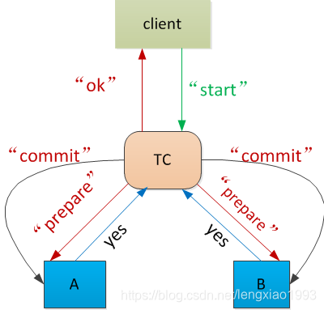
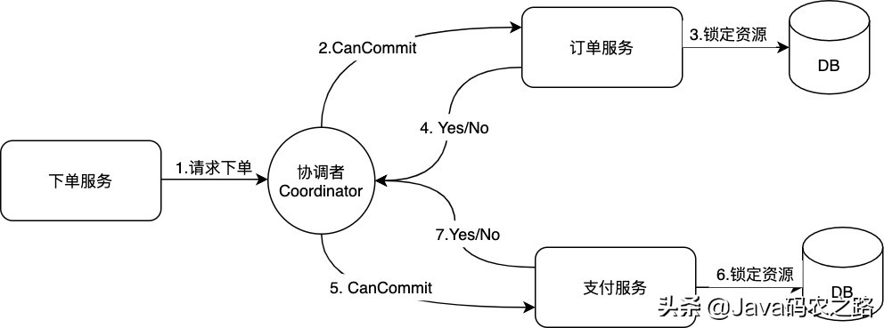
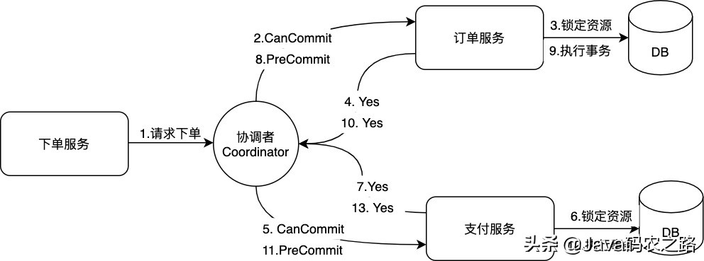
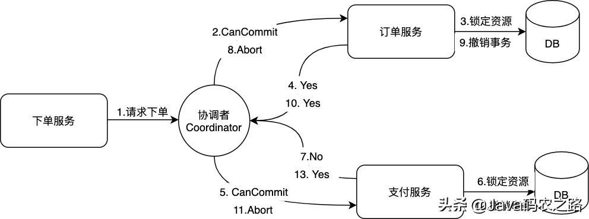
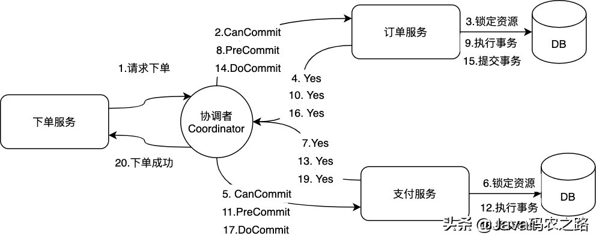
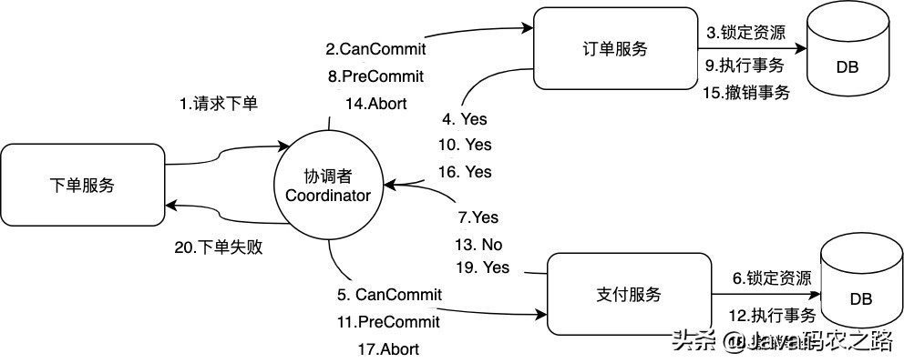

### 二阶段提交（2PC）和三阶段提交（3PC）的核心差异

提交最基础的差别：

* **二阶段提交（2PC）** ：

  * 2PC 由两个阶段组成：

    1. **准备阶段（Prepare Phase）** ：协调者向所有参与者发送准备请求，询问它们是否可以提交事务。参与者收到请求后，执行相关操作并决定是否可以提交事务。如果可以，返回“准备好”的响应；否则，返回“中止”。
    2. **提交阶段（Commit Phase）** ：如果所有参与者都返回“准备好”，协调者向所有参与者发送提交请求，要求它们提交事务。如果任何参与者返回“中止”，协调者发送中止请求。
* **三阶段提交（3PC）** ：

  * 3PC 由三个阶段组成：

    1. **准备阶段（CanCommit Phase）** ：协调者向所有参与者发送准备请求，询问它们是否可以提交事务。参与者做出决定并返回响应。
    2. **预提交阶段（PreCommit Phase）** ：如果所有参与者都返回可以提交，协调者发送预提交请求，要求参与者进入一个预提交状态（即锁定资源，但不真正提交）。参与者响应并进入等待提交的状态。
    3. **提交阶段（DoCommit Phase）** ：协调者向所有参与者发送最终的提交请求，要求它们正式提交事务。如果之前收到中止请求，则协调者发送中止请求。

**失败处理**

* **二阶段提交（2PC）** ：

  * 如果在准备阶段后协调者崩溃，参与者将处于不确定状态（即它们不知道是否应该提交事务）。这种情况下，参与者必须等待协调者恢复并作出最终决定，可能导致长时间阻塞。
* **三阶段提交（3PC）** ：

  * 3PC 通过引入预提交阶段，减少了参与者处于不确定状态的时间。如果在预提交阶段协调者崩溃，参与者可以等待超时后自动中止事务，而不必一直等待协调者的恢复。这减小了因协调者失败导致的长时间阻塞的风险。

**超时机制**

* **二阶段提交（2PC）** ：

  * 2PC 协议中没有明确的超时机制，特别是在协调者崩溃或网络出现问题时，可能导致参与者长期处于阻塞状态。
* **三阶段提交（3PC）** ：

  * 3PC 明确引入了超时机制，如果参与者在预提交阶段或提交阶段没有收到协调者的指令，则会自动回滚事务，从而减少了阻塞的可能性。

**实施复杂性**

* **二阶段提交（2PC）** ：

  * 实现较为简单，但在处理协调者崩溃和网络分区时的表现较差。
* **三阶段提交（3PC）** ：

  * 实现更复杂，增加了一个额外的阶段和超时机制，提升了故障恢复能力，但增加了协议的复杂性和开销。

总结

* **2PC** 强调的是简单性和一致性，但在处理协调者故障和网络分区时可能会导致长时间阻塞和一致性问题。
* **3PC** 通过增加预提交阶段和超时机制，减少了不确定状态的时间和系统的阻塞可能性，提高了可用性，但也增加了协议的复杂性和开销。

### 二阶段提交协议（Two-Phase Commit）

核心是

* 引入了一个事务协调者（TC）
* 在真正的提交操作前， 增加了一个准备阶段， 收集业务结点是否有能力进行提交

TC：业务协调者，A，B，就是业务节点。

参考：[[正确理解二阶段提交（Two-Phase Commit）_2阶段提交-CSDN博客](https://blog.csdn.net/lengxiao1993/article/details/88290514)](https://blog.csdn.net/lengxiao1993/article/details/88290514)

**举个例子：**

假设一个人要从 A 银行向 B 银行进行跨行转账 100 元。

两个操作( -100 和 + 100） 我们希望它们是一个事务， 要么同时成功， 要么同时失败 。原子性的提交协议 （Atomic Commit Protocol）,原子提交协议希望实现的2个特性

* **安全性（Safety）**

  * 如果任意一方 commit， 所有人必须都 commit
  * 如果任意一方中断，则没有任何一个人进行 commit
* **存活性（Liveness）**

  * 没有宕机或失败发生时， A 和 B 都能提交， 则提交
  * 如果发生失败时，最终能达成一个一致性结果（成功/失败）， 予以响应， **不能一直等待**

部分程序员可能会对其工程实现的一个**关键点产生误解**：

* **准备阶段**就是开启一个事务， 执行所有的业务代码， 都不报错， 不执行事务的 commit 操作， 然后向 TC 回复 “Yes”, 表示我已准备好提交

**这种做法并不满足二阶段提交协议对于准备操作的要求**:

* 二阶段提交协议中， 业务结点回复 “Yes” ， 代表它做好了提交操作的所有准备， 只要结点回复了 “Yes”, 即使突然发生宕机， **只要结点重新启动， 收到了 TC 发送的 commit 指令， 必须依旧能正确提交**
* 普通数据库如果**在在一个事务中间发生了宕机（比如数据库所在机器直接停电）** ， 重启以后， 数据库的默认行为是对处于中间状态的事务进行回滚操作， 并不具备继续等待并接受 commit 指令的能力

如果 **业务结点A** 银行需要对转账客户的账户执行 -100 元操作， 当它向 TC 回复了 “Yes” 前， 应该完成以下操作：

* 确定账户上有 100 待扣减， 将这100 元冻结， 其他的操作无法解冻， 转移这100元。
* 留下必要的持久化记录， 确保即使宕机重启， 收到 “abort” 指令也有能力回滚到100 元被冻结前的状态
* 留下必要的持久化记录， 确保即使宕机重启， 收到 “commit” 指令也有能力正确提交， 完成 -100 元操作
* 留下必要的持久化记录， 标识自己已经完成了准备阶段的所有操作， 要向 TC 回复 “Yes” 指令

只有以上这些操作都成功完成以后， 银行 A 才能尝试向 TC 发送 “Yes” 指令，否则就有违二阶段提交协议。

#### 二阶段提交协议事务协调者TC是第三方吗

二阶段提交中， 除了准备阶段， 另一个显眼的角色就是事务协调者（ Transaction Coordinator）。

此时就会有部分同学产生困惑， 事务协调者是否一定得是一个独立的机器，处于独立的结点。

答案： **并不是**!

从准备阶段的要求就可以看出。 二阶段提交协议的核心， 是描述了在每一步操作前， 每一种角色应该达到什么状态， 具备什么能力。 具体在工程实现中， 这几种角色分布在几个结点， 以什么方式去实现， 都是可以的。

以前文所举的银行转账操作为例。

客户端 client 发起一个转账操作请求给 TC， 这个 TC 完全可以就属于银行 A。 只要银行 A 实现的 TC 在银行 A 数据库发起 -100 元的操作前，依旧先按照协议要求;

* 模拟 prepare 阶段， 进行持久化记录
* 做好 -100 元随时提交或回退的准备

即可以根据银行 B 的准备阶段应答结果， 进行后续的操作。

### 三阶段提交3PC 一致性协议

与两阶段提交不同的是，三阶段提交有两个改动点：

* 引入超时机制。同时在协调者和参与者中都引入超时机制；
* 在第一阶段和第二阶段中插入一个准备阶段。保证了在最后提交阶段之前各参与节点的状态是一致的。

3PC把2PC的准备阶段（prepare）再次一分为二，这样三阶段提交就有CanCommit、PreCommit、DoCommit三个阶段。

#### CanCommit阶段

之前2PC的一阶段是本地事务执行结束后，最后不Commit，等其它服务都执行结束并返回Yes，由协调者发生commit才真正执行commit。

而这里的CanCommit指的是 **尝试获取数据库锁** 如果可以，就返回Yes。这阶段主要分为2步

* 事务询问：协调者向参与者发送CanCommit请求。询问是否可以执行事务提交操作。然后开始等待参与者的响应；
* 响应反馈：参与者接到CanCommit请求之后，正常情况下，如果其自身认为可以顺利执行事务，则返回Yes响应，并进入预备状态。否则反馈No。

#### PreCommit阶段

在阶段一中，如果所有的参与者都返回Yes的话，那么就会进入PreCommit阶段进行事务预提交。这里的PreCommit阶段 跟上面的第一阶段是差不多的，只不过这里**协调者和参与者都引入了超时机制** （2PC中只有协调者可以超时，参与者没有超时机制），主要包含两个步骤：

* 事务预提交：参与者接收到PreCommit请求后，**会执行事务操作，并将undo和redo信息记录到事务日志中。**
* 响应反馈：如果参与者成功的执行了事务操作，则返回ACK响应，同时开始等待最终指令。

假如**有任何一个参与者向协调者发送了No响应，或者等待超时之后**，**协调者**都没有接到参与者的响应，那么就**执行事务的中断**:

* 发送中断请求：协调者向所有参与者发送abort请求。
* 中断事务：**参与者**收到来自协调者的**abort请求**之后（或**超时**之后，仍未收到协调者的请求），**执行事务的中断**。

#### DoCommit阶段

该阶段进行真正的事务提交，也可以分为以下两种情况。

**执行提交**，发送提交请求 协调接收到参与者发送的ACK响应，那么他将从预提交状态进入到提交状态。并向所有参与者发送doCommit请求。

* 事务提交：参与者接收到doCommit请求之后，执行正式的事务提交。并在完成事务提交之后释放所有事务资源。
* 响应反馈：事务提交完之后，向协调者发送Ack响应。
* 完成事务：协调者接收到所有参与者的ack响应之后，完成事务。

**中断事务**，协调者没有接收到参与者发送的ACK响应（可能是接受者发送的不是ACK响应，也可能响应超时），那么就会执行中断事务。

* 发送中断请求：协调者向所有参与者发送abort请求
* 事务回滚：参与者接收到abort请求之后，利用其在阶段二记录的undo信息来执行事务的回滚操作，并在完成回滚之后释放所有的事务资源。
* 反馈结果：参与者完成事务回滚之后，向协调者发送ACK消息
* 中断事务：协调者接收到参与者反馈的ACK消息之后，执行事务的中断。

## 总结

相对于2PC，3**PC主要解决的单点故障问题，并减少阻塞**，因为一旦参与者无法及时收到来自协调者的信息之后，他会默认执行commit。而不会一直持有事务资源并处于阻塞状态。但是这种机制也会导致数据一致性问题，因为，由于网络原因，协调者发送的abort响应没有及时被参与者接收到，那么参与者在等待超时之后执行了commit操作。这样就和其他接到abort命令并执行回滚的参与者之间存在数据不一致的情况。

在2PC中一个参与者的状态只有它自己和协调者知晓，假如协调者提议后自身宕机，在协调者备份启用前一个参与者又宕机，其他参与者就会进入既不能回滚、又不能强制commit的阻塞状态，直到参与者宕机恢复。

参与者如果在不同阶段宕机，我们来看看3PC如何应对：

* 阶段1: 协调者或协调者备份未收到宕机参与者的vote，直接中止事务；宕机的参与者恢复后，读取logging发现未发出赞成vote，自行中止该次事务
* 阶段2: 协调者未收到宕机参与者的precommit ACK，但因为之前已经收到了宕机参与者的赞成反馈(不然也不会进入到阶段2)，协调者进行commit；协调者备份可以通过问询其他参与者获得这些信息，过程同理；宕机的参与者恢复后发现收到precommit或已经发出赞成vote，则自行commit该次事务
* 阶段3: 即便协调者或协调者备份未收到宕机参与者t的commit ACK，也结束该次事务；宕机的参与者恢复后发现收到commit或者precommit，也将自行commit该次事务。