### MySQL - 基础篇 - 第1篇

> **版本和环境**
>
> ***MySQL 8.21 - Windows10***
>
> ***Navicat 12 Pro***
>
> **MySQL的安装**
>
> - 参考菜鸟教程：https://www.runoob.com/mysql/mysql-install.html 
> - 安装完成之后修改密码：`ALTER USER 'root'@'localhost' IDENTIFIED WITH mysql_native_password BY 'root';`
> - 可能出现的问题1：xxx.dll 文件缺失
>   - 解决方法1：到脚本之家（ https://www.jb51.net/ ）下载对应 xxx.dll 文件放到 `C:\Windows\System32`目录下即可
>   - 解决方法2：安装`DirectXRepair_v4.0` 补充所有的C/C++/dll文件
> - 可能出现的问题2：net 不是内部或外部命令，也不是可运行的程序或批处理文件。
>   - 我的电脑-->属性-->高级-->环境变量 path的变量值新加: `%SystemRoot%\system32`
>   - 修改完成后，需要重新打开cmd命令行，否则不会生效的。
>
> **Navicat 12 Pro的安装**
>
> - 参考教程：https://www.jianshu.com/p/c431d8df70e9 

#### 简介

- 数据库（Database - DB）是按照**数据结构来组织、存储和管理数据的**仓库，我们也可以将数据存储在文件中，但是在文件中读写数据速度相对较慢。

- 所以，现在我们使用**关系(表)型**数据库管理系统（RDBMS）来存储和管理的大数据量。

- RDBMS即关系型数据库管理系统(Relational Database Management System)的特点：
  - 数据以**表格**的形式出现
  - 每行(**元组)**为各种**记录**名称
  - **每列**为记录名称所对应的**数据域[Field]**
  - 许多的行和列组成一张表
  - 若干的表单组成database

#### 数据库分类

- 早期比较流行的数据库模型有三种，分别为层次式数据库、网络式数据库和关系型数据库。 而在当今的互联网中，最常用的数据库模型主要是两种，即` 关系型数据库 `和` 非关系型数据库 `。

#### 关系型数据库

- 关系型数据库模型是把复杂的数据结构归结为简单的二元关系（即二维表格形式）。 

- 主流的关系型数据库有如下:
  - oracle数据库 - Oracle公司是最早开发关系型数据库的厂商之一。版本升级：oracle8i，oracle9i，oracle10g，oracle11g，oracle12c
  - **mysql数据库** - 被广泛的应用在Internet上的大中小型网站中。由于体积小、速度快、总体拥有成本低，开放源代码
  - SQL Server数据库 -   Microsoft SQL Server是微软公司开发的大型关系数据库系统

- 其他不常见的关系型数据库:DB2，PostgreSQL，Informix，Sybase等。这些关系型数据库逐步的淡化了普通运维的实现，特别是互联网公司几乎见不到

#### Nosql

* mongodb - 文档数据库 - 评论的数据(比较多,但是不重要)
* redis - 键值对数据库

#### RDBMS

* ***数据库: 数据库是一些关联表的集合。***
* ***数据表: 表是数据的矩阵。在一个数据库中的表看起来像一个简单的电子表格。***
* ***列: 一列(数据元素,Field域) 包含了相同的数据, 例如邮政编码的数据。***
* ***行：一行（=元组，或记录）是一组相关的数据，例如一条用户订阅的数据。***
* ***冗余：存储两倍数据，冗余降低了性能，但提高了数据的安全性。***
* 主键：主键是唯一的。一个数据表中只能包含一个主键。你可以使用主键来查询数据。
* 外键：外键用于关联两个表。
* 复合键：复合键（组合键）将多个列作为一个索引键，一般用于复合索引。
* 索引：使用索引可快速访问数据库表中的特定信息。索引是对数据库表中一列或多列的值进行排序的一种结构。类似于书籍的目录。
* 参照完整性: 参照的完整性要求关系中不允许引用不存在的实体。与实体完整性是关系模型必须满足的完整性约束条件，目的是保证数据的一致性。

#### 非关系型数据库

- 非关系型数据库也被称为NoSQL数据库，NoSQL的本意是“Not Only SQL”
  - NoSQL关系数据库不是否定关系数据库，而是作为关系型数据库的一个重要补充
  - NoSQL为了**高性能、高并发而生**
  - NoSQL的典型产品是memcached（存内存），**Redis**（持久化缓存），**Mongodb**（文档的数据库）
- **MongoDB**是一个介于关系型数据库和非关系型数据库之间的产品，是非关系型数据库当中功能最丰富，最像关系数据库的。**他支持的数据库结构非常松散，类似json的bjson格式**，因此可以存储比较复杂的数据类型。
- Mongodb最大的特点是他支持的查询语言非常强大，其语法有点类似于面向对象的查询语言，几乎可以实现
- 类似关系数据库单表查询的绝大部分功能，而且还支持对数据建立索引。 
- 在项目中比如评价的业务：
  - mongodb - 适合存储数量多、价值低、并发比较高的场景
  - Redis - 秒杀

#### 专业术语

**DBMS**

- DBMS 数据库管理系统(Database Management System)是一种操纵和管理数据库的大型软件用于建立、使用和维护数据库，简称DBMS。它对数据库进行统一的管理和控制,保证数据库的安全性和完整性。用户通过DBMS访问数据库中的数据，数据库管理员也通过dbms进行数据库的维护工作。

**DBA**

- 数据库管理员（Database Administrator，简称DBA），是从事管理和维护数据库管理系统(DBMS)的相关工作人员的统称
- 他属于运维工程师的一个分支，主要负责业务数据库从设计、测试到部署交付的全生命周期管理。DBA的核心目标是保证数据库管理系统的稳定性、安全性、完整性和高性能。
- 在国外，也有公司把DBA称作数据库工程师(Database Engineer)，两者的工作内容基本相同，
- 都是保证数据库服务7*24小时的稳定高效运转，但是需要区分一下DBA和数据库开发工程师(Database Developer)：
  - 数据库开发工程师的主要职责是设计和开发数据库管理系统和数据库应用软件系统，侧重于软件研发；
  - DBA的主要职责是运维和管理数据库管理系统，侧重于运维管理。

**DBS**

- 数据库系统DBS（Data Base System，简称DBS）通常由软件、数据库和数据管理员组成。
- 其软件主要包括操作系统、各种宿主语言、实用程序以及数据库管理系统。数据库由数据库管理系统统一管理，数据的插入、修改和检索均要通过数据库管理系统进行。
- 数据管理员负责创建监控和维护整个数据库，使数据能被任何有权使用的人有效使用。
- 可以理解成:DBS = ***DBMS(核心)+DBA+DB***

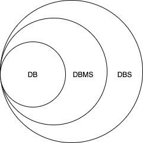

#### 数据安装及初始化


```sh
rpm -Uvh  http://dev.mysql.com/get/mysql57-community-release-el7-9.noarch.rpm 安装

yum -y install mysql-community-server --nogpgcheck   一键安装

systemctl status mysqld		查看mysql服务状态
systemctl start mysqld		启动mysql服务

netstat -tunlp			查看已经启动的服务
netstat –tunlp | grep mysql

ps –ef | grep mysql			查看mysql进程

grep 'temp' /var/log/mysqld.log

mysql -uroot –p				登录mysql（使用临时密码登录）

\#修改密码

set global validate_password_length=4;		设置密码长度最低位数

set global validate_password_policy=LOW;		设置密码安全等级低，便于密码可以修改成root

set password = password('root');		设置密码为root

\#开启访问权限

grant all on *.* to 'root'@'%' identified by 'root';

flush privileges;
```

备注：47.113数据库密码为root


#### 连接数据库

- 在命令行下输入 `mysql -uroot -proot`  然后回车，即可登录数据库
  - -u：意思是username
  - -p：意思是password
- 命令行下输入 `exit` 然后回车，就可退出数据库
- 输入 `show databases;` 回车，就可以查看默认的数据库有哪些

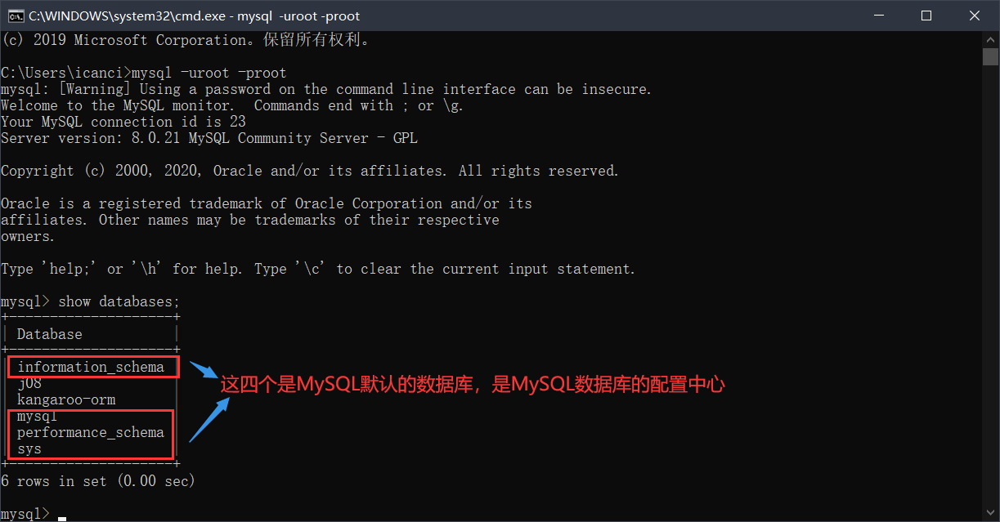

#### 数据库的基本操作

- 创建数据库
  - create database ic_db;

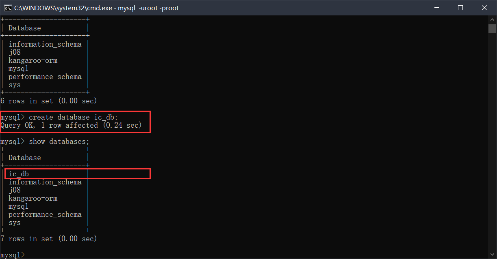

- 使用数据库和查看数据库的表格
  - use ic_db;
  - show tables;

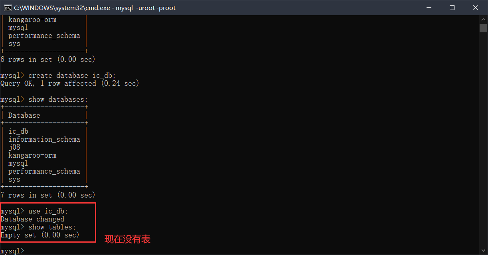

- 导出SQL脚本

将名为 test 的数据库备份到当前目录的 test.sql。界面显示 Enter password，输入 MySQL 数据库的登录密码 12345678 。根据备份的数据库大小，等待时间长短不同。完成后，使用命令 ll 查看备份文件，界面查看到备份文件 test.sql ，完成备份。

```
mysqldump -uroot -p test >test.sql
```

- 导入SQL脚本（注意：在Windows 情况下导入的脚本文件路径不能有中文路径，MAC可以）
  - source xxx.sql


或者还可以：将 test.sql 导入数据库

说明：其中参数 -D 是指定数据库为test。

```
mysql -uroot -p -Dtest<test.sql
```

- 数据库脚本如下

```mysql
DROP TABLE s_emp;

DROP TABLE s_dept;

DROP TABLE s_region;

DROP TABLE s_ord;

DROP TABLE s_customer;

CREATE TABLE s_emp
(id                     INT(7),
 last_name                  VARCHAR(25),
 first_name                 VARCHAR(25),
 userid                     VARCHAR(8),
 start_date                 DATE,
 comments                   VARCHAR(255),
 manager_id                 INT(7),
 title                      VARCHAR(25),
 dept_id                    INT(7),
 salary                      FLOAT(11, 2),
 commission_pct             FLOAT(4, 2),
 CONSTRAINT s_emp_id_pk PRIMARY KEY (id),
 CONSTRAINT s_emp_userid_uk UNIQUE (userid),
 CONSTRAINT s_emp_commission_pct_ck
 CHECK (commission_pct IN (10, 12.5, 15, 17.5, 20))) ENGINE=InnoDB AUTO_INCREMENT=4 DEFAULT CHARSET=utf8;

INSERT INTO s_emp VALUES (
    1, 'Velasquez', 'Carmen', 'cvelasqu',
    '1990-05-03', NULL, NULL, 'President',
    50, 2500, NULL);

INSERT INTO s_emp VALUES (
    2, 'Ngao', 'LaDoris', 'lngao',
    '1990-05-08', NULL, 1, 'VP, Operations',
    41, 1450, NULL);

INSERT INTO s_emp VALUES (
    3, 'Nagayama', 'Midori', 'mnagayam',
    '1991-07-01', NULL, 1, 'VP, Sales',
    31, 1400, NULL);

INSERT INTO s_emp VALUES (
    4, 'Quick-To-See', 'Mark', 'mquickto',
    '1990-07-07', NULL, 1, 'VP, Finance',
    10, 1450, NULL);

INSERT INTO s_emp VALUES (
    5, 'Ropeburn', 'Audry', 'aropebur',
    '1990-04-05', NULL, 1, 'VP, Administration',
    50, 1550, NULL);

INSERT INTO s_emp VALUES (
    6, 'Urguhart', 'Molly', 'murguhar',
    '1991-01-18', NULL, 2, 'Warehouse Manager',
    41, 1200, NULL);

INSERT INTO s_emp VALUES (
    7, 'Menchu', 'Roberta', 'rmenchu',
    '1990-05-14', NULL, 2, 'Warehouse Manager',
    42, 1250, NULL);

INSERT INTO s_emp VALUES (
    8, 'Biri', 'Ben', 'bbiri',
    '1990-06-07', NULL, 2, 'Warehouse Manager',
    43, 1100, NULL);

INSERT INTO s_emp VALUES (
    9, 'Catchpole', 'Antoinette', 'acatchpo',
    '1992-02-09', NULL, 2, 'Warehouse Manager',
    44, 1300, NULL);

INSERT INTO s_emp VALUES (
    10, 'Havel', 'Marta', 'mhavel',
    '1991-02-27', NULL, 2, 'Warehouse Manager',
    45, 1307, NULL);

INSERT INTO s_emp VALUES (
    11, 'Magee', 'Colin', 'cmagee',
    '1990-04-14', NULL, 3, 'Sales Representative',
    31, 1400, 10);

INSERT INTO s_emp VALUES (
    12, 'Giljum', 'Henry', 'hgiljum',
    '1992-01-18', NULL, 3, 'Sales Representative',
    32, 1490, 12.5);

INSERT INTO s_emp VALUES (
    13, 'Sedeghi', 'Yasmin', 'ysedeghi',
    '1991-02-18', NULL, 3, 'Sales Representative',
    33, 1515, 10);

INSERT INTO s_emp VALUES (
    14, 'Nguyen', 'Mai', 'mnguyen',
    '1992-01-22', NULL, 3, 'Sales Representative',
    34, 1525, 15);

INSERT INTO s_emp VALUES (
    15, 'Dumas', 'Andre', 'adumas',
    '1991-10-09', NULL, 3, 'Sales Representative',
    35, 1450, 17.5);

INSERT INTO s_emp VALUES (
    16, 'Maduro', 'Elena', 'emaduro',
    '1992-02-17', NULL, 6, 'Stock Clerk',
    41, 1400, NULL);

INSERT INTO s_emp VALUES (
    17, 'Smith', 'George', 'gsmith',
    '1990-05-08', NULL, 6, 'Stock Clerk',
    41, 940, NULL);

INSERT INTO s_emp VALUES (
    18, 'Nozaki', 'Akira', 'anozaki',
    '1991-02-18', NULL, 7, 'Stock Clerk',
    42, 1200, NULL);

INSERT INTO s_emp VALUES (
    19, 'Patel', 'Vikram', 'vpatel',
    '1991-06-08', NULL, 7, 'Stock Clerk',
    42, 795, NULL);

INSERT INTO s_emp VALUES (
    20, 'Newman', 'Chad', 'cnewman',
    '1991-01-21', NULL, 8, 'Stock Clerk',
    43, 750, NULL);

INSERT INTO s_emp VALUES (
    21, 'Markarian', 'Alexander', 'amarkari',
    '1991-04-26', NULL, 8, 'Stock Clerk',
    43, 850, NULL);

INSERT INTO s_emp VALUES (
    22, 'Chang', 'Eddie', 'echang',
    '1990-11-30', NULL, 9, 'Stock Clerk',
    44, 800, NULL);

INSERT INTO s_emp VALUES (
    23, 'Patel', 'Radha', 'rpatel',
    '1990-10-17', NULL, 9, 'Stock Clerk',
    34, 795, NULL);

INSERT INTO s_emp VALUES (
    24, 'Dancs', 'Bela', 'bdancs',
    '1991-05-17', NULL, 10, 'Stock Clerk',
    45, 860, NULL);

INSERT INTO s_emp VALUES (
    25, 'Schwartz', 'Sylvie', 'sschwart',
    '1991-04-09', NULL, 10, 'Stock Clerk',
    45, 1100, NULL);

CREATE TABLE s_dept
(id                         int(7),
 name                       VARCHAR(25),
 region_id                  int(7),
 CONSTRAINT s_dept_id_pk PRIMARY KEY (id),
 CONSTRAINT s_dept_name_region_id_uk UNIQUE (name, region_id)) ENGINE=InnoDB AUTO_INCREMENT=4 DEFAULT CHARSET=utf8;

INSERT INTO s_dept VALUES (
    10, 'Finance', 1);
INSERT INTO s_dept VALUES (
    31, 'Sales', 1);
INSERT INTO s_dept VALUES (
    32, 'Sales', 2);
INSERT INTO s_dept VALUES (
    33, 'Sales', 3);
INSERT INTO s_dept VALUES (
    34, 'Sales', 4);
INSERT INTO s_dept VALUES (
    35, 'Sales', 5);
INSERT INTO s_dept VALUES (
    41, 'Operations', 1);
INSERT INTO s_dept VALUES (
    42, 'Operations', 2);
INSERT INTO s_dept VALUES (
    43, 'Operations', 3);
INSERT INTO s_dept VALUES (
    44, 'Operations', 4);
INSERT INTO s_dept VALUES (
    45, 'Operations', 5);
INSERT INTO s_dept VALUES (
    50, 'Administration', 1);

CREATE TABLE s_region
(id                         int(7),
 name                    VARCHAR(50),
 CONSTRAINT s_region_id_pk PRIMARY KEY (id),
 CONSTRAINT s_region_name_uk UNIQUE (name)) ENGINE=InnoDB AUTO_INCREMENT=4 DEFAULT CHARSET=utf8;

 INSERT INTO s_region VALUES (
     1, 'North America');
INSERT INTO s_region VALUES (
    2, 'South America');
INSERT INTO s_region VALUES (
    3, 'Africa / Middle East');
INSERT INTO s_region VALUES (
    4, 'Asia');
INSERT INTO s_region VALUES (
    5, 'Europe');

CREATE TABLE s_customer
(id                         int(7),
 name                    VARCHAR(50),
 phone                   VARCHAR(25),
 address                VARCHAR(400),
 city                        VARCHAR(30),
 state                      VARCHAR(20),
 country                    VARCHAR(30),
 zip_code                   VARCHAR(75),
 credit_rating              VARCHAR(9),
 sales_rep_id               int(7),
 region_id                  int(7),
 comments                   VARCHAR(255),
 CONSTRAINT s_customer_id_pk PRIMARY KEY (id),
 CONSTRAINT s_customer_credit_rating_ck CHECK (credit_rating IN ('EXCELLENT', 'GOOD', 'POOR')))ENGINE=InnoDB AUTO_INCREMENT=4 DEFAULT CHARSET=utf8;

INSERT INTO s_customer VALUES (
    201, 'Unisports', '55-2066101',
    '72 Via Bahia', 'Sao Paolo', NULL, 'Brazil', NULL,
    'EXCELLENT', 12, 2, NULL);
INSERT INTO s_customer VALUES (
    202, 'OJ Atheletics', '81-20101',
    '6741 Takashi Blvd.', 'Osaka', NULL, 'Japan', NULL,
    'POOR', 14, 4, NULL);
INSERT INTO s_customer VALUES (
    203, 'Delhi Sports', '91-10351',
    '11368 Chanakya', 'New Delhi', NULL, 'India', NULL,
    'GOOD', 14, 4, NULL);
INSERT INTO s_customer VALUES (
    204, 'Womansport', '1-206-104-0103',
    '281 King Street', 'Seattle', 'Washington', 'USA', NULL,
    'EXCELLENT', 11, 1, NULL);
INSERT INTO s_customer VALUES (
    205, 'Kam''s Sporting Goods', '852-3692888',
    '15 Henessey Road', 'Hong Kong', NULL, NULL, NULL,
    'EXCELLENT', 15, 4, NULL);
INSERT INTO s_customer VALUES (
    206, 'Sportique', '33-2257201',
    '172 Rue de Rivoli', 'Cannes', NULL, 'France', NULL,
    'EXCELLENT', 15, 5, NULL);
INSERT INTO s_customer VALUES (
    207, 'Sweet Rock Sports', '234-6036201',
    '6 Saint Antoine', 'Lagos', NULL, 'Nigeria', NULL,
    'GOOD', NULL, 3, NULL);
INSERT INTO s_customer VALUES (
    208, 'Muench Sports', '49-527454',
    '435 Gruenestrasse', 'Stuttgart', NULL, 'Germany', NULL,
    'GOOD', 15, 5, NULL);
INSERT INTO s_customer VALUES (
    209, 'Beisbol Si!', '809-352689',
    '792 Playa Del Mar', 'San Pedro de Macon''s', NULL, 'Dominican Republic',
    NULL, 'EXCELLENT', 11, 1, NULL);
INSERT INTO s_customer VALUES (
    210, 'Futbol Sonora', '52-404562',
    '3 Via Saguaro', 'Nogales', NULL, 'Mexico', NULL,
    'EXCELLENT', 12, 2, NULL);
INSERT INTO s_customer VALUES (
    211, 'Kuhn''s Sports', '42-111292',
    '7 Modrany', 'Prague', NULL, 'Czechoslovakia', NULL,
    'EXCELLENT', 15, 5, NULL);
INSERT INTO s_customer VALUES (
    212, 'Hamada Sport', '20-1209211',
    '57A Corniche', 'Alexandria', NULL, 'Egypt', NULL,
    'EXCELLENT', 13, 3, NULL);
INSERT INTO s_customer VALUES (
    213, 'Big John''s Sports Emporium', '1-415-555-6281',
    '4783 18th Street', 'San Francisco', 'CA', 'USA', NULL,
    'EXCELLENT', 11, 1, NULL);
INSERT INTO s_customer VALUES (
    214, 'Ojibway Retail', '1-716-555-7171',
    '415 Main Street', 'Buffalo', 'NY', 'USA', NULL,
    'POOR', 11, 1, NULL);
INSERT INTO s_customer VALUES (
    215, 'Sporta Russia', '7-3892456',
    '6000 Yekatamina', 'Saint Petersburg', NULL, 'Russia', NULL,
    'POOR', 15, 5, NULL);

CREATE TABLE s_ord
(id                         int(7),
 customer_id           int(7),
 date_ordered               DATE,
 sales_rep_id               int(7),
 total                      FLOAT(11, 2),
 payment_type               VARCHAR(6),
 order_filled               VARCHAR(1),
 CONSTRAINT s_ord_id_pk PRIMARY KEY (id),
 CONSTRAINT s_ord_payment_type_ck CHECK (payment_type in ('CASH', 'CREDIT')),
 CONSTRAINT s_ord_order_filled_ck CHECK (order_filled in ('Y', 'N')))ENGINE=InnoDB AUTO_INCREMENT=4 DEFAULT CHARSET=utf8;

INSERT INTO s_ord VALUES (
    100, 204, '1992-08-31',
    11, 601100, 'CREDIT', 'Y');
INSERT INTO s_ord VALUES (
    101, 205, '1992-08-31',
    14, 8056.6, 'CREDIT', 'Y');
INSERT INTO s_ord VALUES (
    102, 206, '1992-09-01',
    15, 8335, 'CREDIT', 'Y');
INSERT INTO s_ord VALUES (
    103, 208, '1992-09-02',
    15, 377, 'CASH', 'Y');
INSERT INTO s_ord VALUES (
    104, 208, '1992-09-03',
    15, 32430, 'CREDIT', 'Y');
INSERT INTO s_ord VALUES (
    105, 209, '1992-04-01',
    11, 2722.24, 'CREDIT', 'Y');
INSERT INTO s_ord VALUES (
    106, 210, '1992-09-07',
    12, 15634, 'CREDIT', 'Y');
INSERT INTO s_ord VALUES (
    107, 211, '1992-08-07',
    15, 142171, 'CREDIT', 'Y');
INSERT INTO s_ord VALUES (
    108, 212, '1992-09-07',
    13, 149570, 'CREDIT', 'Y');
INSERT INTO s_ord VALUES (
    109, 213, '1992-09-08',
    11, 1020935, 'CREDIT', 'Y');
INSERT INTO s_ord VALUES (
    110, 214, '1992-09-09',
    11, 1539.13, 'CASH', 'Y');
INSERT INTO s_ord VALUES (
    111, 204, '1992-09-09',
    11, 2770, 'CASH', 'Y');
INSERT INTO s_ord VALUES (
    97, 201, '1992-09-09',
    12, 84000, 'CREDIT', 'Y');
INSERT INTO s_ord VALUES (
    98, 202, '1992-09-09',
    14, 595, 'CASH', 'Y');
INSERT INTO s_ord VALUES (
    99, 203, '1992-09-09',
    14, 7707, 'CREDIT', 'Y');
INSERT INTO s_ord VALUES (
    112, 210, '1992-09-09',
    12, 550, 'CREDIT', 'Y');
```

#### MySQL命令

- 查看数据库编码
  - show variables like 'character_set%';

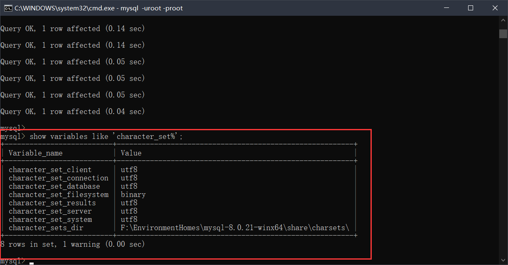

- 删除数据库**（注意，默认的四个数据库不能删除！）**
  - drop database ic_db;  
  - 此处不截图演示
- 查看刚刚执行的SQL语句中的表
  - show tables;

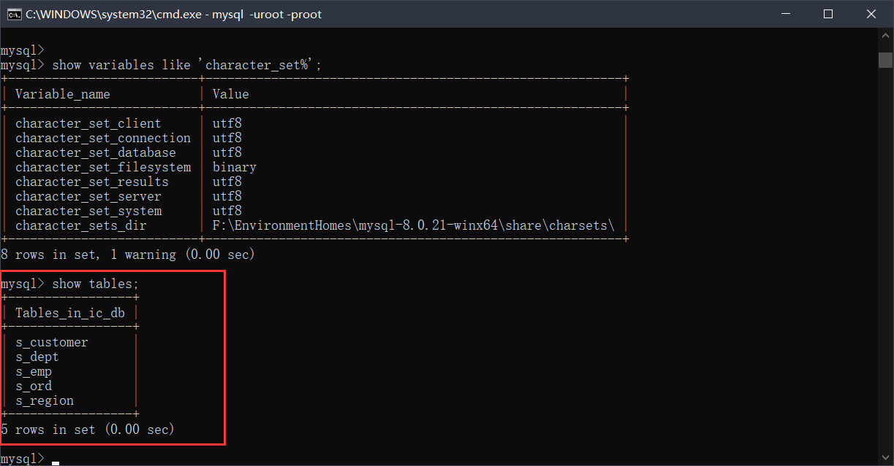

- 查看某张表的表结构
  - desc 表名

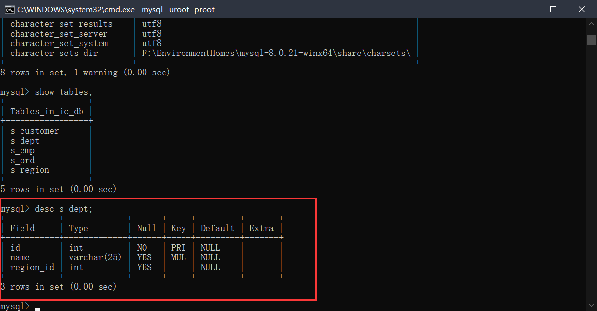

#### 认识SQL

- **结构化查询语言（非过程化查询语言 - Structured Query Language）**简称SQL，是一种特殊目的的编程语言，是一种数据库查询和程序设计语言，用于存储数据一级查询、更新和管理关系数据库系统
- SQL只能操作关系型数据库，市面上的关系型数据库（RDBMS），它们90%的SQL语义几乎一样的，通过SQL语句来操作DB

#### SQL按照功能分类

- DCL（Data Control Language） - 数据控制语言
  - grant（授权）、revoke（取消权限）
- DDL（Data Definition Language） - 数据定义语言
  - create、drop、alter、rename to、comment、truncate ...
- DML（Data Manipulation Language）- 数据操纵语言
  - insert、update、delete
- DQL（Data Query Language） - 数据查询语言
  - select

#### 简单查询示例

- 简介：SQL的命令是大小写不敏感的，在公司中推荐使用大写
- 查询的本质
  - 到哪里查 [确定哪张表]
  - 查什么 [查的列]
  - SELECT 列1,列2,列3,列4[,列n] FROM 表名;

#### 简单查询联系(查询结果不再截图)

```mysql
-- 找出员工的所有的信息;*代替所有的列(企业中不允许)
select * from s_emp;

-- 从s_emp表中查询出员工的名字,薪水,职位;
select first_name,salary,title from s_emp;
-- 从s_emp表中查出员工的姓氏,名字;
select last_name,first_name from s_emp;

-- 找出本公司的所有的职称(title);
select title from s_emp;

-- 补充 - title发现有大量重复的,排重关键字distinct
select distinct title from s_emp;

-- 找出所有员工的姓名、工资、入职日期
select last_name,first_name,salary,start_date from s_emp;

-- 找出所有的客户名及他的电话号码
select name,phone from s_customer;

-- 找出员工姓名及他的职称
select last_name,first_name,title from s_emp;

-- 找出每个订单的费用、支付方式、出货日期
select total,payment_type,date_ordered from s_ord;
```

- 如果不知道表中的列名，可以通过 **desc 表名** 来查询表结构来进行窥探

#### 查询基础

- **SQL具有运算的能力 - 列是可以参加计算的**

```mysql
-- 查询员工的名字，他的年薪（不包含提成）
select first_name,salary * 12 from s_emp;
```

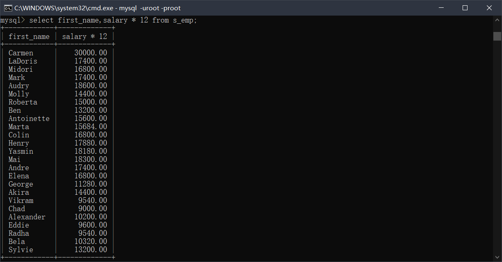

- **SQL具有拼接字符串的功能**
- MySQL 拼接字符串函数 concat(param ... p)

```mysql
select concat(last_name,' ',first_name) from s_emp;
```

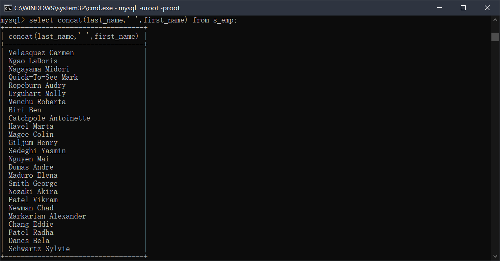

- **给列取别名**
  - select 列1 列别名,列2 列别名2 from 表名;
  - select 列1 as 列别名,列2 as 列别名2 from 表名;
  - elect 列1 "列别名",列2 "列别名2"  from 表名;
  - select 列1 as "列别名",列2 as "列别名3" from 表名;
- MySQL中的字符串都是使用单引号表示，双引号作用是用来包裹格式

```mysql
select salary*12 年薪 from s_emp;
select salary*12 as 年薪 from s_emp;
select salary*12 "年薪" from s_emp;
select salary*12 as "年薪" from s_emp;

-- error
select salary*12 年 薪 from s_emp;
-- success
select salary*12 "年 薪" from s_em
```

- **空值置换函数**
- coalesce(m,n) 相当于 m==null?n:m

```mysql
-- 输出员工的id,firstname以及员工的年薪[包含提成]
select id,first_name,salary*12*(1+commission_pct/100) '年薪' from s_emp;
-- 上述语句只有有提出的才显示出来
-- 结论：null 的列参加计算的时候，结果是null
select id,first_name,salary*12*(1+coalesce(commission_pct,0)/100) '年薪' from s_emp;
```

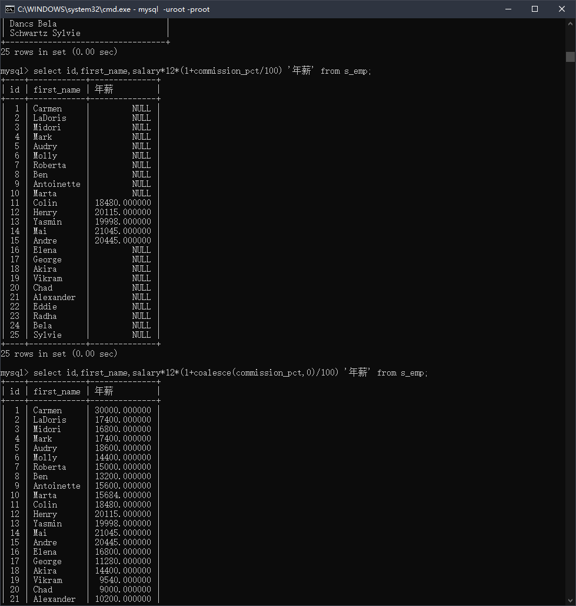

#### 条件查询

- **带条件的筛选查询**
- SELECT * FROM 表名 WHERE 条件表达式1 [and/or 条件表达式2]
  - oracle：条件表达式执行的顺序从右到左
  - mysql：条件表达式的执行顺序从左到右
- **比较运算符**

```mysql
> < >= <= <> =
```

- **其他运算符**

```mysql
-- 闭区间[m,n],在[m,n]之间 
between m and n 
-- 在 ... 之内
in 
-- 不在 ... 之内
not in
-- SQL语句优化的时候不建议使用 not in 语法 - 会导致索引失效
-- 注意的是：对于null值得判断不能使用 = 
-- 判断为空
is null 
-- 判断不为空
is not null
```

- **逻辑运算符**

```mysql
-- 连接条件表达式，当所有得表达式同时成立，结果为 true
and
-- 连接条件表达式，只要一个为true，结果就为true
or
```

#### 模糊查询

- 使用 like 关键字，占位符
- % - 任意多个字符
- _ 任意单个字符

```mysql
-- 比如查询first_name中包含c的员工.
select first_name from s_emp where first_name like '%c%';//模糊查询大小写不敏感

-- 查询第三个字母是a
select first_name from s_emp where first_name like '__a%';
```

- MySQL中也支持转义字符 - 默认的转义字符 \

```mysql
-- 把名字更新一下
update s_emp set first_name='Car%men' where id=1;
update s_emp set first_name='Mar%k' where id=4;

-- 查询
select * from s_emp where first_name like '%\%%';
```

- 通过 escape 关键字来定义指定的转义字符

```mysql
select * from s_emp where first_name like '%?%%' escape '?';
```

#### 条件查询和模糊查询练习

- 查出在41部门的员工名字,工资

```mysql
select first_name,salary from s_emp where dept_id=41;
```

- 查出工资高于1500的员工的信息

```mysql
select id,first_name,salary from s_emp where salary>1500;
```

- 找出工资大于1200元的员工全名、工资、职称

```mysql
select concat(last_name,' ',first_name) 姓名,salary,title from s_emp where salary>1200;
```

- 查出在41,42,50部门的员工名,薪水

```mysql
select first_name,salary,dept_id from s_emp where dept_id=41 or dept_id=42 or dept_id=50;

select first_name,salary,dept_id from s_emp where dept_id in(41,42,50);
```

- 找出工资在1200到1500之间的员工名

```mysql
select first_name,salary from s_emp where salary>=1200 and salary<=1500;
select first_name,salary from s_emp where salary between 1200 and 1500;
```

- **查出名字是以M打头的员工**
- %类似量词*(零次或者多次)

```mysql
select first_name from s_emp where first_name like 'M%';
```

- **查出姓名中第三个字母是e的员工**

```mysql
select first_name from s_emp where first_name like '__e%';
```

- 找出没有提成率的员工

```mysql
select first_name from s_emp where commision_pct is null;

select first_name from s_emp where coalesce(commission_pct,0)=0;
```

- 找出费用超过10000元的订单编号及支付方式

```mysql
select id,payment_type,total from s_ord where total>10000;
```

- 找出工资在950(含)至1200(含)元的员工姓名、职称

```mysql
select first_name,title,salary from s_emp where salary between 950 and 1200;
```

- **找出名字first_name中含有字母a的员工**

```mysql
select first_name from s_emp where first_name like '%a%';
```

#### 排序语句

- 数据量大的时候，order by 语句禁止使用，性能超级低

```mysql
SELECT 列 From 表名
WHERE 条件语句
ORDER BY 列 [ASC|DESC]

ASC - 升序 - 默认可以不写.
DESC - 降序
```

- 查询出职称是Stock Clerk的员工全名、工资，并按工资降序排序

```mysql
-- order by 后面可以放什么？
-- 直接跟列名
select concat(last_name,' ',first_name) 姓名,salary,title from s_emp where title='Stock Clerk' order by salary desc;

-- 直接跟列别名
select concat(last_name,' ',first_name) 姓名,salary _sal,title from s_emp where title='Stock Clerk' order by _sal desc;

-- 跟查询的序号，MySQL中序号从1开始 - 推荐使用
select concat(last_name,' ',first_name) 姓名,salary ,title from s_emp where title='Stock Clerk' order by 2 desc;
```

- 查询出职称中带VP的员工名字,工资,并按工资的降序排序

```mysql
select first_name,salary,title from s_emp where title like '%VP%' order by 2 desc;
```

- 查询出年薪低于25000的员工名,职称,并按年薪升序排序,如果年薪一样,继续根据first_name降序排.

```mysql
select first_name,title,salary*12*(1+coalesce(commission_pct,0)/100) year_salary from s_emp where salary*12*(1+coalesce(commission_pct,0)/100)<25000 order by 3,1 desc;

-- 子查询 - 把查询出来的结果作为"虚拟表".
select * from(
select first_name,title,salary*12*(1+coalesce(commission_pct,0)/100) year_salary from s_emp) core_ order by 3,1 desc;
```

#### 补充case ..when..then..else..end语法

```mysql
select id,name,
	case region_id
		when 1 then '北美'
		when 2 then '南美'
		when 3 then '非洲/中东'
		when 4 then '亚洲'
		else '未知区域'
	end 区域名 from s_dept;

	
-- 工资高于1500的,显示土豪
-- 工资[1200,1500],显示中产
-- 工资低于1200,显示拖后腿
select id,first_name,salary,
	case
		when salary>1500 then '土豪'
      	when salary>=1200 and salary<=1500 then '中产'
      	else '拖后腿'
    end 工资等级 from s_emp;
```

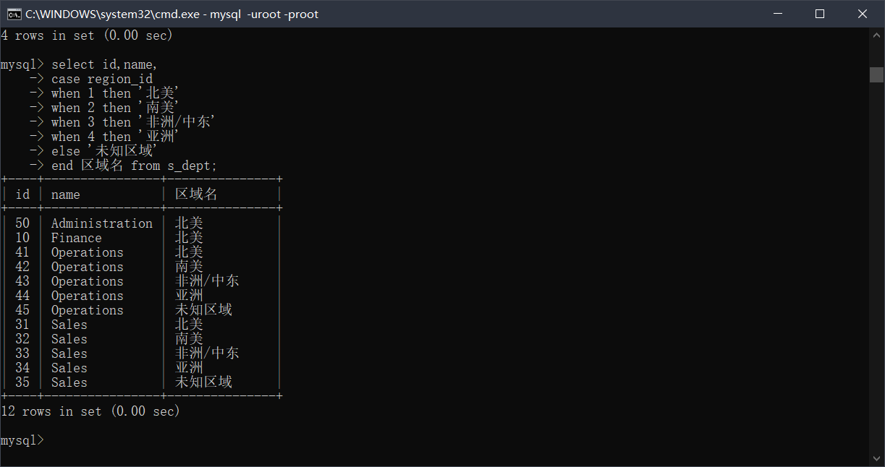

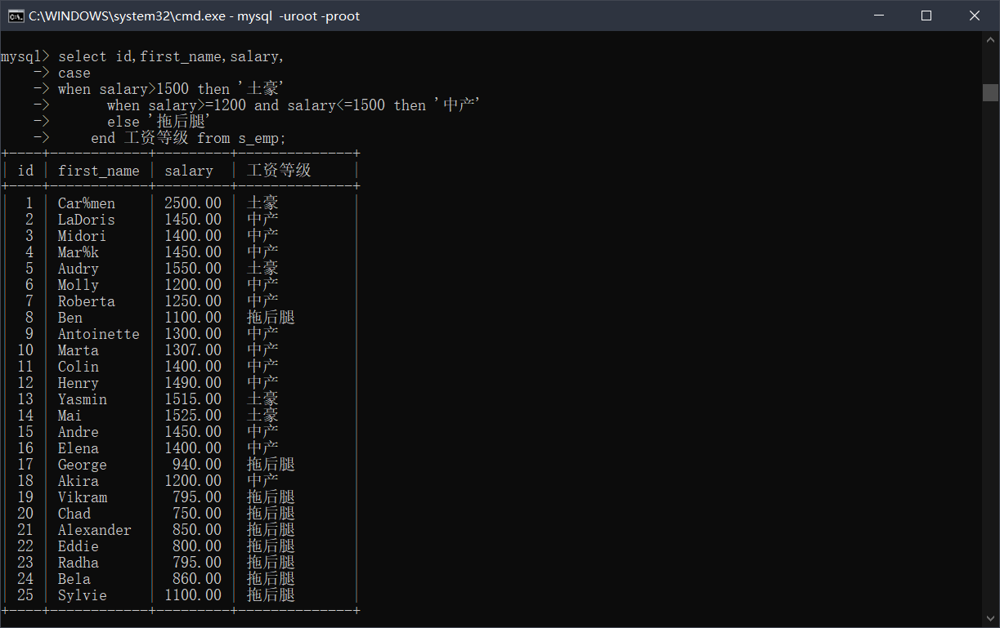