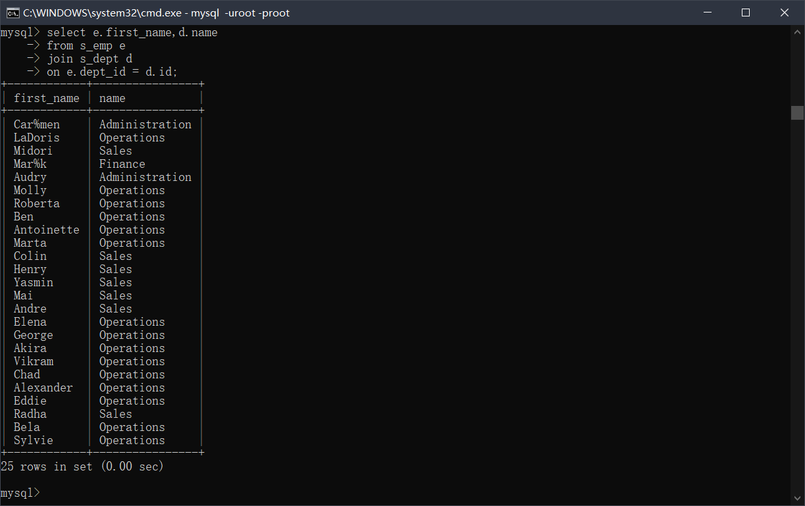
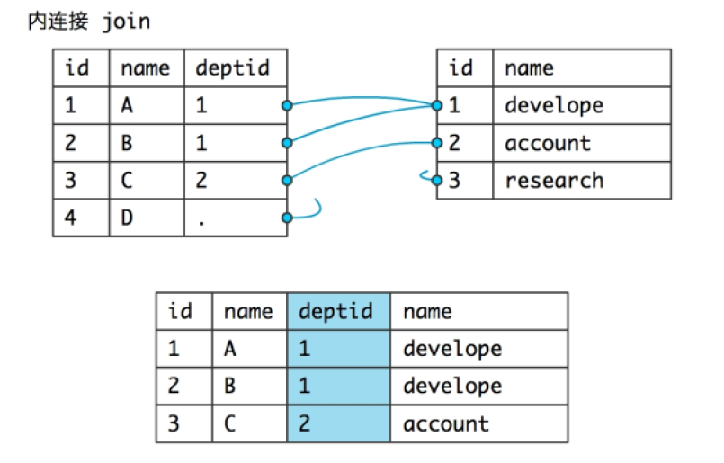
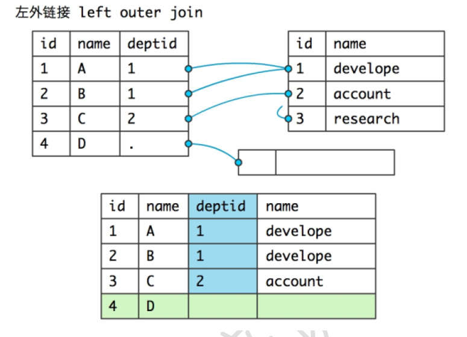
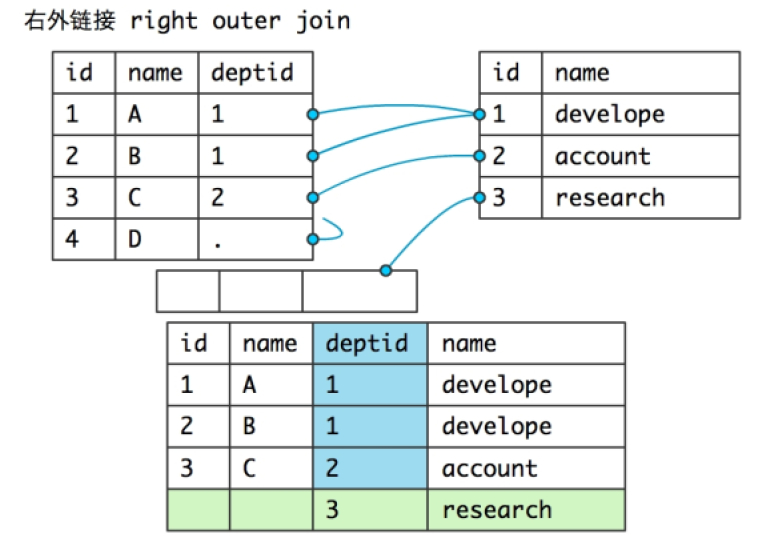
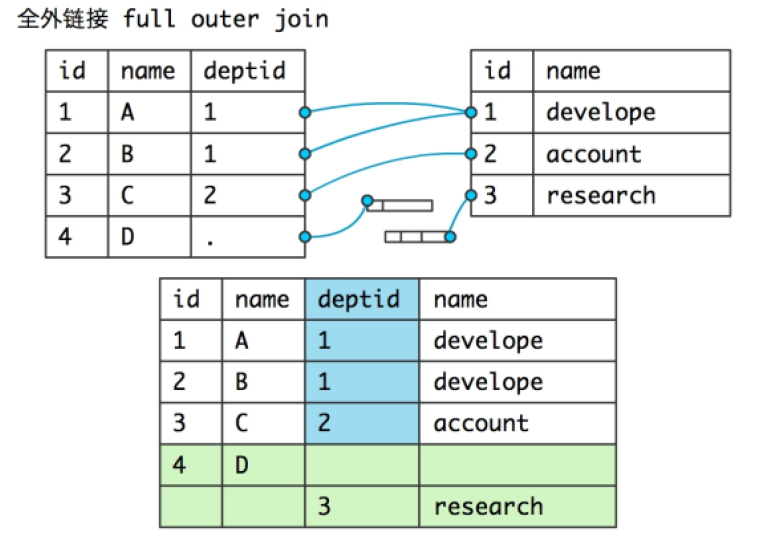

### MySQL - 基础篇 - 第3篇 - 高级查询

> 简介：多表查询

#### 关联查询

- **查询员工的first_name、部门的名字**

  - 错误的写法 - 笛卡尔积 - 两个表中的数据**相乘**了

  ```mysql
  -- 错误的写法
  select first_name,name from s_emp,s_dept;
  ```

- 传统的写法

```mysql
select first_name,name 
	from s_emp,s_dept
	where dept_id = id
-- ERROR 1052 (23000): Column 'id' in where clause is ambiguous
-- 两个表都有id。此时不知道where语句中的id是哪个表中的，多表中存在相同的列
-- 推荐多表查询的时候，需要给表取别名
select e.first_name,e.id,d.name,d.id 
	from s_emp e,s_dept d
	where e.dept_id = d.id;
```

- 关联查询使用 **join...on **（二者一定是一起使用的）
- 表join表on的目的不是进行条件筛选，就是用来除去笛卡尔积的

```mysql
select e.first_name,d.name 
	from s_emp e
	join s_dept d
	on e.dept_id = d.id;
```



- 对比传统写法和关联写法的区别

```mysql
-- 查询出员工first_name以及这个员工所在的部门的name，以及这个员工所在的区域的名字。
-- 使用关联查询 join ... on ..
select e.first_name,d.name,r.name
	from s_emp e
	join s_dept d
		on e.dept_id = d.id
	join s_region r 
		on d.region_id = r.id;
-- 注意：能使用join的两张表一定要存在直接的关联关系

-- 传统的写法 - 弊端:不容易体现表之间的关系 - 可读性差.
select select e.first_name,d.name,r.name 
	from s_dept d,s_emp e,s_region r
	where 
	e.dept_id = d.id 
	and 
	d.region_id = r.id;
```

#### 关联查询练习 - 内连查询

- 查询出员工的first_name,该员工的部门名字,该员工的所在部门的区域的名称.

```mysql
select e.first_name,d.name,r.name
	from s_emp e
	join s_dept d
		on e.dept_id = d.id
	join s_region r
		on d.region_id = r.id;
```

- **on并不是用来替代where,**上面的题中增加一个业务.找出区域'Asia'上的所有的员工的名字,部门名字,区域名字.

```mysql
select e.first_name,d.name,r.name
	from s_emp e
	join s_dept d
		on e.dept_id = d.id
	join s_region r
		on d.region_id = r.id
	where r.name = 'Asia';
```

- 找出部门是31的部门的名称,以及该部门的所有的员工的名字和工资

```mysql
select e.first_name,e.salary,d.name
	from s_emp e
	join s_dept d
		on e.dept_id = d.id
	join s_region r
		on d.region_id = r.id
	where d.id = 31;
```

- 找出欧洲区域上所有的员工的名字,区域名称.

```mysql
select e.first_name,r.name 
	from s_emp e
	join s_dept d
		on e.dept_id = d.id
	join s_region r
		on d.region_id = r.id
	where r.name = 'Europe';
```

- 查询所有客户的id,名称以及该客户拥有的订单的所有的信息

```mysql
select c.id,c.name,o.* 
	from s_customer c 
	join s_ord o 
	on c.id = o.customer_id;
```

#### 关联查询 - 连接的方式

- **内联方式** - [inner] join

```mysql
select c.id,c.name,o.*
	from s_customer c
	join s_ord o
		on c.id = o.customer_id;
-- 如果这个客户没有订单信息，那么这个客户将不会被查出来 
```




- ***左外联 - 左连接*** - left join

- 以join左边的表为基准.在查询的时候,即使右边的表中没有与之对应的记录的时候.左边的这张表中的记录仍然也会被查询出来.

```mysql
select c.id,c.name,o.*
	from s_customer c
	left join s_ord o
		on c.id = o.customer_id;
```



- 右连接 - right join

- 以join右边的表为基准,如果左边的表中没有与之对应的记录的时候,也要把右边的表中的记录查询出来.

```mysql
select c.id,c.name,o.*
	from s_ord o
	right join s_customer c
		on c.id = o.customer_id;
```



- 全连接
- A ***full outer*** join B
- **mysql中不支持这个语法**



##### 练习 - 自关联

- 查询员工名字以及该员工的上司的名字

```mysql
select e1.first_name 员工名字,e2.first_name 上司名字
	from s_emp e1
	join s_emp e2
		on e2.id = e1.manager_id;
```

- 查询员工名字以及该员工的上司的名字,即使这个员工没有上司,也要查询来.

```mysql
select e1.first_name 员工名字,e2.first_name 上司名字
	from s_emp e1
	left join s_emp e2
		on e2.id = e1.manager_id;
```

#### 多行函数

>简介:多***行函数 - 组函数.***

* count(n)
* n 可以为 * ，可以为具体的列，统计行数的，重复的数据也算1个
* 注意：如果遇到了列值为 null ，那么就直接跳过了，不计数

```mysql
-- 统计员工的个数
select count(*) from s_emp;

-- 统计具体的某个非空列
select count(e.id) from s_emp e;

-- 注意:如果碰到null值列,那么直接跳过了,不计数.
select count(commission_pct) from s_emp;
```

- avg(n);
- 求出某列的所有行的平均值.

```mysql
-- 求出所有员工的平均月薪
select avg(salary) from s_emp;
```

- max(n),min(n)
- 求出最大值和最小值

```mysql
-- 求出最大的工资和最小的工资
select max(salary),min(salary) from s_emp;
```

- sum(n)
- 求和

```mysql
-- 求出员工表中所有的员工的工资总和
select sum(salary) from s_emp;
```

- 注意:***使用sum进行统计的时候,如果遇到null值,忽略null***

**使用的注意点**

- 查询的列中是否可以出现普通列？ - 不可以
- 如果查询列中出现了组函数,不能光秃秃的出现普通列.如果出现普通列,必须要按照普通列进行分组.

```mysql
-- ERROR 1140 (42000): In aggregated query without GROUP BY, expression #1 of SELECT list contains nonaggregated column 'ic_db.s_emp.first_name'; this is incompatible with sql_mode=only_full_group_by

-- 不难理解，因为max(salary)查询出来的是一个值，但是first_name是多个值，这就矛盾了，所以就出错了
select first_name,max(salary) from s_emp;
```

#### 分组查询

```mysql
select 列1[,列2],组函数(多行函数)
where 条件语句
group by 列1[,列2]
having 组函数的判断
order by 排序
```

- 统计各个部门的人数(部门的id和该部门的员工的数量)

```mysql
select count(*) from s_emp group by dept_id;
select dept_id,count(*) from s_emp group by dept_id;

-- ERROR 1055 (42000): Expression #1 of SELECT list is not in GROUP BY clause and contains nonaggregated column 'ic_db.s_emp.first_name' which is not functionally dependent on columns in GROUP BY clause; this is incompatible with sql_mode=only_full_group_by
-- 分组查询语句中的select如果跟了普通列的话,那么这个普通列一定要符合实际的业务,应该和group by + 列保持一致.
select first_name,dept_id,count(*) from s_emp group by dept_id;
```

- 统计各个职称的员工的数量

```mysql
select title,count(*) from s_emp group by title;
```

- 统计各个区域的id和区域的部门数量

```mysql
select r.id,count(d.id)
	from s_dept d
	join s_region r
		on d.region_id = r.id
	group by r.id;
```

- 统计各个部门的id,名称以及这个部门的员工的数量

```mysql
select d.id,d.name,count(e.id)
	from s_emp e
	join s_dept d
		on e.dept_id = d.id
	group by d.id,d.name;
```

- 统计各个区域的id,名称以及这个区域的员工的数量

```mysql
select r.id,r.name,count(e.id)
	from s_emp e
	join s_dept d
		on e.dept_id = d.id
	join s_region r
		on d.region_id = r.id
	group by r.id,r.name;
```

- 统计各个客户的订单的数量,没有订单的客户也要统计

```mysql
select c.id,c.name,count(o.id)
	from s_customer c
	left join s_ord o
		on c.id = o.customer_id
	group by c.id,c.name;
```

#### having 组函数判断

> 简介:where和having使用时候的区别

- **where 是条件过滤，是在分组之前的过滤，不能使用组函数**
- **having 是在分组之后的进一步过滤，允许使用组函数的**
- 查询出平均工资超过1300部门的平均工资

```mysql
select d.id,d.name,avg(e.salary)
	from s_emp e
	join s_dept d
		on e.dept_id = d.id
	group by d.id,d.name 
	having avg(e.salary)>1300;
```

- 统计本公司的职称的数量.

```mysql
select
	count(distinct title)
	from s_emp;
```

- 统计没有订单的客户信息

```mysql
select c.id,c.name,count(o.id)
	from s_customer c
	left join s_ord o
		on c.id = o.customer_id
	group by c.id,c.name
	having count(o.id)=0;
```

- 统计人数超过3个员工的部门编号和部门名称

```mysql
select d.id,d.name
	from s_dept d
	join s_emp e
		on d.id = e.dept_id
	group by d.id,d.name
	having count(e.id)>3;
```

- 统计除了'Asia'之外的各个区域的id,name以及这个区域的人数(4个),并且根据r.id降序排序

```mysql
select r.id,r.name,count(e.id)
	from s_emp e
	join s_dept d
		on e.dept_id = d.id
	join s_region r
		on d.region_id = r.id
	where r.name <> 'Asia'
	group by r.id,r.name
	having count(e.id)>4 
	order by 1 desc;
```

- 查询出各年份入职的员工情况（年份，员工人数）

```mysql
select year(start_date) 年份,count(id) 
	from s_emp
	group by year(start_date);
```

- 查询出每年每月入职的员工情况（年份月份，员工人数)

```mysql
-- 方式1
select year(start_date),month(start_date),count(*)
	from s_emp
	group by year(start_date),month(start_date);
	
-- 方式2
select date_format(start_date,'%Y%m'),count(*) 
	from s_emp
	group by date_format(start_date,'%Y%m');
```

#### 子查询

- 定义:查询中嵌套查询.注意点:***子查询一定要使用()括起来.***
- 子查询可以出现的位置
  * 作为外部查询的条件
  * 作为外部查询的列
  * 把子查询的结果作为"虚表",一定要给"虚表"取别名

##### 练习

- ***子查询作为外部查询的条件.***
- 查询出比Mark工资高的员工的名字和工资信息

```mysql
-- 分解步骤1：
select salary from s_emp where first_name = 'Mark';
-- 分解步骤2：
select first_name,salary from s_emp where salary > 1450
-- 合并
select first_name,salary from s_emp where salary > (
	select salary from s_emp where first_name = 'Mark'
);
```

- **子查询出现在外部查询的select列中**

- 查询出比Mark员工工资高的员工的名字和工资信息

```mysql
select e.first_name,(
	select e.salary from s_emp e1 
    where e1.first_name='Mark'
    and e.salary>e1.salary
) _sal from s_emp e;
```

- **子查询查询出来的结果 - "表"**

```mysql
select * from (
	select e.first_name,(
    	select e.salary from s_emp e1 
        where e1.first_name = 'Mark'
        and e.salary > e1.salary
    ) _sal from s_emp e
) core_ where core_._sal is not null;
```

- 查询出客户名,电话号码以及订单数量

```mysql
select c.id,c.name,c.phone,(
	select count(o.id) 
    from s_ord o 
    where o.customer_id = c.id
) from s_customer c;
```

#### 子查询的分类

- 相关子查询 - 子查询中使用到了外部查询的列.子查询是不能够独立运行的.

```mysql
select c.id,c.name,c.phone,(
    select count(o.id) 
    from s_ord o 
    where o.customer_id = c.id
) from s_customer c;
```

- 无关子查询 - 子查询中没有使用到外部查询的列,子查询是允许单独执行的.

```mysql
select e.first_name,e.dept_id 
	from s_emp e
	where e.dept_id = (
        select e1.dept_id 
        from s_emp e1 
        where e1.first_name='Ben'
    ) and e.first_name<>'Ben';
```

- 关联查询

```mysql
-- 写过了- 查询出客户名,电话号码以及订单数量
```

使用原则:***关联查询>无关子查询>相关子查询.***

#### exists和not exists用法

* exists 关心条件为true - 是否存在
* not exits 关心条件为false - 不存在
* 不关心查询出来的是什么，只关心能不能查询出来

```mysql
select first_name 
	from s_emp 
	where exists(select 1 from s_dept where 1=1);
-- exists后面的子查询能够查询出来结果 - > true
```

- 找出与'Ben'同部门的员工

```mysql
select e.first_name,e.dept_id 
	from s_emp e 
	where exists(
        select 1 
        from s_emp e1 
        where e1.first_name='Ben' and e.dept_id = e1.dept_id
    ) and e.first_name<>'Ben';
```

- **select 1是查询有没有满足条件的数据**
- **select count(*)是判断满足条件的数据有多少条**

- 找出各个部门工资排名前二的员工 - 前提是 - 相同工资不超过2个.

```mysql
-- 在"我e"这个部门中,如果有人的工资比"我e"还要高,那么这个人的数量不能超过1个.
select e.dept_id,e.first_name,e.salary
	from s_emp e
	where exists(
    	select 1 from s_emp e1
        where e1.dept_id = e.dept_id and e1.salary > e.salary 
        having count(*)<=1
    )order by 1;
```

```mysql
-- 不存在,在"我e"这个部门中,有人的工资比我高,并且这个数量超过1.
select e.dept_id,e.first_name,e.salary
	from s_emp e
	where not exists(
    	select 1 from s_emp e1
        where e1.dept_id = e.dept_id and e1.salary > e.salary 
        having count(*)>1
    ) order by 1;
```

- 找出各个部门中工资最高的员工
  - 思路：本部门中比'我'工资高的员工不超过1个
  - 本部门中不存在比'我'工资还要高的员工(数量>0)

```mysql
select e.dept_id,e.first_name,e.salary 
	from s_emp e 
	where not exists(
        select 1 
        from s_emp e1 
        where e1.dept_id = e.dept_id and e1.salary>e.salary
     having count(*)>0
    );
```

#### exists 应用场景

笔试最难的题目 - 学生表,教师表,课程表,选课表

							- 客户表,购买表,产品表.

* 请找出所选课程和'Tom'选课一样的学生的信息.

  比如:tom选择的课程id - 1 2 3

* ***请找出所有课程包含'Tom'选课的学生的信息.***

思路 - 差集.

* 1 2 3 - 2 3 = 1 -> 有记录 -> 不符合条件
* 1 2 3 - 1 2 3 4 -> 没有记录 -> 符合条件

#### 求出查询结果的并集，差集，交集。

* 并集 - union     union all

* **差集**

```mysql
create table tt(
	id int(7)
);
insert into tt values(1),(2),(3),(4);

select id from tt where id in(1,2);

select id from tt where id in(2,3);

-- 第一种写法(建议)
select core_.aid 
	from(
		select * 
        from (
            select id aid 
            from tt 
            where id in(1,2)
        ) a 
        left join (
            select id bid 
            from tt 
            where id in(2,3)
        ) b on a.aid = b.bid) core_
	where core_.bid is null;

-- 第二种写法
select * 
	from(
        select id 
        from tt 
        where id in(1,2)
    ) a
	where a.id not 
	in(
        select id 
        from tt 
        where id 
        in(2,3)
    );
```

#### 经典题

```mysql
drop table purcase;
drop table customer;
drop table product;

create table product(
	  productid int(12) primary key,
	  productname varchar(20) not null,
	  unitprice double(11,2),
	  category varchar(28),
	  provider varchar(48)
);

create table customer(
		customerid int(12) primary key,
		name varchar(48),
		location varchar(128)
);

create table purcase(
		customerid int(12),
		productid int(12),
		quantity int(7)
);

insert into product values(1,'佳洁士',8.00,'牙膏','宝洁');
insert into product values(2,'高露洁',6.50,'牙膏','高露洁');
insert into product values(3,'洁诺',5.00,'牙膏','联合利华');
insert into product values(4,'舒肤佳',3.00,'香皂','宝洁');
insert into product values(5,'夏士莲',5.00,'香皂','联合利华');
insert into product values(6,'雕牌',2.50,'洗衣粉','纳爱斯');
insert into product values(7,'中华',3.50,'牙膏','联合利华');
insert into product values(8,'汰渍',3.00,'洗衣粉','宝洁');
insert into product values(9,'碧浪',4.00,'洗衣粉','宝洁');

insert into customer values(1,'Dennis','黄浦区');
insert into customer values(2,'John','徐家汇');
insert into customer values(3,'Tom','闸北');
insert into customer values(4,'Jenny','静安');
insert into customer values(5,'Rick','浦东');

insert into purcase values(1,1,3);
insert into purcase values(1,5,2);
insert into purcase values(1,8,2);
insert into purcase values(2,1,5);
insert into purcase values(2,5,4);
insert into purcase values(2,8,3);
insert into purcase values(3,1,1);
insert into purcase values(3,5,1);
insert into purcase values(3,6,3);
insert into purcase values(3,8,1);
insert into purcase values(4,1,7);
insert into purcase values(4,5,3);
insert into purcase values(4,8,3);
insert into purcase values(5,6,2);
insert into purcase values(5,7,8);

commit;

-- 求购买的商品包含了顾客"Dennis"所购买的所有商品的顾客（姓名）
-- 产品的id - 1 5 8

-- 思路 - 1 5 8的查询结果和另外一个人进行差集操作,如果返回empty,就是符合要求的.

-- 找出Dennis所买的productid
select 
	pur.productid apid 
	from purcase pur 
	where pur.customerid=(
        select c.customerid 
        from customer c 
        where c.name='Dennis'
    );
-- 158

-- 假设挑选出一个客户->tom->3

select pur.productid bpid 
	from purcase pur 
	where pur.customerid=3;
-- 1568

select * from(
    select pur.productid apid 
    from purcase pur 
    where pur.customerid=(
        select c.customerid 
        from customer c 
        where c.name='Dennis')
	) a where a.apid not in(
        select pur.productid bpid 
        from purcase pur 
        where pur.customerid=3
    );
-- ----------------
select c.name 
	from customer c 
	where not exists(
		select * from(
            select pur.productid apid 
            from purcase pur 
            where pur.customerid=(
                select c.customerid 
                from customer c 
                where  c.name='Dennis')
        ) a where a.apid 
        not in(select pur.productid bpid
               from purcase pur 
               where pur.customerid=c.customerid)
	) and c.name<>'Dennis';

-- 求购买的商品和顾客"Dennis"所购买的所有商品一样并且数量一样的顾客（姓名）
select c.customerid,c.name 
	from customer c 
	where not exists(
		select * from(
            select pur.productid apid 
            from purcase pur 
            where pur.customerid=(
                select c.customerid 
                from customer c 
                where  c.name='Dennis'
            )
        ) a where a.apid 
        not in(select pur.productid bpid
               from purcase pur 
               where pur.customerid=c.customerid)
	) and c.name<>'Dennis';

-- 分解 - 'Denis'购买的数量
select c.customerid,c.name,count(*) count_ 
	from customer c 
	join purcase pur 
		on c.customerid = pur.customerid 
	where c.name='Dennis' 
	group by c.customerid,c.name;

select count(*) count_ 
	from customer c 
	join purcase pur 
		on c.customerid = pur.customerid 
	where c.name='Dennis' group by c.customerid;

-- 最终的结果

select outer_.name 
	from(select core_.cid,core_.name,count(*) count_ 
         from(select c.customerid cid,c.name 
              from customer c 
              where not exists(select * from(
                  select pur.productid apid 
                  from purcase pur 
                  where pur.customerid=(
                      select c.customerid 
                      from customer c 
                      where c.name='Dennis')
              ) a where a.apid not in(
                  select pur.productid bpid
                  from purcase pur 
                  where pur.customerid=c.customerid)
			)and c.name<>'Dennis') core_ 
         join purcase pp 
         	on core_.cid = pp.customerid 
         group by core_.cid,core_.name) outer_ 
         where outer_.count_ = (
             select count(*) count_ 
             from customer c 
             join purcase pur 
             	on c.customerid = pur.customerid 
             where c.name='Dennis' group by c.customerid
         );
```

