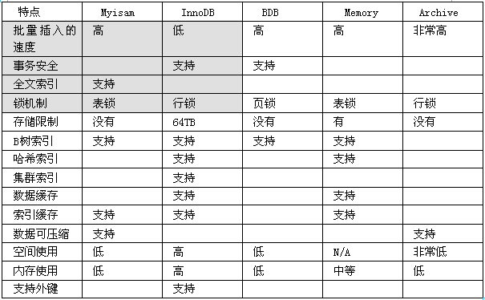
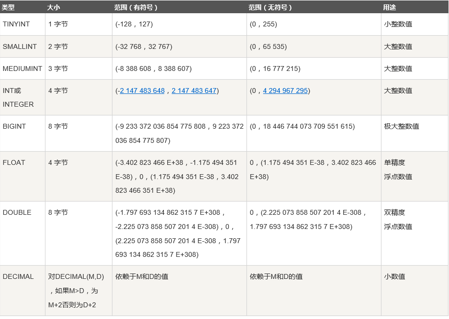
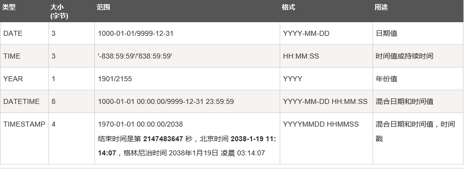
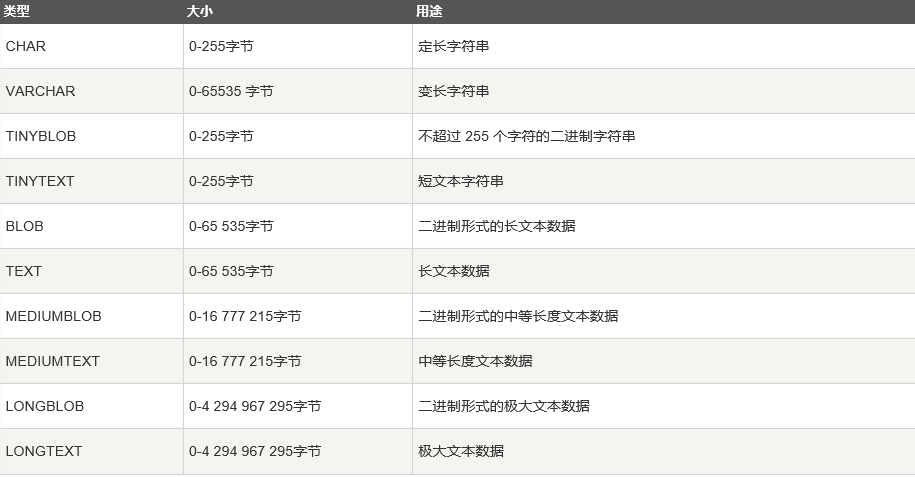
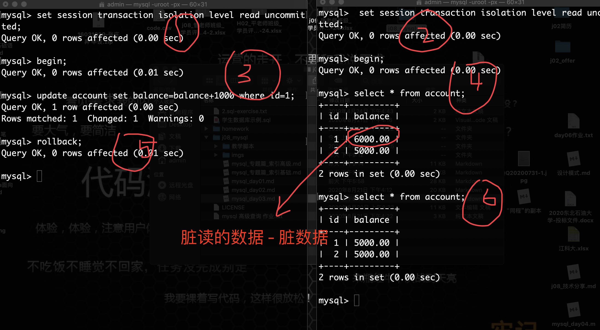
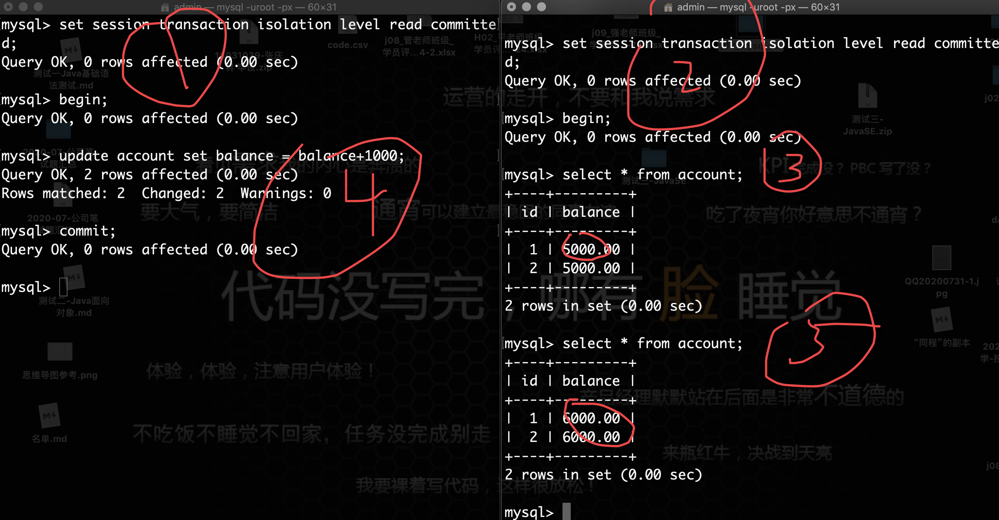
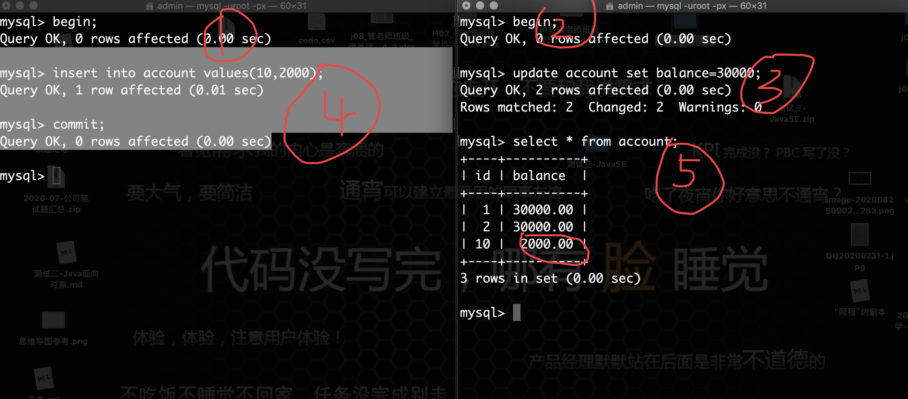
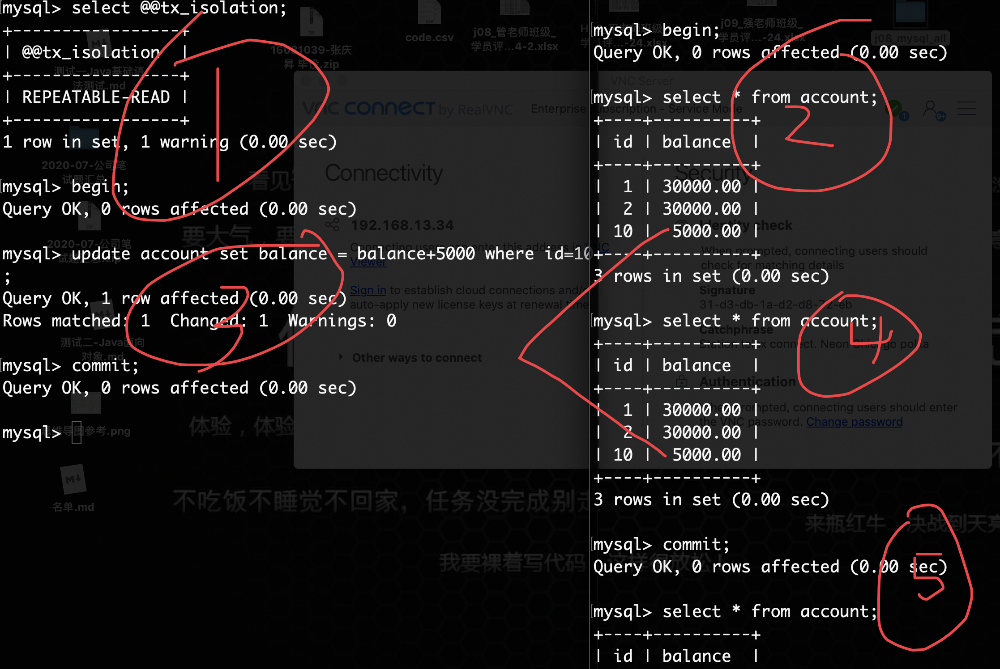
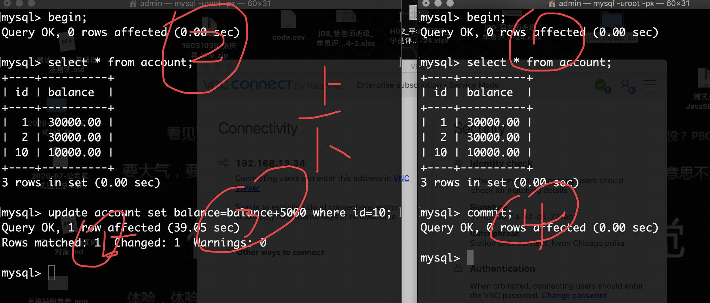

### MySQL - 基础篇 - 第4篇 - 数据库设计

#### DDL

- DDL - Data Definition Language 数据定义语言
- **create - 创建表（创建db、创建User、创建table、创建view、创建index、创建function、创建存储过程、创建db的基本对象）**
- **drop - 删除db、删除db的基本对象**
- truncate - 清空表

```mysql
-- drop truncate delete 三个命令的区别
-- DELETE语句执行删除的过程是每次从表中删除一行，并且同时将该行的删除操作作为事务记录在日志中保存以便进行进行回滚操作。
-- TRUNCATE TABLE 则一次性地从表中删除所有的数据并不把单独的删除操作记录记入日志保存，删除行是不能恢复的。并且在删除的过程中不会激活与表有关的删除触发器。执行速度快。
-- drop table 是把整个表删除 将表所占用的空间全释放掉。

-- 参考文章：https://www.cnblogs.com/zhizhao/p/7825469.html
```

- ***alter命令 - 了解即可***(修改列名,修改表名,修改列的属性,修改约束).
- rename to - 重新命名[表,列]
- comment - 创建表时给列加的注释.

#### 数据库的设计

##### ORM

- ORM(Object Relational Mapping) - 对象关系映射,它是一种"思想"框架.产生了很多ORM框架.
- 这些ORM框架都是ORM思想的实现者.
- ORM框架都是属于**持久层的框架**[用java代码和DB进行交互的框架]
  * 全自动的ORM框架 - Hibernate
  * 半自动的ORM框架 - Mybatis(前身是ibatis)

- ORM思想的核心
  - 用OO思想分析完业务之后,对象-关系-产生映射
  - 将表中的数据加载到JVM内存中,然后封装到java对象中.
  - java对象持久到表中

| 类-Book         | 表 - Book                                                    |
| --------------- | ------------------------------------------------------------ |
| id - 对象标识别 | 主键(primary key) - 能够唯一确定一行的列.非空且唯一.通常选择使用id列,当然组合主键. |
| 属性            | 列名                                                         |
| 对象之间的关系  | 外键(foreign key) - 表与表之间的关系就是通过外键来维护的     |

##### 关系

-  关联的方向性 - 首选的是单向关联 `一对一`
- 一对多
- 多对多
  - 拆分为一对多

- 外键特性

  * 外键列是允许为空
  * 外键列如果出现,那么在另外一张表中,必然有对应的记录值.
  * 外键列的值对应另外一张表中的主键列值.
  * 外键列必然是出现在多的一方.

- 主键列:非空且唯一,能够唯一确定一行

##### 三大范式

- 数据库设计原则也就是指 `数据库设计的三大范式`
- 作用：用来指导数据库设计人员的一种设计思想，保证数据库的设计是具备可拓展性，无数据的冗余，结构清晰明了
- ***1NF:原子性,也就是说表中任何一个列都是唯一的,不可再拆分.***
- **2NF:在1NF的基础上,不存在非关键列部分依赖于关键列,也就是说所有的非关键列都必须完全依赖于关键列.**
- 3NF:在2NF的基础上,**不存在非关键列传递依赖于关键列**,也就是说,**所有的非关键列都必须直接依赖于关键列**

#### 创建表

- 语法

```mysql
-- 不含有约束的
-- [if not exsits] 同一个数据库不能创建同名的表，如果不加上这个，那么就会报错
create table [if not exsits] table_name(
  列名1 列的数据类型(范围),
  列名2 列的数据类型(范围),
  ..   .. ,
  ..   ..,
  列名n 列的数据类型(范围)
)engine=InnoDB default charset=utf8;
mysql5.7默认的存储引擎就是InnoDB,编码my.ini文件中已经设置过了.

通过show命令来查看已存在表的建表语句.
mysql>show create table 表名;
```

#### 存储引擎

- 概念:数据库对同样的数,有着不同的存储方式和管理方式. 
- InnoDB的存储引擎的特点:***支持事务,只是行锁,支持外键的使用***.



#### 数据类型

- MySQL支持多种数据类型

##### 数值类型

- MySQL支持所有标准SQL数值数据类型。
- 这些类型包括严格数值数据类型(INTEGER、SMALLINT、DECIMAL和NUMERIC)，以及近似数值数据类型(FLOAT、REAL和DOUBLE PRECISION)。
- 关键字INT是INTEGER的同义词，关键字DEC是DECIMAL的同义词。
- BIT数据类型保存位字段值，并且支持MyISAM、MEMORY、InnoDB和BDB表。
- 作为SQL标准的扩展，MySQL也支持整数类型TINYINT、MEDIUMINT和BIGINT。下面的表显示了需要的每个整数类型的存储和范围。 



- ***double(m,n)*** - double(7,2) -> 最大的数:99999.99,项目中涉及金额,对精度要求比较高的小数,推荐使用decimal

  ***推荐的整数int,小数double.***

##### 日期类型

- 表示时间值的日期和时间类型为DATETIME、DATE、TIMESTAMP、TIME和YEAR。
- 每个时间类型有一个有效值范围和一个"零"值，当指定不合法的MySQL不能表示的值时使用"零"值。
- TIMESTAMP类型有专有的自动更新特性，将在后面描述。
- **date和datetime类型即可**



##### 字符串类型

- 字符串类型指CHAR、VARCHAR、BINARY、VARBINARY、BLOB、TEXT、ENUM和SET。该节描述了这些类型如何工作以及如何在查询中使用这些类型。
- **varchar类型 - 存储字符串**
- **char[固定长]和varchar(可变长)的区别.**
- mysql5.7 - 5都是代表是字符的个数.
- char(5) - 'abc' - 实际存储'abc',实际仍然占5个位置
- varchar(15) - '管abcd' - 实际占5个位置



**练习**

```mysql
-- 实体类中,mysql中尽量不要使用char类型 - why???
-- 创建emp表
drop table emp;
create table emp(
	id int(7) comment '主键列',
  name varchar(5),
  salary double(7,2),
  start_date datetime,
  sex enum('f','m')
);
-- 数据类型以及数据范围都是为了约束插入数据时的数据的合法性的.
-- 演示范围的作用
insert into emp values(1,'admin',10000.0,now(),'f');
insert into emp values(1,'admins',10000.0,now(),'f');
ERROR 1406 (22001): Data too long for column 'name' at row 1
```

#### 约束

- 简介:constraint的作用 - 为了添加数据的时候,数据的更加合法性.一旦违反了某个约束,sql语句都会执行错误.mysql中有一套异常机制.

- ***a. primary key 主键约束 - 非空且唯一的.每张表都应该给定一个主键,通常选取id.当然也是支持组合主键.***
- ***b. not null - 非空约束,插入数据的时候,该列的数据不允许为null.***
- ***c. unique - 唯一性约束.插入的数据必须要保证唯一性.不能出现重复的.***
- ***d. foreign key - 外键约束.表和表之间的关系的.***

- e. check约束 - oracle中支持,mysql不支持-自检约束.
  - age int(3) check(age>0 and age<=18)
- ***f. default 默认值,如果插入数据的时候,没有给定列的值,则使用默认值.***

- 主键和唯一
  - 区别
    - 一个表至多只有一个主键。但是可以有多个唯一
    - 主键不可以为空，唯一可以为空
  - 相同点
    - 都具有唯一性
    - 都支持组合键，但是不推荐

##### 创建表的时候添加约束

```mysql
create table 表名(
	字段名 字段类型 not null,
  	字段名 字段类型 primary key,
  	字段名 字段类型 unique not null,
  	字段名 字段类型 default 值,
  	constraint 约束名 foreign key(字段名) references 主表(被引用列)
);
```

**注意：**

- 列级约束： 除了外键其他类型都支持，***不可以起约束名；***
- 表级约束： 除了非空和默认其他类型都支持，可以起约束名，但对主键无效
- 列级约束可以在一个字段上追加多个，中间用空格隔开，没有顺序要求

##### 列级别约束语法添加

-  边定义列，边添加约束 - 不能对约束进行命名

```mysql
drop table if exists emp;
create table emp(
	id int(7) primary key,
  name varchar(20) not null unique,
  start_date date default now(),
  salary double(7,2) default 8888.88
);
-- 如果直接执行 -
-- ERROR 1067 (42000): Invalid default value for 'start_date'

-- date的格式YYYY-MM-dd,now()格式是YYYY-MM-dd HH:mm:ss

-- 解决方案:
drop table if exists emp;
create table emp(
	id int(7) primary key,
  name varchar(20) not null unique,
  start_date datetime default now(),
  salary double(7,2) default 8888.88
);

-- 解决方案:
drop table emp;
create table emp(
	id int(7) primary key,
  name varchar(20) not null unique,
  start_date date default '2010-09-08',
  salary double(7,2) default 8888.88
);

-- 检测一下约束的正确性 - 借助于insert语句
mysql>insert into emp values(1,'admin',str_to_date('21/09/2022','%d/%m/%Y'),1234.56);

-- 测primary key
mysql>insert into emp values(1,'admins',str_to_date('21/10/2022','%d/%m/%Y'),12344.56);
ERROR 1062 (23000): Duplicate entry '1' for key 'PRIMARY'

-- not null

-- unique - 唯一性
mysql>insert into emp values(2,'admin',str_to_date('21/10/2022','%d/%m/%Y'),12344.56);
ERROR 1062 (23000): Duplicate entry 'admin' for key 'name'

-- insert语句插入部分列的语法
mysql>insert into emp(id,name) values(3,'tom');
```

##### 表级语法添加

- 先定义列,然后再添加约束

- ***[constraint 约束名称] 约束类型(列名)***

- 约束命名规范 - 表名_列名_约束缩写

```mysql
-- 不支持not null和default.可以对约束进行命名,提高错误的可读性.
-- pk列不需要另取约束的名称,始终使用默认的约束名称 - PRIMARY 
drop table emp;
create table emp(
	id int(7),
  name varchar(20) not null,
  start_date date default '2010-09-08',
  salary double(7,2) default 8888.88,
  primary key(id),
  constraint emp_name_uq unique(name)
);
mysql>insert into emp values(1,'admin',str_to_date('21/09/2022','%d/%m/%Y'),1234.56);
mysql>insert into emp values(2,'admin',str_to_date('21/09/2022','%d/%m/%Y'),1234.56);
ERROR 1062 (23000): Duplicate entry 'admin' for key 'emp_name_uq'
```

##### 数据字典

- 我们用户所有的操作都会被保存在数据字典中.***数据字典***就是系统表来保存用户表的信息的.

- java.lang.Class<T>是用来描述类的类.

```mysql
use information_schema;
show tables;
-- 发现 - TABLE_CONSTRAINTS - 用来存储所有的约束的信息
mysql> desc table_constraints;
+--------------------+-------------+------+-----+---------+-------+
| Field              | Type        | Null | Key | Default | Extra |
+--------------------+-------------+------+-----+---------+-------+
| CONSTRAINT_CATALOG | varchar(64) | YES  |     | NULL    |       |
| CONSTRAINT_SCHEMA  | varchar(64) | YES  |     | NULL    |       |
| CONSTRAINT_NAME    | varchar(64) | YES  |     | NULL    |       |
| TABLE_SCHEMA       | varchar(64) | YES  |     | NULL    |       |
| TABLE_NAME         | varchar(64) | YES  |     | NULL    |       |
| CONSTRAINT_TYPE    | varchar(11) | NO   |     |         |       |
| ENFORCED           | varchar(3)  | NO   |     |         |       |
+--------------------+-------------+------+-----+---------+-------+
7 rows in set (0.00 sec)

-- 查询出ic_db数据库下emp表中所有的信息-CONSTRAINT_NAME,CONSTRAINT_TYPE ,TABLE_NAME ,TABLE_SCHEMA 
mysql> select table_name,constraint_name,constraint_type from table_constraints where table_schema='ic_db' ;
+------------+-----------------------------+-----------------+
| TABLE_NAME | CONSTRAINT_NAME             | CONSTRAINT_TYPE |
+------------+-----------------------------+-----------------+
| s_customer | PRIMARY                     | PRIMARY KEY     |
| s_customer | s_customer_credit_rating_ck | CHECK           |
| s_dept     | PRIMARY                     | PRIMARY KEY     |
| s_dept     | s_dept_name_region_id_uk    | UNIQUE          |
| s_emp      | PRIMARY                     | PRIMARY KEY     |
| s_emp      | s_emp_userid_uk             | UNIQUE          |
| s_emp      | s_emp_commission_pct_ck     | CHECK           |
| s_ord      | PRIMARY                     | PRIMARY KEY     |
| s_ord      | s_ord_order_filled_ck       | CHECK           |
| s_ord      | s_ord_payment_type_ck       | CHECK           |
| s_region   | PRIMARY                     | PRIMARY KEY     |
| s_region   | s_region_name_uk            | UNIQUE          |
+------------+-----------------------------+-----------------+
12 rows in set (0.00 sec)

mysql> select column_name,column_type,column_key from columns where table_schema='ic_db';
+----------------+--------------+------------+
| COLUMN_NAME    | COLUMN_TYPE  | COLUMN_KEY |
+----------------+--------------+------------+
| address        | varchar(400) |            |
| city           | varchar(30)  |            |
| comments       | varchar(255) |            |
| country        | varchar(30)  |            |
| credit_rating  | varchar(9)   |            |
| id             | int          | PRI        |
| name           | varchar(50)  |            |
| phone          | varchar(25)  |            |
| region_id      | int          |            |
| sales_rep_id   | int          |            |
| state          | varchar(20)  |            |
| zip_code       | varchar(75)  |            |
| id             | int          | PRI        |
| name           | varchar(25)  | MUL        |
| region_id      | int          |            |
| comments       | varchar(255) |            |
| commission_pct | float(4,2)   |            |
| dept_id        | int          |            |
| first_name     | varchar(25)  |            |
| id             | int          | PRI        |
| last_name      | varchar(25)  |            |
| manager_id     | int          |            |
| salary         | float(11,2)  |            |
| start_date     | date         |            |
| title          | varchar(25)  |            |
| userid         | varchar(8)   | UNI        |
| customer_id    | int          |            |
| date_ordered   | date         |            |
| id             | int          | PRI        |
| order_filled   | varchar(1)   |            |
| payment_type   | varchar(6)   |            |
| sales_rep_id   | int          |            |
| total          | float(11,2)  |            |
| id             | int          | PRI        |
| name           | varchar(50)  | UNI        |
+----------------+--------------+------------+
35 rows in set (0.00 sec)

```

##### 外键约束

- 外键约束不支持列级添加，仅仅支持表级添加。

```mysql
drop table if exists tbl_od;
drop table if exists tbl_cus;

create table tbl_cus(
	id int(7) primary key,
  name varchar(20) not null
);
create table tbl_od(
	id int(7) primary key,
  ord_no varchar(20) not null unique,
  -- 外键列出现在多的一方
  -- 外键列对应另外一张表的主键列.int(7)
  tbl_cus_id int(7),
  constraint tbl_od_tbl_cus_id foreign key(tbl_cus_id) references tbl_cus(id)
);
一旦创建了约束 - 两张是有关系的.
mysql> drop table tbl_cus;
ERROR 1217 (23000): Cannot delete or update a parent row: a foreign key constraint fails

-- 如果外键约束存在,删除表的时候
-- 先删除多的一方,然后删除一的一方.

mysql>insert into tbl_cus values(1,'admin'),(2,'tom');
mysql>insert into tbl_ord values(1,'1001',1),(2,'1002',1);

-- 删除具体行数据
mysql>delete from tbl_cus where id=1;
ERROR 1451 (23000): Cannot delete or update a parent row: a foreign key constraint fails (`ic_db`.`tbl_od`, CONSTRAINT `tbl_od_tbl_cus_id` FOREIGN KEY (`tbl_cus_id`) REFERENCES `tbl_cus` (`id`))

-- 先删除子记录(多的一方的行数据之后),再删除父记录[被外键引用的表中的行记录]

-- 实际开发中,到底要不要创建外键约束??? - 不要.
外键约束在心里.关系在心里 - 降低各个表之间的耦合性.

ITTeacher(id,name);

ITStudent(id,name,tid);

如果创建了外键约束tid
1 success
2 qiang

1 小红 1
2 小名 1

突然哪天需要把success开除了 - 从驰星系统里面把1 success数据删除.

Book图书信息 -> 订单信息(订单编号 订单总价 图书编号  图书名称  图书单价 图书)

非要创建外键约束
1 success 0
2 qiang   0

1 小红 1 0
2 小名 1 0
开发者永远不是进行delete操作,而是执行update操作.
显示内容是后进行了判断status=0,展示出来.
```

##### 联合主键

```mysql
create table ss(
    id int(7) primary key,
    sname varchar(20) not null
);
create table cc(
    id int(7) primary key,
    cname varchar(20) not null
);
create table scs(
    sid int(7),
    cid int(7),
    primary key(sid,cid),
    foreign key(sid) references ss(id),
    foreign key(cid) references cc(id)
);
```

#### Alter 命令

> 了解即可，不会用到

- **约束相关**
- 添加非空约束
  - alter table 表名 modify column 列名 类型 not null;
- 添加约束
  - alter table 表名 add constraint 约束名 约束类型(列名)

- 根据约束名进行删除
  - alter table 表名 drop key 约束名;

- 删除主键约束
  - alter table 表名 drop primary key;

- 删除外键约束
  - alter table 表名 drop foreign key 外键(区分大小写);

- **列相关**

- 修改表名：alter table t_book rename to bbb;

- 添加列：alter table 表名 add column 列名 varchar(30);

- 删除列：alter table 表名 drop column 列名;

- 修改列名MySQL： alter table bbb change nnnnn hh int;

- 修改列名MySQL： alter table bbb change nnnnn hh int;

- 修改列属性：alter table t_book modify name varchar(22);

#### 删除表

- ***DROP TABLE 表名***

- **注意:删除时候注意外键约束的影响，需要先删除多的一方,才能够去删除一的一方**

#### DML语句

- DML - Data Manipulation Language - 数据操纵语言.

- 都是对表中的记录进行操作
- **（insert、update、delete）**

##### insert 语句

- 插入数据

```mysql
drop table if exists emp;
create table emp(
    id int(7) primary key,
    name varchar(20) not null unique,
    start_date date default '2010-09-08',
    salary double(7,2) default 8888.88
);
-- 插入所有列的数据.
mysql>insert into 表名 values(列1值,列2值,....列n值);
插入数据的时候,需要注意插入数据的类型,插入数据的约束限制.
插入数据的值要和建表时候的列的顺序高度保持一致
mysql>insert into emp values(1,'admin',now(),2222.22);

-- 插入部分列的数据 - 如果某个列不为空，而且没有插入值。那么就会
mysql>insert into 表名(列1,列2,...列N) values(列值1,列值2,...列N值);
mysql>insert into emp(id,name) values(2,'tom');

-- 批量插入数据 - mysql中支持的.oracle不支持
mysql>insert into emp(id,name) values(3,'jack'),(4,'小红');
```

##### insert - 数据库优化

- 消息机制 RabbitMQ
- 在多线程情况下,如果批量插入很多数据的时候,有的时候会进入到阻塞状态.
- 每个线程都要等到insert语句执行完毕之后,才会响应给客户端.需要进行延迟插入.
- 客户端线程没有必要等到你insert语句执行完毕之后,我才能继续.不需要等insert语句
- 执行完毕之后,才会响应给客户端,而是直接放行(db虽然不会立即去执行,但是会立即响应给客户端).然后DB自己会在空闲的时候,慢慢插入.

```mysql
insert delayed into emp(id,name) values(5,'tom2');
```

##### 利用一张表来构建另外一张表

- 创建一张表，不仅仅是保留表的结构，还可以保留表的数据

```mysql
create table emp_copy as select * from emp;
```

- 创建一张表，不仅仅是保留表的结构，不保留表的数据

```mysql
create table emp_copy as select * from emp where 1=2;
```

##### 将查询出来的数据插入到指定的另外一张.

- 应用场景：存储过程的时候需要用到以及后面的大数据需要用到的.

```mysql
1-数据挖掘 - 最难的 - 业务经验的 - 业务数据非常敏感.
2-数据清洗 - 从日志文件中清洗出需要的数据.
3-数据分析 - 统计,排重,排序
4-数据保存 - 数据分析的结果进行保存.
mysql> select * from emp;
+----+--------+------------+---------+
| id | name   | start_date | salary  |
+----+--------+------------+---------+
|  1 | admin  | 2020-08-24 | 2222.22 |
|  2 | tom    | 2010-09-08 | 8888.88 |
|  3 | jack   | 2010-09-08 | 8888.88 |
|  4 | 小红   | 2010-09-08 | 8888.88 |
|  5 | tom2   | 2010-09-08 | 8888.88 |
+----+--------+------------+---------+

统计-> 09月入职的员工的个数[持久化操作]->图表的方式进行页面展示
-- 保存数据分析之后的结果表
create table emp_count(
    months int(7),
    nums int(7)
);
insert into 表名 select语句;//把查询出来的结果进行插入到表中.
insert into emp_count select month(start_date),count(*) from emp group by month(start_date);
```

##### 创建自增字段 auto_increment

- MySQL中主键列id列自增的策略(主键生长策略) - 默认是从1开始，步长是1。

```mysql
-- 未来设计到保存操作,是不需要用户进行输入id的.
-- id应该是设置成自增的
drop table if exists emp;
create table emp(
    id int(7) primary key auto_increment,
    name varchar(20) not null unique,
    start_date date default '2010-09-08',
    salary double(7,2) default 8888.88
);

alter table emp auto_increment=5;

insert into emp(name) values('ss1');
insert into emp(name) values('ss2');

```

##### 获取auto_increment值

可以通过mysql中的last_insert_id()函数来实现

##### update语句

- update 表名 set 列名=新列值[,列名2 = 新列值2] [where条件语句]

- 更新所有行

```mysql
update 表名 set 列名=新的列值.
mysql>update emp set id=id+10;
```

- 更新指定行 - 带where条件

```mysql
update s_emp set first_name='Carmen',salary=3000 where id=1;
```

##### delete语句

- **delete考虑外键约束.先delete多的,再delete少的.**

* 删除所有行

  ```sql
  -- 清空表中数据
  delete from 表名;
  ```

* 删除指定行 - where条件

  ```sql
  delete from emp where id = 16;
  ```

##### 级联删除

- 使用的比较少，不安全，也可以用触发器来代替。
- constraint t_ord_cid_fk foreign key(cid) references t_customer(id) **ON DELETE CASCADE;**

```mysql
drop table tbl_od;
drop table tbl_cus;

create table tbl_cus(
    id int(7) primary key,
    name varchar(20) not null
);
create table tbl_od(
    id int(7) primary key,
    ord_no varchar(20) not null unique,
    -- 外键列出现在多的一方
    -- 外键列对应另外一张表的主键列.int(7)
    tbl_cus_id int(7),
    constraint tbl_od_tbl_cus_id foreign key(tbl_cus_id) references tbl_cus(id) on delete cascade
);

insert into tbl_cus values(1,'admin');

insert into tbl_od values(1,'1001',1);
insert into tbl_od values(2,'1002',1);

-- 创建约束的时候,加入了on delete cascade,删除一的一方的时候,底层会先去把这个一的所有的子记录全部删除,然后再删除自己.
delete from tbl_cus where id = 1;
mysql> delete from tbl_cus where id = 1;
Query OK, 1 row affected (0.00 sec)

mysql> select * from tbl_cus;
Empty set (0.00 sec)

mysql> select * from tbl_od;
Empty set (0.00 sec)
```

#### 事务

- 在MySQL中,***所有的DML(insert,update,delete)操作***在执行之后都会有一个**commit操作**[隐式的]

- commit的意思就是用来提交事务.

- oracle数据库中执行所有的DML操作之后,是需要手动执行***commit******提交事务***的操作的.

- 补充:如何区分DDL(create,alter,drop,***truncate***)和DML(insert,update,delete),看执行完毕之后

- 是否可以进行回滚操作(撤销操作),如果可以进行事务的回滚,属于DML操作.

- **DTL,数据事务语言**

- **事务的定义**

- 就是指一组**相关的SQL操作**,我们所有的操作都是处在事务中的.

- 控制事务 - 就是控制事务的边界(事务的开始(begin) - 事务的结束(commit,rollback))

- ***一个事务的结束,代表着下一个事务的开始***

- **注意**

  - 在数据库中，**执行业务的基本单位是事务，不是以某一条SQL**
  - 数据库在默认情况下，事务都是打开的，也就是一直都是处于事务中的
  - 处在事务中的，一个事务的结束，代表着下一个事务的开启
  - 执行commit或者rollback指令的时候，**会结束当前事务**
    - **[已经提交的事务不能回滚，已经不处于同一个事务中了，而事务与事务之间是隔离的]**
  - **作用：用来保证数据的平稳性和可预测性**
  - **事务的四大特性（ACID）**
    - **Atomicity，原子性**：事务是不可分割的，要么同时成功，要么同时失败
    - **Consistency，一致性：**事务一旦结束，内存中的数据和数据库中的数据应该是保持一致的
    - **Isolotion，隔离性：**事务之间相互不干扰，比如操作同一张表，数据库回味每一个用户开启事务，**每个事务相互独立，互不干扰**
    - **Durability，持久性：**事务一旦提交，则数据持久化到数据库中，**永久保存**
      - 涉及到数据库的备份和恢复的一些技术，冷备份和热备份等

##### 事务控制语句

- DTL - 事务控制语言
- **begin 或 start transaction ：**显示开启一个事务
- **commit** ，也可以使用 commit work，二者是等价的。commit会提交事务，并使已对数据库的修复称为永久性的
- **rollback：**也可以使用 rollback work，二者也是等价的，回滚会结束用户的事务，并撤销正在进行的所有未提交的修改
- savepoint identifier ：savepoint 允许在事务中创建一个保存点，一个事务中可以有多个savepoint
- release savepoint identifier ： 删除一个事务的保存点，当没有指定的保存点的时候，执行该语句会抛出一个异常
- rollback to identifier：把事务回滚到标记点

```mysql
mysql> begin;
Query OK, 0 rows affected (0.00 sec)

mysql> select * from account;
+----+---------+
| id | balance |
+----+---------+
|  1 | 4000.00 |
|  2 | 5000.00 |
+----+---------+
2 rows in set (0.00 sec)

mysql> update account set balance=balance-100 where id=1;
Query OK, 1 row affected (0.00 sec)
Rows matched: 1  Changed: 1  Warnings: 0

mysql> update account set balance=balance-100 where id=1;
Query OK, 1 row affected (0.00 sec)
Rows matched: 1  Changed: 1  Warnings: 0

mysql> savepoint success;
Query OK, 0 rows affected (0.00 sec)

mysql> update account set balance=balance-100 where id=1;
Query OK, 1 row affected (0.00 sec)
Rows matched: 1  Changed: 1  Warnings: 0

mysql> rollback success;
ERROR 1064 (42000): You have an error in your SQL syntax; check the manual that corresponds to your MySQL server version for the right syntax to use near 'success' at line 1
mysql> rollback to success;
Query OK, 0 rows affected (0.00 sec)

mysql> select * from account;
+----+---------+
| id | balance |
+----+---------+
|  1 | 3800.00 |
|  2 | 5000.00 |
+----+---------+
2 rows in set (0.00 sec)
```

- SET TRANSACTION；用来设置事务的隔离级别。InnoDB存储引擎提供事务的隔离级别有***READ UNCOMMITTED、READ COMMITTED、REPEATABLE READ和SERIALIZABLE。***

##### MySQL事务处理主要有两种方法

- 用 BEGIN, ROLLBACK, COMMIT来实现
  -  **BEGIN 开始一个事务**
  -  **start transaction - 手动开始一个事务**

- ROLLBACK 事务回滚

  -  COMMIT 事务确认

- 直接用 SET 来改变 MySQL 的自动提交模式: 

  - **SET AUTOCOMMIT=0 禁止自动提交**
  -  SET AUTOCOMMIT=1 开启自动提交

  - 注意:设置成禁止自动提交的操作的话,这个操作仅仅是针对当前的会话窗口有效

##### 事务的命令演示DTL

- DTL - Data Transaction Language - 数据事务语言 - commit,begin,rollback

```mysql
-- mysql中事务是默认自动提交的.
create table account(
    id int(7) primary key,
    balance double(7,2)
);
insert into account values(1,5000.0);
insert into account values(2,5000.0);

打开一个连接 - mysql事务是默认开启,并且默认提交的.
mysql>update account set balance=balance-1000 where id=1;
mysql> select * from account;
+----+---------+
| id | balance |
+----+---------+
|  1 | 4000.00 |
|  2 | 5000.00 |
+----+---------+
2 rows in set (0.00 sec)

mysql> rollback;
Query OK, 0 rows affected (0.00 sec)

mysql> select * from account;
+----+---------+
| id | balance |
+----+---------+
|  1 | 4000.00 |
|  2 | 5000.00 |
+----+---------+
2 rows in set (0.01 sec)

发现rollback回滚事务,撤销操作.回滚失败了!rollback是不能够回滚一个已经commit的事务.
由于mysql左右的DML操作之后都会自动进行commit操作.

手动开启事务
BEGIN或者start transaction或者set autocommit=0
mysql> begin;
Query OK, 0 rows affected (0.00 sec)

mysql> update account set balance=balance-1000 where id=1;
Query OK, 1 row affected (0.00 sec)
Rows matched: 1  Changed: 1  Warnings: 0

mysql> select * from account;
+----+---------+
| id | balance |
+----+---------+
|  1 | 3000.00 |
|  2 | 5000.00 |
+----+---------+
2 rows in set (0.00 sec)

mysql> rollback;
Query OK, 0 rows affected (0.00 sec)

mysql> select * from account;
+----+---------+
| id | balance |
+----+---------+
|  1 | 4000.00 |
|  2 | 5000.00 |
+----+---------+
2 rows in set (0.00 sec)

rollback回滚成功了,撤销操作成功了.  rollback - 回滚事务;结束事务.

--③ -
业务 - 转账的业务
1. 转出,转入 - 2条sql - 转账的业务
   a. 同时成功,同时失败.
   b. 数据的一致性.
update account set balance=balance-1000 where id=1;

//其他代码 - 报异常....

update account set balance=balance+1000 where id=2;
```

#### 多事务的并发处理机制

- 原因:多个事务同时操作一个表中的**同一行数据(争抢临界资源)**,如果这些操作是.修改操作的话,就会产生并发问题,如果不处理,则会造成数据不一致的情况.

- 数据库可能产生的并发问题包括:
  - 脏读：一个事务读取到了另一个事务中尚未提交的数据
    - 是指一个事务正在访问数据，并且对这个数据进行修改。而这种修改还没有提交到数据库中，而另一个事务也访问了这个数据，并且使用了这个数据
    - 解决方法：一个事务在修改数据的时候，该数据不能被其他事务访问
  - 不可重复读：
    - 是指一个事务多次去读取同一条记录，如果此时另一个事务也访问并且修改了该数据，则就会出现多次读取数据不一致的情况，原来的数据就变成了不可重复读取的数据
    - 解决方法：只有在修改事务完全提交之后，才可以读取到数据
  - 幻读
    - 是指一个事务修改表中的多行记录，但是此时另一个事务对表进行了插入数据的操作，则第一个事务会发现表中的数据会出现没有被修改的行，就像发生了幻觉一样
    - 解决方法：在一个事务中提交数据之前，其他的事务不能添加数据。
  - **不可重复读的重点是修改，同样的条件，你读过的数据，再次读出来发现值不一样了，幻读的重点在于新增获欧洲删除。**

#### 事务的隔离级别

- READ UNCOMMITTED
  - 这是事务最低的隔离级别，它允许另外一个事务可以看到这个事务未提交的数据
  - 解决第一类数据丢失更新的问题，但是会出现脏读、不可重复读
- READ COMMITTED
  - 保证一个事务修改的数据提交之后才能被另外一个事务读取，即另外一个事务不能读取该事务未提交的数据
  - 解决第一类丢失更新和脏读的问题，但会出现不可重复读
- REPEATABLE READ
  - **数据库默认的事务隔离级别**
  - 保证一个事务相同条件下前后两次获取的数据都是一致的
  - 解决第一类丢失更新，脏读、不可重复读
- SERIALIZABLE
  - 事务被处理为顺序执行，解决所有的问题，类似于**锁表**
  - 性能极其低下

- **MySQL默认的隔离级别是 REPEATABLE READ**

##### 图示

* #### 读未提交 - 产生脏读

  * 一个事务能够读取到另外一个事务尚未提交的数据.

  ```mysql
  -- 设置当前的会话窗口的mysql的事务的隔离级别设置读未提交.
  -- read uncommitted 一个事务可以读取到另外一个事务尚未提交的数据 - "脏读"
  -- db中session代表的是一次会话,mysql-client和mysql-server进行一次连接
  mysql>set session transaction isolation level read uncommitted;
  mysql>select @@tx_isolation;
  
  再打开一个窗口
  mysql>set session transaction isolation level read uncommitted;
  ```

 

* 读已提交 - 不可重复读(同一个事务中多次读取到的数据不一样)

  * 不可重复读 - 侧重于一个事务在多次读同一个数据,另外一个事务在进行**修改并且提交了**

 

- 事务A在T1时刻进行数据的查询.事务B在T2时刻执行了update更新操作之后并且进行事务的提交.- 

- 那么事务A在T2时刻再次查询数据的时候,发现俩次读取到的结果是不一样的 - 不可重复读.

- 保证事务A自始至终应该都在一个事务中.

**不可重复读** 

- 一个事务在***读***,另外一个事务在***修改.***

  * 幻读 - 一个事务在进行**更新操作**,另外一个事务在进行**新增或者删除**并且提交了.
* 对于更新的事务而言,就像发生了幻觉一样. 侧**重新增或者删除.**
  

 

- 事务A在某个时刻T1更新表中某列的所有数据.另外一个事务B在T2时刻新增了一条数据并且提交了事务
- 事务A在T2时刻,发现了好像还有没有被更新过来的数据,这个时候就好像产生了"幻觉一样" - 幻读.


* **可重复读**

  ```sql
  -- 这也是mysql默认的事务的隔离级别
  mysql>set session transaction isolation level repeatable read;
  ```
  
  
  
  事务A在T1时刻读取数据,事务B在T2时刻修改了数据并且提交了事务.事务A在T2时刻再次读取数据的时候,
  
  发现俩次读取到的结果是一样的 - 可重复读.事务A如果希望能够读取到事务B更新之后的数据.需要对事务A
  
  进行commit提交事务之后再次读取,才能够读取到最新的数据
  
* **串行化**

  属于隔离级别是最高的,效率是最低的 - ***"锁表"*** - 保证数据的完整性(多并发)

  ```mysql
  mysql>set session transaction isolation level serializable;
  
  一个事务在查询,另外一个事务在执行dml操作(阻塞状态),因为第一个事务相当于"锁表"
  ```

   

##### 总结

| 事务隔离级别                            | 脏读 | 不可重复读 | 幻读 |
| --------------------------------------- | ---- | ---------- | ---- |
| 读未提交(read uncommitted)              | √    | √          | √    |
| 读已提交-(read committed)  - 不可重复读 | ×    | √          | √    |
| 可重复读(repeatable read)               | ×    | ×          | √    |
| 串行化(serializable)                    | ×    | ×          | ×    |

#### InnoDB引擎的锁机制

- **之所以以InnoDB为主介绍锁，是因为InnoDB支持事务，支持行锁和表锁，用的比较多，Myisam不支持事务，只支持表锁**
- **共享锁（S）**：允许一个事务去读一行，阻止其他事务获得相同数据集的排他锁
  - 共享锁就是我读的时候，**你可以读，但是你不可以DML**
- **排他锁（X）：**允许获得排他锁的事务更新数据，阻止其他事务取得相同数据集的共享锁和排他写锁
  - 排他锁就是我写的时候，你不能读也不能写
- **意向共享锁（IS）：**事务打算给数据行加行共享锁，事务在给一个数据行加共享锁之前，必须先获得该表的IS锁
- **意向排他锁（IX）：**事务打算给数据行加行排他锁，事务在给一个数据行加排他锁之前，必须先获得表的IX锁

**说明**

- 共享锁和排他锁都是行锁，**意向锁都是表锁**，应用中我们只会使用共享锁和排他锁，意向锁是MySQL内部使用的，不需要用户干预。
- 对于 **Update、Delete、和Insert语句，InnoDB会自动给涉及行加排他锁（X）**：对于普通的SELECT语句，InnoDB不会加任何锁，事务可以通过以下语句显示给记录集加共享锁或排他锁
- 共享锁（S）：select * from table_name where ... **Lock IN SHARE MODE**
- 排他锁（X）：select * from table_name where ... **FOR UPDATE**
- 当某列添加了主键约束或者唯一性约束的时候，那么这个列就会自动为索引列
  - 为了证明：当使用索引列来进行检索数据的时候，那么 **select * from table_name ... for update** InnoDB 存储引擎， - ”行锁“，如果使用的非索引列来检索是时候，- ”表锁“

#### 补充索引列加锁

- 当某列添加了主键约束或者唯一性约束的时候,那么这个列就自动会为索引列.

- 为了证明:当使用索引列来进行检索数据的时候,那么**SELECT * FROM table_name WHERE ... FOR UPDATE** 

- innodb存储引擎 - "行锁".如果使用的非索引列来检索数据的时候 - "表锁".

```mysql
mysql>show index from 表名;
mysql>show index from 表名 \G;
```

- 当某列设置成主键的时候,那么mysql会自动选择这个列作为索引列.

```mysql
mysql> desc account;
+---------+-------------+------+-----+---------+-------+
| Field   | Type        | Null | Key | Default | Extra |
+---------+-------------+------+-----+---------+-------+
| id      | int(7)      | NO   | PRI | NULL    |       |
| balance | double(7,2) | YES  |     | NULL    |       |
+---------+-------------+------+-----+---------+-------+
2 rows in set (0.00 sec)


id列是主键列 - 同时它是索引列[提高效率].

查看数据字典 - 查看当前account表中的索引的数据.
show index from account;

show index from account \G;
mysql> show index from account \G;
*************************** 1. row ***************************
        Table: account
   Non_unique: 0
     Key_name: PRIMARY
 Seq_in_index: 1
  Column_name: id
    Collation: A
  Cardinality: 2
     Sub_part: NULL
       Packed: NULL
         Null: 
   Index_type: BTREE
      Comment: 
Index_comment: 
1 row in set (0.00 sec)
```

- 测试主键列作为索引列查询 - "行锁"

```mysql
A.
①select * from account where id=10 for update;

B.
②select * from account where id=1 for update;//此处是不会阻塞的,因为id=10和id=1属于不同的行.不同的锁资源.
③select * from account where id=10 for update;//阻塞.

结论:根据索引列加的排他锁 - "行锁"

```

- 测试非索引列进行查询 - "表锁"

```mysql
A. select * from account where balance=10 for update;

B. select * from account where balance=30000 for update;//此处仍然会被阻塞
```
