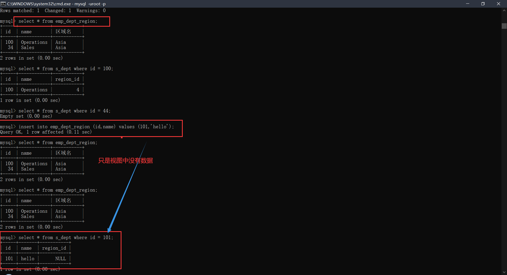

### MySQL - 基础篇 - 第5篇 - 视图和Limit语句

#### 视图

- 数据的基本对象：table、index、view、**函数**、**存储过程**
- 视图的本质是一张**虚拟表**，实际上就是一条简单的或者复杂的SQL，视图就是对查询语句的封装
- 视图的分类
  - 简单视图 - 视图来自于单张表的查询 - 支持DML操作
  - 复杂视图 - 视图来自多张表的关联查询 - 不支持DML操作
- 视图的好处
  - 保证一些数据的安全性
  - 保证数据的清晰的结构，去除一些冗余的不需要的一些数据
  - 封装一些复杂的关联查询 - 多次进行调用

#### 创建视图的语法

```mysql
-- 创建
create view 视图名称 
as select 语句

-- 删除
drop view 视图名称;

-- 查询视图
select * from 视图名称;
```

```mysql
-- 创建视图
create view s_emp_view as select * from s_emp;

-- 查询视图
select * from s_emp_view;

-- 更新原表，是否对视图有影响
update s_emp set first_name = 'demo' where id = 1;
-- 查询视图("镜像")，发现数据改变了
-- 结论1：修改原的表，对视图造成影响

-- 更新视图 - 简单的视图支持DML操作
update s_emp_view set first_name = 'demo2' where id = 1;
-- 查看原来的表
select * from s_emp;
-- 更新视图，原来的表也会产生影响
-- 关于视图的操作，DML操作和对table的操作一摸一样
```

#### with check option

- 禁止更新视图的时候，去update它的来源的原表的条件列

```mysql
-- 删除视图
drop view s_emp_view;
-- 创建视图
create view s_emp_view 
as select * from s_emp where id = 1;
-- 查询视图
mysql> select * from s_emp_view;
+----+-----------+------------+----------+------------+----------+------------+-----------+---------+---------+----------------+
| id | last_name | first_name | userid   | start_date | comments | manager_id | title     | dept_id | salary  | commission_pct |
+----+-----------+------------+----------+------------+----------+------------+-----------+---------+---------+----------------+
|  1 | Velasquez | demo2      | cvelasqu | 1990-05-03 | NULL     |       NULL | President |      50 | 2500.00 |           NULL |
+----+-----------+------------+----------+------------+----------+------------+-----------+---------+---------+----------------+
1 row in set (0.00 sec)
-- 更新视图
update s_emp_view set id = 100 where id = 1;

mysql> select * from s_emp_view;
Empty set (0.00 sec)

-- 此时查询原表 发现视图更新的100 已经更新到原表
mysql> select * from s_emp where id = 100;
+-----+-----------+------------+----------+------------+----------+------------+-----------+---------+---------+----------------+
| id  | last_name | first_name | userid   | start_date | comments | manager_id | title     | dept_id | salary  | commission_pct |
+-----+-----------+------------+----------+------------+----------+------------+-----------+---------+---------+----------------+
| 100 | Velasquez | demo2      | cvelasqu | 1990-05-03 | NULL     |       NULL | President |      50 | 2500.00 |           NULL |
+-----+-----------+------------+----------+------------+----------+------------+-----------+---------+---------+----------------+
1 row in set (0.00 sec)

```

```mysql
-- with check option 一定是配合where语句使用
-- 如果创建视图没有出现where语句，就没有必要出现它

-- 删除视图
drop view s_emp_view;
-- 创建视图
create view s_emp_view 
as select * from s_emp where id = 100 with check option;

-- 如果更新视图的时候，已经有个这一列，机会更新失败
mysql> update s_emp_view set id = 10 where id=100;
ERROR 1062 (23000): Duplicate entry '10' for key 's_emp.PRIMARY'
-- 更新视图 - 禁止更新视图中的视图来源的select语句的条件列
mysql> update s_emp_view set id = 101 where id=100;
ERROR 1369 (HY000): CHECK OPTION failed 'ic_db.s_emp_view'
```

#### 复杂视图

- 复杂视图：**视图源于多表查询，不支持DML操作的**

```mysql
-- 创建视图
create view emp_dept_region
as select d.id,d.name,r.name 区域名 from s_dept d join s_region r on d.region_id = r.id where r.name='Asia';
-- 查询视图
mysql> select * from emp_dept_region;
+----+------------+-----------+
| id | name       | 区域名    |
+----+------------+-----------+
| 44 | Operations | Asia      |
| 34 | Sales      | Asia      |
+----+------------+-----------+
2 rows in set (0.00 sec)
-- 尝试更新视图
update emp_dept_region set id = 100 where id = 44;

-- 更新视图
mysql> update emp_dept_region set id = 100 where id = 44;
Query OK, 1 row affected (0.03 sec)
Rows matched: 1  Changed: 1  Warnings: 0

-- 查询原表格 已经更新
mysql> select * from s_dept where id = 100;
+-----+------------+-----------+
| id  | name       | region_id |
+-----+------------+-----------+
| 100 | Operations |         4 |
+-----+------------+-----------+
1 row in set (0.00 sec)

mysql> select * from s_dept where id = 44;
Empty set (0.00 sec)

-- 对复杂视图增加操作
mysql> insert into emp_dept_region (id,name) values (101,'hello');
Query OK, 1 row affected (0.11 sec)
-- 查询视图 视图中没有数据
mysql> select * from emp_dept_region;
+-----+------------+-----------+
| id  | name       | 区域名    |
+-----+------------+-----------+
| 100 | Operations | Asia      |
|  34 | Sales      | Asia      |
+-----+------------+-----------+
2 rows in set (0.00 sec)
-- 查询原表 原表有数据
mysql> select * from s_dept where id = 101;
+-----+-------+-----------+
| id  | name  | region_id |
+-----+-------+-----------+
| 101 | hello |      NULL |
+-----+-------+-----------+
1 row in set (0.00 sec)
-- 尝试删除 不可删除
mysql> delete  from emp_dept_region;
ERROR 1395 (HY000): Can not delete from join view 'ic_db.emp_dept_region'

```



#### Limit 语句

- 项目中只有涉及到查询的业务 涉及到分页的业务，都需要使用到

```mysql
-- 取前n行
select * from s_emp limit 5;//前5行的数据

-- 跳过前m行，取n行
-- m 从0开始，如果m=0，则直接取前n行
limit m,n 
select * from s_emp limit 0,2;//第一行和第二行
select * from s_emp limit 2,2;//第三行和第四行
select * from s_emp limit 3,2;//第五行和第六行

```

#### Limit 语句性能问题

- SQL优化操作

```mysql
select * from xx where name = 'xxx';//全表扫描.

如果name是一个唯一性的值.
select * from xx where name = 'xxx' limit 1;//避免全表扫描了. 只要找到一个就返回
```

```mysql
-- 偏移量如果过大,会导致limit语句性能极其低下
select * from xxx limit 100000,5;


select * from xxx where id>100000 limit 5;
```

