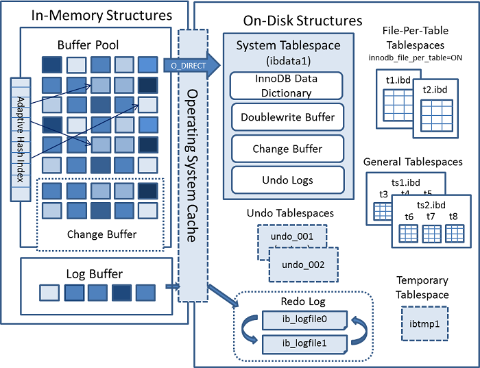
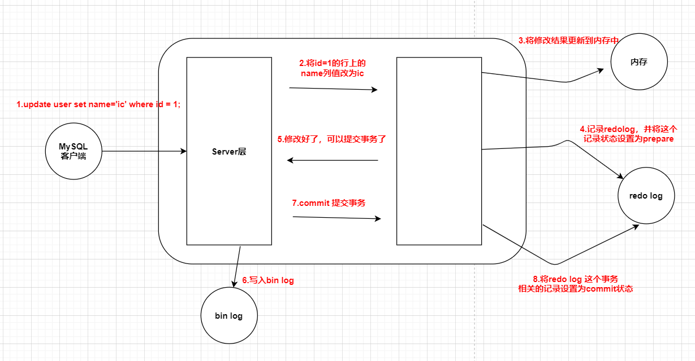

### MySQL - 进阶篇 - 第3篇 - MySQL架构和内部模块

#### 准备工作

**阿里云安装MySQL5.7与配置**

- 安装参考教程： https://www.cnblogs.com/bigbrotherer/p/7241845.html 
- 配置远程访问： https://www.jb51.net/article/121173.htm 

#### MySQL系统架构图

- 模块图

- Connectors：用来支持各种语言和SQL交互，如JDBC
- Management Serveices & Utilities：系统管理和控制工具，包括备份恢复、MySQL复制，集群等
- Connection Pool：连接池，管理需要缓存的资源，包括用户密码权限线程等
- SQL Interface：用来接收用户的SQL语句，返回用户需要的查询结果
- Parser：用来解析SQL语句
- Optimizer：查询优化器
- Cache and Buffer：查询缓存，除了行记录的缓存之外，还有表缓存，Key缓存，权限缓存等
- Pluggable Storage Engines：插件式存储引擎，它提供API给服务册调用，跟具体的文件打交道

#### InnoDB 架构图

- 图片来源： https://dev.mysql.com/doc/refman/5.7/en/innodb-architecture.html 

- **Innodb执行分析**

#### binlog日志

- 内容是追加的

- **作用** 
  - **主从复制** 
  - **数据恢复**（把数据恢复到某一个时间点）
  - 但是需要全量备份

#### 一条查询语句是如何执行的？

- 一条SQL语句是不是只有一种执行方式？
  - 优化SQL
  - 执行路径 Execution Plans
  - 选择一种最优的执行
- 一条查询语句的执行流程

**MySQL采用了半双工的通信方式**

- 在一个连接中，要么是客户端发送数据到服务端，要么是服务端发送数据到客户端。两个动作不能同时发生
- 所以客户端发送SQL语句给服务端的时候（在一次连接里面）数据是不能分成小块发送的，不管SQL语句有多大，都是一次性发送
- 比如使用Mybatis动态SQL生成了一个批量插入语句，或者where 的 in 里面添加的很多的数据，就会查询问题
- 这个时候就必须调整MySQL服务器配置 max_allowed_packet 参数的值（默认是4M。字面意思是最大允许的一次发包大小）
- 另一个方面，对于服务端来说。也是一次性发送所有的数据，不能因为去到了想要的数据就中断操作，这个时候会对网络和内存产生大量的消耗。所以程序里避免不带limit的这种操作，比如一次性把所有的数据全部查出来，一点要先count一下，如果数据量大，可以分批查询。

**查询缓存**

- MySQL内部自带了一个缓存模块，在没有索引的字段上执行两次缓存，时间没有差距，因为MySQL5.7 默认缓存是关闭的
- show variables like 'query_cache%';
- 因为MySQL自带的缓存的应用场景有限，第一个是它要求SQL语句必须一摸一样。第二个要求是表里面的任意一条数据变化的时候，所有的缓存都会失效
- 缓存一般交给ORM框架，或者独立的缓存服务，比如Redis
- 在MySQL8.0 中，查询缓存已经被移除了

**语法解析和预处理（Parser & Pre Processor）**

- **词法解析**
  - 词法解析就是把一个完整的SQL语句打成一个一个的单词
  - 如：select name from user where id = 1;它会打碎成8个符合
- **语法分析**
  - 语法分析会对SQL做一些语法检查，比如单引号有没有闭合，然后根据MySQL定义的语法规则，根据SQL语句生成一个数据结构——解析数（select_lex）
  - 语法分析是一个非常基础的功能，编译器、搜索引擎如果需要识别语句，必须要有词法语法分析功能

- **预处理器**
  - 如果写了一个词法和语法都正确的SQL，但是 **表名或者字段名不存在** ，会在哪里报错？是解析的时候还是执行的时候
  - 如：select * from haxilalal;
  - 实际上还是会在解析的时候报错，解析SQL的欢节里面有个预处理器
  - 它会检查生成的解析树，解决解析器无法解析的语义。比如检查表和列名是否存在，检查名字和别名，保证没有歧义。
  - 预处理之后得到一个新的解析数
- **查询优化（Query Optimizer）与查询执行计划**
  - **什么是优化器**
  - 解析树是一个可以被 **执行器** 认识的数据结构
  - 一条SQL语句可以有多种执行方式，但是一条相同的SQL语句得到的结果是一样的
  - 最后选择执行的SQL语句是由 **查询优化器（Optimizer）** 选择
  - 查询优化器的目的是根据解析树生成不同的执行计划（Execution Plan） ，然后选择一种最优的执行计划，MySQL是基于开销（cost）的优化器。那ex种执行计划开销最小，就用那种
  - 可以使用此命令查看查询的开销：show status like 'Last_query_cost';
  - **优化器可以做什么?**
  - 当多张表进行关联查询的时候，以哪个表的数据作为基本表
  - 有多个索引可以使用的是，选择使用哪个索引
  - 对于查询条件的优化，移除 1=1 恒等式，移除不必要的括号，表达式的计算，子查询和连接查询优化
  - **优化器得到的结果**
  - 优化器会把解析树变成一个 **执行计划（execution_plans）** 执行计划也是一个数据结构
  - 执行计划不一定是最优的执行计划，MySQL也有可能覆盖不到所有的执行计划
  - MySQL提供了一个执行计划的工具。在SQL语句之前执行 explain 就可查看到执行计划的信息
  - explain select name fron user where id = 1;
  - 如果想得到更加具体的信息，可以使用 format=json
  - explain format=json select name fron user where id = 1;
- **存储引擎**
  - **存储引擎的基本介绍**
  - 表在存储数据的时候，还要组织数据的存储结构，这个存储结构就是由我们的存储引擎决定的。所以存储类型也叫表类型
  - **查看存储引擎**
  - show table status from 'ic_db';
  - 在MySQL里面，创建的每一张表都可以指定它的存储引擎。而不是数据库只能使用一个存储引擎。存储引擎是使用表为单位的。创建表之后还可以修改存储引擎
  - 不同的存储引擎存放数据的方式不一样，产生的文件也不一样，innodb是一个，memory没有，myisam是2个
  - 如果数据一致性要求高，需要事务支持，使用innodb
  - 对数据查询多**更新少**，对查询性能要求比较高，可以选择MyISAM
  - 用于查询的临时表，可以选择Memory 
  - **执行引擎（Execution Engine），返回结果**
  - 执行器，或者执行引擎，利用存储引擎提供的API来完成操作，最后把数据返回给客户端。

#### 一条更新操作的执行流程

- **简化流程** 
- 需要执行的SQL：update user set name = 'ic' where id = 1; name原来的值为'hash'
  - 事务开始 ，内存（buffrt pool ）或磁盘（data file）取到这个数据，返回给server的执行器
  - server的执行器修改这一行数据的值为 ic
  - 记录name=hash到undo log
  - 记录name=ic到rodo log
  - 调用存储引擎接口，在内存（Buffer Pool）中修改 name = ic
  - 事务提交

**图解**

**总结**

- 先记录到内存（buffer pool），再写日志文件
- 记录 redo log 分为两个阶段，（prepare和commit）
- 存储引擎和server分别记录不同的日志
- 小记录redo log，再记录binlog

#### SQL语句执行的宏观步骤

> 以下内容来源于： https://www.2cto.com/database/201802/720762.html 

**步骤**

- 语法分析，分析语句的语法是否符合规范，衡量语句中各表达式的意义。

- 语义分析，检查语句中涉及的所有[数据库](https://www.2cto.com/database/)对象是否存在，且用户有相应的权限。

- 视图转换，将涉及视图的查询语句转换为相应的对基表查询语句。

- 表达式转换， 将复杂的 SQL 表达式转换为较简单的等效连接表达式。

- 选择优化器，不同的优化器一般产生不同的“执行计划”

- 选择连接方式， ORACLE 有三种连接方式，对多表连接 ORACLE 可选择适当的连接方式。

- 选择连接顺序， 对多表连接 ORACLE 选择哪一对表先连接，选择这两表中哪个表做为源数据表。

- 选择数据的搜索路径，根据以上条件选择合适的数据搜索路径，如是选用全表搜索还是利用索引或是其他的方式。

- 运行“执行计划”

 **SQL查询处理的步骤序号**

- (8)SELECT 
- (9) DISTINCT 
- (11)<top_specification></top_specification>
- (1) FROM<left_table></left_table>
- (3) <join_type>JOIN<right_table></right_table></join_type>
- (2) ON
- (4) WHERE
- (5) GROUP BY
- (6) WITH {CUBE | ROLLUP}
- (7) HAVING<having_condition></having_condition>
- (10) ORDER BY 

> 以上每个步骤都会产生一个虚拟表，该虚拟表被用作下一个步骤的输入。这些虚拟表对调用者(客户端应用程序或者外部查询)不可用。只有最后一步生成的表才会会给调用者。如果没有在查询中指定某一个子句，将跳过相应的步骤。 

**逻辑查询处理阶段简介**：

- FROM：对FROM子句中的前两个表执行笛卡尔积(交叉联接)，生成虚拟表VT1。
- ON：对VT1应用ON筛选器，只有那些使为真才被插入到TV2。
- OUTER (JOIN):如果指定了OUTER JOIN(相对于CROSS JOIN或INNER JOIN)，保留表中未找到匹配的行将作为外部行添加到VT2，生成TV3。如果FROM子句包含两个以上的表，则对上一个联接生成的结果表和下一个表重复执行步骤1到步骤3，直到处理完所有的表位置。
- WHERE：对TV3应用WHERE筛选器，只有使为true的行才插入TV4。
- GROUP BY：按GROUP BY子句中的列列表对TV4中的行进行分组，生成TV5。
- CUTE|ROLLUP：把超组插入VT5，生成VT6。
- HAVING：对VT6应用HAVING筛选器，只有使为true的组插入到VT7。
- SELECT：处理SELECT列表，产生VT8。
- DISTINCT：将重复的行从VT8中删除，产品VT9。
- ORDER BY：将VT9中的行按ORDER BY子句中的列列表顺序，生成一个游标(VC10)。
- TOP：从VC10的开始处选择指定数量或比例的行，生成表TV11，并返回给调用者。