### MySQL - 进阶篇 - 第5篇 - MySQL事务与锁机制

#### 提出问题

- 事务的四大特性原子性、持久性、隔离性是怎么实现的？一致性是怎么实现的？
- 事务并发带来的问题有哪些？四种事务隔离级别分别是什么？InnoDB中的事务隔离级别和事务并发的问题的关系是怎么样的？

#### 什么是数据库的事务

##### 数据库事务的典型场景

- 比如下单，会操作订单表，资金表，物流表等。这个时候就需要让这些操作都在一个事务里面完成，要么同时成功，要么同时失败。

##### 事务的定义

- 维基百科的定义：事务是数据库管理系统（DBMS）执行过程中的一个逻辑单位，由一个有限的数据库操作序列构成。

##### 有哪些存储引擎支持事务

- InnoDB支持事务

##### 事务的四大特性（ACID）

- Atomicity（原子性）：
  - 对数据库的一系列操作，要么都成功，要么都失败，不可能出现部分成功或者部分失败的情况。
  - 全部成功比较简单，问题是如果前面一个操作都已经成功了，后面的操作失败了，怎么让他们全部失败
  - 这个时候就需要回滚原子性，在InnoDB里面是通过 undo log 来实现的，它记录了数据修改之前的值（逻辑值），一旦发生异常，就可以使用undo log 来实现回滚操作
- Consistency（一致性）：
  - 指的是数据库的完整性约束没有被破坏，事务执行前后都是合法的数据状态，比如主键必须是唯一的，字段长度符合要求
  - 除了数据库自身的完整性约束，还有一个就是用户自定义的完整性
- Isolation（隔离性）：
  - 就是很多个事务，对表或者行的并发操作，应该是透明的，相互不干扰的。
- Durabilty（持久性）：
  - 我们对数据的增加删除修改，只有事务提交，那么结果就是永久性的。
  - 持久性是通过 redo log 实现的。我们在操作数据的时候，会先写到内存的 buffer pool，同时记录redo log ，如果在刷盘之前出现异常，在重启之后就可以读取到 redo log 的内容，写入磁盘，保证数据的持久性
- 实际上还有一个双写缓存的机制，因为存储引擎的页（InnoDB 16kb）和操作系统的页（4kb）大小不一致，一个存储引擎的page需要些4次，如果中间发生异常，或者造成页的数据不可用。所以必须把页的数据备份起来，这个就是双写缓冲（double write buffer）、

##### 数据库为什么会出现事务

- 这条更新语句，有事务吗？
  - update student set sname = 'dom' where id = 1;
- 它开启了一个事务，并且提交了
- 这是开启事务的第一种方式，自动开启和自动提交
- innodb中有一个 autocommit 的参数（分成两个级别 session 和 global）
  - show variables like 'autocommit';
- 它的默认值是 ON。是否自动提交，默认是提交的。
- 手动开启事务的2种方式
  - begin
  - start transaction
- 结束事务
  - commit
  - rollback

#### 事务并发带来的问题

##### 脏读

- 图片来源：咕泡学院 - https://www.gupaoedu.com/ 

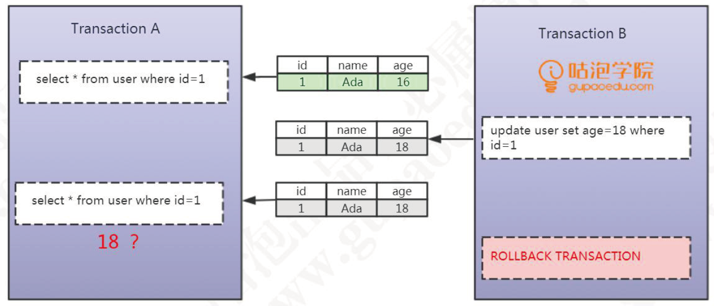

- 在第一个事务里面，它首先通过一个 where id = 1 返回 name = Ada，age=16 的这条数据
- 第二个事务，它同样的是去操作 id = 1 它通过一个 update 的语句，把id = 1 的数据的age改成了18，没有提交
- 这个时候，在第一个事务里面，它再次去执行相同的查询操作，发现数据发生了改变，获取到的数据变成了18，这种在一个事务里面，由于其他的时候修改了数据并且没有提交，而导致了前后两次读取数据不一致的情况，叫做**脏读**

##### 不可重复读

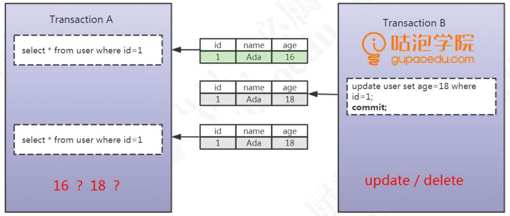

- 同样是两个事务，第一个事务通过id=1，查询到了一条数据。然后在第二个事务里面执行了一个update操作，通过一个commit提交了修改，然后第一个事务读取到了其它事务已经提交的数据导致前后两次读数据不一致的情况，那么这种事务并发带来的问题，叫做不可重复读

##### 幻读

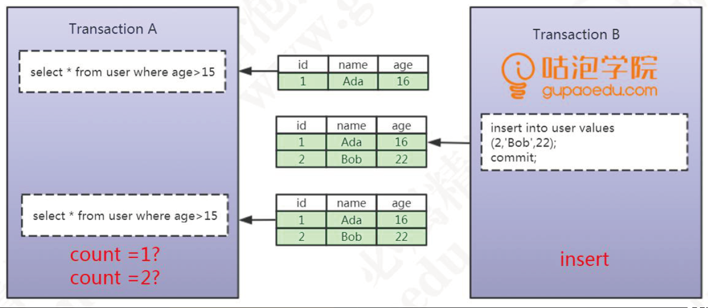

- 在第一个事务里面我们执行了一个范围查询，这个时候满足条件的数据只有一条，在第二个事务里面，它插入了一条数据，并且提交了。重点：插入了一条数据，在第一个事务里面去查询的时候，发现多了一条数据。
- 一个事务前后两次读取数据不一致，是由于其他的事务插入数据造成的，这种情况叫做幻读。

#### SQL92标准

##### Read Uncommitted （未提交读）

- 一个事务可以读取到其他事务未提交的数据，就会出现脏读，素以叫做RU，它没有解决任何问题

##### Read Committed（已提交读）

- 也就是一个事务只能读取其他事务已经提交的数据，不能读取其他事务没有提交的数据，它解决了脏读的问题，但是会出现不可重复读的问题

##### Repeatable Read（可重复读）

- 解决了不可重复读的问题，也就是在同一个事务里面多次读取同样的数据结果是一样的，但是在这个级别下，没有定义解决幻读的问题

##### Serialzable（串行化）

- 在这个隔离级别里面，所有的事务都是串行执行的，也就是对数据的操作需要排队，已经不存在事务的并发操作了，所以它解决了所有的问题

#### MySQL InnoDB 对事务隔离级别的支持程度

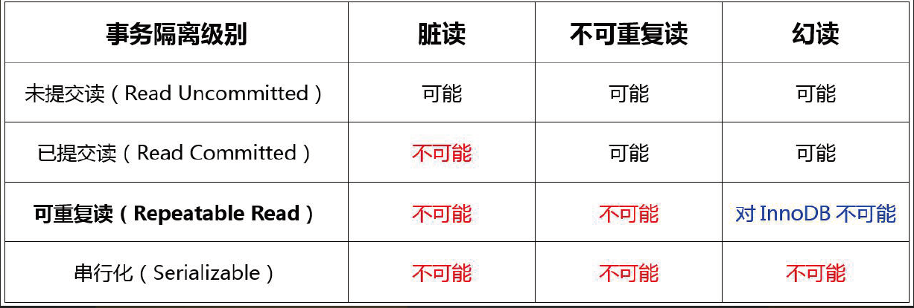

#### 如何需要解决读一致性的问题

##### 解决方案1：LBCC

- 在读取数据之前，对其加锁，阻止其他事务对数据进行修改（LBCC）Lock Based Concurrency Control

##### 解决方案2：MVCC

- 在修改数据的时候，给他建立一个备份或者快照，后面再来读取这个快照就可以了
- 这种方法叫做多版本的并发控制： Multi Version Concurrency Control （MVCC）
- MVCC的核心思想是：我可以查到在我这个事务开始之前已经存在的已经提交的数据，即使是它在后面被修改或者删除了。
- 在我这个事务之后新增的数据，我是查不到的
- InnoDB为每行记录都实现了两个隐藏字段（最后还加上一个ROWID）
- DB_TRX_ID，6字节：插入或者更新行的最后一个事务的ID，事务编号是自动递增的（可以理解为 **创建版本号**，在数据新增或修改为新数据的时候，记录当前事务ID）
- DB_ROLL_PTR，7字节：回滚指针（我们理解为 **删除版本号**，数据被删除或者记录为旧数据的时候，记录当前事务ID）
- 简化版本图示：来自咕泡学院 - 青山老师（ https://www.processon.com/view/link/5d29999ee4b07917e2e09298 ）

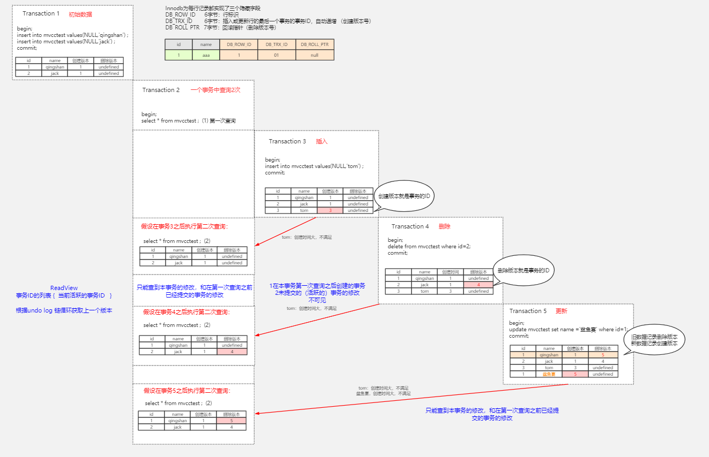

- MVCC的查找规则：只能查找到本事务的修改，和在第一次查询之前已经提交的事务的修改进在第一次查询之前已经提交的事务的修改。

**总结**

- 自己事务未提交的修改，自己可以看到

- 在我第一次查询之前已经提交的数据，我能看到

- 在我第一次查询之后创建的事务，看不到

- 其他的事务未提交的，看不到（活跃的事务 active）

#### MySQL InnoDB 锁的基本类型

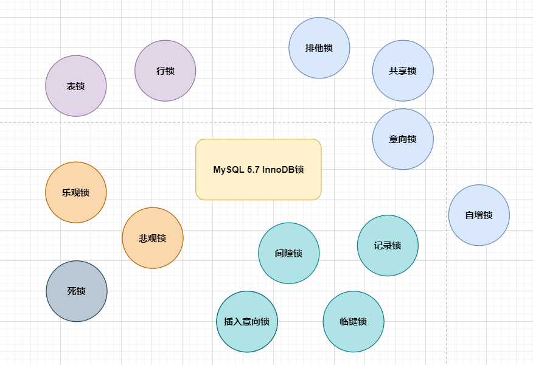

 

##### 行锁和表锁的区别

- 锁定粒度：表锁 > 行锁
- 加锁效率：表锁 < 行锁
- 冲突概率：表锁 < 行锁
- 并发性能：表锁 > 行锁

##### 共享锁

- Shared Locks（共享锁），我们获取了一行数据的读锁之后，可以用来读取数据，所以它也叫读锁。用 select ...... lock in share mode; 的方式手工加上一把读锁
- 释放锁有2种方式，只要事务结束，锁就会自动事务，包括提高事务和结束事务

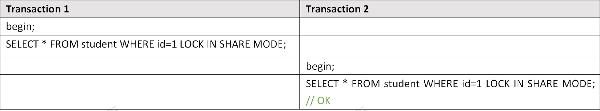

##### 排他锁

- Exclusive Locks（排他锁），它是用来操作数据的，所以又叫做写锁，只要一个事务获取了一行数据的排他锁，其他的事务就不能再获取这一行数据的共享锁和排他锁
- 对于增删改操作，都会默认加上一个排他锁
- 手工加锁，用For update 给一行数据加上一个排他锁，这个无论是在代码中还是操作数据的工具里面，都比较常用。释放锁的方式和之前是一样的

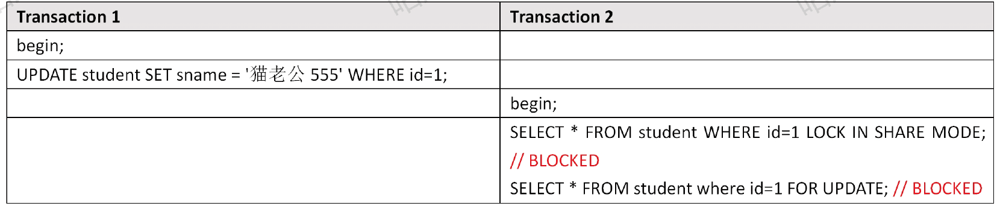

##### 意向锁

- 当我们给一行数据加上共享锁之前，数据库会自动再这张表上面加一个意向共享锁，当我们给一行数据加上排他锁之前，数据库会自动再这张表上加一个意向排他锁
- 反过来说，如果一张表上面至少有一个意向共享锁，说明有其他的事务再给其中的某些数据行加上了共享锁
- 如果一张表上面至少有一个意向排他锁，说明有其他的事务给其中的某些数据行加上了排他锁

#### 行锁的原理

##### 没有索引的表（假设锁住记录）

- 首先有三张表，一张没有索引的t1，一张有主键索引的t2，一张有唯一索引的t3
- 我们先假设InnoDB的锁 **锁住了是一行数据或者一条记录**

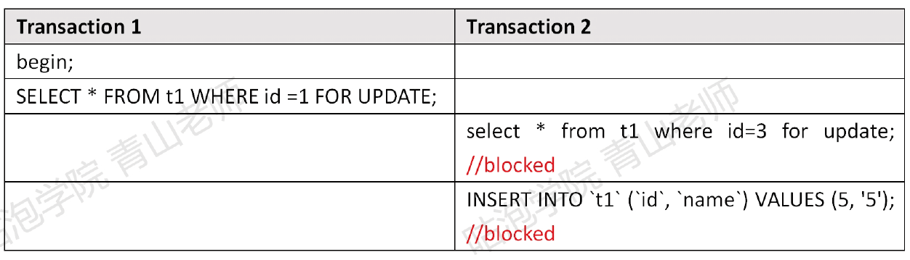

- 现在我们再两个会话里面手工开启两个事务
- 在第一个事务里面，我们通过 where id = 1 所著第一行数据
- 在第二个事务里面，我们尝试给 id = 3 的这一行数据加锁，这个加锁操作被阻塞了
- 再来操作一组不存在的数据，插入 id = 5 它也被阻塞了
- 实际上整张表都被锁住了。所以第一个猜想被推翻 **InnoDB的锁锁住的应该不是 Record**

##### 有主键索引的表

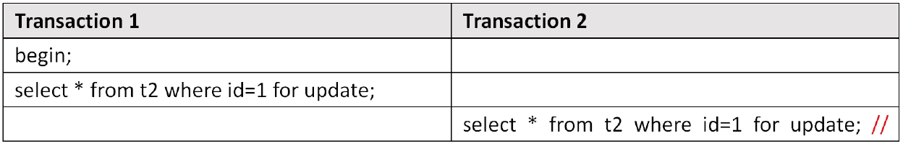

- 第一种情况，使用相同的id值去加锁，冲突；使用不同的id加锁，可以加锁成功，既然不是锁定一行数据，有没有可能**锁住了 id这个字段呢？**

##### 唯一索引（假设锁住字段）

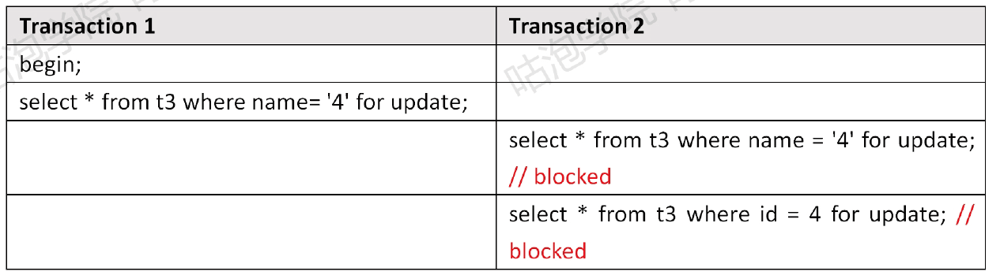

- 在第一个事务里面，我们通过name字段去锁定值是4的这行数据
- 在第二个事务里面，尝试获取一样的排他锁，肯定是失败的
- 这里我们怀疑InnoDB锁住的是字段，所以这次我们换一个字段，用id=4去执行，但是又被阻塞了，所以锁住字段这个猜测也是错误的
- **既然不是锁住的 record 也不是 column **，那么到底锁住的是什么？
- **其实锁的就是索引，InnoDB的行锁，就是通过锁住索引记录来实现的**
- 为什么锁住的是索引？
  - 从 information_schema.innodb_locks 可以看出锁住的是索引

##### Q&A

- 没有索引的时候为什么会锁表？一张表可不可以没有索引？
  - 如果我们定义了主键（Primary key），那么InnoDB会选择主键作为聚集索引
  - 如果没有显示定义主键，则InnoDB会选择第一个不包含NULL值得唯一索引作为主键索引
  - 如果也没有这样得唯一索引，则InnoDB会选择内置的 6 字节长的 ROWID 作为隐藏的聚集索引，它会随着行记录的写入而主键递增
  - 所以，为什么锁表，是因为查询没有使用索引，会进行全表扫描，然后把每一个隐藏的聚集索引都锁住了
- 为什么通过唯一索引给数据行加锁，主键索引也会被锁住？(为什么二级索引会跟主键索引冲突？)
  - 在InnoDB中，当我们使用辅助索引的时候，它是怎么检索数据的？辅助索引的叶子节点存储的是什么内容？
  - 在辅助索引里面，索引存储的是二级索引和主键的值，比如name=4，存储的是name的索引和主键id的值4
  - 而主键索引里面除了索引以外，还存储了完整的数据，所以通过辅助索引锁定一行数据的时候，他会跟我们检索的步骤是一样的，会通过主键索引找到主键索引，然后也别锁定

#### 锁的算法

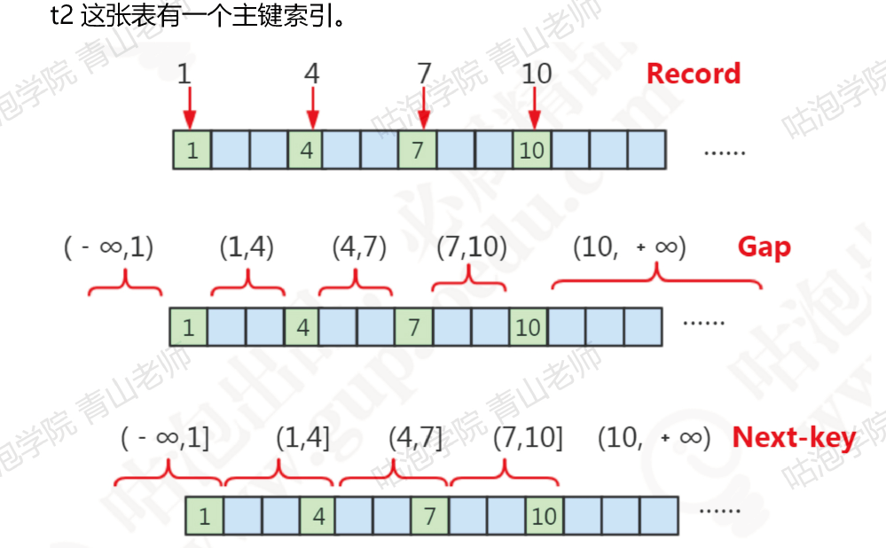

- 这些数据库里面存在的主键值，我们将其叫做 Record 记录，那么这里我们就有4个Record
- 根据主键，这些存在的 Record 隔开的数据在不存在的区间，叫做 Gap，间隙，它是一个 **左开右闭** 的区间
- 间隙（Gap） 连同它左边的记录（Record），我们将其叫做临键的区间，是一个左开有右闭的区间

##### 记录锁

- 当我们对于唯一性索引（包括唯一索引和主键索引）使用等值查询，精准匹配到一条记录的时候，这个时候使用的就是记录锁
- 比如：where id = 1 4 7 10

##### 间隙锁

-  当我们查询的记录不存在，没有命中任何一个 record无论是使用的等值查询还是范围查询的时候，都是使用的间隙锁

- 举个例子：where id > 4 and id < 7 , where id = 6

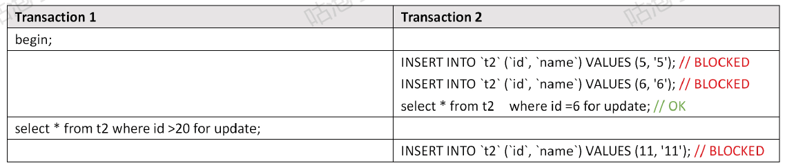

- 注意：间隙锁主要是阻塞插入insert，相同的间隙锁之间不冲突

- Grp Lock 只在RR中存在，如果要关闭间隙锁，就是把事务隔离设置为RC，并且把 innodb_locks_unsafe_for_binlog 设置为ON
- 这种情况下除了外键约束和唯一性检查会加间隙锁，其他情况都不会用间隙锁

##### 临键锁

- 当我们使用了范围查询，不仅仅命中了Record记录，还包含了Gap间隙，在这种情况下，我们就是用的是临键锁，它是MySQL里面默认的行锁算法，相当于记录锁加上间隙锁
- 比如我们使用> 5 、<9  它包含了记录不存在的区间，也包含了一个Record 7

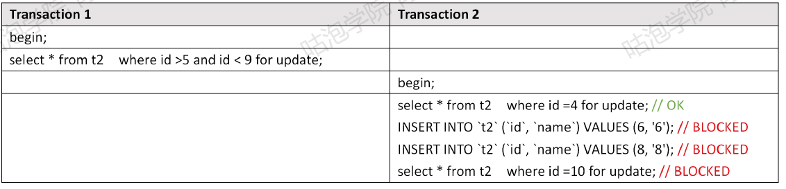

- 临键锁 锁住的是一个 key 的下一个左开右闭的区间

#### 小结

##### Read Uncommitted

- RU隔离级别：不加锁

##### Serializable

- Serualizable 所有的select 语句都会被隐式转化为 select ... in share mode，会和update、delete 互斥

#### Repeatable Read

- RR隔离级别下，普通的select使用 **快照读（snapshot read）**。底层使用 **MVCC** 实现、
- 加锁的 select (select ... in share mode / seletc ... for update) 以及更新操作 update、delete等语句 使用 **当前读（current read）** 底层使用 **记录锁、或者间隙锁**

##### Read Commited

- RC 隔离级别下，普通的 select 都是快照读，使用 **MVCC** 实现
- 加锁的 select **都使用记录锁**，因为没有Gap Lock
- 除了两种特殊的情况——外键约束检查（foreign-key constraint checking） 以及重复键检查（duplicate-key checking）时使用 **间隙锁** 封锁区间
- 所以RC会出现 **幻读**的问题

#### 推荐阅读

- mysql数据库的锁有多少种，怎么编写加锁的sql语句：https://www.cnblogs.com/sessionbest/articles/8689071.html 