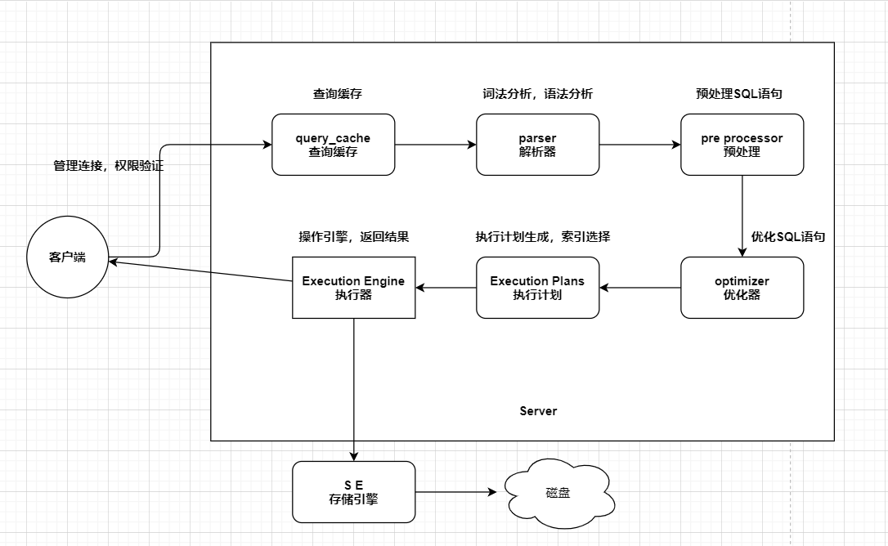
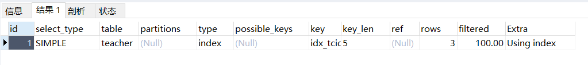
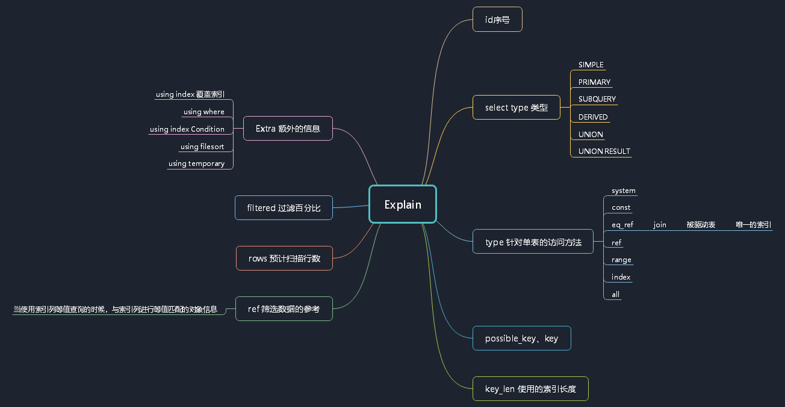
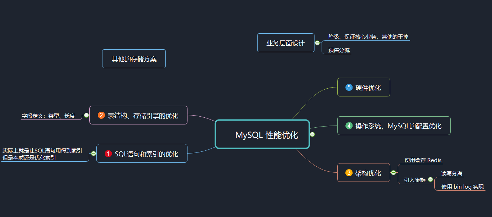

### MySQL - 进阶篇 - 第6篇 - MySQL优化思路和工具

#### MySQL（5.7）执行图



#### 优化思路

##### 两个参数

```mysql
-- 查看数据库的最大连接数
-- 默认连接是151个 最大连接数是十万个
show variables like 'max_connections';
-- 查看数据库连接到超时时间 
-- 默认连接超时时间是 28800 S = 8 H
show variables like 'wait_timeout';
```

##### 客户端优化思路

- 把数据库连接数放大
- 缩小连接超时时间
- 可以使用数据库连接池 - 可以减少连接的创建和销毁

##### MySQL配置优化

- 通过调整一些参数

##### 架构层次优化

- 使用缓存 Redis 等
- 数据库集群
  - 主从数据库
  - 使用数据库中间健
  - 读写分离
- 分库分表
  - **水平分库分表**
  - 如果一张表的数据很多，可以拆分到多张表
  - 《阿里巴巴Java开发手册》中要求单表超过500万数据就要进行分表
  - **垂直分库（按照业务主题来划分的）**
  - 单库（客户相关表、合同相关表、放款相关表、风控相关表）
  - 客户数据库
  - 合同数据库
  - 放款数据库
  - 风控数据库

##### 慢查询日志

```mysql
-- 开启慢查询日志
show variables like 'slow_query%';
-- MySQL 5.7 
-- 通过修改配置文件 - my.cnf - 但是貌似无效
slow_query_log=on
long_query_time=2
slow_query_log_file=/var/lib/mysql/ali-mysql-slow.log

-- MySQL 8.0
Show variables like '%slow_query%'; -- 可以用这个查询所有的变量

-- 第一步
set global log_output='TABLE'; -- 开启慢日志,纪录到 mysql.slow_log 表
set global long_query_time=2; -- 设置超过2秒的查询为慢查询
set global slow_query_log='ON';-- 打开慢日志记录

-- 第二步 运行一下比较慢的功能,执行下面的语句
select convert(sql_text using utf8) sql_text from mysql.slow_log -- 查询慢sql的日志
-- 第三步 记得关上日志
set global slow_query_log='OFF'; -- 如果不用了记得关上日志
```

##### 查看慢查询日志的MySQL自带工具

```shell
-- 找到工具位置
[root@iZ8vb7i30dbuk6b1jof0zpZ mysql]#  whereis mysqldumpslow
mysqldumpslow: /usr/bin/mysqldumpslow /usr/share/man/man1/mysqldumpslow.1.gz
-- mysqldumpslow --help 查看参数信息
[root@iZ8vb7i30dbuk6b1jof0zpZ mysql]# mysqldumpslow --help
Usage: mysqldumpslow [ OPTS... ] [ LOGS... ]

Parse and summarize the MySQL slow query log. Options are

  --verbose    verbose
  --debug      debug
  --help       write this text to standard output

  -v           verbose
  -d           debug
  -s ORDER     what to sort by (al, at, ar, c, l, r, t), 'at' is default
                al: average lock time
                ar: average rows sent
                at: average query time
                 c: count
                 l: lock time
                 r: rows sent
                 t: query time
  -r           reverse the sort order (largest last instead of first)
  -t NUM       just show the top n queries
  -a           don't abstract all numbers to N and strings to 'S'
  -n NUM       abstract numbers with at least n digits within names
  -g PATTERN   grep: only consider stmts that include this string
  -h HOSTNAME  hostname of db server for *-slow.log filename (can be wildcard),
               default is '*', i.e. match all
  -i NAME      name of server instance (if using mysql.server startup script)
  -l           don't subtract lock time from total time

[root@iZ8vb7i30dbuk6b1jof0zpZ mysql]#
```

##### 服务端的一些监控命令

```mysql
-- 查看服务端的一些状态
SHOW GLOBAL STATUS

-- 查看服务端的线程
SHOW PROCESSLIST -- 连接的线程

-- 查看搜索引擎的状态
SHOW ENGINE INNODB STATUS
```

##### Explain执行计划

```mysql
DROP TABLE IF EXISTS course;
CREATE TABLE `course` (
    `cid` int(3) DEFAULT NULL,
    `cname` varchar(20) DEFAULT NULL,
    `tid` int(3) DEFAULT NULL
) ENGINE=InnoDB DEFAULT CHARSET=utf8mb4;

DROP TABLE IF EXISTS teacher;
CREATE TABLE `teacher` (
    `tid` int(3) DEFAULT NULL,
    `tname` varchar(20) DEFAULT NULL,
    `tcid` int(3) DEFAULT NULL
) ENGINE=InnoDB DEFAULT CHARSET=utf8mb4;

DROP TABLE IF EXISTS teacher_contact;
CREATE TABLE `teacher_contact` (
    `tcid` int(3) DEFAULT NULL,
    `phone` varchar(200) DEFAULT NULL
) ENGINE=InnoDB DEFAULT CHARSET=utf8mb4;

INSERT INTO `course` VALUES ('1', 'mysql', '1');
INSERT INTO `course` VALUES ('2', 'jvm', '1');
INSERT INTO `course` VALUES ('3', 'juc', '2');
INSERT INTO `course` VALUES ('4', 'spring', '3');

INSERT INTO `teacher` VALUES ('1', 'qingshan', '1');
INSERT INTO `teacher` VALUES ('2', 'jack', '2');
INSERT INTO `teacher` VALUES ('3', 'mic', '3');

INSERT INTO `teacher_contact` VALUES ('1', '13688888888');
INSERT INTO `teacher_contact` VALUES ('2', '18166669999');
INSERT INTO `teacher_contact` VALUES ('3', '17722225555');

-- 查询mysql课程的老师手机号
EXPLAIN SELECT tc.phone
FROM teacher_contact tc
WHERE tcid = (
    SELECT tcid
    FROM teacher t
    WHERE t.tid = (
        SELECT c.tid
        FROM course c
        WHERE c.cname = 'mysql'
    )
);


-- 查询ID为1或2的老师教授的课程
EXPLAIN SELECT cr.cname
FROM (
    SELECT * FROM course WHERE tid = 1
    UNION
    SELECT * FROM course WHERE tid = 2
) cr;


-- ALTER TABLE teacher_contact DROP PRIMARY KEY;
ALTER TABLE teacher_contact ADD PRIMARY KEY(tcid); 


-- ALTER TABLE teacher DROP INDEX idx_tcid;
ALTER TABLE teacher ADD INDEX idx_tcid (tcid);


explain SELECT * FROM teacher where tcid = 3;

explain select t.tcid from teacher t,teacher_contact tc where t.tcid = tc.tcid;3

-- ALTER TABLE teacher DROP INDEX idx_tid;
ALTER TABLE teacher ADD INDEX idx_tid (tid);

EXPLAIN SELECT * FROM teacher t WHERE t.tid <3;
-- 或
EXPLAIN SELECT * FROM teacher t WHERE tid BETWEEN 1 AND 2;
-- 或
EXPLAIN SELECT * FROM teacher_contact t WHERE tcid in (1,2,3);

EXPLAIN SELECT tid FROM teacher;

EXPLAIN select 1 from dual where 1=1

ALTER TABLE user_innodb DROP INDEX comidx_name_phone;
ALTER TABLE user_innodb add INDEX comidx_name_phone (name,phone);

explain select phone from user_innodb where phone='126';

EXPLAIN SELECT tid FROM teacher ;

EXPLAIN select * from user_innodb where phone ='13866667777';

EXPLAIN select * from user_innodb where name ='青山' order by id; 

EXPLAIN select DISTINCT(tid) from teacher t
EXPLAIN select tname from teacher group by tname;
EXPLAIN select t.tid from teacher t join course c on t.tid = c.tid group by t.tid;
```

- 执行以下语句 ：EXPLAIN SELECT count(*) FROM teacher;



- id是查询序列的编号，每张表都是单独访问的， 一个 select 就会有一个序号，如果id值不同的时候，先查id值大的（先大后小）只有拿到了内层的结果之后才能进行外层的查询（如果id相同，就从上到下进行查询）
- 在连接查询中，先查询的的叫做驱动表，后查询的叫做被驱动表，我们肯定要把小表放在前面查询，因为它的中间结果最少
- 如果id既有不同也有相同，就是id不同的**先大后小**，id相同的 **从上往下**



- 表的id。是表的访问顺序
  - 先大后小
  - 从上往下
- ref 是非唯一性的索引
- range 索引的范围扫描
- index = full index scan
- **select_type**
- PRIMARY：子查询SQL语句中的**主查询**，也就是最外面的那层查询
- SUBQUERY：子查询中所有的 **内层查询** 都是SUBQUERY的
- DERIVED：派生查询，表示在得到最终查询结果之前，会用到临时表
- 在查询的时候，需要做去重、排序之类的工作的时候，可能会用到临时表

##### MySQL优化顺序图



- 字段定义原则：使用可以正确存储数据的小数据类型，为每一列选择合适的字段类型
- 整数类型：选择合适的
- 字符类型：变长使用varchar。确定是固定的，就使用 char
- 不要使用外键，触发器，视图
  - 降低了可读性
  - 影响数据库的性能，应该把计算的任务交给程序，数据库专心做存储
  - 数据的完整性应该在程序中检查
- 大文件存储，只需要存储路径即可，数据库不存储其值
- 表拆分或者字段冗余
  - 把不常用的字段拆分出去，避免列数过多和数据量大
- **对于面试中问到：你会从哪些维度来优化数据库**
  - SQL与索引
  - 存储引擎与表结构
  - 数据库架构
  - MySQL配置
  - 硬件与操作系统
  - 业务层进行优化：关闭非核心业务、预售分流、MQ削峰

#### SQL优化问题案例

##### 案例1

- 题目来源： https://gper.club/answers/7e7e7f7ff0g59gc7g6e 

- **Q：**
  - 有个任务查询的接口中有一条主SQL，（由于实际SQL无法从公司电脑拷出，只能描述了）有三张表A、B、C表，A表80个字段、B表20个字段，C表30个字段带一个CLOB类型字段1M大小且和A、B表是多对一的关系，A、B表是一对一关系，实际写的SQL是三张表内连接，且每张表都有输出内容和查询条件。生产环境中性能很慢且数据库服务器内存利用率居高不下，区分度较高的字段都已加相关索引，现象就是关联出的数据读到内存有10条，实际输出1条。目前性能还是很低。 
- **A：**
  - **分析查询的基本情况**
  - 分析都表结构，字段的索引情况、每张表的数据量、查询的业务含义，这个非常重要，因为有时候你发现SQL根本没有必要这么去写，或者表设计是有问题的。
  - **找出慢的原因**
  - 查看执行计划，分析SQL的执行情况，了解表的访问顺序、访问类型、索引、扫描行 等信息
  - 如果整体的时间很长，不确定 哪一个因素影响做最大，通过条件的增减，顺序的调整，找出引起查询慢的主要原因，不断地进行尝试
  - 然后找到原因：比如是没有走索引地、还是关联查询引起的、还是order by 引起地
  - **找到原因之后，对症下药**
  - 创建索引或者联合索引
  - 改写SQL，这里需要平时积累经验
    - 使用小表驱动大表
    - 用join来代替子查询
    - not exist转换为 left join is null
    - or 改成 union
    - 使用 union all 替代 union 如果结果集允许重复地话
    - 大偏移地 limit ，先过滤再排序，
    - 查找指定行limit，可以使用where直接定位到目标位置，再进行 limit
    - 如果SQL本身解决不了问题，就要上升到表结构和架构了
  - 表结构（冗余、拆分、not null等）、架构优化
  - 业务层的优化，查询条件是否有必要