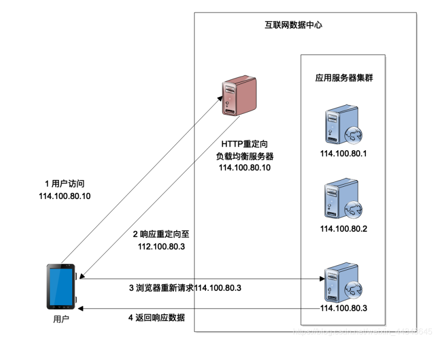
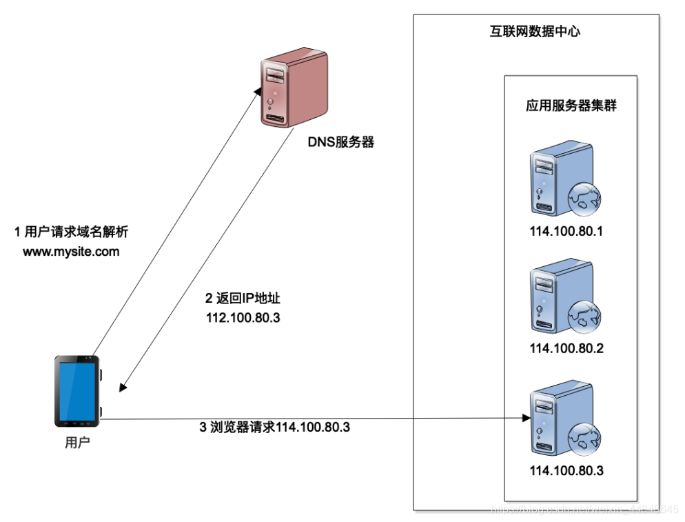

### 简单实现负载均衡

负载均衡是互联网系统架构中必不可少的一个技术。通过负载均衡，可以将高并发的用户请求分发到多台应用服务器组成的一个服务器集群上，利用更多的服务器资源处理高并发下的计算压力。

简单实现一个负载均衡机制：

#### 1、HTTP 重定向负载均衡（简单实现）

HTTP 重定向负载均衡是一种比较简单的负载均衡技术实现。来自用户的 HTTP 请求到达负载均衡服务器以后，负载均衡服务器根据某种负载均衡算法（如随机选择、轮询等）计算得到一个应用服务器的地址，通过 HTTP 状态码 302 重定向响应，将新的 IP 地址发送给用户浏览器，用户浏览器收到重定向响应以后，重新发送请求到真正的应用服务器，以此来实现负载均衡。



这种负载均衡实现方法比较简单，如果是用 Java 开发的话，只需要**在 Servlet 代码中调用响应重定向方法就可以了**。在简化的情况下，只需要不到十行代码就可以实现一个 HTTP重定向负载均衡服务器。

```java
    @Override
    protected void doGet(HttpServletRequest request, HttpServletResponse response) throws ServletException, IOException {
        // 获取客户端请求的 URL
        String clientRequestURL = request.getRequestURL().toString();
        // 根据某些条件选择目标服务器或资源
        String targetURL;
        if (someCondition()) {
            targetURL = "http://server1.example.com" + request.getServletPath();
        } else {
            targetURL = "http://server2.example.com" + request.getServletPath();
        }
        // 执行重定向
        response.sendRedirect(targetURL);
    }
```


HTTP 重定向负载均衡的优点是设计比较简单，但是它的缺点也比较明显，**一方面用户完成一次访问，就需要请求两次数据中心**，一次请求**负载均衡服务器**，一次是**请求应用服务器**，请求处理性能会受很大的影响。

另一个问题是**因为响应要重定向到真正的应用服务器，所以需要把应用服务器的 IP 地址暴露给外部用户**，这样可能会带来安全性的问题。负载均衡服务器通常不部署应用代码，也会关闭不必要的访问端口，设置比较严格的防火墙权限，通常安全性更好一点。因此，一个互联网系统通常只将负载均衡服务器的 IP 地址对外暴露，供用户访问，而应用服务器则只是用内网 IP，外部访问者无法直接连接应用服务器。但是使用 HTTP 重定向负载均衡，应用服务器不得不使用公网 IP，外部访问者可以直接连接到应用服务器，系统的安全性会降低。

因此 HTTP 重定向负载均衡在实践中很少使用。一般都是DNS负载均衡，加上HTTP内部的负载均衡来实现的。

#### 2、 DNS 负载均衡

另一种实现负载均衡的技术方案是 DNS 负载均衡。我们知道浏览器或者 App 应用访问数据中心的时候，通常是用域名进行访问，HTTP 协议则必须知道 IP 地址才能建立通信连接，那么域名是如何转换成 IP 地址的呢？就是通过 DNS 服务器来完成。当用户从浏览器发起 HTTP 请求的时候，首先要到 DNS 域名服务器进行域名解析，解析得到 IP 地址以后，用户才能够根据 IP 地址建立 HTTP 连接，访问真正的数据中心的应用服务器，这时候就可以在 DNS 域名解析的时候进行负载均衡，也就是说，不同的用户进行域名解析的时候，返回不同的 IP 地址，从而实现负载均衡。



从上面的架构图可以看到，DNS 负载均衡和 HTTP 重定向负载均衡似乎很像。那么 DNS会不会有性能问题和安全性问题呢？

首先和 HTTP 重定向不同，用户不需要每次请求都进行 DNS 域名解析，第一次解析后，域名缓存在本机，后面较长一段时间都不会再进行域名解析了，因此性能方面不会是问题。

其次，如果如图中所示，域名解析直接得到应用服务器的 IP 地址，确实会存在安全性问题。但是大型互联网应用通常并不直接通过 DNS 解析得到应用服务器 IP 地址，而是解析得到负载均衡服务器的 IP 地址。也就是说，**大型网互联网应用需要两次负载均衡，一次通过 DNS 负载均衡，用户请求访问数据中心负载均衡服务器集群的某台机器，然后这台负载均衡服务器再进行一次负载均衡**，将用户请求分发到应用服务器集群的某台服务器上。通过这种方式，应用服务器不需要用公网 IP 将自己暴露给外部访问者，避免了安全性问题。

DNS 域名解析是域名服务商提供的一项基本服务，几乎所有的域名服务商都支持域名解析负载均衡，只需要在域名服务商的服务控制台进行一下配置，不需要开发代码进行部署，就可以拥有 DNS 负载均衡服务了。目前大型的互联网应用，淘宝、百度、Google 等全部使用 DNS 负载均衡。比如用不同的电脑 ping www.baidu.com 就可以看到，不同电脑得到的 IP 地址是不同的。

#### FYI：负载均衡策略

- **轮询**：按顺序依次将请求分发到不同的服务器。
- **随机**：随机选择一个服务器来处理请求。
- **加权**：根据每个服务器的负载能力来分配请求。