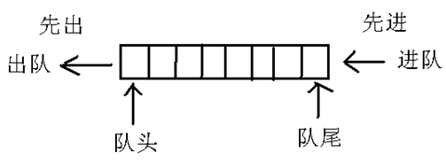
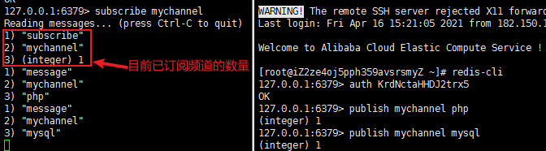
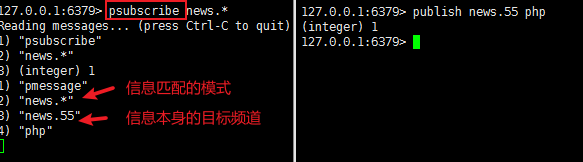
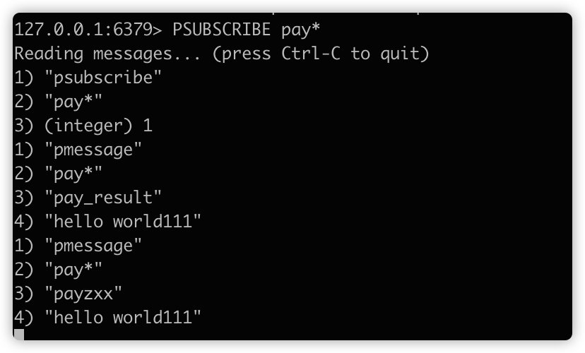
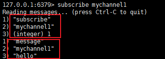
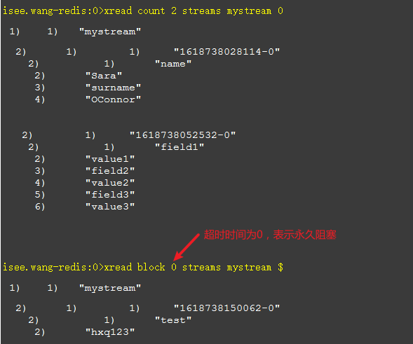
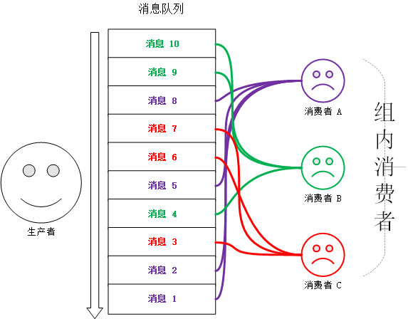
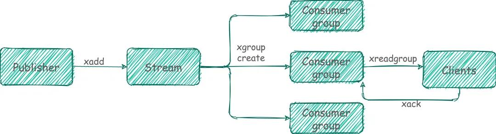

## **Redis实现消息队列**

## **消息队列（Message Queue）**

### 1.  **什么是消息队列**？

消息队列（Message Queue）是一种**应用间的通信方式**，**消息发送后可以立即返回**，由消息系统来确保消息的可靠传递。消息发布者只管把消息发布到 MQ 中而不用管谁来取，消息使用者只管从 MQ 中取消息而不管是谁发布的。这样发布者和使用者都不用知道对方的存在。

这个其实跟设计模式中的观察者模式有点像，参考文章[《设计模式-观察者模式(observer)》](https://www.cnblogs.com/hld123/p/12980402.html)。被观察者可以称之为事件对象，有新的事件发布,会被观察者监听到。


### 2.  消息队列的特点

1）三个角色：生产者、消费者、消息处理中心

把数据放到消息队列的叫做**生产者**

从消息队列里边取数据的叫做**消费者**

​    消息处理中心指的就是消息队列

2）异步处理模式

生产者将消息发送到一条虚拟的通道（消息队列）上，而无须等待响应。消费者则订阅或是监听该通道，取出消息。两者互不干扰，甚至都不需要同时在线，也就是我们说的松耦合。

3）可靠性

消息要可以保证**不丢失**、**至少被消费一次**、有时可能还需要**顺序性的保证**

### 3. 为什么要使用消息队列？

消息队列是分布式系统中重要的组件，使用消息队列主要是为了通过异步处理提高系统性能和流量削峰、降低系统耦合性。

比如订单系统，与其关联的可能就有商品系统、库存系统、收件地址系统，用户系统、短信（邮件/微信）通知系统，日志记录系统等等。如果用户下单后，要把这些业务以同步的方式执行，那么调用链可能会很长，不利于高并发的处理。就需要把短信通知、日志记录这种与订单系统关联并不是那么紧密，实时性要求那么高的业务，放到消息队列中去异步实现。

当然，还需要注意的是，比如商品秒杀，用户下单后，虽然某些业务可以通过投入消息队列，立即返回。仍需考虑实际情况，不能直接告诉用户秒杀成功，还需要消费者处理完消息后，通过异步回调通知服务器，判断处理成功后再通知用户，避免带来不必要的纠纷。

## **Redis实现消息队列**

redis的设计是用来做缓存的，它是一个内存数据库，不过因为其某些特性适合用来充当队列(Redis的List数据结构比较适合做MQ)，所以也多被用于做简单的mq。它有几个阻塞式的API可以使用，正是这些阻塞式的API让他有做消息队列的能力。

redis实现消息队列有三种方式：**List、发布订阅（pub/sub）、Stream**

### **一、生产消费模式 - List实现消息队列（PUSH/POP）**

生产消费模式会让一个或多个客户端监听消息队列，一旦消息到达，消费者马上消费，谁先抢到算谁的。如果队列中没有消息，消费者会继续监听。



Redis 的List（列表）是简单的字符串列表，按照插入顺序排序。可以在头部left和尾部right添加新的元素。List提供了push和pop命令，遵循着先入先出FIFO的原则。

#### 方案一：LPUSH + RPOP或者 RPUSH+LPOP

LPUSH在头部（List的左边）添加一个新的元素并返回List长度，充当消息队列中的生产者。RPOP在尾部（List的右边）删除一个元素并返回该元素的值，充当消息队列中的消费者。

基于List类型的插入删除元素操作实现，就是一个典型的先进先出队列的解决方案。

优点：

1）List类型是基于链表实现，插入删除元素时间复杂度仅为常量级，有先进先出（FIFO）的特点来保证数据的顺序

2）Redis支持消息持久化，在服务端数据是安全的

缺点：

1）**点对点的模式****- Point-to-Point(P2P)**

因为 Redis 单线程的特点，所以在消费数据时，一条消息只能被一个消费者接收，消费者完全靠手速来获取，不支持分组消费，是一种比较简陋的消息队列。

2）性能风险点

第一点：消费者如果想要及时的处理数据，就要在程序中写个类似 while(true) 这样的逻辑，不停地去调用 RPOP 或 LPOP 命令，查看列表中是否有待处理的消息。这就会给消费者程序带来些不必要的性能损失。


```plain
1 <?php
2 
3 while(true){
4   $result = $redis->lpop("queue");
5   if($result){
6     $data = json_decode($result, true);
7   }
8 }
```

第二点：如果队列空了，消费者会陷入pop死循环，即使没有数据也不会停止。空轮询不但消耗消费者的CPU资源还会增加Redis的访问压力，影响Redis的性能。

3）没有数据权重的概念，只能先进先出

4）客户端数据不安全

消费确认机制（ACK）实现麻烦加之不能重复消费，一旦消费，数据就会删除，这意味着该元素只存在于客户端的上下文中，导致客户端数据是不安全的，当客户端宕机、网络断开会出现数据丢失，也不能实现广播模式。

#### 方案二：LPUSH/BRPOP

此方案是在方案一上针对队列没有元素时造成服务器资源浪费进行的优化方案，使用了BRPOP做消费者，BRPOP是阻塞的。消费者可以设置数据不存在时的阻塞时间，来减少不必要的轮询。

>  BRPOP是一个阻塞版本的RPOP命令，用于从列表的右侧（尾部）移除并获取一个元素。**如果列表为空，该命令将阻塞连接，直到等待超时或找到可用元素。**

关于brpop/blpop有几点需要说明：

BRPOP LIST1 LIST2 .. LISTN TIMEOUT

第一点：使用brpop和blpop实现阻塞读取

由于需要一直调用rpop/lpop才可以实现不停的监听且消费消息，为解决这个问题，Redis提供了阻塞命令brpop/blpop。使用brpop会阻塞队列，而且每次只会弹出一个消息，如果没有消息则会阻塞。

第二点：减小Redis的压力

生产者从列表左侧lpush加入消息到队列，消费者使用brpop命令从列表右侧弹出消息并设置超时(阻塞)时间，如果列表中没有消息则一直阻塞直到超时。当超时时间设置为0时刻,则无限等待，一直阻塞直到弹出消息。这样做的目的在于减小Redis的压力。

第三点：注意异常的处理

对于Redis来说提供了blpop/brpop阻塞读，阻塞读在队列没有数据时会立即进入休眠状态，一旦数据到来则立即被唤醒，消息的延迟几乎为零。需**要注意的是如果线程一直阻塞在那里，连接就会被服务器主动断开来减少资源占用，这时blpop/brpop会抛出异常，所以编写消费端时需要注意异常的处理。**

#### 实现方案三：LPUSH+LRANGE+RPOP

此方案是在方案一上针对客户端数据安全进行的优化方案，使用LRANGE首先对队列元素只做读取不做消费，在客户端消费完成后，再使用RPOP对服务端进行消费。

由于LRANGE不是阻塞的就又回到了方案二解决的资源浪费问题上了，无法减少不必要的轮询。

还存在重复执行的问题，由于先读再消费，在消费者宕机重启后会再次读到没有确认消费的但是已经在消费者处理过的元素，就有了重复消费的风险。真的是绕啊。

#### 方案四：LPUSH+BRPOPLPUSH+LREM

该方案也是对客户端数据安全进行的优化方案，是一种安全的队列，虽然也会存在重复消费的风险，但是元素队列的操作都是在服务端进行的，问题发生的概率会大大降低。

说明：使用 RPOPLPUSH 获取消息时，RPOPLPUSH 会把消息返给客户端，同时把该消息放入一个备份消息列表，并且这个过程是原子的，可以保证消息的安全，当客户端成功的处理了消息后，就可以把此消息从备份列表中移除了。

这个方案当然也不是完美的，还是存在客户端宕机的情况，正在处理中的队列存在长期不消费的消息怎么办？

可以再添加一台客户端来监控长期不消费的消息，重新将消息打回待消费的队列，这个可以使用循环队列的模式来实现。

#### 总结：

1）Redis中实现生产者和消费者模型，可使用LPUSH和RPOP来实现该功能。不过当列表为空时消费者就需要轮询来获取消息，这样会增加Redis的访问压力和消费者的CPU时间，另外很多访问也是无用的。为此Redis提供了阻塞式访问BRPOP和BLPOP命令。同时Redis会为所有阻塞的消费者以先后顺序排序。

2）使用Redis的列表来实现一个任务队列，开启两个程序，一个作为生产者使用LPUSH写队列，一个作为消费者使用RPOP读队列。由于消费者并不知道什么时候会有消息过来，所以消费者需要一直循环读取数据。使用BRPOP改进后，消费者不会一直循环读取，而是一直阻塞直到等待超时或者有消息过来时才读取。

### **二、发布订阅模式（PUB/SUB）- 消息多播**

Redis 通过 PUBLISH 、 SUBSCRIBE 、PSUBSCRIBE 等命令实现了**订阅与发布模式**， 这个功能提供两种信息机制， **分别是订阅/发布到频道和订阅/发布到模式。**

- **PUBLISH**：用于将消息发布到特定的主题。允许发布者将消息发送到一组订阅者中
- **SUBSCRIBE**：用于订阅一个或多个主题，并在发布者发布消息时收到消息。
- **UNSUBSCRIBE**：用于停止监听一个或多个主题。
- **PSUBSCRIBE**：用于使用模式订阅主题，它允许订阅者使用模式来识别特定消息，而不必直接订阅每个消息。
- **PUNSUBSCRIBE**：用于停止使用模式订阅主题。

**发布订阅模式是一个或多个客户端订阅消息频道，只要发布者发布消息，所有订阅者都能收到消息，订阅者都是平等的。**

此模式中生产者producer和消费者consumer之间的关系是一对多的，也就是一条消息会被多个消费者所消费，当只有一个消费者时可视为一对一的消息队列。

订阅：


发布：


1. 订阅/发布到频道



2. 订阅/发布到模式

可以理解为是一个类似正则匹配的 Key，只是个可以匹配给定模式的频道。这样就不需要显式地去订阅多个名称了，可以通过模式订阅这种方式，一次性关注多个频道



> PSUBSCRIBE简单来说，客户端可以订阅一个带 `*` 号的模式，如果某些频道的名字与这个模式匹配，那么当其他客户端发送给消息给这些频道时，订阅这个模式的客户端也将会到收到消息。
>
> 使用 Redis 订阅模式，我们需要使用一个新的指令 **psubscribe**。
>
> 我们执行下面这个指令：
>
> ```undefined
> psubscribe pay.*
> ```
>
> 那么一旦有其他客户端往 **pay** 开头的频道，比如 `pay_result`、`pay_xxx`，我们都可以收到消息。
>
> 

我们可以看到订阅的客户端每次可以收到一个 3 个参数的消息，分别为：消息的种类、始发频道的名称、实际的消息




```plain
1 127.0.0.1:6379> psubscribe news.*
2 Reading messages... (press Ctrl-C to quit)
3 1) "psubscribe"    # 返回值的类型：显示订阅成功
4 2) "news.*"        # 订阅的模式
5 3) (integer) 1     # 目前已订阅的模式的数量
6 1) "pmessage"      # 返回值的类型：信息
7 2) "news.*"        # 信息匹配的模式
8 3) "news.55"       # 信息本身的目标频道
9 4) "php"           # 信息的内容
```

**Redis 发布订阅 (pub/sub) 的缺点：**
     **消息无法持久化**，如果出现网络断开、Redis 宕机等，消息就会被丢弃。而**且也没有 Ack 机制来保证数据的可靠性，假设一个消费者都没有，那消息就直接被丢弃了。**

#### 订阅机制实现原理

Redis是使用C实现的，通过分析 Redis 源码里的 pubsub.c 文件，了解发布和订阅机制的底层实现，来加深对 Redis 的理解。

Redis 通过 PUBLISH 、SUBSCRIBE 和 PSUBSCRIBE 等命令实现发布和订阅功能。

通过 SUBSCRIBE 命令订阅某频道后，redis-server 里维护了一个字典，字典的键就是一个个 channel ，而字典的值则是一个链表，链表中保存了所有订阅这个 channel 的客户端。SUBSCRIBE 命令的关键，就是将客户端添加到给定 channel 的订阅链表中。

通过 PUBLISH 命令向订阅者发送消息，`redis-server `会使用给定的频道作为键，在它所维护的 channel 字典中查找记录了订阅这个频道的所有客户端的链表，遍历这个链表，将消息发布给所有订阅者。

Pub/Sub 从字面上理解就是发布（Publish）与订阅（Subscribe），在Redis中，你可以设定对某一个 key值进行消息发布及消息订阅，当一个key值上进行了消息发布后，所有订阅它的客户端都会收到相应的消息。这一功能最明显的用法就是用作实时消息系统，比如普通的即时聊天，群聊等功能。

使用场景：

Redis的Pub/Sub系统可以构建实时的消息系统，比如很多用Pub/Sub构建的实时聊天系统的例子。

### **三、 Stream**

Redis 5.0 版本新增了一个更强大的数据结构—Stream。

1） 它提供了**消息的持久化和主备复制功能**，可以让任何客户端访问任何时刻的数据，并且能记住每一个客户端的访问位置，还能保证消息不丢失。

2） 它就像是个仅追加内容的消息链表，把所有加入的消息都串起来，每个消息都有一个唯一的 ID 和对应的内容。而且消息是持久化的。

XADD key ID field value [field value ...]  - 添加消息到末尾

XREAD [COUNT count] [BLOCK milliseconds] STREAMS key [key ...] id [id ...]

1、独立消费



**$** 这个特殊的 ID 意思是 XREAD 应该使用流 mystream 已经存储的最大 ID 作为最后一个 ID。以便我们仅接收从我们开始监听时间以后的新消息。

2、分组消费

xread 虽然可以扇形分发到 N 个客户端，然而，在某些问题中，我们想要做的不是向许多客户端提供相同的消息流，而是从同一流向许多客户端提供不同的消息子集。比如下图这样，三个消费者按轮训的方式去消费一个 Stream。



1）Redis Stream 借鉴了很多 Kafka 的设计。

Consumer Group：有了消费组的概念，每个消费组状态独立，互不影响，一个消费组可以有多个消费者

last_delivered_id ：每个消费组会有个游标 last_delivered_id 在数组之上往前移动，表示当前消费组已经消费到哪条消息了

pending_ids ：消费者的状态变量，作用是维护消费者的未确认的 id。pending_ids 记录了当前已经被客户端读取的消息，但是还没有 ack。如果客户端没有 ack，这个变量里面的消息 ID 会越来越多，一旦某个消息被 ack，它就开始减少。这个 pending_ids 变量在 Redis 官方被称之为 PEL，也就是 Pending Entries List，这是一个很核心的数据结构，它用来确保客户端至少消费了消息一次，而不会在网络传输的中途丢失了没处理。

2） 分区

Stream 不像 Kafka 那样有分区的概念，如果想实现类似分区的功能，就要在客户端使用一定的策略将消息写到不同的 Stream。

xgroup create：创建消费者组

xgreadgroup：读取消费组中的消息


xack：ack 掉指定消息



3、按消费组消费

1）创建消费组：

XGROUP [CREATE key groupname id-or-$] [SETID key groupname id-or-$] [DESTROY key groupname] [DELCONSUMER key groupname consumername]

说明：

key ：队列名称，如果不存在就创建

groupname ：组名。

$ ： 表示从尾部开始消费，只接受新消息，当前 Stream 消息会全部忽略。

2）读取消费组中的消息

XREADGROUP GROUP group consumer [COUNT count] [BLOCK milliseconds] [NOACK] STREAMS key [key ...] ID [ID ...]

比如：XREADGROUP GROUP consumer-group-name consumer-name COUNT 1 STREAMS mystream >

### 总结：

1）Redis作为消息队列使用，redis支持的数据结构是可以支撑这类业务，主要是利用了list这种数据结构的特性。

2）Redis的列表相当于编程语言里面的 LinkedList，是一个双向的列表结构，这意味着列表新增和删除元素是非常快的，时间复杂度为O(1)，但是查找一个元素的时候需要遍历列表，时间复杂度为O(n)。由于列表的元素操作和消息队列操作类似，所以redis可以适用于消息队列的场景，当然，在适用于的栈的场景下也可以胜任。

3）需要提醒一下，生产环境中如果对消息的可靠性有十分高的要求（比如订单支付的消费消息），请使用专业的消息队列（例如：rmq，amq等），对消息的丢失有一定容忍度的程序完全可以使用redis，例如我们的日志收集程序。