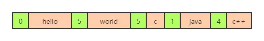
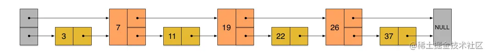
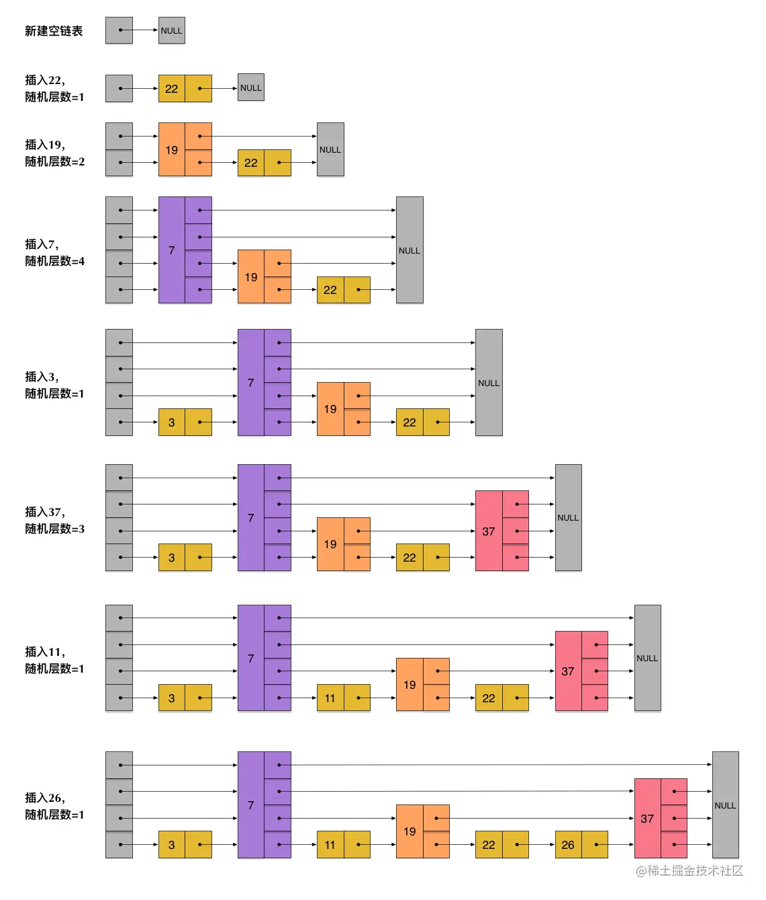
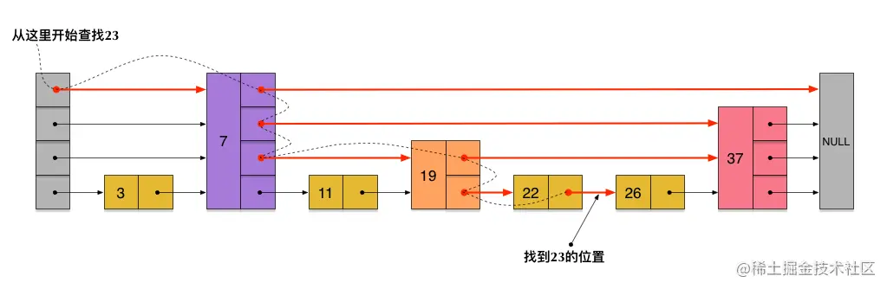
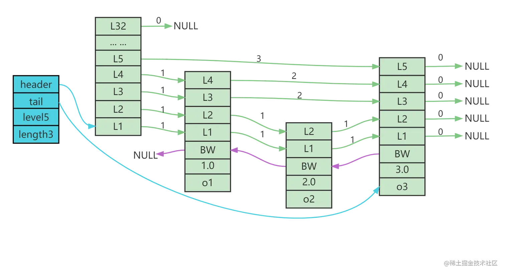

# Redis数据类型

## 基础数据类型

Redis 支持的数据类型有：

| 类型                   | 简介                                                         | 特性                                                         | 场景                                                         |
| :--------------------- | :----------------------------------------------------------- | :----------------------------------------------------------- | :----------------------------------------------------------- |
| String（字符串）       | 二进制安全                                                   | 可以包含任何数据，比如 JPG 图片或者序列化的对象，一个键最大能存储 512M | 简短的字符场景                                               |
| Hash（哈希）           | 键值对集合，即编程语言中的 Map 类型                          | 适合存储对象，并且可以像数据库中 update 一个属性一样只修改某一项属性值（Memcached 中需要取出整个字符串反序列化成对象修改完再序列化存回去） | 存储、读取、修改用户属性                                     |
| List（列表)            | 链表（双向链表)                                              | 增删快，提供了操作某一段元素的 API                           | ①最新消息排行等功能（比如朋友圈的时间线）； ②消息队列        |
| Set（集合)             | 哈希表实现，元素不重复                                       | ①添加、删除，查找的复杂度都是 O(1) ②为集合提供了求交集、并集、差集等操作 | ①共同好友； ②利用唯一性，统计访问网站的所有独立 IP； ③好友推荐时，根据 tag 求交集，大于某个阈值就可以推荐 |
| Sorted Set（有序集合） | 将 Set 中的元素增加一个权重参数 score，元素按 score 有序排列 | 数据插入集合时，已经进行天然排序                             | ①排行榜； ②带权重的消息队列                                  |

### 字符串String

**单值多Value**

set、get、del

exists（是否存在）、append（追加）、strlen（获取长度）

```bash
127.0.0.1:6379> set key1 value1 # 设置值
OK
127.0.0.1:6379> get key1 # 获得key
"value1"
127.0.0.1:6379> del key1 # 删除key
(integer) 1
127.0.0.1:6379> keys * # 查看全部的key
(empty list or set)
127.0.0.1:6379> exists key1 # 确保 key1 不存在
(integer) 0
127.0.0.1:6379> append key1 "hello" # 对不存在的 key进行APPEND，等同于SET key1 "hello"
(integer) 5 # 字符长度
127.0.0.1:6379> APPEND key1 "-2333" # 对已存在的字符串进行 APPEND
(integer) 10 # 长度从 5 个字符增加到 10 个字符
127.0.0.1:6379> get key1
"hello-2333"
127.0.0.1:6379> STRLEN key1 # # 获取字符串的长度
(integer) 10
```

**incr、decr 一定要是数字才能进行加减，+1 和 -1。**

incrby、decrby 将 key 中储存的数字加上或减去指定的数量。

```bash
127.0.0.1:6379> set views 0 # 设置浏览量为0
OK
127.0.0.1:6379> incr views # 浏览 + 1
(integer) 1
127.0.0.1:6379> incr views # 浏览 + 1
(integer) 2
127.0.0.1:6379> decr views # 浏览 - 1
(integer) 1

127.0.0.1:6379> incrby views 10 # +10
(integer) 11
127.0.0.1:6379> decrby views 10 # -10
(integer) 1
```

range [范围] 

getrange 获取指定区间范围内的值，类似between...and的关系，从零到负一表示全部

```bash
127.0.0.1:6379> set key2 abcd123456 # 设置key2的值
OK
127.0.0.1:6379> getrange key2 0 -1 # 获得全部的值
"abcd123456"
127.0.0.1:6379> getrange key2 0 2 # 截取部分字符串
"abc"
```

setrange 设置指定区间范围内的值，格式是setrange key值 具体值

```bash
127.0.0.1:6379> get key2
"abcd123456"
127.0.0.1:6379> SETRANGE key2 1 xx # 替换值
(integer) 10
127.0.0.1:6379> get key2
"axxd123456"
```

setex（set with expire）设置过期时间

setnx（set if not exist）如何key存在则不覆盖值，还是原来的值（分布式中常用）

```bash
127.0.0.1:6379> setex key3 60 expire # 设置过期时间
OK
127.0.0.1:6379> ttl key3 # 查看剩余的时间
(integer) 55

127.0.0.1:6379> setnx mykey "redis" # 如果不存在就设置，成功返回1
(integer) 1
127.0.0.1:6379> setnx mykey "mongodb" # 如果值存在则不覆盖值，返回0
(integer) 0
127.0.0.1:6379> get mykey
"redis"
```

mset：同时设置一个或多个 key-value 对。

mget：返回所有(一个或多个) key 的值。 如果给定的 key 里面，有某个 key 不存在，则此 key 返回特殊值nil 

msetnx：当所有 key 都成功设置，返回 1 。如果所有给定 key 都设置失败(至少有一个 key 已经存在)，那么返回 0 。相当于原子性操作，要么都成功，要么都不成功。

```bash
127.0.0.1:6379> mset k10 v10 k11 v11 k12 v12
OK
127.0.0.1:6379> keys *
1) "k12"
2) "k11"
3) "k10"

127.0.0.1:6379> mget k10 k11 k12 k13
1) "v10"
2) "v11"
3) "v12"
4) (nil)

127.0.0.1:6379> msetnx k10 v10 k15 v15 # 原子性操作！
(integer) 0
127.0.0.1:6379> get key15
(nil)
```

存储对象：

set user:1 value（json数据）

```bash
127.0.0.1:6379> mset user:1:name zhangsan user:1:age 2
OK
127.0.0.1:6379> mget user:1:name user:1:age
1) "zhangsan"
2) "2"
```

getset：先get再set

```bash
127.0.0.1:6379> getset db mongodb # 没有旧值，返回 nil
(nil)
127.0.0.1:6379> get db
"mongodb"
127.0.0.1:6379> getset db redis # 返回旧值 mongodb
"mongodb"
127.0.0.1:6379> get db
"redis"
```

String数据结构是简单的key-value类型，value其实不仅可以是String，也可以是数字。

常规计数：微博数，粉丝数等。

### 列表List

一般是用来保存用一种类型的信息。

**单值多Value**

可插入重读的值

- Lpush：将一个或多个值插入到列表头部。（LeftPush左）

- Rpush：将一个或多个值插入到列表尾部。（RightPush右）

- lrange：返回列表中指定区间内的元素，区间以偏移量 START 和 END 指定。

- lrange 0 -1 **查看全部list元素**

​	其中 0 表示列表的第一个元素， 1 表示列表的第二个元素，以此类推。

​	使用负数下标，以 -1 表示列表的最后一个元素， -2 表示列表的倒数第二个元素，以此类推。

```bash
127.0.0.1:6379> LPUSH list "one"
(integer) 1
127.0.0.1:6379> LPUSH list "two"
(integer) 2
127.0.0.1:6379> RPUSH list "right"
(integer) 3

127.0.0.1:6379> Lrange list 0 -1
1) "two"
2) "one"
3) "right"
127.0.0.1:6379> Lrange list 0 1
1) "two"
2) "one"
```

lpop 命令用于移除并返回列表的第一个元素。当列表 key 不存在时，返回 nil 。 

rpop 移除列表的最后一个元素，返回值为移除的元素。

```bash
127.0.0.1:6379> Lpop list
"two"
127.0.0.1:6379> Rpop list
"right"
127.0.0.1:6379> Lrange list 0 -1
1) "one"
```

Lindex，按照索引下标获得元素（-1代表最后一个，0代表是第一个）

```bash
127.0.0.1:6379> Lindex list 1
(nil)
127.0.0.1:6379> Lindex list 0
"one"
127.0.0.1:6379> Lindex list -1
"one"
```

llen 用于返回列表的长度。

```bash
127.0.0.1:6379> flushdb
OK
127.0.0.1:6379> Lpush list "one"
(integer) 1
127.0.0.1:6379> Lpush list "two"
(integer) 2
127.0.0.1:6379> Lpush list "three"
(integer) 3
127.0.0.1:6379> Llen list # 返回列表的长度
(integer) 3
```

 lrem （lrem key count element）根据参数 COUNT 的值，移除列表中与参数 VALUE 相等的元素。

如果有多个一样的lement，则删除列表最前面的的

```bash
127.0.0.1:6379> lrem list 1 "two"
(integer) 1
127.0.0.1:6379> Lrange list 0 -1
1) "three"
2) "one"
```

Ltrim key 对一个列表进行修剪(trim)，只保留指定列表中区间内的元素，不在指定区间之内的元素都将被删除。

```bash
127.0.0.1:6379> RPUSH mylist "hello" "hello" "hello2" "hello3"
(integer) 4
127.0.0.1:6379> ltrim mylist 1 2
OK
127.0.0.1:6379> lrange mylist 0 -1
1) "hello"
2) "hello2"
```

rpoplpush 移除列表的最后一个元素，并将该元素添加到另一个列表并返回。

```bash
127.0.0.1:6379> rpush mylist "hello"
(integer) 1
127.0.0.1:6379> rpush mylist "foo"
(integer) 2
127.0.0.1:6379> rpush mylist "bar"
(integer) 3
127.0.0.1:6379> rpoplpush mylist myotherlist
"bar"
127.0.0.1:6379> lrange mylist 0 -1
1) "hello"
2) "foo"
127.0.0.1:6379> lrange myotherlist 0 -1
1) "bar"
```

lset key index value ，将列表 key 下标为 index 的元素的值设置为 value 。

```bash
127.0.0.1:6379> exists list # 对空列表(key 不存在)进行 LSET
(integer) 0
127.0.0.1:6379> lset list 0 item # 报错
(error) ERR no such key

127.0.0.1:6379> lpush list "value1" # 对非空列表进行 LSET
(integer) 1
127.0.0.1:6379> lrange list 0 0
1) "value1"
127.0.0.1:6379> lset list 0 "new" # 更新值
OK
127.0.0.1:6379> lrange list 0 0
1) "new"
127.0.0.1:6379> lset list 1 "new" # index 超出范围报错
(error) ERR index out of range
```

linsert key before/after pivot value，用于在列表的元素前或者后插入元素。

将值 value 插入到列表 key 当中，位于值 pivot 之前或之后。

如果pivot有多个，则插入最前面的那个

```bash
127.0.0.1:6379> RPUSH mylist "Hello"
(integer) 1
127.0.0.1:6379> RPUSH mylist "world"
(integer) 2
127.0.0.1:6379> lrange mylist 0 -1
1) "Hello"
2) "world"

127.0.0.1:6379> LINSERT mylist BEFORE "world" "There"
(integer) 3
127.0.0.1:6379> lrange mylist 0 -1
1) "Hello"
2) "There"
3) "world"
```


**性能总结：**

- 它是一个字符串链表，left，right 都可以插入添加
- 如果键不存在，创建新的链表
- 如果键已存在，新增内容
- 如果值全移除，对应的键也就消失了
- 链表的操作无论是头和尾效率都极高，但假如是对中间元素进行操作，效率就很惨淡了。

list就是链表，略有数据结构知识的人都应该能理解其结构。使用Lists结构，我们可以轻松地实现最新消息排行等功能。List的另一个应用就是消息队列，可以利用List的PUSH操作，将任务存在List中，然后工作线程再用POP操作将任务取出进行执行。Redis还提供了操作List中某一段的api，你可以直接查询，删除List中某一段的元素。

Redis的list是每个子元素都是String类型的双向链表，可以通过push和pop操作从列表的头部或者尾部添加或者删除元素，这样List即可以作为栈，也可以作为队列。

### 集合Set-无序不重复集合

**单值多value**


无序不重复集合

sadd 将一个或多个成员元素加入到集合中，不能重复 

smembers 返回集合中的所有的成员。 

sismember 命令判断成员元素是否是集合的成员。

```bash
127.0.0.1:6379> sadd myset "hello"
(integer) 1
127.0.0.1:6379> sadd myset "zhiyuan"
(integer) 1
127.0.0.1:6379> sadd myset "zhiyuan" # 重复值不插入 返回0
(integer) 0
127.0.0.1:6379> SMEMBERS myset #查看集合中所有成员
1) "zhiyuan"
2) "hello"
127.0.0.1:6379> SISMEMBER myset "hello" #是否是此集合的成员 是反正1
(integer) 1
127.0.0.1:6379> SISMEMBER myset "world"
(integer) 0
```

scard，获取集合里面的元素个数

```bash
127.0.0.1:6379> scard myset
(integer) 2
```

srem key value 用于移除集合中的一个或多个成员元素

```bash
127.0.0.1:6379> srem myset "zhiyuan"
(integer) 1
127.0.0.1:6379> SMEMBERS myset
1) "hello"
```

srandmember key 用于返回集合中随机元素。后面加上数字，则随机返回对应数量的成员，默认一个

```bash
127.0.0.1:6379> SMEMBERS myset
1) "zhiyuan"
2) "world"
3) "hello"
127.0.0.1:6379> SRANDMEMBER myset
"hello"
127.0.0.1:6379> SRANDMEMBER myset 2
1) "world"
2) "zhiyuan"
127.0.0.1:6379> SRANDMEMBER myset 2
1) "zhiyuan"
2) "hello"
```

spop key [count] 用于移除指定 key 集合的随机元素，不填则默认一个。

```bash
127.0.0.1:6379> SMEMBERS myset
1) "zhiyuan"
2) "world"
3) "hello"
127.0.0.1:6379> spop myset
"world"
127.0.0.1:6379> spop myset 2
1) "zhiyuan"
2) "hello"
```

 smove SOURCE DESTINATION MEMBER， 将指定成员 member 元素从 source 集合移动到 destination 集合

```bash
127.0.0.1:6379> sadd myset "hello" #myset 添加元素
(integer) 1
127.0.0.1:6379> sadd myset "world"
(integer) 1
127.0.0.1:6379> sadd myset "zhiyuan"
(integer) 1
127.0.0.1:6379> sadd myset2 "set2" #myset2 添加元素
(integer) 1
127.0.0.1:6379> smove myset myset2 "zhiyuan"
(integer) 1
127.0.0.1:6379> SMEMBERS myset
1) "world"
2) "hello"
127.0.0.1:6379> SMEMBERS myset2
1) "zhiyuan"
2) "set2"
```

数字集合类：

- 差集： sdiff
- 交集： sinter
- 并集： sunion

```bash
127.0.0.1:6379> sadd key1 "a" # key1
(integer) 1
127.0.0.1:6379> sadd key1 "b"
(integer) 1
127.0.0.1:6379> sadd key1 "c"
(integer) 1
127.0.0.1:6379> sadd key2 "c" # key2
(integer) 1
127.0.0.1:6379> sadd key2 "d"
(integer) 1
127.0.0.1:6379> sadd key2 "e"
(integer) 1
127.0.0.1:6379> SDIFF key1 key2 # 差集
1) "a"
2) "b"
127.0.0.1:6379> SINTER key1 key2 # 交集
1) "c"
127.0.0.1:6379> SUNION key1 key2 # 并集
1) "a"
2) "b"
3) "c"
4) "e"
5) "d"
```

在微博应用中，可以将一个用户所有的关注人存在一个集合中，将其所有粉丝存在一个集合。Redis还为集合提供了求交集、并集、差集等操作，可以非常方便的实现如共同关注、共同喜好、二度好友等功能，对上面的所有集合操作，你还可以使用不同的命令选择将结果返回给客户端还是存集到一个新的集合中。

### 哈希Hash-存储结构

**k-v模式不变，但V是一个键值对**

hset、hget 命令用于为哈希表中的字段赋值

hmset、hmget 同时将多个field-value对设置到哈希表中。会覆盖哈希表中已存在的字段

>  Redis 4.0.0开始弃用HMSET，请使用HSET

hgetall 用于返回哈希表中，所有的字段和值。

hdel 用于删除哈希表 key 中的一个或多个指定字段

```bash
127.0.0.1:6379>  hset myhash field1 "zhiyuan"
(integer) 1
127.0.0.1:6379> hget myhash field1
"zhiyuan"

127.0.0.1:6379> HSET myhash field1 "Hello" field2 "World"
(integer) 2
127.0.0.1:6379> hgetall myhash
1) "field1"
2) "Hello"
3) "field2"
4) "World"
127.0.0.1:6379> HGET myhash field1
"Hello"
127.0.0.1:6379> HGET myhash field2
"World"

127.0.0.1:6379> HDEL myhash field1
(integer) 1
127.0.0.1:6379> hgetall myhash
1) "field2"
2) "World"

```

hlen 获取哈希表中字段的数量

```bash
127.0.0.1:6379> hlen myhash
(integer) 1
127.0.0.1:6379> HSET myhash field1 "Hello" field2 "World"
OK
127.0.0.1:6379> hlen myhash
(integer) 2
```

hexists 查看哈希表的指定字段是否存在

```bash
127.0.0.1:6379> hexists myhash field1
(integer) 1
127.0.0.1:6379> hexists myhash field3
(integer) 0
```

hkeys 获取哈希表中的所有域（field）

hvals 返回哈希表所有域(field)的值

```bash
127.0.0.1:6379> HKEYS myhash
1) "field2"
2) "field1"
127.0.0.1:6379> HVALS myhash
1) "World"
2) "Hello"
```

hincrby 为哈希表中的字段值加上指定增量值

```bash
127.0.0.1:6379> hset myhash field 5
(integer) 1
127.0.0.1:6379> HINCRBY myhash field 1
(integer) 6
127.0.0.1:6379> HINCRBY myhash field -1
(integer) 5
127.0.0.1:6379> HINCRBY myhash field -10
(integer) -5
```

hsetnx 为哈希表中不存在的的字段赋值 ，存在则不赋值

```bash
127.0.0.1:6379> HSETNX myhash field1 "hello"
(integer) 1 # 设置成功，返回 1 。
127.0.0.1:6379> HSETNX myhash field1 "world"
(integer) 0 # 如果给定字段已经存在，返回 0 。
127.0.0.1:6379> HGET myhash field1
"hello"
```

Redis hash是一个string类型的field和value的映射表，hash特别适合用于存储对象。 存储部分变更的数据，如用户信息等。

### 有序集合Zset

```java
zadd(key, score, member)：向名称为key的zset中添加元素member，score用于排序。如果该元素已经存在，则根据score更新该元素的顺序。

zrem(key, member) ：删除名称为key的zset中的元素member

zincrby(key, increment, member) ：如果在名称为key的zset中已经存在元素member，则该元素的score增加increment；否则向集合中添加该元素，其score的值为increment

zrank(key, member) ：返回名称为key的zset（元素已按score从小到大排序）中member元素的rank（即index，从0开始），若没有member元素，返回“nil”

zrevrank(key, member) ：返回名称为key的zset（元素已按score从大到小排序）中member元素的rank（即index，从0开始），若没有member元素，返回“nil”

zrange(key, start, end)：返回名称为key的zset（元素已按score从小到大排序）中的index从start到end的所有元素

zrevrange(key, start, end)：返回名称为key的zset（元素已按score从大到小排序）中的index从start到end的所有元素

zrangebyscore(key, min, max)：返回名称为key的zset中score >= min且score <= max的所有元素 zcard(key)：返回名称为key的zset的基数

zscore(key, element)：返回名称为key的zset中元素element的score 

zremrangebyrank(key, min, max)：删除名称为key的zset中rank >= min且rank <= max的所有元素 zremrangebyscore(key, min, max) ：删除名称为key的zset中score >= min且score <= max的所有元素
```


在set基础上，加一个score值。之前set是k1 v1 v2 v3，现在zset是 k1 score1 v1 score2 v2


zadd 将一个或多个成员元素及其分数值加入到有序集当中。

zrange 返回有序集中，指定区间内的成员

```bash
127.0.0.1:6379> zadd myset 1 "one"
(integer) 1
127.0.0.1:6379> zadd myset 2 "two" 3 "three"
(integer) 2
127.0.0.1:6379> ZRANGE myset 0 -1
1) "one"
2) "two"
3) "three"
```

zrangebyscore 返回有序集合中指定分数区间的成员列表。有序集成员按分数值递增(从小到大) 次序排列。

ZREVRANGE 从大到小

```bash
127.0.0.1:6379> zadd salary 2500 xiaoming
(integer) 1
127.0.0.1:6379> zadd salary 5000 xiaohong
(integer) 1
127.0.0.1:6379> zadd salary 500 kuangshen
(integer) 1

# Inf无穷大量+∞,同样地,-∞可以表示为-Inf。
127.0.0.1:6379> ZRANGEBYSCORE salary -inf +inf # 显示整个有序集
1) "zhiyuan"
2) "xiaoming"
3) "xiaohong"
127.0.0.1:6379> ZRANGEBYSCORE salary -inf +inf withscores # 递增排列
1) "zhiyuan"
2) "500"
3) "xiaoming"
4) "2500"
5) "xiaohong"
6) "5000"
127.0.0.1:6379> ZREVRANGE salary 0 -1 WITHSCORES # 递减排列
1) "xiaohong"
2) "5000"
3) "xiaoming"
4) "2500"
5) "zhiyuan"
6) "500"
# 显示工资 <=2500的所有成员
127.0.0.1:6379> ZRANGEBYSCORE salary -inf 2500 WITHSCORES 
1) "zhiyuan"
2) "500"
3) "xiaoming"
4) "2500"
```

zrem 移除有序集中的一个或多个成员

```bash
127.0.0.1:6379> ZRANGE salary 0 -1
1) "zhiyuan"
2) "xiaoming"
3) "xiaohong"
127.0.0.1:6379> zrem salary zhiyuan
(integer) 1
127.0.0.1:6379> ZRANGE salary 0 -1
1) "xiaoming"
2) "xiaohong"
```

zcard 命令用于计算集合中元素的数量

```bash
127.0.0.1:6379> zcard salary
(integer) 2
OK
```

zcount 计算有序集合中指定分数区间的成员数量。

```bash
127.0.0.1:6379> zadd myset 1 "hello"
(integer) 1
127.0.0.1:6379> zadd myset 2 "world" 3 "zhiyuan"
(integer) 2
127.0.0.1:6379> ZCOUNT myset 1 3
(integer) 3
127.0.0.1:6379> ZCOUNT myset 1 2
(integer) 2
```

zrank 返回有序集中指定成员的**排名**。其中有序集成员按分数值递增(从小到大)顺序排列。

```bash
127.0.0.1:6379> zadd salary 2500 xiaoming
(integer) 1
127.0.0.1:6379> zadd salary 5000 xiaohong
(integer) 1
127.0.0.1:6379> zadd salary 500 kuangshen
(integer) 1
127.0.0.1:6379> ZRANGE salary 0 -1 WITHSCORES # 显示所有成员及其 score 值
1) "kuangshen"
2) "500"
3) "xiaoming"
4) "2500"
5) "xiaohong"
6) "5000"
127.0.0.1:6379> zrank salary kuangshen # 显示 kuangshen 的薪水排名，最少
(integer) 0
127.0.0.1:6379> zrank salary xiaohong # 显示 xiaohong 的薪水排名，第三
(integer) 2
```

zrevrank 返回有序集中成员的排名。其中有序集成员按分数值递减(从大到小)排序

```bash
127.0.0.1:6379> ZREVRANK salary kuangshen # 狂神第三
(integer) 2
127.0.0.1:6379> ZREVRANK salary xiaohong # 小红第一
(integer) 0
```

和set相比，sorted set增加了一个权重参数score，使得集合中的元素能够按score进行有序排列，比如 一个存储全班同学成绩的sorted set，其集合value可以是同学的学号，而score就可以是其考试得分， 这样在数据插入集合的时候，就已经进行了天然的排序。可以用sorted set来做带权重的队列，比如普通消息的score为1，重要消息的score为2，然后工作线程可以选择按score的倒序来获取工作任务。让 重要的任务优先执行。

#### Zset底层实现原理

#### ZIPLIST压缩表

Redis引入了压缩列表的概念，即多大的元素使用多大的内存，一切从实际出发，拒绝浪费。

如下图，根据每个节点的实际存储的内容决定内存的大小，即第一个节点占用5个字节，第二个节点占用5个字节，第三个节点占用1个字节，第四个节点占用4个字节，第五个节点占用3个字节。


还有一个问题，我们在遍历的时候不知道每个元素的大小，无法准确计算出下一个节点的具体位置。实际存储不会出现上图的横线，我们并不知道什么时候当前节点结束，什么时候到了下一个节点。所以在redis中添加length属性，用来记录前一个节点的长度。

如下图，如果需要从头开始遍历，取某个节点后面的数字，比如取“hello”的起始地址，但是不知道其结束地址在哪里，我们取后面数字5，即可知道"hello"占用了5个字节，即可顺利找到下一节点“world”的起始位置。




因为压缩表是紧凑存储的，没有多余的空间。这就意味着插入一个新的元素就需要调用函数扩展内存。过程中可能需要重新分配新的内存空间，并将之前的内容一次性拷贝到新的地址。

如果数据量太多，重新分配内存和拷贝数据会有很大的消耗。所以压缩表不适合存储大型字符串，并且数据元素不能太多。


##### zset的两种实现方式

有序集合是由 ziplist (压缩列表) 或 skiplist (跳跃表) 组成的。

> Redis 则采用一种巧妙的方法是，跳表在创建节点的时候，随机生成每个节点的层数，并没有严格维持相邻两层的节点数量比例为 2 : 1 的情况。
>
> 具体的做法是，跳表在创建节点时候，会生成范围为[0-1]的一个随机数，如果这个随机数小于 0.25（相当于概率 25%），那么层数就增加 1 层，然后继续生成下一个随机数，直到随机数的结果大于 0.25 结束，最终确定该节点的层数。
>
> 这样的做法，相当于每增加一层的概率不超过 25%，层数越高，概率越低，层高最大限制是 64。

当数据比较少时，有序集合使用的是 ziplist 存储的，如下代码所示：

```shell
127.0.0.1:6379> zadd myzset 1 db 2 redis 3 mysql
(integer) 3
127.0.0.1:6379> object encoding myzset
"ziplist"
```

从结果可以看出，有序集合把 myset 键值对存储在 ziplist 结构中了。 有序集合使用 ziplist 格式存储必须满足以下两个条件：

- **有序集合保存的元素个数要小于 128 个；**
- **有序集合保存的所有元素成员的长度都必须小于 64 字节。**

如果不能满足以上两个条件中的任意一个，有序集合将会使用 skiplist 结构进行存储。

> Zset 类型的底层数据结构是由**压缩列表或跳表**实现的：
>
> - 如果有序集合的元素个数小于 `128` 个，并且每个元素的值小于 `64` 字节时，Redis 会使用**压缩列表**作为 Zset 类型的底层数据结构；
> - 如果有序集合的元素不满足上面的条件，Redis 会使用**跳表**作为 Zset 类型的底层数据结构；

 接下来我们来测试以下，当有序集合中某个元素长度大于 64 字节时会发生什么情况？ 代码如下：

```shell
127.0.0.1:6379> zadd zmaxleng 1.0 redis
(integer) 1
127.0.0.1:6379> object encoding zmaxleng
"ziplist"
127.0.0.1:6379> zadd zmaxleng 2.0 aaaaaaaaaaaaaaaaaaaaaaaaaaaaaaaaaaaaaaaaaaaaaaaaaaaaaaaaaaaaaaaaa
(integer) 1
127.0.0.1:6379> object encoding zmaxleng
"skiplist"
```

通过以上代码可以看出，当有序集合保存的所有元素成员的长度大于 64 字节时，有序集合就会从 ziplist 转换成为 skiplist。

#### SKIPLIST跳表

因为有了skiplist，才1能在O(logN)的时间内插入一个元素，并且实现快速的按分数范围查找元素

`dict`保存着**member**到**score**的映射，这样就可以使用`O(1)`的复杂度来查找**member**对应的**score**值。虽然同时使用两种结构，但它们会通过指针来共享相同元素的 **member** 和 **score**，因此不会浪费额外的内存。

##### skiplist优势

skiplist本质上是并行的有序链表，但它克服了有序链表插入和查找性能不高的问题。它的插入和查询的时间复杂度都是O(logN)

##### skiplist原理

普通有序链表的插入需要一个一个向前查找是否可以插入，所以时间复杂度为O(N)，比如下面这个链表插入23，就需要一直查找到22和26之间。


如果节点能够跳过一些节点，连接到更靠后的节点就可以优化插入速度：



在上面这个结构中，插入23的过程是

- 先使用第2层链接head->7->19->26，发现26比23大，就回到19
- 再用第1层连接19->22->26，发现比23大，那么就插入到26之前，22之后

上面这张图就是跳表的初步原理，但一个元素插入链表后，应该拥有几层连接呢？跳表在这块的实现方式是随机的，也就是23这个元素插入后，随机出一个数，比如这个数是3，那么23就会有如下连接：

- 第3层head->23->end
- 第2层19->23->26
- 第1层22->23->26

下面这张图展示了如何形成一个跳表，随机层数就是表示当前节点凸显出来的层数



在上述跳表中查找/插入23的过程为：



总结一下跳表原理：

- 每个跳表都必须设定一个最大的连接层数MaxLevel
- 第一层连接会连接到表中的每个元素
- 插入一个元素会随机生成一个连接层数值[1, MaxLevel]之间，根据这个值跳表会给这元素建立N个连接
- 插入某个元素的时候先从最高层开始，当跳到比目标值大的元素后，回退到上一个元素，用该元素的下一层连接进行遍历，周而复始直到第一层连接，最终在第一层连接中找到合适的位置

##### skiplist在redis zset的使用

redis中skiplist的MaxLevel设定为32层

skiplist原理中提到skiplist一个元素插入后，会随机分配一个层数，而redis的实现，这个随机的规则是：

- 一个元素拥有第1层连接的概率为100%
- 一个元素拥有第2层连接的概率为50%
- 一个元素拥有第3层连接的概率为25%
- 以此类推...

为了提高搜索效率，redis会缓存MaxLevel的值，在每次插入/删除节点后都会去更新这个值，<u>这样每次搜索的时候不需要从32层开始搜索，而是从MaxLevel指定的层数开始搜索</u>

实际应用中的skiplist每个节点应该包含member和score两部分。前面的描述中我们没有具体区分member和score，但实际上列表中是按照score进行排序的，查找过程也是根据score在比较。

##### 查找过程

对于zrangebyscore命令：score作为查找的对象，在跳表中跳跃查询，就和上面skiplist的查询一样


##### 插入过程

zadd [zset name] [score] [value]：

- 在map中查找value是否已存在，如果存在现需要在skiplist中找到对应的元素删除，再在skiplist做插入
- 插入过程也是用score来作为查询位置的依据，和skiplist插入元素方法一样。并需要更新value->score的map

如果score一样怎么办？根据value再排序，按照顺序插入

##### 删除过程

zrem [zset name] [value]：从map中找到value所对应的score，然后再在跳表中搜索这个score,value对应的节点，并删除

##### 排名是怎么算出来的

zrank [zset name] [value]的实现依赖与一些附加在跳表上的属性：

- 跳表的每个元素的Next指针都记录了这个指针能够跨越多少元素，redis在插入和删除元素的时候，都会更新这个值
- 然后在搜索的过程中按经过的路径将路径中的span值相加得到rank

#### 跳表底层结构



在前面的图上我们看到`zskiplist`包含四个部分：

- `header`：指向跳跃表头结点
- `tail`：指向跳跃表的尾结点
- `level`：记录跳跃表中层数最大的节点层数。（注意：头结点固定高度为32，初始全部指向NULL，且不被levle记录层高）
- `length`：记录跳跃表长度，即包含几个节点。（头结点除外）

**使用多个节点就可以作为跳跃表，那么为什么还需要`zskiplist`？**

实际通过zskiplist的结构就可以得出：

- `header`和`tail`:快速访问跳跃表的头或尾节点，且`时间复杂度是O(1)`，否则可能需要遍历至少大于等于1次。
- `length`：快速获取长度（即节点数量），时`间复杂度都O(1)`，否则需要遍历整个跳跃表。
- `level`：用来快速获取最高节点层数，`时间复杂度是O(1)`。

可以帮助我们方便、快速的处理跳跃表。

在前面的图我们看到`zskiplistNode`包含四种部分：

- `Level`：层，即以L开头的部分。Level包含两个部分`前进指针`和`跨度`。表头向表位遍历时，会沿着前进指针前进。

  - `前进指针`：指向表尾方向的其他节点
  - `跨度`：当前节点距离指向节点的距离，即上图箭头上的数字。

  每当有一个新的节点加入跳跃表，程序根据[幂次法则](https://link.juejin.cn?target=https%3A%2F%2Fbaike.baidu.com%2Fitem%2F%E5%B9%82%E6%AC%A1%E6%B3%95%E5%88%99%2F8271554)生成一个介于1和32之间的值作为level的大小，即层的高度。

- `backward`：后退指针，即BW。指向当前节点的前一个节点，当从表尾向表头遍历时被使用。

- `score`：分值，即1.0、2.0、3.0。在跳跃表中会按照分值从小到大排列。

- `object`：成员对象，即o1、o2、o3。当分值相同时，按照成员对象进行排序

表头节点也有backward、score、object，但是不会使用。


##### **Redis使用SkipList而不是用平衡树的主要原因有：**

1. 平衡树不适合范围查找。需要中序遍历继续寻找其它节点。而Skiplist就非常简单了，使用`lv1`的指针进行向右遍历即可。
2. 平衡树的插入和删除引发子树调整，逻辑复杂，SkipList相对简单很多
3. 平衡树每个节点包含两个指针，SkipList平均不到2个指针，内存上更有优势。
4. 从算法实现难度上来比较，Skiplist 比平衡树要简单得多。


## 三种特殊数据类型-基本用的少

### GEO地理位置

#### 简介

Redis 的 GEO 特性在 Redis 3.2 版本中推出， 这个功能可以将用户给定的地理位置信息储存起来， 并对这些信息进行操作。来实现诸如附近位置、摇一摇这类依赖于地理位置信息的功能。geo的数据类型为 zset。

GEO 的数据结构总共有六个常用命令：geoadd、geopos、geodist、georadius、 georadiusbymember、gethash

官方文档：https://www.redis.net.cn/order/3685.html

#### 常用指令

**1、geoadd**

语法：geoadd key longitude latitude member ...

将给定的空间元素(经度、纬度、名字)添加到指定的键里面。
这些数据会以有序集的形式被储存在键里面，从而使得georadius和georadiusbymember这样的
命令可以在之后通过位置查询取得这些元素。
geoadd命令以标准的x,y格式接受参数，所以用户必须先输入经度，然后再输入纬度。
geoadd能够记录的坐标是有限的：非常接近两极的区域无法被索引。
有效的经度介于-180-180度之间，有效的纬度介于-85.05112878 度至 85.05112878 度之间
当用户尝试输入一个超出范围的经度或者纬度时,geoadd命令将返回一个错误。

测试：百度搜索经纬度查询，模拟真实数据

```bash
127.0.0.1:6379> geoadd china:city 116.23 40.22 北京
(integer) 1
127.0.0.1:6379> geoadd china:city 121.48 31.40 上海 113.88 22.55 深圳 120.21 30.20 杭州
(integer) 3
127.0.0.1:6379> geoadd china:city 106.54 29.40 重庆 108.93 34.23 西安 114.02 30.58 武汉
(integer) 3
```

**2、geopos**

语法：geopos key member [member...]

从key里返回所有给定位置元素的位置（经度和纬度）

```bash
127.0.0.1:6379> geopos china:city 北京
1) 1) "116.23000055551528931"
2) "40.2200010338739844"
127.0.0.1:6379> geopos china:city 上海 重庆
1) 1) "121.48000091314315796"
2) "31.40000025319353938"
2) 1) "106.54000014066696167"
2) "29.39999880018641676"
127.0.0.1:6379> geopos china:city 新疆
1) (nil)
```

**3、geodist**

语法：geodist key member1 member2 [unit]

返回两个给定位置之间的距离，如果两个位置之间的其中一个不存在，那么命令返回空值

指定单位的参数unit必须是以下单位的其中一个：

- m表示单位为米
- km表示单位为千米
- mi表示单位为英里
- ft表示单位为英尺

如果用户没有显式地指定单位参数，那么geodist默认使用 米 作为单位。

geodist命令在计算距离时会假设地球为完美的球形，在极限情况下，这一假设最大会造成0.5%的误差。

```bash
127.0.0.1:6379> geodist china:city 北京 上海
"1088785.4302"
127.0.0.1:6379> geodist china:city 北京 上海 km
"1088.7854"
127.0.0.1:6379> geodist china:city 重庆 北京 km
"1491.6716"
```

**4、georadius**

语法：

```bash
georadius key longitude latitude radius m|km|ft|mi [withcoord][withdist] [withhash][asc|desc][count count]
```

以给定的经纬度为中心， 找出某一半径内的元素

重新连接 redis-cli，增加参数 --raw ，可以强制输出中文，不然会乱码

```bash
127.0.0.1:6379> georadius china:city 100 30 1000 km #乱码
1) "\xe9\x87\x8d\xe5\xba\x86"
2) "\xe8\xa5\xbf\xe5\xae\x89"
127.0.0.1:6379> exit
[root@localhost bin]#  redis-cli --raw -p 6379
# 在 china:city 中寻找坐标 100 30 半径为 1000km 的城市
127.0.0.1:6379> georadius china:city 100 30 1000 km
重庆
西安

```

 withdist 返回位置名称和中心距离

```bash
127.0.0.1:6379> georadius china:city 100 30 1000 km withdist
重庆
635.2850
西安
963.3171
```

withcoord 返回位置名称、经纬度

```bash
127.0.0.1:6379> georadius china:city 100 30 1000 km withcoord
重庆
106.54000014066696167
29.39999880018641676
西安
108.92999857664108276
34.23000121926852302
```

withdist withcoord 返回位置名称、距离、经纬度，count 限定寻找个数

```bash
127.0.0.1:6379> georadius china:city 100 30 1000 km withcoord withdist count 1
重庆
635.2850
106.54000014066696167
29.39999880018641676
127.0.0.1:6379> georadius china:city 100 30 1000 km withcoord withdist count 2
重庆
635.2850
106.54000014066696167
29.39999880018641676
西安
963.3171
108.92999857664108276
34.23000121926852302
```

**5、georadiusbymember**

语法：

```bash
georadiusbymember key member radius m|km|ft|mi [withcoord][withdist] [withhash][asc|desc][count count]
```

找出位于指定范围内的元素，中心点是由给定的位置元素决定

```bash
127.0.0.1:6379> GEORADIUSBYMEMBER china:city 北京 1000 km
北京
西安
127.0.0.1:6379> GEORADIUSBYMEMBER china:city 上海 400 km
杭州
上海
```

**6、geohash**

语法：geohash key member [member...]

Redis使用geohash将二维经纬度转换为一维字符串，字符串越长表示位置更精确，两个字符串越相似表示距离越近。

```bash
127.0.0.1:6379> geohash china:city 北京 重庆
wx4sucu47r0
wm5z22h53v0
127.0.0.1:6379> geohash china:city 北京 上海
wx4sucu47r0
wtw6sk5n300
```

**zrem**

GEO没有提供删除成员的命令，但是因为GEO的底层实现是zset，所以可以借用zrem命令实现对地理位置信息的删除。

```bash
127.0.0.1:6379> geoadd china:city 116.23 40.22 beijing
1
127.0.0.1:6379> zrange china:city 0 -1 # 查看全部的元素
重庆
西安
深圳
武汉
杭州
上海
beijing
北京
127.0.0.1:6379> zrem china:city beijing # 移除元素
1
127.0.0.1:6379> zrem china:city 北京 # 移除元素
1
127.0.0.1:6379> zrange china:city 0 -1
重庆
西安
深圳
武汉
杭州
上海
```

### HyperLogLog

Redis 在 2.8.9 版本添加了 HyperLogLog 结构。

Redis HyperLogLog 是用来做基数统计的算法，HyperLogLog 的优点是，在输入元素的数量或者体积非常非常大时，计算基数所需的空间总是固定的、并且是很小的。

在 Redis 里面，每个 HyperLogLog 键只需要花费 12 KB 内存，就可以计算接近 2^64 个不同元素的基数。这和计算基数时，元素越多耗费内存就越多的集合形成鲜明对比。

HyperLogLog则是一种算法，它提供了不精确的去重计数方案。

举个栗子：假如我要统计网页的UV（浏览用户数量，一天内同一个用户多次访问只能算一次），传统的解决方案是使用Set来保存用户id，然后统计Set中的元素数量来获取页面UV。但这种方案只能承载少量用户，一旦用户数量大起来就需要消耗大量的空间来存储用户id。我的目的是统计用户数量而不是保存用户，这简直是个吃力不讨好的方案！而使用Redis的HyperLogLog最多需要12k就可以统计大量的用户数，尽管它大概有0.81%的错误率，但对于统计UV这种不需要很精确的数据是可以忽略不计的。


**什么是基数？**

比如数据集 {1, 3, 5, 7, 5, 7, 8}， 那么这个数据集的基数集为 {1, 3, 5 ,7, 8}, 基数(不重复元素的数量)为5。

基数估计就是在误差可接受的范围内，快速计算基数。


**基本命令**

| 序号 | 命令及描述                                                   |
| :--- | :----------------------------------------------------------- |
| 1    | [PFADD key element [element ...\]](https://www.runoob.com/redis/hyperloglog-pfadd.html) <br>添加指定元素到 HyperLogLog 中。 |
| 2    | [PFCOUNT key [key ...\]](https://www.runoob.com/redis/hyperloglog-pfcount.html) <br/>返回给定 HyperLogLog 的基数估算值。 |
| 3    | [PFMERGE destkey sourcekey [sourcekey ...\]](https://www.runoob.com/redis/hyperloglog-pfmerge.html) <br/>将多个 HyperLogLog 合并为一个 HyperLogLog，并集计算 |

```bash
127.0.0.1:6379> PFADD mykey a b c d e f g h i j
1
127.0.0.1:6379> PFCOUNT mykey
10
127.0.0.1:6379> PFADD mykey2 i j z x c v b n m
1
127.0.0.1:6379> PFMERGE mykey3 mykey mykey2
OK
127.0.0.1:6379> PFCOUNT mykey3
15
```

### BitMap

#### 简介

在开发中，可能会遇到这种情况：需要统计用户的某些信息，如活跃或不活跃，登录或者不登录；又如 需要记录用户一年的打卡情况，打卡了是1， 没有打卡是0，如果使用普通的 key/value存储，则要记录 365条记录，如果用户量很大，需要的空间也会很大，所以 Redis 提供了 Bitmap 位图这中数据结构， Bitmap 就是通过操作二进制位来进行记录，即为 0 和 1；如果要记录 365 天的打卡情况，使用 Bitmap 表示的形式大概如下：0101000111000111...........................，这样有什么好处呢？当然就是节约内存 了，365 天相当于 365 bit，又 1 字节 = 8 bit , 所以相当于使用 46 个字节即可。

BitMap 就是通过一个 bit 位来表示某个元素对应的值或者状态, 其中的 key 就是对应元素本身，实际上底层也是通过对字符串的操作来实现。Redis 从 2.2 版本之后新增了setbit, getbit, bitcount 等几个 bitmap 相关命令。

#### **操作**

**1、setbit 设置操作**

SETBIT key offset value : 设置 key 的第 offset 位为value (1或0)

使用 bitmap 来记录上述事例中一周的打卡记录如下所示：

周一：1，周二：0，周三：0，周四：1，周五：1，周六：0，周天：0 （1 为打卡，0 为不打卡）

```bash
127.0.0.1:6379> setbit sign 0 1
0
127.0.0.1:6379> setbit sign 1 0
0
127.0.0.1:6379> setbit sign 2 0
0
127.0.0.1:6379> setbit sign 3 1
0
127.0.0.1:6379> setbit sign 4 1
0
127.0.0.1:6379> setbit sign 5 0
0
127.0.0.1:6379> setbit sign 6 0
0
```

**2、getbit 获取操作**

GETBIT key offset 获取offset设置的值，未设置过默认返回0

```bash
127.0.0.1:6379> getbit sign 3 # 查看周四是否打卡
1
127.0.0.1:6379> getbit sign 6 # 查看周七是否打卡
0
```

**3、bitcount 统计操作**

bitcount key [start, end] 统计 key 上位为1的个数

统计这周打卡的记录，可以看到只有3天是打卡的状态：

```bash
127.0.0.1:6379> bitcount sign
3
```

## 