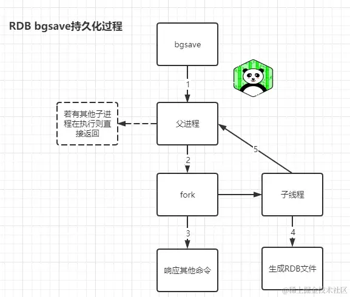
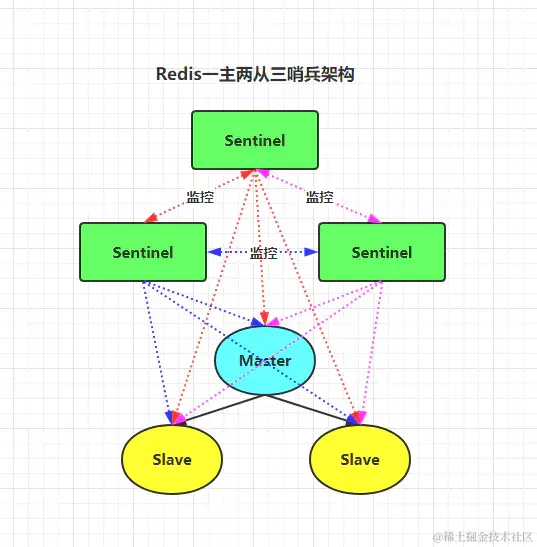
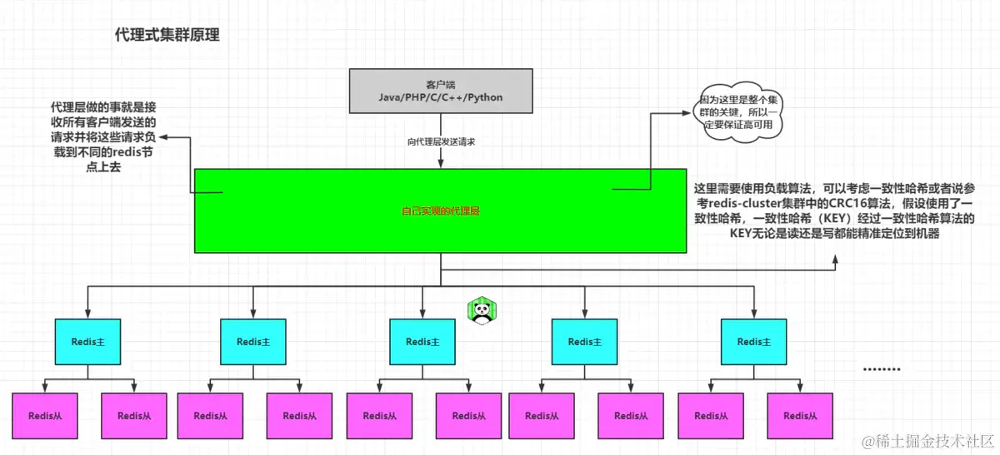
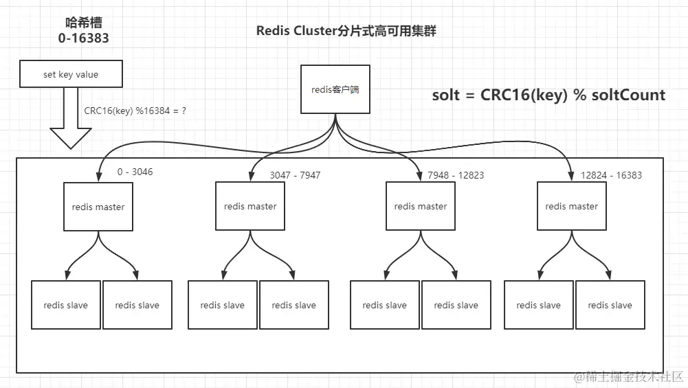
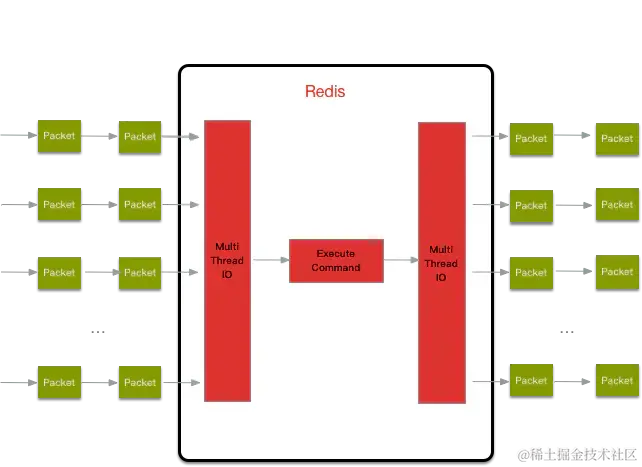

> Quote:
>
> [Redis综述篇：与面试官彻夜长谈Redis缓存、持久化、淘汰机制、哨兵、集群底层原理！](https://juejin.cn/post/7097521572885299214)

## 一、Redis基本概念

- **面试官心理：** 靠！手上活都没干完又叫我过来面试，这不耽误我事么，今儿又得加班补活了........咦，这小伙子简历不错啊，先考考它`Redis`..........
- **面试官：** 谈谈你对`Redis`的理解？
- **我：**`Redis`是`ANSI C`语言编写的一个基于内存的高性能键值对（`key-value`）的`NoSQL`数据库，一般用于架设在Java程序与数据库之间用作缓存层，为了防止DB磁盘IO效率过低造成的请求阻塞、响应缓慢等问题，用来弥补DB与Java程序之间的性能差距，同时，也可以在DB吞吐跟不上系统并发量时，避免请求直接落入DB从而起到保护DB的作用。
- 而`Redis`一般除了缓存DB数据之外还可以利用它丰富的数据类型及指令来实现一些其他功能，比如：计数器、用户在线状态、排行榜、`session`存储等，同时`Redis`的性能也非常可观，通过官方给出的数据显示能够达到10w/s的QPS处理，但是在生产环境的实测结果大概读取QPS在7-9w/s，写入QPS在6-8w/s左右（注：与机器性能也有关），同时`Redis`也提供事务、持久化、高可用等一些机制的支持。

## 二、Redis基本数据类型与常用指令

- **面试官：** 刚刚听你提到了可以利用它丰富的数据类型及指令来实现一些其他功能，那你跟我讲讲`Redis`的一些常用指令。
- **我：**`Redis`常用的一些命令的话一般是都是对于基本数据类型的操作指令以及一些全局指令.....叭啦叭啦叭......，如下：

| 命令                       | 作用                                                         |
| -------------------------- | ------------------------------------------------------------ |
| `keys *`                   | 返回所有键（`keys`还能用来搜索，比如`keys h*`：搜索所有以h开头的键） |
| `dbsize`                   | 返回键数量，如果存在大量键，线上禁止使用此指令               |
| `exists key`               | 检查键是否存在，存在返回 1，不存在返回 0                     |
| `del key`                  | 删除键，返回删除键个数，删除不存在键返回 0                   |
| `ttl key`                  | 查看键存活时间，返回键剩余过期时间，不存在返回-2，永久有效返回-1 |
| `expire key seconds`       | 设置过期时间（单位：s），成功返回1，失败返回0                |
| `expireat key timestamp`   | 设置`key`在某个时间戳（精确到秒）之后过期                    |
| `pexpire key milliseconds` | 设置过期时间（单位：ms），成功返回1，失败返回0               |
| `persist key`              | 去掉过期时间                                                 |
| `monitor`                  | 实时监听并返回`Redis`服务器接收到的所有请求信息              |
| `shutdown`                 | 把数据同步保存到磁盘上，并关闭`Redis`服务                    |
| `info`                     | 查看当前`Redis`节点信息                                      |
| .......                    | .......                                                      |

当然了，一般也是记得一些常用的命令，但是 [更多命令参考：Redis命令大全](https://link.juejin.cn/?target=http%3A%2F%2FRedisdoc.com%2Fstring%2Findex.html)，因为`Redis`命令和JVM参数一样，只要记得可以这样做就行了，但是具体的可以去参考相关文档资料。

| 类型          | 描述                                                         | 特性                                                         | 场景                                                         |
| ------------- | ------------------------------------------------------------ | ------------------------------------------------------------ | ------------------------------------------------------------ |
| `string`      | 二进制安全                                                   | 可以存储任何元素（数字、字符、音视频、图片、对象.....）      | 计数器、分布式锁、字符缓存、分布式ID生成、`session`共享、秒杀`token`、IP限流等 |
| `hash`        | 键值对存储，类似于Map集合                                    | 适合存储对象，可以将对象属性一个个存储，更新时也可以更新单个属性，操作某一个字段 | 对象缓存、购物车等                                           |
| `list`        | 双向链表                                                     | 增删快                                                       | 栈、队列、有限集合、消息队列、消息推送、阻塞队列等           |
| `set`         | 元素不能重复，每次获取无序                                   | 添加、删除、查找的复杂度都是O(1)，提供了求交集、并集、差集的操作 | 抽奖活动、朋友圈点赞、用户（微博好友）关注、相关关注、共同关注、好友推荐（可能认识的人）等 |
| `sorted set`  | 有序集合，每个元素有一个对应的分数，不允许元素重复           | 基于分数进行排序，如果分数相等，以key值的 ascii 值进行排序   | 商品评价标签（好评、中评、差评等）、排行榜等                 |
| `bitmaps`     | `Bitmaps`是一个字节由 8 个二进制位组成                       | 在字符串类型上面定义的位操作                                 | 在线用户统计、用户访问统计、用户点击统计等                   |
| `hyperloglog` | `Redis2.8.9`版本添加了 `HyperLogLog`结构。`Redis HyperLogLog`是用来做基数统计的算法。 | 用于进行基数统计，不是集合，不保存数据，只记录数量而不是具体数据 | 统计独立UV等                                                 |
| `geospatial`  | `Redis3.2`版本新增的数据类型：`GEO`对地理位置的支持          | 以将用户给定的地理位置信息储存起来， 并对这些信息进行操作    | 地理位置计算                                                 |
| `stream`      | `Redis5.0`之后新增的数据类型                                 | 支持发布订阅，一对多消费                                     | 消息队列                                                     |

PS：`HyperLogLog`的优点是，在输入元素的数量或者体积非常非常大时，计算基数所需的空间总是固定 的、并且是很小的。在 `Redis` 里面，每个`HyperLogLog`键只需要花费`12 KB`内存，就可以计算接近`2^64`个不同元素的基数。这和计算基数时，元素越多耗费内存就越多的集合形成鲜明对比。但是，因为`HyperLogLog`只会根据输入元素来计算基数，而不会储存输入元素本身，所以`HyperLogLog`不能像集合那样，返回输入的各个元素（核心是基数估算算法，最终数值存在一定误差误差范围：基数估计的结果是一个带有`0.81%`标准错误的近似值，耗空间极小，每个`hyperloglog key`占用了12K的内存用于标记基数，`pfadd`命令不是一次性分配`12K`内存使用，会随着基数的增加内存逐渐增大，`Pfmerge`命令合并后占用的存储空间为`12K`，无论合并之前数据量多少）

## 三、Redis缓存及一致性、雪崩、击穿与穿透问题

- **面试官提问：** 那么你们在使用`Redis`做为缓存层的时候是怎么通过Java操作`Redis`的呢？
- **我的心理：** 这问题不是送命题吗.....
- **我：** Java操作`Redis`的客户端有很多，比如`springData`中的`RedisTemplate`，也有`SpringCache`集成`Redis`后的注解形式，当然也会有一些`Jedis、Lettuce、Redisson`等等，而我们使用的是`Lettuce`以及`Redisson........`
- **面试官提问：** 那你们在使用`Redis`作为缓存的时候有没有遇到什么问题呢？
- **我：** 咳咳，是的，确实遇到了以及考虑到了一些问题，比如缓存一致性、雪崩、穿透与击穿，关于`Redis`与`MySQL`之间的数据一致性问题其实也考虑过很多方案，比如先删后改，延时双删等等很多方案，但是在高并发情况下还是会造成数据的不一致性，所以关于DB与缓存之间的强一致性一定要保证的话那么就对于这部分数据不要做缓存，操作直接走DB，但是如果这个数据比较热点的话那么还是会给DB造成很大的压力，所以在我们的项目中还是采用先删再改+过期的方案来做的，虽然也会存在数据的不一致，但是勉强也能接受，因为毕竟使用缓存访问快的同时也能减轻DB压力，而且本身采用缓存就需要接受一定的数据延迟性和短暂的不一致性，我们只能采取合适的策略来降低缓存和数据库间数据不一致的概率，而无法保证两者间的强一致性。合适的策略包括合适的缓存更新策略，合适的缓存淘汰策略，更新数据库后及时更新缓存、缓存失败时增加重试机制等。
- **面试官话锋一转：** 打断一下，你刚刚提到了使用缓存能让访问变快，那么你能不能讲讲`Redis`为什么快呢？
- **我的心理：** 好家伙，这一手来的我猝不及防......
- **硬着头发回答：**`Redis`快的原因嘛其实可以从多个维度来看待：

- - 一、`Redis`完全基于内存
  - 二、`Redis`整个结构类似于`HashMap`，查找和操作复杂度为`O(1)`，不需要和`MySQL`查找数据一样需要产生随机磁盘IO或者全表
  - 三、`Redis`对于客户端的处理是单线程的，采用单线程处理所有客户端请求，避免了多线程的上下文切换和线程竞争造成的开销
  - 四、底层采用`select/epoll`多路复用的高效非阻塞IO模型
  - 五、客户端通信协议采用`RESP`，简单易读，避免了复杂请求的解析开销

- **面试官露出姨父般的慈笑：** 嗯嗯，还不错，那你继续谈谈刚刚的缓存雪崩、穿透与击穿的问题吧
- **我：** 好的，先说缓存雪崩吧，缓存雪崩造成的原因是因为我们在做缓存时为了保证内存利用率，一般在写入数据时都会给定一个过期时间，而就是因为过期时间的设置有可能导致大量的热点key在同一时间内全部失效，此时来了大量请求访问这些key，而`Redis`中却没有这些数据，从而导致所有请求直接落入DB查询，造成DB出现瓶颈或者直接被打宕导致雪崩情况的发生。关于解决方案的的话也可以从多个维度来考虑：

- - 一、设置热点数据永不过期，避免热点数据的失效导致大量的相同请求落入DB
  - 二、错开过期时间的设置，根据业务以及线上情况合理的设置失效时间
  - 三、使用分布式锁或者MQ队列使得请求串行化，从而避免同一时间请求大量落入DB（性能会受到很大的影响）

- **面试官：** 那缓存穿透呢？指的是什么？又该怎么解决？
- **我喝了口水接着回答：** 缓存穿透这个问题是由于请求参数不合理导致的，比如对外暴露了一个接口`getUser?userID=xxx`，而数据库中的`userID`是从1开始的，当有黑客通过这个接口携带不存在的ID请求时，比如：`getUser?userID=-1`，请求会先来到`Redis`中查询缓存，但是发现没有对应的数据从而转向DB查询，但是DB中也无此值, 所以也无法写入数据到缓存，而黑客就通过这一点利用“肉鸡”等手段疯狂请求这个接口，导致出现大量`Redis`不存在数据的请求落入DB，从而导致DB出现瓶颈或者直接被打宕机，整个系统陷入瘫痪。
- **面试官：** 嗯，那又该如果避免这种情况呢？
- **我：** 解决方案也有好几种呢：

- - 一、做IP限流与黑名单，避免同一IP一瞬间发送大量请求
  - 二、对于请求做非法校验，对于携带非法参数的请求直接过滤
  - 三、对于DB中查询不存在的数据写入`Redis`中`“Not Data”`并设置短暂的过期时间，下次请求能够直接被拦截在`Redis`而不会落入DB
  - 四、布隆过滤器

- **面试官：** 那接下来的缓存击穿呢？又是怎么回事？怎么解决？
- **我：** 这个简单，缓存击穿和缓存雪崩有点类似，都是由于请求的key过期导致的问题，但是不同点在于失效`key`的数量，对于雪崩而言指的是大量的`key`失效导致大量请求落入DB，而对于击穿而言，指的是某一个热点key突然过期，而这个时候又突然又大量的请求来查询它，但是在`Redis`中却并没有查询到结果从而导致所有请求全部打向DB，导致在这个时刻DB直接被打穿。解决方案的话也是有多种：

- - 一、设置热点key永不过期
  - 二、做好`Redis`监控，请求串行化访问（性能较差）
  - 使用`mutex`锁机制：就是在缓存失效的时候（判断拿出来的值为空），不是立即去`load db`，而是先使用缓存工具的某些带成功操作返回值的操作（比如`Redis`的`SETNX`或者`Memcache`的`ADD`）去`set`一个`mutex key`，当操作返回成功时，再进行`load db`的操作并回设缓存；否则，就重试整个`get`缓存的方法，代码实现如下：

```plain
public Result get(int ID){
    RedisResult = Redis.get(ID);
     if(RedisResult != null){
         return RedisResult;
     }
     if(Redis.setnx("update:" + ID) != "0"){
         DBResult = DB.selectByID(ID);
         if(DBResult != null){ // 避免缓存穿透
             Redis.set(ID,DBResult);
             Redis.del("update:" + ID);
             return DBResult;
         }
         Redis.set(ID,"Not Data");
         return "抱歉，当前查询暂时没有找到数据......";
     }
     Thread.sleep(2);
     return get(ID);
}
```

## 四、Redis八种淘汰策略与三种删除策略

### 4.1. 八种键淘汰（过期）策略

- **面试官：** 你前面提到过，`Redis`的数据是全部放在内存中的，那么有些数据我也没有设置过期时间，导致了大量的内存浪费，当我有新的数据需要写入内存不够用了怎么办？
- **我的内心：** 好家伙，问个`Redis`淘汰策略这么拐弯抹角.......
- **我：** 我想你是想问内存淘汰策略吧，`Redis`在5.0之前为我们提供了六种淘汰策略，而5.0为我们提供了八种，但是大体上来说这些`lru、lfu、random、ttl`四种类型，如下：

| 策略                  | 概述                                                         |
| --------------------- | ------------------------------------------------------------ |
| `volatile-lru`        | 从已设置过期时间的数据集中挑选最近最少使用的数据淘汰，没有设置过期时间的key不会被淘汰，这样就可以在增加内存空间的同时保证需要持久化的数据不会丢失。 |
| `volatile-ttl`        | 从已设置过期时间的数据集中挑选将要过期的数据淘汰，ttl值越小，越先被淘汰。 |
| `volatile-random`     | 从已设置过期时间的数据集中任意选择数据淘汰                   |
| `volatile-lfu`        | 从已设置过期时间的数据集挑选使用频率最低的数据淘汰           |
| `allkeys-lru`         | 从数据集中挑选最近最少使用的数据淘汰，该策略要淘汰的key面向的是全体key集合，而非过期的key集合（应用最广泛的策略）。 |
| `allkeys-lfu`         | 从数据集中挑选使用频率最低的数据淘汰                         |
| `allkeys-random`      | 从数据集（`server.db[i].dict`）中任意选择数据淘汰            |
| `no-eviction`（驱逐） | 禁止驱逐数据，这也是默认策略。意思是当内存不足以容纳新入数据时，新写入操作就会报错，请求可以继续进行，线上任务也不能持续进行，采用`no-eviction`策略可以保证数据不被丢失。 |

- **我喘了口气接着说：**

- - 一、在`Redis`中，数据有一部分访问频率较高，其余部分访问频率较低，或者无法预测数据的使用频率时，设置`allkeys-lru`是比较合适的。
  - 二、如果所有数据访问概率大致相等时，可以选择`allkeys-random`。
  - 三、如果研发者需要通过设置不同的ttl来判断数据过期的先后顺序，此时可以选择`volatile-ttl`策略。
  - 四、如果希望一些数据能长期被保存，而一些数据可以被淘汰掉时，选择`volatile-lru`或`volatile-random`都是比较不错的。
  - 五、由于设置`expire`会消耗额外的内存，如果计划避免`Redis`内存在此项上的浪费，可以选用`allkeys-lru`策略，这样就可以不再设置过期时间，高效利用内存了。
  - `maxmemory-policy`：参数配置淘汰策略。`maxmemory`：限制内存大小。

### 4.2. 三种键删除策略

- **面试官：** 那`Redis`的`Key`删除策略有了解过吗？
- **我：**`Redis`删除`Key`的策略策略有三种： 

- - 定时删除：在设置键的过期时间的同时，设置一个定时器，当键过期了，定时器马上把该键删除。（定时删除对内存来说是友好的，因为它可以及时清理过期键；但对CPU是不友好的，如果过期键太多，删除操作会消耗过多的资源。）
  - 惰性删除：`key`过期后任然留在内存中不做处理，当有请求操作这个`key`的时候，会检查这个`key`是否过期，如果过期则删除，否则返回`key`对应的数据信息。（惰性删除对CPU是友好的，因为只有在读取的时候检测到过期了才会将其删除。但对内存是不友好，如果过期键后续不被访问，那么这些过期键将积累在缓存中，对内存消耗是比较大的。）
  - 定期删除：`Redis`数据库默认每隔`100ms`就会进行随机抽取一些设置过期时间的`key`进行检测，过期则删除。（定期删除是定时删除和惰性删除的一个折中方案。可以根据实际场景自定义这个间隔时间，在CPU资源和内存资源上作出权衡。）
  - `Redis`默认采用定期+惰性删除策略。

## 五、Redis三种持久化机制

### 5.1. RDB持久化

- **面试官：** 那么你刚刚提到的`Redis`为了保证性能会将所有数据放在内存，那么机器突然断电或宕机需要重启，内存中的数据岂不是没有了？
- **我：**`Redis`的确是将数据存储在内存的，但是也会有相关的持久化机制将内存持久化备份到磁盘，以便于重启时数据能够重新恢复到内存中，避免数据丢失的风险。而`Redis`持久化机制由三种，在4.X版本之前`Redis`只支持`AOF`以及`RDB`两种形式持久化，但是因为`AOF`与`RDB`都存在各自的缺陷，所以在`4.x`版本之后`Redis`还提供一种新的持久化机制：混合型持久化（但是最终生成的文件还是`.AOF`）。
- **面试官：** 那你仔细讲讲这几种持久化机制吧
- **我：** 好的，`RDB`持久化把内存中当前进程的数据生成快照（`.rdb`）文件保存到硬盘的过程，有手动触发和自动触发： 

- - 自动触发： 

- - - `Redis` RDB持久化默认开启
      `save 900 1` -- 900s内存在1个写操作
      `save 300 10` -- 300s内存在10个写操作
      `save 60 10000` -- 60s内存在10000个写操作
      如上是RDB的自动触发的默认配置，当操作满足如上条件时会被触发。

- - 手动触发： 

- - - `save`：阻塞当前 `Redis`，直到`RDB`持久化过程完成为止，若内存实例比较大 会造成长时间阻塞，线上环境不建议用它
    - `bgsave`：`Redis` 进程执行`fork`操作创建子进程，由子进程完成持久化，阻塞时 间很短（微秒级），是`save`的优化,在执行`Redis-cli shutdown`关闭`Redis`服务时或执行`flushall`命令时，如果没有开启`AOF`持久化，自动执行`bgsave，bgsave`执行流程如下：
      
      而且RDB 是在某个时间点将数据写入一个临时文件，持久化结束后，用这个临时文件替换上次持久化的文件，重启时加载这个文件达到数据恢复。

- RDB优缺点： 

- - 优点：使用单独子进程来进行持久化，主进程不会进行任何 IO 操作，保证了 `Redis` 的高性能；而且`RDB`文件存储的是压缩的二进制文件，适用于备份、全量复制，可用于灾难备份，同时`RDB`文件的加载速度远超于`AOF`文件。
  - 缺点：`RDB`是间隔一段时间进行持久化，如果持久化之间的时间内发生故障，会出现数据丢失。所以这种方式更适合数据要求不严谨的时候，因为`RDB`无法做到实时持久化，而且每次都要创建子进程，频繁创建成本过高；备份时占用内存，因为`Redis` 在备份时会独立创建一个子进程，将数据写入到一个临时文件（需要的内存是原本的两倍）；还有一点，`RDB`文件保存的二进制文件存在新老版本不兼容的问题。

### 5.1. AOF持久化

### 5.3. 4.x之后的混合型持久化

当然在`Redis4.x`之后推出了混合型持久化机制，因为`RDB`虽然加载快但是存在数据丢失，`AOF`数据安全但是加载缓慢，`Redis`为了解决这个问题，带来了一个新的持久化选项——混合持久化。将`RDB`文件的内容和增量的`AOF`日志文件存在一起。这里的`AOF`日志不再是全量 的日志，而是自持久化开始到持久化结束的这段时间发生的增量`AOF`日志，通常这部分`AOF`日志很小。

`Redis`重启的时候，可以先加载`RDB`的内容，然后再重放增量`AOF`日志，就可以完全替代之前的`AOF`全量文件重放，恢复效率因此大幅得到提升（混合型持久化最终生成的文件后缀是`.aof`，可以通过`redis.conf`文件中`aof-use-rdb-preamble yes`配置开启）。

- 混合型持久化优点：结合了`RDB`和`AOF`的优点，使得数据恢复的效率大幅提升
- 混合型持久化缺点：兼容性不好，`Redis-4.x`新增，虽然最终的文件也是`.aof`格式的文件，但在`4.0`之前版本都不识别该`aof`文件，同时由于前部分是`RDB`格式，阅读性较差

## 六、`Redis`的事务机制

- **面试官：** 既然`Redis`是数据库，那么它支不支持事务呢？
- **我：**`Redis`作为数据库当然是支持事务的，只不过`Redis`的事务机制是弱事务，相对来说比较鸡肋，官方给出如下几个指令来进行`Redis`的事务控制： 

- - `MULTI`：标记一个事务块的开始
  - `DISCARD`：取消事务，放弃执行事务块内的所有命令
  - `EXEC`：执行所有事务块内的命令
  - `UNWATCH`：取消`WATCH`命令对所有`key`的监视
  - `WATCH key [key ...]`：监视一个(或多个)`key`，如果在事务执行之前这个(或这些)`key`被其他命令所改动，那么事务将被打断

## 七、`Redis`内存模型及内存划分

- **面试官：** 嗯嗯，挺不错，那你对于`Redis`的内存模型以及内存的划分有去了解过嘛？
- **我：** 了解过的，`Redis`的内存模型我们可以通过客户端连接之后使用内存统计命令`info memory`去查看，如下： 

- - **used_memory（单位：字节）：**`Redis`分配器分配的内存总量，包括使用的虚拟内存（稍后会详解）
  - **used_memory_rss（单位：字节）：**`Redis`进程占据操作系统的内存；除了分配器分配的内存之外，`used_memory_rss`还包括进程运行本身需要的内存、内存碎片等，但是不包括虚拟内存
  - **说明：** used_memory是从`Redis`角度得到的量，`used_memory_rss`是从操作系统角度得到的量。二者之所以有所不同，一方面是因为内存碎片和`Redis`进程运行需要占用内存，使得`used_memory_rss`可能更大；另一方面虚拟内存的存在，使得`used_memory`可能更大
  - **mem_fragmentation_ratio：** 内存碎片比率，该值是used_memory_rss / used_memory；一般大于1，且该值越大，内存碎片比例越大。而小于1，说明`Redis`使用了虚拟内存，由于虚拟内存的媒介是磁盘，比内存速度要慢很多，当这种情况出现时，应该及时排查，如果内存不足应该及时处理，如增加`Redis`节点、增加`Redis`服务器的内存、优化应用等；一般来说，`mem_fragmentation_ratio`在`1.03`左右是比较健康的状态（对于`jemalloc`分配器来说），由于在实际应用中，`Redis`的数据量会比较大，此时进程运行占用的内存与`Redis`数据量和内存碎片相比，都会小得多，`mem_fragmentation_ratio`便成了衡量`Redis`内存碎片率的参数
  - **mem_allocator：**`Redis`使用的内存分配器，在编译时指定；可以是`libc 、jemalloc或tcmalloc`，默认是`jemalloc`

- **我接着说：** 而`Redis`作为内存数据库，在内存中存储的内容主要是数据，但除了数据以外，`Redis`的其他部分也会占用内存。`Redis`的内存占用可以划分为以下几个部分： 

- - **数据：** 作为数据库，数据是最主要的部分；这部分占用的内存会统计在`used_memory`中
  - **进程本身运行需要的内存：**`Redis`主进程本身运行肯定需要占用内存，如代码、常量池等等，这部分内存大约几兆，在大多数生产环境中与`Redis`数据占用的内存相比可以忽略。这部分内存不是由`jemalloc`分配，因此不会统计在`used_memory`中。除了主进程外，`Redis`创建的子进程运行也会占用内存，如`Redis`执行`AOF、RDB`重写时创建的子进程。当然，这部分内存不属于`Redis`进程，也不会统计在`used_memory`和`used_memory_rss`中。
  - **缓冲内存：** 缓冲内存包括客户端缓冲区、复制积压缓冲区、AOF缓冲区等；其中，客户端缓冲存储客户端连接的输入输出缓冲；复制积压缓冲用于部分复制功能；AOF缓冲区用于在进行AOF重写时，保存最近的写入命令。在了解相应功能之前，不需要知道这些缓冲的细节；这部分内存由`jemalloc`分配，因此会统计在`used_memory`中。
  - **内存碎片：** 内存碎片是`Redis`在分配、回收物理内存过程中产生的。例如，如果对数据的更改频繁，而且数据之间的大小相差很大，可能导致`Redis`释放的空间在物理内存中并没有释放，但`Redis`又无法有效利用，这就形成了内存碎片。内存碎片不会统 计在`used_memory`中。 

- - - 内存碎片的产生与对数据进行的操作、数据的特点等都有关；此外，与使用的内存分配器也有关系：如果内存分配器设计合理，可以尽可能的减少内存碎片的产生。如果`Redis`服务器中的内存碎片已经很大，可以通过安全重启的方式减小内存碎片：因为重启之后，`Redis`重新从备份文件中读取数据，在内存中进行重排，为每个数据重新选择合适的内存单元，减小内存碎片。

- **面试官：** 那`Redis`的共享对象你有了解过吗？
- 在`RedisObject`对象中有一个`refcount`，`refcount`记录的是该对象被引用的次数，类型为整型。`refcount`的作用，主要在于对象的引用计数和内存回收。当创建新对象时，`refcount`初始化为1；当有新程序使用该对象时，refcount加1；当对象不再被一个新程序使用时，`refcount`减1；当`refcount`变为0时，对象占用的内存会被释放。 `Redis`中被多次使用的对象(`refcount>1`)，称为共享对象。`Redis`为了节省内存，当有一些对象重复出现时，新的程序不会创建新的对象，而是仍然使用原来的对象。这个被重复使用的对象，就是共享对象。目前共享对象仅支持整数值的字符串对象。 

- - 共享对象的具体实现：
    `Redis`的共享对象目前只支持整数值的字符串对象。之所以如此，实际上是对内存和CPU（时间）的平衡：共享对象虽然会降低内存消耗，但是判断两个对象是否相等却需要消耗额外的时间。对于整数值，判断操作复杂度为`O(1)`；对于普通字符串，判断复杂度为`O(n)`；而对于哈希、列表、集合和有序集合，判断的复杂度为`O(n^2)`。 虽然共享对象只能是整数值的字符串对象，但是5种类型都可能使用共享对象（如哈希、列表等的元素可以使用）。
    就目前的实现来说，`Redis`服务器在初始化时，会创建`10000`个字符串对象，值分别是`0-9999`的整数值；当`Redis`需要使用值为`0-9999`的字符串对象时，可以直接使用这些共享对象。`10000`这个数字可以通过调整参数`Redis_SHARED_INTEGERS`（4.0中是`OBJ_SHARED_INTEGERS`）的值进行改变。
    共享对象的引用次数可以通过`object refcount`命令查看。

## 八、Redis虚拟内存

- **面试官：** 刚刚听你提到过`Redis`的虚拟内存，那你能详细讲讲它是怎么会事吗？
- **我：** 首先说明下`Redis`的虚拟内存与操作系统虚拟内存不是一码事,但是思路和目的都是相冋的。就是暂时把不经常访问的数据从內存交换到磁盘中,从而腾出宝贵的内存空间。对于`Redis`这样的内存数据库,内存总是不够用的。除了可以将数据分割到多个`Redis`实例以外。另外的能够提高数据库容量的办法就是使用虚拟内存技术把那些不经常访问的数据交换到磁盘上。如果我们存储的数据总是有少部分数据被经常访问,大部分数据很少被访问,对于网站来说确实总是只有少量用户经常活跃。当少量数据被经常访问时,使用虚拟内存不但能提高单台 `Redis`数据库服务器的容量,而且也不会对性能造成太多影响`Redis`没有使用操作系统提供的虚拟内存机制而是自己在用户态实现了自己的虚拟内存机制。主要的理由有以下两点： 

- - 一、操作系统的虚拟内存是以`4k`/页为最小单位进行交换的。而`Redis`的大多数对象都远小于`4k`,所以一个操作系统页上可能有多个`Redis`对象。另外 `Redis`的集合对象类型如`list,set`可能行在于多个操作系统页上。最终可能造成只有`10%`的key被经常访问,但是所有操作系统页都会被操作系统认为是活跃的,这样只有内存真正耗尽时操作系统才会进行页的交换
  - 二、相比操作系统的交换方式，`Redis`可以将被交换到磁盘的对象进行压缩,保存到磁盘的对象可以去除指针和对象元数据信息。一般压缩后的对象会比内存中的对象小`10`倍。这样`Redis`的虛拟内存会比操作系统的虚拟内存少做很多I0操作

- **我：** 而关于`Redis`虚拟内存的配置也存在于`redis.conf`文件中，如下： 

- - `vm-enabled ves`：#开启虚拟内存功能
  - `vm-swap-file ../redis.swap`：#交换出来`value`保存的文件路径
  - `Vm-max-memory 268435456`：# `Redis`使用的最大内存上限(`256MB`),超过上限后`Redis`开始交换`value`到磁盘`swap`文件中。建议设置为系统空闲内存的`60%-80%`
  - `vm-page-size 32`：#每个 `Redis`页的大小`32`个字节
  - `vm-pages 134217728`：#最多在文件中使用多少个页,交换文件的大小
  - `vm-max-threads 8`：#用于执行`value`对象换入换出的工作线程数量，0表示不使用工作线程(详情后面介绍)。

- **我：**`Redis`的虚拟内存在设计上为了保证`key`的查询速度,只会将`value`交换到`swap`文件。如果是由于太多`key`很小的`value`造成的内存问题,那么`Redis`的虚拟内存并不能解决问题。和操作系统一样 `Redis`也是按页来交换对象的。`Redis`规定同一个页只能保存一个对象。但是一个对象可以保存在多个页中。在`Redis`使用的内存没超过`vm-max-memory`之前是不会交换任何`value`的。当超过最大内存限制后,`Redis`会选择把较老的对象交换到`swap`文件中去。如果两个对象一样老会优先交换比较大的对象,精确的交换计算公式`swappability=age*1og(size_Inmemory)`。对于`vm-page-size`的设置应该根据自己应用将页的大小设置为可以容纳大多数对象的尺寸。太大了会浪费磁盘空间,太小了会造成交换文件出现过多碎片。对于交换文件中的每个页, `Redis`会在内存中用一个`1bit`值来对应记录页的空闲状态。所以像上面配置中页数量(`vm pages134217728`)会占用`16MB`内存用来记录页的空內状态。`vm-max-threads`表示用做交换任务的工作线程数量。如果大于0推荐设为服务器的cpu的核心数。如果是0则交换过程在上线程进行。具体工作模式如下： 

- - 阻塞模式(`vm-max-threads=0`)： 

- - - 换出：主线程定期检査发现内存超出最大上限后,会直接以阻塞的方式,将选中的对象保存到`swap`文件中,并释放对象占用的内存空间,此过程会一直重复直到下面条件满足。 

- - - - 内存使用降到最大限制以下
      - `swap`文件满了
      - 几乎全部的对象都被交换到磁盘了

- - - 换入：当有客户端请求已经被换出的`value`时,主线程会以阳塞的方式从`swap`文件中加载对应的`value`对象,加载时此时会阻塞所客户端。然后处理该客户端的请求

- - 非阻塞模式(`vm-max-threads>0`)： 

- - - 换出：当主线程检测到使用内存超过最大上限,会将选中要父换的对象信息放到一个队列中父给工作线程后台处理,主线程会继续处理客户端请求
    - 换入：如果有客户端请求的`key`已终被换出了,主线程会先阳塞发出命令的客户端,然后将加载对象的信息放到一个队列中,让工作线程去加载。加载完毕后工作线程通知主线程。主线程再执行客户端的命令。这种方式只阻塞请求的value是已经被 换出key的客户端总的来说阻塞方式的性能会好些,因为不需要线程同步、创建线程和恢复被阻塞的客户端等开销。但是也相应的牺牡了响应性。工作线稈方式主线程不会阳塞在磁盘1O上,所以响应性更好。如果我们的应用不太经常发生换入换出,而且也不太在意有点延迟的话推荐使用阻塞方式（[详细介绍参考](https://link.juejin.cn/?target=http%3A%2F%2FRedis.io%2Ftopics%2Finternals-vm)）。

## 九、`Redis`客户端通信RESP协议

- **面试官：** 那你再简单讲讲`Redis`的客户端通信的RESP协议吧
- **我：** 这个比较简单，`RESP`是`Redis`序列化协议，`Redis`客户端`RESP`协议与`Redis`服务器通信。`RESP`协议在`Redis 1.2`中引入，但在`Redis 2.0`中成为与`Redis`服务器通信的标准方式。这个通信方式就是`Redis`客户端实现的协议。RESP实际上是一个序列化协议，它支持以下数据类型:简单字符串、错误、整数、大容量字符串和数组。当我们在客户端中像`Redis`发送操作命令时，比如：`set name 竹子爱熊猫` 这条命令，不会直接以这种格式的形式发送到`Redis Server`，而是经过`RESP`的序列化之后再发送给`Redis`执行，而AOF持久化机制持久化之后生成的AOF文件中也并不是存储`set name 竹子爱熊猫`这个指令，而是存储`RESP`序列化之后的指令，`RESP`的特点如下： 

- - 实现简单
  - 能被计算机快速地解析
  - 可读性好能够被人工解析

## 十、Redis高可用机制：主从复制、哨兵、代理式/分片式集群

### 10.1. 主从复制

### 10.2. 哨兵机制

- **面试官：** 你刚刚提到过后续的高可用机制能解决这些问题，你说的是哨兵吗？那你再说说哨兵机制
- **我：** 好的，哨兵机制的确能够解决之前主从存在的一些问题，如图：
  
  上图所示是目前企业中常用的`Redis`架构，一主两从三哨兵架构，`Redis Sentinel`（哨兵）主要功能包括主节点存活检测、主从运行情况检测、自动故障转移、主从切换。`Redis Sentinel`最小配置是一主一从。`Redis`的`Sentinel`系统可以用来管理多个`Redis`节点，该系统可以执行以下四个任务： 

- - 监控：不断检查主服务器和从服务器是否正常运行
  - 通知：当被监控的某个`Redis`服务器出现问题，`Sentinel`通过API脚本向管理员或者其他应用程序发出通知
  - 自动故障转移：当主节点不能正常工作时，`Sentinel`会开始一次自动的故障转移操作，它会将与失效主节点是主从关系的其中一个从节点升级为新的主节点，并且将其他的从节点指向新的主节点，这样就不需要人工干预进行主从切换
  - 配置提供者：在`Sentinel`模式下，客户端应用在初始化时连接的是`Sentinel`节点集合，从中获取主节点的信息

- **面试官：** 那你能讲讲哨兵机制原理吗？
- **我：** 可以的，哨兵的工作原理如下： 
- **面试官：** 那你觉得哨兵真正的实现了高可用吗？或者说你认为哨兵机制完美了嘛？
- **我：** 刚刚在之前我提到过，哨兵解决了之前主从存在的一些问题，具体如下： 

- - 哨兵机制优点： 

- - - 解决了之前主从切换需要人工干预问题，保证了一定意义上的高可用

- - 哨兵机制缺点： 

- - - 全量数据同步仍然会导致线上出现短暂卡顿
    - 写入QPS仍然受到主节点单机限制，对于写入并发较高的项目无法满足需求
    - 仍然存在主从复制时的木桶效应问题，存储容量受到节点群中最小内存机器限制

### 10.3. 代理式集群

- **面试官：** 嗯嗯，对于类似于淘宝、新浪微博之类的互联网项目，那么怎么做到真正意义上的高可用呢？
- **我：** 之前的哨兵并不算真正意义上的集群，只解决了人工切换问题，如果需要大规模的写入支持，或者缓存数据量巨大的情况下只能够通过加机器内存的形式来解决，但是长此已久并不是一个好的方案，而在`Redis3.0`之前官方却并没有相对应的解决方案，不过在`Redis3.0`之前却有很多其他的解决方案的提出以及落地，比如： 
- **我：** 实则代理分片的原理也很简单，类似于代理式的分库分表的实现，之前我们是直接连接`Redis`，然后对`Redis`进行读写操作，现在则是连接代理，读写操作全部交由代理来处理分发到具体的`Redis`实例，而集群的组成就很好的打破了之前的一主多从架构，形成了多主多从的模式，每个节点由一个个主从来构建，每个节点存储不同的数据，每个节点都能够提供读写服务，从而做到真正意义上的高可用，具体结构如下：
  
- **面试官：** 嗯，那么为什么现在一般公司在考虑技术选型的时候为什么不考虑这两种方案呢？
- **我：** 因为使用代理之后能够去解决哨兵存在的问题，但是凡事有利必有弊，代理式集群具体情况如下： 

- - 优点： 

- - - 打破了传统的一主多从模型，允许多主存在，写入QPS不再受到单机限制
    - 数据分片存储，每个节点存储的数据都不同，解决之前主从架构存在的存容问题
    - 每个节点都是独立的主从，数据同步并不是真正的“全量”，每个节点同步数据时都只是同步该节点上`master`负责的一部分数据

- - 缺点： 

- - - 由于使用了代理层来打破之前的架构模型，代理层需要承担所有工作
    - 代理层需要维护，保证高可用
    - 代理层需要实现服务动态感知、注册与监听
    - 代理层需要承载所有客户端流量
    - 代理层需要处理所有分发请求
    - 由于数据并不存在与同一台机器，`Redis`的很多命令不再完美支持，如set的交集、并集、差集等

### 10.4. 去中心化分片式集群

- **面试官：** 那么既然代理分片式的集群存在这么多需要考虑解决的问题，现在如果让你做架设，做技术选型你会考虑那种方案呢？
- **我：** 我会考虑`Redis3.x`之后的`Redis-cluster`去中心化分片式集群，`Redis-cluster`在`Redis3.0`中推出，支持`Redis`分布式集群部署模式。采用无中心分布式架构。所有的`Redis`节点彼此互联(`PING-PONG`机制),内部使用二进制协议优化传输速度和带宽节点的`fail`是通过集群中超过半数的节点检测失效时才生效.客户端与`Redis`节点直连,不需要中间`proxy`层.客户端不需要连接集群所有节点连接集群中任何一个可用节点即可，减少了代理层，大大提高了性能。`Redis-cluster`把所有的物理节点映射到`[0-16383]slot`上,cluster负责维护`node <-> slot <-> key`之间的关系。目前`Jedis`已经支持`Redis-cluster`。从计算架构或者性能方面无疑`Redis-cluster`是最佳的选择方案。
- **面试官：** 那你能讲讲`Redis-cluster`集群的原理吗？
- **我：**`Redis Cluster`在设计中没有使用一致性哈希（`ConsistencyHashing`），而是使用数据分片（`Sharding`）引入哈希槽（`hashSlot`）来实现；一个`RedisCluster`包含`16384（0~16383）`个哈希槽，存储在`RedisCluster`中的所有键都会被映射到这些`slot`中，集群中的每个键都属于这`16384`个哈希槽中的一个，集群使用公式`slot=CRC16（key）% 16384`来计算`key`属于哪个槽，其中`CRC16(key)`语句用于计算`key`的`CRC16`校验和。 集群中的每个主节点（Master）都负责处理16384个哈希槽中的一部分，当集群处于稳定状态时，每个哈希槽都只由一个主节点进行处理，每个主节点可以有一个到N个从节点（Slave），当主节点出现宕机或网络断线等不可用时，从节点能自动提升为主节点进行处理。
  
  假设我此时向`Redis`发送一条命令：`set name 竹子爱熊猫`，那么`Redis`会使用`CRC16`算法计算KEY值，`CRC16(name)`，类似于一个HASH函数，完成后会得到一个数字，假设此时计算完`name`后得到的结果是`26384`，那么会拿着这个计算完成之后的结果%总槽数，`26384%16384`得到结果为`10000`，那么`key=name`的这个值应该被放入负责`10000`这个`HashSlot`存储，如上图中，会被放入到第三个节点存储，当再次`get`这个缓存时同理(`Redis`底层的`GossIP`原理由于本篇篇幅过长则不再阐述)。

## 十一、`Redis`版本新特性

- **面试官：** 既然你在前面提到过这么多版本之间都有不同的变化，那么我最后考考你`Redis`不同的版本之间有什么区别吧
- **我：** （心想：这不就是考我新特性吗，`Redis`问这么久我都扛不住了，嗓子都冒烟了）好的好的，具体如下：

- - `Redis3.x`： 

- - - 支持集群
    - 在2.6基础上再次加大原子性命令支持

- - `Redis4.x`： 

- - - 主从数据同步机制：4.0之前仅支持`pync1`，4.x之后支持`psync2`
    - 线程`DEL/FLUSH`优化，新的`UNLINK`与`DEL`作用相同，`FLUSHALL/FLUSHDB`中添加了`ASYNC`选项，`Redis`现在可以在不同的线程中删除后台的key而不会阻塞服务器
    - 慢日志记录客户端来源IP地址，这个小功能对于故障排查很有用处
    - 混合`RDB + AOF`格式
    - 新的管理命令： 

- - - - `MEMORY`：能够执行不同类型的内存分析：内存问题的故障排除（使用`MEMORY DOCTOR`，类似于`LATENCYDOCTOR`）,报告单个键使用的内存量，更深入地报告`Redis`内存使用情况
      - `SWAPDB`：能够完全立即（无延迟）替换同实例下的两个`Redis`数据库(目前我们业务没啥用)

- - - 内存使用和性能改进： 

- - - - `Redis`现在使用更少的内存来存储相同数量的数据
      - `Redis`现在可以对使用的内存进行碎片整理，并逐渐回收空间

- - `Redis5.x`： 

- - - 新的流数据类型(`Stream data type`)
    - 新的 `Redis` 模块API：定时器、集群和字典API
    - `RDB`可存储`LFU`和`LRU`信息
    - `Redis-cli`中的集群管理器从`Ruby (redis-trib.rb)`移植到了`C`语言代码。执行`redis-cli --cluster help`命令以了解更多信息
    - 新的有序集合(`sorted set`)命令：`ZPOPMIN/MAX`和阻塞变体(`blocking variants`)
    - 升级`Active defragmentation`至`v2`版本
    - 增强`HyperLogLog`的实现
    - 更好的内存统计报告
    - 许多包含子命令的命令现在都有一个`HELP`子命令
    - 优化客户端频繁连接和断开连接时，使性能表现更好
    - 升级`Jemalloc`至`5.1`版本
    - 引入`CLIENT UNBLOCK`和`CLIENT ID`
    - 新增`LOLWUT`命令
    - 在不存在需要保持向后兼容性的地方，弃用"master/slave"术语
    - 网络层中的差异优化
    - `Lua`相关的改进： 

- - - - 将`Lua`脚本更好地传播到`replicas / AOF`
      - `Lua`脚本现在可以超时并在副本中进入`-BUSY`状态

- - - 引入动态的`HZ(Dynamic HZ)`以平衡空闲`CPU`使用率和响应性
    - 对`Redis`核心代码进行了重构并在许多方面进行了改进，许多错误修复和其他方面的改进

- - `Redis6.x`： 

- - - `ACL`：在`Redis 5`版本之前，`Redis`安全规则只有密码控制还有通过`rename`来调整高危命令比如`flushdb/KEYS*/shutdown`等。`Redis6`则提供`ACL`的功能对用户进行更细粒度的权限控制： 

- - - - 接入权限:用户名和密码
      - 可以执行的命令
      - 可以操作的`KEY`

- - - 新的`Redis`通信协议：`RESP3`
    - `Client side caching`客户端缓存：基于`RESP3`协议实现的客户端缓存功能。为了进一步提升缓存的性能，将客户端经常访问的数据`cache`到客户端。减少`TCP`网络交互，提升RT
    - IO多线程：O多线程其实指客户端交互部分的网络IO交互处理模块多线程，而非执行命令多线程。作者不想将执行命令多线程是因为要避免复杂性、锁的效率低下等等。此次支持IO多线程的设计大体如下:
      
    - 工具支持`Cluster`集群：`Redis6.0`版本后`redis/src`目录下提供的大部分工具开始支持`Cluster`集群
    - `Modules API`：`Redis 6`中模块API开发进展非常大，因为`Redis Labs`为了开发复杂的功能，从一开始就用上`Redis`模块。`Redis`可以变成一个框架，利用`Modules`来构建不同系统，而不需要从头开始写然后还要`BSD`许可。`Redis`一开始就是一个向编写各种系统开放的平台
    - `Disque`：`Disque`作为一个`RedisModule`使用足以展示`Redis`的模块系统的强大。集群消息总线API、屏蔽和回复客户端、计时器、模块数据的AOF和RDB等等


来自: [Redis综述篇：与面试官彻夜长谈Redis缓存、持久化、淘汰机制、哨兵、集群底层原理！ - 掘金](https://juejin.cn/post/7097521572885299214)