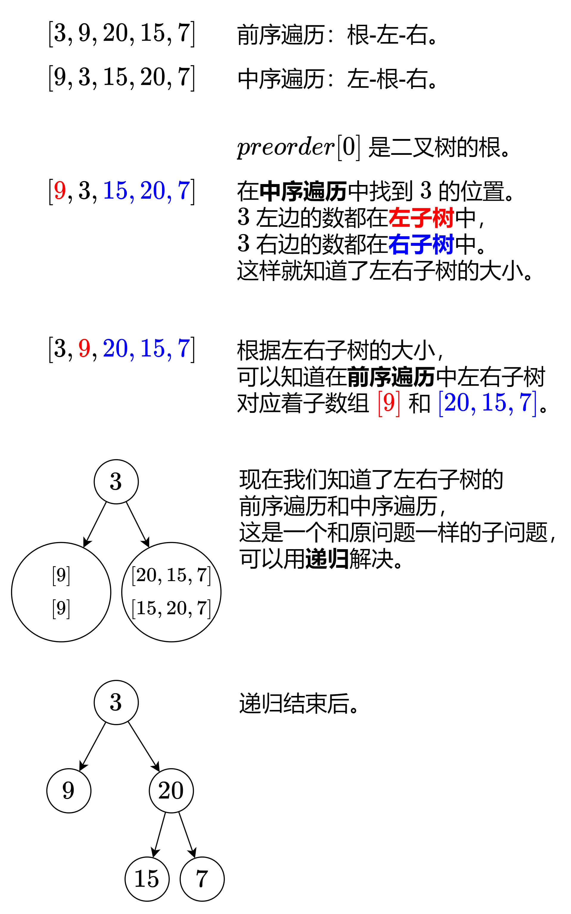

# 二叉树全面回顾

##  基础知识

Java实现结构

```java
    public class TreeNode {
        int val;
        TreeNode left;
        TreeNode right;
        TreeNode() {}
        TreeNode(int val) { this.val = val; }
        TreeNode(int val, TreeNode left, TreeNode right) {
            this.val = val;
            this.left = left;
            this.right = right;
        }
    }

    public static void main(String[] args) {
        // 创建叶子节点
        TreeNode node4 = new TreeNode(4);
        TreeNode node5 = new TreeNode(5);
        TreeNode node6 = new TreeNode(6);
        TreeNode node7 = new TreeNode(7);

        // 创建中间层节点
        TreeNode node2 = new TreeNode(2, node4, node5);
        TreeNode node3 = new TreeNode(3, node6, node7);

        // 创建根节点
        TreeNode root = new TreeNode(1, node2, node3);
    }
```


### 如何找到叶子节点：

```java
if (root.left == null && root.right == null) {
    // 当是叶子节点的时候，开始处理
    res += listToInt(path);
    return;
}
```


### 深度优先遍历DFS（递归） 

深度优先遍历：
对每一个可能的分支路径深入到不能再深入为止，而且每个结点只能访问一次。对每一个可能的分支路径深入到不能再深入为止，而且每个结点只能访问一次。
要特别注意的是，二叉树的深度优先遍历比较特殊，可以细分为先序遍历、中序遍历、后序遍历。具体说明如下：

先序遍历：对任一子树，先访问根，然后遍历其左子树，最后遍历其右子树。
中序遍历：对任一子树，先遍历其左子树，然后访问根，最后遍历其右子树。
后序遍历：对任一子树，先遍历其左子树，然后遍历其右子树，最后访问根。

前序遍历（中左右）

```CPP
void traversal(TreeNode* cur, vector<int>& vec) {
    if (cur == NULL) return;
    vec.push_back(cur->val);    // 中 ，同时也是处理节点逻辑的地方
    traversal(cur->left, vec);  // 左
    traversal(cur->right, vec); // 右
}
```

中序遍历（左中右）

```CPP
void traversal(TreeNode* cur, vector<int>& vec) {
    if (cur == NULL) return;
    traversal(cur->left, vec);  // 左
    vec.push_back(cur->val);    // 中 ，同时也是处理节点逻辑的地方
    traversal(cur->right, vec); // 右
}
```

后序遍历（左右中）

```CPP
void traversal(TreeNode* cur, vector<int>& vec) {
    if (cur == NULL) return;
    traversal(cur->left, vec);  // 左
    traversal(cur->right, vec); // 右
    vec.push_back(cur->val);    // 中 ，同时也是处理节点逻辑的地方
}
```

[剑指 Offer II 049. 从根节点到叶节点的路径数字之和](https://leetcode.cn/problems/3Etpl5/)

难度中等49

给定一个二叉树的根节点 `root` ，树中每个节点都存放有一个 `0` 到 `9` 之间的数字。

每条从根节点到叶节点的路径都代表一个数字：

- 例如，从根节点到叶节点的路径 `1 -> 2 -> 3` 表示数字 `123` 。

计算从根节点到叶节点生成的 **所有数字之和** 。

**叶节点** 是指没有子节点的节点。

 

**示例 1：**


```
输入：root = [1,2,3]
输出：25
解释：
从根到叶子节点路径 1->2 代表数字 12
从根到叶子节点路径 1->3 代表数字 13
因此，数字总和 = 12 + 13 = 25
```

```java
class Solution {
    public int sumNumbers(TreeNode root) {
        return dfs(root,0);
    }
    int dfs(TreeNode root,int preSum){
        if(root == null) return 0;
        int sum = preSum*10+root.val;
        if(root.left==null && root.right == null){
            return sum;
        }
        return dfs(root.left,sum) + dfs(root.right,sum);
    }
}
```


### 广度优先遍历BFS（队列）

相关题解：[0102.二叉树的层序遍历](https://programmercarl.com/0102.二叉树的层序遍历.html)

```CPP
vector<vector<int>> levelOrder(TreeNode* root) {
    queue<TreeNode*> que;
    if (root != NULL) que.push(root);
    vector<vector<int>> result;
    while (!que.empty()) {
        int size = que.size();
        vector<int> vec;
        for (int i = 0; i < size; i++) {// 这里一定要使用固定大小size，不要使用que.size()
            TreeNode* node = que.front();
            que.pop();
            vec.push_back(node->val);   // 节点处理的逻辑
            if (node->left) que.push(node->left);
            if (node->right) que.push(node->right);
        }
        result.push_back(vec);
    }
    return result;
}

```


可以直接解决如下题目：

* [0102.二叉树的层序遍历](https://programmercarl.com/0102.二叉树的层序遍历.html)
* [0199.二叉树的右视图](https://github.com/youngyangyang04/leetcode/blob/master/problems/0199.二叉树的右视图.md)
* [0637.二叉树的层平均值](https://github.com/youngyangyang04/leetcode/blob/master/problems/0637.二叉树的层平均值.md) 
* [0104.二叉树的最大深度 （迭代法）](https://programmercarl.com/0104.二叉树的最大深度.html)

* [0111.二叉树的最小深度（迭代法）](https://programmercarl.com/0111.二叉树的最小深度.html)
* [0222.完全二叉树的节点个数（迭代法）](https://programmercarl.com/0222.完全二叉树的节点个数.html)


### 深度优先遍历DFS-非递归的方式 

- 二叉搜索树


#### DFS前序遍历

**java 实现**

完全二叉树的非递归遍历前序遍历， 中间，左边，右边

```java
public List<Integer> preorderTraversal(TreeNode root){
    List<Integer> lists = new ArrayList<>();
    if(root == null){
        return lists;
    }
    Stack<TreeNode> stack = new Stack<>();
    //根节点先入栈
    stack.push(root);
    TreeNode current = null;
    while(!stack.isEmpty()){
        current = stack.pop();
        lists.add(current.val);

        //这里注意，要先压入右子结点，再压入左节点。因为栈是先进后出
        if(current.right != null){
            stack.push(current.right);
        }
        if(current.left != null){
            stack.push(current.left);
        }
    }
    return lists;
}
```

**栈信息**

我们可以加一点 debug 日志，把访问的节点和 stack 的内容输出出来。

```java
public List<Integer> preorderTraversal(TreeNode root){
    List<Integer> lists = new ArrayList<>();
    if(root == null){
        return lists;
    }
    Stack<TreeNode> stack = new Stack<>();
    //根节点先入栈
    stack.push(root);
    System.out.println("【根节点】root.value="+root.val+" 入栈，STACK " + root);
    TreeNode current = null;
    while(!stack.isEmpty()){
        current = stack.pop();
        lists.add(current.val);
        System.out.println("\n【出栈】"+current.val+"，STACK " + lists);
        System.out.println("【添加】添加 "+current.val+" 到 LIST" + lists);

        //这里注意，要先压入右子结点，再压入左节点。因为栈是先进后出
        if(current.right != null){
            stack.push(current.right);
            System.out.println("【右节点】入栈 "+current.right.val+" 到 STACK " + stack);
        }
        if(current.left != null){
            stack.push(current.left);
            System.out.println("【左节点】入栈 "+current.left.val+" 到 STACK " + stack);
        }
    }
    return lists;
}
```


> 前序遍历就是：[4, 2, 1, 3, 6, 5, 7]


重新执行以下，日志如下：

```sh
【根节点】root.value=4 入栈，STACK (4: (2: (1: null,null),(3: null,null)),(6: (5: null,null),(7: null,null)))

【出栈】4，STACK []
【添加】添加 4 到 LIST[4]
【右节点】入栈 6 到 STACK [(6: (5: null,null),(7: null,null))]
【左节点】入栈 2 到 STACK [(6: (5: null,null),(7: null,null)), (2: (1: null,null),(3: null,null))]

【出栈】2，STACK [4]
【添加】添加 2 到 LIST[4, 2]
【右节点】入栈 3 到 STACK [(6: (5: null,null),(7: null,null)), (3: null,null)]
【左节点】入栈 1 到 STACK [(6: (5: null,null),(7: null,null)), (3: null,null), (1: null,null)]

【出栈】1，STACK [4, 2]
【添加】添加 1 到 LIST[4, 2, 1]

【出栈】3，STACK [4, 2, 1]
【添加】添加 3 到 LIST[4, 2, 1, 3]

【出栈】6，STACK [4, 2, 1, 3]
【添加】添加 6 到 LIST[4, 2, 1, 3, 6]
【右节点】入栈 7 到 STACK [(7: null,null)]
【左节点】入栈 5 到 STACK [(7: null,null), (5: null,null)]

【出栈】5，STACK [4, 2, 1, 3, 6]
【添加】添加 5 到 LIST[4, 2, 1, 3, 6, 5]

【出栈】7，STACK [4, 2, 1, 3, 6, 5]
【添加】添加 7 到 LIST[4, 2, 1, 3, 6, 5, 7]
[4, 2, 1, 3, 6, 5, 7]
```

 


#### DFS中序遍历

>  中序遍历的时候 访问到的元素是从小到大顺序排列的。

下面是递归遍历的模板

```java
中序遍历过程模板
public void inorder(TreeNode root){
        if (root == null) return ;    //终止条件
        inorder(root.left);           //访问左子树
        对当前节点进行一些操作          //访问根节点-----在遍历过程中希望实现的操作
        inorder(root.right);          //访问右子树
    }
```


非递归的方式就是用栈来存取走过的路


```java
class Solution {
    public List<Integer> inorderTraversal(TreeNode root) {
        //前中后
        ArrayList<Integer> list = new ArrayList<>();
        if (root==null) return list;
        ArrayDeque<TreeNode> stack = new ArrayDeque<>();
        TreeNode cur = root;
        while (cur!=null||!stack.isEmpty()){
            while (cur!=null){
                stack.push(cur);
                cur = cur.left;//找到最左边的位置
            }
            //stack 先进后出，这个peek元素就是最左边的，就是最后进去的那个元素。
            cur = stack.pop();//找到最左边的了
            list.add(cur.val);
            cur = cur.right;//开始访问右边的的了
        }
        return list;
    }
}
```


> 我靠，双端队列，这个offer是插入尾部，这个push是addFirst，真是服了。
>
> Deque 提供了双端的插入与移除操作，如下表：
>
> |         |                  | First Element (Head) |                  | Last Element (Tail) |
> | ------- | ---------------- | -------------------- | ---------------- | ------------------- |
> |         | Throws exception | Special value        | Throws exception | Special value       |
> | Insert  | addFirst(e)      | offerFirst(e)        | addLast(e)       | offerLast(e)        |
> | Remove  | removeFirst()    | pollFirst()          | removeLast()     | pollLast()          |
> | Examine | getFirst()       | peekFirst()          | getLast()        | peekLast()          |
>
> Deque 和 Queue 方法的的对应关系如下：
>
> | Queue Method | Equivalent Deque Method |
> | ------------ | ----------------------- |
> | add(e)       | addLast(e)              |
> | offer(e)     | offerLast(e)            |
> | remove()     | removeFirst()           |
> | poll()       | pollFirst()             |
> | element()    | getFirst()              |
> | peek()       | peekFirst()             |
>
> Deque 和 Stack 方法的对应关系如下：
>
> | Stack Method | Equivalent Deque Method |
> | ------------ | ----------------------- |
> | push(e)      | addFirst(e)             |
> | pop()        | removeFirst()           |
> | peek()       | peekFirst()             |


#### DFS后序遍历：

**思路**

①先序遍历顺序：根节点-左孩子-右孩子

②后序遍历顺序：左孩子-右孩子-根节点

③后序遍历倒过来：根节点-右孩子-左孩子

①和③对比发现，访问顺序只有左孩子和右孩子颠倒了一下

**思路：**

第一步，将二叉树按照先序非递归算法进行遍历，

注意在入栈的时候左右孩子入栈的顺序，先左后右。

第二步，将遍历得到的结果进行倒置。 思路牛逼666

```java
class Solution {
    public List<Integer> postorderTraversal(TreeNode root) {
        //后续遍历的非递归的实现
        //后序是 左 右 中，倒过来就是 中 右 左 stack就是中，左，右
        LinkedList<Integer> list = new LinkedList<>();
        if (root==null) return list;
        ArrayDeque<TreeNode> stack = new ArrayDeque<>();
        stack.push(root);
        while (!stack.isEmpty()){
            TreeNode pop = stack.pop();
            list.addFirst(pop.val);//直接添加到头部就可以反过来了
            if (pop.left!=null){
                stack.push(pop.left);
            }
            if (pop.right!=null){
                stack.push(pop.right);
            }
        }
        return list;
    }
}
```


> 也可以直接reverse整个的list的结果：
>
> ```java
> class Solution {
> public List<Integer> postorderTraversal(TreeNode root) {
>   //非递归
>   // 就是先序的反过来的方式 左 右 中，
>   // 中 右 左 饭过来
>   LinkedList<Integer> list = new LinkedList<>();
>   if (root==null) return list;
>   ArrayDeque<TreeNode> stack = new ArrayDeque<>();
>   stack.push(root);
>   while (!stack.isEmpty()){
>       TreeNode curr = stack.pop();
>       list.add(curr.val);
>       if(curr.left!=null){
>           stack.push(curr.left);
>       }
>       if(curr.right!=null){
>           stack.push(curr.right);
>       }
>   }
>   Collections.reverse(list);
>   return list;
> }
> }
> ```
>
> 


### 如何前序中序还原二叉树

一张图：


[105. 从前序与中序遍历序列构造二叉树](https://leetcode.cn/problems/construct-binary-tree-from-preorder-and-inorder-traversal/)

给定两个整数数组 `preorder` 和 `inorder` ，其中 `preorder` 是二叉树的**先序遍历**， `inorder` 是同一棵树的**中序遍历**，请构造二叉树并返回其根节点。

**示例 1:**


```
输入: preorder = [3,9,20,15,7], inorder = [9,3,15,20,7]
输出: [3,9,20,null,null,15,7]
```

**示例 2:**

```
输入: preorder = [-1], inorder = [-1]
输出: [-1]
```

 

**提示:**

- `1 <= preorder.length <= 3000`
- `inorder.length == preorder.length`
- `-3000 <= preorder[i], inorder[i] <= 3000`
- `preorder` 和 `inorder` 均 **无重复** 元素
- `inorder` 均出现在 `preorder`
- `preorder` **保证** 为二叉树的前序遍历序列
- `inorder` **保证** 为二叉树的中序遍历序列



```java
class Solution {
    // 存储 inorder 中值到索引的映射
    HashMap<Integer, Integer> valToIndex = new HashMap<>();//由于是不存在重复的元素，因此可以直接用map存储下表
    public TreeNode buildTree(int[] preorder, int[] inorder) {
        for (int i = 0; i < inorder.length; i++) {
            valToIndex.put(inorder[i], i);
        }
        return build(preorder, 0, preorder.length-1 , inorder, 0, inorder.length-1);
    }
    TreeNode build(int[] preorder,int ps,int pe,int[] inorder,int is,int ie){
        //这里的ps和pe是先序遍历的区间
        if (ps>pe) return null;
        TreeNode root = new TreeNode(preorder[ps]);//获得根节点的值，构造树
        Integer idx = valToIndex.get(root.val);//中序遍历的分界点
        int leftsize = idx - is;//左子树的大小
        // [is,..... idx-1,idx,idx+1,ie];
        root.left = build(preorder, ps+1, ps+leftsize, inorder, is, idx);
        root.right = build(preorder, ps+1+leftsize, pe, inorder, idx+1,ie);
        return root;
    }
}
```


### 二叉树深度

```CPP
int getDepth(TreeNode* node) {
    if (node == NULL) return 0;
    return 1 + max(getDepth(node->left), getDepth(node->right));
}
```

### 二叉树节点数量

```CPP
int countNodes(TreeNode* root) {
    if (root == NULL) return 0;
    return 1 + countNodes(root->left) + countNodes(root->right);
}
```


## 常见题型


### [662. 二叉树最大宽度](https://leetcode.cn/problems/maximum-width-of-binary-tree/) 回顾深度优先遍历和广度优先遍历的综合体

给你一棵二叉树的根节点 `root` ，返回树的 **最大宽度** 。

树的 **最大宽度** 是所有层中最大的 **宽度** 。

每一层的 **宽度** 被定义为该层最左和最右的非空节点（即，两个端点）之间的长度。将这个二叉树视作与满二叉树结构相同，两端点间会出现一些延伸到这一层的 `null` 节点，这些 `null` 节点也计入长度。

题目数据保证答案将会在 **32 位** 带符号整数范围内。

 

**示例 1：**


```
输入：root = [1,3,2,5,3,null,9]
输出：4
解释：最大宽度出现在树的第 3 层，宽度为 4 (5,3,null,9) 。
```

其实，通过观察我们会发现一个规律：假设根节点的编号为1，左子节点为2，右子节点为3……以此类推，会得出如下结论：

root的编号=N
root.left的编号=2 * N
root.right的编号=2 * N + 1

那么我们通过编号就可以计算同层中两个节点直接的距离了。我们还是以root = [1,3,2,5,null,null,9,6,null,7]为例，看看通过编号怎么去解题。


对于编号的存储，我们可以创建一个对象，里面包含编号和TreeNode这两个变量，也可以使用JDK内置的Pair对象，由于本题中，节点的val值没有任何用处，所以，编号我就存储到了val属性值中，这样更易于存储和获取。具体实现，请参照：4.1> 代码1：广度优先 + 节点编号

```java
class Solution {
    public int widthOfBinaryTree(TreeNode root) {
        int res = 0;
        ArrayDeque<TreeNode> queue = new ArrayDeque<TreeNode>();
        queue.offer(new TreeNode(1,root.left,root.right));
        while (!queue.isEmpty()){
            int size = queue.size();
            int r = -1,l=-1;
            for (int i = 0; i < size; i++) {
                TreeNode poll = queue.poll();
                r = poll.val;
                if (l == -1) l = poll.val;
                if (poll.left!=null){
                    queue.add(new TreeNode(2*poll.val,poll.left.left,poll.left.right));
                }
                if (poll.right!=null){
                    queue.add(new TreeNode(2*poll.val+1,poll.right.left,poll.right.right));
                }
            }
            res  = Math.max(res,r-l+1);
        }
        return res;
    }
}
```


#### 深度优先遍历

既然广度优先可以解决该问题，那么理论上，通过深度优先也是可以解题的。由于深度优先，是先从最上层沿着一条父子关系链遍历的下层，类似一个分支一个分支的去遍历，那么，我们就需要一个Map来帮助我们存储层级与当前层级最小值的对应关系了——即：key=level，value=minValue。那么，我们每当遍历一个节点时，就可以通过当前的level值去获取最小节点值：

如果Map中不存在该level的最小值，则将该节点的值放入到map中作为当前level下的最小值；
如果存在，那么则用当前节点值node.val减去从Map中获取的当前level下的最小值；


```java
class Solution {
    int res = 0;
    Map<Integer,Integer> map = new HashMap<>();// level,minVal;
    public int widthOfBinaryTree(TreeNode root) {
        deep(root,1,1);
        return res;
    }
    void deep(TreeNode root,int nodeIdx,int level){
        if (root==null) return;
        map.putIfAbsent(level,nodeIdx);
        res = Math.max(res,nodeIdx-map.get(level)+1);//上面是第一轮循环已经添加过了
        deep(root.left,2*nodeIdx,level+1);
        deep(root.right,2*nodeIdx+1,level+1);
    }
}
```


### [129. 求根节点到叶节点数字之和](https://leetcode.cn/problems/sum-root-to-leaf-numbers/)

给你一个二叉树的根节点 `root` ，树中每个节点都存放有一个 `0` 到 `9` 之间的数字。

每条从根节点到叶节点的路径都代表一个数字：

- 例如，从根节点到叶节点的路径 `1 -> 2 -> 3` 表示数字 `123` 。

计算从根节点到叶节点生成的 **所有数字之和** 。

**叶节点** 是指没有子节点的节点。

 

**示例 1：**


```
输入：root = [1,2,3]
输出：25
解释：
从根到叶子节点路径 1->2 代表数字 12
从根到叶子节点路径 1->3 代表数字 13
因此，数字总和 = 12 + 13 = 25
```


```java
class Solution {
    List<Integer> path = new ArrayList<>();
    int res = 0;
    public int sumNumbers(TreeNode root) {
        // 如果节点为0，那么就返回0
        if (root == null) return 0;
        // 首先将根节点放到集合中
        path.add(root.val);
        // 开始递归
        recur(root);
        return res;
    }

    public void recur(TreeNode root){
        if (root.left == null && root.right == null) {
            // 当是叶子节点的时候，开始处理
            res += listToInt(path);
            return;
        }

        if (root.left != null){
            // 注意有回溯
            path.add(root.left.val);
            recur(root.left);
            path.remove(path.size() - 1);
        }
        if (root.right != null){
            // 注意有回溯
            path.add(root.right.val);
            recur(root.right);
            path.remove(path.size() - 1);
        }
        return;
    }
    public int listToInt(List<Integer> path){
        int sum = 0;
        for (Integer num:path){
            // sum * 10 表示进位
            sum = sum * 10 + num;
        }
        return sum;
    }
}

```


```java
class Solution {

    public int sumNumbers(TreeNode root) {
        if(root==null) return 0;
        return recur(root,0);
    }
    int recur(TreeNode root,int sum){
        if(root==null) return 0;
        sum=sum*10+root.val;
        if(root.left==null&&root.right==null) return sum;
        return recur(root.left,sum)+recur(root.right,sum);
    }
}
```


### [226. 翻转二叉树](https://leetcode.cn/problems/invert-binary-tree/)

给你一棵二叉树的根节点 `root` ，翻转这棵二叉树，并返回其根节点。

**示例 1：**


```
输入：root = [4,2,7,1,3,6,9]
输出：[4,7,2,9,6,3,1]
```


> Q： 为何需要暂存 rootrootroot 的左子节点？
> A： 在递归右子节点 “root.left=invertTree(root.right);root.left = invertTree(root.right);root.left=invertTree(root.right);” 执行完毕后， root.leftroot.leftroot.left 的值已经发生改变，此时递归左子节点 invertTree(root.left)invertTree(root.left)invertTree(root.left) 则会出问题。


```java
class Solution {
    public TreeNode invertTree(TreeNode root) {
        if(root == null) return null;
        TreeNode left = invertTree(root.left);
        TreeNode right = invertTree(root.right);
        root.left = right;
        root.right = left;
        return root;
    }
}
```


### [101. 对称二叉树](https://leetcode.cn/problems/symmetric-tree/)

给你一个二叉树的根节点 `root` ， 检查它是否轴对称。 

**示例 1：**


```
输入：root = [1,2,2,3,4,4,3]
输出：true
```

```java
class Solution {
    public boolean isSymmetric(TreeNode root) {
        if(root == null) return true;
        return helper(root.left,root.right);
    }
    private boolean helper(TreeNode left,TreeNode right){
        if(left==null&&right!=null) return false;
        else if(left!=null&&right==null) return false;
        else if(left==null&&right==null) return true;
        else if(left.val!=right.val) return false;
        boolean outside = helper(left.left,right.right);
        boolean inside = helper(left.right,right.left);
        return outside&&inside;
    } 
}
```


### 序列化与反序列化二叉树：

```java
public String serialize(TreeNode root) {
        if (root==null) return "";
        StringBuilder sb = new StringBuilder();
        sb.append("[");
        LinkedList<TreeNode> queue = new LinkedList<>();
        queue.offer(root);
        while (!queue.isEmpty()){
//            只要不是空的
            TreeNode polled = queue.poll();
            if (polled!=null){
                sb.append(""+polled.val);
                queue.offer(polled.left);
                queue.offer(polled.right);

            }else {
                sb.append("null");
            }
            sb.append(",");
        }
        sb.append("]");
        return sb.toString();
    }

    // Decodes your encoded data to tree.
    public TreeNode deserialize(String data) {
        if (data=="") return null;
        String substring = data.substring(1, data.length() - 1);
        String[] datalist = substring.split(",");
//        split之后就可以得到字符串列表了
        TreeNode root = new TreeNode(Integer.parseInt(datalist[0]));
        LinkedList<TreeNode> queue = new LinkedList<>();
        queue.offer(root);
        int i =1;
        while (!queue.isEmpty()){
            TreeNode poll = queue.poll();
            if (!"null".equals(datalist[i])){
                poll.left =  new TreeNode(Integer.parseInt(datalist[i]));
                queue.offer(poll.left);
            }
            i++;//不能在if里面，这个地方不管是null还是有数据都得是i++；
            if (!"null".equals(datalist[i])){
                poll.right =  new TreeNode(Integer.parseInt(datalist[i]));
                queue.offer(poll.right);
            }
            i++;
        }
        return root;

    }
```


### [236. 二叉树的最近公共祖先](https://leetcode.cn/problems/lowest-common-ancestor-of-a-binary-tree/)

给定一个二叉树, 找到该树中两个指定节点的最近公共祖先。

[百度百科](https://baike.baidu.com/item/最近公共祖先/8918834?fr=aladdin)中最近公共祖先的定义为：“对于有根树 T 的两个节点 p、q，最近公共祖先表示为一个节点 x，满足 x 是 p、q 的祖先且 x 的深度尽可能大（**一个节点也可以是它自己的祖先**）。”

 

**示例 1：**


```
输入：root = [3,5,1,6,2,0,8,null,null,7,4], p = 5, q = 1
输出：3
解释：节点 5 和节点 1 的最近公共祖先是节点 3 。
```

**示例 2：**


```
输入：root = [3,5,1,6,2,0,8,null,null,7,4], p = 5, q = 4
输出：5
解释：节点 5 和节点 4 的最近公共祖先是节点 5 。因为根据定义最近公共祖先节点可以为节点本身。
```

**示例 3：**

```
输入：root = [1,2], p = 1, q = 2
输出：1
```


如果找到一个节点，发现左子树出现结点p，右子树出现节点q，或者 左子树出现结点q，右子树出现节点p，那么该节点就是节点p和q的最近公共祖先。 即情况一： 


情况二： 


如果递归函数有返回值，如何区分要搜索一条边，还是搜索整个树呢？

搜索一条边的写法：

```CPP
if (递归函数(root->left)) return ;

if (递归函数(root->right)) return ;
```

搜索整个树写法：

```CPP
left = 递归函数(root->left);  // 左
right = 递归函数(root->right); // 右
left与right的逻辑处理;         // 中 
```

看出区别了没？

**在递归函数有返回值的情况下：如果要搜索一条边，递归函数返回值不为空的时候，立刻返回，如果搜索整个树，直接用一个变量left、right接住返回值，这个left、right后序还有逻辑处理的需要，也就是后序遍历中处理中间节点的逻辑（也是回溯）**。

那么为什么要遍历整棵树呢？直观上来看，找到最近公共祖先，直接一路返回就可以了。

如图：


就像图中一样直接返回7，多美滋滋。

但事实上还要遍历根节点右子树（即使此时已经找到了目标节点了），也就是图中的节点4、15、20。

因为在如下代码的后序遍历中，如果想利用left和right做逻辑处理， 不能立刻返回，而是要等left与right逻辑处理完之后才能返回。

```CPP 
left = 递归函数(root->left);  // 左
right = 递归函数(root->right); // 右
left与right的逻辑处理;         // 中 
```

所以此时大家要知道我们要遍历整棵树。

完整流程图如下：


```java
class Solution {
    public TreeNode lowestCommonAncestor(TreeNode root, TreeNode p, TreeNode q) {
        if (root == null || root == p || root == q) { // 递归结束条件
            return root;
        }

        // 后序遍历
        TreeNode left = lowestCommonAncestor(root.left, p, q);
        TreeNode right = lowestCommonAncestor(root.right, p, q);

        if(left == null && right == null) { // 若未找到节点 p 或 q
            return null;
        }else if(left == null && right != null) { // 若找到一个节点
            return right;
        }else if(left != null && right == null) { // 若找到一个节点
            return left;
        }else { // 若找到两个节点
            return root;
        }
    }
}
```


### [114. 二叉树展开为链表](https://leetcode.cn/problems/flatten-binary-tree-to-linked-list/)

给你二叉树的根结点 `root` ，请你将它展开为一个单链表：

- 展开后的单链表应该同样使用 `TreeNode` ，其中 `right` 子指针指向链表中下一个结点，而左子指针始终为 `null` 。
- 展开后的单链表应该与二叉树 [**先序遍历**](https://baike.baidu.com/item/先序遍历/6442839?fr=aladdin) 顺序相同。

 

**示例 1：**


```
输入：root = [1,2,5,3,4,null,6]
输出：[1,null,2,null,3,null,4,null,5,null,6]
```

**示例 2：**

```
输入：root = []
输出：[]
```

本题需要将二叉树转化为列表，对于二叉树的题目，无非就以下几种解题思路：

先序遍历（深度优先搜索）
中序遍历（深度优先搜索）（尤其二叉搜索树）
后序遍历（深度优先搜索）
层序遍历（广度优先搜索）（尤其按照层来解决问题的时候）
序列化与反序列化（结构唯一性问题）
根据我们的观察，本题应该是使用深度优先搜索的方式来解决，我们看看是怎样变成一个列表的。如图所示：


其实是分为三步：

首先将根节点的左子树变成链表
其次将根节点的右子树变成链表
最后将变成链表的右子树放在变成链表的左子树的最右边
这就是一个递归的过程，递归的一个非常重要的点就是：不去管函数的内部细节是如何处理的，我们只看其函数作用以及输入与输出。对于函数flatten来说：

函数作用：将一个二叉树，原地将它展开为链表
输入：树的根节点
输出：无
那我们就直接根据三步来写程序就可以了

代码

```java
class Solution {
    public void flatten(TreeNode root) {
        if(root == null){
            return ;
        }
        //将根节点的左子树变成链表
        flatten(root.left);
        //将根节点的右子树变成链表
        flatten(root.right);
        TreeNode temp = root.right;
        //把树的右边换成左边的链表
        root.right = root.left;
        //记得要将左边置空
        root.left = null;
        //找到树的最右边的节点
        while(root.right != null) root = root.right;
        //把右边的链表接到刚才树的最右边的节点
        root.right = temp;
    }
}


```


### 纠正二叉搜索树

输入：root = [1,3,null,null,2]
输出：[3,1,null,null,2]
解释：3 不能是 1 的左孩子，因为 3 > 1 。交换 1 和 3 使二叉搜索树有效。

```java
class Solution {
    TreeNode pre = new TreeNode(Integer.MIN_VALUE);
    TreeNode err1 = null;
    TreeNode err2 = null;
    public void recoverTree(TreeNode root) {
        inorder(root);
        int tmp = err1.val;
        err1.val = err2.val;
        err2.val = tmp;
    }
    void inorder(TreeNode root) {
        if(root == null) return;
        inorder(root.left);
        if(pre.val>root.val&&err1==null) err1=pre;//！不相邻，前大后小，第一个错误就要取大的
        if(pre.val>root.val&&err1!=null) err2=root;//哦哦哦哦哦！不相邻，前大后小，第二个错误就要取小的
        pre = root;
        inorder(root.right);

    }
}
```

```java
class Solution {
    public List<Integer> inorderTraversal(TreeNode root) {
        //非递归方式实现中序遍历
        List<Integer> res = new LinkedList();
        Deque<TreeNode> stack = new ArrayDeque<>();
        while(root!=null||!stack.isEmpty()) {
            while(root!=null){
                stack.push(root);
                root=root.left;
            }
            root = stack.pop();
            res.add(root.val);
            root = root.right;
        }
        return res;
    }
    
}
```


### [剑指 Offer II 044. 二叉树每层的最大值](https://leetcode.cn/problems/hPov7L/)-层序遍历


给定一棵二叉树的根节点 `root` ，请找出该二叉树中每一层的最大值。


**示例1：**

```
输入: root = [1,3,2,5,3,null,9]
输出: [1,3,9]
解释:
          1
         / \
        3   2
       / \   \  
      5   3   9 
```


```java
class Solution {
    public List<Integer> largestValues(TreeNode root) {
        ArrayDeque<TreeNode> stack =  new ArrayDeque<>();
        List<Integer> ans = new LinkedList<Integer>();
        if(root == null) return ans;
        stack.push(root);
        
        while(!stack.isEmpty()){
            int size = stack.size();
            int tempMax =Integer.MIN_VALUE;
            for(int i = 0;i<size;i++){
                TreeNode poped = stack.pop();
                if(poped.left!=null) stack.addLast(poped.left);
                if(poped.right!=null) stack.addLast(poped.right);
                tempMax = Math.max(tempMax,poped.val);
            }
            ans.add(tempMax);
        }
        return ans;

    }
}
```


### [剑指 Offer II 045. 二叉树最底层最左边的值](https://leetcode.cn/problems/LwUNpT/)-层序遍历

难度中等40

给定一个二叉树的 **根节点** `root`，请找出该二叉树的 **最底层 最左边** 节点的值。

假设二叉树中至少有一个节点。

 

**示例 1:**


```
输入: root = [2,1,3]
输出: 1
```

哈哈哈哈哈哈哈哈哈哈哈哈哈哈哈哈哈哈哈

写出来了

```java
class Solution {
    public int findBottomLeftValue(TreeNode root) {
        ArrayDeque<TreeNode> stack =  new ArrayDeque<>();
       int ans = 0;
        if(root == null) return ans;
        stack.push(root);
        
        while(!stack.isEmpty()){
            int size = stack.size();
            int tempMax =Integer.MIN_VALUE;
            ans = stack.peek().val;
            for(int i = 0;i<size;i++){
                TreeNode poped = stack.pop();
                if(poped.left!=null) stack.addLast(poped.left);
                if(poped.right!=null) stack.addLast(poped.right);
                tempMax = Math.max(tempMax,poped.val);
            }
            
        }
        return ans;
    }
}
```


### [剑指 Offer II 046. 二叉树的右侧视图](https://leetcode.cn/problems/WNC0Lk/)

难度中等43

给定一个二叉树的 **根节点** `root`，想象自己站在它的右侧，按照从顶部到底部的顺序，返回从右侧所能看到的节点值。

 

**示例 1:**


```
输入: [1,2,3,null,5,null,4]
输出: [1,3,4]
```


哈哈哈哈哈哈哈，层序遍历，每一层最右边的就是需要的右侧的试图

```java
class Solution {
    public List<Integer> rightSideView(TreeNode root) {
        ArrayDeque<TreeNode> stack =  new ArrayDeque<>();
        List<Integer> ans = new LinkedList<Integer>();
        if(root == null) return ans;
        stack.push(root);
        while(!stack.isEmpty()){
            int size = stack.size();
            
            for(int i = 0;i<size-1;i++){
                TreeNode poped = stack.pop();
                if(poped.left!=null) stack.addLast(poped.left);
                if(poped.right!=null) stack.addLast(poped.right);
            }
            TreeNode poped = stack.pop();
            ans.add(poped.val);
            if(poped.left!=null) stack.addLast(poped.left);
            if(poped.right!=null) stack.addLast(poped.right);
        }
        return ans;
    }
}

```

### [117. 填充每个节点的下一个右侧节点指针 II](https://leetcode.cn/problems/populating-next-right-pointers-in-each-node-ii/)

给定一个二叉树：

```
struct Node {
  int val;
  Node *left;
  Node *right;
  Node *next;
}
```

填充它的每个 next 指针，让这个指针指向其下一个右侧节点。如果找不到下一个右侧节点，则将 next 指针设置为 `NULL` 。

初始状态下，所有 next 指针都被设置为 `NULL` 。

 

**示例 1：**


```
输入：root = [1,2,3,4,5,null,7]
输出：[1,#,2,3,#,4,5,7,#]
解释：给定二叉树如图 A 所示，你的函数应该填充它的每个 next 指针，以指向其下一个右侧节点，如图 B 所示。序列化输出按层序遍历顺序（由 next 指针连接），'#' 表示每层的末尾。
```


```java
class Solution {
    public Node connect(Node root) {
        Node dummy = root;
        Queue<Node> list = new LinkedList<>();//stack 实现层序遍历
        if(root==null) return root;
        list.add(root);
        while(!list.isEmpty()){
            Node curr = null;
            Node prev = null;
            int size = list.size();
            for(int i = 0;i<size;i++){
                if(i==0){
                    prev = list.poll();
                    curr = prev;
                }else{
                    curr = list.poll();
                    prev.next = curr;
                    prev = prev.next;
                }
                if(curr.left!=null) list.add(curr.left);
                if(curr.right!=null) list.add(curr.right);
            }
            prev.next = null;
        }
        return dummy;
    }
}
```


### [919. 完全二叉树插入器](https://leetcode.cn/problems/complete-binary-tree-inserter/)

**完全二叉树** 是每一层（除最后一层外）都是完全填充（即，节点数达到最大）的，并且所有的节点都尽可能地集中在左侧。

设计一种算法，将一个新节点插入到一个完整的二叉树中，并在插入后保持其完整。

实现 `CBTInserter` 类:

- `CBTInserter(TreeNode root)` 使用头节点为 `root` 的给定树初始化该数据结构；
- `CBTInserter.insert(int v)` 向树中插入一个值为 `Node.val == val`的新节点 `TreeNode`。使树保持完全二叉树的状态，**并返回插入节点** `TreeNode` **的父节点的值**；
- `CBTInserter.get_root()` 将返回树的头节点。

 


**示例 1：**


```java
class CBTInserter {
    List<TreeNode> list = new ArrayList<>();
    int idx = 0;
    public CBTInserter(TreeNode root) {
        list.add(root);
        int cur =0;
        //这里就是把传进来的二叉树进行序列化
        while(cur<list.size()) {
            // 如果当前的长度比较长的话
            TreeNode node = list.get(cur);
            if(node.left!=null) list.add(node.left);
            if(node.right!=null) list.add(node.right);
            cur++;
        }
    }
    
    public int insert(int val) {
        TreeNode node = new TreeNode(val);
        while(list.get(idx).left!=null && list.get(idx).right!=null)
            idx++;
        TreeNode father = list.get(idx);//找到了左边或者右边的子节点有位置的地方
        if(father.left==null) father.left = node;
        else if(father.right == null) father.right =node;
        list.add(node);
        return father.val;
    }
    
    public TreeNode get_root() {
        return list.get(0);
    }
}
```


### [98. 验证二叉搜索树](https://leetcode.cn/problems/validate-binary-search-tree/)

给你一个二叉树的根节点 `root` ，判断其是否是一个有效的二叉搜索树。

**有效** 二叉搜索树定义如下：

- 节点的左子树只包含 **小于** 当前节点的数。
- 节点的右子树只包含 **大于** 当前节点的数。
- 所有左子树和右子树自身必须也是二叉搜索树。

 

**示例 1：**


```
输入：root = [2,1,3]
输出：true
```

```java
class Solution {
    public boolean isValidBST(TreeNode root) {
        if (root==null) return true;
        TreeNode leftNode = root.left;
        TreeNode rightNode = root.right;
        if (leftNode!=null){
            while (leftNode.right!=null){
                leftNode = leftNode.right;//左边子树的最大值
            }
            if (leftNode.val>=root.val) return false;
        }
        if (rightNode!=null){
            while (rightNode.left!=null){
                rightNode = rightNode.left;//右边子树的最小值
            }
            if (rightNode.val<=root.val) return false;
        }
        return isValidBST(root.left) && isValidBST(root.right);
    }
    //只要根节点大于左子树的最大值，小于右子树的最小值即可。

}
```


### [二叉树的最大路径和](http://www.nowcoder.com/practice/da785ea0f64b442488c125b441a4ba4a)

**解题思路：**

首先，考虑实现一个简化的函数 **maxGain**(node)，该函数计算二叉树中的一个节点的最大贡献值，具体而言，就是在以该节点为根节点的子树中寻找以该节点为起点的一条路径，使得该路径上的节点值之和最大。
具体而言，该函数的计算如下。
空节点的最大贡献值等于 0。
非空节点的最大贡献值等于节点值与其子节点中的最大贡献值之和（对于叶节点而言，最大贡献值等于节点值）

例如二叉树：root = [-10,9,20,null,null,15,7]

叶节点 9、15、7 的最大贡献值分别为 9、15、7。
得到叶节点的最大贡献值之后，再计算非叶节点的最大贡献值。节点 20 的最大贡献值等于 20+max(15,7)=35，节点 -10 的最大贡献值等于 −10+max(9,35)=25。
上述计算过程是递归的过程，因此，对根节点调用函数 maxGain，即可得到每个节点的最大贡献值。

根据函数 maxGain 得到每个节点的最大贡献值之后，如何得到二叉树的最大路径和？对于二叉树中的一个节点，该节点的最大路径和取决于该节点的值与该节点的左右子节点的最大贡献值，如果子节点的最大贡献值为正，则计入该节点的最大路径和，否则不计入该节点的最大路径和。维护一个全局变量 maxSum 存储最大路径和，在递归过程中更新 maxSum 的值，最后得到的 maxSum 的值即为二叉树中的最大路径和。

**图解**：


```java
int maxSum = Integer.MIN_VALUE;
public int maxPathSum (TreeNode root) {
    maxGain(root);
    return maxSum;
    // write code here
}
public int maxGain(TreeNode node){
    if (node==null) {
        return 0;
    }
    int leftGain = Math.max(maxGain(node.left), 0);// 最大贡献度大于0才会选择
    int rightGain = Math.max(maxGain(node.right), 0);
    int price = node.val +leftGain+rightGain;//这里是在计算当前路径的最大值
    maxSum = Math.max(maxSum, price);
    return node.val+Math.max(leftGain, rightGain);//这里是只能选择一边，不能都要。
}
```

