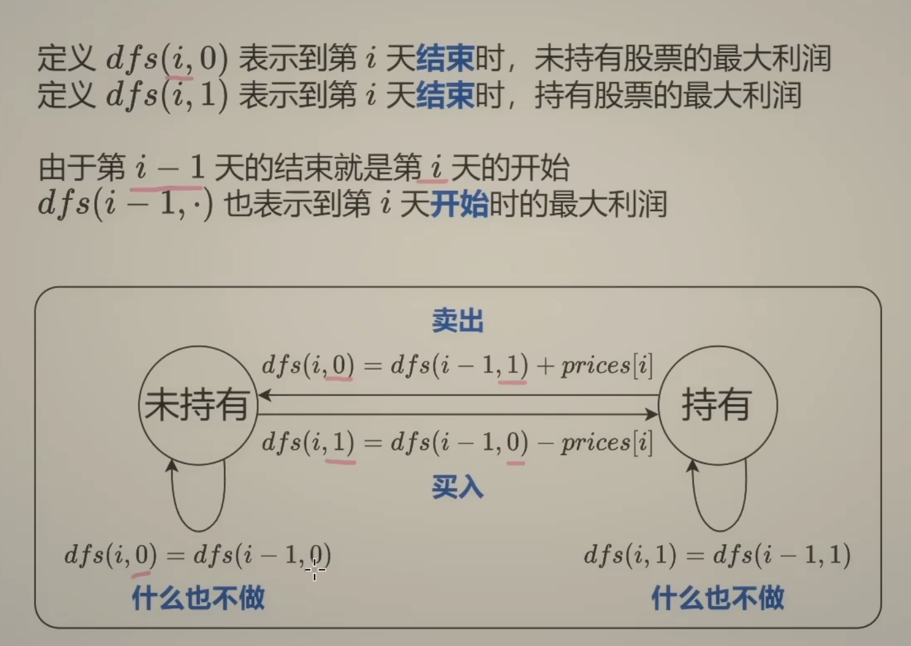

# Leetcode股票问题总结篇!

之前我们已经把力扣上股票系列的题目都讲过的，但没有来一篇股票总结，来帮大家高屋建瓴，所以总结篇这就来了！


## 121.卖股票的最佳时机

[动态规划：121.买卖股票的最佳时机](https://programmercarl.com/0121.买卖股票的最佳时机.html)，**股票只能买卖一次，问最大利润**。

【贪心解法】

取最左最小值，取最右最大值，那么得到的差值就是最大利润，代码如下：

```java
class Solution {
    public int maxProfit(int[] prices) {
        //扫描一遍 只要后一天比前一天大 就把这两天的差值加一下
        int profit =0;
        for(int i =1;i<prices.length;i++){
            if(prices[i]>prices[i-1]){
                profit+=(prices[i]-prices[i-1]);
            }
        }
        //[7, 1, 5, 6],当天卖出以后，当天还可以买入，所以其实可以 第二天买入,第三天卖出，第三天买入，第四天又卖出（（5-1）+ （6-5） === 6 - 1）。所以算法可以直接简化为只要今天比昨天大，就卖出。
        return profit;
    }
}
```

【动态规划】

- `dp[i][0]` 表示第 `i` 天不持有股票所得现金。
- `dp[i][1]` 表示第 `i` 天持有股票所得现金。

如果第 `i` 天持有股票即 `dp[i][1]`， 那么可以由两个状态推出来：

- 第 `i-1` 天就持有股票，那么就保持现状，所得现金就是昨天持有股票的所得现金 即：`dp[i - 1][1]`
- 第 `i-1` 天没有股票，第 `i` 天买入股票，所得现金就是买入今天的股票后所得现金即：`-prices[i]`

所以 `dp[i][1] = max(dp[i - 1][1], -prices[i])`;

如果第 `i` 天不持有股票即 `dp[i][0]`， 也可以由两个状态推出来：

- 第 `i-1` 天就不持有股票，那么就保持现状，所得现金就是昨天不持有股票的所得现金 即：`dp[i - 1][0]`
- 第 `i` 天卖出股票，所得现金就是按照今天股票价格卖出后所得现金即：`prices[i] + dp[i - 1][1]`

所以 `dp[i][0] = max(dp[i - 1][0], prices[i] + dp[i - 1][1])`;





代码如下：

和上面解析规划的不一样哈。

### 动态规划代码

```java
// 版本一
class Solution {
    public int maxProfit(int[] prices) {
        int n = prices.length;
        int[][] dp = new int[n+1][2];
        //dp[i][0]表示i天不持有股票 dp[i][1]表示持有股票
        if(n==0) return 0;
        dp[0][1] = -prices[0];
        for(int i = 1;i<n;i++){
	        //i-1没有股票，需要买股票-price[i],如果有股票，就保持就好了，也不能再买了。
            dp[i][1] = Math.max(dp[i-1][1],-prices[i]);
            //i-1有了的话，就卖出得到price[i]，或者i-1没有，就接着没有
            dp[i][0] = Math.max(dp[i-1][0],dp[i-1][1]+prices[i]);
        }
        return dp[n-1][0];
    }
}
```
* 时间复杂度：O(n)
* 空间复杂度：O(n)

使用滚动数组，代码如下：

### 滚动数组

```CPP
// 版本二 滚动数组
class Solution {
    public int maxProfit(int[] prices) {
        int n = prices.length;
        int[][] dp = new int[2][2];
        //dp[i][0]表示i天不持有股票 dp[i][1]表示持有股票
        if(n==0) return 0;
        dp[0][1] = -prices[0];
        for(int i = 1;i<n;i++){
            dp[i%2][1] = Math.max(dp[(i-1)%2][1],-prices[i]);
            //i-1有了的话，就卖出得到price[i]，或者i-1没有，就接着没有
            dp[i%2][0] = Math.max(dp[(i-1)%2][0],dp[(i-1)%2][1]+prices[i]);
        }
        return dp[(n-1)%2][0];
    }
}
```

* 时间复杂度：O(n)
* 空间复杂度：O(1)


## 122.买卖股票的最佳时机II

可以多次买卖股票，问最大收益。


【贪心解法】

收集每天的正利润便可，代码如下：

```CPP
class Solution {
public:
    int maxProfit(vector<int>& prices) {
        int result = 0;
        for (int i = 1; i < prices.size(); i++) {
            result += max(prices[i] - prices[i - 1], 0);
        }
        return result;
    }
};
```

* 时间复杂度：O(n)
* 空间复杂度：O(1)


【动态规划】

dp数组定义：

- `dp[i][0]` 表示第 `i` 天持有股票所得现金
- `dp[i][1]` 表示第 `i` 天不持有股票所得最多现金

递推公式

如果第 `i` 天持有股票即 `dp[i][0]`， 那么可以由两个状态推出来：

- 第 `i-1` 天就持有股票，那么就保持现状，所得现金就是昨天持有股票的所得现金 即：`dp[i - 1][0]`
- 第 `i` 天买入股票，所得现金就是昨天不持有股票的所得现金减去 今天的股票价格 即：`dp[i - 1][1] - prices[i]`


**注意这里和121唯一不同的地方，就是推导`dp[i][1]`的时候，第 `i` 天买入股票的情况。**

在[动态规划-股票问题总结篇#121.卖股票的最佳时机](https://sdk.vercel.ai/动态规划-股票问题总结篇#121.卖股票的最佳时机)中，因为股票全程只能买卖一次，所以如果买入股票，那么第 `i` 天持有股票即 `dp[i][1]` 一定就是 `-prices[i]`。

而本题，因为一只股票可以买卖多次，所以当第i天买入股票的时候，所持有的现金可能有之前买卖过的利润。

代码如下：（注意代码中的注释，标记了和121.买卖股票的最佳时机唯一不同的地方）

```java
class Solution {
    public int maxProfit(int[] prices) {
        int n = prices.length;
        int[][] dp = new int[2][2];
        //dp[i][0]表示i天不持有股票 dp[i][1]表示持有股票
        if(n==0) return 0;
        dp[0][1] = -prices[0];
        for(int i = 1;i<n;i++){
            //i-1没有的话，想要有股票就得买，就是i-1没有的时候的利润，减去当前的股价
            dp[i%2][1] = Math.max(dp[(i-1)%2][1],dp[(i-1)%2][0]-prices[i]);
            //i-1有了的话，就卖出得到price[i]，或者i-1没有，就接着没有
            dp[i%2][0] = Math.max(dp[(i-1)%2][0],dp[(i-1)%2][1]+prices[i]);
        }
        return dp[(n-1)%2][0];
    }
}
```

* 时间复杂度：O(n)
* 空间复杂度：O(n)


## 123.买卖股票的最佳时机III

最多买卖两次，问最大收益。

【动态规划】

一天一共就有五个状态，

0. 没有操作
1. 第一次买入
2. 第一次卖出
3. 第二次买入
4. 第二次卖出


```txt
`dp[i][j]`中 i表示第i天，j为 [0 - 4] 五个状态，`dp[i][j]`表示第i天状态j所剩最大现金。


达到dp[i][1]状态，有两个具体操作：

* 操作一：第i天买入股票了，那么dp[i][1] = dp[i-1][0] - prices[i]
* 操作二：第i天没有操作，而是沿用前一天买入的状态，即：dp[i][1] = dp[i - 1][1]

dp[i][1] = max(dp[i-1][0] - prices[i], dp[i - 1][1]);

同理dp[i][2]也有两个操作：

* 操作一：第i天卖出股票了，那么dp[i][2] = dp[i - 1][1] + prices[i]
* 操作二：第i天没有操作，沿用前一天卖出股票的状态，即：dp[i][2] = dp[i - 1][2]

所以dp[i][2] = max(dp[i - 1][1] + prices[i], dp[i - 1][2])

同理可推出剩下状态部分：

dp[i][3] = max(dp[i - 1][3], dp[i - 1][2] - prices[i]);

dp[i][4] = max(dp[i - 1][4], dp[i - 1][3] + prices[i]);
```

代码如下：

```java
// 版本一
class Solution {
    public int maxProfit(int[] prices) {
        //dp[i][j]中 i表示第i天，j为 [0 - 4] 五个状态，dp[i][j]表示第i天状态j所剩最大现金。
        int n = prices.length;
        int[][] dp = new int[n+1][5];
        if(n==1) return 0;
        dp[0][1] = -prices[0];
        dp[0][3] = -prices[0];//第一天可以先买再卖再买
        for(int i = 1;i<n;i++){
            //0 无操作，1 第一次买入，2 第一次卖出 3 第二次买入，4 第二次卖出
            dp[i][0] = dp[i-1][0];
            dp[i][1] = Math.max(dp[i-1][0]-prices[i],dp[i-1][1]);
            dp[i][2] = Math.max(dp[i-1][1]+prices[i],dp[i-1][2]);
            dp[i][3] = Math.max(dp[i-1][2]-prices[i],dp[i-1][3]);//第一次卖出了才可以买
            dp[i][4] = Math.max(dp[i-1][3]+prices[i],dp[i-1][4]);
        }
        return dp[n-1][4];
    }
}
```

* 时间复杂度：O(n)
* 空间复杂度：O(n × 5)

当然，大家可以看到力扣官方题解里的一种优化空间写法

```CPP
// 版本二
class Solution {
public:
    int maxProfit(vector<int>& prices) {
        if (prices.size() == 0) return 0;
        vector<int> dp(5, 0);
        dp[1] = -prices[0];
        dp[3] = -prices[0];
        for (int i = 1; i < prices.size(); i++) {
            dp[1] = max(dp[1], dp[0] - prices[i]);
            dp[2] = max(dp[2], dp[1] + prices[i]);
            dp[3] = max(dp[3], dp[2] - prices[i]);
            dp[4] = max(dp[4], dp[3] + prices[i]);
        }
        return dp[4];
    }
};
```

* 时间复杂度：O(n)
* 空间复杂度：O(1)

**这种写法看上去简单，其实思路很绕，不建议大家这么写，这么思考，很容易把自己绕进去！** 对于本题，把版本一的写法研究明白，足以！

## 188.买卖股票的最佳时机IV

最多买卖k笔交易，问最大收益。

`使用二维数组 dp[i][j] ：第i天的状态为j，所剩下的最大现金是dp[i][j]`

j的状态表示为：

* 0 表示不操作
* 1 第一次买入
* 2 第一次卖出
* 3 第二次买入
* 4 第二次卖出
* .....

**除了0以外，==偶数就是卖出，奇数就是买入==**。


2. 确定递推公式

dp数组定义：

- `dp[i][1]` 表示第 `i` 天持有股票所得现金
- `dp[i][2]` 表示第 `i` 天不持有股票所得最多现金

递推公式

如果达到 `dp[i][1]` 状态，有两个具体操作：

- **操作一**：第 `i` 天买入股票了，那么 `dp[i][1] = dp[i - 1][0] - prices[i]`
- **操作二**：第 `i` 天没有操作，而是沿用前一天买入的状态，即：`dp[i][1] = dp[i - 1][1]`

所以 `dp[i][1] = max(dp[i - 1][0] - prices[i], dp[i - 1][1])`;

如果达到 `dp[i][2]` 状态，也有两个操作：

- **操作一**：第 `i` 天卖出股票了，那么 `dp[i][2] = dp[i - 1][1] + prices[i]`
- **操作二**：第 `i` 天没有操作，沿用前一天卖出股票的状态，即：`dp[i][2] = dp[i - 1][2]`

所以 `dp[i][2] = max(dp[i - 1][1] + prices[i], dp[i - 1][2])`;

综合公式

- `dp[i][1] = max(dp[i - 1][0] - prices[i], dp[i - 1][1])`
- `dp[i][2] = max(dp[i - 1][1] + prices[i], dp[i - 1][2])`


同理可以类比剩下的状态，代码如下：

```CPP
for (int j = 0; j < 2 * k - 1; j += 2) {
    dp[i][j + 1] = max(dp[i - 1][j + 1], dp[i - 1][j] - prices[i]);
    dp[i][j + 2] = max(dp[i - 1][j + 2], dp[i - 1][j + 1] + prices[i]);
}
```

整体代码如下：

```CPP
class Solution {
    public int maxProfit(int k,int[] prices) {
        //dp[i][j]中 i表示第i天，j为 [0 - 4] 个状态，dp[i][j]表示第i天状态j所剩最大现金。
        int n = prices.length;
        int[][] dp = new int[n+1][2*k+1];
        if(n==1) return 0;
        for(int i = 1;i<2*k+1;i+=2){
            dp[0][i] = -prices[0];
        }
        dp[0][1] = -prices[0];
        for(int i = 1;i<n;i++){
            //0 无操作，1 第一次买入，2 第一次卖出 3 第二次买入，4 第二次卖出
            for(int j = 1;j<2*k+1;j+=2){
                dp[i][j] = Math.max(dp[i-1][j-1]-prices[i],dp[i-1][j]);
                dp[i][j+1] = Math.max(dp[i-1][j]+prices[i],dp[i-1][j+1]);
            }
        }
        return dp[n-1][2*k];
    }
}
```

当然有的解法是定义一个三维数组`dp[i][j][k]`，第i天，第j次买卖，k表示买还是卖的状态，从定义上来讲是比较直观。但感觉三维数组操作起来有些麻烦，直接用二维数组来模拟三维数组的情况，代码看起来也清爽一些。

## 309.最佳买卖股票时机含冷冻期

给定一个整数数组`prices`，其中第 `prices[i]` 表示第 `*i*` 天的股票价格 。

设计一个算法计算出最大利润。在满足以下约束条件下，你可以尽可能地完成更多的交易（多次买卖一支股票）:

卖出股票后，**你无法在第二天买入股票 (即冷冻期为 1 天)。**

**注意：**你不能同时参与多笔交易（你必须在再次购买前出售掉之前的股票）。

**示例 1:**

```bash
输入: prices = [1,2,3,0,2]
输出: 3 
解释: 对应的交易状态为: [买入, 卖出, 冷冻期, 买入, 卖出]
```

以多次买卖但每次卖出有冷冻期1天。

---


相对于[[动态规划-股票问题总结篇#122.买卖股票的最佳时机II]]本题加上了一个冷冻期。


在[[动态规划-股票问题总结篇#122.买卖股票的最佳时机II]]中有两个状态，持有股票后的最多现金，和不持有股票的最多现金。本题则可以花费为四个状态

`dp[i][j]`：第i天状态为j，所剩的最多现金为`dp[i][j]`。

具体可以区分出如下四个状态：

* **状态一：买入股票状态**（今天买入股票，或者是之前就买入了股票然后没有操作）
* **卖出股票状态**，这里就有两种卖出股票状态
    * 状态二：两天前就卖出了股票，度过了冷冻期，一直没操作，今天保持卖出股票状态
    * 状态三：今天卖出了股票（昨天是冷冻期，保持卖出状态4和昨天是卖出状态2）
* 状态四：**今天为冷冻期状态**，但冷冻期状态不可持续，只有一天！

### 思维导图：


1、达到买入股票状态（状态一）即：`dp[i][0]`，有两个具体操作：

* 操作一：前一天就是持有股票状态（状态一），`dp[i][0] = dp[i - 1][0]`
* 操作二：今天买入了，有两种情况
    * 前一天是冷冻期（状态四）`dp[i - 1][3]`冷冻期第二天就可以买入股票，`dp[i - 1][3] - prices[i]`
    * 前一天是保持卖出股票状态（状态二），`dp[i - 1][1] - prices[i]`

所以操作二取最大值，即：`max(dp[i - 1][3], dp[i - 1][1]) - prices[i]`

那么`dp[i][0] = max(dp[i - 1][0], max(dp[i - 1][3], dp[i - 1][1]) - prices[i])`;


2、达到保持卖出股票状态（状态二）即：`dp[i][1]`，有两个具体操作：

* 操作一：前一天就是状态二
* 操作二：前一天是冷冻期（状态四）

`dp[i][1] = max(dp[i - 1][1], dp[i - 1][3])`;

3、达到今天就卖出股票状态（状态三），即：`dp[i][2]` ，只有一个操作：

* 操作一：昨天一定是买入股票状态（状态一），今天卖出

即：`dp[i][2] = dp[i - 1][0] + prices[i]`;

4、达到冷冻期状态（状态四），即：`dp[i][3]`，只有一个操作：

* 操作一：昨天卖出了股票（状态三）

`dp[i][3] = dp[i - 1][2]`;


综上分析，递推代码如下：

```CPP
dp[i][0] = max(dp[i - 1][0], max(dp[i - 1][3]- prices[i], dp[i - 1][1]) - prices[i];
dp[i][1] = max(dp[i - 1][1], dp[i - 1][3]);
dp[i][2] = dp[i - 1][0] + prices[i];
dp[i][3] = dp[i - 1][2];
```

### 代码：

整体代码如下：

```java
class Solution {
    public int maxProfit(int[] prices) {
        //参考动态规划总结篇
        int n = prices.length;
        int[][] dp = new int[n+1][4];
        // 0 持有股票
        // 1 保持卖出股票，可以买股票
        // 2 刚卖出
        // 3 冷冻期
        dp[0][0]=-prices[0];
        if (n==1) return 0;
        for (int i = 1; i < n; i++) {
            dp[i][0]=Math.max(dp[i-1][0],Math.max(dp[i-1][1],dp[i-1][3])-prices[i]);
            dp[i][1]=Math.max(dp[i-1][1],dp[i-1][3]);
            dp[i][2]=dp[i-1][0]+prices[i];
            dp[i][3]=dp[i-1][2];
        }
        return Math.max(dp[n-1][2],Math.max(dp[n-1][1],dp[n-1][3]));
    }
}
```

> 复用一部分代码：
>
> ```java
> for (int i = 1; i < n; i++) {
>     dp[i][1]=Math.max(dp[i-1][1],dp[i-1][3]);
>     dp[i][0]=Math.max(dp[i-1][0],dp[i][1]-prices[i]);
>     dp[i][2]=dp[i-1][0]+prices[i];
>     dp[i][3]=dp[i-1][2];
> }
> ```

* 时间复杂度：O(n)
* 空间复杂度：O(n)

## 714.买卖股票的最佳时机含手续费

给定一个整数数组 `prices`，其中 `prices[i]`表示第 `i` 天的股票价格 ；整数 `fee` 代表了交易股票的手续费用。

你可以无限次地完成交易，但是你每笔交易都需要付手续费。如果你已经购买了一个股票，在卖出它之前你就不能再继续购买股票了。

返回获得利润的最大值。

**注意：**这里的一笔交易指买入持有并卖出股票的整个过程，每笔交易你只需要为支付一次手续费。

 

**示例 1：**

```txt
输入：prices = [1, 3, 2, 8, 4, 9], fee = 2
输出：8
解释：能够达到的最大利润:  
在此处买入 prices[0] = 1
在此处卖出 prices[3] = 8
在此处买入 prices[4] = 4
在此处卖出 prices[5] = 9
总利润: ((8 - 1) - 2) + ((9 - 4) - 2) = 8
```


相对于[动态规划：122.买卖股票的最佳时机II]，本题只需要在计算卖出操作的时候减去手续费就可以了，代码几乎是一样的。

唯一差别在于递推公式部分，所以本篇也就不按照动规五部曲详细讲解了，主要讲解一下递推公式部分。

这里重申一下dp数组的含义：

`dp[i][0] `表示第i天持有股票所省最多现金。  
`dp[i][1] `表示第i天不持有股票所得最多现金。

如果第i天持有股票即`dp[i][0]`，那么可以由两个状态推出来：

* 第i-1天就持有股票，那么就保持现状，所得现金就是昨天持有股票的所得现金 即：`dp[i - 1][0]`
* 第i天买入股票，所得现金就是昨天不持有股票的所得现金减去今天的股票价格 即：`dp[i - 1][1] - prices[i]`

所以：`dp[i][0] = max(dp[i - 1][0], dp[i - 1][1] - prices[i])`;

再来看看如果第i天不持有股票即`dp[i][1]`的情况，依然可以由两个状态推出来：

* 第i-1天就不持有股票，那么就保持现状，所得现金就是昨天不持有股票的所得现金 即：`dp[i - 1][1]`
* 第i天卖出股票，所得现金就是按照今天股票价格卖出后所得现金，**注意这里需要有手续费了**即：`dp[i - 1][0] + prices[i] - fee`

所以：`dp[i][1] = max(dp[i - 1][1], dp[i - 1][0] + prices[i] - fee)`;

**本题和动态规划：122.买卖股票的最佳时机II的区别就是这里需要多一个减去手续费的操作**。

以上分析完毕，代码如下：

```java
class Solution {
    public int maxProfit(int[] prices, int fee) {
        int n = prices.length;
        int[][] dp = new int[n][2];
        if(n==1) return 0;
        dp[0][1]=-prices[0];
        for(int i=1;i<n;i++){
            dp[i][0] = Math.max(dp[i-1][0],dp[i-1][1]+prices[i]-fee);
            dp[i][1]=Math.max(dp[i-1][1],dp[i-1][0]-prices[i]);
        }
        return dp[n-1][0];
    }
}
```

* 时间复杂度：O(n)
* 空间复杂度：O(n)


