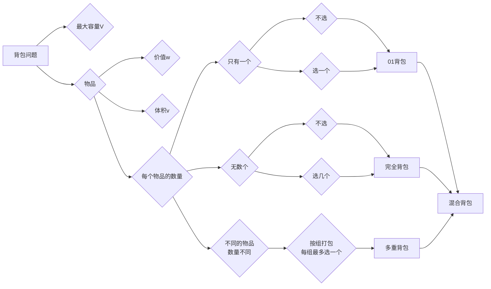

## 关键

01背包中二维dp数组的两个for遍历的先后循序是可以颠倒的，一维dp数组的两个for循环先后循序一定是先遍历物品，再遍历背包容量。

在完全背包中，对于一维dp数组来说，其实两个for循环嵌套顺序是无所谓的！

有N件物品和一个最多能背重量为W的背包。第i件物品的重量是weight[i]，得到的价值是value[i] 。每件物品都有无限个（也就是可以放入背包多次），求解将哪些物品装入背包里物品价值总和最大。

完全背包和01背包问题唯一不同的地方就是，每种物品有无限件。




### **背包递推公式**

问能否能装满背包（或者最多装多少）：`dp[j] = max(dp[j], dp[j - nums[i]] + nums[i]);` ，对应题目如下：
* 动态规划：416.分割等和子集
* 动态规划：1049.最后一块石头的重量 II

问装满背包有几种方法：`dp[j] += dp[j - nums[i]]` ，对应题目如下：
* 动态规划：494.目标和
* 动态规划：518. 零钱兑换 II
* 动态规划：377.组合总和Ⅳ
* 动态规划：70. 爬楼梯进阶版（完全背包）

问背包装满最大价值：`dp[j] = max(dp[j], dp[j - weight[i]] + value[i]);` ，对应题目如下：
* 动态规划：474.一和零

问装满背包所有物品的最小个数：`dp[j] =  min(dp[j - coins[i]] + 1, dp[j]);` ，对应题目如下：
* 动态规划：322.零钱兑换
* 动态规划：279.完全平方数

### **背包遍历顺序：**

**01背包遍历顺序：**

二维dp数组01背包先遍历物品还是先遍历背包都是可以的，且第二层for循环是从小到大遍历。

一维dp数组**01背包只能先遍历物品再遍历背包容量，且第二层for循环是从大到小遍历。**

一维dp数组的背包在遍历顺序上和二维dp数组实现的01背包其实是有很大差异的，大家需要注意！

**完全背包遍历顺序**

纯完全背包的一维dp数组实现，先遍历物品还是先遍历背包都是可以的，且第二层for循环是从小到大遍历。

但是仅仅是纯完全背包的遍历顺序是这样的，题目稍有变化，两个for循环的先后顺序就不一样了。

**如果求组合数就是外层for循环遍历物品，内层for遍历背包**。

**如果求排列数就是外层for遍历背包，内层for循环遍历物品**。


## 01背包问题

01背包的核心代码

```cpp
for(int i = 0; i < weight.size(); i++) { // 遍历物品
    for(int j = bagWeight; j >= weight[i]; j--) { // 遍历背包容量
        dp[j] = max(dp[j], dp[j - weight[i]] + value[i]);
    }
}
```

我们知道01背包内嵌的循环是从大到小遍历，为了保证每个物品仅被添加一次。

对于背包问题，有一种写法， 是使用二维数组，即`dp[i][j]` 表示从下标为`[0-i]`的物品里任意取，放进容量为j的背包，价值总和最大是多少。


---

>  再回顾一下 `dp[i][j]` 的含义：从下标为 `[0-i]` 的物品里任意取，放进容量为 `j` 的背包，价值总和最大是多少。

那么可以有两个方向推出来 `dp[i][j]`：

* **不放物品 `i`**：由 `dp[i - 1][j]` 推出，即背包容量为 `j`，里面不放物品 `i` 的最大价值。此时 `dp[i][j]` 就是 `dp[i - 1][j]`。 (其实就是当物品 `i` 的重量大于背包 `j` 的重量时，物品 `i` 无法放进背包中，所以背包内的价值依然和前面相同。)
* **放物品 `i`**：由 `dp[i - 1][j - weight[i]]` 推出，`dp[i - 1][j - weight[i]]` 为背包容量为 `j - weight[i]` 的时候不放物品 `i` 的最大价值，那么 `dp[i - 1][j - weight[i]] + value[i]`（物品 `i` 的价值），就是背包放物品 `i` 得到的最大价值。

所以递推公式： `dp[i][j] = max(dp[i - 1][j], dp[i - 1][j - weight[i]] + value[i])`。

---

**关于初始化，一定要和 `dp` 数组的定义吻合，否则到递推公式的时候就会越来越乱**。

首先从 `dp[i][j]` 的定义出发，如果背包容量 `j` 为 0 的话，即 `dp[i][0]`，无论是选取哪些物品，背包价值总和一定为 0。如图：


再看其他情况。

状态转移方程 `dp[i][j] = max(dp[i - 1][j], dp[i - 1][j - weight[i]] + value[i])` 可以看出 `i` 是由 `i-1` 推导出来，那么 `i` 为 0 的时候就一定要初始化。

`dp[0][j]`，即：`i` 为 0，存放编号 0 的物品的时候，各个容量的背包所能存放的最大价值。

那么很明显当 `j < weight[0]` 的时候，`dp[0][j]` 应该是 0，因为背包容量比编号 0 的物品重量还小。

当 `j >= weight[0]` 时，`dp[0][j]` 应该是 `value[0]`，因为背包容量足够放编号 0 物品。


代码初始化如下：

```
for (int j = 0 ; j < weight[0]; j++) {  
// 当然这一步，如果把dp数组预先初始化为0了，这一步就可以省略，但很多同学应该没有想清楚这一点。
    dp[0][j] = 0;
}
// 正序遍历
for (int j = weight[0]; j <= bagweight; j++) {
    dp[0][j] = value[0];
}
```


### [416. 分割等和子集](https://leetcode.cn/problems/partition-equal-subset-sum/)

给你一个 **只包含正整数** 的 **非空** 数组 `nums` 。请你判断是否可以将这个数组分割成两个子集，使得两个子集的元素和相等。

**示例 1：**

```plain
输入：nums = [1,5,11,5]
输出：true
解释：数组可以分割成 [1, 5, 5] 和 [11] 。
```

**示例 2：**

```plain
输入：nums = [1,2,3,5]
输出：false
解释：数组不能分割成两个元素和相等的子集。
```

**提示：**

- `1 <= nums.length <= 200`

- `1 <= nums[i] <= 100`

```java
class Solution {
    public boolean canPartition(int[] nums) {
        int sum = 0;
        for (int num : nums) {
            sum+=num;
        }
        if (sum%2==1) return false;
        int target = sum/2;
        //动态规划 1/背包问题，能不能找到target大小的元素
        // dp[i] = dp[i-nums[j]]
        boolean[] dp = new boolean[target + 1];
        //先遍历物品，再遍历背包，
        dp[0] = true;
        for (int i = 0; i < nums.length; i++) {
            for (int j = target; j >= nums[i]; j--) {
                dp[j] = dp[j]||dp[j-nums[i]];
            }
        }
        return dp[target];
    }
}
}
```

#### 