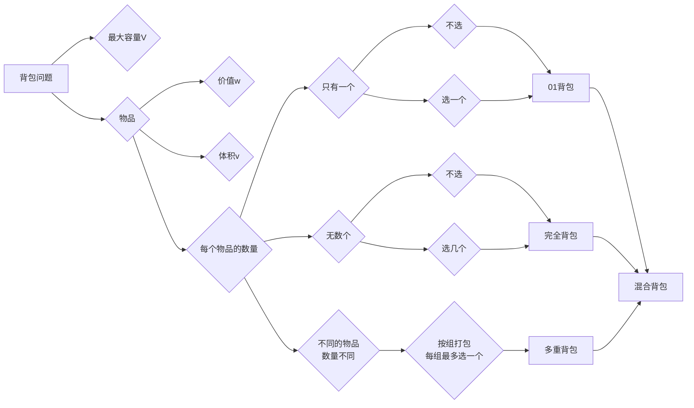
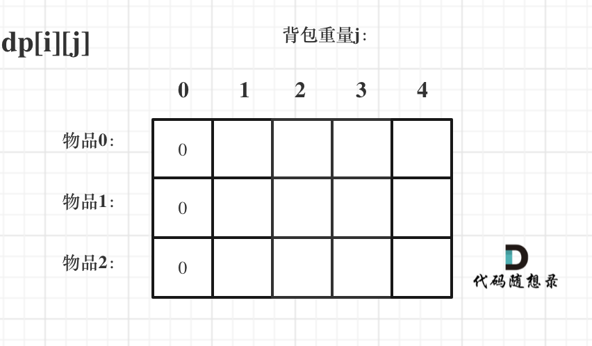

## 关键

01背包中二维dp数组的两个for遍历的先后循序是可以颠倒的，一维dp数组的两个for循环先后循序一定是先遍历物品，再遍历背包容量。

在完全背包中，对于一维dp数组来说，其实两个for循环嵌套顺序是无所谓的！

有N件物品和一个最多能背重量为W的背包。第i件物品的重量是weight[i]，得到的价值是value[i] 。每件物品都有无限个（也就是可以放入背包多次），求解将哪些物品装入背包里物品价值总和最大。

完全背包和01背包问题唯一不同的地方就是，每种物品有无限件。




### **背包递推公式**

问能否能装满背包（或者最多装多少）：`dp[j] = max(dp[j], dp[j - nums[i]] + nums[i]);` ，对应题目如下：
* 动态规划：416.分割等和子集
* 动态规划：1049.最后一块石头的重量 II

问装满背包有几种方法：`dp[j] += dp[j - nums[i]]` ，对应题目如下：
* 动态规划：494.目标和
* 动态规划：518. 零钱兑换 II
* 动态规划：377.组合总和Ⅳ
* 动态规划：70. 爬楼梯进阶版（完全背包）

问背包装满最大价值：`dp[j] = max(dp[j], dp[j - weight[i]] + value[i]);` ，对应题目如下：
* 动态规划：474.一和零

问装满背包所有物品的最小个数：`dp[j] =  min(dp[j - coins[i]] + 1, dp[j]);` ，对应题目如下：
* 动态规划：322.零钱兑换
* 动态规划：279.完全平方数

### **背包遍历顺序：**

**01背包遍历顺序：**

二维dp数组01背包先遍历物品还是先遍历背包都是可以的，且第二层for循环是从小到大遍历。

一维dp数组**01背包只能先遍历物品再遍历背包容量，且第二层for循环是从大到小遍历。**

一维dp数组的背包在遍历顺序上和二维dp数组实现的01背包其实是有很大差异的，大家需要注意！

**完全背包遍历顺序**

纯完全背包的一维dp数组实现，先遍历物品还是先遍历背包都是可以的，且第二层for循环是从小到大遍历。

但是仅仅是纯完全背包的遍历顺序是这样的，题目稍有变化，两个for循环的先后顺序就不一样了。

**如果求组合数就是外层for循环遍历物品，内层for遍历背包**。

**如果求排列数就是外层for遍历背包，内层for循环遍历物品**。

## 01背包问题

01背包的核心代码

```cpp
for(int i = 0; i < weight.size(); i++) { // 遍历物品
    for(int j = bagWeight; j >= weight[i]; j--) { // 遍历背包容量
        dp[j] = max(dp[j], dp[j - weight[i]] + value[i]);
    }
}
```

我们知道01背包内嵌的循环是从大到小遍历，为了保证每个物品仅被添加一次。

对于背包问题，有一种写法， 是使用二维数组，即`dp[i][j]` 表示从下标为`[0-i]`的物品里任意取，放进容量为j的背包，价值总和最大是多少。


---

>  再回顾一下 `dp[i][j]` 的含义：从下标为 `[0-i]` 的物品里任意取，放进容量为 `j` 的背包，价值总和最大是多少。

那么可以有两个方向推出来 `dp[i][j]`：

* **不放物品 `i`**：由 `dp[i - 1][j]` 推出，即背包容量为 `j`，里面不放物品 `i` 的最大价值。此时 `dp[i][j]` 就是 `dp[i - 1][j]`。 (其实就是当物品 `i` 的重量大于背包 `j` 的重量时，物品 `i` 无法放进背包中，所以背包内的价值依然和前面相同。)
* **放物品 `i`**：由 `dp[i - 1][j - weight[i]]` 推出，`dp[i - 1][j - weight[i]]` 为背包容量为 `j - weight[i]` 的时候不放物品 `i` 的最大价值，那么 `dp[i - 1][j - weight[i]] + value[i]`（物品 `i` 的价值），就是背包放物品 `i` 得到的最大价值。

所以递推公式： `dp[i][j] = max(dp[i - 1][j], dp[i - 1][j - weight[i]] + value[i])`。

---

**关于初始化，一定要和 `dp` 数组的定义吻合，否则到递推公式的时候就会越来越乱**。

首先从 `dp[i][j]` 的定义出发，如果背包容量 `j` 为 0 的话，即 `dp[i][0]`，无论是选取哪些物品，背包价值总和一定为 0。如图：



再看其他情况。

状态转移方程 `dp[i][j] = max(dp[i - 1][j], dp[i - 1][j - weight[i]] + value[i])` 可以看出 `i` 是由 `i-1` 推导出来，那么 `i` 为 0 的时候就一定要初始化。

`dp[0][j]`，即：`i` 为 0，存放编号 0 的物品的时候，各个容量的背包所能存放的最大价值。

那么很明显当 `j < weight[0]` 的时候，`dp[0][j]` 应该是 0，因为背包容量比编号 0 的物品重量还小。

当 `j >= weight[0]` 时，`dp[0][j]` 应该是 `value[0]`，因为背包容量足够放编号 0 物品。


代码初始化如下：

```
for (int j = 0 ; j < weight[0]; j++) {  
// 当然这一步，如果把dp数组预先初始化为0了，这一步就可以省略，但很多同学应该没有想清楚这一点。
    dp[0][j] = 0;
}
// 正序遍历
for (int j = weight[0]; j <= bagweight; j++) {
    dp[0][j] = value[0];
}
```


### [416. 分割等和子集](https://leetcode.cn/problems/partition-equal-subset-sum/)

给你一个 **只包含正整数** 的 **非空** 数组 `nums` 。请你判断是否可以将这个数组分割成两个子集，使得两个子集的元素和相等。

**示例 1：**

```plain
输入：nums = [1,5,11,5]
输出：true
解释：数组可以分割成 [1, 5, 5] 和 [11] 。
```

**示例 2：**

```plain
输入：nums = [1,2,3,5]
输出：false
解释：数组不能分割成两个元素和相等的子集。
```

**提示：**

- `1 <= nums.length <= 200`

- `1 <= nums[i] <= 100`

```java
class Solution {
    public boolean canPartition(int[] nums) {
        int sum = 0;
        for (int num : nums) {
            sum+=num;
        }
        if (sum%2==1) return false;
        int target = sum/2;
        //动态规划 1/背包问题，能不能找到target大小的元素
        // dp[i] = dp[i-nums[j]]
        boolean[] dp = new boolean[target + 1];
        //先遍历物品，再遍历背包，
        dp[0] = true;
        for (int i = 0; i < nums.length; i++) {
            for (int j = target; j >= nums[i]; j--) {
                dp[j] = dp[j]||dp[j-nums[i]];
            }
        }
        return dp[target];
    }
}
}
```

### [494. 目标和](https://leetcode.cn/problems/target-sum/)

给你一个整数数组 `nums` 和一个整数 `target` 。

向数组中的每个整数前添加 `'+'` 或 `'-'` ，然后串联起所有整数，可以构造一个 **表达式** ：

- 例如，`nums = [2, 1]` ，可以在 `2` 之前添加 `'+'` ，在 `1` 之前添加 `'-'` ，然后串联起来得到表达式 `"+2-1"` 。

返回可以通过上述方法构造的、运算结果等于 `target` 的不同 **表达式** 的数目。

**示例 1：**

```
输入：nums = [1,1,1,1,1], target = 3
输出：5
解释：一共有 5 种方法让最终目标和为 3 。
-1 + 1 + 1 + 1 + 1 = 3
+1 - 1 + 1 + 1 + 1 = 3
+1 + 1 - 1 + 1 + 1 = 3
+1 + 1 + 1 - 1 + 1 = 3
+1 + 1 + 1 + 1 - 1 = 3
```

```java
class Solution {
    public int findTargetSumWays(int[] nums, int target) {
        // 01 背包，dp表示放到正数的一遍的方法，
        // p+d=s; p-d = t; p = s+t /2;
        int sum = 0;
        for (int num : nums) {
            sum+=num;
        }
        //如果二者相加小于0，显然是不行的
        if ((sum+target)%2==1 ||(sum+target)/2<0) return 0;
        int plus = (sum+target)/2;
        int[] dp = new int[plus + 1];
        dp[0] =1;
        //找到和为plus的树木有多少种，装满这个plus的背包
        for (int i = 0; i < nums.length; i++) {
            for (int j = plus; j >=nums[i] ; j--) {
               //背包为target的数目，实际就是每个元素和对应的dp[target-nums]的种类之和。
                dp[j] += dp[j-nums[i]];
            }
        }
        return dp[plus];
    }
}
```

### 

假设我们有一个数组nums = [1, 2, 3]，目标和target = 4。我们需要找到有多少种方式可以从数组中选择一些元素，使得它们的和等于4。

首先，我们计算数组的总和sum = 1 + 2 + 3 = 6。然后，我们计算plus = (sum + target) / 2 = (6 + 4) / 2 = 5。

接下来，我们初始化dp数组为dp[0] = 1，表示和为0的组合只有一种，即不选任何元素。

然后，我们遍历数组nums中的每个元素num，对于每个元素num，我们从plus开始向下遍历到num，更新dp数组。

以num = 1为例，我们更新dp数组如下：

- 当j = 5时，dp[5] += dp[5-1]，即dp[5] += dp[4]，因为可以选择元素1，剩余的和为4。
- 当j = 4时，dp[4] += dp[4-1]，即dp[4] += dp[3]，因为可以选择元素1，剩余的和为3。
- 当j = 3时，dp[3] += dp[3-1]，即dp[3] += dp[2]，因为可以选择元素1，剩余的和为2。
- 当j = 2时，dp[2] += dp[2-1]，即dp[2] += dp[1]，因为可以选择元素1，剩余的和为1。
- 当j = 1时，dp[1] += dp[1-1]，即dp[1] += dp[0]，因为可以选择元素1，剩余的和为0。

经过上述更新后，dp数组变为： dp = [1, 1, 2, 3, 4, 5]


## 完全背包

 01 背包是先遍历物品，再遍历背包，背包从大到小遍历：

```java
//找到和为plus的树木有多少种，装满这个plus的背包
for (int i = 0; i < nums.length; i++) {
    for (int j = plus; j >=nums[i] ; j--) {
        dp[j] += dp[j-nums[i]];
    }
}
return dp[plus];
```

完全背包的**排列数**是先遍历背包容量，再遍历物品，物品时从小到大，背包也是从小到大。

```java
//完全背包（可以重复使用），求排列数（不同的排序都算方法）
for (int i = 1; i <= target; i++) {
    // 先遍历背包，因为这个容器背包是1的时候，可以每一个nums都去遍历所以是组合
    // 如果先去遍历物品，也就是nums的时候，那不就是没有顺序l
    for (int j = 0; j < nums.length; j++) {
        if (nums[j]<=i){
          // //背包为target的数目，实际就是每个元素和对应的dp[target-nums]的种类之和。
            dp[i] += dp[i-nums[j]];
        } 
    }
}
```

完全背包的**组合数**是先遍历物品，再遍历背包容量，物品时从小到大，背包也是从小到大。

```java
for (int coin : coins) {
    for (int i = coin; i <= amount; i++) {
        if (dp[i-coin]!=Integer.MAX_VALUE){
            dp[i] = Math.min(dp[i],dp[i-coin]+1);
        }
    }
}
```


### 377.组合总和IV 排列数

给你一个由 **不同** 整数组成的数组 `nums` ，和一个目标整数 `target` 。请你从 `nums` 中找出并返回总和为 `target` 的元素组合的个数。

题目数据保证答案符合 32 位整数范围。

**示例 1：**

```
输入：nums = [1,2,3], target = 4
输出：7
解释：
所有可能的组合为：
(1, 1, 1, 1)
(1, 1, 2)
(1, 2, 1)
(1, 3)
(2, 1, 1)
(2, 2)
(3, 1)
请注意，顺序不同的序列被视作不同的组合。
```

**示例 2：**

```
输入：nums = [9], target = 3
输出：0
```

```java
class Solution {
    public int combinationSum4(int[] nums, int target) {
        //dp[j]+=dp[j]
        //和爬楼梯是一样的。
        int[] dp = new int[target+1];
        dp[0]=1;
        
        //举个例子比如nums=[1,3,4],target=7;
        //dp[7]=dp[6]+dp[4]+dp[3]
        //其实就是说7的组合数可以由三部分组成，1和dp[6]，3和dp[4],4和dp[3];

        //先遍历背包，再遍历物品得到的是排列数
        for(int i =1;i<=target;i++){
            //先遍历背包是保证每一个可能都有，如果先搞物品，i-num之后就是一个数字，相同的物品，i-num也是一样的，分别不出来。
            for(int num:nums){
                if(i>=num){
                    dp[i]+=dp[i-num];
                }
            }
        }
        return dp[target];
    }
}
```

### LCR 103 零钱兑换 组合数

给定不同面额的硬币 `coins` 和一个总金额 `amount`。编写一个函数来计算可以凑成总金额所需的最少的硬币个数。如果没有任何一种硬币组合能组成总金额，返回 `-1`。

你可以认为每种硬币的数量是无限的。

**示例 1：**

```
输入：coins = [1, 2, 5], amount = 11
输出：3 
解释：11 = 5 + 5 + 1
```

**示例 2：**

```
输入：coins = [2], amount = 3
输出：-1
```

完全背包就是都是从小到大遍历。

```java
class Solution {
    public int coinChange(int[] coins, int amount) {
        int[] dp = new int[amount + 1];
        Arrays.fill(dp,Integer.MAX_VALUE);
        int n = coins.length;
        //组合数，不需要排列先遍历物品，再是背包，从小到大
        dp[0] = 0;
        for (int coin : coins) {
            for (int i = coin; i <= amount; i++) {
                if (dp[i-coin]!=Integer.MAX_VALUE){
                    dp[i] = Math.min(dp[i],dp[i-coin]+1);
                }
            }
        }
        return dp[amount]==Integer.MAX_VALUE?-1:dp[amount];
    }
}
```

