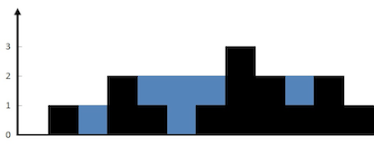

## 单调栈

```
/**
 *  单调栈分为单调递增栈和单调递减栈，通过使用单调栈我们可以访问到最近一个比它大（小）的元素。
 *     单调递增栈：单调递增栈就是从栈底到栈顶数据是依次递增，通常是寻找某方向第一个比它小的元素。
 *     单调递减栈：单调递减栈就是从栈底到栈顶数据是依次递减，通常是寻找某方向第一个比它大的元素。
 */
```

> 在一个线性数据结构中，为任意一个元素找左边和右边第一个比自己大/小的位置，要求O(n)的复杂度

基本解法很容易想到O(n^2)的解法，关键是O(n)的解法，就需要借助单调栈了。单调栈的一大优势就是线性的时间复杂度，所有的元素只会进栈一次，而且一旦出栈后就不会再进来了。

**单调栈的本质是空间换时间**，因为在遍历的过程中**需要用一个栈来记录右边第一个比当前元素高的元素**，优点是整个数组只需要遍历一次。

假设有一个数组 `[2, 1, 2, 4, 3]`，我们想找到每个元素的下一个更大元素。使用单调栈的方法可以帮助我们快速找到这些结果。

我们从左到右遍历数组，维护一个单调递减的栈，栈中存储的是数组元素的索引。我们遍历到元素 `2` 时，将其索引入栈。接着遍历到元素 `1`，由于 `1` 小于栈顶元素 `2`，所以将 `1` 的索引入栈。然后遍历到元素 `2`，此时 `2` 大于栈顶元素 `1`，我们可以得到 `1` 的下一个更大元素是 `2`，并将 `1` 出栈。接着将 `2` 的索引入栈。

**更直白来说，就是用一个栈来记录我们遍历过的元素**，因为我们遍历数组的时候，我们不知道之前都遍历了哪些元素，以至于遍历一个元素找不到是不是之前遍历过一个更小的，所以我们需要用一个容器（这里用单调栈）来记录我们遍历过的元素。


### [42. 接雨水](https://leetcode.cn/problems/trapping-rain-water/)

给定 `n` 个非负整数表示每个宽度为 `1` 的柱子的高度图，计算按此排列的柱子，下雨之后能接多少雨水。

**示例 1：**


```
输入：height = [0,1,0,2,1,0,1,3,2,1,2,1]
输出：6
解释：上面是由数组 [0,1,0,2,1,0,1,3,2,1,2,1] 表示的高度图，在这种情况下，可以接 6 个单位的雨水（蓝色部分表示雨水）。
```

**示例 2：**

```
输入：height = [4,2,0,3,2,5]
输出：9
```

```java
class Solution {
    public int trap(int[] height) {
        int count = 0;
        ArrayDeque<Integer> stack = new ArrayDeque<>();
        //维持一个递减的栈，递增了显然就是有一个坑，其实就是找第一个比当前元素大的元素，单调递减的单调站。
        for (int i = 0; i < height.length; i++) {
            while (!stack.isEmpty() && height[stack.peek()]<height[i]){
                //出现递增的时候
                int popped = stack.pop();
                while (!stack.isEmpty() && height[popped]==height[stack.peek()])
                    stack.pop();//继续弹出去
                //Att:如果此时stack为空了，说明当前凹槽没有左边边界，不得行
                if (!stack.isEmpty()){
                    int min = Math.min(height[stack.peek()], height[i]);
                    //stack可以一直往左边吐，吐到和当前凹槽不相等的地方，所以计算宽度用的peek-1；
                    count+=(min-height[popped])*(i- stack.peek()-1);
                }
            }
            stack.push(i);
        }
        return count;
    }
}
```


### [962. 最大宽度坡](https://leetcode.cn/problems/maximum-width-ramp/)

给定一个整数数组 `A`，*坡*是元组 `(i, j)`，其中 `i < j` 且 `A[i] <= A[j]`。这样的坡的宽度为 `j - i`。

找出 `A` 中的坡的最大宽度，如果不存在，返回 0 。

**示例 1：**

```
输入：[6,0,8,2,1,5]
输出：4
解释：
最大宽度的坡为 (i, j) = (1, 5): A[1] = 0 且 A[5] = 5.
```

```java
class Solution {
    public int maxWidthRamp(int[] nums) {
        //1 维护一个单调递减栈，其中第一个元素是A中第一个元素，最后一个元素是A的最小值。
        // 由于需要计算长度，所以栈中存储A的索引。
        //2 从后向前遍历A，当元素大于栈顶元素时，计算一次最大宽度坡，并弹出
        // (因为再往前面遍历宽度肯定会减少)，由于当栈顶索引等于当前遍历到的元素的索引时，
        // 肯定会被弹出，所以没有必要判断栈顶索引是否小于等于当前遍历到的索引。
        //
        ArrayDeque<Integer> stack = new ArrayDeque<Integer>();
        for (int i = 0; i < nums.length; i++) {
            if (stack.isEmpty()||nums[stack.peek()]>nums[i]) stack.push(i);
        }
        int res = 0,i= nums.length-1;
        while (i>res){
            //这里是因为i如果小于res，就没有判断的必要了
            while (!stack.isEmpty()&&nums[stack.peek()]<=nums[i]){
                //栈顶部的元素如果小于当前cur元素，就需要记录一下这个坡
                res = Math.max(res,i-stack.peek());
                stack.pop();
            }
            i--;
        }
        return res;
    }
}
```


### 模版-XSG

```java
// 寻找左边第一个小于它的数
public static int[] findLeftSmall(int[] nums) {
    int n = nums.length;
    int [] ans = new int[n];
    Deque<Integer> stack = new ArrayDeque<>();
    for (int i = 0; i < n; i++) {//单调栈模板（注意是数值）
        while (!stack.isEmpty() && stack.peek() >= nums[i]) stack.poll();
        if (!stack.isEmpty()) ans[i] = stack.peekFirst();
        else ans[i] = -1;
        stack.push(nums[i]);
    }
    return ans;
}

// 寻找左边第一个大于它的数
public static int[] findLeftBig(int[] nums) {
    int n = nums.length;
    int [] ans = new int[n];
    Deque<Integer> stack = new ArrayDeque<>();
    for (int i = 0; i < n; i++) {//单调栈模板（注意是数值）
        while (!stack.isEmpty() && stack.peek() <= nums[i]) stack.poll();
        if (!stack.isEmpty()) ans[i] = stack.peekFirst();
        else ans[i] = -1;
        stack.push(nums[i]);
    }
    return ans;
}

// 寻找左边第一个小于它的数的下标
public static int[] findLeftSmallIndex(int[] nums) {
    int n = nums.length;
    int [] ans = new int[n];
    Deque<Integer> stack = new ArrayDeque<>();
    for (int i = 0; i < n; i++) {
        while (!stack.isEmpty() && nums[stack.peek()] >= nums[i]) stack.poll();
        if (!stack.isEmpty()) ans[i] = stack.peekFirst();
        else ans[i] = -1;
        stack.push(i);
    }
    return ans;
}

// 寻找右边第一个大于它的数
public static int[] findRightBig(int [] nums) {
    int n = nums.length;
    int [] ans = new int[n];
    Deque<Integer> stack = new ArrayDeque<>();
    for (int i = n - 1; i >= 0; i--) {
        while (!stack.isEmpty() && stack.peek() <= nums[i]) stack.poll();
        if (!stack.isEmpty()) ans[i] = stack.peek();
        else ans[i] = -1;
        stack.push(nums[i]);
    }
    return ans;
}


// 寻找右边大于它的数中的最小值  不需要使用单调栈
public static int[] findRightBigSmall(int [] nums) {
    int n = nums.length;
    int [] ans = new int[n];
    TreeSet<Integer> treeSet = new TreeSet<>();
    for (int i = n - 1; i >= 0; i--) {
        Integer num = treeSet.ceiling(nums[i]);
        if (num == null) {
            ans[i] = -1;
        } else {
            ans[i] = num;
        }
        treeSet.add(nums[i]);
    }
    return ans;
}


// 寻找左边第一关小于它的数的下标

public static void main(String[] args) {
    System.out.println(Arrays.toString(findLeftBig(new int[]{2, 1, 1, 3, 6, 5})));
}
```