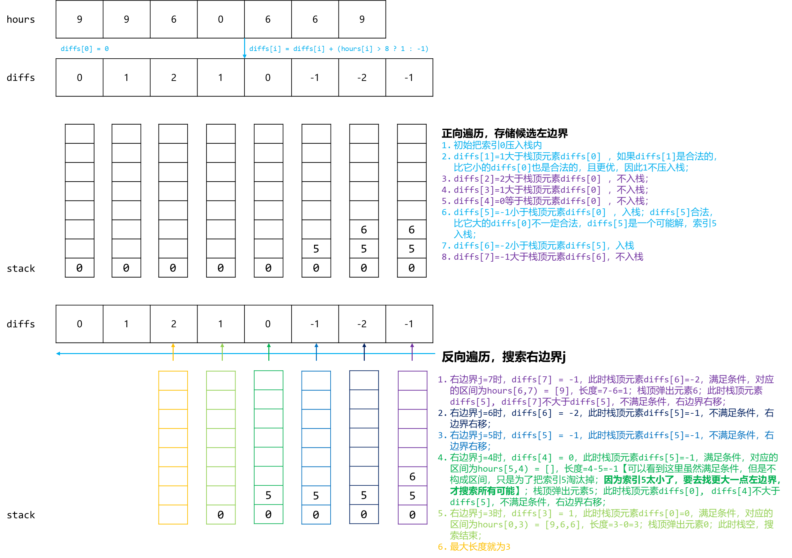

## 单调栈

```
/**
 *  单调栈分为单调递增栈和单调递减栈，通过使用单调栈我们可以访问到最近一个比它大（小）的元素。
 *     单调递增栈：单调递增栈就是从栈底到栈顶数据是依次递增，通常是寻找某方向第一个比它小的元素。
 *     单调递减栈：单调递减栈就是从栈底到栈顶数据是依次递减，通常是寻找某方向第一个比它大的元素。
 */
```

> 在一个线性数据结构中，为任意一个元素找左边和右边第一个比自己大/小的位置，要求O(n)的复杂度

基本解法很容易想到O(n^2)的解法，关键是O(n)的解法，就需要借助单调栈了。单调栈的一大优势就是线性的时间复杂度，所有的元素只会进栈一次，而且一旦出栈后就不会再进来了。

**单调栈的本质是空间换时间**，因为在遍历的过程中**需要用一个栈来记录右边第一个比当前元素高的元素**，优点是整个数组只需要遍历一次。

**更直白来说，就是用一个栈来记录我们遍历过的元素**，因为我们遍历数组的时候，我们不知道之前都遍历了哪些元素，以至于遍历一个元素找不到是不是之前遍历过一个更小的，所以我们需要用一个容器（这里用单调栈）来记录我们遍历过的元素。

1、找每个元素的下一个更大元素

假设有一个数组 `[2, 1, 2, 4, 3]`，我们想找到每个元素的下一个更大元素。使用单调栈的方法可以帮助我们快速找到这些结果。

我们从左到右遍历数组，维护一个单调递减的栈，栈中存储的是数组元素的索引。我们遍历到元素 `2` 时，将其索引入栈。接着遍历到元素 `1`，由于 `1` 小于栈顶元素 `2`，所以将 `1` 的索引入栈。然后遍历到元素 `2`，此时 `2` 大于栈顶元素 `1`，我们可以得到 `1` 的下一个更大元素是 `2`，并将 `1` 出栈。接着将 `2` 的索引入栈。

2、找到最远的更大元素

先得到单调递减队列，然后从右向左遍历。

## 实例

### [42. 接雨水](https://leetcode.cn/problems/trapping-rain-water/)

给定 `n` 个非负整数表示每个宽度为 `1` 的柱子的高度图，计算按此排列的柱子，下雨之后能接多少雨水。

**示例 1：**


```
输入：height = [0,1,0,2,1,0,1,3,2,1,2,1]
输出：6
解释：上面是由数组 [0,1,0,2,1,0,1,3,2,1,2,1] 表示的高度图，在这种情况下，可以接 6 个单位的雨水（蓝色部分表示雨水）。
```

**示例 2：**

```
输入：height = [4,2,0,3,2,5]
输出：9
```


#### 找每个元素的下一个更大元素代码

```java
class Solution {
    public int trap(int[] height) {
        int count = 0;
        ArrayDeque<Integer> stack = new ArrayDeque<>();
        //维持一个递减的栈，递增了显然就是有一个坑，其实就是找第一个比当前元素大的元素，单调递减的单调站。
        for (int i = 0; i < height.length; i++) {
            while (!stack.isEmpty() && height[stack.peek()]<height[i]){
                //出现递增的时候
                int popped = stack.pop();
                while (!stack.isEmpty() && height[popped]==height[stack.peek()])
                    stack.pop();//继续弹出去
                //Att:如果此时stack为空了，说明当前凹槽没有左边边界，不得行
                if (!stack.isEmpty()){
                    int min = Math.min(height[stack.peek()], height[i]);
                    //stack可以一直往左边吐，吐到和当前凹槽不相等的地方，所以计算宽度用的peek-1；
                    count+=(min-height[popped])*(i- stack.peek()-1);
                }
            }
            stack.push(i);
        }
        return count;
    }
}
```


### [962. 最大宽度坡](https://leetcode.cn/problems/maximum-width-ramp/)

给定一个整数数组 `A`，*坡*是元组 `(i, j)`，其中 `i < j` 且 `A[i] <= A[j]`。这样的坡的宽度为 `j - i`。

找出 `A` 中的坡的最大宽度，如果不存在，返回 0 。

**示例 1：**

```
输入：[6,0,8,2,1,5]
输出：4
解释：
最大宽度的坡为 (i, j) = (1, 5): A[1] = 0 且 A[5] = 5.
```


**首先正序遍历数组 A，将以 A[0] 开始的递减序列的元素下标依次存入栈中。**

**为什么要存从 A[0] 开始的递减序列呢？**
因为题中条件 `A[i] <= A[j]`，所以要让 `A[i]` 的值尽可能的小，即从 A[0] 开始的一个递减序列。**单调栈中记录的是**`**从后往前**`**每个大分段 “坡底” 所在的位置。**

以 [6, 1, 8, 2, 0, 5] 为例，由于 **(6, 1, 0) 是递减的**，所以栈中存的元素应该为：(`栈顶 -> (4, 1, 0) <- 栈底`)，注意这里是存的下表，6的下表是0，在栈的底部。

**其中 [2, 0, 5] 也是一个满足条件的坡并且宽度为 2，但是为什么在计算的时候没有算它呢？**
因为该数组从 A[0] 开始的递减序列为 (6, 1, 0) 并没有元素 2，是因为在元素 2 的左边有比它还要小的元素 1。`当计算最大宽度坡时 1 和 2 相比，不管是元素值还是元素的下标都更小，所以若以 2 为坡底能计算出某一坡的宽度时同样的以 1 为坡底也能计算出相应的坡的宽度并且宽度更大`，所以就不需要计算以 2 为坡底的坡的宽度了。

此时`栈 stack：(4(0), 1(1), 0(6))`：然后**逆序**遍历数组 A，若以栈顶元素为下标的元素值 A[stack.peek()] **小于等于**当前遍历的元素 A[i]，即 `A[stack.peek()] <= A[i]`。此时就是一个满足条件的坡的宽度，**并且这个宽度一定是栈顶这个坡底 stack.peek的 能形成的最大宽度**，这里只是说这坡底i能形成的，也就是下表坡底的最右边的大于他的元素就是这个i，将栈顶元素出栈并计算当前坡的宽度，因为i已经是最右边的了，所以接着出栈计算新的peek，保留最大值即可。


#### 找到最远的更大元素代码：

```java
class Solution {
    public int maxWidthRamp(int[] nums) {
        //1 维护一个单调递减栈，其中第一个元素是A中第一个元素，最后一个元素是A的最小值。
        // 由于需要计算长度，所以栈中存储A的索引。
        //2 从后向前遍历A，当元素大于栈顶元素时，计算一次最大宽度坡，并弹出
        // (因为再往前面遍历宽度肯定会减少)，由于当栈顶索引等于当前遍历到的元素的索引时，
        // 肯定会被弹出，所以没有必要判断栈顶索引是否小于等于当前遍历到的索引。
        //
        ArrayDeque<Integer> stack = new ArrayDeque<Integer>();
        for (int i = 0; i < nums.length; i++) {
            if (stack.isEmpty()||nums[stack.peek()]>nums[i]) stack.push(i);
        }
        int res = 0,i= nums.length-1;
        while (i>res){
            //这里是因为i如果小于res，就没有判断的必要了
            while (!stack.isEmpty()&&nums[stack.peek()]<=nums[i]){
                //栈顶部的元素如果小于当前cur元素，就需要记录一下这个坡
                res = Math.max(res,i-stack.pop());
            }
            i--;
        }
      	/*
      	for (int i = n-1; i >res; i--) {
            while (!stack.isEmpty()&&nums[i]>=nums[stack.peek()]){
                res = Math.max(res,i-stack.pop());
            }
        }
        */
        return res;
    }
}
```

```java
public int maxWidthRamp(int[] nums) {
    ArrayDeque<Integer> stack = new ArrayDeque<>();
    int n = nums.length;
    stack.push(0);
    for (int i = 0; i < n; i++) {
        if (nums[i]<nums[stack.peek()]){
            stack.push(i);
        }
    }
    int res = 0;
    for (int i = n-1; i >res; i--) {
        while (!stack.isEmpty()&&nums[i]>nums[stack.peek()]){
            res = Math.max(res,i-stack.pop());
        }
    }
    return res;
}
```

### 1124.最长时间表

给你一份工作时间表 `hours`，上面记录着某一位员工每天的工作小时数。

我们认为当员工一天中的工作小时数大于 `8` 小时的时候，那么这一天就是「**劳累的一天**」。

所谓「表现良好的时间段」，意味在这段时间内，「劳累的天数」是严格 **大于**「不劳累的天数」。

请你返回「表现良好时间段」的最大长度。

**示例 1：**

```
输入：hours = [9,9,6,0,6,6,9]
输出：3
解释：最长的表现良好时间段是 [9,9,6]。
```

那么把劳累的一天视作 nums[i]=1，不劳累的一天视作 nums[i]=-1，则问题变为：

计算nums 的最长子数组，其元素和大于0。

```
//按照 1 0编码 最长的表现良好时间段是 [9,9,6]。
// 9 9 6 0 5 5 9
// 1 1 0 0 0 0 1
//0 1 2 2 2 2 2 3

  3 |                 *
  2 |     * * * * * *
  1 |   *
  0 | *
    +------------------------
      0 1 2 3 4 5 6 7


//按照 1 -1编码
// 9 9 6 0 5 5 9
// 1 1 -1 -1 -1 -1 1
//01 2 1 0 -1 -2 -1

递减为 
  2 |    *
  1 |  *    *
  0 |-         *         *
 -1 |            -     *
 -2 |               -
    +---------------------
     0  1  2  3  4  5  6 7
     
stack: 0 5 6
```

区间段的和计算方法就是`prefixSum[j]-prefixSum[i]`

只要prefixSum数组中右边的元素`prefixSum[j]>prefixSum[i]`即可，不需要prefixSum>0。

`diffs[i, j) = diffs[j] - diffs[i] > 0`长度最大的子数组区间`[i, j)`。

假设区间的右边界`j`是固定的，我们希望左边界的`i`越小越好，这样子数组区间长度就会越大，同时`diffs[i] < diffs[j]`。
也就是说对于两个小于`j`的坐标`i1`和`i2`（`i1 < i2`），`i1`的优先度肯定优于`i2`，除非`diffs[i2] < diffs[j] < diffs[i1]`，也就是说更大的左边界`i2`要想成为候选值，就得比更小的左边界`i1`的`diffs`值小才有机会。
**即左边界**`**i**`**越大，要想成为候选值，**`**diffs[i]**`**就要越小！**
因此我们正序遍历数组的同时，只有值更小的`diffs[i]`才会被选中，因此使用一个单调栈进行维护候选左边界`i`，只有`diffs[i]`比`diffs[i-1]`小才会进行选择。**因此单调栈从栈底到栈顶维护的是**`**i**`**递增，**`**diffs[i]**`**递减的值。**
现在我们有了一堆候选的左边界`i`，我们再来看右边界`j`应该如何选择。对于`j`，我们希望它越大越好，最好能够是到达最右端。因此我们反向遍历数组，去查找可能的右边界`j`。
对于当前既定的右边界`j`，栈顶维护的元素是当前栈内`i`最大且`diffs[i]`最小的元素，记为`p`：

- 如果`diffs[j] <= diffs[p]`，说明没有合适的左边界与当前的右边界匹配，右边界左移；
- 如果`diffs[j] > diffs[p]`，说明这是一个合适的左边界与当前的右边界匹配，这个左边界就与这个右边界形成一组匹配，可以从栈内弹出了【因为右边界是递减的搜索，当前的右边界更大，后面搜索到的右边界即使和这个左边界匹配，构成的区间也只会更小，因此没必要再匹配了】继续找新的栈顶元素和当前右边界比较，直到不匹配；

以示例1的模拟过程如下图所示




```java
public int longestWPI(int[] hours) {
        if (hours==null||hours.length==0) return 0;
//        int pres = 0;
        int n = hours.length;
        int[] pres = new int[n + 1];
        ArrayDeque<Integer> stack = new ArrayDeque<>();
        stack.push(0);
        for (int i = 0; i < n; i++) {
            pres[i+1] = pres[i]+(hours[i]>8?1:-1);
            //找到最大的pres[j]>pres[i]的区间，直接单调栈，单调递减栈，
            if (stack.isEmpty()||pres[stack.peek()]>pres[i+1]) stack.push(i+1);
        }
        int res = 0;
        for (int i = n; i >res; i--) {
            while (!stack.isEmpty()&&pres[i]>pres[stack.peek()]){
                res = Math.max(res,i-stack.pop());
                //区间长度[i,j]的元素和计算公式千万别搞反了 ： pres[j]-pres[i-1];
                //因此 如果当前栈顶是符合提议的，也就是pres[peek]>peek[i]
                // 实际的区间范围是[peek+1,i]符合要求，所以区间个数个数就是 i-(peek+1)+1 = i-peek
            }
        }
        return res;
    }
```


### 239.滑动窗口局部最大值-单调队列

这里就是设计一个单调递减的排序队列，队首的元素是滑动窗口里面最大的元素，同时也要在有效的窗口里面，其他元素进入单调队列的时候，需要比较和队尾的最小的元素，如果比队尾的元素小的就加入，如果当前元素比队尾大的话就删除队尾的元素，一直循环删除比队尾大的元素。


```
输入: nums = [1,3,-1,-3,5,3,6,7], 和 k = 3 
输出: [3,3,5,5,6,7] 
解释: 
滑动窗口的位置                最大值
---------------               -----
[1  3  -1] -3  5  3  6  7       3
 1 [3  -1  -3] 5  3  6  7       3
 1  3 [-1  -3  5] 3  6  7       5
 1  3  -1 [-3  5  3] 6  7       5
 1  3  -1  -3 [5  3  6] 7       6
 1  3  -1  -3  5 [3  6  7]      7
```

这一题是滑动窗口，所以单调栈的构造需要确定是不是在k的范围内，

> 为什么不用大顶堆？
>
> **这个窗口是移动的，而大顶堆每次只能弹出最大值，我们无法移除其他数值，这样就造成大顶堆维护的不是滑动窗口里面的数值了。所以不能用大顶堆。**

队列里的元素一定是要排序的，而且要最大值放在出队口，要不然怎么知道最大值呢。

但如果把窗口里的元素都放进队列里，窗口移动的时候，队列需要弹出元素。

那么问题来了，已经排序之后的队列 怎么能把窗口要移除的元素（这个元素可不一定是最大值）弹出呢。

**其实队列没有必要维护窗口里的所有元素，只需要维护有可能成为窗口里最大值的元素就可以了，同时保证队列里的元素数值是由大到小的。**

那么这个维护元素单调递减的队列就叫做**单调队列，即单调递减或单调递增的队列**。

这里就是设计一个单调递减的排序队列，队首的元素是滑动窗口里面最大的元素，同时也要在有效的窗口里面，其他元素进入单调队列的时候，需要比较和队尾的最小的元素，如果比队尾的元素小的就加入，如果当前元素比队尾大的话就删除队尾的元素，一直循环删除比队尾大的元素。


#### 单调队列参考答案

```java
class Solution {
  // 2024/6/29 实际就是一个单调队列，先更新入队列，然后出队列不符合要求的。
    public int[] maxSlidingWindow(int[] nums, int k) {
        LinkedList<Integer> list = new LinkedList<>();
        int n = nums.length;
        int[] ans = new int[n-k+1];
        for (int i = 0; i < n; i++) {
            //入队列
            while (!list.isEmpty()&&nums[list.getLast()]<=nums[i]){
                list.removeLast();//单调递减的队列，新来的元素必须比当前元素小，如果是大于等于队尾的话
                //直接移走队尾。
            }
            list.addLast(i);
            //出队列
            if (i-list.getFirst()>=k) list.removeFirst();
            //记录
            if (i>=k-1){
                ans[i-k+1] = nums[list.getFirst()];
            }
        }
        return ans;
    }
}
```


### 模版-XSG

```java
// 寻找左边第一个小于它的数
public static int[] findLeftSmall(int[] nums) {
    int n = nums.length;
    int [] ans = new int[n];
    Deque<Integer> stack = new ArrayDeque<>();
    for (int i = 0; i < n; i++) {//单调栈模板（注意是数值）
        while (!stack.isEmpty() && stack.peek() >= nums[i]) stack.poll();
        if (!stack.isEmpty()) ans[i] = stack.peekFirst();
        else ans[i] = -1;
        stack.push(nums[i]);
    }
    return ans;
}

// 寻找左边第一个大于它的数
public static int[] findLeftBig(int[] nums) {
    int n = nums.length;
    int [] ans = new int[n];
    Deque<Integer> stack = new ArrayDeque<>();
    for (int i = 0; i < n; i++) {//单调栈模板（注意是数值）
        while (!stack.isEmpty() && stack.peek() <= nums[i]) stack.poll();
        if (!stack.isEmpty()) ans[i] = stack.peekFirst();
        else ans[i] = -1;
        stack.push(nums[i]);
    }
    return ans;
}

// 寻找左边第一个小于它的数的下标
public static int[] findLeftSmallIndex(int[] nums) {
    int n = nums.length;
    int [] ans = new int[n];
    Deque<Integer> stack = new ArrayDeque<>();
    for (int i = 0; i < n; i++) {
        while (!stack.isEmpty() && nums[stack.peek()] >= nums[i]) stack.poll();
        if (!stack.isEmpty()) ans[i] = stack.peekFirst();
        else ans[i] = -1;
        stack.push(i);
    }
    return ans;
}

// 寻找右边第一个大于它的数
public static int[] findRightBig(int [] nums) {
    int n = nums.length;
    int [] ans = new int[n];
    Deque<Integer> stack = new ArrayDeque<>();
    for (int i = n - 1; i >= 0; i--) {
        while (!stack.isEmpty() && stack.peek() <= nums[i]) stack.poll();
        if (!stack.isEmpty()) ans[i] = stack.peek();
        else ans[i] = -1;
        stack.push(nums[i]);
    }
    return ans;
}


// 寻找右边大于它的数中的最小值  不需要使用单调栈
public static int[] findRightBigSmall(int [] nums) {
    int n = nums.length;
    int [] ans = new int[n];
    TreeSet<Integer> treeSet = new TreeSet<>();
    for (int i = n - 1; i >= 0; i--) {
        Integer num = treeSet.ceiling(nums[i]);
        if (num == null) {
            ans[i] = -1;
        } else {
            ans[i] = num;
        }
        treeSet.add(nums[i]);
    }
    return ans;
}


// 寻找左边第一关小于它的数的下标

public static void main(String[] args) {
    System.out.println(Arrays.toString(findLeftBig(new int[]{2, 1, 1, 3, 6, 5})));
}
```