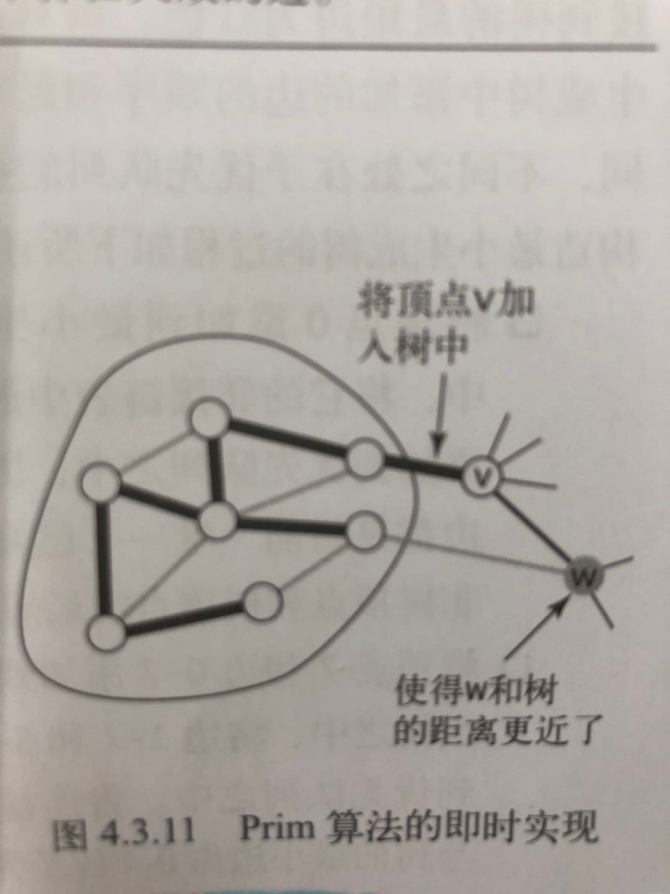

树和图的根本区别：树不会包含环，图可以包含环。

图的生成树其实就是在图中找一棵包含图中的所有节点的树。专业点说，生成树是含有图中所有顶点的无环连通子图。

最小生成树就是再所有可能的生成树中，权重和最小的那棵生成树就叫最小生成树。

- 加权无向图的生成树：一棵含有其所有顶点的无环连通子图。
- 最小生成树（MST）：一棵权值最小（树中所有边的权值之和）的生成树。

### 切分算法

- 切分定义：图的一种切分是将图的所有顶点分为两个非空且不重合的两个集合。横切边是一条连接两个属于不同集合的顶点的边。
- 切分定理：在一幅加权图中，给定任意的切分，它的横切边中的权重最小者必然属于图的最小生成树。

切分定理是解决最小生成树问题的所有算法的基础。切分定理再结合贪心算法思想，就可以最终落地实现最小生成树。

**prim算法原理：**

Prim算法先以某一个点进行切分，然后找到它权重最小的边及邻点，将其加入最小生成树集合MST，然后再以这两个点进行切分…

每次切分都能找到最小生成树的一条边，然后又可以进行新一轮切分，直到找到最小生成树的所有边为止

同时用一个布尔数组 inMST 辅助，防止重复计算横切边



**核心**：

使用一个索引优先队列，保存每个非树顶点w的一条边（将它与树中顶点连接起来的权重最小的边）。优先队列（小顶堆）的最小键即是权重最小的横切边的权重，而和它相关联的顶点V就是下一个将被添加到树中的顶点。


### [1584. 连接所有点的最小费用](https://leetcode.cn/problems/min-cost-to-connect-all-points/)

给你一个`points` 数组，表示 2D 平面上的一些点，其中 `points[i] = [xi, yi]` 。

连接点 `[xi, yi]` 和点 `[xj, yj]` 的费用为它们之间的 **曼哈顿距离** ：`|xi - xj| + |yi - yj|` ，其中 `|val|` 表示 `val` 的绝对值。

请你返回将所有点连接的最小总费用。只有任意两点之间 **有且仅有** 一条简单路径时，才认为所有点都已连接。

**示例 1：**


```
输入：points = [[0,0],[2,2],[3,10],[5,2],[7,0]]
输出：20
解释：
```


```java
class Solution {
    public int minCostConnectPoints(int[][] points) {
        // 转化成无向图邻接表的形式
        List<int[]>[] graph = buildGraph(points);
        // 执行 Prim 算法
        Prim prim = new Prim(graph);
        return prim.minWeightSum;
    }

    // 转化成无向图邻接表的形式
    public List<int[]>[] buildGraph(int[][] points){
        // 图中共有 n 个节点
        int n = points.length;
        List<int[]>[] graph = new List[n];
        for(int i = 0; i < n; i++){
            graph[i] = new ArrayList<>();
        }
        for(int i = 0; i < n; i++){
            for(int j = i + 1; j < n; j++){
                if(i == j){
                    continue;
                }
                int x1 = points[i][0], y1 = points[i][1];
                int x2 = points[j][0], y2 = points[j][1];
                int weight = Math.abs(x1 - x2) + Math.abs(y1 - y2);
                // 用 points 中的索引表示坐标点
                // 无向图其实就是双向图
                // 一条边表示为 int[]{from, to, weight}
                graph[i].add(new int[]{i, j, weight});
                graph[j].add(new int[]{j, i, weight});
            }
        }
        return graph;
    }

    class Prim{
        // 核心数据结构，存储横切边的优先级队列
        // 按照边的权重从小到大排序
        PriorityQueue<int[]> pq = new PriorityQueue<int[]>((a, b) -> (a[2] - b[2]));
        // 类似 visited 数组的作用，记录哪些节点已经成为最小生成树的一部分
        boolean[] inMST;
        // 记录最小生成树的权重和
        int minWeightSum = 0;
        // graph 是用邻接表表示的一幅图，
        // graph[s] 记录节点 s 所有相邻的边，
        // 三元组 int[]{from, to, weight} 表示一条边
        List<int[]>[] graph;

        public Prim(List<int[]>[] graph){
            this.graph = graph;
            inMST = new boolean[graph.length];
            // 随便从一个点开始切分都可以，从节点 0 开始
            cut(0);
            inMST[0] = true;
            // 不断进行切分，向最小生成树中添加边
            while(!pq.isEmpty()){
                int[] edge = pq.poll();
                int to = edge[1];
                int weight = edge[2];
                if(inMST[to]){
                    // 节点 to 已经在最小生成树中，跳过
                    // 否则这条边会产生环
                    continue;
                }
                // 将边 edge 加入最小生成树
                // 节点 to 加入后，进行新一轮切分，会产生更多横切边
                cut(to);
                inMST[to] = true;
                minWeightSum += weight;
            }
        }

        // 将 s 的横切边加入优先队列
        public void cut(int v){
            List<int[]> edges = graph[v];
            // 遍历 s 的邻边
            for(int[] edge : edges){
                if(inMST[edge[1]]){
                    // 相邻接点 to 已经在最小生成树中，跳过
                    // 否则这条边会产生环
                    continue;
                }
                // 加入横切边队列
                pq.add(edge);
            }
        }
    }
}

```

