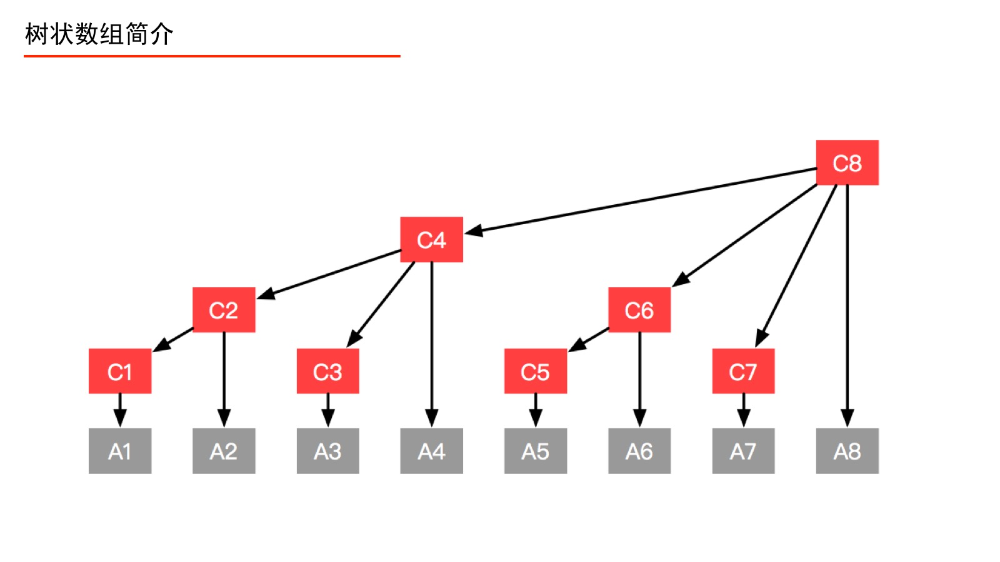
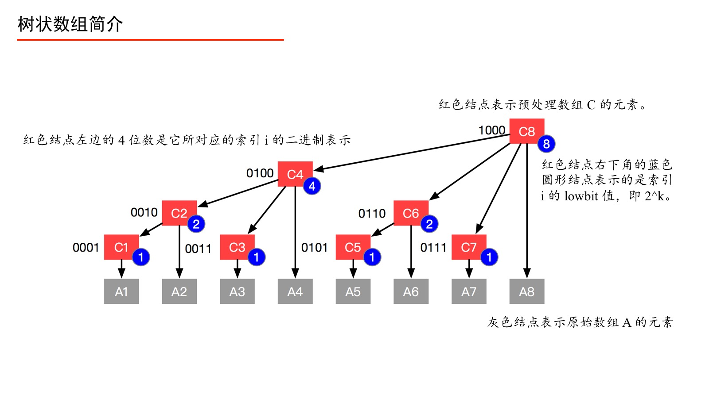

## 1. 二叉索引树

树状数组，也称作“二叉索引树”（Binary Indexed Tree）或 Fenwick 树。 它可以高效地实现如下两个操作：1、数组前缀和的查询；2、单点更新。前缀和数组知道了，区间和也可以很快地求出来。那如果我要执行“单点更新”，**就得更新这个前缀和数组，又得计算一次前缀和，时间复杂度为 O(n)。Fenwick 树就是“高效的”实现“前缀和”和“单点更新”这两个操作的数据结构。**



例如我们要查询“前缀和(4)”，本来应该问 `A1`、`A2`、`A3`、`A4`，有了数组 `C` 之后，我们只要问 `C4` 即可。再如，我们要更新结点 `A1` 的值，只要自底向上更新 `C1`、`C2`、`C4`、`C8` 的值即可。我们构建好数组 `C` 以后，就完全可以抛弃数组 `A` 了。

从当前索引 i 开始，从右向前数出 2^k 个数组 A 中的元素的和，即组成了 C[i]。

记号 k ：将 i 的二进制表示从右向左数出的 0 的个数，遇到 1 则停止，记为 k。 我们只对数组 C 的索引 i 进行这个计算，数组 A 的索引 j 不进行相应的计算。


2^k 是我们最终想要的。下面我们介绍一种很酷的操作，叫做 `lowbit` ，它可以高效地计算 2k，即我们要证明：

```java
lowbit(i) = i & (-i)
lowbit(i)=2^k
```

首先，我们知道负数的二进制表示为：相应正数的二进制表示的反码 `+ 1`。

例7：计算 −6 的二进制表示。

分析：6 的二进制表示为 00000110，先表示成反码，即“ 0 变 1，1 变 0”，得 11111001，再加 1，得 11111010。

例8：当 i = 6 时，计算 lowbit(i) 。

分析：由例 7 及“与”运算的定义，把它们按照数位对齐上下写好：

```plain
0000 0110
1111 1010
0000 0010
```

说明：上下同时为 1 才写 1，否则写 0，最后得到 `0000 0010`，这个二进制数表示成十进制数就是 2。

下面直观解释：如果我们直接将一个整数“按位取反”，再与原来的数做“与”运算，一定得到 0。巧就巧在，负数的二进制表示上，除了要求对“按位取反”以外，还要“加” 1，在“加 ” 1 的过程中产生的进位数即是“将 i 表示成二进制以后，从右向左数，遇到 1 停止时数出 0 的个数”。取反之后，0变成1，加上1就会进位。

### 1、 “单点更新”操作：“从子结点到父结点”

**如何找到对应的父数组？**


例9：修改 A[3]， 分析对数组 C 产生的变化。

从图中我们可以看出 A[3] 的父结点以及祖先结点依次是 C[3]、C[4]、C[8] ，所以修改了 A[3] 以后 C[3]、C[4]、C[8] 的值也要修改。 

先看 C[3] ，lowbit(3)=1， 3+lowbit(3)=4 就是 C[3] 的父亲结点 C[4] 的索引值。（别管，就是这么来的）
再看 C[4] ，lowbit(4)=4， 4+lowbit(4)=8 就是 C[4] 的父亲结点 C[8] 的索引值。这里就是一个结论。
从图中，也可以验证：“红色结点的索引值 + 右下角蓝色圆形结点的值 = 红色结点的双亲结点的索引值”。

下面我试图解释这个现象：3 即 0011，从右向左，遇到 0 放过，遇到 1 为止，给这个数位加 1，这个操作就相当于加上了一个 2^k 的二进制数，即一个 lowbit 值，有意思的事情就发生在此时，马上就发发生了进位，得到 0100，即 4 的二进制表示。
接下来处理 0100，从右向左，从右向左，遇到 0 放过，遇到 1 为止，给这个数位加 1，同样地，这个操作就相当于加上了一个 2k 的二进制数，即一个 lowbit 值，可以看到，马上就发发生了进位，得到 1000，即 8 的二进制表示。

从我上面的描述中，你可以发现，我们又在做“从右边到左边数，遇到 1 之前数出 0 的个数”这件事情了，
由此我们可以总结出规律：从已知子结点的索引 i ，则结点 i 的父结点的索引 parent 的计算公式为：

```
parent(i)=i+lowbit(i)
```

“单点更新”的代码就可以马上写出来了。

>  A[3] 的父结点以及祖先结点依次是 C[3]、C[4]、C[8] ，所以修改了 A[3] 以后 C[3]、C[4]、C[8] 的值也要修改。

```java
/**
 * 单点更新
 *
 * @param i     原始数组索引 i
 * @param delta 变化值 = 更新以后的值 - 原始值
 */
public void update(int i, int delta) {
    // 从下到上更新，注意，预处理数组，比原始数组的 len 大 1，故 预处理索引的最大值为 len
    while (i <= len) {
        tree[i] += delta;
        i += lowbit(i);//i就是遍历 3，4 8.
    }
}

public static int lowbit(int x) {
    return x & (-x);
}
```

### 2、 “前缀和查询操作”：计算前缀和由预处理数组的那些元素表示”



例 10 ：求出“前缀和(6)”。

由图可以看出“前缀和(6) ” = C[6] + C[4]。

先看 C[6] ，lowbit(6)=2， 6−lowbit(6)=4 正好是 C[6] 的上一个非叶子结点 C[4] 的索引值。这里给出我的一个直观解释，如果下标表示高度，那么上一个非叶子结点，其实就是从右边向左边画一条水平线，遇到的墙的索引。只要这个值大于 0，都能正确求出来。

例11：求出“前缀和(5)”。

再看 C[5] ，lowbit(5)=1， 5−lowbit(6)=4 正好是 C[5] 的上一个非叶子结点 C[4] 的索引值，故“前缀和(5)” = C[5] + C[4]。

例12：求出“前缀和(7)”。

再看 C[7] ，lowbit(7)=1， 7−lowbit(7)=6 正好是 C[7] 的上一个非叶子结点 C[6] 的索引值，再由例9 的分析，“前缀和(7)” =C[7] + C[6] + C[4]。

例13：求出“前缀和(8)”。

再看 C[8] ，lowbit(8)=8， 8−lowbit(8)=0 ， 0 表示没有，从图上也可以看出从右边向左边画一条水平线，不会遇到的墙，故“前缀和(8)” = C[8] 。

经过以上的分析，求前缀和的代码也可以写出来了。

```java
/**
 * 查询前缀和
 *
 * @param i 前缀的最大索引，即查询区间 [0, i] 的所有元素之和
 */
public int query(int i) {
// 从右到左查询
int sum = 0;
while (i > 0) {
    sum += tree[i];
    i -= lowbit(i);
}
return sum;
}
```

可以看出“单点更新”和“前缀和查询操作”的代码量其实是很少的。

### 3、树状数组的初始化

这里要说明的是，初始化前缀和数组应该交给调用者来决定。下面是一种初始化的方式。树状数组的初始化可以通过“单点更新”来实现，**因为“最最开始”的时候，数组的每个元素的值都为 0，每个都对应地加上原始数组的值，**就**完成了预处理数组 C 的创建。**
这里要特别注意，`update` 操作的第 2 个索引值是一个变化值，而不是变化以后的值。因为我们的操作是逐层上报，汇报变更值会让我们的操作更加简单，这一点请大家反复体会。

```java
public FenwickTree(int[] nums) {
    this.len = nums.length + 1;
    tree = new int[this.len + 1];
    for (int i = 1; i <= len; i++) {
        update(i, nums[i]);
    }
}
```

基于以上所述，树状数组的完整代码已经可以写出来了。

Java 代码：

```java
public class FenwickTree {

    /**
     * 预处理数组
     */
    private int[] tree;
    private int len;

    public FenwickTree(int n) {
        this.len = n;
        tree = new int[n + 1];
    }

    /**
     * 单点更新
     *
     * @param i     原始数组索引 i
     * @param delta 变化值 = 更新以后的值 - 原始值
     */
    public void update(int i, int delta) {
        // 从下到上更新，注意，预处理数组，比原始数组的 len 大 1，故 预处理索引的最大值为 len
        while (i <= len) {
            tree[i] += delta;
            i += lowbit(i);
        }
    }

    /**
     * 查询前缀和
     *
     * @param i 前缀的最大索引，即查询区间 [0, i] 的所有元素之和
     */
    public int query(int i) {
        // 从右到左查询
        int sum = 0;
        while (i > 0) {
            sum += tree[i];
            i -= lowbit(i);
        }
        return sum;
    }

    public static int lowbit(int x) {
        return x & (-x);
    }
}
```


### 例1：《剑指 Offer 》第 51 题：逆序数的计算

传送门：[数组中的逆序对](https://leetcode.cn/problems/shu-zu-zhong-de-ni-xu-dui-lcof/solutions/622496/jian-zhi-offer-51-shu-zu-zhong-de-ni-xu-pvn2h/)。

要求：在数组中的两个数字如果前面一个数字大于后面的数字，则这两个数字组成一个逆序对。

输入一个数组，求出这个数组中的逆序对的总数。

样例

```plain
输入：[1,2,3,4,5,6,0]

输出：6
```

分析：这道题最经典的思路是使用分治法计算，不过使用树状数组语义更清晰一些。

> ```java
> class Solution {
>     int[] record;
>     int[] B;
>     public int reversePairs(int[] record) {
>         //归并排序的时候，如果是逆序的合并那就是有，左边的[left,mid],当前为i，那就是i到mid，都会比
>         //右边的数组[mid+1,right]的都要大，都是逆序对，也就是res+=(mid-i+1);
>         this.record = record;
>         this.B = new int[record.length];
>         return merge(0,record.length-1);
>     }
>     int merge(int left,int right){
>         if(left>=right) return 0;
>         int mid = (left+(right-left)/2);
>         int res = merge(left,mid)+merge(mid+1,right);
>         
>         for(int i = left;i<=right;i++){
>             B[i]=record[i];//先复制一份，之后好直接更改record的记录
>         }
>         int i = left,j=mid+1,k = left;
>         while(k<=right){
>             if(i==mid+1){
>                 record[k++] = B[j++];
>             }else if(j ==right+1 || B[i]<=B[j]){
>                 record[k++] = B[i++];
>             }else{
>                 record[k++]=B[j++];
>                 //此时就是逆序对
>                 res+=(mid-i+1);
>             }
>         }
>         return res;
>     }
> }
> ```
>
> 