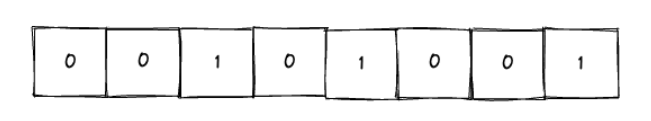
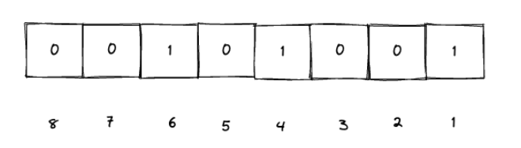
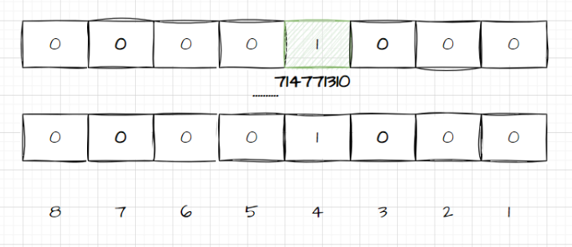

有许多方法可以用来去重,比如使用列表、集合等等,但这些方法通常只适用于一般情况,然而,当涉及到大量数据去重时,常见的 Java Set、List,甚至是 Java 8 的新特性 Stream 流等方式就显得不太合适了,本文给大家介绍了Java中利用BitMap位图实现海量级数据去重

## 1.前言

有许多方法可以用来去重，比如使用列表、集合等等，但这些方法通常只适用于一般情况。然而，当涉及到大量数据去重时，常见的 Java Set、List，甚至是 Java 8 的新特性 Stream 流等方式就显得不太合适了。在处理大量数据的需求场景下，我们不得不提及 BitMap。

## 2.什么是BitMap？有什么用？

### 2.1.基本概念

位图（BitMap），基本思想就是用一个bit来标记元素，bit是计算机中最小的单位，也就是我们常说的计算机中的0和1，这种就是用一个位来表示的。

所谓位图，其实就是一个bit数组，即每一个位置都是一个bit，其中的取值可以是0或者1



像上面的这个位图，可以用来表示1，4，6：



如果不用位图的话，我们想要记录1，4，,6 这三个整型的话，就需要用三个unsigned int，已知每个unsigned int占4个字节，那么就是3_4 = 12个字节，一个字节有8 bit，那么就是 12_8 = 96 个bit。

所以，**位图最大的好处就是节省空间。**

位图有很多种用途，特别适合用在去重、排序等场景中，著名的布隆过滤器就是基于位图实现的。

### 2.2.位图的优势

- **空间效率优势**：极大的节省了存储空间，对于大量稀疏数据，特别是当元素数量远大于实际存在的项时，相比较于使用传统的列表、集合等数据结构，位图的空间占用极小。
- **查询速度**：由于内存访问时按字节或字进行的。因此对单个元素的存在性检查时间复杂度为O(1)，即常量时间，非常快速。
- **批量操作高效**：对于批量插入、删除和查询操作，尤其是统计范围内元素的数量，位图表现出优秀的性能。

### 2.3.位图的劣势

但是位图也有着一定的限制，那就是他只能表示0和1，无法存储其他的数字。所以他只适合这种能表示true or false的场景。

## 3.BitMap和Int的区别

以Java中的int为例，来对比观察BitMap的优势，再Java中，int类型通常需要32位，而BitMap使用1位就可以来标识此元素是否存在，所以可以认为BitMap占用的空间大小只有int类型的1/32，所以有大量数据判重时，使用BitMap也可以实现。

了解了什么是BitMap，那么我们就可以使用BitMap来解决大量数据去重的问题

## 4.使用场景

假设我们有40亿个无符号整数数据，并且都是10位的话，如果直接使用内存来存储，大约需要14.9GB 的空间。

每个无符号整数通常占用4个字节（32位），因此40亿个无符号整数所需要的总字节数位4*4000000000字节。 总字节数转换为GB：4*4000000000 / 1024 / 1024 /1024 = 14.9 GB

考虑到其中有一些重复的数据，即使这样1G的空间基本上也是不够的。所以想要实现这个功能可以借助BitMap。

如果使用位图的话，40亿万所需要的内存大概也就是 476M

40亿无符号整数数据的总字节数是4000000000 字节，在位图中1个10位的无符号整数可以使用1 bit表示，然后1 字节 = 8 位（bit）。 4000000000 bit * 1/8 求出字节数，再 / 1024得到占用的KB数，最后/ 1024得到占用的MB数 4000000000 * 1 /8 /1024/1024 = 476M

这样相比于之前的14.9G来说，大大的节省了很多空间。

比如要把数据"714771310"放到BitMap中，就需要找到第714771310这个位置，然后把他设置成1就可以了。



这样，把40亿个数字都放到BitMap之后，所有位置上是1的表示存在，不为1的表示不存在，相同的数据只需要设置一次1就可以了，那么，最终就把所有是1的数字遍历出来就行了。

## 5.BitMap在Java中的使用

BitMap在Java中的具体实现时java.util中的BitSet，BitSet是一个可变大小的位向量，能够动态增长以容纳更多的数据，以下是BitSet基本使用示例：

```java
import java.util.BitSet;
  
public class BitmapExample {
    public static void main(String[] args) {
        // 创建一个BitSet实例
        BitSet bitmap = new BitSet();
  
        // 设置第5个位置为1，表示第5个元素存在
        bitmap.set(5);
  
        // 检查第5个位置是否已设置
        boolean exists = bitmap.get(5);
        System.out.println("Element at position 5 exists: " + exists);  // 输出: Element at position 5 exists: true
  
        // 设置从索引10到20的所有位置为1
        bitmap.set(10, 21);  // 参数是包含起始点和不包含终点的区间
  
        // 计算bitset中所有值为1的位的数量，相当于计算设置了的元素个数
        int count = bitmap.cardinality();
        System.out.println("Number of set bits: " + count);
  
        // 清除第5个位置
        bitmap.clear(5);
  
        // 判断位图是否为空
        boolean isEmpty = bitmap.isEmpty();
        System.out.println("Is the bitset empty after clearing some bits? " + isEmpty);
    }
}
```

## 6.总结 

本文简单的讲解了如何使用BitMap进行大量数据的去重，BitMap的空间占用极小，对单个元素的存在性检查时间复杂度为O(1)，非常快速，除了BitMap外，我们也可以采取布隆过滤器来完成去重，但是布隆过滤器存在误判问题，可以根据实际场景来分析使用哪种方案

