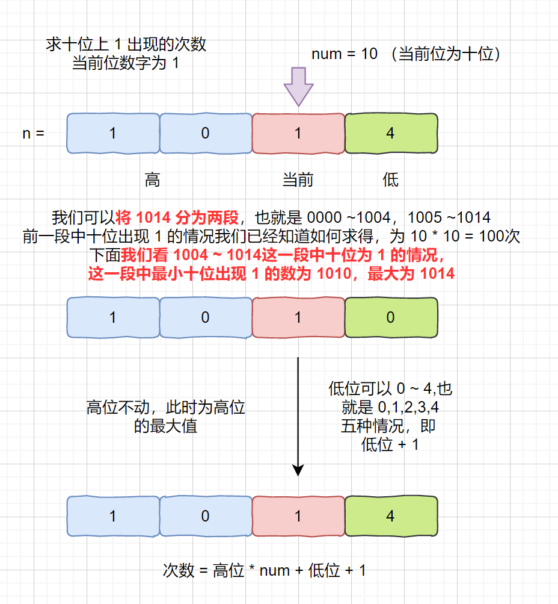

## leetcode 233. 数字 1 的个数

**题目描述**

给定一个整数 n，计算所有小于等于 n 的非负整数中数字 1 出现的个数。

示例 1：

输入：n = 13
输出：6

示例 2：

输入：n = 0
输出：0

太喜欢这种简洁的题目啦，言简意赅，就是让咱们找出**小于等于 n 的非负整数中数字 1 出现的个数**。

大家看到这个题目的第一印象，可能会这样想，哦，让我们求 1 的个数。

呐我们直接逐位遍历每个数的每一位，当遇到 1 的时候，计数器 +1，不就行了。

嗯，很棒的方法，可惜会超时。（我试了）

或者说，我们可以先将所有数字拼接起来，然后再逐位遍历，这样仍会超时。（我也试了）

大家再思考一下还有没有别的方法呢？

既然题目让我们统计小于等于 n 的非负整数中数字 1 出现的个数。

那我们可以不可这样统计。

我们假设 n = abcd，某个四位数。


那我们完全可以统计每一位上 1 出现的次数，个数上 1 出现的次数，十位上 1 出现的次数，百位 ，千位。。。

也就是说**小于等于 n 的所有数字中**，个位上出现 1 的次数 + 十位出现 1 的次数 + 。。。最后得到的就是总的出现次数。

见下图

我们假设 n = 13 (用个小点的数，比较容易举例)


我们需要统计小于等于 13 的数中，出现 1 的次数，

通过上图可知，个位上 1 出现 2 次，十位上 1 出现 4 次

那么总次数为 2 + 4 = 6 次。

另外我们发现 11 这个数，会被统计 2 次，它的十位和个位都为 1 ，

而我们这个题目是要统计 1 出现的次数，而不是统计包含 1 的整数，所以上诉方法不会出现重复统计的情况。

我们题目已经有大概思路啦，下面的难点就是如何统计每一位中 1 出现的次数呢？

我们完全可以通过遍历 n 的每一位来得到总个数，见下图


假设我们想要得到十位上 1 出现的次数，当前我们指针指向十位，

我们称之为当前位。num 则代表当前位的位因子，当前位为个位时 num = 1，十位时为 10，百位时为 100....

那我们将**当前位左边的定义为高位**，**当前位右边的定义位低位**。

例：n = 1004 ，此时指针指向十位（当前位）num = 10，高位为百位，千位，低位为个位

> 总结：总而言之就是：
>
> ```java
> if (cur==0){
>       cnt+=high*digit;//高位是[000->high] high+1个组合，接一位，high位数[000,high-1]
>       // cur变成1固定，digit有多少位就是多少个
>   } else if (cur == 1) {
>       // high-1-low 不需要借位，直接分成 high-0-0加0-1-low
>       // 0-1-low就是[0->low]也就是low+1个组合
>       cnt+=high*digit+low+1;
>   }else {
>       cnt+=(high+1)*digit;//digit种组合，因为可以随机[0->digit-1]
>       //比如digit是10，那么就有10种组合[0->9];
>   }
> ```
>
> 

而且我们某一位的取值范围为 0 ~ 9, 那么我们可以将这 10 个数分为 3 类，小于 1 （当前位数字为 0 ），等于 1（当前位数字为 1 ） ，大于 1（当前位上数字为 2 ~ 9），下面我们就来分别考虑三种情况。

**我们进行举例的 n 为 1004，1014，1024。重点讨论十位上 3 种不同情况**。大家阅读下方文字之前，先想象自己脑子里有一个行李箱的滚轮密码锁，我们固定其中的某一位，然后可以随意滑动其他位，这样可以帮助大家理解。

注：该比喻来自与网友 ryan0414，看到的时候，不禁惊呼可太贴切了！

### **n = 1004**

我们想要计算出**小于等于 1004 的非负整数中**，十位上出现 1 的次数。

也就是当前位为十位，数字为 0 时，十位上出现 1 的次数。


解析：为什么我们可以直接通过高位数字 * num，得到 1 出现的次数

因为我们高位为 10，可变范围为 0 ~ 10，但是我们的十位为 0 ，所以高位为 10 的情况取不到，所以共有 10 种情况。

又当前位为十位，低位共有 1 位，可选范围为 0 ~ 9 共有 10 种情况，所以直接可以通过 10 * 10 得到。

其实不难理解，我们可以设想成行李箱的密码盘，在一定范围内，也就是上面的 0010 ~ 0919 ， 固定住一位为 1 ，只能移动其他位，看共有多少种组合。

好啦，这个情况我们已经搞明白啦，下面我们看另一种情况。

### n = 1014

我们想要计算出**小于等于 1014 的非负整数中**，十位上出现 1 的次数。

也就是当前位为十位，数字为 1 时，十位上出现 1 的次数。

我们在小于 1014 的非负整数中，十位上为 1 的最小数字为 10，最大数字为 1014，所以我们需要在 10 ~ 1014 这个范围内固定住十位上的 1 ，移动其他位。

其实然后我们可以将 1014 看成是 1004 + 10 = 1014

则可以将 10 ~ 1014 拆分为两部分 0010 ~ 0919 （小于 1004 ），1010 ~ 1014。

见下图





解析：为什么我们可以直接通过 高位数字 * num + 低位数字 + 1 即 10 * 10 + 4 + 1

得到 1 出现的次数

高位数字 * num 是得到第一段的次数，第二段为 低位数字 + 1，求第二段时我们高位数字和当前位已经固定，

我们可以改变的只有低位。

可以继续想到密码盘，求第二段时，把前 3 位固定，只能改变最后一位。最后一位最大能到 4 ，那么共有几种情况？

### n = 1024

我们想要计算出**小于等于 1024 的非负整数中**，十位上出现 1 的次数。

也就是当前位为十位，数字为 2 ~ 9 时，十位上出现 1 的次数。其中最小的为 0010，最大的为 1019

我们也可以将其拆成两段 0010 ~ 0919，1010 ~ 1019


解析：为什么我们可以直接通过高位数字 * num + num， 10 * 10 + 10 得到 1 出现的次数

第一段和之前所说一样，第二段的次数，我们此时已经固定了高位和当前位，当前位为 1，低位可以随意取值，上诉例子中，当前位为 10，低位为位数为 1，则可以取值 0 ~ 9 的任何数，则共有 10 (num) 种可能。

好啦，这个题目大家应该理解的差不多啦，

好啦，下面我们看一下题目代码吧

注：下方代码没有简写，也都标有注释，大家可以结合动画边思考边阅读。

**题目代码**

```java
class Solution {
    public int countDigitOne(int n) {
        //高位
        int high = n;
        //低位
        int low = 0;
        //当前位
        int cur = 0;
        int count = 0;
        int num = 1;
        while (high != 0 || cur != 0) {
            cur = high % 10;
            high /= 10;
            //这里我们可以提出 high * num 因为我们发现无论为几，都含有它 
            if (cur == 0) count += high * num;
            else if (cur == 1) count += high * num + 1 + low; 
            else count += (high + 1) * num;
            //低位
            low = cur * num + low;                  
            num *= 10;
        }
        return count;
    }
}
```

```java
class Solution {
    public int countDigitOne(int n) {
        int high = n;
        int low = 0;
        int cur = 0;
        int cnt = 0;
        int digit = 1;
        while (high!=0||cur!=0){
            cur = high%10;//最右边的值
            high/=10;
            if (cur==0){
                cnt+=high*digit;//高位是[000->high] high+1个组合，接一位，high位数[000,high-1]
                // cur变成1固定，digit有多少位就是多少个
            } else if (cur == 1) {
                // high-1-low 不需要借位，直接分成 high-0-0加0-1-low
                // 0-1-low就是[0->low]也就是low+1个组合
                cnt+=high*digit+low+1;
            }else {
                cnt+=(high+1)*digit;//digit种组合，因为可以随机[0->digit-1]
                //比如digit是10，那么就有10种组合[0->9];
            }
            low += cur*digit;
            digit*=10;
        }
        return cnt;
    }
}
```


时间复杂度 : O(logn) 空间复杂度 O(1)

参考链接：[K 神](https://leetcode-cn.com/problems/1nzheng-shu-zhong-1chu-xian-de-ci-shu-lcof/solution/mian-shi-ti-43-1n-zheng-shu-zhong-1-chu-xian-de-2/)

另外我将我所有的 动画题解文章全部开源在了 Github 上，大概**有 80 来篇文章， 100 多个动画**，专门为刚刷题的同学准备的算法基地。

[Github 地址](https://leetcode.cn/link/?target=https%3A%2F%2Fgithub.com%2Fchefyuan%2Falgorithm-base)

另外大家如果需要加入**刷题打卡小队**，**互相监督，共同进步**。可以点击我的小屋内的**刷题小队**进入，但是要**记得备注和坚持打卡**。

还整理了一份面试必刷题大纲，也可以在我的小屋点击刷题大纲获取。

[小屋地址](https://leetcode.cn/link/?target=https%3A%2F%2Fcdn.jsdelivr.net%2Fgh%2Ftan45du%2Fphotobed@master%2F微信图片_20210320152235.2c1f5hy6gmas.png)

全文完

本文由 [简悦 SimpRead](http://ksria.com/simpread) 优化，用以提升阅读体验

使用了 全新的简悦词法分析引擎 beta，[点击查看](http://ksria.com/simpread/docs/#/词法分析引擎)详细说明


[leetcode 233. 数字 1 的个数](https://leetcode.cn/problems/1nzheng-shu-zhong-1chu-xian-de-ci-shu-lcof/solutions/757536/dong-hua-mo-ni-wo-tai-xi-huan-zhe-ge-ti-vxzwc/#sr-toc-0)[n = 1004](https://leetcode.cn/problems/1nzheng-shu-zhong-1chu-xian-de-ci-shu-lcof/solutions/757536/dong-hua-mo-ni-wo-tai-xi-huan-zhe-ge-ti-vxzwc/#sr-toc-1)[n = 1014](https://leetcode.cn/problems/1nzheng-shu-zhong-1chu-xian-de-ci-shu-lcof/solutions/757536/dong-hua-mo-ni-wo-tai-xi-huan-zhe-ge-ti-vxzwc/#sr-toc-2)[n = 1024](https://leetcode.cn/problems/1nzheng-shu-zhong-1chu-xian-de-ci-shu-lcof/solutions/757536/dong-hua-mo-ni-wo-tai-xi-huan-zhe-ge-ti-vxzwc/#sr-toc-3)