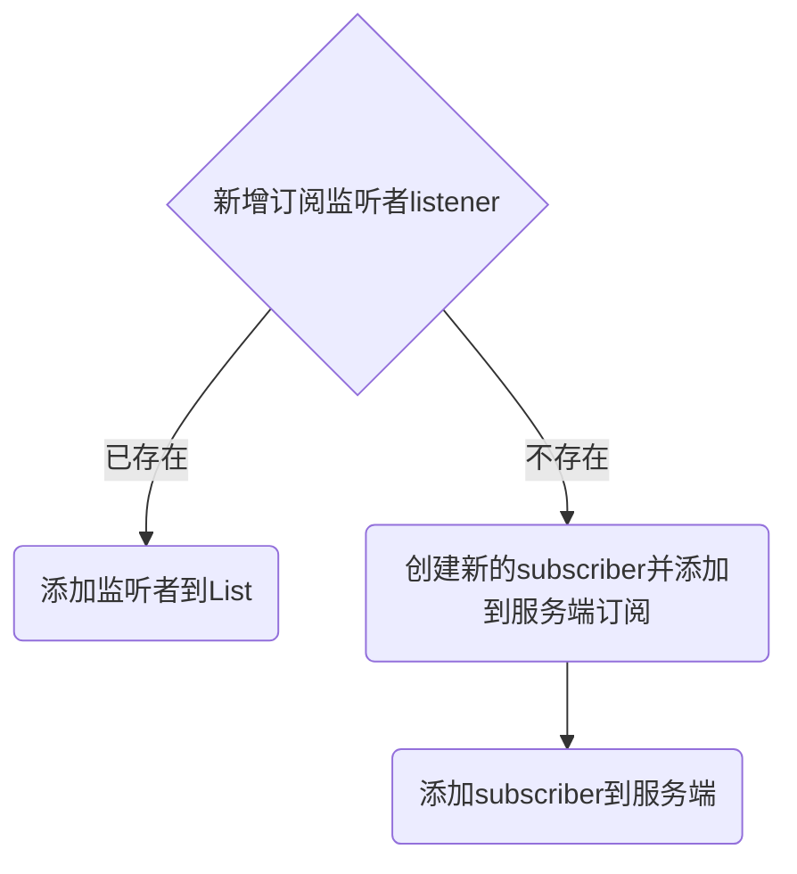

# 项目申请书

项目名称: 客户端订阅者合并和数据选择功能

项目主导师: 杨翊[yangyi@apache.org](mailto:yangyi@apache.org)

申请人:  陈贤文

日期: 2023年5月28日

邮箱: mcxw@hust.edu.cn

---

[TOC]

## 1.项目背景

Nacos 2.0 的服务发现功能中，通常用户都会订阅某一个服务下的所有服务提供者。但对于某些特殊使用场景，例如将服务拆分成逻辑集群时，用户只希望订阅某个或某几个逻辑集群，而不是获得所有的服务提供者。

这时Nacos可以通过指定订阅的`clusters`来指定所需要的逻辑集群。

不过在使用此功能时，用户需要有一定的限制，当用户需要新增订阅一个新的逻辑集群时，用户需要将之前已经订阅的逻辑集群都在新的订阅者中配置，同时要将旧的订阅者取消；

如果不将旧订阅者取消，可能会导致服务在变更后，重复进行数据推送，导致服务端和客户端的压力增大，这对用户的使用十分不友好且难以理解。

因此，社区希望修改这方面的功能，使得客户端在订阅服务时生成一个两层订阅的结构，将用户订阅的具体逻辑集群及选择器和客户端实际向服务端订阅的逻辑解耦。 客户端仅向服务端订阅该服务的数据，收到数据后通过客户端本地的过滤器或选择器，针对不同的用户订阅者回调其所需的数据。这种方式不仅可以减轻服务端的压力，还可以降低客户端内存的占用。同时，这种实现方式还可以更好地支持服务的动态更新。这是一种更为灵活和高效的订阅方式，能够更加方便地应对各种使用场景。

技术要求：

1. 熟悉Java编程语言
2. 熟悉常见的设计模式
3. 熟悉并发编程
4. 熟悉markdown

项目产出：

1. 设计并实现用户的订阅监听者`listener`和数据订阅者`subscriber`的映射关系，使得多个相同服务的`listener`合并成一个`subscriber`到服务端进行订阅
2. 设计并实现新的回调机制，使得nacos-server通知数据订阅者`subscriber`后，能够根据订阅监听者`listener`的配置，进行数据选择，再回调给`listener`
3. 对实现进行测试用例的编写，保证功能的正确运行。
4. 添加对应的功能文档说明，例如如何配置数据选择器等。

## 2.技术方法及可行性

该项目将基于Java语言的并发编程实现，我对Java的JUC较熟悉，如共享模型、非共享模型、Java并发锁、AQS、Java并发工具类、Java并发容器等。

我对Java开发有项目经历，曾基于Spring Boot框架，Mybatis和Spring JDBC开发小程序，用Thymeleaf模板引擎，设计web应用。

## 3.项目实现细节梳理

### 3.1 订阅监听者`listener`和数据订阅者`subscriber`的映射关系

1. 在客户端启动时，需要初始化一个`ConcurrentMap<String, List<Listener>> listenerMap`用于存储服务名与订阅监听者`listener`之间的映射关系。
2. 在新增一个订阅监听者`listener`时，需要将其添加到相应服务名的`List<Listener>`中，并查询该服务名对应的`subscriber`是否已经存在。如果不存在，则需要创建新的`subscriber`并添加到服务端进行订阅。
3. 在客户端关闭时，需要清除所有的`listener`，并将相应服务名的`subscriber`取消订阅。

### 3.2 新的回调机制

设计并实现新的回调机制，使得 nacos-server 通知数据订阅者 `subscriber` 后，能够根据订阅监听者 `listener` 的配置，进行数据选择，再回调给 `listener`，需要进行以下步骤：

1. 在 `nacos-server` 中，为 `Subscriber` 接口新增一个方法 `notifyListeners(List<ListenerConfig> listenerConfigs, Map<String, String> data)`。该方法将被调用，当数据更新时，用于通知订阅者并选择数据后回调订阅监听者。

2. 在 `nacos-client` 中，新增一个接口 `DataFilter`，用于定义数据选择的接口，并在 `Listener` 中新增一个方法 `onDataChange(DataFilter dataFilter, Map<String, String> data)`。该方法将被调用，当订阅数据更新时，用于将数据传递给 `DataFilter` 进行选择，并将选择后的数据回调给监听者。

3. 在 `nacos-client` 中，实现 `DataFilter` 接口，用于实现数据选择逻辑。例如，可以根据 `ListenerConfig` 中的过滤条件选择数据。

4. 在 `nacos-client` 中，实现 `Listener` 接口的 `onDataChange` 方法，将数据传递给 `DataFilter` 进行选择，并将选择后的数据回调给监听者。

5. 在 `nacos-client` 中，新增一个类 `ListenerConfig`，用于定义订阅监听者的配置信息，例如，服务名、集群名、组名等。

6. 在客户端启动时，需要初始化一个 `ConcurrentMap<String, List<ListenerConfig>> listenerConfigMap` 用于存储服务名与订阅监听者配置之间的映射关系。

7. 在新增一个订阅监听者时，需要将其添加到相应服务名的 `List<ListenerConfig>` 中，并查询该服务名对应的 `Subscriber` 是否已经存在。如果不存在，则需要创建新的 `Subscriber` 并添加到服务端进行订阅。

8. 在 `Subscriber` 的 `notifyListeners` 方法中，根据 `listenerConfigs` 配置信息选择数据，并将数据回调给对应的监听者。

通过以上步骤，我们就可以实现新的回调机制，使得 nacos-server 通知数据订阅者 `subscriber` 后，能够根据订阅监听者 `listener` 的配置，进行数据选择，再回调给 `listener`。

### 3.3测试用例编写

- 编写单元测试用例，验证订阅监听者`listener`和数据订阅者`subscriber`映射关系的正确性，需要进行以下步骤：

1. 创建一个 `listenerMap` 对象，并添加若干个服务名和对应的 `Listener`。

2. 创建一个 `Subscriber` 对象，并将其添加到 `listenerMap` 中的某个服务名下。

3. 对 `listenerMap` 进行断言，验证 `Subscriber` 是否成功添加到对应的服务名下。

4. 清除 `listenerMap` 中的所有监听者，并对 `Subscriber` 进行断言，验证其是否已经取消订阅。

5. 对于新增监听者和新增服务名的情况，分别进行测试，验证映射关系的正确性。

- 编写单元测试用例，验证选择器`Selector`的正确性，需要进行以下步骤：

1. 创建一个 `Selector` 对象，并添加若干个数据项。

2. 创建一个 `DataFilter` 对象，并实现数据选择的逻辑。

3. 调用 `Selector` 的 `select` 方法，并传入 `DataFilter` 对象，验证选择器是否能够根据 `DataFilter` 选择正确的数据。

4. 对于新增数据项和修改数据项的情况，分别进行测试，验证选择器的正确性。

### 3.4功能文档说明

编写文档说明，

1. 对于新增和取消订阅监听者，需要说明如何在客户端代码中添加和删除监听器，并介绍订阅监听者配置信息的格式和含义。

2. 需要说明新订阅方式的优点和适用场景。比如，该方式可以减轻服务端的压力、降低客户端内存的占用，支持服务的动态更新等等。同时，需要说明该方式适用于哪些场景，以便用户能够更好地了解该功能的使用。

3. 需要提供如何配置数据选择器的说明，以便用户能够在需要的时候进行配置。需要说明选择器的配置信息的格式和含义，并提供示例代码，以便用户更好地理解。同时，需要说明如何处理异常情况，例如当选择器配置有误时应该如何处理。
4. 需要提供示例代码，以便用户更好地理解如何使用新增的回调机制。

5. 需要说明如何处理异常情况，例如，当没有找到对应服务名的订阅监听者时，应该如何处理。

6. 需要说明如何在多线程环境下使用新增的回调机制，以及如何保证线程安全。

## 4.规划

### 1.项目研发第一阶段

（07 月 01 日 - 08 月01 日）： 

在这个阶段，需要探索NACOS中的服务发现功能，并撰写技术洞察博客。

- 了解 [开发手册](https://nacos.io/zh-cn/docs/v2/quickstart/quick-start.html) 的信息，对nacos项目有初步了解。
- 对订阅监听者`listener`和数据订阅者`subscriber`的映射关系进行文献调研，编写调研博客。

### 2.项目研发第二阶段

（08 月 02日 - 08 月 30 日）： 

在该阶段，需要确定项目技术栈、搭建开发环境、完成核心代码的编写、测试和优化。

设计并实现新的回调机制，使得nacos-server通知数据订阅者`subscriber`后，能够根据订阅监听者`listener`的配置，进行数据选择，再回调给`listener`

主要任务是增加性能和可用性优化。在该阶段，需要对代码进行进一步优化，提高程序的性能和并发处理能力。例如：使用线程池机制、使用原子性操作等方法，来优化线程的创建、协作和销毁。另外，还可以增加代码的健壮性和可靠性，增强程序的容错性和安全性。

### 3.项目测试和部署

（08 月 30日 - 09 月 30 日）： 

完善文档和测试用例，提高项目的可读性和可维护性。在该阶段，

- 需要编写详细的开发文档，介绍代码实现的细节和设计思路，并提供用户手册和常见问题解答。
- 也需要编写全面的测试用例，验证代码的正确性和稳定性，提高代码的质量和可靠性。

