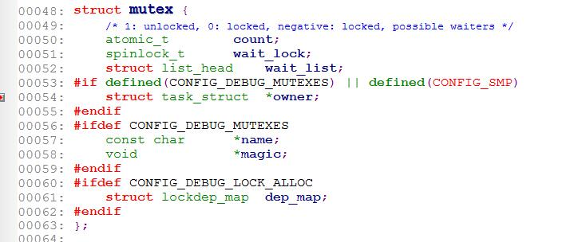
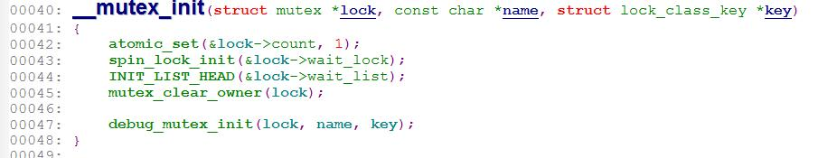
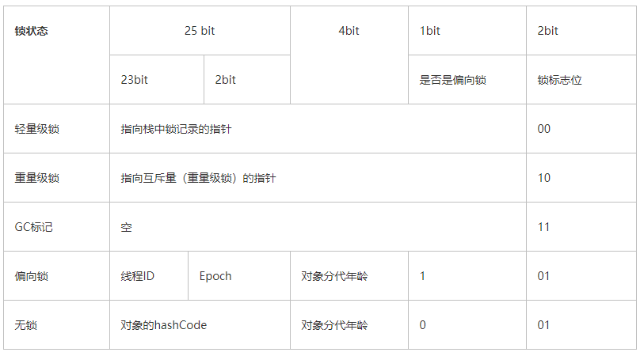
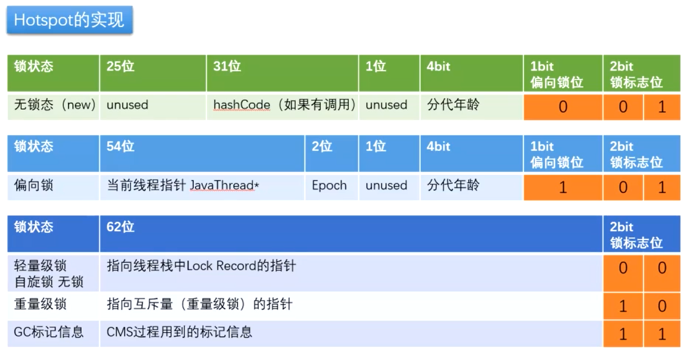
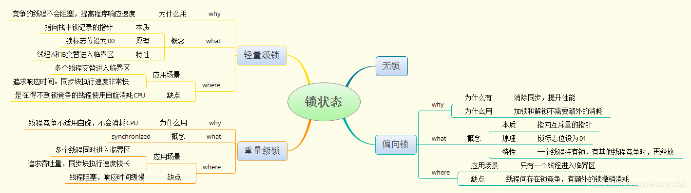
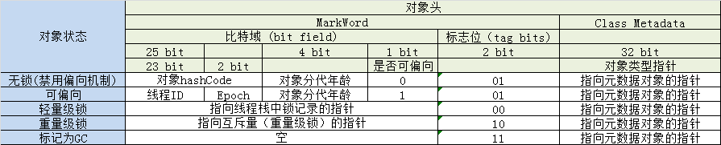
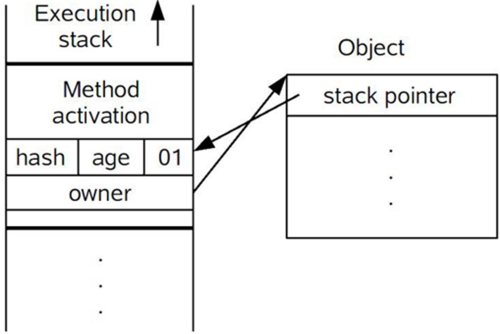
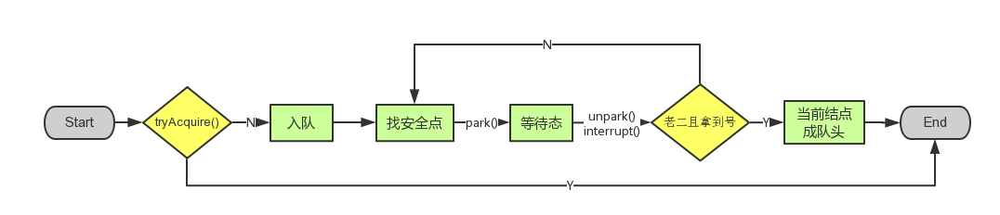

### Java中的锁和应用场景

***首先强调一点：Java多线程的锁都是基于对象的，Java中的每一个对象都可以作为一个锁。同时，类锁也是对象锁，类是Class对象***

#### Synchronized

##### 关于Synchronized的线程8锁问题

**现在的需求如下：两个线程打印，判断先发短信还是先打电话**

- 1、标准情况下 两个线程先打印 发短信还是打电话 1/发短信 2/打电话
- 2、sendMessage 延迟4秒 两个线程先打印 发短信还是打电话  1/发短信 2/打电话
- 3、增加了一个普通方法 先打印sendMessage还是hello 1/sendMessage 2/hello
- 4、两个对象，两个同步方法，发短信还是电话  1/callMessage 2/sendMessage 不同的锁，对象不一样，就看执行的时间
- 5、增加两个静态同步方法 只有一个对象 1/发短信 2/打电话
- 6、增加两个静态同步方法 2个对象 1/发短信 2/打电话
- 7、一个静态的同步方法，1个普通的同步方法，1个对象，先打印发短信还是打电话？
- 8、一个静态的同步方法，1个普通的同步方法，2个对象，先打印发短信还是打电话？

**总结**

- 核心思想
  - 关键字在实例方法上，锁为当前实例
  - 关键字在静态方法上，锁为当前Class对象
  - 关键字在代码块上，锁为括号里面的对象
- 在进行线程执行顺序的时候，如果添加了**线程睡眠**，那么就要看锁的对象是谁，**同一把锁 / 非同一把锁**是不一样的

---

##### synchronized底层字节码原理

**synchronized** 是Java提供的关键字，用来保证原子性的

synchronized的作用域如下

- 作用在普通方法上，此方法为原子方法：也就是说同一个时刻只有一个线程可以进入，其他线程必须在方法外等待，此时锁是对象
- 作用在静态方法上，此方法为原子方法：也就是说同一个时刻只有一个线程可以进入，其他线程必须在方法外等待，此时锁是当前的Class对象
- 作用在代码块上，此代码块是原子操作：也就是说同一个时刻只有线程可以进入，其他线程必须在方法外等待，锁是 synchronized(XXX) 里面的 XXX

synchronized的作用主要有下面3个

-  确保线程互斥的访问同步代码 
-  保证共享变量的修改能够及时可见 
-  有效解决重排序问题 

这里又涉及到了新的知识和一个关键字：volatile 

- 原子性
- 可见性
- 禁止指令重排序

**先看一段简单的代码**

```java
package cn.icanci.lock.synchrinized;

/**
 * @author: icanci
 * @date: Created in 2020/10/22 10:06
 * @classAction: Synchronized 底层讲解
 */
@SuppressWarnings("all")
public class SynchronizedTest {
    public static void main(String[] args) {
        test1();
        test2();
    }

    /**
     * 使用synchronized修饰的方法
     */
    public synchronized static void test1() {
        System.out.println("SynchronizedTest.test1");
    }

    /**
     * 使用synchronized修饰的代码块
     */
    public static void test2() {
        synchronized (SynchronizedTest.class) {
            System.out.println("SynchronizedTest.test2");
        }
    }
}

```

**执行之后，对其进行执行`javap -v`命令反编译**

```java
// 省略暂时无用的代码
{
  public cn.icanci.lock.synchrinized.SynchronizedTest();
    descriptor: ()V
    flags: ACC_PUBLIC
    Code:
      stack=1, locals=1, args_size=1
         0: aload_0
         1: invokespecial #1                  // Method java/lang/Object."<init>":()V
         4: return
      LineNumberTable:
        line 9: 0
      LocalVariableTable:
        Start  Length  Slot  Name   Signature
            0       5     0  this   Lcn/icanci/lock/synchrinized/SynchronizedTest;

  public static void main(java.lang.String[]);
    descriptor: ([Ljava/lang/String;)V
	// flags：表示当前方法拥有的标记位 ACC_PUBLIC为public修饰 ACC_STATIC 表示为 static修饰
    flags: ACC_PUBLIC, ACC_STATIC
    Code:
      stack=0, locals=1, args_size=1
         0: invokestatic  #2                  // Method test1:()V
         3: invokestatic  #3                  // Method test2:()V
         6: return
      LineNumberTable:
        line 11: 0
        line 12: 3
        line 13: 6
      LocalVariableTable:
        Start  Length  Slot  Name   Signature
            0       7     0  args   [Ljava/lang/String;

  public static synchronized void test1();
    descriptor: ()V
    // flags：test1() 这个方法添加了synchronized关键字，它的标志位添加了 ACC_SYNCHRONIZED 
    // 表示这个方法为原子方法，那么当线程进来的时候，会先检查是否有这样的一个标记
    // 
    flags: ACC_PUBLIC, ACC_STATIC, ACC_SYNCHRONIZED
    Code:
      stack=2, locals=0, args_size=0
         0: getstatic     #4                  // Field java/lang/System.out:Ljava/io/PrintStream;
         3: ldc           #5                  // String SynchronizedTest.test1
         5: invokevirtual #6                  // Method java/io/PrintStream.println:(Ljava/lang/String;)V
         8: return
      LineNumberTable:
        line 19: 0
        line 20: 8

  public static void test2();
    descriptor: ()V
    flags: ACC_PUBLIC, ACC_STATIC
    Code:
      stack=2, locals=2, args_size=0
         0: ldc           #7                  // class cn/icanci/lock/synchrinized/SynchronizedTest
         2: dup
         3: astore_0
         4: monitorenter
         5: getstatic     #4                  // Field java/lang/System.out:Ljava/io/PrintStream;
         8: ldc           #8                  // String SynchronizedTest.test2
        10: invokevirtual #6                  // Method java/io/PrintStream.println:(Ljava/lang/String;)V
        13: aload_0
        14: monitorexit
        15: goto          23
        18: astore_1
        19: aload_0
        20: monitorexit
        21: aload_1
        22: athrow
        23: return
      Exception table:
         from    to  target type
             5    15    18   any
            18    21    18   any
      LineNumberTable:
        line 26: 0
        line 27: 5
        line 28: 13
        line 29: 23
      StackMapTable: number_of_entries = 2
        frame_type = 255 /* full_frame */
          offset_delta = 18
          locals = [ class java/lang/Object ]
          stack = [ class java/lang/Throwable ]
        frame_type = 250 /* chop */
          offset_delta = 4
}
SourceFile: "SynchronizedTest.java"

Process finished with exit code 0

```

对于上面的指令`monitorenter`和 `monitorexit`作用，我们直接参考JVM规范中描述 

`monitorenter`

```
Each object is associated with a monitor. A monitor is locked if and only if it has an owner. The thread that executes monitorenter attempts to gain ownership of the monitor associated with objectref, as follows:
• If the entry count of the monitor associated with objectref is zero, the thread enters the monitor and sets its entry count to one. The thread is then the owner of the monitor.
• If the thread already owns the monitor associated with objectref, it reenters the monitor, incrementing its entry count.
• If another thread already owns the monitor associated with objectref, the thread blocks until the monitor's entry count is zero, then tries again to gain ownership.
```

这段话的大概意思为：

- 每个对象有一个监视器锁（monitor）。当monitor被占用时就会处于锁定状态，线程执行monitorenter指令时尝试获取monitor的所有权，过程如下：
  - 如果monitor的进入数为0，则该线程进入monitor，然后将进入数设置为1，该线程即为monitor的所有者。
  - 如果线程已经占有该monitor，只是重新进入，则进入monitor的进入数加1.
  - 如果其他线程已经占用了monitor，则该线程进入阻塞状态，直到monitor的进入数为0，再重新尝试获取monitor的所有权。
- `monitorexit`

```
The thread that executes monitorexit must be the owner of the monitor associated with the instance referenced by objectref.
The thread decrements the entry count of the monitor associated with objectref. If as a result the value of the entry count is zero, the thread exits the monitor and is no longer its owner. Other threads that are blocking to enter the monitor are allowed to attempt to do so.
```

这段话的大概意思为：

- 执行monitorexit的线程必须是objectref所对应的monitor的所有者。

- 指令执行时，monitor的进入数减1，如果减1后进入数为0，那线程退出monitor，不再是这个monitor的所有者。其他被这个monitor阻塞的线程可以尝试去获取这个 monitor 的所有权。 

**但是新的问题来了：为什么要有两个 monitorexit呢？**

- 原因：第一个monitorexit是方法正常执行的时候使用，用来触发monitor 减1的，而为了保证方法能够正常释放锁，假如方法出现异常，也需要再释放锁，不然一个线程一直持有方法的锁，所以第二个monitorexit是为了方法执行出现意外情况下，也能够释放锁。所以方法中断或者出现异常或者退出，锁释放的根本原因在这里

**synchronized修饰代码块的结论**

通过这两段描述，我们应该能很清楚的看出Synchronized的实现原理，Synchronized的语义底层是通过一个monitor的对象来完成，其实wait/notify等方法也依赖于monitor对象，这就是为什么只有在同步的块或者方法中才能调用wait/notify等方法，否则会抛出java.lang.IllegalMonitorStateException的异常的原因。 

**synchronized修饰方法的结论**

而针对同步方法，并没有通过指令monitorenter和monitorexit来完成（理论上其实也可以通过这两条指令来实现），不过相对于普通方法，其常量池中多了ACC_SYNCHRONIZED标示符。JVM就是根据该标示符来实现方法的同步的：当方法调用时，调用指令将会检查方法的 ACC_SYNCHRONIZED 访问标志是否被设置，如果设置了，执行线程将先获取monitor，获取成功之后才能执行方法体，方法执行完后再释放monitor。在方法执行期间，其他任何线程都无法再获得同一个monitor对象。 其实本质上没有区别，只是方法的同步是一种隐式的方式来实现，无需通过字节码来完成。 

##### Synchronized底层

通过上面的分析我们知道，Synchronized是通过对象内部的一个叫做监视器锁（monitor）来实现的。但是监视器锁本质又是依赖于底层的操作系统的Mutex Lock来实现的。而操作系统实现线程之间的切换这就需要从用户态转换到核心态，这个成本非常高，状态之间的转换需要相对比较长的时间，这就是为什么Synchronized效率低的原因。因此，这种依赖于操作系统Mutex Lock所实现的锁我们称之为“重量级锁”。JDK中对Synchronized做的种种优化，其核心都是为了减少这种重量级锁的使用。JDK1.6以后，为了减少获得锁和释放锁所带来的性能消耗，提高性能，引入了“轻量级锁”和“偏向锁”。 

##### Linux内核互斥锁 mutex

**内核互斥锁的定义**

 /linux/include/linux/mutex.h 


**作用及访问规则**

互斥锁主要用于实现内核中的互斥访问功能。内核互斥锁是在原子 API 之上实现的，但这对于内核用户是不可见的。

对它的访问必须遵循一些规则：同一时间只能有一个任务持有互斥锁，而且只有这个任务可以对互斥锁进行解锁。互斥锁不能进行递归锁定或解锁。一个互斥锁对象必须通过其API初始化，而不能使用memset或复制初始化。一个任务在持有互斥锁的时候是不能结束的。互斥锁所使用的内存区域是不能被释放的。使用中的互斥锁是不能被重新初始化的。并且互斥锁不能用于中断上下文。

互斥锁比当前的内核信号量选项更快，并且更加紧凑。

各字段详解

- atomic_t count;  //指示互斥锁的状态： 
  - 没有上锁，可以获得；
  - 被锁定，不能获得。
  -  负数：被锁定，且可能在该锁上有等待进程 ，初始化为没有上锁。 
- spinlock_t wait_lock;  //等待获取互斥锁中使用的自旋锁。在获取互斥锁的过程中，操作会在自旋锁的保护中进行。初始化为为锁定。 
- struct list_head wait_list;  //等待互斥锁的进程队列。

**操作**

- 定义并初始化：
  - `struct mutex mutex;`
  - `mutex_init(&mutex);`



直接定义互斥锁mutex并初始化为未锁定，即count为1，wait_lock为未上锁，等待队列wait_list为空。 

-  获取互斥锁：

- 代码：`linux/kernel/mutex.c`

  - `void inline fastcall __sched mutex_lock(struct mutex *lock);   //获取互斥锁。`

- 实际上是先给count做**自减**操作，然后使用本身的自旋锁进入临界区操作。首先取得count的值，在将count置为－1，判断如果原来count的置为1，也即互斥锁可以获得，则直接获取，跳出。否则进入循环反复测试互斥锁的状态。在循环中，也是先取得互斥锁原来的状态，在将其之为－1，判断如果可以获取(等于1)，则退出循环，否则设置当前进程的状态为不可中断状态，解锁自身的自旋锁，进入睡眠状态，待被在调度唤醒时，再获得自身的自旋锁，进入新一次的查询其自身状态(该互斥锁的状态)的循环。 

- 具体参见linux/kernel/mutex.c 

- int fastcall __sched mutex_lock_interruptible(struct mutex *lock)；_

- 和mutex_lock()一样，也是获取互斥锁。在获得了互斥锁或进入睡眠直到获得互斥锁之后会返回0。如果在等待获取锁的时候进入睡眠状态收到一个信号(被信号打断睡眠)，则返回_EINIR。

- 具体参见linux/kernel/mutex.c

  int fastcall __sched mutex_trylock(struct mutex *lock);

  试图获取互斥锁，如果成功获取则返回1，否则返回0，不等待

- 具体参见linux/kernel/mutex.c

  void fastcall mutex_unlock(struct mutex *lock);

  释放被当前进程获取的互斥锁。该函数不能用在中断上下文中，而且不允许去释放一个没有上锁的互斥锁。

**使用形式**

```c
struct mutex mutex;

mutex_init(&mutex); /*定义*/

...

mutex_lock(&mutex); /*获取互斥锁*/

... /*临界资源*/

mutex_unlock(&mutex); /*释放互斥锁*/ 释放互斥锁：
```


#### 无锁、轻量级锁、偏向锁、重量级锁

**Synchronized底层优化（轻量级锁、偏向锁）**







**锁的状态**总共有四种：无锁状态、偏向锁、轻量级锁和重量级锁。随着锁的竞争，锁可以从偏向锁升级到轻量级锁，再升级的重量级锁（但是锁的升级是单向的，也就是说只能从低到高升级，不会出现锁的降级）JDK 1.6中默认是开启偏向锁和轻量级锁的，

**注意：HotSpot JVM是支持锁降级的 但是因为降级的效率太低了，所以在开发中不使用降级的操作**

**但是锁的状态时存在哪里的呢？**

锁存在Java的对象头中的Mark Work。Mark Work默认不仅存放着锁标志位，还存放对象hashCode等信息。运行时，会根据锁的状态，修改Mark Work的存储内容。如果对象是数组类型，则虚拟机用3个字宽存储对象头，如果对象是非数组类型，则用2字宽存储对象头。在32位虚拟机中，一字宽等于四字节，即32bit。

- 字宽（Word）: 内存大小的单位概念， 对于 32 位处理器 1 Word = 4 Bytes， 64 位处理器 1 Word = 8 Bytes
- 每一个 Java 对象都至少占用 2 个字宽的内存(数组类型占用3个字宽)。
  - 第一个字宽也被称为对象头Mark Word。 对象头包含了多种不同的信息， 其中就包含对象锁相关的信息。
  - 第二个字宽是指向定义该对象类信息（class metadata）的指针



##### 无锁状态

- 在代码进入同步块的时候，如果同步对象锁状态为无锁状态（锁标志位为“01”状态，是否为偏向锁为“0”），虚拟机首先将在当前线程的栈帧中建立一个名为锁记录（Lock Record）的空间，用于存储锁对象目前的Mark Word的拷贝，官方称之为 Displaced Mark Word 

##### 偏向锁

- 概念：偏向锁会偏向于第一个访问锁的线程，如果在接下来的运行过程中，该锁没有被其他的线程访问，则持有偏向锁的线程将永远不需要触发同步。也就是说，**偏向锁在资源无竞争的情况下消除了同步语句，连CAS操作都不做了，提高了程序的运行性能**
- 引入偏向锁是为了在无多线程竞争的情况下尽量减少不必要的轻量锁执行路径。因为轻量级锁的获取以及释放依赖多次CAS原子指令，而偏向锁只需要在置换ThreadID的时候依赖一次原子指令（由于一旦出现多线程竞争的情况就必须撤销偏向锁，所以偏向锁的撤销操作的性能损耗必须小于节省下来的CAS原子指令的性能消耗）上面说过，轻量级锁是为了在多线程交替执行同步块时提高性能，而偏向锁则是在只有一个线程执行同步块的时候进一步提高性能。

##### 轻量级锁

- “轻量级”是相对于使用操作系统互斥量来实现传统锁而言的。但是首先需要强调一点的是，轻量级锁并不是用来代替重量级锁的，它的本意是在没有多线程竞争的前提下，减少传统的重量级锁使用产生的性能消耗。
- 在解释轻量级锁的执行过程过程之前，我们要先明白一点，轻量级锁使用的场景是线程交替同步块的情况，如果存在同一时间访问同一锁的情况，就会导致轻量级锁膨胀为重量级。

##### 重量级锁

- synchronized是通过对象内部的一个监视器锁（monitor）实现的。但是monitor底层又依赖于底层操作系统的Mutex Lock实现的。而操作系统实现线程之间的切换就需要从用户态切换到核心态，切换的成本很高，状态之间的转化需要相对比较长的时间，这就是synchronized效率低的原因，因此，这种依赖于操作系统的Mutex Lock所实现的锁被称之为“重量级锁”

---

##### 轻量级锁的加锁过程

- (1)在代码进入同步块的时候，如果同步对象锁状态为无锁状态（锁标志位为“01”状态，是否为偏向锁为“0”），虚拟机首先将在当前线程的栈帧中建立一个名为锁记录（Lock Record）的空间，用于存储锁对象目前的Mark Word的拷贝，官方称之为 Displaced Mark Word 


- (2)拷贝对象头中的Mark Word复制到锁记录中 
- (3)拷贝成功后，虚拟机将使用CAS操作尝试将对象的Mark Word更新为指向Lock Record的指针，并将Lock record里的owner指针指向object mark word。如果更新成功，则执行步骤（3），否则执行步骤（4） 
-  如果这个更新动作成功了，那么这个线程就拥有了该对象的锁，并且对象Mark Word的锁标志位设置为“00”，即表示此对象处于轻量级锁定状态， 



- (5) 如果这个更新操作失败了，虚拟机首先会检查对象的Mark Word是否指向当前线程的栈帧，如果是就说明当前线程已经拥有了这个对象的锁，那就可以直接进入同步块继续执行。否则说明多个线程竞争锁，轻量级锁就要膨胀为重量级锁，锁标志的状态值变为“10”，Mark Word中存储的就是指向重量级锁（互斥量）的指针，后面等待锁的线程也要进入阻塞状态。 而当前线程便尝试使用自旋来获取锁，自旋就是为了不让线程阻塞，而采用循环去获取锁的过程 

##### 轻量级锁的解锁过程

- (1) 通过CAS操作尝试把线程中复制的Displaced Mark Word对象替换当前的Mark Word 
- (2) 如果替换成功，整个同步过程就完成了。 
- (3) 如果替换失败，说明有其他线程尝试过获取该锁（此时锁已膨胀），那就要在释放锁的同时，唤醒被挂起的线程 

##### 偏向锁的获取过程

- (1) 访问Mark Word中偏向锁的标识是否设置成1，锁标志位是否为01——确认为可偏向状态 
- (2) 如果为可偏向状态，则测试线程ID是否指向当前线程，如果是，进入步骤（5），否则进入步骤（3） 
- (3) 如果线程ID并未指向当前线程，则通过CAS操作竞争锁。如果竞争成功，则将Mark Word中线程ID设置为当前线程ID，然后执行（5）；如果竞争失败，执行（4） 
- (4) 如果CAS获取偏向锁失败，则表示有竞争。当到达全局安全点（safepoint）时获得偏向锁的线程被挂起，偏向锁升级为轻量级锁，然后被阻塞在安全点的线程继续往下执行同步代码 
- (5) 执行同步代码 

##### 偏向锁的释放

-  偏向锁的撤销在上述第四步骤中有提到**。**偏向锁只有遇到其他线程尝试竞争偏向锁时，持有偏向锁的线程才会释放锁，线程不会主动去释放偏向锁。偏向锁的撤销，需要等待全局安全点（在这个时间点上没有字节码正在执行），它会首先暂停拥有偏向锁的线程，判断锁对象是否处于被锁定状态，撤销偏向锁后恢复到未锁定（标志位为“01”）或轻量级锁（标志位为“00”）的状态 

##### 重量级锁、轻量级锁和偏向锁之间转换


 该图主要是对上述内容的总结，如果对上述内容有较好的了解的话，该图应该很容易看懂 

##### 其他优化

- **适应性自旋（Adaptive Spinning）：**从轻量级锁获取的流程中我们知道**，**当线程在获取轻量级锁的过程中执行CAS操作失败时，是要通过自旋来获取重量级锁的。问题在于，自旋是需要消耗CPU的，如果一直获取不到锁的话，那该线程就一直处在自旋状态，白白浪费CPU资源。解决这个问题最简单的办法就是指定自旋的次数，例如让其循环10次，如果还没获取到锁就进入阻塞状态。但是JDK采用了更聪明的方式——适应性自旋，简单来说就是线程如果自旋成功了，则下次自旋的次数会更多，如果自旋失败了，则自旋的次数就会减少。 
-  **锁粗化（Lock Coarsening）：**锁粗化的概念应该比较好理解，就是将多次连接在一起的加锁、解锁操作合并为一次，将多个连续的锁扩展成一个范围更大的锁。举个例子 

```java
package cn.icanci.lock.sync;

/**
 * @author: icanci
 * @date: Created in 2020/10/22 11:15
 * @classAction: 锁粗化
 */
public class StringBufferTest {
    StringBuffer stringBuffer = new StringBuffer();

    public void append() {
        stringBuffer.append("a");
        stringBuffer.append("b");
        stringBuffer.append("c");
    }
}
```

-  里每次调用stringBuffer.append方法都需要加锁和解锁，如果虚拟机检测到有一系列连串的对同一个对象加锁和解锁操作，就会将其合并成一次范围更大的加锁和解锁操作，即在第一次append方法时进行加锁，最后一次append方法结束后进行解锁 
-  **锁消除（Lock Elimination）：**锁消除即删除不必要的加锁操作。根据代码逃逸技术，如果判断到一段代码中，堆上的数据不会逃逸出当前线程，那么可以认为这段代码是线程安全的，不必要加锁。看下面这段程序

```java
package cn.icanci.lock.sync;

/**
 * @author: icanci
 * @date: Created in 2020/10/22 11:16
 * @classAction: 锁消除
 */
public class SynchronizedTest02 {
    public static void main(String[] args) {
        SynchronizedTest02 test02 = new SynchronizedTest02();
        //启动预热
        for (int i = 0; i < 10000; i++) {
            i++;
        }
        long start = System.currentTimeMillis();
        for (int i = 0; i < 100000000; i++) {
            test02.append("abc", "def");
        }
        System.out.println("Time=" + (System.currentTimeMillis() - start));
    }

    public void append(String str1, String str2) {
        StringBuffer sb = new StringBuffer();
        sb.append(str1).append(str2);

    }
}

```

- 虽然StringBuffer的append是一个同步方法，但是这段程序中的StringBuffer属于一个局部变量，并且不会从该方法中逃逸出去，所以其实这过程是线程安全的，可以将锁消除。 

#####  总结

JDk中采用轻量级锁和偏向锁等对Synchronized的优化，但是这两种锁也不是完全没缺点的，比如竞争比较激烈的时候，不但无法提升效率，反而会降低效率，因为多了一个锁升级的过程，这个时候就需要通过-XX:-UseBiasedLocking来禁用偏向锁。下面是这几种锁的对比：

| 锁       | 优点                                                         | 缺点                                             | 适用场景                             |
| -------- | ------------------------------------------------------------ | ------------------------------------------------ | ------------------------------------ |
| 偏向锁   | 加锁和解锁不需要额外的消耗，和执行非同步方法比仅存在纳秒级的差距。 | 如果线程间存在锁竞争，会带来额外的锁撤销的消耗。 | 适用于只有一个线程访问同步块场景。   |
| 轻量级锁 | 竞争的线程不会阻塞，提高了程序的响应速度。                   | 如果始终得不到锁竞争的线程使用自旋会消耗CPU。    | 追求响应时间。同步块执行速度非常快。 |
| 重量级锁 | 线程竞争不使用自旋，不会消耗CPU。                            | 线程阻塞，响应时间缓慢。                         | 追求吞吐量。同步块执行速度较长。     |

#### Lock底层-以ReentrantLock为例

ReentrantLock是Lock接口的一个实现类

在ReentrantLock内部有一个抽象静态内部类Sync

其中一个是 NonfairSync（非公平锁），另外一个是 FairSync （公平锁），二者都实现了此抽象内部类Sync，ReentrantLock默认使用的是 非公平锁 ，我们看一下源码：

```java
public class ReentrantLock implements Lock, java.io.Serializable {

    // 锁的类型
    private final Sync sync;
    
    // 抽象静态类Sync继承了AbstractQueueSynchroniser [这个在下面进行解释]
    abstract static class Sync extends AbstractQueuedSynchronizer {
        private static final long serialVersionUID = -5179523762034025860L;

        // 抽象加锁方法
        abstract void lock();

        // 不公平的 tryLock 也就是不公平的尝试获取
        final boolean nonfairTryAcquire(int acquires) {
            // 获取当前线程对象
            final Thread current = Thread.currentThread();
            // 获取线程的状态
            int c = getState();
            // 根据线程的不同状态执行不同的逻辑
            if (c == 0) {
                if (compareAndSetState(0, acquires)) {
                    setExclusiveOwnerThread(current);
                    return true;
                }
            }
            // 获取独占模式的线程的当前锁的状态
            else if (current == getExclusiveOwnerThread()) {
                // 获取新的层级大小
                int nextc = c + acquires;
                if (nextc < 0) // overflow
                    throw new Error("Maximum lock count exceeded");
                // 设置锁的状态
                setState(nextc);
                return true;
            }
            return false;
        }

        // 尝试释放方法
        protected final boolean tryRelease(int releases) {
            int c = getState() - releases;
            if (Thread.currentThread() != getExclusiveOwnerThread())
                throw new IllegalMonitorStateException();
            boolean free = false;
            if (c == 0) {
                free = true;
                setExclusiveOwnerThread(null);
            }
            setState(c);
            return free;
        }

        // 返回当前线程是不是独占的
        protected final boolean isHeldExclusively() {
            return getExclusiveOwnerThread() == Thread.currentThread();
        }

        // 返回 ConditionObject 对象
        final ConditionObject newCondition() {
            return new ConditionObject();
        }

        // 获得独占的线程
        final Thread getOwner() {
            return getState() == 0 ? null : getExclusiveOwnerThread();
        }

        // 获得独占线程的状态
        final int getHoldCount() {
            return isHeldExclusively() ? getState() : 0;
        }

        // 判断是否是加锁的
        final boolean isLocked() {
            return getState() != 0;
        }

        // 序列化
        private void readObject(java.io.ObjectInputStream s)
            throws java.io.IOException, ClassNotFoundException {
            s.defaultReadObject();
            setState(0); 
        }
    }

    // 非公平锁继承了Sync
    static final class NonfairSync extends Sync {
        private static final long serialVersionUID = 7316153563782823691L;

        // 加锁操作
        final void lock() {
            // 判断是不是第一次加锁 底层调用 Unsafe的compareAndSwapInt()方法
            if (compareAndSetState(0, 1))
                // 设置为独占锁
                setExclusiveOwnerThread(Thread.currentThread());
            // 如果不是第一次加锁，则调用 acquire 方法在加一层锁
            else
                acquire(1);
        }

        // 返回尝试加锁是否成功
        protected final boolean tryAcquire(int acquires) {
            return nonfairTryAcquire(acquires);
        }
    }
    
    // 公平锁
    static final class FairSync extends Sync {
        private static final long serialVersionUID = -3000897897090466540L;

        // 加锁操作，直接设置为1
        final void lock() {
            acquire(1);
        }

        // 尝试加锁
        protected final boolean tryAcquire(int acquires) {
            final Thread current = Thread.currentThread();
            int c = getState();
            if (c == 0) {
                if (!hasQueuedPredecessors() &&
                    compareAndSetState(0, acquires)) {
                    setExclusiveOwnerThread(current);
                    return true;
                }
            }
            else if (current == getExclusiveOwnerThread()) {
                int nextc = c + acquires;
                if (nextc < 0)
                    throw new Error("Maximum lock count exceeded");
                setState(nextc);
                return true;
            }
            return false;
        }
    }
}
```

**Lock接口**

```java
public interface Lock {
    // 加锁
    void lock();
    // 不断加锁
    void lockInterruptibly() throws InterruptedException;
    // 尝试加锁
    boolean tryLock();
    // 尝试加锁，具有超时时间
    boolean tryLock(long time, TimeUnit unit) throws InterruptedException;
    // 释放锁
    void unlock();
    // Condition 对象
    Condition newCondition();
}
```

**Condition接口**

```java
public interface Condition {
    // 等待
    void await() throws InterruptedException;
    // 超时等待
    boolean await(long time, TimeUnit unit) throws InterruptedException;
    // 超时纳秒等待
    long awaitNanos(long nanosTimeout) throws InterruptedException;
    // 可中断等待
    void awaitUninterruptibly();
    // 等待死亡
    boolean awaitUntil(Date deadline) throws InterruptedException;
    // 指定唤醒
    void signal();
    // 唤醒所有
    void signalAll();
}
```

- 为什么官方提供的是非公平锁，因为如果是公平锁，假如一个线程需要执行很久，那执行效率会大大降低

**ReentrantLock的其他方法**

```java
public class ReentrantLock implements Lock, java.io.Serializable {

    // 锁的类型
    private final Sync sync;

    // 默认是非公平锁
    public ReentrantLock() {
        sync = new NonfairSync();
    }

    // 有参构造，可以设置锁的类型
    public ReentrantLock(boolean fair) {
        sync = fair ? new FairSync() : new NonfairSync();
    }

    // 加锁
    public void lock() {
        sync.lock();
    }

    public void lockInterruptibly() throws InterruptedException {
        sync.acquireInterruptibly(1);
    }

    public boolean tryLock() {
        return sync.nonfairTryAcquire(1);
    }
    public boolean tryLock(long timeout, TimeUnit unit)
        throws InterruptedException {
        return sync.tryAcquireNanos(1, unit.toNanos(timeout));
    }
    // 解锁 调用release() 因为是重入锁，所以需要减少重入的层数
    public void unlock() {
        sync.release(1);
    }

    // 返回Condition对象 ，用来执行线程的唤醒等待等操作
    public Condition newCondition() {
        return sync.newCondition();
    }

    // 获取锁的层数
    public int getHoldCount() {
        return sync.getHoldCount();
    }

    public boolean isHeldByCurrentThread() {
        return sync.isHeldExclusively();
    }
    // 是否加锁
    public boolean isLocked() {
        return sync.isLocked();
    }
    // 是否是公平锁
    public final boolean isFair() {
        return sync instanceof FairSync;
    }
    // 获取独占锁
    protected Thread getOwner() {
        return sync.getOwner();
    }
    // 查询是否有任何线程正在等待获取此锁
    public final boolean hasQueuedThreads() {
        return sync.hasQueuedThreads();
    }
    // 查询给定线程是否正在等待获取此锁
    public final boolean hasQueuedThread(Thread thread) {
        return sync.isQueued(thread);
    }
    // 获取队列的长度
    public final int getQueueLength() {
        return sync.getQueueLength();
    }
    // 返回一个包含可能正在等待获取该锁的线程的集合
    protected Collection<Thread> getQueuedThreads() {
        return sync.getQueuedThreads();
    }

    // 判断是否等待
    public boolean hasWaiters(Condition condition) {
        if (condition == null)
            throw new NullPointerException();
        if (!(condition instanceof AbstractQueuedSynchronizer.ConditionObject))
            throw new IllegalArgumentException("not owner");
        return sync.hasWaiters((AbstractQueuedSynchronizer.ConditionObject)condition);
    }
    
    // 获得等待队列的长度
    public int getWaitQueueLength(Condition condition) {
        if (condition == null)
            throw new NullPointerException();
        if (!(condition instanceof AbstractQueuedSynchronizer.ConditionObject))
            throw new IllegalArgumentException("not owner");
        return sync.getWaitQueueLength((AbstractQueuedSynchronizer.ConditionObject)condition);
    }

    // 获取正在等待的线程集合
    protected Collection<Thread> getWaitingThreads(Condition condition) {
        if (condition == null)
            throw new NullPointerException();
        if (!(condition instanceof AbstractQueuedSynchronizer.ConditionObject))
            throw new IllegalArgumentException("not owner");
        return sync.getWaitingThreads((AbstractQueuedSynchronizer.ConditionObject)condition);
    }
    
    // toString()
    public String toString() {
        Thread o = sync.getOwner();
        return super.toString() + ((o == null) ?
                                   "[Unlocked]" :
                                   "[Locked by thread " + o.getName() + "]");
    }
}
```

**总结：**

- ReentrantLock是独占锁
- ReentrantLock是可重入锁
- 底层使用AbstractQueuedSynchronizer实现
- synchronized 和 ReentrantLock的区别
  - synchronized是是关键字，可以作用在静态方法、普通方法、静态代码块，底层使用monitor实现，synchronized是内置锁，是悲观锁，其发生异常会中断锁，所以不会发生死锁。是非中断锁
  - ReentrantLock是类，作用在方法中，其比synchronized更加灵活，但是必须手动加锁释放锁，是乐观锁，发生异常不会中断锁，必须在finally中释放锁，是可中断的，使用Lock的读锁可以提供效率

#### AQS

**AQS：AbstractQueueSynchronizer => 抽象队列同步器**

AQS定义了一套多线程访问共享资源的同步器框架，很多同步器的实现都依赖AQS。如ReentrantLock、Semaphore、CountDownLatch ...

**首先看一下AQS队列的框架**


它维护了一个volatile int state （代表共享资源）和一个FIFO线程等待队列（多线程争抢资源被阻塞的时候会先进进入此队列），这里的volatile是核心。在下个部分进行讲解~

**state的访问方式有三种**

- getState()
- setState()
- compareAndSetState()

AQS定义了两种资源共享方式：Exclusive（独占，只有一个线程可以执行，如ReentrantLock）和Share（共享，多个线程可同时执行，如Semaphore、CountdownLatch）

不同的自定义同步器争用共享资源的方式也不同。**自定义的同步器在实现的时候只需要实现共享资源的获取和释放方式即可**，至于具体线程等待队列的维护（如获取资源失败入队/唤醒出队）AQS在顶层已经实现好了。

自定义同步器时需要实现以下方法即可

- isHeldExclusively()：该线程是否正在独占资源。只有用的Condition才需要去实现它
- tryAcquire(int)：独占方式。尝试获取资源，成功返回true，否则返回false
- tryRelease(int)：独占方式。尝试释放资源，成功返回true，否则返回false
- tryAcquireShared(int)：共享方式。尝试获取资源。负数表示失败，0表示成功但没有剩余可用资源，正数表示成功，且还有剩余资源
- tryReleaseShared(int)：共享方式。尝试释放资源，如果释放后允许唤醒后续等待节点返回true，否则返回fasle

以ReentrantLock为例，state初始化为0，表示未锁定状态。A线程lock()时，会调用tryAcquire()独占该锁，然后将state+1，此后其他线程在调用tryAcquire()就会失败，直到A线程unlock()到state为0为止，其他线程才有机会获取该锁。当前在A释放锁之前，A线程是可以重复获取此锁的(state)会累加。这就是可重入，但是获取多少次，就要释放多少次。

再和CountdownLock为例，任务分为N个子线程去执行，state也初始化为N(注意N要与线程的个数一致)。这N个子线程是并行执行的，每个子线程执行完之后countDown一次。state会CAS-1。等到所有的子线程都执行完后(即state=0)，会upark()主调用线程，然后主调用线程就会从await()函数返回，继续剩余动作

一般来说，自定义同步器要么是独占方法，要么是共享方式，也只需要实现tryAcquire - tryRelease，tryAcquireShared - tryReleaseShared 中的一组即可，但是AQS也支持自定义同步器同时实现独占锁和共享锁两种方式，如：ReentrantReadWriteLock

**AQS的源码**

***AbstractQueueSynchronizer 继承了 AbstractOwnableSynchronizer***

***AbstractOwnableSynchronizer类***

```java
public abstract class AbstractOwnableSynchronizer
    implements java.io.Serializable {

    private static final long serialVersionUID = 3737899427754241961L;

    protected AbstractOwnableSynchronizer() { }

    // 独占模式当前的拥有者
    private transient Thread exclusiveOwnerThread;

    // 设置独占模式当前的拥有者
    protected final void setExclusiveOwnerThread(Thread thread) {
        exclusiveOwnerThread = thread;
    }

    // 得到独占模式当前的拥有者
    protected final Thread getExclusiveOwnerThread() {
        return exclusiveOwnerThread;
    }
}

```

***AbstractQueueSynchronizer类***

```java
public abstract class AbstractQueuedSynchronizer    extends AbstractOwnableSynchronizer implements java.io.Serializable {

    private static final long serialVersionUID = 7373984972572414691L;

    protected AbstractQueuedSynchronizer() { }

    // AbstractQueueSynchronizer 中的静态内部类 Node 节点
    static final class Node {

        // 指示节点正在以共享模式等待的标记
        static final Node SHARED = new Node();

        // 指示节点正在以独占模式等待的标记
        static final Node EXCLUSIVE = null;

        // 表示线程已经取消
        static final int CANCELLED =  1;

        // 表示线程之后需要释放
        static final int SIGNAL    = -1;

        // 表示线程正在等待条件
        static final int CONDITION = -2;

        // 指示下一个 acquireShared 应该无条件传播
        static final int PROPAGATE = -3;

        // 状态标记
        volatile int waitStatus;

        // 队列的前一个节点
        volatile Node prev;

        // 队列的后一个节点
        volatile Node next;

        // 线程
        volatile Thread thread;

        // 下一个正在等待的节点
        Node nextWaiter;

        // 判断是否时共享的
        final boolean isShared() {
            return nextWaiter == SHARED;
        }

        // 返回上一个节点，不能为null，为null抛出空指针异常
        final Node predecessor() throws NullPointerException {
            Node p = prev;
            if (p == null)
                throw new NullPointerException();
            else
                return p;
        }

        // 构造
        Node() {    // Used to establish initial head or SHARED marker
        }

        // 有参构造，用来添加线程的队列
        Node(Thread thread, Node mode) {     // Used by addWaiter
            this.nextWaiter = mode;
            this.thread = thread;
        }

        // 有参构造，根据等待条件使用
        Node(Thread thread, int waitStatus) { // Used by Condition
            this.waitStatus = waitStatus;
            this.thread = thread;
        }
    }

    // 头节点
    private transient volatile Node head;

    // 尾节点
    private transient volatile Node tail;
    // 状态
    private volatile int state;

    // 获取当前的状态
    protected final int getState() {
        return state;
    }

    //设置当前的状态
    protected final void setState(int newState) {
        state = newState;
    }

    // 比较设置当前的状态
    protected final boolean compareAndSetState(int expect, int update) {
        // See below for intrinsics setup to support this
        return unsafe.compareAndSwapInt(this, stateOffset, expect, update);
    }

    // 纳秒数，使之更快的旋转
    static final long spinForTimeoutThreshold = 1000L;

    // 将节点插入队列
    private Node enq(final Node node) {
        for (;;) {
            Node t = tail;
            if (t == null) { // Must initialize
                if (compareAndSetHead(new Node()))
                    tail = head;
            } else {
                node.prev = t;
                if (compareAndSetTail(t, node)) {
                    t.next = node;
                    return t;
                }
            }
        }
    }

    // 加一个等待节点
    private Node addWaiter(Node mode) {
        Node node = new Node(Thread.currentThread(), mode);
        Node pred = tail;
        if (pred != null) {
            node.prev = pred;
            if (compareAndSetTail(pred, node)) {
                pred.next = node;
                return node;
            }
        }
        enq(node);
        return node;
    }

    // 设置头节点
    private void setHead(Node node) {
        head = node;
        node.thread = null;
        node.prev = null;
    }

    // 如果存在后继节点，就唤醒
    private void unparkSuccessor(Node node) {
        // 获得节点的状态
        int ws = node.waitStatus;
        // 如果为负数，就执行比较并设置方法设置状态
        if (ws < 0)
            compareAndSetWaitStatus(node, ws, 0);

        // 唤醒后面的节点
        Node s = node.next;
        if (s == null || s.waitStatus > 0) {
            s = null;
            for (Node t = tail; t != null && t != node; t = t.prev)
                if (t.waitStatus <= 0)
                    s = t;
        }
        if (s != null)
            LockSupport.unpark(s.thread);
    }

    // 共享模式的释放动作，并且向后继节点发出信号
    private void doReleaseShared() {
        for (;;) {
            Node h = head;
            if (h != null && h != tail) {
                int ws = h.waitStatus;
                if (ws == Node.SIGNAL) {
                    if (!compareAndSetWaitStatus(h, Node.SIGNAL, 0))
                        continue;            // loop to recheck cases
                    unparkSuccessor(h);
                }
                else if (ws == 0 &&
                         !compareAndSetWaitStatus(h, 0, Node.PROPAGATE))
                    continue;                // loop on failed CAS
            }
            if (h == head)                   // loop if head changed
                break;
        }
    }

    // 设置队列的头，并检查后继者能否在共享模式下等待，如果可以，就是否传播设置为＞0或者propagate状态
    private void setHeadAndPropagate(Node node, int propagate) {
        Node h = head; // Record old head for check below
        setHead(node);

        if (propagate > 0 || h == null || h.waitStatus < 0 ||
            (h = head) == null || h.waitStatus < 0) {
            Node s = node.next;
            if (s == null || s.isShared())
                doReleaseShared();
        }
    }

    // 取消正在进行的尝试
    private void cancelAcquire(Node node) {
        // 节点为null，直接返回
        if (node == null)
            return;

        node.thread = null;

        // 跳过已经取消的前一个节点
        Node pred = node.prev;
        while (pred.waitStatus > 0)
            node.prev = pred = pred.prev;

        Node predNext = pred.next;

        node.waitStatus = Node.CANCELLED;

        if (node == tail && compareAndSetTail(node, pred)) {
            compareAndSetNext(pred, predNext, null);
        } else {
            int ws;
            if (pred != head &&
                ((ws = pred.waitStatus) == Node.SIGNAL ||
                 (ws <= 0 && compareAndSetWaitStatus(pred, ws, Node.SIGNAL))) &&
                pred.thread != null) {
                Node next = node.next;
                if (next != null && next.waitStatus <= 0)
                    compareAndSetNext(pred, predNext, next);
            } else {
                unparkSuccessor(node);
            }

            node.next = node; // help GC
        }
    }

    // 还有好多方法... 其实本质就是基于 队列的判断和操作，AQS提供了独占锁和共享锁的设计
    // 在AQS中，使用到了Unsafe类，所以AQS其实就是基于CAS算法的，
    // AQS的一些方法就是直接调用 Unsafe 的方法 如下所示

    private static final Unsafe unsafe = Unsafe.getUnsafe();
    private static final long stateOffset;
    private static final long headOffset;
    private static final long tailOffset;
    private static final long waitStatusOffset;
    private static final long nextOffset;

    static {
        try {
            stateOffset = unsafe.objectFieldOffset
                (AbstractQueuedSynchronizer.class.getDeclaredField("state"));
            headOffset = unsafe.objectFieldOffset
                (AbstractQueuedSynchronizer.class.getDeclaredField("head"));
            tailOffset = unsafe.objectFieldOffset
                (AbstractQueuedSynchronizer.class.getDeclaredField("tail"));
            waitStatusOffset = unsafe.objectFieldOffset
                (Node.class.getDeclaredField("waitStatus"));
            nextOffset = unsafe.objectFieldOffset
                (Node.class.getDeclaredField("next"));

        } catch (Exception ex) { throw new Error(ex); }
    }

    // 比较并设置头
    private final boolean compareAndSetHead(Node update) {
        return unsafe.compareAndSwapObject(this, headOffset, null, update);
    }

    // 比较并设置尾
    private final boolean compareAndSetTail(Node expect, Node update) {
        return unsafe.compareAndSwapObject(this, tailOffset, expect, update);
    }

    // 比较并设置状态
    private static final boolean compareAndSetWaitStatus(Node node,
                                                         int expect,
                                                         int update) {
        return unsafe.compareAndSwapInt(node, waitStatusOffset,
                                        expect, update);
    }

    // 比较并设置下一个节点
    private static final boolean compareAndSetNext(Node node,
                                                   Node expect,
                                                   Node update) {
        return unsafe.compareAndSwapObject(node, nextOffset, expect, update);
    }

    // 除此之外 AQS 还有一个实现了Condition的类 如下
    public class ConditionObject implements Condition, java.io.Serializable {
        private static final long serialVersionUID = 1173984872572414699L;

        // 条件队列的第一个节点
        private transient Node firstWaiter;

        // 条件队列的最后一个节点
        private transient Node lastWaiter;

        public ConditionObject() { }

        // 在等待队列中添加一个新的节点
        private Node addConditionWaiter() {
            // 获取最后一个节点
            Node t = lastWaiter;
            // 如果最后一个节点被取消了，就清除它
            if (t != null && t.waitStatus != Node.CONDITION) {
                unlinkCancelledWaiters();
                t = lastWaiter;
            }
            Node node = new Node(Thread.currentThread(), Node.CONDITION);
            if (t == null)
                firstWaiter = node;
            else
                t.nextWaiter = node;
            lastWaiter = node;
              return node;
        }

        // 删除并转移节点直到它没有取消或者不为null
        private void doSignal(Node first) {
            do {
                if ( (firstWaiter = first.nextWaiter) == null)
                    lastWaiter = null;
                first.nextWaiter = null;
            } while (!transferForSignal(first) &&
                     (first = firstWaiter) != null);
        }

        // 删除所有的节点
        private void doSignalAll(Node first) {
            lastWaiter = firstWaiter = null;
            do {
                Node next = first.nextWaiter;
                first.nextWaiter = null;
                transferForSignal(first);
                first = next;
            } while (first != null);
        }

        // 取消节点的连接
        private void unlinkCancelledWaiters() {
            Node t = firstWaiter;
            Node trail = null;
            while (t != null) {
                Node next = t.nextWaiter;
                if (t.waitStatus != Node.CONDITION) {
                    t.nextWaiter = null;
                    if (trail == null)
                        firstWaiter = next;
                    else
                        trail.nextWaiter = next;
                    if (next == null)
                        lastWaiter = trail;
                }
                else
                    trail = t;
                t = next;
            }
        }

        // 将等待最长的线程，唤醒
        public final void signal() {
            if (!isHeldExclusively())
                throw new IllegalMonitorStateException();
            Node first = firstWaiter;
            if (first != null)
                doSignal(first);
        }

        // 唤醒所有的等待线程
        public final void signalAll() {
            if (!isHeldExclusively())
                throw new IllegalMonitorStateException();
            Node first = firstWaiter;
            if (first != null)
                doSignalAll(first);
        }

        // 实现不间断的条件等待
        public final void awaitUninterruptibly() {
            Node node = addConditionWaiter();
            int savedState = fullyRelease(node);
            boolean interrupted = false;
            while (!isOnSyncQueue(node)) {
                LockSupport.park(this);
                if (Thread.interrupted())
                    interrupted = true;
            }
            if (acquireQueued(node, savedState) || interrupted)
                selfInterrupt();
        }

        // 模式意味着在退出等待时重新中断
        private static final int REINTERRUPT =  1;

        // 模式的含义是在退出等待时抛出InterruptedException异常
        private static final int THROW_IE    = -1;

        // 检查中断，如果在信号通知之前被中断，则返回THROW_IE；
        // 如果在信号通知之后，则返回REINTERRUPT；如果未被中断，则返回 0
        private int checkInterruptWhileWaiting(Node node) {
            return Thread.interrupted() ?
                (transferAfterCancelledWait(node) ? THROW_IE : REINTERRUPT) :
            0;
        }

        // 抛出InterruptedException，重新中断当前线程，
        // 或不执行任何操作，具体取决于模式。
        private void reportInterruptAfterWait(int interruptMode)
            throws InterruptedException {
            if (interruptMode == THROW_IE)
                throw new InterruptedException();
            else if (interruptMode == REINTERRUPT)
                selfInterrupt();
        }

        // 实现不可中断的条件等待
        public final void await() throws InterruptedException {
            if (Thread.interrupted())
                throw new InterruptedException();
            Node node = addConditionWaiter();
            int savedState = fullyRelease(node);
            int interruptMode = 0;
            while (!isOnSyncQueue(node)) {
                LockSupport.park(this);
                if ((interruptMode = checkInterruptWhileWaiting(node)) != 0)
                    break;
            }
            if (acquireQueued(node, savedState) && interruptMode != THROW_IE)
                interruptMode = REINTERRUPT;
            if (node.nextWaiter != null) // clean up if cancelled
                unlinkCancelledWaiters();
            if (interruptMode != 0)
                reportInterruptAfterWait(interruptMode);
        }

        // 纳秒级别的等待
        public final long awaitNanos(long nanosTimeout)
            throws InterruptedException {
            if (Thread.interrupted())
                throw new InterruptedException();
            Node node = addConditionWaiter();
            int savedState = fullyRelease(node);
            final long deadline = System.nanoTime() + nanosTimeout;
            int interruptMode = 0;
            while (!isOnSyncQueue(node)) {
                if (nanosTimeout <= 0L) {
                    transferAfterCancelledWait(node);
                    break;
                }
                if (nanosTimeout >= spinForTimeoutThreshold)
                    LockSupport.parkNanos(this, nanosTimeout);
                if ((interruptMode = checkInterruptWhileWaiting(node)) != 0)
                    break;
                nanosTimeout = deadline - System.nanoTime();
            }
            if (acquireQueued(node, savedState) && interruptMode != THROW_IE)
                interruptMode = REINTERRUPT;
            if (node.nextWaiter != null)
                unlinkCancelledWaiters();
            if (interruptMode != 0)
                reportInterruptAfterWait(interruptMode);
            return deadline - System.nanoTime();
        }

        // 绝对定时等待
        public final boolean awaitUntil(Date deadline)
            throws InterruptedException {
            long abstime = deadline.getTime();
            if (Thread.interrupted())
                throw new InterruptedException();
            Node node = addConditionWaiter();
            int savedState = fullyRelease(node);
            boolean timedout = false;
            int interruptMode = 0;
            while (!isOnSyncQueue(node)) {
                if (System.currentTimeMillis() > abstime) {
                    timedout = transferAfterCancelledWait(node);
                    break;
                }
                LockSupport.parkUntil(this, abstime);
                if ((interruptMode = checkInterruptWhileWaiting(node)) != 0)
                    break;
            }
            if (acquireQueued(node, savedState) && interruptMode != THROW_IE)
                interruptMode = REINTERRUPT;
            if (node.nextWaiter != null)
                unlinkCancelledWaiters();
            if (interruptMode != 0)
                reportInterruptAfterWait(interruptMode);
            return !timedout;
        }

        // 超时等待
        public final boolean await(long time, TimeUnit unit)
            throws InterruptedException {
            long nanosTimeout = unit.toNanos(time);
            if (Thread.interrupted())
                throw new InterruptedException();
            Node node = addConditionWaiter();
            int savedState = fullyRelease(node);
            final long deadline = System.nanoTime() + nanosTimeout;
            boolean timedout = false;
            int interruptMode = 0;
            while (!isOnSyncQueue(node)) {
                if (nanosTimeout <= 0L) {
                    timedout = transferAfterCancelledWait(node);
                    break;
                }
                if (nanosTimeout >= spinForTimeoutThreshold)
                    LockSupport.parkNanos(this, nanosTimeout);
                if ((interruptMode = checkInterruptWhileWaiting(node)) != 0)
                    break;
                nanosTimeout = deadline - System.nanoTime();
            }
            if (acquireQueued(node, savedState) && interruptMode != THROW_IE)
                interruptMode = REINTERRUPT;
            if (node.nextWaiter != null)
                unlinkCancelledWaiters();
            if (interruptMode != 0)
                reportInterruptAfterWait(interruptMode);
            return !timedout;
        }

        // 判断是不是独占的
        final boolean isOwnedBy(AbstractQueuedSynchronizer sync) {
            return sync == AbstractQueuedSynchronizer.this;
        }

        // 返回是否有正在等待的
        protected final boolean hasWaiters() {
            if (!isHeldExclusively())
                throw new IllegalMonitorStateException();
            for (Node w = firstWaiter; w != null; w = w.nextWaiter) {
                if (w.waitStatus == Node.CONDITION)
                    return true;
            }
            return false;
        }

        // 获得等待队列的长度
        protected final int getWaitQueueLength() {
            if (!isHeldExclusively())
                throw new IllegalMonitorStateException();
            int n = 0;
            for (Node w = firstWaiter; w != null; w = w.nextWaiter) {
                if (w.waitStatus == Node.CONDITION)
                    ++n;
            }
            return n;
        }

        // 获取所有正在等待的线程集合
        protected final Collection<Thread> getWaitingThreads() {
            if (!isHeldExclusively())
                throw new IllegalMonitorStateException();
            ArrayList<Thread> list = new ArrayList<Thread>();
            for (Node w = firstWaiter; w != null; w = w.nextWaiter) {
                if (w.waitStatus == Node.CONDITION) {
                    Thread t = w.thread;
                    if (t != null)
                        list.add(t);
                }
            }
            return list;
        }
    }
}

```

**总结：**

- AQS为我们提供了很多实现。AQS内部有两个内部类，ConditionObject和Node节点
- 和开头说的一样，其维护了一个state和一个队列，也提供了独占和共享的实现
- 总结一下流程
  - 调用自定义同步器的tryAcquire()尝试直接去获取资源，如果成功就直接返回
  - 没成功，则addWaiter()将该线程加入等待队列的尾部，并标记为独占模式
  - acquireQueued()使得线程在队列中休息，有机会（轮到自己，会被unpark()）会去尝试获取资源。获取到资源之后才会返回。如果在整个等待过程中被中断过，就返回true，否则返回false
  - 如果线程在等待过程中被中断过，它不是响应的。只是获取资源之后才再进行自我中断selfInterrupt()，将中断补上



- release() 是独占模式下线程共享资源的底层入口，它会释放指定量的资源，如果彻底释放了(state = 0)
- 如果获取锁的线程在release时异常了，没有unpark队列中的其他结点，这时队列中的其他结点会怎么办？是不是没法再被唤醒了？ 
  -  这时，队列中等待锁的线程将永远处于park状态，无法再被唤醒！ 
- 获取锁的线程在什么情形下会release抛出异常呢 ?
  -  线程突然死掉了？可以通过thread.stop来停止线程的执行，但该函数的执行条件要严苛的多，而且函数注明是非线程安全的，已经标明Deprecated； 
  -  线程被interupt了？线程在运行态是不响应中断的，所以也不会抛出异常； 
- acquireShared()的流程
  -  tryAcquireShared()尝试获取资源，成功则直接返回； 
  -  失败则通过doAcquireShared()进入等待队列park()，直到被unpark()/interrupt()并成功获取到资源才返回。整个等待过程也是忽略中断的。 
- releaseShared()
  - 释放掉资源之后，唤醒和后继
- 不同的自定义同步器争用共享资源的方式也不同。**自定义同步器在实现时只需要实现共享资源state的获取与释放方式即可**，至于具体线程等待队列的维护（如获取资源失败入队/唤醒出队等），AQS已经在顶层实现好了。自定义同步器实现时主要实现以下几种方法：
  - isHeldExclusively()：该线程是否正在独占资源。只有用到condition才需要去实现它。
  - tryAcquire(int)：独占方式。尝试获取资源，成功则返回true，失败则返回false。
  - tryRelease(int)：独占方式。尝试释放资源，成功则返回true，失败则返回false。
  - tryAcquireShared(int)：共享方式。尝试获取资源。负数表示失败；0表示成功，但没有剩余可用资源；正数表示成功，且有剩余资源。
  - tryReleaseShared(int)：共享方式。尝试释放资源，如果释放后允许唤醒后续等待结点返回true，否则返回false。

#### volatile

***volatile是Java提供的关键字，是轻量级的同步机制 JSR133提出，Java5增强了语义*** 

***volatile关键字有三个重要的特点***

- 保证内存可见性
- 不保证原子性
- 禁止指令重排序

**提到volatile，就要提到JMM - 什么是JMM**

***JMM：Java Memory Model***

- 本身就是一种抽象的概念，并不真实存在，它描述的是一组规范和规则，通过这种规则定义了程序的各个变量(包括实例字段、静态字段、和构造数组对象的元素)的访问方式
- JMM关于同步的规定
  - 线程解锁前，必须把共享变量的值刷新到主内存
  - 线程加锁前，必须读取主内存的最新的值到自己的工作内存
  - 加锁和解锁必须是同一把锁
- happens-before 规则
  - 前一个操作对下一个操作是完全可见的，如果下一个操作对下下一个操作完全可见，那么前一个操作也对下下个操作可见

- 重排序
  - JVM对指令的执行，会进行优化重新排序，可以发生在编译重排序、CPU重排序

**什么是内存屏障？**

- 内存屏障分为2种
  - 读屏障（LoadBarrier）
  - 写屏障（Store Barrier）
- 内存屏障的作用
  - 阻止屏障两侧的指令重排序
  - 强制把缓冲区 / 高速缓存中的脏数据写回主内存，或者让缓存中相应的的数据失效
- 编译器**生成字节码**的时候，会在指令序列中插入内存屏障来禁止特定类型的处理器重排序。编译器选择了一个**比较保守的JMM内存屏障插入策略**，这样就可以保证在任何处理器平台，任何程序中都有正确的volatile语义
  - 在每个volatile写操作之前插入一个StoreStore屏障
  - 在每个volatile写操作之后入一个StoreLoad屏障
  - 在每个volatile读操作之前插入一个LoadLoad屏障
  - 在每个volatile读操作之前插入一个LoadStore屏障

**原子性**

- 问：i++为什么不是线程安全的？
  - 因为 i++ 不是原子操作，i++有三个操作
- 如何解决？
  - 使用 synchronized
  - 使用AtomicInteger [JUC下的原子类]

**有序性**

- 计算机在执行程序的时候，为了提高性能，编译器和处理器通常会对指令重排序，一般分为3种
  - 源代码 -> 编译器优化的重排 -> 指令并行的重排 -> 内存系统的重排 -> 最终执行的指令
  - 单线程环境里面确保程序最终执行结果和代码顺序执行的结果一致
  - 处理器在执行重排序之前必须考虑指令之间的数据依赖性
  - 多线程环境种线程交替执行，由于编译器优化重排序的存在，两个线程中使用的变量能否保证一致性是无法确定的，结果无法预测
- 指令重排序
  - 多线程环境种线程交替执行，由于编译器优化重排序的存在，两个线程中使用的变量能否保证一致性是无法确定的，结果无法预测
  - 此时使用volatile禁用指令重排序，就可以解决这个问题

**volatile的使用**

- 单例设计模式中的 安全的双重检查锁

**volatile的底层实现**

- 根据JMM，所有线程拿到的都是主内存的副本，然后存储到各自线程的空间，当某一线程修改之后，立即修改主内存，然后主内存通知其他线程修改
- Java代码 instance = new Singleton();//instance 是 volatile 变量 汇编代码:0x01a3de1d: movb $0x0,0x1104800(%esi);0x01a3de24: lock addl $0x0,(%esp); 有 volatile 变量修饰的共享变量进行写操作的时候会多第二行汇编代码，通过查 IA-32 架构软件开发者手册可知，lock 前缀的指令在多核处理器下会引发了两件事情。将当前处理器缓存行的数据会写回到系统内存。这个写回内存的操作会引起在其他 CPU 里缓存了该内存地址的数据无效。
- 如果对声明了volatile变量进行写操作，JVM就会向处理器发送一条Lock前缀的指令，将这个变量所在缓存行的数据写回到系统内存。但是就算写回到内存，如果其他处理器缓存的值还是旧的，再执行计算操作就会有问题，所以在多处理器下，为了保证各个处理器的缓存是一致的，就会实现缓存一致性协议，每个处理器通过嗅探在总线上传播的数据来检查自己缓存的值是不是过期了，当处理器发现自己缓存行对应的内存地址被修改，就会将当前处理器的缓存行设置成无效状态，当处理器要对这个数据进行修改操作的时候，会强制重新从系统内存里把数据读到处理器缓存里。

#### 自旋锁 ，自旋锁的其他种类

#### CAS 自旋锁 

- CAS（Compare And Swap）**比较并替换**，是线程并发运行时用到的一种技术

- CAS是原子操作，保证并发安全，而不能保证并发同步

- CAS是CPU的一个指令（需要JNI调用Native方法，才能调用CPU的指令）

- CAS是非阻塞的、轻量级的乐观锁

**我们可以实现通过手写代码完成CAS自旋锁**

CAS包括三个操作数

- 内存位置 - V
- 期望值- A
- 新值 - B

如果内存位置的值与期望值匹配，那么处理器会自动将该位置的值设置为新值，否则不做改变。无论是哪种情况，都会在CAS指令之前返回该位置的值。

```java
public class Demo {
    volatile static int count = 0;

    public static void request() throws Exception {
        TimeUnit.MILLISECONDS.sleep(5);
        // 表示期望值
        int expectedCount;
        while (!compareAndSwap(expectedCount = getCount(), expectedCount + 1)) {
        }
    }

    public static synchronized boolean compareAndSwap(int expectedCount, int newValue) {
        if (expectedCount == getCount()) {
            count = newValue;
            return true;
        }
        return false;
    }

    public static int getCount() {
        return count;
    }

    public static void main(String[] args) throws Exception {
        long start = System.currentTimeMillis();
        int threadSize = 100;
        CountDownLatch countDownLatch = new CountDownLatch(threadSize);
        for (int i = 0; i < threadSize; i++) {
            new Thread(() -> {
                try {
                    for (int j = 0; j < 10; j++) {
                        request();
                    }
                } catch (Exception e) {
                    e.printStackTrace();
                } finally {
                    countDownLatch.countDown();
                }
            }).start();
        }
        countDownLatch.await();
        long end = System.currentTimeMillis();
        System.out.println("count :" + count + " 耗时：" + (end - start));
    }
}

```

**上述是我们自己书写的CAS自旋锁，但是JDK已经提供了响应的方法**

Java提供了 CAS 的支持，在 `sun.misc.Unsafe `类中，如下

```java
public final native boolean compareAndSwapObject(Object var1, long var2, Object var4, Object var5);

public final native boolean compareAndSwapInt(Object var1, long var2, int var4, int var5);

public final native boolean compareAndSwapLong(Object var1, long var2, long var4, long var6);
```

**参数说明**

- var1：表示要操作的对象
- var2：表示要操作对象中属性地址的偏移量
- var4：表示需要修改数据的期望的值
- var5：表示需要修改为的新值

**CAS的实现原理**

CAS通过调用JNI的代码实现，JNI：Java Native Interface ，允许Java调用其他语言

而CompareAndSwapXxx系列的方法就是借助“C语言”CPU底层指令实现的

以常用的 Inter x86来说，最后映射到CPU的指令为“cmpxchg”，这个是一个原子指令，CPU执行此命令的时候，实现比较并替换的操作

**cmpxchg 如何保证多核心下的线程安全**

系统底层进行CAS操作的时候，会判断当前操作系统是否为多核心，如果是，就给“总线”加锁，只有一个线程对总线加锁，保证只有一个线程进行操作，加锁之后会执行CAS操作，也就是说CAS的原子性是平台级别的

**CAS这么强，有没有什么问题？**

高并发情况下，CAS会一直重试，会损耗性能

**CAS的ABA问题**

CAS需要在操作值得时候检查下值有没有变化，如果没有发生变化就更新，但是如果原来一个值为A，经过一轮操作之后，变成了B，然后又是一轮操作，又变成了A，此时这个位置有没有发生改变？改变了的，因为不是一直是A，这就是ABA问题

**如何解决ABA问题？**

解决ABA问题就是给值增加一个修改版本号，每次值的变化，都会修改它的版本号，CAS在操作的时候都会去对比此版本号。

下面给出一个ABA的案例

```java
public class CasAbaDemo {
    public static AtomicInteger a = new AtomicInteger(1);

    public static void main(String[] args) {
        Thread main = new Thread(() -> {
            System.out.println("CasAbaDemo.main " + Thread.currentThread().getName() + ",初始值 " + a.get());
            try {
                int executedNum = a.get();
                int newNum = executedNum + 1;
                TimeUnit.SECONDS.sleep(3);
                boolean isCasSuccess = a.compareAndSet(executedNum, newNum);
                System.out.println(Thread.currentThread().getName() + ",CAS 操作:" + isCasSuccess);
            } catch (InterruptedException e) {
                e.printStackTrace();
            }
        }, "主线程");

        Thread thread = new Thread(() -> {
            try {
                TimeUnit.SECONDS.sleep(2);
                a.incrementAndGet();
                System.out.println(Thread.currentThread().getName() + ",incrementAndGet,之后" + a.get());
                a.decrementAndGet();
                System.out.println(Thread.currentThread().getName() + ",decrementAndGet,之后" + a.get());
            } catch (Exception e) {
                e.printStackTrace();
            }
        }, "干扰线程");

        main.start();
        thread.start();
    }
}

```

**Java中ABA解决办法(AtomicStampedReference)**

AtomicStampedReference 主要包含一个引用对象以及一个自动更新的整数 “stamp”的pair对象来解决ABA问题

```java
public class AtomicStampedReference<V> {

    private static class Pair<T> {
        // 数据引用
        final T reference;
        // 版本号
        final int stamp;
        private Pair(T reference, int stamp) {
            this.reference = reference;
            this.stamp = stamp;
        }
        static <T> Pair<T> of(T reference, int stamp) {
            return new Pair<T>(reference, stamp);
        }
    }

    private volatile Pair<V> pair;

    /**
     * 期望引用
     * @param expectedReference the expected value of the reference
     * 新值引用
     * @param newReference the new value for the reference
     * 期望引用的版本号
     * @param expectedStamp the expected value of the stamp
     * 新值的版本号
     * @param newStamp the new value for the stamp
     * @return {@code true} if successful
     */
    public boolean compareAndSet(V   expectedReference,
                                 V   newReference,
                                 int expectedStamp,
                                 int newStamp) {
        Pair<V> current = pair;
        return
            // 期望引用与当前引用一致
            expectedReference == current.reference &&
            // 期望版本与当前版本一致
            expectedStamp == current.stamp &&
            // 数据一致
            ((newReference == current.reference &&
              newStamp == current.stamp) 
             ||
             // 数据不一致
             casPair(current, Pair.of(newReference, newStamp)));
    }   
}
```

**修改之后完成ABA问题**

```java
public class CasAbaDemo02 {
    public static AtomicStampedReference<Integer> a = new AtomicStampedReference(new Integer(1), 1);

    public static void main(String[] args) {
        Thread main = new Thread(() -> {
            System.out.println("CasAbaDemo.main " + Thread.currentThread().getName() + ",初始值 " + a.getReference());
            try {
                Integer executedReference = a.getReference();
                Integer newReference = executedReference + 1;
                Integer expectStamp = a.getStamp();
                Integer newStamp = expectStamp + 1;
                TimeUnit.SECONDS.sleep(3);
                boolean isCasSuccess = a.compareAndSet(executedReference, newReference, expectStamp, newStamp);
                System.out.println(Thread.currentThread().getName() + ",CAS 操作:" + isCasSuccess);
            } catch (InterruptedException e) {
                e.printStackTrace();
            }
        }, "主线程");

        Thread thread = new Thread(() -> {
            try {
                TimeUnit.SECONDS.sleep(2);
                a.compareAndSet(a.getReference(), a.getReference() + 1, a.getStamp(), a.getStamp() + 1);
                System.out.println(Thread.currentThread().getName() + ",incrementAndGet,之后" + a.getReference());
                a.compareAndSet(a.getReference(), a.getReference() - 1, a.getStamp(), a.getStamp() - 1);
                System.out.println(Thread.currentThread().getName() + ",decrementAndGet,之后" + a.getReference());
            } catch (Exception e) {
                e.printStackTrace();
            }
        }, "干扰线程");

        main.start();
        thread.start();
    }
}

```

#### 分布式锁

- 在分布式中如何加锁？

- 其实看上面的锁的实现原理我们可以知道，可以使用信号量来实现，也就是说在分布式系统中，只要在不同服务器能够拿到相同的信号量就可以初步完成分布式锁

- 这里可以使用分布式缓存 - Redis来实现

- 在分布式系统中，可以公用一个服务器的Redis，这样的话，所有的分部署锁都集中在Redis中，那么加锁操作，就基于Redis实现。

- **什么是分布式锁**？

  ------

  - 当在分布式模型下，数据只有一份（或有限制），此时需要利用锁的技术控制某一时刻修改数据的进程数。
  - 与单机模式下的锁不仅需要保证进程可见，还需要考虑进程与锁之间的网络问题。（我觉得分布式情况下之所以问题变得复杂，主要就是需要考虑到网络的延时和不可靠。。。一个大坑）
  - 分布式锁还是可以将标记存在内存，只是该内存不是某个进程分配的内存而是公共内存如 Redis、Memcache。至于利用数据库、文件等做锁与单机的实现是一样的，只要保证标记能互斥就行。

- **我们需要怎样的分布式锁**？

  ------

  - 可以保证在分布式部署的应用集群中，同一个方法在同一时间只能被一台机器-上的一个线程执行。
  - 这把锁要是一把可重入锁（避免死锁）
  - 这把锁最好是一把阻塞锁（根据业务需求考虑要不要这条）
  - 这把锁最好是一把公平锁（根据业务需求考虑要不要这条）
  - 有高可用的获取锁和释放锁功能
  - 获取锁和释放锁的性能要好

  **基于数据库做分布式锁**

  ------

  > 基于乐观锁

  **基于表主键唯一做分布式锁**

  **思路：**利用主键唯一的特性，如果有多个请求同时提交到数据库的话，数据库会保证只有一个操作可以成功，那么我们就可以认为操作成功的那个线程获得了该方法的锁，当方法执行完毕之后，想要释放锁的话，删除这条数据库记录即可。

  上面这种简单的实现有以下几个问题：

  - 这把锁强依赖数据库的可用性，数据库是一个单点，一旦数据库挂掉，会导致业务系统不可用。
  - 这把锁没有失效时间，一旦解锁操作失败，就会导致锁记录一直在数据库中，其他线程无法再获得到锁。
  - 这把锁只能是非阻塞的，因为数据的 insert操作，一旦插入失败就会直接报错。没有获得锁的线程并不会进入排队队列，要想再次获得锁就要再次触发获得锁操作。
  - 这把锁是非重入的，同一个线程在没有释放锁之前无法再次获得该锁。因为数据中数据已经存在了。
  - 这把锁是非公平锁，所有等待锁的线程凭运气去争夺锁。
  - 在 MySQL 数据库中采用主键冲突防重，在大并发情况下有可能会造成锁表现象。

  **当然，我们也可以有其他方式解决上面的问题**。

  - 数据库是单点？搞两个数据库，数据之前双向同步，一旦挂掉快速切换到备库上。
  - 没有失效时间？只要做一个定时任务，每隔一定时间把数据库中的超时数据清理一遍。
  - 非阻塞的？搞一个 while 循环，直到 insert 成功再返回成功。
  - 非重入的？在数据库表中加个字段，记录当前获得锁的机器的主机信息和线程信息，那么下次再获取锁的时候先查询数据库，如果当前机器的主机信息和线程信息在数据库可以查到的话，直接把锁分配给他就可以了。
  - 非公平的？再建一张中间表，将等待锁的线程全记录下来，并根据创建时间排序，只有最先创建的允许获取锁。
  - 比较好的办法是在程序中生产主键进行防重。

  **基于表字段版本号做分布式锁**

  ------

  这个策略源于 mysql 的 mvcc 机制，使用这个策略其实本身没有什么问题，唯一的问题就是对数据表侵入较大，我们要为每个表设计一个版本号字段，然后写一条判断 sql 每次进行判断，增加了数据库操作的次数，在高并发的要求下，对数据库连接的开销也是无法忍受的。

  > 基于悲观锁

  **基于数据库排他锁做分布式锁**

  ------

  在查询语句后面增加`for update`，数据库会在查询过程中给数据库表增加排他锁 (注意： InnoDB 引擎在加锁的时候，只有通过索引进行检索的时候才会使用行级锁，否则会使用表级锁。这里我们希望使用行级锁，就要给要执行的方法字段名添加索引，值得注意的是，这个索引一定要创建成唯一索引，否则会出现多个重载方法之间无法同时被访问的问题。重载方法的话建议把参数类型也加上。)。当某条记录被加上排他锁之后，其他线程无法再在该行记录上增加排他锁。

  
  我们可以认为获得排他锁的线程即可获得分布式锁，当获取到锁之后，可以执行方法的业务逻辑，执行完方法之后，通过`connection.commit()`操作来释放锁。

  
  这种方法可以有效的解决上面提到的无法释放锁和阻塞锁的问题。

  - 阻塞锁？ `for update`语句会在执行成功后立即返回，在执行失败时一直处于阻塞状态，直到成功。
  - 锁定之后服务宕机，无法释放？使用这种方式，服务宕机之后数据库会自己把锁释放掉。

  但是还是无法直接解决数据库单点和可重入问题。

  这里还可能存在另外一个问题，虽然我们对方法字段名使用了唯一索引，并且显示使用 for update 来使用行级锁。但是，MySQL 会对查询进行优化，即便在条件中使用了索引字段，但是否使用索引来检索数据是由 MySQL 通过判断不同执行计划的代价来决定的，如果 MySQL 认为全表扫效率更高，比如对一些很小的表，它就不会使用索引，这种情况下 InnoDB 将使用表锁，而不是行锁。如果发生这种情况就悲剧了。。。

  还有一个问题，就是我们要使用排他锁来进行分布式锁的 lock，那么一个排他锁长时间不提交，就会占用数据库连接。一旦类似的连接变得多了，就可能把数据库连接池撑爆。

  ##### 优缺点

  ------

  **优点**：简单，易于理解

  
  **缺点**：会有各种各样的问题（操作数据库需要一定的开销，使用数据库的行级锁并不一定靠谱，性能不靠谱）

  **基于 Redis 做分布式锁**

  ------

  **基于 REDIS 的 SETNX()、EXPIRE() 方法做分布式锁**

  ------

  **setnx()**

  ------

  setnx 的含义就是 SET if Not Exists，其主要有两个参数 setnx(key, value)。该方法是原子的，如果 key 不存在，则设置当前 key 成功，返回 1；如果当前 key 已经存在，则设置当前 key 失败，返回 0。

  **expire()**

  ------

  expire 设置过期时间，要注意的是 setnx 命令不能设置 key 的超时时间，只能通过 expire() 来对 key 设置。

  **使用步骤**

  ------

  1、setnx(lockkey, 1) 如果返回 0，则说明占位失败；如果返回 1，则说明占位成功

  2、expire() 命令对 lockkey 设置超时时间，为的是避免死锁问题。

  3、执行完业务代码后，可以通过 delete 命令删除 key。

  这个方案其实是可以解决日常工作中的需求的，但从技术方案的探讨上来说，可能还有一些可以完善的地方。**比如，如果在第一步 setnx 执行成功后，在 expire() 命令执行成功前，发生了宕机的现象，那么就依然会出现死锁的问题，所以如果要对其进行完善的话，可以使用 redis 的 setnx()、get() 和 getset() 方法来实现分布式锁。**

  **基于 REDIS 的 SETNX()、GET()、GETSET()方法做分布式锁**

  ------

  这个方案的背景主要是在 setnx() 和 expire() 的方案上针对可能存在的死锁问题，做了一些优化。

  **getset()**

  ------

  这个命令主要有两个参数 getset(key，newValue)。该方法是原子的，对 key 设置 newValue 这个值，并且返回 key 原来的旧值。假设 key 原来是不存在的，那么多次执行这个命令，会出现下边的效果：

  - getset(key, “value1”) 返回 null 此时 key 的值会被设置为 value1
  - getset(key, “value2”) 返回 value1 此时 key 的值会被设置为 value2
  - 依次类推！

  **使用步骤**

  ------

  - setnx(lockkey, 当前时间+过期超时时间)，如果返回 1，则获取锁成功；如果返回 0 则没有获取到锁，转向 2。
  - get(lockkey) 获取值 oldExpireTime ，并将这个 value 值与当前的系统时间进行比较，如果小于当前系统时间，则认为这个锁已经超时，可以允许别的请求重新获取，转向 3。
  - 计算 newExpireTime = 当前时间+过期超时时间，然后 getset(lockkey, newExpireTime) 会返回当前 lockkey 的值currentExpireTime。
  - 判断 currentExpireTime 与 oldExpireTime 是否相等，如果相等，说明当前 getset 设置成功，获取到了锁。如果不相等，说明这个锁又被别的请求获取走了，那么当前请求可以直接返回失败，或者继续重试。
  - 在获取到锁之后，当前线程可以开始自己的业务处理，当处理完毕后，比较自己的处理时间和对于锁设置的超时时间，如果小于锁设置的超时时间，则直接执行 delete 释放锁；如果大于锁设置的超时时间，则不需要再锁进行处理。

- **基于 REDLOCK 做分布式锁**

  ------

  Redlock 是 Redis 的作者 antirez 给出的集群模式的 Redis 分布式锁，它基于 N 个完全独立的 Redis 节点（通常情况下 N 可以设置成 5）。

  算法的步骤如下：

  - 1、客户端获取当前时间，以毫秒为单位。
  - 2、客户端尝试获取 N 个节点的锁，（每个节点获取锁的方式和前面说的缓存锁一样），N 个节点以相同的 key 和 value 获取锁。客户端需要设置接口访问超时，接口超时时间需要远远小于锁超时时间，比如锁自动释放的时间是 10s，那么接口超时大概设置 5-50ms。这样可以在有 redis 节点宕机后，访问该节点时能尽快超时，而减小锁的正常使用。
  - 3、客户端计算在获得锁的时候花费了多少时间，方法是用当前时间减去在步骤一获取的时间，只有客户端获得了超过 3 个节点的锁，而且获取锁的时间小于锁的超时时间，客户端才获得了分布式锁。
  - 4、客户端获取的锁的时间为设置的锁超时时间减去步骤三计算出的获取锁花费时间。
  - 5、如果客户端获取锁失败了，客户端会依次删除所有的锁。

  使用 Redlock 算法，可以保证在挂掉最多 2 个节点的时候，分布式锁服务仍然能工作，这相比之前的数据库锁和缓存锁大大提高了可用性，由于 redis 的高效性能，分布式缓存锁性能并不比数据库锁差。

  但是，有一位分布式的专家写了一篇文章《How to do distributed locking》，质疑 Redlock 的正确性。

  - https://mp.weixin.qq.com/s/1bPLk_VZhZ0QYNZS8LkviA

  - https://blog.csdn.net/jek123456/article/details/72954106

  **优缺点**

  ------

  **优点：** 性能高

  **缺点：**

  失效时间设置多长时间为好？如何设置的失效时间太短，方法没等执行完，锁就自动释放了，那么就会产生并发问题。如果设置的时间太长，其他获取锁的线程就可能要平白的多等一段时间。

  **基于 REDISSON 做分布式锁**

  ------

  redisson 是 redis 官方的分布式锁组件。GitHub 地址：https://github.com/redisson/redisson

  上面的这个问题 ——> 失效时间设置多长时间为好？这个问题在 redisson 的做法是：每获得一个锁时，只设置一个很短的超时时间，同时起一个线程在每次快要到超时时间时去刷新锁的超时时间。在释放锁的同时结束这个线程。

  **基于 ZooKeeper 做分布式锁**

  ------

  **ZOOKEEPER 锁相关基础知识**

  ------

  - zk 一般由多个节点构成（单数），采用 zab 一致性协议。因此可以将 zk 看成一个单点结构，对其修改数据其内部自动将所有节点数据进行修改而后才提供查询服务。
  - zk 的数据以目录树的形式，每个目录称为 znode， znode 中可存储数据（一般不超过 1M），还可以在其中增加子节点。
  - 子节点有三种类型。序列化节点，每在该节点下增加一个节点自动给该节点的名称上自增。临时节点，一旦创建这个 znode 的客户端与服务器失去联系，这个 znode 也将自动删除。最后就是普通节点。
  - Watch 机制，client 可以监控每个节点的变化，当产生变化会给 client 产生一个事件。

  ##### ZK 基本锁

  ------

  - 原理：利用临时节点与 watch 机制。每个锁占用一个普通节点 /lock，当需要获取锁时在 /lock 目录下创建一个临时节点，创建成功则表示获取锁成功，失败则 watch/lock 节点，有删除操作后再去争锁。临时节点好处在于当进程挂掉后能自动上锁的节点自动删除即取消锁。
  - 缺点：所有取锁失败的进程都监听父节点，很容易发生羊群效应，即当释放锁后所有等待进程一起来创建节点，并发量很大。

  ##### ZK 锁优化

  ------

  - 原理：上锁改为创建临时有序节点，每个上锁的节点均能创建节点成功，只是其序号不同。只有序号最小的可以拥有锁，如果这个节点序号不是最小的则 watch 序号比本身小的前一个节点 (公平锁)。

  步骤：

  - 1.在 /lock 节点下创建一个有序临时节点 (EPHEMERAL_SEQUENTIAL)。
  - 2.判断创建的节点序号是否最小，如果是最小则获取锁成功。不是则取锁失败，然后 watch 序号比本身小的前一个节点。
  - 3.当取锁失败，设置 watch 后则等待 watch 事件到来后，再次判断是否序号最小。
  - 4.取锁成功则执行代码，最后释放锁（删除该节点）。

- ##### 优缺点

  ------

  ##### 优点：

  有效的解决单点问题，不可重入问题，非阻塞问题以及锁无法释放的问题。实现起来较为简单。

  ##### 缺点：

  性能上可能并没有缓存服务那么高，因为每次在创建锁和释放锁的过程中，都要动态创建、销毁临时节点来实现锁功能。ZK 中创建和删除节点只能通过 Leader 服务器来执行，然后将数据同步到所有的 Follower 机器上。还需要对 ZK的原理有所了解。

  **基于 Consul 做分布式锁**

  ------

  DD 写过类似文章，其实主要利用 Consul 的 Key / Value 存储 API 中的 acquire 和 release 操作来实现。

  文章地址：http://blog.didispace.com/spring-cloud-consul-lock-and-semphore/

  **使用分布式锁的注意事项**

  ------

  1、注意分布式锁的开销

  2、注意加锁的粒度

  3、加锁的方式

  **总结**

  ------

  无论你身处一个什么样的公司，最开始的工作可能都需要从最简单的做起。不要提阿里和腾讯的业务场景 qps 如何大，因为在这样的大场景中你未必能亲自参与项目，亲自参与项目未必能是核心的设计者，是核心的设计者未必能独自设计。希望大家能根据自己公司业务场景，选择适合自己项目的方案。

  **参考资料**

  - http://www.hollischuang.com/archives/1716

  - http://www.spring4all.com/question/158

  - https://www.cnblogs.com/PurpleDream/p/5559352.html

  - http://www.cnblogs.com/PurpleDream/p/5573040.html

  - https://www.cnblogs.com/suolu/p/6588902.html

  - 原创地址：http://www.54tianzhisheng.cn/2018/04/24/Distributed_lock/

#### 可重入锁 

- 可重入锁也叫做递归锁，指的是同一线程外层函数获得锁之后，内存递归函数仍然有获得该锁的代码，但是不受影响
- Java中ReentrantLock和synchronized都是可重入锁 自旋锁不是可重入锁
- 可重入锁的最大作用就是避免死锁
- 下面是一段实例代码

```java
public class Test implements Runnable {

    public synchronized void get() {
        System.out.println(Thread.currentThread().getId());
        set();
    }

    public synchronized void set() {
        System.out.println(Thread.currentThread().getId());
    }

    @Override
    public void run() {
        get();
    }

    public static void main(String[] args) {
        Test ss = new Test();
        new Thread(ss).start();
        new Thread(ss).start();
        new Thread(ss).start();
    }
}
// 执行结果
// 11
// 11
// 12
// 12
// 13
// 13
```

```java
public class Test2 implements Runnable {
    ReentrantLock lock = new ReentrantLock();

    public void get() {
        lock.lock();
        try {
            System.out.println(Thread.currentThread().getId());
            set();
        } catch (Exception e) {
            e.printStackTrace();
        } finally {
            lock.unlock();
        }
    }

    public void set() {
        lock.lock();
        try {
            System.out.println(Thread.currentThread().getId());
        } catch (Exception e) {
            e.printStackTrace();
        } finally {
            lock.unlock();
        }
    }

    @Override
    public void run() {
        get();
    }

    public static void main(String[] args) {
        Test ss = new Test();
        new Thread(ss).start();
        new Thread(ss).start();
        new Thread(ss).start();
    }
}
// 执行结果
// 11
// 11
// 12
// 12
// 13
// 13
```

**自旋锁**

```java
public class SpinLock {
    private AtomicReference<Thread> owner = new AtomicReference<>();

    public void lock() {
        Thread current = Thread.currentThread();
        while (!owner.compareAndSet(null, current)) {
        }
    }

    public void unlock() {
        Thread current = Thread.currentThread();
        owner.compareAndSet(current, null);
    }

```

**改进的自旋锁**

```java
public class SpinLock1 {
	private AtomicReference<Thread> owner =new AtomicReference<>();
	private int count =0;
	public void lock(){
		Thread current = Thread.currentThread();
		if(current==owner.get()) {
			count++;
			return ;
		}
		while(!owner.compareAndSet(null, current)){
		}
	}
	public void unlock (){
		Thread current = Thread.currentThread();
		if(current==owner.get()){
			if(count!=0){
				count--;
			}else{
				owner.compareAndSet(current, null);
			}
		}
	}
}
```

#### 互斥锁 

- 互斥锁指的是一次最多只能有一个线程持有的锁。如Java的Lock

- 互斥锁也是为了保护共享资源的同步，在任何时刻，最多只能有一个保持者，也就说，在任何时刻最多只能有一个执行单元获得锁。互斥锁和自旋锁在调度机制上略有不同。对于互斥锁，如果资源已经被占用，资源申请者只能进入睡眠状态。但是自旋锁不会引起调用者睡眠，如果自旋锁已经被别的执行单元保持，调用者就一直循环在那里看是否该自旋锁的保持者已经释放了锁。 

#### 悲观锁 

- 悲观锁，顾名思义就是狠悲观，认为每次拿去的数据都会被修改，所以在每次拿锁的时候都会上锁，这样别人想拿到这个数据就会block到直到他拿到锁。传统的数据库就使用了很多的这种的机制：如行锁、表锁、读锁、写锁等，都是在做操作之前上锁。共享锁、排他锁、独占锁是悲观锁的一种实现。
- Java中的悲观锁，最典型的就是synchronized。而AQS框架下的锁，先尝试使用CAS乐观锁去获取锁，获取不到才会转为悲观锁，如ReentrantLock

#### 乐观锁 

- 乐观锁，顾名思义就是很乐观，每次拿去的数据都认为不会被修改，所以不会上锁。但是在更新的时候会判断一下在此期间别人有没有去更新这个数据，对于此过程出现的ABA问题，可以使用版本号进行控制。
- 乐观锁用于多读的场景，数据库提供的类似于write_condition机制都是使用了乐观锁，使用CAS保证这个操作的原子性
- **乐观锁和悲观锁的比较**
  - 乐观锁不是数据库自己实现的，悲观锁是数据库自己实现的
  - 两种锁各有优缺点，不能认为一种好于另外一种，乐观锁适用于写少的场景，也就是冲突发生很少的情况，这样省了锁的开销，加大了系统的吞吐量。
  - 但是如果经常发生冲突，上次应用不会retry，此时为了保证安全和维持性能，应该使用悲观锁

#### 公平锁 

- 公平锁。就是字面意思，公平的，是非抢占式的，一个一个排好队，等待执行，但是有缺点。如果某个线程执行的时间过长，会导致阻塞。比如ReentrantLock中的内部类 FairSync和ReentrantReadWriteLock中的内部类FairSync都是公平锁

#### 非公平锁

- 非公平锁，及时字面以自，抢占式的，不管谁先来，谁后来，抢到了就是我的。比如ReentrantLock中的内部类 NonfairSync和ReentrantReadWriteLock中的内部类NonfairSync都是非公平锁

#### 显示锁和内置锁

- 显示锁，是人为手动的锁，如：ReentrantLock、Lock锁，也就是说，实现了Lock的锁都是显示锁
- 内置锁：内置锁使用synchronized，内置锁是互斥锁
- Java中每个对象都可以用作一个实现同步的锁。 线程进入同步代码块或方法的时候会自动获得该锁，在退出同步代码块或方法时会释放该锁。获得内置锁的唯一途径就是进入这个锁的保护的同步代码块或方法。 

#### 轮询锁和定时锁

- 由tryLock实现，与无条件获取锁模式相比，它们具有更完善的错误恢复机制。可避免死锁的发生
- boolean tryLock()：仅在调用时锁为空闲状态才获取该锁。如果锁可用，则获取锁，并立即返回值 true。如果锁不可用，则此方法将立即返回值 false。 
- tryLock的重载 tryLock(time,TimeUnit)就是定时锁

#### 对象锁和类锁

- Java的对象锁和类锁，其实也就是 `Java - 多线程 - 锁和提升 第1篇`开篇所说的`8锁`

#### 信号量

- 信号量有一个线程同步工具：Semaphore
- 下面我们来分析一下源码

```java
public class Semaphore implements java.io.Serializable {
    private static final long serialVersionUID = -3222578661600680210L;

    // Sync锁
    private final Sync sync;

    // Sync实现了AbstractQueueSynchronizer
    abstract static class Sync extends AbstractQueuedSynchronizer {
        private static final long serialVersionUID = 1192457210091910933L;

        //  初始化版本初始值
        Sync(int permits) {
            setState(permits);
        }

        // 获取状态
        final int getPermits() {
            return getState();
        }

        // 不公平尝试共享
        final int nonfairTryAcquireShared(int acquires) {
            for (;;) {
                int available = getState();
                int remaining = available - acquires;
                if (remaining < 0 ||
                    compareAndSetState(available, remaining))
                    return remaining;
            }
        }

        // 尝试释放共享
        protected final boolean tryReleaseShared(int releases) {
            for (;;) {
                int current = getState();
                int next = current + releases;
                if (next < current) // overflow
                    throw new Error("Maximum permit count exceeded");
                if (compareAndSetState(current, next))
                    return true;
            }
        }

        // 减少状态的指定值
        final void reducePermits(int reductions) {
            for (;;) {
                int current = getState();
                int next = current - reductions;
                if (next > current) // underflow
                    throw new Error("Permit count underflow");
                if (compareAndSetState(current, next))
                    return;
            }
        }

        final int drainPermits() {
            for (;;) {
                int current = getState();
                if (current == 0 || compareAndSetState(current, 0))
                    return current;
            }
        }
    }

    // 非公平锁
    static final class NonfairSync extends Sync {
        private static final long serialVersionUID = -2694183684443567898L;

        NonfairSync(int permits) {
            super(permits);
        }

        protected int tryAcquireShared(int acquires) {
            return nonfairTryAcquireShared(acquires);
        }
    }

    // 公平锁
    static final class FairSync extends Sync {
        private static final long serialVersionUID = 2014338818796000944L;

        FairSync(int permits) {
            super(permits);
        }

        protected int tryAcquireShared(int acquires) {
            for (;;) {
                if (hasQueuedPredecessors())
                    return -1;
                int available = getState();
                int remaining = available - acquires;
                if (remaining < 0 ||
                    compareAndSetState(available, remaining))
                    return remaining;
            }
        }
    }

    // 构造方法 设置初始版本号
    public Semaphore(int permits) {
        sync = new NonfairSync(permits);
    }

    // 构造方法
    public Semaphore(int permits, boolean fair) {
        sync = fair ? new FairSync(permits) : new NonfairSync(permits);
    }

    // 增加1
    public void acquire() throws InterruptedException {
        sync.acquireSharedInterruptibly(1);
    }

    // 不间断地获取
    public void acquireUninterruptibly() {
        sync.acquireShared(1);
    }

    // 从此信号量获取许可，直到获得一个许可为止，将一直阻塞
    public void acquireUninterruptibly() {
        sync.acquireShared(1);
    }

    // 仅在调用时可用时，才从此信号量获取许可
    public boolean tryAcquire() {
        return sync.nonfairTryAcquireShared(1) >= 0;
    }

    // 定时设置
    public boolean tryAcquire(long timeout, TimeUnit unit)
        throws InterruptedException {
        return sync.tryAcquireSharedNanos(1, unit.toNanos(timeout));
    }

    // 释放
    public void release() {
        sync.releaseShared(1);
    }

    // 设置指定的个数
    public void acquire(int permits) throws InterruptedException {
        if (permits < 0) throw new IllegalArgumentException();
        sync.acquireSharedInterruptibly(permits);
    }

    // 获得许可证的给定数目从这个信号，阻塞直到所有可用。
    public void acquireUninterruptibly(int permits) {
        if (permits < 0) throw new IllegalArgumentException();
        sync.acquireShared(permits);
    }

    // 获得许可证的给定数目从此信号量，只有在所有可在调用的时候。
    public boolean tryAcquire(int permits) {
        if (permits < 0) throw new IllegalArgumentException();
        return sync.nonfairTryAcquireShared(permits) >= 0;
    }

    // 收购从此信号量许可证的给定数量，如果所有给定的等待时间内变得可用，并且当前线程未被中断 
    public boolean tryAcquire(int permits, long timeout, TimeUnit unit)
        throws InterruptedException {
        if (permits < 0) throw new IllegalArgumentException();
        return sync.tryAcquireSharedNanos(permits, unit.toNanos(timeout));
    }

    // 释放
    public void release(int permits) {
        if (permits < 0) throw new IllegalArgumentException();
        sync.releaseShared(permits);
    }

    // 返回现在的剩余值
    public int availablePermits() {
        return sync.getPermits();
    }

    // 返回减少之后的值
    public int drainPermits() {
        return sync.drainPermits();
    }

    // 减少指定个数的值
    protected void reducePermits(int reduction) {
        if (reduction < 0) throw new IllegalArgumentException();
        sync.reducePermits(reduction);
    }

    // 判断是否时公平锁
    public boolean isFair() {
        return sync instanceof FairSync;
    }

    // 判断队列是否有线程 
    public final boolean hasQueuedThreads() {
        return sync.hasQueuedThreads();
    }

    // 返回线程的长度
    public final int getQueueLength() {
        return sync.getQueueLength();
    }

    // 返回队列线程的集合
    protected Collection<Thread> getQueuedThreads() {
        return sync.getQueuedThreads();
    }

    // toString() 方法
    public String toString() {
        return super.toString() + "[Permits = " + sync.getPermits() + "]";
    }
}
```

**总结：**

- 我们发现其本质还是 AbstractQueueSynchronizer 中的共享模式和独占模式
- 此类也有公平和非公平的实现

#### 独享锁

- 独享锁，也叫独占锁，意思是锁A只能被一个锁拥有，如synchronized，

- ReentrantLock是独享锁，他是基于AQS实现的，在ReentrantLock源码中， 使用一个int类型的成员变量state来表示同步状态，当state>0时表示已经获取了锁 。 而当c等于0的时候说明当前没有线程占有锁，它提供了三个方法（getState()、setState(int newState)、compareAndSetState(int expect,int update)）来对同步状态state进行操作，所以AQS可以确保对state的操作是安全的。 

- ```java
  // 它默认是非公平锁
  public ReentrantLock() {
      sync = new NonfairSync();
  }
  
  // 创建ReentrantLock，公平锁or非公平锁
  public ReentrantLock(boolean fair) {
      sync = fair ? new FairSync() : new NonfairSync();
  }
  
  // 而他会分别调用lock方法和unlock方法来释放锁
  public void lock() {
      sync.lock();
  }
  
  public void unlock() {
      sync.release(1);
  }
  ```

- 但是其实他不仅仅是会调用lock和unlock方法，因为我们的线程不可能一点问题没有，如果说进入到了waiting状态，在这个时候如果没有unpark()方法，就没有办法来唤醒他， 所以，也就接踵而至出现了tryLock(),tryLock(long,TimeUnit)来做一些尝试加锁或者说是超时来满足某些特定的场景的需求了 

- ReentrantLock会保证method-body在同一时间只有一个线程在执行这段代码，或者说，同一时刻只有一个线程的lock方法会返回。其余线程会被挂起，直到获取锁。

- 从这里我们就能看出，其实ReentrantLock实现的就是一个独占锁的功能：有且只有一个线程获取到锁，其余线程全部挂起，直到该拥有锁的线程释放锁，被挂起的线程被唤醒重新开始竞争锁。而在源码中通过AQS来获取独享锁是通过调用acquire方法，其实这个方法是阻塞的

#### 共享锁

- 从我们之前的独享所就能看得出来，独享锁是使用的一个状态来进行锁标记的，共享锁其实也差不多，但是JAVA中有不想定力两个状态，所以区别出现了， 他们的锁状态时不一样的。
- 基本的流程是一样的，主要区别在于判断锁获取的条件上，由于是共享锁，也就允许多个线程同时获取，所以同步状态的数量同时的大于1的，如果同步状态为非0，则线程就可以获取锁，只有当同步状态为0时，才说明共享数量的锁已经被全部获取，其余线程只能等待。
- 最典型的就是ReentrantReadWriteLock里的读锁，它的读锁是可以被共享的，但是它的写锁确每次只能被独占。

**总结**

- 独享锁：同时只能有一个线程获得锁。

- 共享锁：可以有多个线程同时获得锁。

#### 分段锁 

- 在JDK1.7之前，HashMap的底层是数组+链表。同样的，ConcurrentHashMap的底层树结构是数组+链表，但是和HashMap不一样的是，ConcurrentHashMap的中存放数据是一段一段的。即由很多个Segment(段)组成的，每个Segment中都有着类似于数组+链表的结构
- 关于Segment
  - ConcurrentHashMap由三个参数
    - initalCapacity：初始化总容量，默认值为16
    - loadFactor：加载因子，默认0.75
    - concurrentLevel：并发级别，默认16
  - 其中的并发级别控制了Segment的个数。在y一个ConcurrentHashMap创建后Segment的个数是不能变的，扩容过程是改变每个Segment的大小
- 关于分段锁
  - Segment继承了重入锁ReentrantLock，有了锁的的功能。每个锁控制的是一段，当每个Segment越来越大的时候，锁的粒度就越来越大了
    - 分段锁的优势是保证造操作不同段map的时候进行锁的竞争和等待。这相当于直接对整个map同步synchronized只是有优势的
    - 缺点在于分成很多段的时候会浪费很多的内存空间（不连续，碎片化），操作map的时候竞争一个分段锁概率狠小的时候，分段锁反而会造成更新等操作的长时间等待，分段锁的性能会下降
- JDK1.8的map实现
  - JDK中的HashMap和ConcurrentHashMap。底层数据结构为数组+链表+红黑树。数组可以扩容，链表可以转化为红黑树（本篇文章不对红黑树做讲解，之前已经分析过， 请看`Java 集合框架 - HashMap 底层 红黑树深度解读.md`）
- 新版的ConcurrentHashMap为什么不使用ReentrantLock而使用synchronized?
  - 减少内存开销：如果使用ReenteantLock则需要节点继承AQS来获得同步支持，增加内存开销，而1.8中只有头节点需要同步
  - 内部优化：synchronized是JVM直接支持的，JVM能在运行时做出相应的优化措施：锁粗化、锁消除、锁自旋等
- 参考文章：
  -  https://my.oschina.net/pingpangkuangmo/blog/817973 
  -  https://cloud.tencent.com/developer/article/1150780 
  -  https://blog.csdn.net/mian_csdn/article/details/70185104 
  -  https://www.wanaright.com/2018/09/30/java10-concurrenthashmap-no-segment-lock/ 
- 锁的粒度
  - 首先锁的粒度并没有变粗，甚至变得更细了。每当扩容一次，ConcurrentHashMap的并发度就扩大一倍。
- Hash冲突
  - JDK1.7中，ConcurrentHashMap从过二次hash的方式（Segment -> HashEntry）能够快速的找到查找的元素。在1.8中通过链表加红黑树的形式弥补了put、get时的性能差距。
- 扩容
  - JDK1.8中，在ConcurrentHashmap进行扩容时，其他线程可以通过检测数组中的节点决定是否对这条链表（红黑树）进行扩容，减小了扩容的粒度，提高了扩容的效率。

#### Java集合框架中的锁

##### 字符串操作中的锁

- String是线程安全的，因为使用final修饰
- Stringbuilder 是线程不安全的，其方法没有使用synchronized修饰
- StringBuffer 是线程安全的，其方法使用synchronized修饰

##### List集合中的锁

- 不安全的
  - ArrayList
  - LinkedList
  - HashSet
  - TreeSet
  - HashMap
  - TreeMap
- 安全的
  - Hashtable
  -  Vector
  - Properties
  - ConcurrentHashMap
- 但是Java也提供了很多线程安全的方式
  - 比如在`java.util.concurrent` 包下提供的类都是线程安全的类
  - 也可以使用`Collections`类提供的方法

##### Collections类源码解析

```java
// 先从一段代码开始
public class MyList {
    public static void main(String[] args) {
        List<String> list = new ArrayList<>();
        LinkedList<String> strings = new LinkedList<>();
        List<String> list1 = Collections.synchronizedList(list);

    }
}

// 点进去 Collections.synchronizedList(list); 方法 会跳到这个方法

public static <T> List<T> synchronizedList(List<T> list) {
    return (list instanceof RandomAccess ?
            new SynchronizedRandomAccessList<>(list) :
            new SynchronizedList<>(list));
}

// 因为我们使用的是 LinkedList 所以进入 SynchronizedList构造器
SynchronizedList(List<E> list) {
    super(list);
    this.list = list;
}

// 此次又调用了父类构造器
// 然后进入了 Collections的SynchronizedCollection静态内部类
// 然后我们惊奇的发现，其中的所有的方法都是使用 synchronized 修饰的

public class Collections {
    // Suppresses default constructor, ensuring non-instantiability.
    private Collections() {
    }
    static class SynchronizedCollection<E> implements Collection<E>, Serializable {
        private static final long serialVersionUID = 3053995032091335093L;

        final Collection<E> c;  // Backing Collection
        final Object mutex;     // Object on which to synchronize

        SynchronizedCollection(Collection<E> c) {
            this.c = Objects.requireNonNull(c);
            mutex = this;
        }

        SynchronizedCollection(Collection<E> c, Object mutex) {
            this.c = Objects.requireNonNull(c);
            this.mutex = Objects.requireNonNull(mutex);
        }

        public int size() {
            synchronized (mutex) {return c.size();}
        }
        public boolean isEmpty() {
            synchronized (mutex) {return c.isEmpty();}
        }
        public boolean contains(Object o) {
            synchronized (mutex) {return c.contains(o);}
        }
        public Object[] toArray() {
            synchronized (mutex) {return c.toArray();}
        }
        public <T> T[] toArray(T[] a) {
            synchronized (mutex) {return c.toArray(a);}
        }

        public Iterator<E> iterator() {
            return c.iterator(); // Must be manually synched by user!
        }

        public boolean add(E e) {
            synchronized (mutex) {return c.add(e);}
        }
        public boolean remove(Object o) {
            synchronized (mutex) {return c.remove(o);}
        }

        public boolean containsAll(Collection<?> coll) {
            synchronized (mutex) {return c.containsAll(coll);}
        }
        public boolean addAll(Collection<? extends E> coll) {
            synchronized (mutex) {return c.addAll(coll);}
        }
        public boolean removeAll(Collection<?> coll) {
            synchronized (mutex) {return c.removeAll(coll);}
        }
        public boolean retainAll(Collection<?> coll) {
            synchronized (mutex) {return c.retainAll(coll);}
        }
        public void clear() {
            synchronized (mutex) {c.clear();}
        }
        public String toString() {
            synchronized (mutex) {return c.toString();}
        }
        // Override default methods in Collection
        @Override
        public void forEach(Consumer<? super E> consumer) {
            synchronized (mutex) {c.forEach(consumer);}
        }
        @Override
        public boolean removeIf(Predicate<? super E> filter) {
            synchronized (mutex) {return c.removeIf(filter);}
        }
        @Override
        public Spliterator<E> spliterator() {
            return c.spliterator(); // Must be manually synched by user!
        }
        @Override
        public Stream<E> stream() {
            return c.stream(); // Must be manually synched by user!
        }
        @Override
        public Stream<E> parallelStream() {
            return c.parallelStream(); // Must be manually synched by user!
        }
        private void writeObject(ObjectOutputStream s) throws IOException {
            synchronized (mutex) {s.defaultWriteObject();}
        }
    }
}
```

#### ConcurrentHashMap

- 在JDK1.7之前，HashMap的底层是数组+链表。同样的，ConcurrentHashMap的底层树结构是数组+链表，但是和HashMap不一样的是，ConcurrentHashMap的中存放数据是一段一段的。即由很多个Segment(段)组成的，每个Segment中都有着类似于数组+链表的结构
- 关于Segment
  - ConcurrentHashMap由三个参数
    - initalCapacity：初始化总容量，默认值为16
    - loadFactor：加载因子，默认0.75
    - concurrentLevel：并发级别，默认16
  - 其中的并发级别控制了Segment的个数。在y一个ConcurrentHashMap创建后Segment的个数是不能变的，扩容过程是改变每个Segment的大小
- 关于分段锁
  - Segment继承了重入锁ReentrantLock，有了锁的的功能。每个锁控制的是一段，当每个Segment越来越大的时候，锁的粒度就越来越大了
    - 分段锁的优势是保证造操作不同段map的时候进行锁的竞争和等待。这相当于直接对整个map同步synchronized只是有优势的
    - 缺点在于分成很多段的时候会浪费很多的内存空间（不连续，碎片化），操作map的时候竞争一个分段锁概率狠小的时候，分段锁反而会造成更新等操作的长时间等待，分段锁的性能会下降
- JDK1.8的map实现
  - JDK中的HashMap和ConcurrentHashMap。底层数据结构为数组+链表+红黑树。数组可以扩容，链表可以转化为红黑树（本篇文章不对红黑树做讲解，之前已经分析过， 请看`Java 集合框架 - HashMap 底层 红黑树深度解读.md`）
- 新版的ConcurrentHashMap为什么不使用ReentrantLock而使用synchronized?
  - 减少内存开销：如果使用ReenteantLock则需要节点继承AQS来获得同步支持，增加内存开销，而1.8中只有头节点需要同步
  - 内部优化：synchronized是JVM直接支持的，JVM能在运行时做出相应的优化措施：锁粗化、锁消除、锁自旋等

**ConcurrentHashMap源码解析**

```java
// 此处只谈其分段所锁的实现 因为其本质就是HashMap

// 构造方法
// 无参构造方法
public ConcurrentHashMap() {
}

// map的初始容量为initialCapacity
public ConcurrentHashMap(int initialCapacity) {
    if (initialCapacity < 0)
        throw new IllegalArgumentException();
    int cap = ((initialCapacity >= (MAXIMUM_CAPACITY >>> 1)) ?
               MAXIMUM_CAPACITY :
               tableSizeFor(initialCapacity + (initialCapacity >>> 1) + 1));
    this.sizeCtl = cap;
}

// 始化参数是一个map
public ConcurrentHashMap(Map<? extends K, ? extends V> m) {
    this.sizeCtl = DEFAULT_CAPACITY;
    putAll(m);
}

// 初始值，和负载因子
public ConcurrentHashMap(int initialCapacity, float loadFactor) {
    this(initialCapacity, loadFactor, 1);
}

// 初始值，负载因子，和并发等级
public ConcurrentHashMap(int initialCapacity,
                         float loadFactor, int concurrencyLevel) {
    if (!(loadFactor > 0.0f) || initialCapacity < 0 || concurrencyLevel <= 0)
        throw new IllegalArgumentException();
    if (initialCapacity < concurrencyLevel)   // Use at least as many bins
        initialCapacity = concurrencyLevel;   // as estimated threads
    long size = (long)(1.0 + (long)initialCapacity / loadFactor);
    int cap = (size >= (long)MAXIMUM_CAPACITY) ?
        MAXIMUM_CAPACITY : tableSizeFor((int)size);
    this.sizeCtl = cap;
}

// 核心分段 静态内部类
static class Segment<K,V> extends ReentrantLock implements Serializable {
    private static final long serialVersionUID = 2249069246763182397L;
    final float loadFactor;
    Segment(float lf) { this.loadFactor = lf; }
}

// 如果指定的键已经不再与值相关联，尝试使用给定的映射函数计算其值并将其输入到该地图除非null 。 
// 法调用原子方式执行，因此至多每键一旦施加的功能。 而运算正在进行
// 计算应短而简单，而且不能尝试更新此地图的任何其他映射这个地图
// 线程上的一些尝试更新操作可能被阻止。
public V computeIfAbsent(K key, Function<? super K, ? extends V> mappingFunction) {
    if (key == null || mappingFunction == null)
        throw new NullPointerException();
    int h = spread(key.hashCode());
    V val = null;
    int binCount = 0;
    for (Node<K,V>[] tab = table;;) {
        Node<K,V> f; int n, i, fh;
        if (tab == null || (n = tab.length) == 0)
            tab = initTable();
        else if ((f = tabAt(tab, i = (n - 1) & h)) == null) {
            Node<K,V> r = new ReservationNode<K,V>();
            synchronized (r) {
                if (casTabAt(tab, i, null, r)) {
                    binCount = 1;
                    Node<K,V> node = null;
                    try {
                        if ((val = mappingFunction.apply(key)) != null)
                            node = new Node<K,V>(h, key, val, null);
                    } finally {
                        setTabAt(tab, i, node);
                    }
                }
            }
            if (binCount != 0)
                break;
        }
        else if ((fh = f.hash) == MOVED)
            tab = helpTransfer(tab, f);
        else {
            boolean added = false;
            synchronized (f) {
                if (tabAt(tab, i) == f) {
                    if (fh >= 0) {
                        binCount = 1;
                        for (Node<K,V> e = f;; ++binCount) {
                            K ek; V ev;
                            if (e.hash == h &&
                                ((ek = e.key) == key ||
                                 (ek != null && key.equals(ek)))) {
                                val = e.val;
                                break;
                            }
                            Node<K,V> pred = e;
                            if ((e = e.next) == null) {
                                if ((val = mappingFunction.apply(key)) != null) {
                                    added = true;
                                    pred.next = new Node<K,V>(h, key, val, null);
                                }
                                break;
                            }
                        }
                    }
                    else if (f instanceof TreeBin) {
                        binCount = 2;
                        TreeBin<K,V> t = (TreeBin<K,V>)f;
                        TreeNode<K,V> r, p;
                        if ((r = t.root) != null &&
                            (p = r.findTreeNode(h, key, null)) != null)
                            val = p.val;
                        else if ((val = mappingFunction.apply(key)) != null) {
                            added = true;
                            t.putTreeVal(h, key, val);
                        }
                    }
                }
            }
            if (binCount != 0) {
                if (binCount >= TREEIFY_THRESHOLD)
                    treeifyBin(tab, i);
                if (!added)
                    return val;
                break;
            }
        }
    }
    if (val != null)
        addCount(1L, binCount);
    return val;
}

// 如果指定键的值存在，尝试来计算给定的密钥和它的当前映射值的新映射。 
// 法调用原子方式执行。 而运算正在进行，所以在计算应短而简单，
// 能尝试更新此地图的任何其他映射这个地图被其它线程上的一些尝试更新操作可能被阻止
public V computeIfPresent(K key, BiFunction<? super K, ? super V, ? extends V> remappingFunction) {
    if (key == null || remappingFunction == null)
        throw new NullPointerException();
    int h = spread(key.hashCode());
    V val = null;
    int delta = 0;
    int binCount = 0;
    for (Node<K,V>[] tab = table;;) {
        Node<K,V> f; int n, i, fh;
        if (tab == null || (n = tab.length) == 0)
            tab = initTable();
        else if ((f = tabAt(tab, i = (n - 1) & h)) == null)
            break;
        else if ((fh = f.hash) == MOVED)
            tab = helpTransfer(tab, f);
        else {
            synchronized (f) {
                if (tabAt(tab, i) == f) {
                    if (fh >= 0) {
                        binCount = 1;
                        for (Node<K,V> e = f, pred = null;; ++binCount) {
                            K ek;
                            if (e.hash == h &&
                                ((ek = e.key) == key ||
                                 (ek != null && key.equals(ek)))) {
                                val = remappingFunction.apply(key, e.val);
                                if (val != null)
                                    e.val = val;
                                else {
                                    delta = -1;
                                    Node<K,V> en = e.next;
                                    if (pred != null)
                                        pred.next = en;
                                    else
                                        setTabAt(tab, i, en);
                                }
                                break;
                            }
                            pred = e;
                            if ((e = e.next) == null)
                                break;
                        }
                    }
                    else if (f instanceof TreeBin) {
                        binCount = 2;
                        TreeBin<K,V> t = (TreeBin<K,V>)f;
                        TreeNode<K,V> r, p;
                        if ((r = t.root) != null &&
                            (p = r.findTreeNode(h, key, null)) != null) {
                            val = remappingFunction.apply(key, p.val);
                            if (val != null)
                                p.val = val;
                            else {
                                delta = -1;
                                if (t.removeTreeNode(p))
                                    setTabAt(tab, i, untreeify(t.first));
                            }
                        }
                    }
                }
            }
            if (binCount != 0)
                break;
        }
    }
    if (delta != 0)
        addCount((long)delta, binCount);
    return val;
}

// 尝试计算用于指定键和其当前映射的值的映射（或null ，如果没有当前映射）。 
// 法调用原子方式执行。 而运算正在进行，所以在计算应短而简单，
// 能尝试更新此地图的任何其他映射这个地图被其它线程上的一些尝试更新操作可能被阻止。
public V compute(K key,
                 BiFunction<? super K, ? super V, ? extends V> remappingFunction) {
    if (key == null || remappingFunction == null)
        throw new NullPointerException();
    int h = spread(key.hashCode());
    V val = null;
    int delta = 0;
    int binCount = 0;
    for (Node<K,V>[] tab = table;;) {
        Node<K,V> f; int n, i, fh;
        if (tab == null || (n = tab.length) == 0)
            tab = initTable();
        else if ((f = tabAt(tab, i = (n - 1) & h)) == null) {
            Node<K,V> r = new ReservationNode<K,V>();
            synchronized (r) {
                if (casTabAt(tab, i, null, r)) {
                    binCount = 1;
                    Node<K,V> node = null;
                    try {
                        if ((val = remappingFunction.apply(key, null)) != null) {
                            delta = 1;
                            node = new Node<K,V>(h, key, val, null);
                        }
                    } finally {
                        setTabAt(tab, i, node);
                    }
                }
            }
            if (binCount != 0)
                break;
        }
        else if ((fh = f.hash) == MOVED)
            tab = helpTransfer(tab, f);
        else {
            synchronized (f) {
                if (tabAt(tab, i) == f) {
                    if (fh >= 0) {
                        binCount = 1;
                        for (Node<K,V> e = f, pred = null;; ++binCount) {
                            K ek;
                            if (e.hash == h &&
                                ((ek = e.key) == key ||
                                 (ek != null && key.equals(ek)))) {
                                val = remappingFunction.apply(key, e.val);
                                if (val != null)
                                    e.val = val;
                                else {
                                    delta = -1;
                                    Node<K,V> en = e.next;
                                    if (pred != null)
                                        pred.next = en;
                                    else
                                        setTabAt(tab, i, en);
                                }
                                break;
                            }
                            pred = e;
                            if ((e = e.next) == null) {
                                val = remappingFunction.apply(key, null);
                                if (val != null) {
                                    delta = 1;
                                    pred.next =
                                        new Node<K,V>(h, key, val, null);
                                }
                                break;
                            }
                        }
                    }
                    else if (f instanceof TreeBin) {
                        binCount = 1;
                        TreeBin<K,V> t = (TreeBin<K,V>)f;
                        TreeNode<K,V> r, p;
                        if ((r = t.root) != null)
                            p = r.findTreeNode(h, key, null);
                        else
                            p = null;
                        V pv = (p == null) ? null : p.val;
                        val = remappingFunction.apply(key, pv);
                        if (val != null) {
                            if (p != null)
                                p.val = val;
                            else {
                                delta = 1;
                                t.putTreeVal(h, key, val);
                            }
                        }
                        else if (p != null) {
                            delta = -1;
                            if (t.removeTreeNode(p))
                                setTabAt(tab, i, untreeify(t.first));
                        }
                    }
                }
            }
            if (binCount != 0) {
                if (binCount >= TREEIFY_THRESHOLD)
                    treeifyBin(tab, i);
                break;
            }
        }
    }
    if (delta != 0)
        addCount((long)delta, binCount);
    return val;
}

// 如果指定键已经不再与一个（非空）值相关联，它与给定值关联。 
// 替换指定重映射函数的结果，或移除如果该值为null 。 整个方法调用原子方式执行。 
// 正在进行，所以在计算应短而简单，而且不能尝试更新此地图的任何其他映射这个地图
// 程上的一些尝试更新操作可能被阻止。
public V merge(K key, V value, BiFunction<? super V, ? super V, ? extends V> remappingFunction) {
    if (key == null || value == null || remappingFunction == null)
        throw new NullPointerException();
    int h = spread(key.hashCode());
    V val = null;
    int delta = 0;
    int binCount = 0;
    for (Node<K,V>[] tab = table;;) {
        Node<K,V> f; int n, i, fh;
        if (tab == null || (n = tab.length) == 0)
            tab = initTable();
        else if ((f = tabAt(tab, i = (n - 1) & h)) == null) {
            if (casTabAt(tab, i, null, new Node<K,V>(h, key, value, null))) {
                delta = 1;
                val = value;
                break;
            }
        }
        else if ((fh = f.hash) == MOVED)
            tab = helpTransfer(tab, f);
        else {
            synchronized (f) {
                if (tabAt(tab, i) == f) {
                    if (fh >= 0) {
                        binCount = 1;
                        for (Node<K,V> e = f, pred = null;; ++binCount) {
                            K ek;
                            if (e.hash == h &&
                                ((ek = e.key) == key ||
                                 (ek != null && key.equals(ek)))) {
                                val = remappingFunction.apply(e.val, value);
                                if (val != null)
                                    e.val = val;
                                else {
                                    delta = -1;
                                    Node<K,V> en = e.next;
                                    if (pred != null)
                                        pred.next = en;
                                    else
                                        setTabAt(tab, i, en);
                                }
                                break;
                            }
                            pred = e;
                            if ((e = e.next) == null) {
                                delta = 1;
                                val = value;
                                pred.next =
                                    new Node<K,V>(h, key, val, null);
                                break;
                            }
                        }
                    }
                    else if (f instanceof TreeBin) {
                        binCount = 2;
                        TreeBin<K,V> t = (TreeBin<K,V>)f;
                        TreeNode<K,V> r = t.root;
                        TreeNode<K,V> p = (r == null) ? null :
                        r.findTreeNode(h, key, null);
                        val = (p == null) ? value :
                        remappingFunction.apply(p.val, value);
                        if (val != null) {
                            if (p != null)
                                p.val = val;
                            else {
                                delta = 1;
                                t.putTreeVal(h, key, val);
                            }
                        }
                        else if (p != null) {
                            delta = -1;
                            if (t.removeTreeNode(p))
                                setTabAt(tab, i, untreeify(t.first));
                        }
                    }
                }
            }
            if (binCount != 0) {
                if (binCount >= TREEIFY_THRESHOLD)
                    treeifyBin(tab, i);
                break;
            }
        }
    }
    if (delta != 0)
        addCount((long)delta, binCount);
    return val;
}

// 移动或者复制每个仓库的节点
private final void transfer(Node<K,V>[] tab, Node<K,V>[] nextTab) {
    int n = tab.length, stride;
    if ((stride = (NCPU > 1) ? (n >>> 3) / NCPU : n) < MIN_TRANSFER_STRIDE)
        stride = MIN_TRANSFER_STRIDE; // subdivide range
    if (nextTab == null) {            // initiating
        try {
            @SuppressWarnings("unchecked")
            Node<K,V>[] nt = (Node<K,V>[])new Node<?,?>[n << 1];
            nextTab = nt;
        } catch (Throwable ex) {      // try to cope with OOME
            sizeCtl = Integer.MAX_VALUE;
            return;
        }
        nextTable = nextTab;
        transferIndex = n;
    }
    int nextn = nextTab.length;
    ForwardingNode<K,V> fwd = new ForwardingNode<K,V>(nextTab);
    boolean advance = true;
    boolean finishing = false; // to ensure sweep before committing nextTab
    for (int i = 0, bound = 0;;) {
        Node<K,V> f; int fh;
        while (advance) {
            int nextIndex, nextBound;
            if (--i >= bound || finishing)
                advance = false;
            else if ((nextIndex = transferIndex) <= 0) {
                i = -1;
                advance = false;
            }
            else if (U.compareAndSwapInt
                     (this, TRANSFERINDEX, nextIndex,
                      nextBound = (nextIndex > stride ?
                                   nextIndex - stride : 0))) {
                bound = nextBound;
                i = nextIndex - 1;
                advance = false;
            }
        }
        if (i < 0 || i >= n || i + n >= nextn) {
            int sc;
            if (finishing) {
                nextTable = null;
                table = nextTab;
                sizeCtl = (n << 1) - (n >>> 1);
                return;
            }
            if (U.compareAndSwapInt(this, SIZECTL, sc = sizeCtl, sc - 1)) {
                if ((sc - 2) != resizeStamp(n) << RESIZE_STAMP_SHIFT)
                    return;
                finishing = advance = true;
                i = n; // recheck before commit
            }
        }
        else if ((f = tabAt(tab, i)) == null)
            advance = casTabAt(tab, i, null, fwd);
        else if ((fh = f.hash) == MOVED)
            advance = true; // already processed
        else {
            synchronized (f) {
                if (tabAt(tab, i) == f) {
                    Node<K,V> ln, hn;
                    if (fh >= 0) {
                        int runBit = fh & n;
                        Node<K,V> lastRun = f;
                        for (Node<K,V> p = f.next; p != null; p = p.next) {
                            int b = p.hash & n;
                            if (b != runBit) {
                                runBit = b;
                                lastRun = p;
                            }
                        }
                        if (runBit == 0) {
                            ln = lastRun;
                            hn = null;
                        }
                        else {
                            hn = lastRun;
                            ln = null;
                        }
                        for (Node<K,V> p = f; p != lastRun; p = p.next) {
                            int ph = p.hash; K pk = p.key; V pv = p.val;
                            if ((ph & n) == 0)
                                ln = new Node<K,V>(ph, pk, pv, ln);
                            else
                                hn = new Node<K,V>(ph, pk, pv, hn);
                        }
                        setTabAt(nextTab, i, ln);
                        setTabAt(nextTab, i + n, hn);
                        setTabAt(tab, i, fwd);
                        advance = true;
                    }
                    else if (f instanceof TreeBin) {
                        TreeBin<K,V> t = (TreeBin<K,V>)f;
                        TreeNode<K,V> lo = null, loTail = null;
                        TreeNode<K,V> hi = null, hiTail = null;
                        int lc = 0, hc = 0;
                        for (Node<K,V> e = t.first; e != null; e = e.next) {
                            int h = e.hash;
                            TreeNode<K,V> p = new TreeNode<K,V>
                                (h, e.key, e.val, null, null);
                            if ((h & n) == 0) {
                                if ((p.prev = loTail) == null)
                                    lo = p;
                                else
                                    loTail.next = p;
                                loTail = p;
                                ++lc;
                            }
                            else {
                                if ((p.prev = hiTail) == null)
                                    hi = p;
                                else
                                    hiTail.next = p;
                                hiTail = p;
                                ++hc;
                            }
                        }
                        ln = (lc <= UNTREEIFY_THRESHOLD) ? untreeify(lo) :
                        (hc != 0) ? new TreeBin<K,V>(lo) : t;
                        hn = (hc <= UNTREEIFY_THRESHOLD) ? untreeify(hi) :
                        (lc != 0) ? new TreeBin<K,V>(hi) : t;
                        setTabAt(nextTab, i, ln);
                        setTabAt(nextTab, i + n, hn);
                        setTabAt(tab, i, fwd);
                        advance = true;
                    }
                }
            }
        }
    }
}

// 在替换所有斌链接节点在给定的索引，除非表是太小了，在这种情况下，调整大小来代替。
private final void treeifyBin(Node<K,V>[] tab, int index) {
    Node<K,V> b; int n, sc;
    if (tab != null) {
        if ((n = tab.length) < MIN_TREEIFY_CAPACITY)
            tryPresize(n << 1);
        else if ((b = tabAt(tab, index)) != null && b.hash >= 0) {
            synchronized (b) {
                if (tabAt(tab, index) == b) {
                    TreeNode<K,V> hd = null, tl = null;
                    for (Node<K,V> e = b; e != null; e = e.next) {
                        TreeNode<K,V> p =
                            new TreeNode<K,V>(e.hash, e.key, e.val,
                                              null, null);
                        if ((p.prev = tl) == null)
                            hd = p;
                        else
                            tl.next = p;
                        tl = p;
                    }
                    setTabAt(tab, index, new TreeBin<K,V>(hd));
                }
            }
        }
    }
}
```

- ConcurrentHashMap取消了segment分段锁，而采用CAS和synchronized来保证并发安全。数据结构跟HashMap1.8的结构一样，**数组+链表/红黑二叉树**。
- synchronized只锁定当前链表或红黑二叉树的首节点，这样只要hash不冲突，就不会产生并发，效率又提升N倍。
- 推荐文章
  -  https://www.jianshu.com/p/d10256f0ebea 
  -  http://www.jasongj.com/java/concurrenthashmap/ 
  -  https://www.itqiankun.com/article/concurrenthashmap-principle 
  -  http://www.codeceo.com/article/java-hashmap-concurrenthashmap.html 
  -  https://www.cnblogs.com/shan1393/p/9020564.html 
  -  [Java并发包concurrent——ConcurrentHashMap](https://blog.csdn.net/Bill_Xiang_/article/details/81122044?utm_medium=distribute.pc_relevant.none-task-blog-BlogCommendFromMachineLearnPai2-3.edu_weight&depth_1-utm_source=distribute.pc_relevant.none-task-blog-BlogCommendFromMachineLearnPai2-3.edu_weight )
  - [Java8 ConcurrentHashMap详解](https://blog.csdn.net/sihai12345/article/details/79383766?utm_medium=distribute.pc_relevant.none-task-blog-BlogCommendFromMachineLearnPai2-2.edu_weight&depth_1-utm_source=distribute.pc_relevant.none-task-blog-BlogCommendFromMachineLearnPai2-2.edu_weight)
- 一些ConcurrentHashMap的问题
  - 扩容过程中，读访问能够访问到数据，怎么实现的？
    - volatile关键字修饰数据，保证了内存一致性
  - 扩容机制中，写访问如何处理
  - 假设指定桶为形成红黑树，且当前红黑树正在自平衡，那此时的读线程是被阻塞等待还是有其他的方案？详细说一说
  - JDK8中统计当前散列表的元素个数是如何实现的？为什么没有使用AtomicLong？
  - 简单说一下，LastRun机制