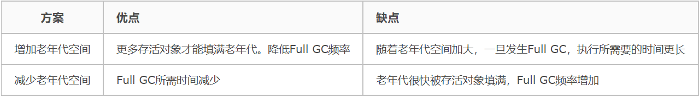
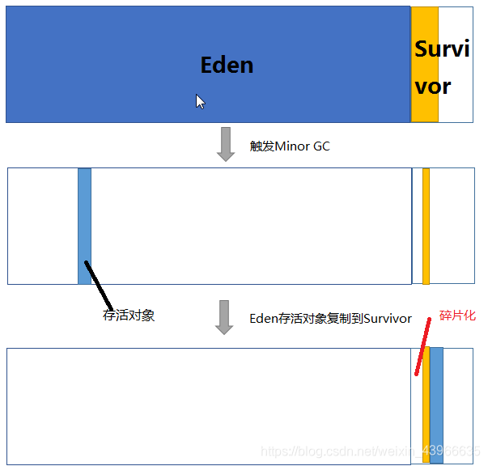
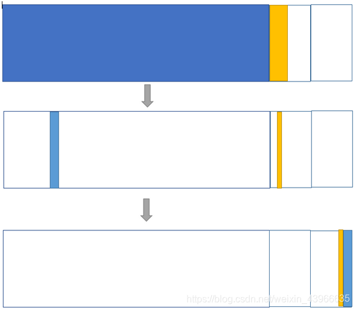

### **Survivor区详解**

#### **设置Survivor区的意义在哪里？**

我是一个普通的Java对象，我出生在Eden区，在Eden区我还看到和我长的很像的小兄弟，我们在Eden区中玩了挺长时间。有一天Eden区中的人实在是太多了，我就被迫去了Survivor区的“From”区，自从去了Survivor区，我就开始漂了，有时候在Survivor的“From”区，有时候在Survivor的“To”区，居无定所。直到我18岁的时候，爸爸说我成人了，该去社会上闯闯了。于是我就去了年老代那边，年老代里，人很多，并且年龄都挺大的，我在这里也认识了很多人。在年老代里，我生活了20年(每次GC加一岁)，然后被回收

先不去想为什么有两个Survivor区，第一个问题是，**设置Survivor区的意义在哪里？**
[]

如果没有Survivor，Eden区每进行一次Minor GC，存活的对象就会被送到老年代。老年代很快被填满，触发Major GC（因为Major GC一般伴随着Minor GC，也可以看做触发了Full GC）。**老年代的内存空间远大于新生代**，**进行一次Full GC消耗的时间比Minor GC长得多。** 你也许会问，执行时间长有什么坏处？频发的Full GC消耗的时间是非常可观的，这一点会影响大型程序的执行和响应速度，更不要说某些连接会因为超时发生连接错误了。

好，那我们来想想在没有Survivor的情况下，有没有什么解决办法，可以避免上述情况：

显而易见，没有Survivor的话，上述两种解决方案都不能从根本上解决问题。我们可以得到第一条结论：**Survivor的存在意义，就是减少被送到老年代的对象，进而减少Full GC的发生，Survivor的预筛选保证，只有经历16次Minor GC还能在新生代中存活的对象，才会被送到老年代。**

#### 为什么要设置两个Survivor区

**设置两个Survivor区最大的好处就是解决了碎片化**，下面我们来分析一下。

为什么一个Survivor区不行？第一部分中，我们知道了必须设置Survivor区。假设现在只有一个survivor区，我们来模拟一下流程：
刚刚新建的对象在Eden中，一旦Eden满了，触发一次Minor GC，Eden中的存活对象就会被移动到Survivor区。这样继续循环下去，下一次Eden满了的时候，问题来了，此时进行Minor GC，Eden和Survivor各有一些存活对象，如果此时把Eden区的存活对象硬放到Survivor区，这个时候S区需要删除的对象占得空间没有恢复，来了Eden的存活对象，造成这些内存不是连续分配的，**也就导致了内存碎片化。堆中没有足够大的连续内存空间，接下去如果程序需要给一个内存需求很大的对象分配内存，就不能分配了。**
我绘制了一幅图来表明这个过程。其中色块代表对象，白色框分别代表Eden区（大）和Survivor区（小）。Eden区理所当然大一些，否则新建对象很快就导致Eden区满，进而触发Minor GC，有悖于初衷。

[

碎片化带来的风险是极大的，**严重影响Java程序的性能**。堆空间被散布的对象占据不连续的内存，最直接的结果就是，堆中没有足够大的连续内存空间，接下去如果程序需要给一个内存需求很大的对象分配内存。。。画面太美不敢看。。。这就好比我们爬山的时候，背包里所有东西紧挨着放，最后就可能省出一块完整的空间放相机。如果每件行李之间隔一点空隙乱放，很可能最后就要一路把相机挂在脖子上了。

那么，顺理成章的，应该建立两块Survivor区，刚刚新建的对象在Eden中，经历一次Minor GC，Eden中的存活对象就会被移动到第一块survivor space S0，Eden被清空；等Eden区再满了，就再触发一次Minor GC，Eden和S0中的存活对象又会被复制送入第二块survivor space S1（这个过程非常重要，**因为这种复制算法保证了S1中来自S0和Eden两部分的存活对象占用连续的内存空间**，避免了碎片化的发生）。S0和Eden被清空，然后**下一轮S0与S1交换角色**，如此循环往复。如果对象的复制次数达到16次，该对象就会被送到老年代中。

[]

上述机制最大的好处就是，整个过程中，**永远有一个survivor space是空的**，另一个非空的survivor space无碎片。那么，Survivor为什么不分更多块呢？比方说分成三个、四个、五个?显然，如果Survivor区再细分下去，**每一块的空间就会比较小，很容易导致Survivor区满，因此，我认为两块Survivor区是经过权衡之后的最佳方案**。