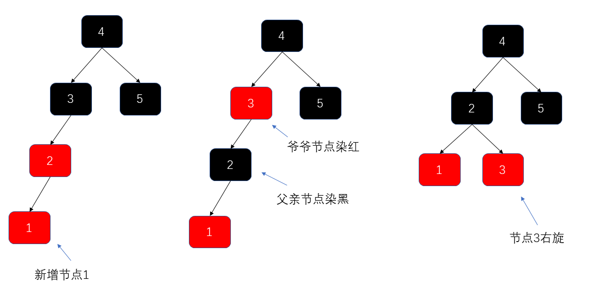

## 红黑树介绍

红黑树（Red Black Tree）是一种自平衡二叉查找树。它是在 1972 年由 Rudolf Bayer 发明的，当时被称为平衡二叉 B 树（symmetric binary B-trees）。后来，在 1978 年被 Leo J. Guibas 和 Robert Sedgewick 修改为如今的“红黑树”。

由于其自平衡的特性，保证了最坏情形下在 O(logn) 时间复杂度内完成查找、增加、删除等操作，性能表现稳定。

在 JDK 中，`TreeMap`、`TreeSet` 以及 JDK1.8 的 `HashMap` 底层都用到了红黑树。

## 为什么需要红黑树？

红黑树的诞生就是为了解决二叉查找树的缺陷。

二叉查找树是一种基于比较的数据结构，它的每个节点都有一个键值，而且左子节点的键值小于父节点的键值，右子节点的键值大于父节点的键值。这样的结构可以方便地进行查找、插入和删除操作，因为只需要比较节点的键值就可以确定目标节点的位置。但是，二叉查找树有一个很大的问题，就是它的形状取决于节点插入的顺序。如果节点是按照升序或降序的方式插入的，那么二叉查找树就会退化成一个线性结构，也就是一个链表。这样的情况下，二叉查找树的性能就会大大降低，时间复杂度就会从 O(logn) 变为 O(n)。

红黑树的诞生就是为了解决二叉查找树的缺陷，因为二叉查找树在某些情况下会退化成一个线性结构。

## **红黑树特点**

1. 每个节点非红即黑。黑色决定平衡，红色不决定平衡。这对应了 2-3 树中一个节点内可以存放 1~2 个节点。
2. 根节点总是黑色的。
3. 每个叶子节点都是黑色的空节点（NIL 节点）。这里指的是红黑树都会有一个空的叶子节点，是红黑树自己的规则。
4. 如果节点是红色的，则它的子节点必须是黑色的（反之不一定）。通常这条规则也叫不会有连续的红色节点。一个节点最多临时会有 3 个节点，中间是黑色节点，左右是红色节点。
5. 从任意节点到它的叶子节点或空子节点的每条路径，必须包含相同数目的黑色节点（即相同的黑色高度）。每一层都只是有一个节点贡献了树高决定平衡性，也就是对应红黑树中的黑色节点。

正是这些特点才保证了红黑树的平衡，让红黑树的高度不会超过 2log(n+1)。

## 红黑树数据结构

建立在 BST 二叉搜索树的基础上，AVL、2-3 树、红黑树都是自平衡二叉树（统称 B-树）。但相比于 AVL 树，高度平衡所带来的时间复杂度，红黑树对平衡的控制要宽松一些，红黑树只需要保证黑色节点平衡即可。

## 红黑树结构实现

```java
public class Node {

    public Class<?> clazz;
    public Integer value;
    public Node parent;
    public Node left;
    public Node right;

    // AVL 树所需属性
    public int height;
    // 红黑树所需属性
    public Color color = Color.RED;

}
```

### 1.左倾染色


- 染色时根据当前节点的爷爷节点，找到当前节点的叔叔节点。
- 再把父节点染黑、叔叔节点染黑，爷爷节点染红。但爷爷节点染红是临时的，当平衡树高操作后会把根节点染黑。

### 2.右倾染色


### 3.左旋调衡

#### 3.1 一次左旋


#### 3.2 右旋+左旋


### 4.右旋调衡

#### 4.1 一次右旋



#### 4.2 左旋+右旋


## 文章推荐

- [《红黑树深入剖析及 Java 实现》 - 美团点评技术团队](https://zhuanlan.zhihu.com/p/24367771)
- [漫画：什么是红黑树？ - 程序员小灰](https://juejin.im/post/5a27c6946fb9a04509096248#comment)（也介绍到了二叉查找树，非常推荐）

<!-- @include: @article-footer.snippet.md -->
