参考内容来自：https://xiaolincoding.com/network/

## 网络模型

为了使得多种设备能通过网络相互通信，和为了解决各种不同设备在网络互联中的兼容性问题，国际标准化组织制定了开放式系统互联通信参考模型（*Open System Interconnection Reference Model*），也就是 OSI 网络模型，该模型主要有 7 层，分别是应用层、表示层、会话层、传输层、网络层、数据链路层以及物理层。

每一层负责的职能都不同，如下：

- 应用层，负责给应用程序提供统一的接口；
- 表示层，负责把数据转换成兼容另一个系统能识别的格式；
- 会话层，负责建立、管理和终止表示层实体之间的通信会话；
- 传输层，负责端到端的数据传输；
- 网络层，负责数据的路由、转发、分片；
- 数据链路层，负责数据的封帧和差错检测，以及 MAC 寻址；
- 物理层，负责在物理网络中传输数据帧;

TCP/IP 网络模型共有 4 层，分别是应用层、传输层、网络层和网络接口层，每一层负责的职能如下：

- 应用层，负责向用户提供一组应用程序，比如 HTTP、DNS、FTP 等;
- 传输层，负责端到端的通信，比如 TCP、UDP 等；
- 网络层，负责网络包的封装、分片、路由、转发，比如 IP、ICMP 等；
- 网络接口层，负责网络包在物理网络中的传输，比如网络包的封帧、 MAC 寻址、差错检测，以及通过网卡传输网络帧等；

TCP/IP 网络模型相比 OSI 网络模型简化了不少，也更加易记，它们之间的关系如下图：


## GET 与 POST

### GET 和 POST 有什么区别？

根据 RFC 规范，**GET 的语义是从服务器获取指定的资源**，这个资源可以是静态的文本、页面、图片视频等。GET 请求的参数位置一般是写在 URL 中，URL 规定只能支持 ASCII，所以 GET 请求的参数只允许 ASCII 字符 ，而且浏览器会对 URL 的长度有限制（HTTP协议本身对 URL长度并没有做任何规定）。

根据 RFC 规范，**POST 的语义是根据请求负荷（报文body）对指定的资源做出处理**，具体的处理方式视资源类型而不同。POST 请求携带数据的位置一般是写在报文 body 中，body 中的数据可以是任意格式的数据，只要客户端与服务端协商好即可，而且浏览器不会对 body 大小做限制。

GET 和 POST 还有一个重大区别，简单的说：GET产生一个TCP数据包；POST产生两个TCP数据包。长的说：对于GET方式的请求，浏览器会把http header和data一并发送出去，服务器响应200（返回数据）而对于POST，浏览器先发送header，服务器响应100 continue，浏览器再发送data，服务器响应200 ok（返回数据）。

## HTTP 与 HTTPS

### HTTP 与 HTTPS 有哪些区别？

- HTTP 是超文本传输协议，信息是明文传输，存在安全风险的问题。HTTPS 则解决 HTTP 不安全的缺陷，在 TCP 和 HTTP 网络层之间加入了 SSL/TLS 安全协议，使得报文能够加密传输。
- HTTP 连接建立相对简单， TCP 三次握手之后便可进行 HTTP 的报文传输。而 HTTPS 在 TCP 三次握手之后，还需进行 SSL/TLS 的握手过程，才可进入加密报文传输。
- 两者的默认端口不一样，HTTP 默认端口号是 80，HTTPS 默认端口号是 443。
- HTTPS 协议需要向 CA（证书权威机构）申请数字证书，来保证服务器的身份是可信的。

### CA证书

服务端可以向证书颁发机构CA申请证书，以避免中间人攻击（防止证书被篡改）。证书包含三部分内容：**证书内容、证书签名算法和签名**，签名是为了验证身份。

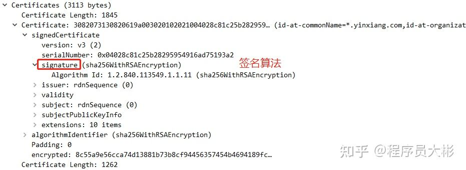

服务端把证书传输给浏览器，浏览器从证书里取公钥。证书可以证明该公钥对应本网站。

**数字签名的制作过程**：

1. CA使用证书签名算法对证书内容进行hash运算。
2. 对hash后的值用CA的私钥加密，得到数字签名。

**浏览器验证过程**：

1. 获取证书，得到证书内容、证书签名算法和数字签名。
2. 用CA机构的公钥对数字签名解密（由于是浏览器信任的机构，所以浏览器会保存它的公钥）。
3. 用证书里的签名算法对证书内容进行hash运算。
4. 比较解密后的数字签名和对证书内容做hash运算后得到的哈希值，相等则表明证书可信。

## HTTP/1.1、HTTP/2、HTTP/3 演变

### HTTP/1.1 相比 HTTP/1.0 提高了什么性能？

HTTP/1.1 相比 HTTP/1.0 性能上的改进：

- 使用长连接的方式改善了 HTTP/1.0 短连接造成的性能开销。
- 支持管道（pipeline）网络传输，只要第一个请求发出去了，不必等其回来，就可以发第二个请求出去，可以减少整体的响应时间。

但 HTTP/1.1 还是有性能瓶颈：

- 请求 / 响应头部（Header）未经压缩就发送，首部信息越多延迟越大。只能压缩 `Body` 的部分；
- 发送冗长的首部。每次互相发送相同的首部造成的浪费较多；
- 服务器是按请求的顺序响应的，如果服务器响应慢，会招致客户端一直请求不到数据，也就是队头阻塞；
- 没有请求优先级控制；
- 请求只能从客户端开始，服务器只能被动响应。

### HTTP/2 做了什么优化？

HTTP/2 协议是基于 HTTPS 的，所以 HTTP/2 的安全性也是有保障的。


那 HTTP/2 相比 HTTP/1.1 性能上的改进：

- 头部压缩
- 二进制格式
- 并发传输
- 服务器主动推送资源

*1. 头部压缩*

HTTP/2 会**压缩头**（Header）如果你同时发出多个请求，他们的头是一样的或是相似的，那么，协议会帮你**消除重复的部分**。

这就是所谓的 `HPACK` 算法：在客户端和服务器同时维护一张头信息表，所有字段都会存入这个表，生成一个索引号，以后就不发送同样字段了，只发送索引号，这样就**提高速度**了。

*2. 二进制格式*

HTTP/2 不再像 HTTP/1.1 里的纯文本形式的报文，而是全面采用了**二进制格式**，头信息和数据体都是二进制，并且统称为帧（frame）：**头信息帧（Headers Frame）和数据帧（Data Frame）**。


*3. 并发传输*

我们都知道 HTTP/1.1 的实现是基于请求-响应模型的。同一个连接中，HTTP 完成一个事务（请求与响应），才能处理下一个事务，也就是说在发出请求等待响应的过程中，是没办法做其他事情的，如果响应迟迟不来，那么后续的请求是无法发送的，也造成了**队头阻塞**的问题。

而 HTTP/2 就很牛逼了，引出了 Stream 概念，多个 Stream 复用在一条 TCP 连接。


从上图可以看到，1 个 TCP 连接包含多个 Stream，Stream 里可以包含 1 个或多个 Message，Message 对应 HTTP/1 中的请求或响应，由 HTTP 头部和包体构成。Message 里包含一条或者多个 Frame，Frame 是 HTTP/2 最小单位，以二进制压缩格式存放 HTTP/1 中的内容（头部和包体）。

**针对不同的 HTTP 请求用独一无二的 Stream ID 来区分，接收端可以通过 Stream ID 有序组装成 HTTP 消息，不同 Stream 的帧是可以乱序发送的，因此可以并发不同的 Stream ，也就是 HTTP/2 可以并行交错地发送请求和响应**。

比如下图，服务端**并行交错地**发送了两个响应： Stream 1 和 Stream 3，这两个 Stream 都是跑在一个 TCP 连接上，客户端收到后，会根据相同的 Stream ID 有序组装成 HTTP 消息。


*4、服务器推送*

HTTP/2 还在一定程度上改善了传统的「请求 - 应答」工作模式，服务端不再是被动地响应，可以**主动**向客户端发送消息。

客户端和服务器**双方都可以建立 Stream**， Stream ID 也是有区别的，客户端建立的 Stream 必须是奇数号，而服务器建立的 Stream 必须是偶数号。

比如下图，Stream 1 是客户端向服务端请求的资源，属于客户端建立的 Stream，所以该 Stream 的 ID 是奇数（数字 1）；Stream 2 和 4 都是服务端主动向客户端推送的资源，属于服务端建立的 Stream，所以这两个 Stream 的 ID 是偶数（数字 2 和 4）。


再比如，客户端通过 HTTP/1.1 请求从服务器那获取到了 HTML 文件，而 HTML 可能还需要依赖 CSS 来渲染页面，这时客户端还要再发起获取 CSS 文件的请求，需要两次消息往返，如下图左边部分：


如上图右边部分，在 HTTP/2 中，客户端在访问 HTML 时，服务器可以直接主动推送 CSS 文件，减少了消息传递的次数。

> HTTP/2 有什么缺陷？

HTTP/2 通过 Stream 的并发能力，解决了 HTTP/1 队头阻塞的问题，看似很完美了，但是 HTTP/2 还是存在“队头阻塞”的问题，只不过问题不是在 HTTP 这一层面，而是在 TCP 这一层。

**HTTP/2 是基于 TCP 协议来传输数据的，TCP 是字节流协议，TCP 层必须保证收到的字节数据是完整且连续的，这样内核才会将缓冲区里的数据返回给 HTTP 应用，那么当「前 1 个字节数据」没有到达时，后收到的字节数据只能存放在内核缓冲区里，只有等到这 1 个字节数据到达时，HTTP/2 应用层才能从内核中拿到数据，这就是 HTTP/2 队头阻塞问题。**


举个例子，如下图：


图中发送方发送了很多个 packet，每个 packet 都有自己的序号，你可以认为是 TCP 的序列号，其中 packet 3 在网络中丢失了，即使 packet 4-6 被接收方收到后，由于内核中的 TCP 数据不是连续的，于是接收方的应用层就无法从内核中读取到，只有等到 packet 3 重传后，接收方的应用层才可以从内核中读取到数据，这就是 HTTP/2 的队头阻塞问题，是在 TCP 层面发生的。

所以，一旦发生了丢包现象，就会触发 TCP 的重传机制，这样在一个 TCP 连接中的**所有的 HTTP 请求都必须等待这个丢了的包被重传回来**。

### HTTP/3 做了哪些优化？

前面我们知道了 HTTP/1.1 和 HTTP/2 都有队头阻塞的问题：

- HTTP/1.1 中的管道（ pipeline）虽然解决了请求的队头阻塞，但是**没有解决响应的队头阻塞**，因为服务端需要按顺序响应收到的请求，如果服务端处理某个请求消耗的时间比较长，那么只能等响应完这个请求后， 才能处理下一个请求，这属于 HTTP 层队头阻塞。
- HTTP/2 虽然通过多个请求复用一个 TCP 连接解决了 HTTP 的队头阻塞 ，但是**一旦发生丢包，就会阻塞住所有的 HTTP 请求**，这属于 TCP 层队头阻塞。

HTTP/2 队头阻塞的问题是因为 TCP，所以 **HTTP/3 把 HTTP 下层的 TCP 协议改成了 UDP！**


UDP 发送是不管顺序，也不管丢包的，所以不会出现像 HTTP/2 队头阻塞的问题。大家都知道 UDP 是不可靠传输的，但基于 UDP 的 **QUIC 协议** 可以实现类似 TCP 的可靠性传输。

QUIC 有以下 3 个特点。

- 无队头阻塞
- 更快的连接建立
- 连接迁移

*1、无队头阻塞*

QUIC 协议也有类似 HTTP/2 Stream 与多路复用的概念，也是可以在同一条连接上并发传输多个 Stream，Stream 可以认为就是一条 HTTP 请求。

QUIC 有自己的一套机制可以保证传输的可靠性的。**当某个流发生丢包时，只会阻塞这个流，其他流不会受到影响，因此不存在队头阻塞问题**。这与 HTTP/2 不同，HTTP/2 只要某个流中的数据包丢失了，其他流也会因此受影响。

所以，QUIC 连接上的多个 Stream 之间并没有依赖，都是独立的，某个流发生丢包了，只会影响该流，其他流不受影响。


*2、更快的连接建立*

对于 HTTP/1 和 HTTP/2 协议，TCP 和 TLS 是分层的，分别属于内核实现的传输层、openssl 库实现的表示层，因此它们难以合并在一起，需要分批次来握手，先 TCP 握手，再 TLS 握手。

HTTP/3 在传输数据前虽然需要 QUIC 协议握手，但是这个握手过程只需要 1 RTT，握手的目的是为确认双方的「连接 ID」，连接迁移就是基于连接 ID 实现的。

但是 HTTP/3 的 QUIC 协议并不是与 TLS 分层，而是 QUIC 内部包含了 TLS，它在自己的帧会携带 TLS 里的“记录”，再加上 QUIC 使用的是 TLS/1.3，因此仅需 1 个 RTT 就可以「同时」完成建立连接与密钥协商，如下图：

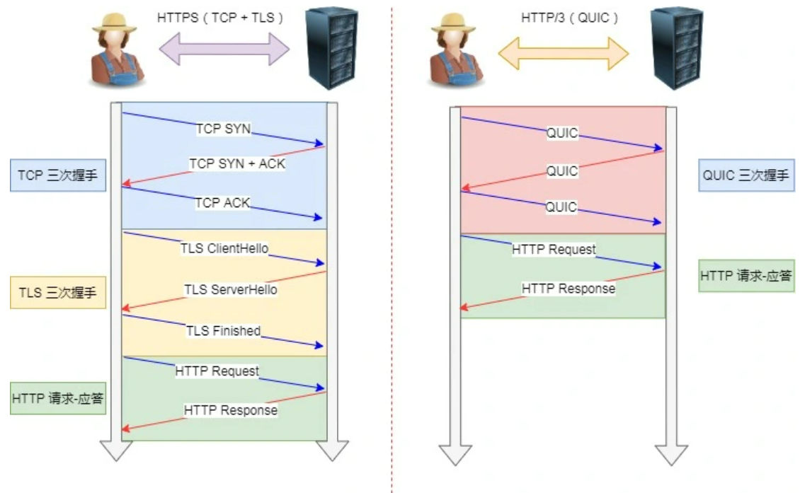

甚至，在第二次连接的时候，应用数据包可以和 QUIC 握手信息（连接信息 + TLS 信息）一起发送，达到 0-RTT 的效果。

如下图右边部分，HTTP/3 当会话恢复时，有效负载数据与第一个数据包一起发送，可以做到 0-RTT（下图的右下角）：


*3、连接迁移*

基于 TCP 传输协议的 HTTP 协议，由于是通过四元组（源 IP、源端口、目的 IP、目的端口）确定一条 TCP 连接。


那么**当移动设备的网络从 4G 切换到 WIFI 时，意味着 IP 地址变化了，那么就必须要断开连接，然后重新建立连接**。而建立连接的过程包含 TCP 三次握手和 TLS 四次握手的时延，以及 TCP 慢启动的减速过程，给用户的感觉就是网络突然卡顿了一下，因此连接的迁移成本是很高的。

而 QUIC 协议没有用四元组的方式来“绑定”连接，而是通过**连接 ID** 来标记通信的两个端点，客户端和服务器可以各自选择一组 ID 来标记自己，因此即使移动设备的网络变化后，导致 IP 地址变化了，只要仍保有上下文信息（比如连接 ID、TLS 密钥等），就可以“无缝”地复用原连接，消除重连的成本，没有丝毫卡顿感，达到了**连接迁移**的功能。

所以， QUIC 是一个在 UDP 之上的**伪** TCP + TLS + HTTP/2 的多路复用的协议。

QUIC 是新协议，对于很多网络设备，根本不知道什么是 QUIC，只会当做 UDP，这样会出现新的问题，因为有的网络设备是会丢掉 UDP 包的，而 QUIC 是基于 UDP 实现的，那么如果网络设备无法识别这个是 QUIC 包，那么就会当作 UDP包，然后被丢弃。

HTTP/3 现在普及的进度非常的缓慢，不知道未来 UDP 是否能够逆袭 TCP。

## TCP 连接建立

### TCP 三次握手过程是怎样的？

TCP 是面向连接的协议，所以使用 TCP 前必须先建立连接，而**建立连接是通过三次握手来进行的**。三次握手的过程如下图：


- 一开始，客户端和服务端都处于 `CLOSE` 状态。先是服务端主动监听某个端口，处于 `LISTEN` 状态


- 客户端会随机初始化序号（`client_isn`），将此序号置于 TCP 首部的「序号」字段中，同时把 `SYN` 标志位置为 `1`，表示 `SYN` 报文。接着把第一个 SYN 报文发送给服务端，表示向服务端发起连接，该报文不包含应用层数据，之后客户端处于 `SYN-SENT` 状态。


- 服务端收到客户端的 `SYN` 报文后，首先服务端也随机初始化自己的序号（`server_isn`），将此序号填入 TCP 首部的「序号」字段中，其次把 TCP 首部的「确认应答号」字段填入 `client_isn + 1`, 接着把 `SYN` 和 `ACK` 标志位置为 `1`。最后把该报文发给客户端，该报文也不包含应用层数据，之后服务端处于 `SYN-RCVD` 状态。


- 客户端收到服务端报文后，还要向服务端回应最后一个应答报文，首先该应答报文 TCP 首部 `ACK` 标志位置为 `1` ，其次「确认应答号」字段填入 `server_isn + 1` ，最后把报文发送给服务端，这次报文可以携带客户到服务端的数据，之后客户端处于 `ESTABLISHED` 状态。
- 服务端收到客户端的应答报文后，也进入 `ESTABLISHED` 状态。

从上面的过程可以发现**第三次握手是可以携带数据的，前两次握手是不可以携带数据的**，这也是面试常问的题。

一旦完成三次握手，双方都处于 `ESTABLISHED` 状态，此时连接就已建立完成，客户端和服务端就可以相互发送数据了。

### 为什么是三次握手？不是两次、四次？

相信大家比较常回答的是：“因为三次握手才能保证双方具有接收和发送的能力。”

这回答是没问题，但这回答是片面的，并没有说出主要的原因。

在前面我们知道了什么是 **TCP 连接**：

- 用于保证可靠性和流量控制维护的某些状态信息，这些信息的组合，包括 **Socket、序列号和窗口大小**称为连接。

所以，重要的是**为什么三次握手才可以初始化 Socket、序列号和窗口大小并建立 TCP 连接。**

接下来，以三个方面分析三次握手的原因：

- 三次握手才可以阻止重复历史连接的初始化（主要原因）
- 三次握手才可以同步双方的初始序列号
- 三次握手才可以避免资源浪费

简单来说，三次握手的**首要原因是为了防止旧的重复连接初始化造成混乱。**

我们考虑一个场景，客户端先发送了 SYN（seq = 90）报文，然后客户端宕机了，而且这个 SYN 报文还被网络阻塞了，服务端并没有收到，接着客户端重启后，又重新向服务端建立连接，发送了 SYN（seq = 100）报文（*注意！不是重传 SYN，重传的 SYN 的序列号是一样的*）。

看看三次握手是如何阻止历史连接的：

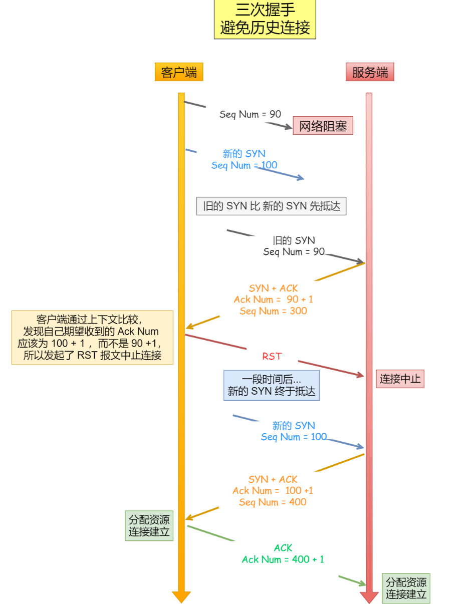

客户端连续发送多次 SYN（都是同一个四元组）建立连接的报文，在**网络拥堵**情况下：

- 一个「旧 SYN 报文」比「最新的 SYN」 报文早到达了服务端，那么此时服务端就会回一个 `SYN + ACK` 报文给客户端，此报文中的确认号是 91（90+1）。
- 客户端收到后，发现自己期望收到的确认号应该是 100 + 1，而不是 90 + 1，于是就会回 RST 报文。
- 服务端收到 RST 报文后，就会释放连接。
- 后续最新的 SYN 抵达了服务端后，客户端与服务端就可以正常的完成三次握手了。

上述中的「旧 SYN 报文」称为历史连接，TCP 使用三次握手建立连接的**最主要原因就是防止「历史连接」初始化了连接**。

> TIP
>
> 有很多人问，如果服务端在收到 RST 报文之前，先收到了「新 SYN 报文」，也就是服务端收到客户端报文的顺序是：「旧 SYN 报文」->「新 SYN 报文」，此时会发生什么?
>
> 当服务端第一次收到 SYN 报文，也就是收到 「旧 SYN 报文」时，就会回复 `SYN + ACK` 报文给客户端，此报文中的确认号是 91（90+1）。
>
> 然后这时再收到「新 SYN 报文」时，就会回 [Challenge Ack (opens new window)](https://xiaolincoding.com/network/3_tcp/challenge_ack.html)报文给客户端，**这个 ack 报文并不是确认收到「新 SYN 报文」的，而是上一次的 ack 确认号**，也就是91（90+1）。所以客户端收到此 ACK 报文时，发现自己期望收到的确认号应该是 101，而不是 91，于是就会回 RST 报文。

**如果是两次握手连接，就无法阻止历史连接**，那为什么 TCP 两次握手为什么无法阻止历史连接呢？

我先直接说结论，主要是因为**在两次握手的情况下，服务端没有中间状态给客户端来阻止历史连接，导致服务端可能建立一个历史连接，造成资源浪费**。

你想想，在两次握手的情况下，服务端在收到 SYN 报文后，就进入 ESTABLISHED 状态，意味着这时可以给对方发送数据，但是客户端此时还没有进入 ESTABLISHED 状态，假设这次是历史连接，客户端判断到此次连接为历史连接，那么就会回 RST 报文来断开连接，而服务端在第一次握手的时候就进入 ESTABLISHED 状态，所以它可以发送数据的，但是它并不知道这个是历史连接，它只有在收到 RST 报文后，才会断开连接。

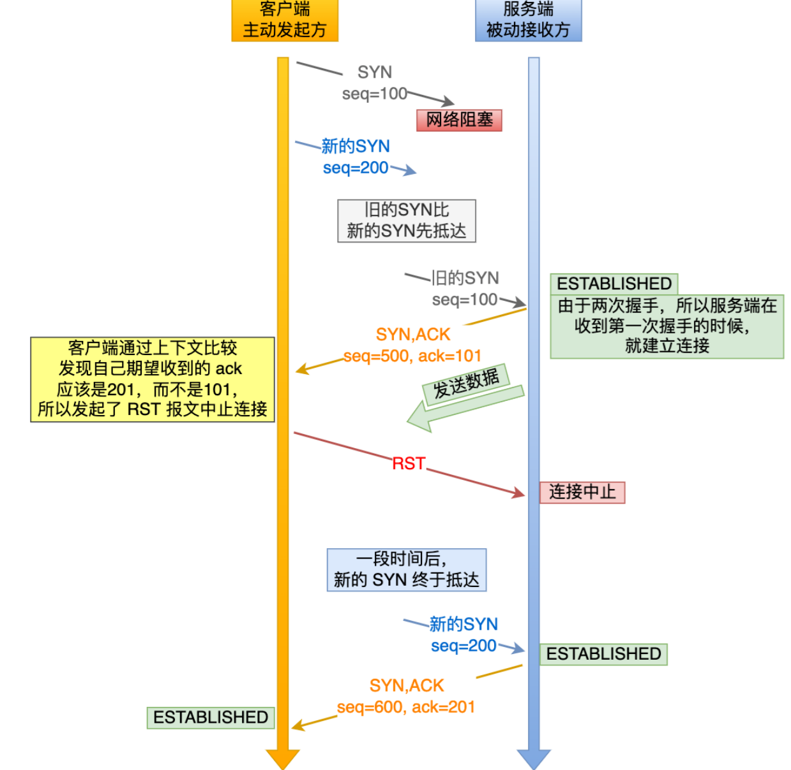

可以看到，如果采用两次握手建立 TCP 连接的场景下，服务端在向客户端发送数据前，并没有阻止掉历史连接，导致服务端建立了一个历史连接，又白白发送了数据，妥妥地浪费了服务端的资源。

因此，**要解决这种现象，最好就是在服务端发送数据前，也就是建立连接之前，要阻止掉历史连接，这样就不会造成资源浪费，而要实现这个功能，就需要三次握手**。

所以，**TCP 使用三次握手建立连接的最主要原因是防止「历史连接」初始化了连接。**

*原因二：同步双方初始序列号*

TCP 协议的通信双方， 都必须维护一个「序列号」， 序列号是可靠传输的一个关键因素，它的作用：

- 接收方可以去除重复的数据；
- 接收方可以根据数据包的序列号按序接收；
- 可以标识发送出去的数据包中， 哪些是已经被对方收到的（通过 ACK 报文中的序列号知道）；

可见，序列号在 TCP 连接中占据着非常重要的作用，所以当客户端发送携带「初始序列号」的 `SYN` 报文的时候，需要服务端回一个 `ACK` 应答报文，表示客户端的 SYN 报文已被服务端成功接收，那当服务端发送「初始序列号」给客户端的时候，依然也要得到客户端的应答回应，**这样一来一回，才能确保双方的初始序列号能被可靠的同步。**


四次握手其实也能够可靠的同步双方的初始化序号，但由于**第二步和第三步可以优化成一步**，所以就成了「三次握手」。

而两次握手只保证了一方的初始序列号能被对方成功接收，没办法保证双方的初始序列号都能被确认接收。

*原因三：避免资源浪费*

如果只有「两次握手」，当客户端发生的 `SYN` 报文在网络中阻塞，客户端没有接收到 `ACK` 报文，就会重新发送 `SYN` ，**由于没有第三次握手，服务端不清楚客户端是否收到了自己回复的 `ACK` 报文，所以服务端每收到一个 `SYN` 就只能先主动建立一个连接**，这会造成什么情况呢？

如果客户端发送的 `SYN` 报文在网络中阻塞了，重复发送多次 `SYN` 报文，那么服务端在收到请求后就会**建立多个冗余的无效链接，造成不必要的资源浪费。**


即两次握手会造成消息滞留情况下，服务端重复接受无用的连接请求 `SYN` 报文，而造成重复分配资源。

> TIP
>
> 很多人问，两次握手不是也可以根据上下文信息丢弃 syn 历史报文吗？
>
> 我这里两次握手是假设「由于没有第三次握手，服务端不清楚客户端是否收到了自己发送的建立连接的 `ACK` 确认报文，所以每收到一个 `SYN` 就只能先主动建立一个连接」这个场景。
>
> 当然你要实现成类似三次握手那样，根据上下文丢弃 syn 历史报文也是可以的，两次握手没有具体的实现，怎么假设都行。

**小结**

TCP 建立连接时，通过三次握手**能防止历史连接的建立，能减少双方不必要的资源开销，能帮助双方同步初始化序列号**。序列号能够保证数据包不重复、不丢弃和按序传输。

不使用「两次握手」和「四次握手」的原因：

- 「两次握手」：无法防止历史连接的建立，会造成双方资源的浪费，也无法可靠的同步双方序列号；
- 「四次握手」：三次握手就已经理论上最少可靠连接建立，所以不需要使用更多的通信次数。

### 第一次握手丢失了，会发生什么？

当客户端想和服务端建立 TCP 连接的时候，首先第一个发的就是 SYN 报文，然后进入到 `SYN_SENT` 状态。

在这之后，如果客户端迟迟收不到服务端的 SYN-ACK 报文（第二次握手），就会触发「超时重传」机制，重传 SYN 报文，而且**重传的 SYN 报文的序列号都是一样的**。

不同版本的操作系统可能超时时间不同，有的 1 秒的，也有 3 秒的，这个超时时间是写死在内核里的，如果想要更改则需要重新编译内核，比较麻烦。

当客户端在 1 秒后没收到服务端的 SYN-ACK 报文后，客户端就会重发 SYN 报文，那到底重发几次呢？

在 Linux 里，客户端的 SYN 报文最大重传次数由 `tcp_syn_retries`内核参数控制，这个参数是可以自定义的，默认值一般是 5。

```cmd
# cat /proc/sys/net/ipv4/tcp_syn_retries
5
```

通常，第一次超时重传是在 1 秒后，第二次超时重传是在 2 秒，第三次超时重传是在 4 秒后，第四次超时重传是在 8 秒后，第五次是在超时重传 16 秒后。没错，**每次超时的时间是上一次的 2 倍**。

当第五次超时重传后，会继续等待 32 秒，如果服务端仍然没有回应 ACK，客户端就不再发送 SYN 包，然后断开 TCP 连接。

所以，总耗时是 1+2+4+8+16+32=63 秒，大约 1 分钟左右。

### 第二次握手丢失了，会发生什么？

当服务端收到客户端的第一次握手后，就会回 SYN-ACK 报文给客户端，这个就是第二次握手，此时服务端会进入 `SYN_RCVD` 状态。

第二次握手的 `SYN-ACK` 报文其实有两个目的 ：

- 第二次握手里的 ACK， 是对第一次握手的确认报文；
- 第二次握手里的 SYN，是服务端发起建立 TCP 连接的报文；

所以，如果第二次握手丢了，就会发生比较有意思的事情，具体会怎么样呢？

因为第二次握手报文里是包含对客户端的第一次握手的 ACK 确认报文，所以，如果客户端迟迟没有收到第二次握手，那么客户端就觉得可能自己的 SYN 报文（第一次握手）丢失了，于是**客户端就会触发超时重传机制，重传 SYN 报文**。

然后，因为第二次握手中包含服务端的 SYN 报文，所以当客户端收到后，需要给服务端发送 ACK 确认报文（第三次握手），服务端才会认为该 SYN 报文被客户端收到了。

那么，如果第二次握手丢失了，服务端就收不到第三次握手，于是**服务端这边会触发超时重传机制，重传 SYN-ACK 报文**。

在 Linux 下，SYN-ACK 报文的最大重传次数由 `tcp_synack_retries`内核参数决定，默认值是 5。

因此，当第二次握手丢失了，客户端和服务端都会重传：

- 客户端会重传 SYN 报文，也就是第一次握手，最大重传次数由 `tcp_syn_retries`内核参数决定；
- 服务端会重传 SYN-ACK 报文，也就是第二次握手，最大重传次数由 `tcp_synack_retries` 内核参数决定。

### 第三次握手丢失了，会发生什么？

客户端收到服务端的 SYN-ACK 报文后，就会给服务端回一个 ACK 报文，也就是第三次握手，此时客户端状态进入到 `ESTABLISH` 状态。

因为这个第三次握手的 ACK 是对第二次握手的 SYN 的确认报文，所以当第三次握手丢失了，如果服务端那一方迟迟收不到这个确认报文，就会触发超时重传机制，重传 SYN-ACK 报文，直到收到第三次握手，或者达到最大重传次数。

注意，**ACK 报文是不会有重传的，当 ACK 丢失了，就由对方重传对应的报文**。

## TCP 连接断开

### TCP 四次挥手过程是怎样的？

天下没有不散的宴席，对于 TCP 连接也是这样， TCP 断开连接是通过**四次挥手**方式。

双方都可以主动断开连接，断开连接后主机中的「资源」将被释放，四次挥手的过程如下图：


- 客户端打算关闭连接，此时会发送一个 TCP 首部 `FIN` 标志位被置为 `1` 的报文，也即 `FIN` 报文，之后客户端进入 `FIN_WAIT_1` 状态。
- 服务端收到该报文后，就向客户端发送 `ACK` 应答报文，接着服务端进入 `CLOSE_WAIT` 状态。
- 客户端收到服务端的 `ACK` 应答报文后，之后进入 `FIN_WAIT_2` 状态。
- 等待服务端处理完数据后，也向客户端发送 `FIN` 报文，之后服务端进入 `LAST_ACK` 状态。
- 客户端收到服务端的 `FIN` 报文后，回一个 `ACK` 应答报文，之后进入 `TIME_WAIT` 状态
- 服务端收到了 `ACK` 应答报文后，就进入了 `CLOSE` 状态，至此服务端已经完成连接的关闭。
- 客户端在经过 `2MSL` 一段时间后，自动进入 `CLOSE` 状态，至此客户端也完成连接的关闭。

你可以看到，每个方向都需要**一个 FIN 和一个 ACK**，因此通常被称为**四次挥手**。

这里一点需要注意是：**主动关闭连接的，才有 TIME_WAIT 状态。**

### 为什么挥手需要四次？

再来回顾下四次挥手双方发 `FIN` 包的过程，就能理解为什么需要四次了。

- 关闭连接时，客户端向服务端发送 `FIN` 时，仅仅表示客户端不再发送数据了但是还能接收数据。
- 服务端收到客户端的 `FIN` 报文时，先回一个 `ACK` 应答报文，而服务端可能还有数据需要处理和发送，等服务端不再发送数据时，才发送 `FIN` 报文给客户端来表示同意现在关闭连接。

从上面过程可知，服务端通常需要等待完成数据的发送和处理，所以服务端的 `ACK` 和 `FIN` 一般都会分开发送，因此是需要四次挥手。

### 第一次挥手丢失了，会发生什么？

当客户端（主动关闭方）调用 close 函数后，就会向服务端发送 FIN 报文，试图与服务端断开连接，此时客户端的连接进入到 `FIN_WAIT_1` 状态。

正常情况下，如果能及时收到服务端（被动关闭方）的 ACK，则会很快变为 `FIN_WAIT2`状态。

如果第一次挥手丢失了，那么客户端迟迟收不到被动方的 ACK 的话，也就会触发超时重传机制，重传 FIN 报文，重发次数由 `tcp_orphan_retries` 参数控制。

当客户端重传 FIN 报文的次数超过 `tcp_orphan_retries` 后，就不再发送 FIN 报文，则会在等待一段时间（时间为上一次超时时间的 2 倍），如果还是没能收到第二次挥手，那么直接进入到 `close` 状态。

举个例子，假设 tcp_orphan_retries 参数值为 3，当第一次挥手一直丢失时，发生的过程如下图：


具体过程：

- 当客户端超时重传 3 次 FIN 报文后，由于 tcp_orphan_retries 为 3，已达到最大重传次数，于是再等待一段时间（时间为上一次超时时间的 2 倍），如果还是没能收到服务端的第二次挥手（ACK报文），那么客户端就会断开连接。

### 第二次挥手丢失了，会发生什么？

当服务端收到客户端的第一次挥手后，就会先回一个 ACK 确认报文，此时服务端的连接进入到 `CLOSE_WAIT` 状态。

在前面我们也提了，ACK 报文是不会重传的，所以如果服务端的第二次挥手丢失了，客户端就会触发超时重传机制，重传 FIN 报文，直到收到服务端的第二次挥手，或者达到最大的重传次数。

举个例子，假设 tcp_orphan_retries 参数值为 2，当第二次挥手一直丢失时，发生的过程如下图：


具体过程：

- 当客户端超时重传 2 次 FIN 报文后，由于 tcp_orphan_retries 为 2，已达到最大重传次数，于是再等待一段时间（时间为上一次超时时间的 2 倍），如果还是没能收到服务端的第二次挥手（ACK 报文），那么客户端就会断开连接。

这里提一下，当客户端收到第二次挥手，也就是收到服务端发送的 ACK 报文后，客户端就会处于 `FIN_WAIT2` 状态，在这个状态需要等服务端发送第三次挥手，也就是服务端的 FIN 报文。

对于 close 函数关闭的连接，由于无法再发送和接收数据，所以`FIN_WAIT2` 状态不可以持续太久，而 `tcp_fin_timeout` 控制了这个状态下连接的持续时长，默认值是 60 秒。

这意味着对于调用 close 关闭的连接，如果在 60 秒后还没有收到 FIN 报文，客户端（主动关闭方）的连接就会直接关闭，如下图：


但是注意，如果主动关闭方使用 shutdown 函数关闭连接，指定了只关闭发送方向，而接收方向并没有关闭，那么意味着主动关闭方还是可以接收数据的。

此时，如果主动关闭方一直没收到第三次挥手，那么主动关闭方的连接将会一直处于 `FIN_WAIT2` 状态（`tcp_fin_timeout` 无法控制 shutdown 关闭的连接）。如下图：


### 第三次挥手丢失了，会发生什么？

当服务端（被动关闭方）收到客户端（主动关闭方）的 FIN 报文后，内核会自动回复 ACK，同时连接处于 `CLOSE_WAIT` 状态，顾名思义，它表示等待应用进程调用 close 函数关闭连接。

此时，内核是没有权利替代进程关闭连接，必须由进程主动调用 close 函数来触发服务端发送 FIN 报文。

服务端处于 CLOSE_WAIT 状态时，调用了 close 函数，内核就会发出 FIN 报文，同时连接进入 LAST_ACK 状态，等待客户端返回 ACK 来确认连接关闭。

如果迟迟收不到这个 ACK，服务端就会重发 FIN 报文，重发次数仍然由 `tcp_orphan_retrie`s 参数控制，这与客户端重发 FIN 报文的重传次数控制方式是一样的。

举个例子，假设 `tcp_orphan_retrie`s = 3，当第三次挥手一直丢失时，发生的过程如下图：


具体过程：

- 当服务端重传第三次挥手报文的次数达到了 3 次后，由于 tcp_orphan_retries 为 3，达到了重传最大次数，于是再等待一段时间（时间为上一次超时时间的 2 倍），如果还是没能收到客户端的第四次挥手（ACK报文），那么服务端就会断开连接。
- 客户端因为是通过 close 函数关闭连接的，处于 FIN_WAIT_2 状态是有时长限制的，如果 tcp_fin_timeout 时间内还是没能收到服务端的第三次挥手（FIN 报文），那么客户端就会断开连接。

### 第四次挥手丢失了，会发生什么？

当客户端收到服务端的第三次挥手的 FIN 报文后，就会回 ACK 报文，也就是第四次挥手，此时客户端连接进入 `TIME_WAIT` 状态。

在 Linux 系统，TIME_WAIT 状态会持续 2MSL 后才会进入关闭状态。

然后，服务端（被动关闭方）没有收到 ACK 报文前，还是处于 LAST_ACK 状态。

如果第四次挥手的 ACK 报文没有到达服务端，服务端就会重发 FIN 报文，重发次数仍然由前面介绍过的 `tcp_orphan_retries` 参数控制。

举个例子，假设 tcp_orphan_retries 为 2，当第四次挥手一直丢失时，发生的过程如下：


具体过程：

- 当服务端重传第三次挥手报文达到 2 时，由于 tcp_orphan_retries 为 2， 达到了最大重传次数，于是再等待一段时间（时间为上一次超时时间的 2 倍），如果还是没能收到客户端的第四次挥手（ACK 报文），那么服务端就会断开连接。
- 客户端在收到第三次挥手后，就会进入 TIME_WAIT 状态，开启时长为 2MSL 的定时器，如果途中再次收到第三次挥手（FIN 报文）后，就会重置定时器，当等待 2MSL 时长后，客户端就会断开连接。

### 为什么 TIME_WAIT 等待的时间是 2MSL？

`MSL` 是 Maximum Segment Lifetime，**报文最大生存时间**，它是任何报文在网络上存在的最长时间，超过这个时间报文将被丢弃。因为 TCP 报文基于是 IP 协议的，而 IP 头中有一个 `TTL` 字段，是 IP 数据报可以经过的最大路由数，每经过一个处理他的路由器此值就减 1，当此值为 0 则数据报将被丢弃，同时发送 ICMP 报文通知源主机。

MSL 与 TTL 的区别： MSL 的单位是时间，而 TTL 是经过路由跳数。所以 **MSL 应该要大于等于 TTL 消耗为 0 的时间**，以确保报文已被自然消亡。

**TTL 的值一般是 64，Linux 将 MSL 设置为 30 秒，意味着 Linux 认为数据报文经过 64 个路由器的时间不会超过 30 秒，如果超过了，就认为报文已经消失在网络中了**。

TIME_WAIT 等待 2 倍的 MSL，比较合理的解释是： 网络中可能存在来自发送方的数据包，当这些发送方的数据包被接收方处理后又会向对方发送响应，所以**一来一回需要等待 2 倍的时间**。

比如，如果被动关闭方没有收到断开连接的最后的 ACK 报文，就会触发超时重发 `FIN` 报文，另一方接收到 FIN 后，会重发 ACK 给被动关闭方， 一来一去正好 2 个 MSL。

可以看到 **2MSL时长** 这其实是相当于**至少允许报文丢失一次**。比如，若 ACK 在一个 MSL 内丢失，这样被动方重发的 FIN 会在第 2 个 MSL 内到达，TIME_WAIT 状态的连接可以应对。

为什么不是 4 或者 8 MSL 的时长呢？你可以想象一个丢包率达到百分之一的糟糕网络，连续两次丢包的概率只有万分之一，这个概率实在是太小了，忽略它比解决它更具性价比。

`2MSL` 的时间是从**客户端接收到 FIN 后发送 ACK 开始计时的**。如果在 TIME-WAIT 时间内，因为客户端的 ACK 没有传输到服务端，客户端又接收到了服务端重发的 FIN 报文，那么 **2MSL 时间将重新计时**。

在 Linux 系统里 `2MSL` 默认是 `60` 秒，那么一个 `MSL` 也就是 `30` 秒。**Linux 系统停留在 TIME_WAIT 的时间为固定的 60 秒**。

### 为什么需要 TIME_WAIT 状态？

主动发起关闭连接的一方，才会有 `TIME-WAIT` 状态。

需要 TIME-WAIT 状态，主要是两个原因：

- 防止历史连接中的数据，被后面相同四元组的连接错误的接收；
- 保证「被动关闭连接」的一方，能被正确的关闭；

*原因一：防止历史连接中的数据，被后面相同四元组的连接错误的接收*

为了能更好的理解这个原因，我们先来了解序列号（SEQ）和初始序列号（ISN）。

- **序列号**，是 TCP 一个头部字段，标识了 TCP 发送端到 TCP 接收端的数据流的一个字节，因为 TCP 是面向字节流的可靠协议，为了保证消息的顺序性和可靠性，TCP 为每个传输方向上的每个字节都赋予了一个编号，以便于传输成功后确认、丢失后重传以及在接收端保证不会乱序。**序列号是一个 32 位的无符号数，因此在到达 4G 之后再循环回到 0**。
- **初始序列号**，在 TCP 建立连接的时候，客户端和服务端都会各自生成一个初始序列号，它是基于时钟生成的一个随机数，来保证每个连接都拥有不同的初始序列号。**初始化序列号可被视为一个 32 位的计数器，该计数器的数值每 4 微秒加 1，循环一次需要 4.55 小时**。

**序列号和初始化序列号并不是无限递增的，会发生回绕为初始值的情况，这意味着无法根据序列号来判断新老数据**。

假设 TIME-WAIT 没有等待时间或时间过短，被延迟的数据包抵达后会发生什么呢？


如上图：

- 服务端在关闭连接之前发送的 `SEQ = 301` 报文，被网络延迟了。
- 接着，服务端以相同的四元组重新打开了新连接，前面被延迟的 `SEQ = 301` 这时抵达了客户端，而且该数据报文的序列号刚好在客户端接收窗口内，因此客户端会正常接收这个数据报文，但是这个数据报文是上一个连接残留下来的，这样就产生数据错乱等严重的问题。

为了防止历史连接中的数据，被后面相同四元组的连接错误的接收，因此 TCP 设计了 TIME_WAIT 状态，状态会持续 `2MSL` 时长，这个时间**足以让两个方向上的数据包都被丢弃，使得原来连接的数据包在网络中都自然消失，再出现的数据包一定都是新建立连接所产生的。**

*原因二：保证「被动关闭连接」的一方，能被正确的关闭*

TIME-WAIT 作用是**等待足够的时间以确保最后的 ACK 能让被动关闭方接收，从而帮助其正常关闭。**

如果客户端（主动关闭方）最后一次 ACK 报文（第四次挥手）在网络中丢失了，那么按照 TCP 可靠性原则，服务端（被动关闭方）会重发 FIN 报文。

假设客户端没有 TIME_WAIT 状态，而是在发完最后一次回 ACK 报文就直接进入 CLOSE 状态，如果该 ACK 报文丢失了，服务端则重传的 FIN 报文，而这时客户端已经进入到关闭状态了，在收到服务端重传的 FIN 报文后，就会回 RST 报文。

服务端收到这个 RST 并将其解释为一个错误（Connection reset by peer），这对于一个可靠的协议来说不是一个优雅的终止方式。

为了防止这种情况出现，客户端必须等待足够长的时间，确保服务端能够收到 ACK，如果服务端没有收到 ACK，那么就会触发 TCP 重传机制，服务端会重新发送一个 FIN，这样一去一来刚好两个 MSL 的时间。


客户端在收到服务端重传的 FIN 报文时，TIME_WAIT 状态的等待时间，会重置回 2MSL。

### 如果已经建立了连接，但是客户端突然出现故障了怎么办？

客户端出现故障指的是客户端的主机发生了宕机，或者断电的场景。发生这种情况的时候，如果服务端一直不会发送数据给客户端，那么服务端是永远无法感知到客户端宕机这个事件的，也就是服务端的 TCP 连接将一直处于 `ESTABLISH` 状态，占用着系统资源。

为了避免这种情况，TCP 搞了个**保活机制**。这个机制的原理是这样的：

定义一个时间段，在这个时间段内，如果没有任何连接相关的活动，TCP 保活机制会开始作用，每隔一个时间间隔，发送一个探测报文，该探测报文包含的数据非常少，如果连续几个探测报文都没有得到响应，则认为当前的 TCP 连接已经死亡，系统内核将错误信息通知给上层应用程序。

在 Linux 内核可以有对应的参数可以设置保活时间、保活探测的次数、保活探测的时间间隔，以下都为默认值：

```shell
net.ipv4.tcp_keepalive_time=7200
net.ipv4.tcp_keepalive_intvl=75  
net.ipv4.tcp_keepalive_probes=9
```

- tcp_keepalive_time=7200：表示保活时间是 7200 秒（2小时），也就 2 小时内如果没有任何连接相关的活动，则会启动保活机制
- tcp_keepalive_intvl=75：表示每次检测间隔 75 秒；
- tcp_keepalive_probes=9：表示检测 9 次无响应，认为对方是不可达的，从而中断本次的连接。

也就是说在 Linux 系统中，最少需要经过 2 小时 11 分 15 秒才可以发现一个「死亡」连接。


注意，应用程序若想使用 TCP 保活机制需要通过 socket 接口设置 `SO_KEEPALIVE` 选项才能够生效，如果没有设置，那么就无法使用 TCP 保活机制。

如果开启了 TCP 保活，需要考虑以下几种情况：

- 第一种，对端程序是正常工作的。当 TCP 保活的探测报文发送给对端, 对端会正常响应，这样 **TCP 保活时间会被重置**，等待下一个 TCP 保活时间的到来。
- 第二种，对端主机宕机并重启。当 TCP 保活的探测报文发送给对端后，对端是可以响应的，但由于没有该连接的有效信息，**会产生一个 RST 报文**，这样很快就会发现 TCP 连接已经被重置。
- 第三种，是对端主机宕机（*注意不是进程崩溃，进程崩溃后操作系统在回收进程资源的时候，会发送 FIN 报文，而主机宕机则是无法感知的，所以需要 TCP 保活机制来探测对方是不是发生了主机宕机*），或对端由于其他原因导致报文不可达。当 TCP 保活的探测报文发送给对端后，石沉大海，没有响应，连续几次，达到保活探测次数后，**TCP 会报告该 TCP 连接已经死亡**。

TCP 保活的这个机制检测的时间是有点长，我们可以自己在应用层实现一个心跳机制。

比如，web 服务软件一般都会提供 `keepalive_timeout` 参数，用来指定 HTTP 长连接的超时时间。如果设置了 HTTP 长连接的超时时间是 60 秒，web 服务软件就会**启动一个定时器**，如果客户端在完成一个 HTTP 请求后，在 60 秒内都没有再发起新的请求，**定时器的时间一到，就会触发回调函数来释放该连接。**


### 如果已经建立了连接，但是服务端的进程崩溃会发生什么？

TCP 的连接信息是由内核维护的，所以当服务端的进程崩溃后，内核需要回收该进程的所有 TCP 连接资源，于是内核会发送第一次挥手 FIN 报文，后续的挥手过程也都是在内核完成，并不需要进程的参与，所以即使服务端的进程退出了，还是能与客户端完成 TCP 四次挥手的过程。

### TCP 四次挥手，可以变成三次吗？

**TCP 四次挥手中，能不能把第二次的 ACK 报文， 放到第三次 FIN 报文一起发送？**

虽然我们在学习 TCP 挥手时，学到的是需要四次来完成 TCP 挥手，但是**在一些情况下， TCP 四次挥手是可以变成 TCP 三次挥手的**。


### 为什么 TCP 挥手需要四次呢？

服务器收到客户端的 FIN 报文时，内核会马上回一个 ACK 应答报文，**但是服务端应用程序可能还有数据要发送，所以并不能马上发送 FIN 报文，而是将发送 FIN 报文的控制权交给服务端应用程序**：

- 如果服务端应用程序有数据要发送的话，就发完数据后，才调用关闭连接的函数；
- 如果服务端应用程序没有数据要发送的话，可以直接调用关闭连接的函数，

从上面过程可知，**是否要发送第三次挥手的控制权不在内核，而是在被动关闭方（上图的服务端）的应用程序，因为应用程序可能还有数据要发送，由应用程序决定什么时候调用关闭连接的函数，当调用了关闭连接的函数，内核就会发送 FIN 报文了，**所以服务端的 ACK 和 FIN 一般都会分开发送。

> FIN 报文一定得调用关闭连接的函数，才会发送吗？

不一定。

如果进程退出了，不管是不是正常退出，还是异常退出（如进程崩溃），内核都会发送 FIN 报文，与对方完成四次挥手。

### 粗暴关闭 vs 优雅关闭

前面介绍 TCP 四次挥手的时候，并没有详细介绍关闭连接的函数，其实关闭的连接的函数有两种函数：

- close 函数，同时 socket 关闭发送方向和读取方向，也就是 socket 不再有发送和接收数据的能力。如果有多进程/多线程共享同一个 socket，如果有一个进程调用了 close 关闭只是让 socket 引用计数 -1，并不会导致 socket 不可用，同时也不会发出 FIN 报文，其他进程还是可以正常读写该 socket，直到引用计数变为 0，才会发出 FIN 报文。
- shutdown 函数，可以指定 socket 只关闭发送方向而不关闭读取方向，也就是 socket 不再有发送数据的能力，但是还是具有接收数据的能力。如果有多进程/多线程共享同一个 socket，shutdown 则不管引用计数，直接使得该 socket 不可用，然后发出 FIN 报文，如果有别的进程企图使用该 socket，将会受到影响。

如果客户端是用 close 函数来关闭连接，那么在 TCP 四次挥手过程中，如果收到了服务端发送的数据，由于客户端已经不再具有发送和接收数据的能力，所以客户端的内核会回 RST 报文给服务端，然后内核会释放连接，这时就不会经历完成的 TCP 四次挥手，所以我们常说，调用 close 是粗暴的关闭。

如果客户端是用 close 函数来关闭连接，那么在 TCP 四次挥手过程中，如果收到了服务端发送的数据，由于客户端已经不再具有发送和接收数据的能力，所以客户端的内核会回 RST 报文给服务端，然后内核会释放连接，这时就不会经历完成的 TCP 四次挥手，所以我们常说，调用 close 是粗暴的关闭。


当服务端收到 RST 后，内核就会释放连接，当服务端应用程序再次发起读操作或者写操作时，就能感知到连接已经被释放了：

- 如果是读操作，则会返回 RST 的报错，也就是我们常见的Connection reset by peer。
- 如果是写操作，那么程序会产生 SIGPIPE 信号，应用层代码可以捕获并处理信号，如果不处理，则默认情况下进程会终止，异常退出。

相对的，shutdown 函数因为可以指定只关闭发送方向而不关闭读取方向，所以即使在 TCP 四次挥手过程中，如果收到了服务端发送的数据，客户端也是可以正常读取到该数据的，然后就会经历完整的 TCP 四次挥手，所以我们常说，调用 shutdown 是优雅的关闭。

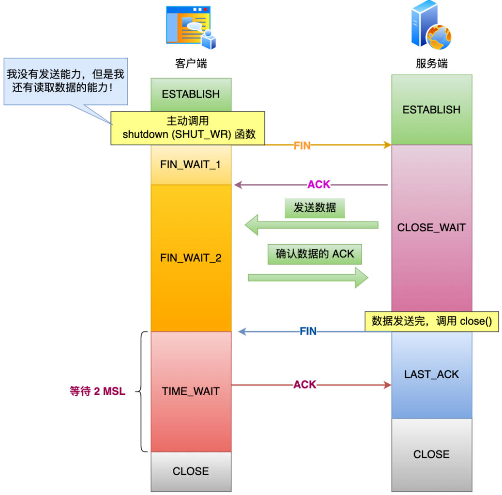

但是注意，shutdown 函数也可以指定「只关闭读取方向，而不关闭发送方向」，但是这时候内核是不会发送 FIN 报文的，因为发送 FIN 报文是意味着我方将不再发送任何数据，而 shutdown 如果指定「不关闭发送方向」，就意味着 socket 还有发送数据的能力，所以内核就不会发送 FIN。

### 什么情况会出现三次挥手？

当被动关闭方（上图的服务端）在 TCP 挥手过程中，「**没有数据要发送」并且「开启了 TCP 延迟确认机制」，那么第二和第三次挥手就会合并传输，这样就出现了三次挥手。**


然后因为 TCP 延迟确认机制是默认开启的，所以导致我们抓包时，看见三次挥手的次数比四次挥手还多。

> 什么是 TCP 延迟确认机制？

当发送没有携带数据的 ACK，它的网络效率也是很低的，因为它也有 40 个字节的 IP 头 和 TCP 头，但却没有携带数据报文。 为了解决 ACK 传输效率低问题，所以就衍生出了 **TCP 延迟确认**。 TCP 延迟确认的策略：

- 当有响应数据要发送时，ACK 会随着响应数据一起立刻发送给对方
- 当没有响应数据要发送时，ACK 将会延迟一段时间，以等待是否有响应数据可以一起发送
- 如果在延迟等待发送 ACK 期间，对方的第二个数据报文又到达了，这时就会立刻发送 ACK


## 重传机制

常见的重传机制：

- 超时重传
- 快速重传
- SACK
- D-SACK

### 超时重传

重传机制的其中一个方式，就是在发送数据时，设定一个定时器，当超过指定的时间后，没有收到对方的 `ACK` 确认应答报文，就会重发该数据，也就是我们常说的**超时重传**。

TCP 会在以下两种情况发生超时重传：

- 数据包丢失
- 确认应答丢失


什么是 `RTT`（Round-Trip Time 往返时延），从下图我们就可以知道：


`RTT` 指的是**数据发送时刻到接收到确认的时刻的差值**，也就是包的往返时间。

超时重传时间是以 `RTO` （Retransmission Timeout 超时重传时间）表示。

假设在重传的情况下，超时时间 `RTO` 「较长或较短」时，会发生什么事情呢？

上图中有两种超时时间不同的情况：

- 当超时时间 **RTO 较大**时，重发就慢，丢了老半天才重发，没有效率，性能差；
- 当超时时间 **RTO 较小**时，会导致可能并没有丢就重发，于是重发的就快，会增加网络拥塞，导致更多的超时，更多的超时导致更多的重发。

精确的测量超时时间 `RTO` 的值是非常重要的，这可让我们的重传机制更高效。

根据上述的两种情况，我们可以得知，**超时重传时间 RTO 的值应该略大于报文往返 RTT 的值**。


### 快速重传

TCP 还有另外一种**快速重传（Fast Retransmit）机制**，它**不以时间为驱动，而是以数据驱动重传**。快速重传机制，是如何工作的呢？其实很简单，一图胜千言。


快速重传的工作方式是当收到三个相同的 ACK 报文时，会在定时器过期之前，重传丢失的报文段。

快速重传机制只解决了一个问题，就是超时时间的问题，但是它依然面临着另外一个问题。就是**重传的时候，是重传一个，还是重传所有的问题。**

举个例子，假设发送方发了 6 个数据，编号的顺序是 Seq1 ~ Seq6 ，但是 Seq2、Seq3 都丢失了，那么接收方在收到 Seq4、Seq5、Seq6 时，都是回复 ACK2 给发送方，但是发送方并不清楚这连续的 ACK2 是接收方收到哪个报文而回复的， 那是选择重传 Seq2 一个报文，还是重传 Seq2 之后已发送的所有报文呢（Seq2、Seq3、 Seq4、Seq5、 Seq6） 呢？

- 如果只选择重传 Seq2 一个报文，那么重传的效率很低。因为对于丢失的 Seq3 报文，还得在后续收到三个重复的 ACK3 才能触发重传。
- 如果选择重传 Seq2 之后已发送的所有报文，虽然能同时重传已丢失的 Seq2 和 Seq3 报文，但是 Seq4、Seq5、Seq6 的报文是已经被接收过了，对于重传 Seq4 ～Seq6 折部分数据相当于做了一次无用功，浪费资源。

可以看到，不管是重传一个报文，还是重传已发送的报文，都存在问题。

为了解决不知道该重传哪些 TCP 报文，于是就有 `SACK` 方法。

### SACK 方法

还有一种实现重传机制的方式叫：`SACK`（ Selective Acknowledgment）， **选择性确认**。

这种方式需要在 TCP 头部「选项」字段里加一个 `SACK` 的东西，它**可以将已收到的数据的信息发送给「发送方」**，这样发送方就可以知道哪些数据收到了，哪些数据没收到，知道了这些信息，就可以**只重传丢失的数据**。

如下图，发送方收到了三次同样的 ACK 确认报文，于是就会触发快速重发机制，通过 `SACK` 信息发现只有 `200~299` 这段数据丢失，则重发时，就只选择了这个 TCP 段进行重复。


### Duplicate SACK

Duplicate SACK 又称 `D-SACK`，其主要**使用了 SACK 来告诉「发送方」有哪些数据被重复接收了。**

下面举例两个栗子，来说明 `D-SACK` 的作用。

*例子一号：ACK 丢包*


- 「接收方」发给「发送方」的两个 ACK 确认应答都丢失了，所以发送方超时后，重传第一个数据包（3000 ~ 3499）
- **于是「接收方」发现数据是重复收到的，于是回了一个 SACK = 3000~3500**，告诉「发送方」 3000~3500 的数据早已被接收了，因为 ACK 都到了 4000 了，已经意味着 4000 之前的所有数据都已收到，所以这个 SACK 就代表着 `D-SACK`。
- 这样「发送方」就知道了，数据没有丢，是「接收方」的 ACK 确认报文丢了。

*例子二号：网络延时*


- 数据包（1000~1499） 被网络延迟了，导致「发送方」没有收到 Ack 1500 的确认报文。
- 而后面报文到达的三个相同的 ACK 确认报文，就触发了快速重传机制，但是在重传后，被延迟的数据包（1000~1499）又到了「接收方」；
- **所以「接收方」回了一个 SACK=1000~1500，因为 ACK 已经到了 3000，所以这个 SACK 是 D-SACK，表示收到了重复的包。**
- 这样发送方就知道快速重传触发的原因不是发出去的包丢了，也不是因为回应的 ACK 包丢了，而是因为网络延迟了。

可见，`D-SACK` 有这么几个好处：

1. 可以让「发送方」知道，是发出去的包丢了，还是接收方回应的 ACK 包丢了;
2. 可以知道是不是「发送方」的数据包被网络延迟了;
3. 可以知道网络中是不是把「发送方」的数据包给复制了;

## 滑动窗口

我们都知道 TCP 是每发送一个数据，都要进行一次确认应答。当上一个数据包收到了应答了， 再发送下一个。

这个模式就有点像我和你面对面聊天，你一句我一句。但这种方式的缺点是效率比较低的。

如果你说完一句话，我在处理其他事情，没有及时回复你，那你不是要干等着我做完其他事情后，我回复你，你才能说下一句话，很显然这不现实。


所以，这样的传输方式有一个缺点：数据包的**往返时间越长，通信的效率就越低**。

为解决这个问题，TCP 引入了**窗口**这个概念。即使在往返时间较长的情况下，它也不会降低网络通信的效率。

那么有了窗口，就可以指定窗口大小，窗口大小就是指**无需等待确认应答，而可以继续发送数据的最大值**。

窗口的实现实际上是操作系统开辟的一个缓存空间，发送方主机在等到确认应答返回之前，必须在缓冲区中保留已发送的数据。如果按期收到确认应答，此时数据就可以从缓存区清除。

假设窗口大小为 `3` 个 TCP 段，那么发送方就可以「连续发送」 `3` 个 TCP 段，并且中途若有 ACK 丢失，可以通过「下一个确认应答进行确认」。如下图：


图中的 ACK 600 确认应答报文丢失，也没关系，因为可以通过下一个确认应答进行确认，只要发送方收到了 ACK 700 确认应答，就意味着 700 之前的所有数据「接收方」都收到了。这个模式就叫**累计确认**或者**累计应答**。

> 窗口大小由哪一方决定？

TCP 头里有一个字段叫 `Window`，也就是窗口大小。

**这个字段是接收端告诉发送端自己还有多少缓冲区可以接收数据。于是发送端就可以根据这个接收端的处理能力来发送数据，而不会导致接收端处理不过来。**

所以，通常窗口的大小是由接收方的窗口大小来决定的。

发送方发送的数据大小不能超过接收方的窗口大小，否则接收方就无法正常接收到数据。

> 发送方的滑动窗口

我们先来看看发送方的窗口，下图就是发送方缓存的数据，根据处理的情况分成四个部分，其中深蓝色方框是发送窗口，紫色方框是可用窗口：


- \#1 是已发送并收到 ACK确认的数据：1~31 字节
- \#2 是已发送但未收到 ACK确认的数据：32~45 字节
- \#3 是未发送但总大小在接收方处理范围内（接收方还有空间）：46~51字节
- \#4 是未发送但总大小超过接收方处理范围（接收方没有空间）：52字节以后

在下图，当发送方把数据「全部」都一下发送出去后，可用窗口的大小就为 0 了，表明可用窗口耗尽，在没收到 ACK 确认之前是无法继续发送数据了。


在下图，当收到之前发送的数据 `32~36` 字节的 ACK 确认应答后，如果发送窗口的大小没有变化，则**滑动窗口往右边移动 5 个字节，因为有 5 个字节的数据被应答确认**，接下来 `52~56` 字节又变成了可用窗口，那么后续也就可以发送 `52~56` 这 5 个字节的数据了。


TCP 滑动窗口方案使用三个指针来跟踪在四个传输类别中的每一个类别中的字节。其中两个指针是绝对指针（指特定的序列号），一个是相对指针（需要做偏移）。


- `SND.WND`：表示发送窗口的大小（大小是由接收方指定的）；
- `SND.UNA`（*Send Unacknoleged*）：是一个绝对指针，它指向的是已发送但未收到确认的第一个字节的序列号，也就是 #2 的第一个字节。
- `SND.NXT`：也是一个绝对指针，它指向未发送但可发送范围的第一个字节的序列号，也就是 #3 的第一个字节。
- 指向 #4 的第一个字节是个相对指针，它需要 `SND.UNA` 指针加上 `SND.WND` 大小的偏移量，就可以指向 #4 的第一个字节了。

那么可用窗口大小的计算就可以是：

**可用窗口大小 = SND.WND -（SND.NXT - SND.UNA）**

> 接收方的滑动窗口

接下来我们看看接收方的窗口，接收窗口相对简单一些，根据处理的情况划分成三个部分：

- \#1 + #2 是已成功接收并确认的数据（等待应用进程读取）；
- \#3 是未收到数据但可以接收的数据；
- \#4 未收到数据并不可以接收的数据；


其中三个接收部分，使用两个指针进行划分:

- `RCV.WND`：表示接收窗口的大小，它会通告给发送方。
- `RCV.NXT`：是一个指针，它指向期望从发送方发送来的下一个数据字节的序列号，也就是 #3 的第一个字节。
- 指向 #4 的第一个字节是个相对指针，它需要 `RCV.NXT` 指针加上 `RCV.WND` 大小的偏移量，就可以指向 #4 的第一个字节了。

> 接收窗口和发送窗口的大小是相等的吗？

并不是完全相等，接收窗口的大小是**约等于**发送窗口的大小的。

因为滑动窗口并不是一成不变的。比如，当接收方的应用进程读取数据的速度非常快的话，这样的话接收窗口可以很快的就空缺出来。那么新的接收窗口大小，是通过 TCP 报文中的 Windows 字段来告诉发送方。那么这个传输过程是存在时延的，所以接收窗口和发送窗口是约等于的关系。

## 流量控制

发送方不能无脑的发数据给接收方，要考虑接收方处理能力。

如果一直无脑的发数据给对方，但对方处理不过来，那么就会导致触发重发机制，从而导致网络流量的无端的浪费。

为了解决这种现象发生，**TCP 提供一种机制可以让「发送方」根据「接收方」的实际接收能力控制发送的数据量，这就是所谓的流量控制。**

下面举个栗子，为了简单起见，假设以下场景：

- 客户端是接收方，服务端是发送方
- 假设接收窗口和发送窗口相同，都为 `200`
- 假设两个设备在整个传输过程中都保持相同的窗口大小，不受外界影响

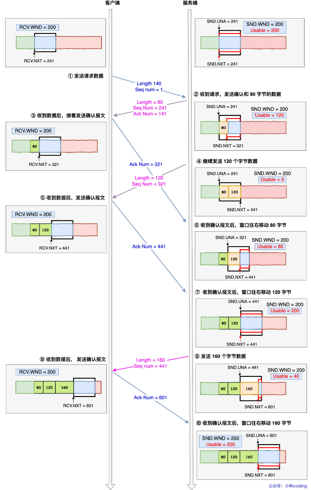

根据上图的流量控制，说明下每个过程：

1. 客户端向服务端发送请求数据报文。这里要说明下，本次例子是把服务端作为发送方，所以没有画出服务端的接收窗口。
2. 服务端收到请求报文后，发送确认报文和 80 字节的数据，于是可用窗口 `Usable` 减少为 120 字节，同时 `SND.NXT` 指针也向右偏移 80 字节后，指向 321，**这意味着下次发送数据的时候，序列号是 321。**
3. 客户端收到 80 字节数据后，于是接收窗口往右移动 80 字节，`RCV.NXT` 也就指向 321，**这意味着客户端期望的下一个报文的序列号是 321**，接着发送确认报文给服务端。
4. 服务端再次发送了 120 字节数据，于是可用窗口耗尽为 0，服务端无法再继续发送数据。
5. 客户端收到 120 字节的数据后，于是接收窗口往右移动 120 字节，`RCV.NXT` 也就指向 441，接着发送确认报文给服务端。
6. 服务端收到对 80 字节数据的确认报文后，`SND.UNA` 指针往右偏移后指向 321，于是可用窗口 `Usable` 增大到 80。
7. 服务端收到对 120 字节数据的确认报文后，`SND.UNA` 指针往右偏移后指向 441，于是可用窗口 `Usable` 增大到 200。
8. 服务端可以继续发送了，于是发送了 160 字节的数据后，`SND.NXT` 指向 601，于是可用窗口 `Usable` 减少到 40。
9. 客户端收到 160 字节后，接收窗口往右移动了 160 字节，`RCV.NXT` 也就是指向了 601，接着发送确认报文给服务端。
10. 服务端收到对 160 字节数据的确认报文后，发送窗口往右移动了 160 字节，于是 `SND.UNA` 指针偏移了 160 后指向 601，可用窗口 `Usable` 也就增大至了 200。

### 操作系统缓冲区与滑动窗口的关系

前面的流量控制例子，我们假定了发送窗口和接收窗口是不变的，但是实际上，发送窗口和接收窗口中所存放的字节数，都是放在操作系统内存缓冲区中的，而操作系统的缓冲区，会**被操作系统调整**。

当应用进程没办法及时读取缓冲区的内容时，也会对我们的缓冲区造成影响。

> 那操作系统的缓冲区，是如何影响发送窗口和接收窗口的呢？

*我们先来看看第一个例子。*

当应用程序没有及时读取缓存时，发送窗口和接收窗口的变化。

考虑以下场景：

- 客户端作为发送方，服务端作为接收方，发送窗口和接收窗口初始大小为 `360`；
- 服务端非常的繁忙，当收到客户端的数据时，应用层不能及时读取数据。


根据上图的流量控制，说明下每个过程：

1. 客户端发送 140 字节数据后，可用窗口变为 220 （360 - 140）。
2. 服务端收到 140 字节数据，**但是服务端非常繁忙，应用进程只读取了 40 个字节，还有 100 字节占用着缓冲区，于是接收窗口收缩到了 260 （360 - 100）**，最后发送确认信息时，将窗口大小通告给客户端。
3. 客户端收到确认和窗口通告报文后，发送窗口减少为 260。
4. 客户端发送 180 字节数据，此时可用窗口减少到 80。
5. 服务端收到 180 字节数据，**但是应用程序没有读取任何数据，这 180 字节直接就留在了缓冲区，于是接收窗口收缩到了 80 （260 - 180）**，并在发送确认信息时，通过窗口大小给客户端。
6. 客户端收到确认和窗口通告报文后，发送窗口减少为 80。
7. 客户端发送 80 字节数据后，可用窗口耗尽。
8. 服务端收到 80 字节数据，**但是应用程序依然没有读取任何数据，这 80 字节留在了缓冲区，于是接收窗口收缩到了 0**，并在发送确认信息时，通过窗口大小给客户端。
9. 客户端收到确认和窗口通告报文后，发送窗口减少为 0。

可见最后窗口都收缩为 0 了，也就是发生了窗口关闭。当发送方可用窗口变为 0 时，发送方实际上会定时发送窗口探测报文，以便知道接收方的窗口是否发生了改变，这个内容后面会说，这里先简单提一下。

*我们先来看看第二个例子。*

当服务端系统资源非常紧张的时候，操作系统可能会直接减少了接收缓冲区大小，这时应用程序又无法及时读取缓存数据，那么这时候就有严重的事情发生了，会出现数据包丢失的现象。

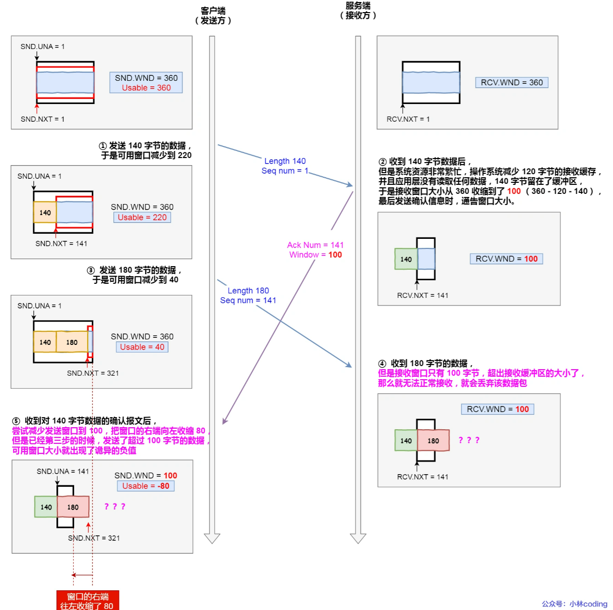

说明下每个过程：

1. 客户端发送 140 字节的数据，于是可用窗口减少到了 220。
2. **服务端因为现在非常的繁忙，操作系统于是就把接收缓存减少了 120 字节，当收到 140 字节数据后，又因为应用程序没有读取任何数据，所以 140 字节留在了缓冲区中，于是接收窗口大小从 360 收缩成了 100**，最后发送确认信息时，通告窗口大小给对方。
3. 此时客户端因为还没有收到服务端的通告窗口报文，所以不知道此时接收窗口收缩成了 100，客户端只会看自己的可用窗口还有 220，所以客户端就发送了 180 字节数据，于是可用窗口减少到 40。
4. 服务端收到了 180 字节数据时，**发现数据大小超过了接收窗口的大小，于是就把数据包丢失了。**
5. 客户端收到第 2 步时，服务端发送的确认报文和通告窗口报文，尝试减少发送窗口到 100，把窗口的右端向左收缩了 80，此时可用窗口的大小就会出现诡异的负值。

所以，如果发生了先减少缓存，再收缩窗口，就会出现丢包的现象。

**为了防止这种情况发生，TCP 规定是不允许同时减少缓存又收缩窗口的，而是采用先收缩窗口，过段时间再减少缓存，这样就可以避免了丢包情况。**

### 窗口关闭

在前面我们都看到了，TCP 通过让接收方指明希望从发送方接收的数据大小（窗口大小）来进行流量控制。

**如果窗口大小为 0 时，就会阻止发送方给接收方传递数据，直到窗口变为非 0 为止，这就是窗口关闭。**

> 窗口关闭潜在的危险

接收方向发送方通告窗口大小时，是通过 `ACK` 报文来通告的。

那么，当发生窗口关闭时，接收方处理完数据后，会向发送方通告一个窗口非 0 的 ACK 报文，如果这个通告窗口的 ACK 报文在网络中丢失了，那麻烦就大了。


这会导致发送方一直等待接收方的非 0 窗口通知，接收方也一直等待发送方的数据，如不采取措施，这种相互等待的过程，会造成了死锁的现象。

> TCP 是如何解决窗口关闭时，潜在的死锁现象呢？

为了解决这个问题，TCP 为每个连接设有一个持续定时器，**只要 TCP 连接一方收到对方的零窗口通知，就启动持续计时器。**

如果持续计时器超时，就会发送**窗口探测 ( Window probe ) 报文**，而对方在确认这个探测报文时，给出自己现在的接收窗口大小。


- 如果接收窗口仍然为 0，那么收到这个报文的一方就会重新启动持续计时器；
- 如果接收窗口不是 0，那么死锁的局面就可以被打破了。

窗口探测的次数一般为 3 次，每次大约 30-60 秒（不同的实现可能会不一样）。如果 3 次过后接收窗口还是 0 的话，有的 TCP 实现就会发 `RST` 报文来中断连接。

## 拥塞控制

> 为什么要有拥塞控制呀，不是有流量控制了吗？

前面的流量控制是避免「发送方」的数据填满「接收方」的缓存，但是并不知道网络的中发生了什么。

一般来说，计算机网络都处在一个共享的环境。因此也有可能会因为其他主机之间的通信使得网络拥堵。

**在网络出现拥堵时，如果继续发送大量数据包，可能会导致数据包时延、丢失等，这时 TCP 就会重传数据，但是一重传就会导致网络的负担更重，于是会导致更大的延迟以及更多的丢包，这个情况就会进入恶性循环被不断地放大....**

所以，TCP 不能忽略网络上发生的事，它被设计成一个无私的协议，当网络发送拥塞时，TCP 会自我牺牲，降低发送的数据量。

于是，就有了**拥塞控制**，控制的目的就是**避免「发送方」的数据填满整个网络。**

为了在「发送方」调节所要发送数据的量，定义了一个叫做「**拥塞窗口**」的概念。

> 什么是拥塞窗口？和发送窗口有什么关系呢？

**拥塞窗口 cwnd**是发送方维护的一个的状态变量，它会根据**网络的拥塞程度动态变化的**。

我们在前面提到过发送窗口 `swnd` 和接收窗口 `rwnd` 是约等于的关系，那么由于加入了拥塞窗口的概念后，此时发送窗口的值是swnd = min(cwnd, rwnd)，也就是拥塞窗口和接收窗口中的最小值。

拥塞窗口 `cwnd` 变化的规则：

- 只要网络中没有出现拥塞，`cwnd` 就会增大；
- 但网络中出现了拥塞，`cwnd` 就减少；

> 那么怎么知道当前网络是否出现了拥塞呢？

其实只要「发送方」没有在规定时间内接收到 ACK 应答报文，也就是**发生了超时重传，就会认为网络出现了拥塞。**

> 拥塞控制有哪些控制算法？

拥塞控制主要是四个算法：

- 慢启动
- 拥塞避免
- 拥塞发生
- 快速恢复

### 慢启动

TCP 在刚建立连接完成后，首先是有个慢启动的过程，这个慢启动的意思就是一点一点的提高发送数据包的数量，如果一上来就发大量的数据，这不是给网络添堵吗？

慢启动的算法记住一个规则就行：**当发送方每收到一个 ACK，拥塞窗口 cwnd 的大小就会加 1。**

这里假定拥塞窗口 `cwnd` 和发送窗口 `swnd` 相等，下面举个栗子：

- 连接建立完成后，一开始初始化 `cwnd = 1`，表示可以传一个 `MSS` 大小的数据。
- 当收到一个 ACK 确认应答后，cwnd 增加 1，于是一次能够发送 2 个
- 当收到 2 个的 ACK 确认应答后， cwnd 增加 2，于是就可以比之前多发2 个，所以这一次能够发送 4 个
- 当这 4 个的 ACK 确认到来的时候，每个确认 cwnd 增加 1， 4 个确认 cwnd 增加 4，于是就可以比之前多发 4 个，所以这一次能够发送 8 个。

慢启动算法的变化过程如下图：


可以看出慢启动算法，发包的个数是**指数性的增长**。

> 那慢启动涨到什么时候是个头呢？

有一个叫慢启动门限 `ssthresh` （slow start threshold）状态变量。

- 当 `cwnd` < `ssthresh` 时，使用慢启动算法。
- 当 `cwnd` >= `ssthresh` 时，就会使用「拥塞避免算法」。

### 拥塞避免算法

前面说道，当拥塞窗口 `cwnd` 「超过」慢启动门限 `ssthresh` 就会进入拥塞避免算法。

一般来说 `ssthresh` 的大小是 `65535` 字节。

那么进入拥塞避免算法后，它的规则是：**每当收到一个 ACK 时，cwnd 增加 1/cwnd。**

接上前面的慢启动的栗子，现假定 `ssthresh` 为 `8`：

- 当 8 个 ACK 应答确认到来时，每个确认增加 1/8，8 个 ACK 确认 cwnd 一共增加 1，于是这一次能够发送 9 个 `MSS` 大小的数据，变成了**线性增长。**

拥塞避免算法的变化过程如下图：


所以，我们可以发现，拥塞避免算法就是将原本慢启动算法的指数增长变成了线性增长，还是增长阶段，但是增长速度缓慢了一些。

就这么一直增长着后，网络就会慢慢进入了拥塞的状况了，于是就会出现丢包现象，这时就需要对丢失的数据包进行重传。

当触发了重传机制，也就进入了「拥塞发生算法」。

### 拥塞发生

当网络出现拥塞，也就是会发生数据包重传，重传机制主要有两种：

- 超时重传
- 快速重传

这两种使用的拥塞发送算法是不同的，接下来分别来说说。

> 发生超时重传的拥塞发生算法

当发生了「超时重传」，则就会使用拥塞发生算法。

这个时候，ssthresh 和 cwnd 的值会发生变化：

- `ssthresh` 设为 `cwnd/2`，
- `cwnd` 重置为 `1` （是恢复为 cwnd 初始化值，我这里假定 cwnd 初始化值 1）


接着，就重新开始慢启动，慢启动是会突然减少数据流的。这真是一旦「超时重传」，马上回到解放前。但是这种方式太激进了，反应也很强烈，会造成网络卡顿。

就好像本来在秋名山高速漂移着，突然来个紧急刹车，轮胎受得了吗。。。

> 发生快速重传的拥塞发生算法

还有更好的方式，前面我们讲过「快速重传算法」。当接收方发现丢了一个中间包的时候，发送三次前一个包的 ACK，于是发送端就会快速地重传，不必等待超时再重传。

TCP 认为这种情况不严重，因为大部分没丢，只丢了一小部分，则 `ssthresh` 和 `cwnd` 变化如下：

- `cwnd = cwnd/2` ，也就是设置为原来的一半;
- `ssthresh = cwnd`;
- 进入快速恢复算法

### 快速恢复

快速重传和快速恢复算法一般同时使用，快速恢复算法是认为，你还能收到 3 个重复 ACK 说明网络也不那么糟糕，所以没有必要像 `RTO` 超时那么强烈。

正如前面所说，进入快速恢复之前，`cwnd` 和 `ssthresh` 已被更新了：

- `cwnd = cwnd/2` ，也就是设置为原来的一半;
- `ssthresh = cwnd`;

然后，进入快速恢复算法如下：

- 拥塞窗口 `cwnd = ssthresh + 3` （ 3 的意思是确认有 3 个数据包被收到了）；
- 重传丢失的数据包；
- 如果再收到重复的 ACK，那么 cwnd 增加 1；
- 如果收到新数据的 ACK 后，把 cwnd 设置为第一步中的 ssthresh 的值，原因是该 ACK 确认了新的数据，说明从 duplicated ACK 时的数据都已收到，该恢复过程已经结束，可以回到恢复之前的状态了，也即再次进入拥塞避免状态；

快速恢复算法的变化过程如下图：


也就是没有像「超时重传」一夜回到解放前，而是还在比较高的值，后续呈线性增长。

## IP 基本认识

IP 在 TCP/IP 参考模型中处于第三层，也就是**网络层**。

网络层的主要作用是：**实现主机与主机之间的通信，也叫点对点（end to end）通信。**

> 网络层与数据链路层有什么关系呢？

有的小伙伴分不清 IP（网络层） 和 MAC （数据链路层）之间的区别和关系。

其实很容易区分，在上面我们知道 IP 的作用是主机之间通信用的，而 **MAC 的作用则是实现「直连」的两个设备之间通信，而 IP 则负责在「没有直连」的两个网络之间进行通信传输。**


在网络中数据包传输中也是如此，**源IP地址和目标IP地址在传输过程中是不会变化的（前提：没有使用 NAT 网络），只有源 MAC 地址和目标 MAC 一直在变化。**

------

## IP 地址的基础知识

在 TCP/IP 网络通信时，为了保证能正常通信，每个设备都需要配置正确的 IP 地址，否则无法实现正常的通信。

IP 地址（IPv4 地址）由 `32` 位正整数来表示，IP 地址在计算机是以二进制的方式处理的。

而人类为了方便记忆采用了**点分十进制**的标记方式，也就是将 32 位 IP 地址以每 8 位为组，共分为 `4` 组，每组以「`.`」隔开，再将每组转换成十进制。


那么，IP 地址最大值也就是


也就说，最大允许 43 亿台计算机连接到网络。

实际上，IP 地址并不是根据主机台数来配置的，而是以网卡。像服务器、路由器等设备都是有 2 个以上的网卡，也就是它们会有 2 个以上的 IP 地址。


因此，让 43 亿台计算机全部连网其实是不可能的，更何况 IP 地址是由「网络标识」和「主机标识」这两个部分组成的，所以实际能够连接到网络的计算机个数更是少了很多。

> 可能有的小伙伴提出了疑问，现在不仅电脑配了 IP 地址， 手机、IPad 等电子设备都配了 IP 呀，照理来说肯定会超过 43 亿啦，那是怎么能够支持这么多 IP 的呢？

因为会根据一种可以更换 IP 地址的技术 `NAT`，使得可连接计算机数超过 43 亿台。 `NAT` 技术后续会进一步讨论和说明。

### IP 地址的分类

互联网诞生之初，IP 地址显得很充裕，于是计算机科学家们设计了**分类地址**。

IP 地址分类成了 5 种类型，分别是 A 类、B 类、C 类、D 类、E 类。


上图中黄色部分为分类号，用以区分 IP 地址类别。

> 什么是 A、B、C 类地址？

其中对于 A、B、C 类主要分为两个部分，分别是**网络号和主机号**。这很好理解，好比小林是 A 小区 1 栋 101 号，你是 B 小区 1 栋 101 号。

我们可以用下面这个表格， 就能很清楚的知道 A、B、C 分类对应的地址范围、最大主机个数。


> A、B、C 分类地址最大主机个数是如何计算的呢？

最大主机个数，就是要看主机号的位数，如 C 类地址的主机号占 8 位，那么 C 类地址的最大主机个数：


为什么要减 2 呢？

因为在 IP 地址中，有两个 IP 是特殊的，分别是主机号全为 1 和 全为 0 地址。

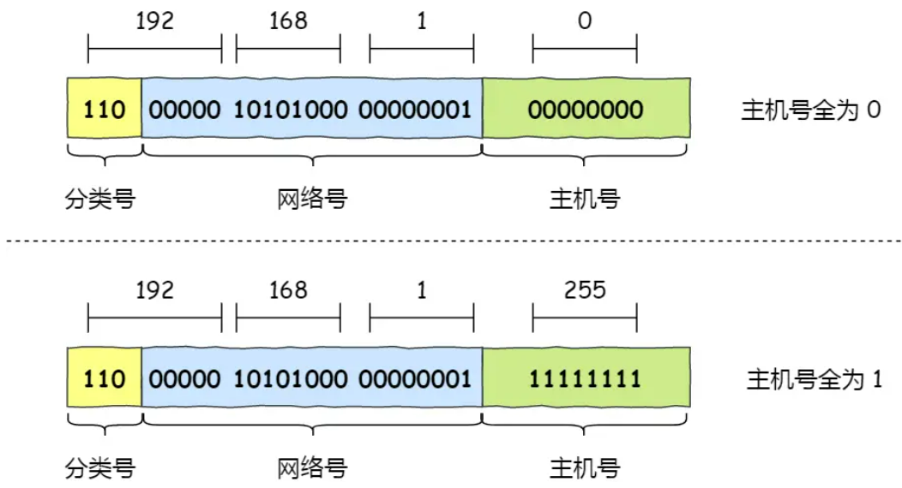

- 主机号全为 1 指定某个网络下的所有主机，用于广播
- 主机号全为 0 指定某个网络

因此，在分配过程中，应该去掉这两种情况。

> 广播地址用于什么？

广播地址用于在**同一个链路中相互连接的主机之间发送数据包**。

学校班级中就有广播的例子，在准备上课的时候，通常班长会喊：“上课， 全体起立！”，班里的同学听到这句话是不是全部都站起来了？这个句话就有广播的含义。

当主机号全为 1 时，就表示该网络的广播地址。例如把 `172.20.0.0/16` 用二进制表示如下：

10101100.00010100.00000000.00000000

将这个地址的**主机部分全部改为 1**，则形成广播地址：

10101100.00010100.`11111111.11111111`

再将这个地址用十进制表示，则为 `172.20.255.255`。

广播地址可以分为本地广播和直接广播两种。

- **在本网络内广播的叫做本地广播**。例如网络地址为 192.168.0.0/24 的情况下，广播地址是 192.168.0.255 。因为这个广播地址的 IP 包会被路由器屏蔽，所以不会到达 192.168.0.0/24 以外的其他链路上。
- **在不同网络之间的广播叫做直接广播**。例如网络地址为 192.168.0.0/24 的主机向 192.168.1.255/24 的目标地址发送 IP 包。收到这个包的路由器，将数据转发给 192.168.1.0/24，从而使得所有 192.168.1.1~192.168.1.254 的主机都能收到这个包（由于直接广播有一定的安全问题，多数情况下会在路由器上设置为不转发。） 。

> 什么是 D、E 类地址？

而 D 类和 E 类地址是没有主机号的，所以不可用于主机 IP，D 类常被用于**多播**，E 类是预留的分类，暂时未使用。


> 多播地址用于什么？

多播用于**将包发送给特定组内的所有主机。**

还是举班级的栗子，老师说：“最后一排的同学，上来做这道数学题。”，老师指定的是最后一排的同学，也就是多播的含义了。

由于广播无法穿透路由，若想给其他网段发送同样的包，就可以使用可以穿透路由的多播。


多播使用的 D 类地址，其前四位是 `1110` 就表示是多播地址，而剩下的 28 位是多播的组编号。

从 224.0.0.0 ~ 239.255.255.255 都是多播的可用范围，其划分为以下三类：

- 224.0.0.0 ~ 224.0.0.255 为预留的组播地址，只能在局域网中，路由器是不会进行转发的。
- 224.0.1.0 ~ 238.255.255.255 为用户可用的组播地址，可以用于 Internet 上。
- 239.0.0.0 ~ 239.255.255.255 为本地管理组播地址，可供内部网在内部使用，仅在特定的本地范围内有效。

> IP 分类的优点

不管是路由器还是主机解析到一个 IP 地址时候，我们判断其 IP 地址的首位是否为 0，为 0 则为 A 类地址，那么就能很快的找出网络地址和主机地址。

> IP 分类的缺点

*缺点一*

**同一网络下没有地址层次**，比如一个公司里用了 B 类地址，但是可能需要根据生产环境、测试环境、开发环境来划分地址层次，而这种 IP 分类是没有地址层次划分的功能，所以这就**缺少地址的灵活性**。

*缺点二*

A、B、C类有个尴尬处境，就是**不能很好的与现实网络匹配**。

- C 类地址能包含的最大主机数量实在太少了，只有 254 个，估计一个网吧都不够用。
- 而 B 类地址能包含的最大主机数量又太多了，6 万多台机器放在一个网络下面，一般的企业基本达不到这个规模，闲着的地址就是浪费。

这两个缺点，都可以在 `CIDR` 无分类地址解决。

### 无分类地址 CIDR

正因为 IP 分类存在许多缺点，所以后面提出了无分类地址的方案，即 `CIDR`。

这种方式不再有分类地址的概念，32 比特的 IP 地址被划分为两部分，前面是**网络号**，后面是**主机号**。

> 怎么划分网络号和主机号的呢？

表示形式 `a.b.c.d/x`，其中 `/x` 表示前 x 位属于**网络号**， x 的范围是 `0 ~ 32`，这就使得 IP 地址更加具有灵活性。

比如 10.100.122.2/24，这种地址表示形式就是 CIDR，/24 表示前 24 位是网络号，剩余的 8 位是主机号。


还有另一种划分网络号与主机号形式，那就是**子网掩码**，掩码的意思就是掩盖掉主机号，剩余的就是网络号。

**将子网掩码和 IP 地址按位计算 AND，就可得到网络号。**


> 为什么要分离网络号和主机号？

因为两台计算机要通讯，首先要判断是否处于同一个广播域内，即网络地址是否相同。如果网络地址相同，表明接受方在本网络上，那么可以把数据包直接发送到目标主机。

路由器寻址工作中，也就是通过这样的方式来找到对应的网络号的，进而把数据包转发给对应的网络内。


> 怎么进行子网划分？

在上面我们知道可以通过子网掩码划分出网络号和主机号，那实际上子网掩码还有一个作用，那就是**划分子网**。

**子网划分实际上是将主机地址分为两个部分：子网网络地址和子网主机地址**。形式如下：


- 未做子网划分的 ip 地址：网络地址＋主机地址
- 做子网划分后的 ip 地址：网络地址＋（子网网络地址＋子网主机地址）

假设对 C 类地址进行子网划分，网络地址 192.168.1.0，使用子网掩码 255.255.255.192 对其进行子网划分。

C 类地址中前 24 位是网络号，最后 8 位是主机号，根据子网掩码可知**从 8 位主机号中借用 2 位作为子网号**。


由于子网网络地址被划分成 2 位，那么子网地址就有 4 个，分别是 00、01、10、11，具体划分如下图：

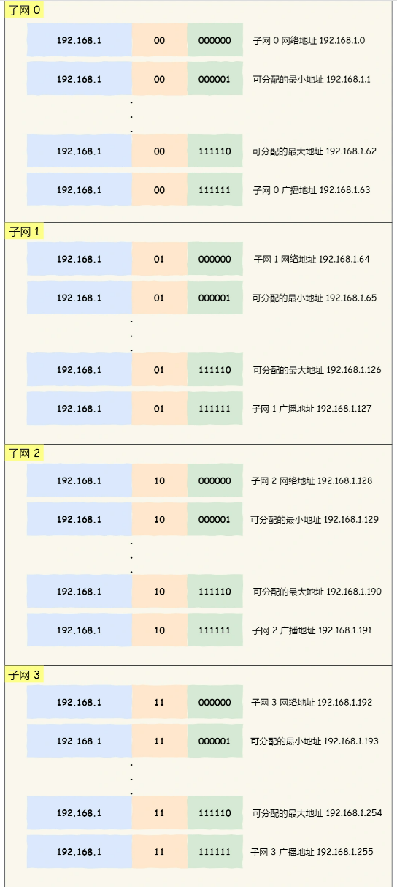

划分后的 4 个子网如下表格：


### 公有 IP 地址与私有 IP 地址

在 A、B、C 分类地址，实际上有分公有 IP 地址和私有 IP 地址。


平时我们办公室、家里、学校用的 IP 地址，一般都是私有 IP 地址。因为这些地址允许组织内部的 IT 人员自己管理、自己分配，而且可以重复。因此，你学校的某个私有 IP 地址和我学校的可以是一样的。

就像每个小区都有自己的楼编号和门牌号，你小区家可以叫 1 栋 101 号，我小区家也可以叫 1 栋 101，没有任何问题。但一旦出了小区，就需要带上中山路 666 号（公网 IP 地址），是国家统一分配的，不能两个小区都叫中山路 666。

所以，公有 IP 地址是有个组织统一分配的，假设你要开一个博客网站，那么你就需要去申请购买一个公有 IP，这样全世界的人才能访问。并且公有 IP 地址基本上要在整个互联网范围内保持唯一。


### IP 地址与路由控制

IP地址的**网络地址**这一部分是用于进行路由控制。

路由控制表中记录着网络地址与下一步应该发送至路由器的地址。在主机和路由器上都会有各自的路由器控制表。

在发送 IP 包时，首先要确定 IP 包首部中的目标地址，再从路由控制表中找到与该地址具有**相同网络地址**的记录，根据该记录将 IP 包转发给相应的下一个路由器。如果路由控制表中存在多条相同网络地址的记录，就选择相同位数最多的网络地址，也就是最长匹配。

下面以下图的网络链路作为例子说明：

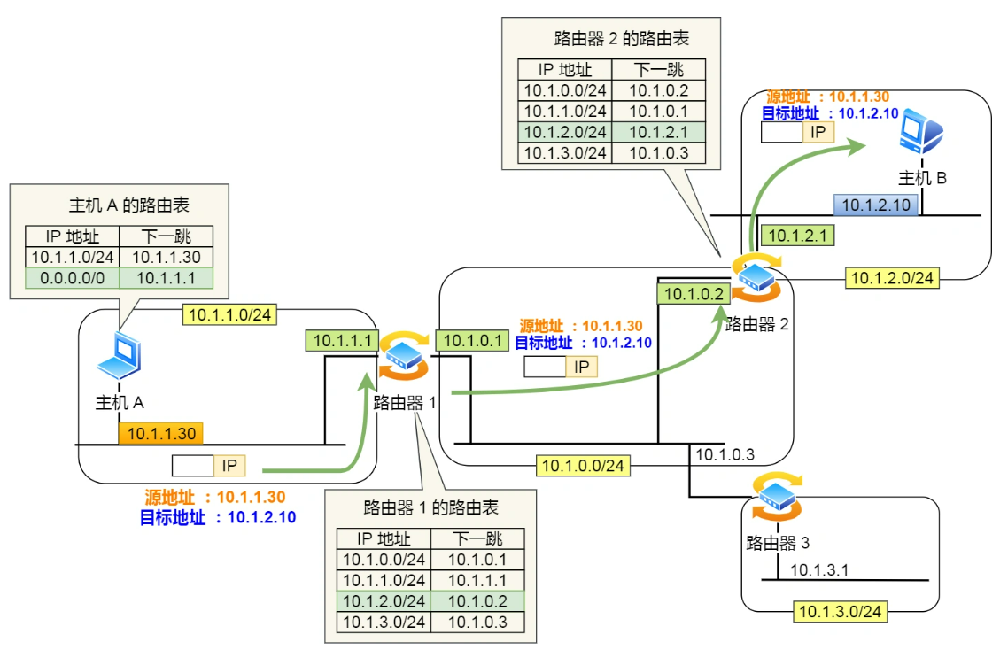

1. 主机 A 要发送一个 IP 包，其源地址是 `10.1.1.30` 和目标地址是 `10.1.2.10`，由于没有在主机 A 的路由表找到与目标地址 `10.1.2.10` 相同的网络地址，于是包被转发到默认路由（路由器 `1` ）
2. 路由器 `1` 收到 IP 包后，也在路由器 `1` 的路由表匹配与目标地址相同的网络地址记录，发现匹配到了，于是就把 IP 数据包转发到了 `10.1.0.2` 这台路由器 `2`
3. 路由器 `2` 收到后，同样对比自身的路由表，发现匹配到了，于是把 IP 包从路由器 `2` 的 `10.1.2.1` 这个接口出去，最终经过交换机把 IP 数据包转发到了目标主机

> 环回地址是不会流向网络

环回地址是在同一台计算机上的程序之间进行网络通信时所使用的一个默认地址。

计算机使用一个特殊的 IP 地址 **127.0.0.1 作为环回地址**。与该地址具有相同意义的是一个叫做 `localhost` 的主机名。使用这个 IP 或主机名时，数据包不会流向网络。

### IP 分片与重组

每种数据链路的最大传输单元 `MTU` 都是不相同的，如 FDDI 数据链路 MTU 4352、以太网的 MTU 是 1500 字节等。

每种数据链路的 MTU 之所以不同，是因为每个不同类型的数据链路的使用目的不同。使用目的不同，可承载的 MTU 也就不同。

其中，我们最常见数据链路是以太网，它的 MTU 是 `1500` 字节。

那么当 IP 数据包大小大于 MTU 时， IP 数据包就会被分片。

经过分片之后的 IP 数据报在被重组的时候，只能由目标主机进行，路由器是不会进行重组的。

假设发送方发送一个 4000 字节的大数据报，若要传输在以太网链路，则需要把数据报分片成 3 个小数据报进行传输，再交由接收方重组成大数据报。


在分片传输中，一旦某个分片丢失，则会造成整个 IP 数据报作废，所以 TCP 引入了 `MSS` 也就是在 TCP 层进行分片不由 IP 层分片，那么对于 UDP 我们尽量不要发送一个大于 `MTU` 的数据报文。

### IPv6 基本认识

IPv4 的地址是 32 位的，大约可以提供 42 亿个地址，但是早在 2011 年 IPv4 地址就已经被分配完了。

但是 IPv6 的地址是 `128` 位的，这可分配的地址数量是大的惊人，说个段子 **IPv6 可以保证地球上的每粒沙子都能被分配到一个 IP 地址。**

但 IPv6 除了有更多的地址之外，还有更好的安全性和扩展性，说简单点就是 IPv6 相比于 IPv4 能带来更好的网络体验。

但是因为 IPv4 和 IPv6 不能相互兼容，所以不但要我们电脑、手机之类的设备支持，还需要网络运营商对现有的设备进行升级，所以这可能是 IPv6 普及率比较慢的一个原因。

> IPv6 的亮点

IPv6 不仅仅只是可分配的地址变多了，它还有非常多的亮点。

- IPv6 可自动配置，即使没有 DHCP 服务器也可以实现自动分配IP地址，真是**便捷到即插即用**啊。
- IPv6 包头包首部长度采用固定的值 `40` 字节，去掉了包头校验和，简化了首部结构，减轻了路由器负荷，大大**提高了传输的性能**。
- IPv6 有应对伪造 IP 地址的网络安全功能以及防止线路窃听的功能，大大**提升了安全性**。
- **...** （由你发现更多的亮点）

> IPv6 地址的标识方法

IPv4 地址长度共 32 位，是以每 8 位作为一组，并用点分十进制的表示方式。

IPv6 地址长度是 128 位，是以每 16 位作为一组，每组用冒号 「:」 隔开。


如果出现连续的 0 时还可以将这些 0 省略，并用两个冒号 「::」隔开。但是，一个 IP 地址中只允许出现一次两个连续的冒号。


> IPv6 地址的结构

IPv6 类似 IPv4，也是通过 IP 地址的前几位标识 IP 地址的种类。

IPv6 的地址主要有以下类型地址：

- 单播地址，用于一对一的通信
- 组播地址，用于一对多的通信
- 任播地址，用于通信最近的节点，最近的节点是由路由协议决定
- 没有广播地址


> IPv6 单播地址类型

对于一对一通信的 IPv6 地址，主要划分了三类单播地址，每类地址的有效范围都不同。

- 在同一链路单播通信，不经过路由器，可以使用**链路本地单播地址**，IPv4 没有此类型
- 在内网里单播通信，可以使用**唯一本地地址**，相当于 IPv4 的私有 IP
- 在互联网通信，可以使用**全局单播地址**，相当于 IPv4 的公有 IP


### IPv4 首部与 IPv6 首部

IPv4 首部与 IPv6 首部的差异如下图：

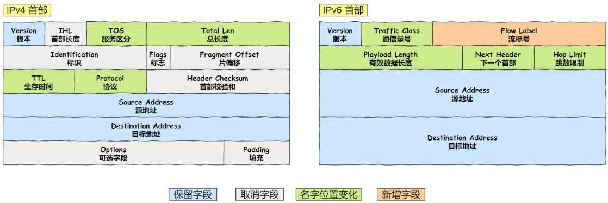

IPv6 相比 IPv4 的首部改进：

- **取消了首部校验和字段。** 因为在数据链路层和传输层都会校验，因此 IPv6 直接取消了 IP 的校验。
- **取消了分片/重新组装相关字段。** 分片与重组是耗时的过程，IPv6 不允许在中间路由器进行分片与重组，这种操作只能在源与目标主机，这将大大提高了路由器转发的速度。
- **取消选项字段。** 选项字段不再是标准 IP 首部的一部分了，但它并没有消失，而是可能出现在 IPv6 首部中的「下一个首部」指出的位置上。删除该选项字段使的 IPv6 的首部成为固定长度的 `40` 字节。

## IP 协议相关技术

跟 IP 协议相关的技术也不少，接下来说说与 IP 协议相关的重要且常见的技术。

- DNS 域名解析
- ARP 与 RARP 协议
- DHCP 动态获取 IP 地址
- NAT 网络地址转换
- ICMP 互联网控制报文协议
- IGMP 因特网组管理协议

### DNS

我们在上网的时候，通常使用的方式是域名，而不是 IP 地址，因为域名方便人类记忆。

那么实现这一技术的就是 **DNS 域名解析**，DNS 可以将域名网址自动转换为具体的 IP 地址。

> 域名的层级关系

DNS 中的域名都是用**句点**来分隔的，比如 `www.server.com`，这里的句点代表了不同层次之间的**界限**。

在域名中，**越靠右**的位置表示其层级**越高**。

### ARP

在传输一个 IP 数据报的时候，确定了源 IP 地址和目标 IP 地址后，就会通过主机「路由表」确定 IP 数据包下一跳。然而，网络层的下一层是数据链路层，所以我们还要知道「下一跳」的 MAC 地址。

由于主机的路由表中可以找到下一跳的 IP 地址，所以可以通过 **ARP 协议**，求得下一跳的 MAC 地址。

> 那么 ARP 又是如何知道对方 MAC 地址的呢？

简单地说，ARP 是借助 **ARP 请求与 ARP 响应**两种类型的包确定 MAC 地址的。


- 主机会通过**广播发送 ARP 请求**，这个包中包含了想要知道的 MAC 地址的主机 IP 地址。
- 当同个链路中的所有设备收到 ARP 请求时，会去拆开 ARP 请求包里的内容，如果 ARP 请求包中的目标 IP 地址与自己的 IP 地址一致，那么这个设备就将自己的 MAC 地址塞入 **ARP 响应包**返回给主机。

操作系统通常会把第一次通过 ARP 获取的 MAC 地址缓存起来，以便下次直接从缓存中找到对应 IP 地址的 MAC 地址。

不过，MAC 地址的缓存是有一定期限的，超过这个期限，缓存的内容将被清除。

> RARP 协议你知道是什么吗？

ARP 协议是已知 IP 地址求 MAC 地址，那 RARP 协议正好相反，它是**已知 MAC 地址求 IP 地址**。例如将打印机服务器等小型嵌入式设备接入到网络时就经常会用得到。

通常这需要架设一台 `RARP` 服务器，在这个服务器上注册设备的 MAC 地址及其 IP 地址。然后再将这个设备接入到网络，接着：

- 该设备会发送一条「我的 MAC 地址是XXXX，请告诉我，我的IP地址应该是什么」的请求信息。
- RARP 服务器接到这个消息后返回「MAC地址为 XXXX 的设备，IP地址为 XXXX」的信息给这个设备。

最后，设备就根据从 RARP 服务器所收到的应答信息设置自己的 IP 地址。


### DHCP

DHCP 在生活中我们是很常见的了，我们的电脑通常都是通过 DHCP 动态获取 IP 地址，大大省去了配 IP 信息繁琐的过程。

接下来，我们来看看我们的电脑是如何通过 4 个步骤的过程，获取到 IP 的。

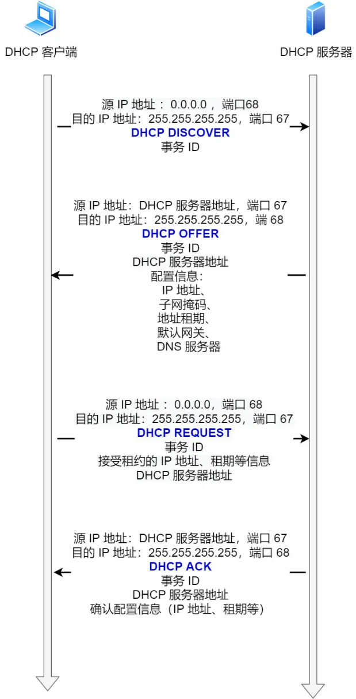

先说明一点，DHCP 客户端进程监听的是 68 端口号，DHCP 服务端进程监听的是 67 端口号。

这 4 个步骤：

- 客户端首先发起 **DHCP 发现报文（DHCP DISCOVER）** 的 IP 数据报，由于客户端没有 IP 地址，也不知道 DHCP 服务器的地址，所以使用的是 UDP **广播**通信，其使用的广播目的地址是 255.255.255.255（端口 67） 并且使用 0.0.0.0（端口 68） 作为源 IP 地址。DHCP 客户端将该 IP 数据报传递给链路层，链路层然后将帧广播到所有的网络中设备。
- DHCP 服务器收到 DHCP 发现报文时，用 **DHCP 提供报文（DHCP OFFER）** 向客户端做出响应。该报文仍然使用 IP 广播地址 255.255.255.255，该报文信息携带服务器提供可租约的 IP 地址、子网掩码、默认网关、DNS 服务器以及 **IP 地址租用期**。
- 客户端收到一个或多个服务器的 DHCP 提供报文后，从中选择一个服务器，并向选中的服务器发送 **DHCP 请求报文（DHCP REQUEST**进行响应，回显配置的参数。
- 最后，服务端用 **DHCP ACK 报文**对 DHCP 请求报文进行响应，应答所要求的参数。

一旦客户端收到 DHCP ACK 后，交互便完成了，并且客户端能够在租用期内使用 DHCP 服务器分配的 IP 地址。

如果租约的 DHCP IP 地址快期后，客户端会向服务器发送 DHCP 请求报文：

- 服务器如果同意继续租用，则用 DHCP ACK 报文进行应答，客户端就会延长租期。
- 服务器如果不同意继续租用，则用 DHCP NACK 报文，客户端就要停止使用租约的 IP 地址。

可以发现，DHCP 交互中，**全程都是使用 UDP 广播通信**。

> 咦，用的是广播，那如果 DHCP 服务器和客户端不是在同一个局域网内，路由器又不会转发广播包，那不是每个网络都要配一个 DHCP 服务器？

所以，为了解决这一问题，就出现了 **DHCP 中继代理**。有了 DHCP 中继代理以后，**对不同网段的 IP 地址分配也可以由一个 DHCP 服务器统一进行管理。**


- DHCP 客户端会向 DHCP 中继代理发送 DHCP 请求包，而 DHCP 中继代理在收到这个广播包以后，再以**单播**的形式发给 DHCP 服务器。
- 服务器端收到该包以后再向 DHCP 中继代理返回应答，并由 DHCP 中继代理将此包广播给 DHCP 客户端 。

因此，DHCP 服务器即使不在同一个链路上也可以实现统一分配和管理IP地址。

### NAT

IPv4 的地址是非常紧缺的，在前面我们也提到可以通过无分类地址来减缓 IPv4 地址耗尽的速度，但是互联网的用户增速是非常惊人的，所以 IPv4 地址依然有被耗尽的危险。

于是，提出了一种**网络地址转换 NAT** 的方法，再次缓解了 IPv4 地址耗尽的问题。

简单的来说 NAT 就是同个公司、家庭、教室内的主机对外部通信时，把私有 IP 地址转换成公有 IP 地址。


> 那不是 N 个私有 IP 地址，你就要 N 个公有 IP 地址？这怎么就缓解了 IPv4 地址耗尽的问题？这不瞎扯吗？

确实是，普通的 NAT 转换没什么意义。

由于绝大多数的网络应用都是使用传输层协议 TCP 或 UDP 来传输数据的。

因此，可以把 IP 地址 + 端口号一起进行转换。

这样，就用一个全球 IP 地址就可以了，这种转换技术就叫**网络地址与端口转换 NAPT。**

很抽象？来，看下面的图解就能瞬间明白了。

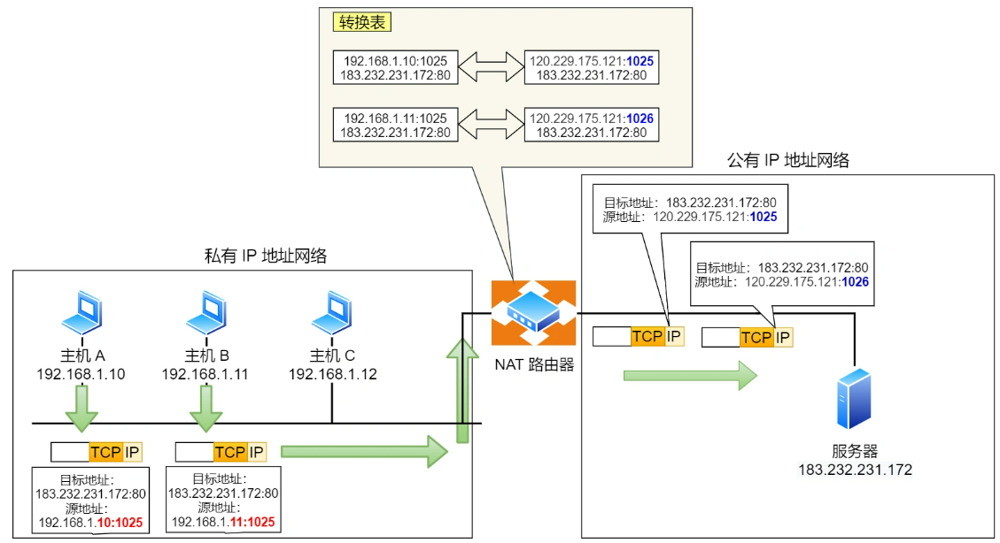

图中有两个客户端 192.168.1.10 和 192.168.1.11 同时与服务器 183.232.231.172 进行通信，并且这两个客户端的本地端口都是 1025。

此时，**两个私有 IP 地址都转换 IP 地址为公有地址 120.229.175.121，但是以不同的端口号作为区分。**

于是，生成一个 NAPT 路由器的转换表，就可以正确地转换地址跟端口的组合，令客户端 A、B 能同时与服务器之间进行通信。

这种转换表在 NAT 路由器上自动生成。例如，在 TCP 的情况下，建立 TCP 连接首次握手时的 SYN 包一经发出，就会生成这个表。而后又随着收到关闭连接时发出 FIN 包的确认应答从表中被删除。

> NAT 那么牛逼，难道就没缺点了吗？

当然有缺陷，肯定没有十全十美的方案。

由于 NAT/NAPT 都依赖于自己的转换表，因此会有以下的问题：

- 外部无法主动与 NAT 内部服务器建立连接，因为 NAPT 转换表没有转换记录。
- 转换表的生成与转换操作都会产生性能开销。
- 通信过程中，如果 NAT 路由器重启了，所有的 TCP 连接都将被重置。

> 如何解决 NAT 潜在的问题呢？

解决的方法主要有两种方法。

*第一种就是改用 IPv6*

IPv6 可用范围非常大，以至于每台设备都可以配置一个公有 IP 地址，就不搞那么多花里胡哨的地址转换了，但是 IPv6 普及速度还需要一些时间。

*第二种 NAT 穿透技术*

NAT 穿越技术拥有这样的功能，它能够让网络应用程序主动发现自己位于 NAT 设备之后，并且会主动获得 NAT 设备的公有 IP，并为自己建立端口映射条目，注意这些都是 NAT设备后的应用程序自动完成的。

也就是说，在 NAT 穿透技术中，NAT设备后的应用程序处于主动地位，它已经明确地知道 NAT 设备要修改它外发的数据包，于是它主动配合 NAT 设备的操作，主动地建立好映射，这样就不像以前由 NAT 设备来建立映射了。

说人话，就是客户端主动从 NAT 设备获取公有 IP 地址，然后自己建立端口映射条目，然后用这个条目对外通信，就不需要 NAT 设备来进行转换了。

### ICMP

ICMP 全称是 **Internet Control Message Protocol**，也就是**互联网控制报文协议**。

里面有个关键词 —— **控制**，如何控制的呢？

网络包在复杂的网络传输环境里，常常会遇到各种问题。

当遇到问题的时候，总不能死个不明不白，没头没脑的作风不是计算机网络的风格。所以需要传出消息，报告遇到了什么问题，这样才可以调整传输策略，以此来控制整个局面。

> ICMP 功能都有啥？

`ICMP` 主要的功能包括：**确认 IP 包是否成功送达目标地址、报告发送过程中 IP 包被废弃的原因和改善网络设置等。**

在 `IP` 通信中如果某个 `IP` 包因为某种原因未能达到目标地址，那么这个具体的原因将**由 ICMP 负责通知**。


如上图例子，主机 `A` 向主机 `B` 发送了数据包，由于某种原因，途中的路由器 `2` 未能发现主机 `B` 的存在，这时，路由器 `2` 就会向主机 `A` 发送一个 `ICMP` 目标不可达数据包，说明发往主机 `B` 的包未能成功。

ICMP 的这种通知消息会使用 `IP` 进行发送 。

因此，从路由器 `2` 返回的 ICMP 包会按照往常的路由控制先经过路由器 `1` 再转发给主机 `A` 。收到该 ICMP 包的主机 `A` 则分解 ICMP 的首部和数据域以后得知具体发生问题的原因。

> ICMP 类型

ICMP 大致可以分为两大类：

- 一类是用于诊断的查询消息，也就是「**查询报文类型**」
- 另一类是通知出错原因的错误消息，也就是「**差错报文类型**」


### IGMP

ICMP 跟 IGMP 是一点关系都没有的，就好像周杰与周杰伦的区别，大家不要混淆了。

在前面我们知道了组播地址，也就是 D 类地址，既然是组播，那就说明是只有一组的主机能收到数据包，不在一组的主机不能收到数组包，怎么管理是否是在一组呢？那么，就需要 `IGMP` 协议了。


**IGMP 是因特网组管理协议，工作在主机（组播成员）和最后一跳路由之间**，如上图中的蓝色部分。

- IGMP 报文向路由器申请加入和退出组播组，默认情况下路由器是不会转发组播包到连接中的主机，除非主机通过 IGMP 加入到组播组，主机申请加入到组播组时，路由器就会记录 IGMP 路由器表，路由器后续就会转发组播包到对应的主机了。
- IGMP 报文采用 IP 封装，IP 头部的协议号为 2，而且 TTL 字段值通常为 1，因为 IGMP 是工作在主机与连接的路由器之间。

> IGMP 工作机制

IGMP 分为了三个版本分别是，IGMPv1、IGMPv2、IGMPv3。

接下来，以 `IGMPv2` 作为例子，说说**常规查询与响应和离开组播组**这两个工作机制。

*常规查询与响应工作机制*


1. 路由器会周期性发送目的地址为 `224.0.0.1`（表示同一网段内所有主机和路由器） **IGMP 常规查询报文**。
2. 主机1 和 主机 3 收到这个查询，随后会启动「报告延迟计时器」，计时器的时间是随机的，通常是 0~10 秒，计时器超时后主机就会发送 **IGMP 成员关系报告报文**（源 IP 地址为自己主机的 IP 地址，目的 IP 地址为组播地址）。如果在定时器超时之前，收到同一个组内的其他主机发送的成员关系报告报文，则自己不再发送，这样可以减少网络中多余的 IGMP 报文数量。
3. 路由器收到主机的成员关系报文后，就会在 IGMP 路由表中加入该组播组，后续网络中一旦该组播地址的数据到达路由器，它会把数据包转发出去。

*离开组播组工作机制*

离开组播组的情况一，网段中仍有该组播组：


1. 主机 1 要离开组 224.1.1.1，发送 IGMPv2 离组报文，报文的目的地址是 224.0.0.2（表示发向网段内的所有路由器）
2. 路由器 收到该报文后，以 1 秒为间隔连续发送 IGMP 特定组查询报文（共计发送 2 个），以便确认该网络是否还有 224.1.1.1 组的其他成员。
3. 主机 3 仍然是组 224.1.1.1 的成员，因此它立即响应这个特定组查询。路由器知道该网络中仍然存在该组播组的成员，于是继续向该网络转发 224.1.1.1 的组播数据包。

离开组播组的情况二，网段中没有该组播组：


1. 主机 1 要离开组播组 224.1.1.1，发送 IGMP 离组报文。
2. 路由器收到该报文后，以 1 秒为间隔连续发送 IGMP 特定组查询报文（共计发送 2 个）。此时在该网段内，组 224.1.1.1 已经没有其他成员了，因此没有主机响应这个查询。
3. 一定时间后，路由器认为该网段中已经没有 224.1.1.1 组播组成员了，将不会再向这个网段转发该组播地址的数据包。
