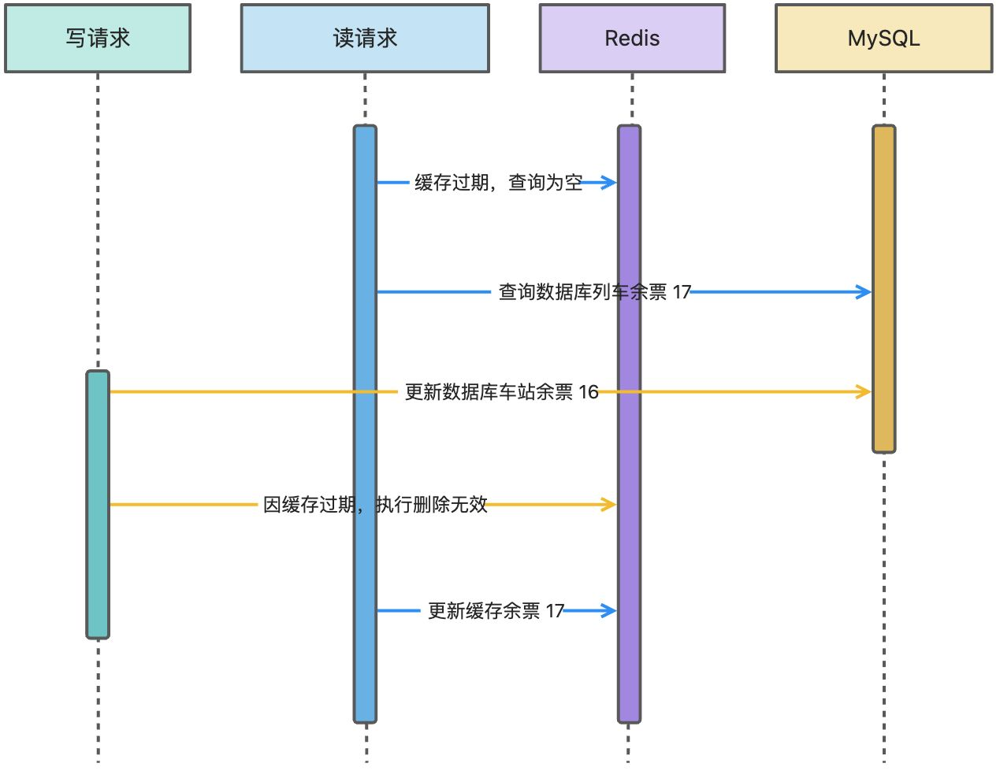

## 业务背景

为了满足用户对一趟列车不同站点不同座位类型的余量查询需求，我们采取了一种优化方案。我们将这些余量信息存储在缓存中，以便用户可以快速查询。

然而，在用户创建订单并完成支付时，我们需要同时从数据库和缓存中扣减相应的列车站点余票。这种设计不仅提高了查询效率，也保证了数据的一致性，确保订单操作的准确性。

在这个业务场景中的缓存与数据库一致性如何保证？结合大家常在用的以及网上一些方案，给出一些我的思考以及咱们 12306 中实际的解决方案。

注意，下文中都是以多请求并发场景下的思考。

## 技术方案

### 1. 先写缓存再写数据库

两个用户购买了车站余票，假设余票有 17 张，两个用户扣减完还剩 15 张票。

如图所示，多个请求并发写入缓存和数据库，写请求 A 先更新 Redis 余票为 16。此时，写请求 B 将余票缓存更新 Redis 为 15，紧接着执行数据库更新为 15。这个时候，写请求 A 继续执行更新数据库操作，余票数据更新为 16。

这样就导致了多请求并发场景下，执行结果和咱们预期的结果不相符。

### 2. 先写数据库再写缓存

同上所诉，参考对应的业务场景和多请求并发场景，不同的是前者先更新缓存，后者先更新的是数据库，相同的是都存在并发问题，导致结果与预期并不相符。

### 3. 先删除缓存再写数据库

假设有两个并发的读写操作，一个是写操作，另一个是读操作。

1. 并发读写的情况下，写操作首先删除缓存，接下来需要执行更新数据库操作。
2. 读操作发生，由于缓存已经被删除，读操作不得不从数据库中读取数据。然而，由于写操作尚未完成，数据库中的数据仍然是过时的。
3. 写操作这时需要更新数据库中的值，更新后 MySQL 数据库是最新的值。
4. 读操作将从数据库中查询到的过时数据再回写到缓存。

在这种情况下，读操作获取到的是过时的数据，尽管写操作已经完成。因为缓存被删除，读操作不得不从数据库中读取旧值，而不是最新的值。

### 4. 先删除缓存再写数据库，再删除缓存

看着名字虽然有点长，但是如果换个词大家估计就懂了：缓存双删技术方案。

如果说上图的读请求回写缓存在写请求第二次删除缓存之前，那这种技术方案是比较好的，而且也不用引入过多复杂的中间件。

问题就在于，第二次删除缓存，不一定在读请求回写缓存之后。所以我们需要保证第二次删除要在请求回写缓存之后。

假设读请求回写缓存大概需要 300ms，那我们是否可以在写请求第二次删除缓存前进行一个延迟操作，比如睡眠 500ms 后再删除？这样就可以规避读请求回写缓存在第二次删除之后了。

这种方案理论上是可以的，不过把这个睡眠操作使用延迟队列或者引入三方消息队列去做。

最新技术架构流程如下所示：

如果消息队列更新缓存失败了呢？其实这一点还好，凭借消息队列客户端消费的重试规则，如果更新失败次数都达到客户端重试阈值还是不行，那一定是数据或者缓存中间件有问题。

当然，如果重试次数多了，也必然会面临缓存与数据库不一致的时间变长了，这个是需要清楚的。

通过该技术方案，可以很好达到缓存与数据库最终一致性。

### 5. 先写数据库再删除缓存

读请求第一次查询时，会查询到一个错误的数据，因为写请求还没有更新到缓存，写请求写入 MySQL 成功后会删除缓存中的历史数据。后续读请求查询缓存没有值就会再请求数据库 MySQL 进行重新加载，并将正确的值放到缓存中。

也就是说这种模型会存在一个很小周期的缓存与数据库不一致的情况，不过对于绝大多数的情况来说，是可以容忍的。除去一些电商库存、列车余票等对数据比较敏感的情况，比较适合绝大多数业务场景。

当然，这种模型也不是完全没问题，如果说恰巧读缓存失效了，就会出现这种情况。

当缓存过期（可能是缓存正常过期也可能是 Redis 内存满了触发清理策略）条件满足，同时读请求的回写缓存 Redis 的执行周期在数据库删除之前，那么就有可能触发缓存数据库不一致问题。

上面说的两种情况，缺一不可，不过能同时满足这两种情况概率极低，低到可以忽略这种情况。

### 6. 先写数据库，通过 BinLog 异步更新缓存

这种方案是我认为最终一致性最为值得尝试以及使用的。但是有一句话说的是没有绝对合适的技术，只有相对适合的技术，这种方案实现是也存在一些技术问题，稍后会给大家详细说明。

如果是扣减库存的方案，比如说你将列车余票扣减为 16，但是同时又有一个请求将列车余票扣减为 15，这个时候，扣减为 15 的这个请求先到消息队列执行，将缓存更新为余票 15，但是随之而来的是第一个请求余票为 16，会将缓存余票为 15 给覆盖掉。

类似于这种逻辑，会存在一些数据一致性的问题，需要我们通过其它技术手段完善，比如数据库添加版本号，或者根据最后修改时间等技术规避这些问题。

另外，如果在写入数据库余票 16 前，同时有个查询请求，也会存在数据库不一致问题。比如在写入数据库余票 16 前，将数据库余票 17 获取到，然后等消息队列更新到缓存余票 16 后，再将数据库余票 17 更新到缓存。

这种出问题的概率比较小，因为跨的周期太长了。也是类似于存在一个很小周期的数据不一致性。

## 技术方案总结

### 1. 使用推荐

以下这三种在实际工作中不建议使用，存在比较大的数据不一致隐患：

- [先写缓存再写数据库](https://www.yuque.com/magestack/12306/glv5e0785b2d7oag#CNJZx)
- [先写数据库再写缓存](https://www.yuque.com/magestack/12306/glv5e0785b2d7oag#ZlUyo)
- [先删除缓存再写数据库](https://www.yuque.com/magestack/12306/glv5e0785b2d7oag#QhBNG)

可以根据业务场景选择下述缓存一致性方案：

- [缓存双删](https://www.yuque.com/magestack/12306/glv5e0785b2d7oag#NZlgQ)：如果公司现有消息队列中间件，可以考虑使用该方案，反之则不需要考虑。
- [先写数据库再删缓存](https://www.yuque.com/magestack/12306/glv5e0785b2d7oag#w4hgF)：这种方案从实时性以及技术实现复杂度来说都比较不错，推荐大家使用这种方案。
- [Binlog 异步更新缓存](https://www.yuque.com/magestack/12306/glv5e0785b2d7oag#shlMA)：如果希望实现最终一致性以及数据多中心模式，该方案无疑是最合适的。

### 2. 缓存删除和 Binlog 异步处理有坑

详细内容请查看下述知识星球主题。

https://articles.zsxq.com/id_4qznwlbkzx96.html

## 文末总结

总结一下关于缓存与数据库一致性的方案：如果你想要最终一致性可以使用 [Binlog 异步更新缓存](https://www.yuque.com/magestack/12306/glv5e0785b2d7oag#shlMA)方案，如果缓存实时性要求比较高，使用[先写数据库再删缓存](https://www.yuque.com/magestack/12306/glv5e0785b2d7oag#w4hgF)方案。

真实场景中根据具体业务需求和系统架构，可以选择适合的方案或组合多种方案。这些方案最终目的是在解决缓存与数据库之间的一致性问题，以确保数据的正确性和可靠性。