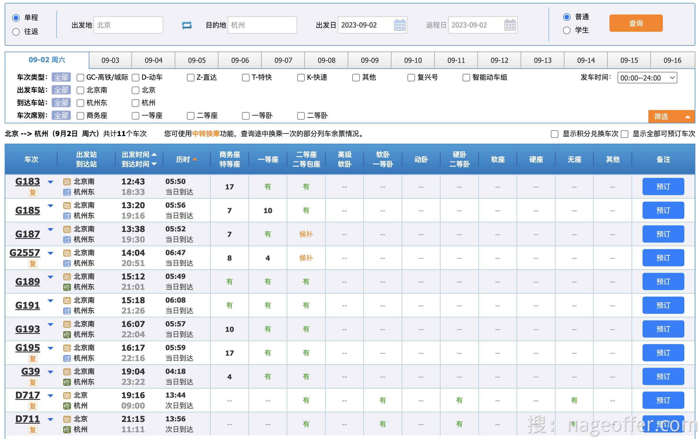
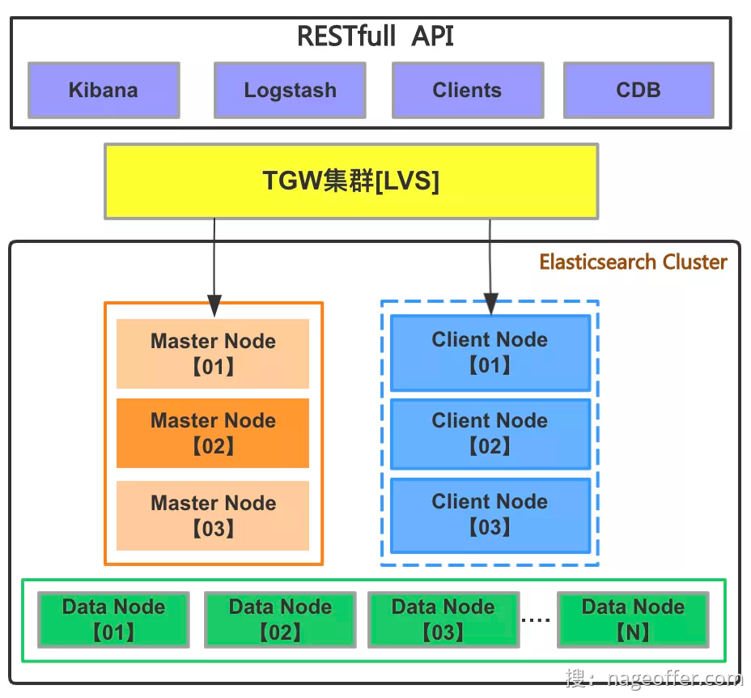
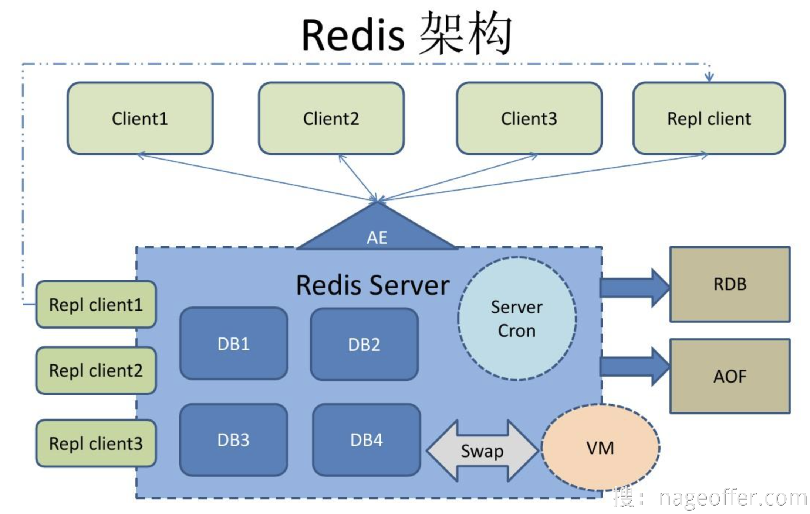

在文章正式开始前，大家打开 [12306.cn](12306.cn) 搜索一趟列车，根据搜索条件判断，数据搜索技术使用 ElasticSearch 或者其它搜索技术是否合适？

这里我先把答案说下，12306 车票搜索用的是 Redis ，而不是大家常用的 ElasticSearch。至于为什么？大家可以先思考下再继续阅读。

## 12306 列车搜索条件

先来一张 12306 列车检索的截图，让大家看下 12306 都有哪些搜索条件。

搜索条件如下：

- 单程或者往返
- 出发地
- 目的地
- 出发日或者返程日
- 普通或者学生
- 车次类型
- 出发车站
- 到达车站
- 车次席别
- 发车时间
- 显示积分兑换车次
- 显示全部可预订车次

许多同学都感到疑惑，因为搜索条件实在太多了，这似乎会严重影响数据库的性能。有些人甚至认为，如果性能不佳，至少应该使用 Elasticsearch 等搜索引擎来处理。这也是我一开始的想法，与大多数同学一致。

然而，随着进一步的思考，我发现了一个有意思的页面交互，这改变了我的看法。跟着马哥的思路，一起来深入探讨一下。

## 数据搜索框架

### 1. 搜索中间件 ElasticSearch

ElasticSearch 是一款非常强大的、基于 Lucene 的开源搜索及分析引擎；它是一个实时的分布式搜索分析引擎，它能让你以前所未有的速度和规模，去探索你的数据。

许多年前，一个刚结婚的名叫 Shay Banon 的失业开发者，跟着他的妻子去了伦敦，他的妻子在那里学习厨师。 在寻找一个赚钱的工作的时候，为了给他的妻子做一个食谱搜索引擎，他开始使用 Lucene 的一个早期版本。

直接使用 Lucene 是很难的，因此 Shay 开始做一个抽象层，Java 开发者使用它可以很简单的给他们的程序添加搜索功能。 他发布了他的第一个开源项目 Compass。

后来 Shay 获得了一份工作，主要是高性能，分布式环境下的内存数据网格。这个对于高性能，实时，分布式搜索引擎的需求尤为突出， 他决定重写 Compass，把它变为一个独立的服务并取名 Elasticsearch。

第一个公开版本在2010年2月发布，从此以后，Elasticsearch 已经成为了 Github 上最活跃的项目之一，他拥有超过 300 名 contributors。 一家公司已经开始围绕 Elasticsearch 提供商业服务，并开发新的特性，但是，Elasticsearch 将永远开源并对所有人可用。

据说，Shay 的妻子还在等着她的食谱搜索引擎…

Elasticsearch 提供了一个强大而灵活的搜索和分析引擎，适用于各种应用场景，包括日志分析、电子商务搜索、实时监控等。它具有高性能、可扩展性和可用性，能够处理大规模数据，并提供丰富的搜索、分析和可视化功能，帮助用户从数据中获取有价值的信息。

根据大家对 Elasticsearch 的了解，以及对 12306 复杂搜索条件的背景，肯定是 Elasticsearch 更适合实现改数据检索的功能。不急，咱们继续往下看。

### 2. 缓存中间件 Redis

Redis（Remote Dictionary Server）是一个开源的内存数据结构存储系统，被广泛应用于缓存、消息队列、实时数据分析、排行榜等场景。它提供了以下主要功能：

1. 内存缓存：Redis 将数据存储在内存中，以实现高速的读写操作。作为缓存系统，它可以显著提升应用程序的性能，减少对后端存储系统的访问压力。
2. 键值存储：Redis 是一个键值存储系统，其中的数据是以键值对的形式进行存储和访问。这使得 Redis 非常适合存储简单的数据结构，如字符串、哈希表、列表、集合和有序集合。
3. 发布/订阅：Redis 支持发布/订阅模式，允许多个客户端通过订阅频道来接收消息，同时可以通过发布消息来向订阅者广播消息。这使得 Redis 可以用作消息队列、实时通知等场景。
4. 数据持久化：Redis支持将内存中的数据持久化到硬盘中，以便在重启后恢复数据。它提供了两种持久化方式：RDB（Redis Database）快照和 AOF（Append-Only File）日志。
5. 分布式：Redis 提供了一些分布式特性，如主从复制、集群等。主从复制可以实现数据的热备份和读写分离，在主节点写入数据后，数据会自动同步到从节点。集群模式可以将数据分布在多个节点上，提供更高的容量和吞吐量。
6. 事务支持：Redis 支持事务操作，可以将一系列操作组合成一个原子操作进行提交。通过事务，可以确保多个操作在执行过程中不会被其他客户端中断。
7. Lua 脚本：Redis 支持使用 Lua 脚本执行复杂的操作。通过编写脚本，可以减少与 Redis 之间的网络通信次数，提高性能。

大家对 Redis 熟知的一些概念就是 Redis 非常快，那快是如何体现以及原理是什么？

1. 数据存储在内存中： Redis 将数据存储在内存中，这使得数据的读取和写入非常快。内存的随机访问速度远远快于磁盘上的存储，因此 Redis 能够在极短的时间内响应读写请求。
2. 单线程模型： Redis 采用单线程模型，这意味着在任何给定时刻只有一个线程处理请求。尽管它是单线程的，但通过使用非阻塞I/O和事件循环，它能够处理大量并发请求而不需要消耗大量的 CPU 开销。这减少了上下文切换和锁竞争，提高了性能。
3. 精心优化的数据结构： Redis 支持多种数据结构，如字符串、哈希表、列表、集合、有序集合等，每种数据结构都经过高度优化，以提供高性能的操作。例如，Redis的有序集合允许你快速进行范围查询和排名操作。
4. 高度优化的网络协议： Redis 使用高度优化的协议进行与客户端的通信，如 RESP（REdis Serialization Protocol）。这个协议非常轻量，减少了网络通信的开销，从而提高了性能。

## 为什么使用 Redis

考虑使用 Redis 和 Elasticsearch 两个技术都是有一定道理的，它们分别有自己的优势和适用场景。

作为承受请求最多的列车搜索功能，需要同时兼容实时性、并发性以及部署成本几大要点。为此，我梳理了为什么必须用 Redis 的几个原因。

### 1. 实时性能

- 内存存储： Redis 将数据存储在内存中，因此具有极低的读取延迟，可以快速响应实时查询请求。这对于需要即时更新的列车数据非常重要。
- 单线程模型： Redis 使用单线程模型，虽然是单线程的，但通过非阻塞 I/O 和事件循环，它可以处理大量并发请求，减少了上下文切换和锁竞争，提高了实时性。

### 2. 并发性能

- 多客户端支持： Redis 支持多个客户端并发连接，每个客户端可以独立地执行读取和写入操作，这使得它在处理高并发请求时表现出色。
- 原子性操作： Redis 提供了原子性操作，如原子增减和原子加锁，这些操作可以在多线程或多进程环境下安全使用，有助于处理并发操作。

### 3. 部署成本

- 轻量级： Redis 是一款轻量级的数据库，易于部署和维护。它的内存占用相对较低，可以在相对较小的硬件配置上运行，从而减少了部署成本。
- 容易扩展： Redis 集群模式允许你将数据分布在多个节点上，以增加吞吐量和可伸缩性，而且这一扩展性是相对容易实现的。

公司实际用过 ElasticSearch 集群的同学应该知道，这玩意就是个性能深渊，非常消耗资源，懂得都懂。

### 4. 搜索条件拆解

到这里，许多人可能会有疑问，面对如此多的搜索条件，难道不应该使用 Elasticsearch 吗？然而，这正是要强调为什么选择 Redis 的关键原因。

您是否注意到了这张图的一个关键点？它只允许选择一天的出发日期。深思熟虑一下。

如果只能选择一天，那我们是不是可以这么来设计 Redis 缓存存储 12306 列车查询数据。

也许有些人会问，这么多的查询条件怎么处理呢？你可以亲自在12306网站上尝试，虽然页面上有很多查询条件，但大多数条件都是由前端进行筛选，实际上并没有触发后端的请求。

如果你不相信的话，可以观看下面的视频，你会发现只有在点击“查询”按钮时才会真正触发后端的请求，而点击页面上的其他筛选条件并不会向后端发出请求。

此处为语雀视频卡片，点击链接查看：[12306列车查询请求示意.mov](https://www.yuque.com/magestack/12306/zd9wok8w0dn8eig5#q0g23)

## 文末总结

12306列车数据搜索具有多个搜索条件，包括单程/往返、出发地、目的地、出发日期/返程日期、乘客类型、车次类型、出发车站、到达车站、车次席别、发车时间、显示积分兑换车次以及显示全部可预订车次等。这些条件使搜索功能变得复杂，但在实际使用中，大部分条件是前端筛选，而不是每个条件都会发起后端请求。

在这种情况下，Redis作为列车数据的缓存存储是有道理的，原因如下：

1. 实时性： Redis 以内存为基础，具有极低的读取延迟，可以快速响应实时查询请求，这对于需要即时更新的列车数据非常重要。单程或往返、出发日期等条件可以通过快速的 Redis 查询来满足。
2. 缓存： Redis 是一个出色的缓存数据库，可以用于缓存热门的列车路线和查询结果，从而减轻后端数据库的负载。对于需要被查询的路线，可以将其结果缓存在 Redis 中，以提高响应速度。
3. 简单性： Redis 的数据模型相对简单，适合存储简单的键值对或一些常规数据结构。这使得 Redis 适合存储一些搜索条件，如出发地、目的地、车次类型等，以便快速筛选结果。
4. 部署成本： Redis 是一款轻量级的数据库，易于部署和维护。它的内存占用相对较低，可以在相对较小的硬件配置上运行，从而减少了部署成本。
5. 只需后端查询一次： 在实际操作中，页面上的搜索条件大多是前端筛选，而只有在点击查询按钮时才会发起后端请求。因此，Redis 可以用于快速存储和检索列车数据，而 Elasticsearch 等搜索引擎可以在需要进行全文搜索或复杂查询时使用。

总的来说，Redis 作为列车数据的缓存存储在实时性、并发性和部署成本方面具有一些优势，尤其适用于快速检索和缓存常用路线数据。然而，对于复杂的全文搜索和高级查询需求，可以考虑将 Redis 与 Elasticsearch 等搜索引擎结合使用，以充分发挥它们各自的优势。

