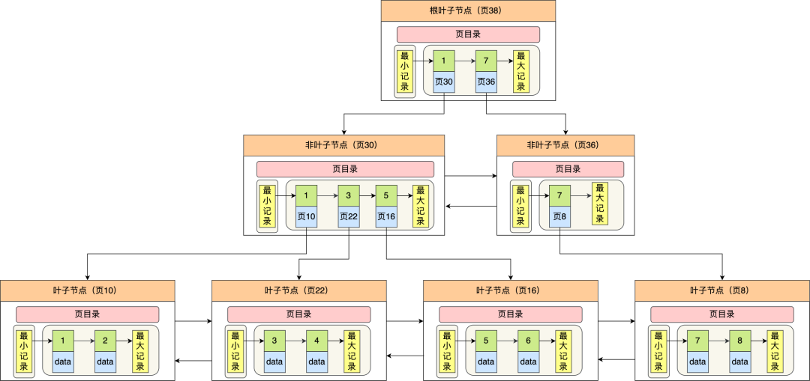

# MySQL

## 基础

### 1. MyISAM和InnoDB的对比

| 特性           | InnoDB                                                       | MyISAM                                                       |
| -------------- | ------------------------------------------------------------ | ------------------------------------------------------------ |
| 事务支持       | 支持（使用写前日志技术）                                     | 不支持                                                       |
| 锁机制         | 支持行级锁和表级锁（默认使用行级锁）                         | 只支持表级锁                                                 |
| 外键约束支持   | 支持                                                         | 不支持                                                       |
| 数据存储和索引 | 使用聚簇索引，数据和主键索引存储在一起，支持全文索引和哈希索引 | 数据和索引分开存储，支持全文索引，不支持哈希索引             |
| 数据恢复和备份 | 支持更强的数据恢复功能，支持在线备份                         | 数据恢复能力较弱，依赖于物理备份和恢复                       |
| 性能           | 在大量读写操作和高并发环境下表现更好                         | 在处理只读查询时可能更快，但在写操作频繁的场景下性能可能下降 |
| 存储空间       | 较大，需要额外空间存储事务日志等，数据文件大小动态增长       | 相对较小，数据文件大小固定，不支持数据压缩功能               |

> MyISAM和InnoDB是MySQL中两种常见的存储引擎，它们在多个方面存在显著的区别。以下是对两者的比较：
>
> 1. 事务支持： InnoDB支持事务，具有提交、回滚和崩溃恢复能力，可以保护用户数据。它使用了一种称为“写前日志”（write-ahead logging，WAL）的技术，**先写日志，再写数据，保证了事务的完整性。** MyISAM不支持事务，这意味着在MyISAM中进行的更改无法回滚，且如果发生崩溃，数据可能会损坏。
> 2. 锁机制： **InnoDB支持行级锁和表级锁，但默认使用行级锁。**行级锁可以提高并发性能，因为它只锁定被访问的行，而不是整个表。 **MyISAM只支持表级锁**，这意味着当一个线程正在对一个表进行写操作时，其他线程无法对该表进行读或写操作。这可能会降低并发性能。
> 3. 外键支持： **InnoDB支持外键约束**，这有助于维护数据的引用完整性和一致性。 MyISAM不支持外键约束。
> 4. 数据存储和索引： InnoDB使用聚簇索引来组织数据，表数据和主键索引存储在一起。此外，InnoDB还支持全文索引和哈希索引。 MyISAM将数据和索引分开存储，数据文件（MYD）和索引文件（MYI）是分离的。MyISAM也支持全文索引，但不支持哈希索引。
> 5. 数据恢复和备份： InnoDB提供了更好的数据恢复功能，如通过binlog进行点时间恢复（PITR）。此外，InnoDB还支持在线备份功能。 MyISAM的数据恢复相对较弱，通常依赖于物理备份和恢复。
> 6. 性能： InnoDB在处理大量读写操作时通常表现更好，特别是在高并发环境下。这得益于其行级锁和事务支持。 MyISAM在处理只读查询时可能更快，特别是当数据量很大且内存充足时。然而，在写操作频繁的场景下，MyISAM的性能可能会下降。
> 7. 存储空间： InnoDB的存储空间通常比MyISAM大，因为它需要额外的空间来存储事务日志、行级锁等信息。此外，InnoDB的数据文件大小是动态增长的。 MyISAM的存储空间相对较小，数据文件大小是固定的（可以通过配置修改）。但是，MyISAM不支持数据压缩功能。


### 2. MySQL如何去除重复

DISTINCT和GROUP BY都用于对查询结果进行去重，但它们的用法和性能略有不同。

- DISTINCT用于返回唯一的值，它会在整个结果集中去除重复行。
- GROUP BY用于将结果按照指定的列进行分组，并且可以使用聚合函数对每个组进行计算（如COUNT、SUM等）。

在性能方面，通常来说使用DISTINCT比使用GROUP BY性能更好，因为DISTINCT只需要找出并返回唯一的值，而GROUP BY需要进行分组操作和聚合计算，消耗的资源更多。所以如果只是简单地去重，推荐使用DISTINCT；如果需要进行分组计算或者聚合操作，就需要使用GROUP BY。

### 3.三个范式

首先是第一范式1NF，要**确保数据库表字段的原子性。**比如字段 userlnfo： 广东省 10086，依照第一范式必须拆分成，userinfo：广东省和userTel（号码）：10086两个字段

然后是第二范式2NF，首先要满足第一范式，另外包含两部分内容，**一是表必须有一个主键**，**二是非主键列必须完全依赖于主建，而不能只依赖于主键的一部分。**假定选课关系表为student course 表有6个字段，分别是student no, student_ name, age， course name, grade, credit，主键为（student no， course name）。其中学分完全依赖于课程名称， 姓名年龄完全依赖学号，不符合第二范式，会导致数据冗余（**学生选n门门课，姓名年龄有n条记录**）、**插入异常（插入一门新课，因为没有学号**，无法保存新课记录）等问题。应该拆分成三个表：学生：student （stuent_no， student_ name， 年龄）课程：'course （course name， credit）选课关系：`'student_ course_ relation （stude nt no, course name， grade）`。

最后是第三范式3NF，首先要满足第二范式，另外**非主键列必须直接依赖于主键，不能存在传递依赖。**即不能存在：非主键列 A 依赖于非主键列 B，非主键列B依赖于主键的情况。假定学生关系表为student表有5个字段，分别为student no, student_ name, age， academy_ id （学院id）academy_ telephone，主键为学号student no，其中学院id依赖于学号，而学院地点和学院电话依赖于学院id，存在传递依赖，不符合第三范式。可以把学生关系表分为如下两个表：学生：（studentno，student name, age，academy_id）学院：（academy_id， academy telephone）。

> 2NF依据是非主键列是否完全依赖于主键，还是依赖于主键的一部分。
>
> 3NF依据是非主键列是直接依赖手主键，还是直接依赖于非主键。


### 窗口排序函数

`RANK`函数

计算排序时，如果存在相同位次的记录，则会跳过之后的位次有了条记录排在第1位时：1位、1位、1位、4位.

`DENSE_RANK`函数

同样是计算排序，即使存在相同位次的记录，也不会跳过之后的位次有了条记录排在第1位时：1位、1位、1位、2位

`ROW_NUMBER`函数赋予唯一的连续位次。

例有3条记录排在第1位时：1位、2位、3位、4位

```sql
<窗口函数>OVER ([PARTITION BY＜列清单>] ORDER BY<排序用列清单>）
```

如果不用PARTITION就是直接就会不分类，不根据科目排了，直接根据分数顺序排。


## 索引

### 1.如何优化查询速度？

>  创建适当的索引，优化查询语句，避免全局扫描，缓存查询结果，提升硬件，数据归档和分离，数据库分片。

**创建适当的索引**

通过创建适当的索引，可以加速查询操作。索引可以提高查询语句的执行效率，尤其是对于常用的查询条件和排序字段进行索引，可以显著减少查询的扫描范围和 IO 开销。

**优化查询语句**

优化查询语句本身，避免全表扫描和大数据量的关联查询。可以优化查询条件，使用合适的索引、合理的查询策略，减少不必要的字段和数据返回。

**缓存查询结果**

对于一些相对稳定的查询结果，可以将其缓存在内存中，避免重复查询数据库，提高查询速度。

缓存的查询速度一定比直接查询数据库的效率高，这是因为缓存具备以下特征：

1. 内存访问速度快：缓存通常将数据存储在内存中，而数据库将数据存储在磁盘上。相比于磁盘访问，内存访问速度更快，可以达到纳秒级别的读取速度，远远快于数据库的毫秒级别的读取速度。
2. IO 操作次数少：数据库通常需要进行磁盘 IO 操作，包括读取和写入磁盘数据。而缓存将数据存储在内存中，避免了磁盘 IO 的开销。内存访问不需要进行磁盘寻址和机械运动，相对来说速度更快。
3. 特殊的数据结构：缓存的数据结构通常为 key-value 形式的，也就是说缓存可以做到任何数据量级下的查询数据复杂度为 O(1)，所以它的查询效率是非常高的；而数据库采用的是传统数据结构设计，可能需要查询二叉树、或全文搜索、或回表查询等操作，所以其查询性能是远低于缓存系统的。

**提升硬件配置**

对于大数据量的表，可以考虑采用更高性能的硬件设备，如更快的存储介质（如固态硬盘），更大的内存容量等，以提升查询的 IO 性能。

**数据归档和分离**

对于历史数据或不经常访问的数据，可以进行归档和分离，将这些数据从主表中独立出来，减少主表的数据量，提高查询速度。

**数据库分片**

当单个数据库无法满足查询性能需求时，可以考虑使用数据库分片技术，将数据分散到多个数据库中，每个数据库只处理部分数据，从而提高查询的并发度和整体性能。

数据库分片技术的具体实现是分库分表。

### 2. 数据库四大特性和四大隔离级别

MySQL 事务具备 ACID 四大特性，如下所述：

1. **原子性（Atomicity）**：事务中的所有操作要么全部执行成功，要么全部失败回滚，不能只执行其中一部分操作。
2. **一致性（Consistency）**：事务执行前后，数据库的完整性约束没有被破坏，数据总是从一个一致性状态转移到另一个一致性状态。
3. **隔离性（Isolation）**：事务之间是相互隔离的，每个事务对其他事务的操作是透明的，一个事务的中间结果对其他事务是不可见的。
4. **持久性（Durability）**：事务完成后，对数据库的修改将永久保存在数据库中，即使系统故障也不会丢失。

其中，隔离性是实现事务的重要特征之一。

MySQL 中提供了四种事务隔离级别：

1. 读未提交（Read Uncommitted）
2. 读已提交（Read Committed）
3. 可重复读（Repeatable Read）
4. 串行化（Serializable）

不同的事务隔离解决可以解决不同的问题，如下图所示：


### 3. 事务的实现原理

原子性：Atom 事务要么全部成功，要不全部失败，通过重做日志来实现

一致性：Consistency 数据完整性在事物执行前后都没有变化，一致性状态，通过回滚日志实现

隔离性：Isolation 事务对其他事务是隔离的，通过锁实现

持久性：Durability 数据库修改是永久保存的，重做日志实现

---

redo log（重做日志） 实现 原子性、持久性

事务提交之后，先将事务写入redo log日志，后续再将 Buffer Pool 中修改数据慢慢写入到磁盘。

此时如果数据库崩溃或者宕机，Buffer Pool 中的数据丢失，可能有部分已修改数据未能同步到磁盘。

那么，当系统重启进行恢复时，就可以根据redo log中记录的日志，把数据库恢复到崩溃前的一个状态。


undo log（回滚日志）实现 一致性

undo log记录了数据在操作前的状态，如果事务执行过程中需要回滚，就可以根据undo log进行回滚操作。单个事务的回滚，只会回滚当前事务做的操作，并不会影响到其他的事务做的操作。


以一个update语句执行为例：

```xml
Innodb引擎在收到一个update语句后，会先根据条件找到数据所在的页，并将该页缓存在 BufferPool 中（也就是内存中）。
执行update语句，修改 BufferPool 中的数据。
针对update语句生成一个 RedoLog 对象，并存入 LoggerBuffer 中。
针对update语句生成 UndoLog 日志，用于事务回滚。
如果提交事务，那么久将 RedoLog 对象进行持久化，后续还有其他机制将 BufferPool 中修改的数据页持久化到磁盘。
如果事务回滚，那么则利用 UndoLog 日志进行数据恢复。
```

### 4. 索引的数据结构，B+树🌲为什么查询快？

> - 

MySQL 默认的存储引擎 InnoDB 采用的是 B+ 作为索引的数据结构，原因有：

1.**B+ 树的非叶子节点不存放实际的记录数据，仅存放索引**，因此数据量相同的情况下，相比存储即存索引又存记录的 B 树，B+树的非叶子节点可以存放更多的索引，因此 B+ 树可以比 B 树更「矮胖」，**查询底层节点的磁盘 I/O次数会更少。**（为什么不选二叉树也有类似原因)

2.**B+ 树有大量的冗余节点（所有非叶子节点都是冗余索引）**，这些冗余索引让 B+ 树在插入、删除的效率都更高，比如删除根节点的时候，不会像 B 树那样会发生**复杂的树的变化**；

3.**B+ 树叶子节点之间用链表连接了起来，有利于范围查询**，而 **B 树要实现范围查询，因此只能通过树的遍历**来完成范围查询，这会涉及多个节点的磁盘 I/O 操作，范围查询效率不如 B+ 树。

> 

### 5. InnoDB和MyISAM的B+树的区别

虽然，InnoDB 和 MyISAM 都支持 B+ 树索引，但是它们数据的存储结构实现方式不同。不同之处在于：

- InnoDB 存储引擎：B+ 树索引的**叶子节点保存数据本身**；

  

- MyISAM 存储引擎：B+ 树索引的**叶子节点保存数据的物理地址**；

  

### 5. 聚簇索引和非聚簇索引对比

**聚簇索引和非聚簇索引的比较**

**查询性能**：聚簇索引通常对范围查询更为高效，因为它将数据按照索引键值的顺序存储。然而，非聚簇索引可能在某些情况下提供更好的性能，特别是当索引覆盖查询所需的所有列时（即覆盖索引）。

**更新开销**：当数据行的键值（即聚簇索引的键值）发生变化时，聚簇索引可能需要重新组织数据的存储顺序，这可能会导致更大的更新开销。而非聚簇索引只需要更新索引条目。

### 6. 最左前缀匹配原则,索引下推是什么？

**最左匹配原则**

**当MySQL使用联合索引进行查询**时，会从**索引的最左边开始匹配查询条件**，如果查询条件中包含了索引左边的列，那么MySQL才可能会使用这个索引来优化查询。如果查询条件没有包含左边的列或者左边的列出现一些范围查询（>、<、between等），即使其他列都在索引中，MySQL也可能不会使用这个索引。

> ```SQL
> -- 基于上面的哪个（X、Y、Z）联合索引
> 
> //不符合最左前缀原则，最左侧的X字段未曾被使用
> SELECT * FROM tb WHERE Y = "..." AND Z = "..."; 
> 
> // X出现范围查询，不能被使用
> SELECT * FROM tb WHERE X > 10 AND Y = "..." AND Z = "..."; 
> ```

**索引下推是什么？**

直译：也就是将Server层筛选数据的工作，下推到引擎层处理。

解释：在**没有索引下推的情况下**，MySQL会先从索引中获取所有可能满足条件的数据行的主键，然**后根据这些主键检索完整的数据行(即回表)，**最后再应用WHERE条件进行过滤。而**有了索引下推**，MySQL可以在扫描索引的同时，**直接根据索引中的值来判断是否满足WHERE条件**，从而避免不必要的回表操作。

### 7.什么场景下我们使用Mysql，什么情况下我们用Redis？

> **使用MySQL的场景**：
>
> 1. 关系型数据存储：MySQL是一个关系型数据库管理系统（RDBMS），非常适合存储和查询结构化数据，即数据之间存在明确关系的数据。例如，电商网站中的用户信息、订单信息、商品信息等。
> 2. 事务处理：MySQL支持ACID事务特性，这意味着它可以保证一系列操作的原子性、一致性、隔离性和持久性。对于需要确保数据完整性和一致性的应用，如银行转账、订单处理等，MySQL是理想的选择。
> 3. 复杂查询：MySQL支持SQL（结构化查询语言），可以进行复杂的查询操作，如连接、聚合、排序等。对于需要进行大量数据处理和分析的应用，MySQL非常适用。
>
> **使用Redis的场景**：
>
> 1. 缓存：Redis是一个高性能的内存数据库，通常用作缓存层，以减少对后端数据库的访问。对于读多写少、数据实时性要求较高的应用，如新闻网站、社交媒体等，使用Redis作为缓存可以显著提高性能和用户体验。
> 2. 实时数据处理：Redis支持多种数据结构（如字符串、哈希、列表、集合和有序集合等），并且提供了丰富的操作命令。这使得Redis非常适合处理实时数据流，如实时排行榜、实时统计等。
> 3. 消息队列：Redis提供了发布/订阅功能和阻塞队列等特性，可以用作消息中间件来实现异步通信和分布式系统之间的解耦。
> 4. 高并发场景：由于Redis基于内存存储且采用单线程模型（实际上是通过IO多路复用来处理并发请求），它在高并发场景下表现优异。对于需要快速响应大量并发请求的应用，如秒杀系统、实时推荐系统等，Redis是一个很好的选择。

> **Redis快，那Mysql不是也有索引吗，为什么要用redis?**
>
> 确实，MySQL也有索引，它可以提高查询速度。但是，Redis和MySQL在数据存储和查询机制上有一些根本的区别，使得在某些场景下Redis表现得更快。
>
> - `内存/磁盘`：Redis是基于内存存储的，而MySQL主要是基于磁盘存储。内存访问速度比磁盘访问速度要快得多，因此Redis在读取数据时通常会比MySQL更快。
> - `数据结构`:Redis存储的是k-v格式的数据，部分数据结构时间复杂度是O(1)，即常数阶，而MySQL引擎的底层实现通常是B+Tree，时间复杂度是O(logn)，即对数阶。这意味着在大多数情况下，Redis查找数据的速度会比MySQL更快。

### 8. 索引失效

1左模糊匹配的时候，2对索引列使用函数的时候，3对索引进行表达式计算的时候，4如果索引是字符串，输入的是数字，那么就会进行隐形类型转换，相当于使用了函数，会失效。5联合索引没有最左匹配的时候。6OR前和后都需要是索引列，不然会失效

- 当我们使用**左或者左右模糊匹配**的时候，也就是 `like %xx` 或者 `like %xx%`这两种方式都会造成索引失效；
- 当我们在查询条件中**对索引列使用函数**，就会导致索引失效。
- 当我们在查询条件中对索引列进行表达式计算，也是无法走索引的。
- MySQL 在遇到字符串和数字比较的时候，会自动把字符串转为数字，然后再进行比较。如果字符串是索引列，而条件语句中的输入参数是数字的话，那么索引列会发生隐式类型转换，由于隐式类型转换是通过 CAST 函数实现的，等同于对索引列使用了函数，所以就会导致索引失效。

  > 但是如果索引字段是整型类型，查询条件中的输入参数即使字符串，是不会导致索引失效，还是可以走索引扫描

- 联合索引要能正确使用需要遵循最左匹配原则，也就是按照最左优先的方式进行索引的匹配，否则就会导致索引失效。
- 在 WHERE 子句中，如果在 OR 前的条件列是索引列，而在 OR 后的条件列不是索引列，那么索引会失效。

> 具体参照：https://www.xiaolincoding.com/mysql/index/index_lose.html

### 9. 回表和覆盖索引的区别

在我们使用**「二级索引」**字段作为条件查询的时候，如果要查询的数据都在**「聚簇索引」**的叶子节点里，那么需要检索两颗B+树：

- 先在「二级索引」的 B+ 树找到对应的叶子节点，获取主键值；
- 然后用上一步获取的主键值，在「聚簇索引」中的 B+ 树检索到对应的叶子节点，然后获取要查询的数据。

上面这个过程叫做**回表**，如下面这条语句：

```SQL
// name 字段为二级索引
select * from t_user where name="林某";
```

在我们使用**「二级索引」**字段作为条件查询的时候，如果要查询的数据在**「二级索引」**的叶子节点，那么只需要在「二级索引」的 B+ 树找到对应的叶子节点，然后读取要查询的数据，这个过程叫做**覆盖索引**。如下面这条语句：

```SQL
// name 字段为二级索引
select id from t_user where name="林某";
```

## 锁机制

### 1. 数据库中的锁

**基于锁的属性分类：**

 1.**共享锁**（Share Lock，S锁）：当一个事务为数据加上读锁之后，其他事务只能对该数据加读锁，而不能对数据加写锁，直到所有的读锁释放之后其他事务才能对其进行加持写锁。共享锁主要用于支持并发的读取数据，读取数据的时候不支持修改，避免出现重复读的问题。

 2.**排他锁**（Exclusive Lock，X锁）：当一个事务为数据加上写锁时，其他请求将不能再为数据加任何锁，直到该锁释放之后，其他事务才能对数据进行加锁。排他锁避免了出现脏数据和脏读的问题。

**基于锁的粒度分类：**

 1.**行级锁**（InnoDB）：对数据库表中的某一行或多行记录进行加锁，使得其他事务在当前事务释放锁之前无法修改这些记录。 2.**表级锁**（InnoDB、MyISAM）：对整个数据库表进行加锁，使得其他事务在当前事务释放锁之前无法对该表进行访问或修改。表级锁包括表共享读锁和表独占写锁。 3.**页级锁**（InnoDB、BDB引擎）：是一种介于行级锁和表级锁之间的锁，它锁定的是数据页而不是整个表或单个行。页级锁在某些情况下可以减少锁的竞争，提高并发性能。 4.**记录锁**：行级锁的一种，单条记录上加的锁。 5.**间隙锁**（InnoDB）：在索引记录之间的间隙上加的锁，主要用于防止两个事务同时向一个范围内插入新的记录，产生幻读的情况。 6.**临键锁**（Next-Key Locks）：是InnoDB的行级锁和间隙锁的结合，即除了锁住记录本身，还要再锁住索引记录前面的间隙。

**基于锁的状态分类：**

 1.意向共享锁（Intention Shared Lock）：事务有意向对表中的某些行加共享锁。 2.意向排他锁（Intention Exclusive Lock）：事务有意向对表中的某些行加排他锁。

**全局锁**： 对整个数据库进行加锁，阻止其他用户对该数据库的访问和修改。例如，当需要让整个数据库进行备份时，可以使用全局锁。但全局锁会严重影响并发性能，应谨慎使用。

### 2. MySQL 如何解决幻读的问题,InnoDB默认是用可重复读，那发生幻读怎么办？

幻读是指在同一个事务中多次执行相同的查询，但由于其他事务的插入操作，导致结果集不一致的现象。**InnoDB引擎通过多版本并发控制（MVCC）和间隙锁（Gap Locks）**来解决幻读问题。在可重复读隔离级别下，InnoDB使用MVCC来保持事务内数据的一致性视图。同时，InnoDB的间隙锁可以防止其他事务在已锁定范围的间隙中插入新的数据，从而确保在事务范围内不会出现新的、未被锁定的行，这样就解决了幻读问题。

### 3. MVCC 多版本并发控制

1.版本链：

多个事务并行操作某一行数据时，不同事务对该行数据的修改会产生多个版本，然后通过回滚指针（roll_pointer），连成一个链表，这个链表就称为**版本链**。如下：


2.快照读和当前读

**快照读**： 读取的是记录数据的可见版本（有旧的版本）。不加锁,普通的select语句都是快照读,如：

```sql
select * from user where id = 1;
```

**当前读**：读取的是记录数据的最新版本，显式加锁的都是当前读

```sql
select * from user where id = 1 for update;
select * from user where id = 1 lock in share mode;
```

3.ReadView

ReadView是如何保证可见性判断的呢？我们先看看 ReadView 的几个重要属性

- **trx_ids**: 当前系统中那些活跃(未提交)的读写事务ID, 它数据结构为一个List。(`重点注意`:这里的trx_ids中的活跃事务，**不包括当前事务自己**和已提交的事务，这点非常重要)
- **low_limit_id**: 目前出现过的最大的事务ID+1，即下一个将被分配的事务ID。
- **up_limit_id**: 活跃事务列表trx_ids中最小的事务ID，如果trx_ids为空，则up_limit_id 为 low_limit_id。
- **creator_trx_id**: 表示生成该 ReadView 的事务的 事务id

不同的事务隔离级别就会有ReadView

这里是读已提交的隔离级别：生成了两个ReadView


> 参考：https://www.bilibili.com/video/BV1hL411479T/

如果是可重复读的隔离级别就是复用了ReadView


连续多次快照读，ReadView会产生复用，没有幻读问题

特例：当两次快照读之间存在当前读，ReadView会重新生成，导致产生幻读


