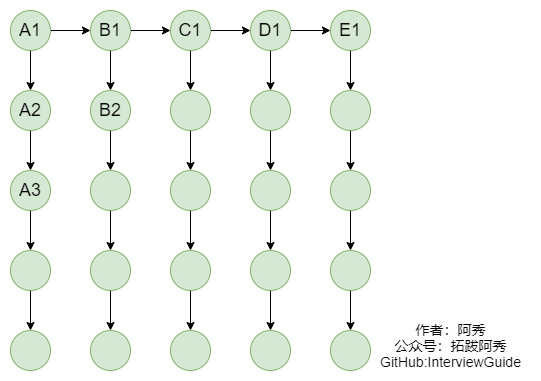
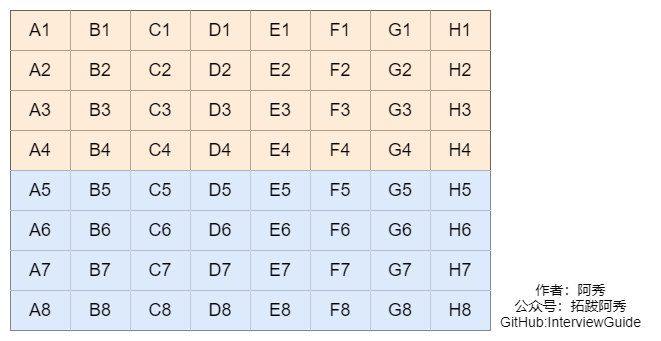
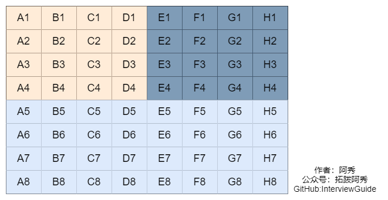
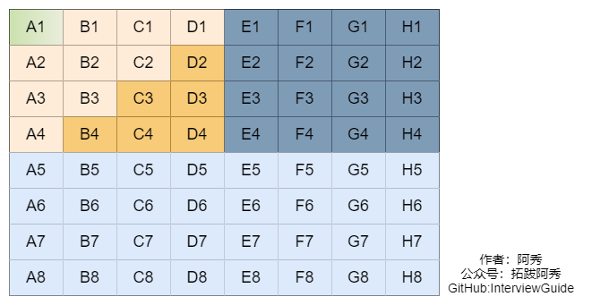
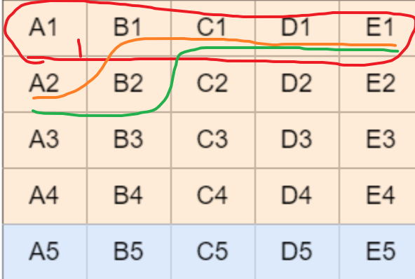
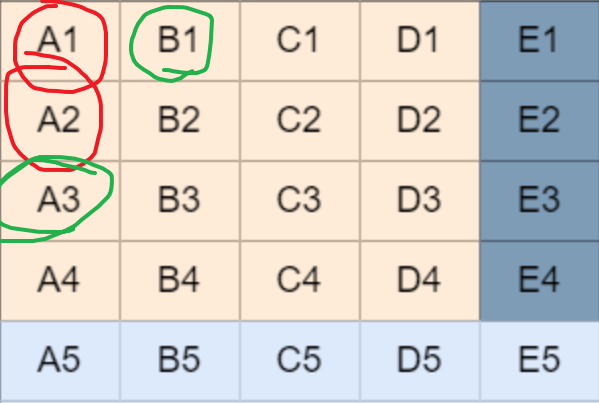
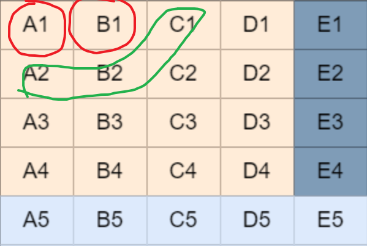
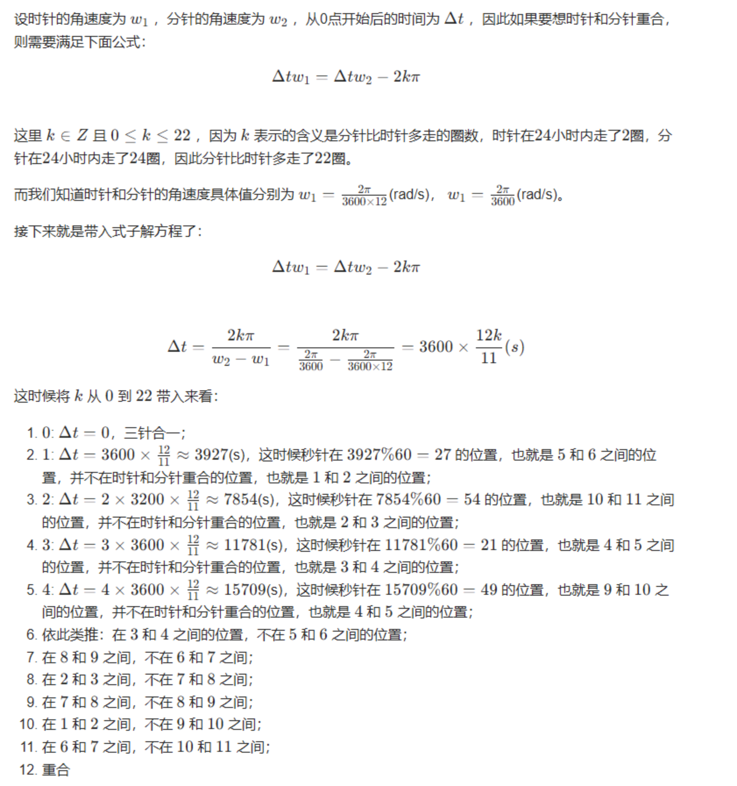
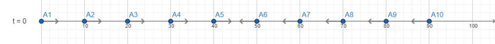

有一类型考察是考察你的临场反应速度，比如脑筋急转弯这种智力题或者情景题，


## 1、三人三鬼过桥

有三个人跟三个鬼要过河,河上没桥只有条小船,然后船一次只能渡一个人和一个鬼,或者两个鬼或者两个人,无论在哪边岸上,只有是人比鬼少的情况下(如两鬼一人,三鬼两人,三鬼一人)人会被鬼吃,然而船又一定需要人或鬼操作才能航行(要有人或鬼划船),问,如何安全的把三人三鬼渡过河对岸?

参考回答

- 先两鬼过去。在一鬼回来。对面有一鬼。这边有三人两鬼。
- 再两鬼过去。在一鬼回来。对面有两鬼。这边有三人一鬼。
- 再两人过去。一人一鬼回来。对面一人一鬼。这边两人两鬼。
- 最后两人过去。一鬼回来。对面三人。这边三鬼。
- 剩下的就三个鬼二个过去一个回来在接另外个就OK了。

## 2、赛马找最快的马匹（腾讯高频题）

一般有这么几种问法：

25匹马5条跑道找最快的3匹马，需要跑几次？参考回答：7

64匹马8条跑道找最快的4匹马，需要跑几次？参考回答：11

25匹马5条跑道找最快的5匹马，需要跑几次？参考回答：最少8次最多9次

建议画图表来看，将问题简单化一点，将大问题化成小问题即可，同时B站有个讲解视频还不错：https://www.bilibili.com/video/BV1KJ411g78y

详细解法：

### **1、25匹马5条跑道找最快的3匹马，需要跑几次？**



将25匹马分成ABCDE5组，假设每组的排名就是A1>A2>A3>A4>A5,用边相连，这里比赛5次

第6次，每组的第一名进行比赛，可以找出最快的马，这里假设A1>B1>C1>D1>E1

D1，E1肯定进不了前3，直接排除掉

比Ａ１慢的就是Ｂ１和Ａ２，这两个都有可能是第二名，

比Ｂ１　Ａ２，慢有可能是　Ａ３，Ｂ２，Ｃ１这几个比一下就可以得到第二，第三名。


第7次，B1 C1 A2 B2 A3比赛，可以找出第二，第三名

所以最少比赛需要7次

### **2、64匹马8条跑道找最快的4匹马，需要跑几次？**

第一步 全部马分为8组，每组8匹，每组各跑一次，然后淘汰掉每组的后四名，如下图（需要比赛8场）



第二步 取每组第一名进行一次比赛，然后淘汰最后四名所在组的所有马，如下图（需要比赛1场）



这个时候总冠军已经诞生，它就是A1，蓝域（它不需要比赛了）。

而其他可能跑得最快的三匹马只可能是下图中的黄域了（A2,A3,A4,B1,B2,B3,C1,C2,D1，共9匹马）



第三步 只要从上面的9匹马中找出跑得最快的三匹马就可以了，但是现在只要8个跑道，怎么办？

那就随机选出8匹马进行一次比赛吧（需要比赛一场）

第四步 上面比赛完，选出了前三名，但是9匹马中还有一匹马没跑呢，它可能是一个潜力股啊，那就和前三名比一比吧，这四匹马比一场，选出前三名。最后加上总冠军，跑得最快的四匹马诞生了！！！（需要一场比赛）

最后，一共需要比赛的场次：8 + 1 + 1 + 1 = 11 场

### **3、25匹马5条跑道找最快的5匹马，需要跑几次？**

(1) 首先将25匹马分成5组，并分别进行5场比赛之后得到的名次排列如下：

A组： [A1 A2 A3 A4 A5]

B组： [B1 B2 B3 B4 B5]

C组： [C1 C2 C3 C4 C5]

D组： [D1 D2 D3 D4 D5]

E组： [E1 E2 E3 E4 E5]

其中，每个小组最快的马为[A1、B1、C1、D1、E1]。

(2) 将[A1、B1、C1、D1、E1]进行第6场，选出第1名的马，不妨设 A1>B1>C1>D1>E1. 此时第1名的马为A1。

(3) 将[A2、B1、C1、D1、E1]进行第7场，此时选择出来的必定是第2名的马，不妨假设为B1。因为这5匹马是除去A1之外每个小组当前最快的马。

(3) 进行第8场，选择[A2、B2、C1、D1、E1]角逐出第3名的马。

(4) 依次类推，第9，10场可以分别决出第4，5名的吗。

因此，依照这种竞标赛排序思想，需要10场比赛是一定可以取出前5名的。



**仔细想一下，如果需要减少比赛场次，就一定需要在某一次比赛中同时决出2个名次，而且每一场比赛之后，有一些不可能进入前5名的马可以提前出局。**

当然要做到这一点，就必须小心选择每一场比赛的马匹。我们在上面的方法基础上进一步思考这个问题，希望能够得到解决。

(1) 首先利用5场比赛角逐出每个小组的排名次序是绝对必要的。

(2) 第6场比赛选出第1名的马也是必不可少的。假如仍然是A1马(A1>B1>C1>D1>E1)。那么此时我们可以得到一个重要的结论：有一些马在前6场比赛之后就决定出局的命运了(下面粉色字体标志出局)。

A组： [A1 A2 A3 A4 A5]

B组： [B1 B2 B3 B4 B5 ]

C组： [C1 C2 C3 C4 C5 ]

D组： [D1 D2 D3 D4 D5 ]

E组： [E1 E2 E3 E4 E5 ]

(3) 第7场比赛是关键，能否同时决出第2，3名的马呢？我们首先做下分析：

在上面的方法中，第7场比赛[A2、B1、C1、D1、E1]是为了决定第2名的马。但是在第6场比赛中我们已经得到(B1>C1>D1>E1)，试问？有B1在的比赛，C1、D1、E1还有可能争夺第2名吗？ 当然不可能，也就是说第2名只能在A2、B1中出现。**实际上只需要2条跑道就可以决出第2名**，剩下C1、D1、E1的3条跑道都只能用来凑热闹的吗？

能够优化的关键出来了，我们是否能够通过剩下的3个跑道来决出第3名呢？当然可以，我们来进一步分析第3名的情况？

● 如果A2>B1(即第2名为A2)，那么根据第6场比赛中的(B1>C1>D1>E1)。 可以断定第3名只能在A3和B1中产生。



● 如果B1>A2(即第2名为B1)，那么可以断定的第3名只能在A2, B2,C1 中产生。



好了，结论也出来了，只要我们把[A2、B1、A3、B2、C1]作为第7场比赛的马，那么这场比赛的第2，3名一定是整个25匹马中的第2，3名。

我们在这里列举出第7场的2，3名次的所有可能情况：

① 第2名=A2，第3名=A3

② 第2名=A2，第3名=B1

③ 第2名=B1，第3名=A2

④ 第2名=B1，第3名=B2

⑤ 第2名=B1，第3名=C1

(4) 第8场比赛很复杂，我们要根据第7场的所有可能的比赛情况进行分析。

① 第2名=A2，第3名=A3。那么此种情况下第4名只能在A4和B1中产生。

● 如果第4名=A4，那么第5名只能在A5、B1中产生。

● 如果第4名=B1，那么第5名只能在A4、B2、C1中产生。

不管结果如何，此种情况下，第4、5名都可以在第8场比赛中决出。其中比赛马匹为[A4、A5、B1、B2、C1]

② 第2名=A2，第3名=B1。那么此种情况下第4名只能在A3、B2、C1中产生。

● 如果第4名=A3，那么第5名只能在A4、B2、C1中产生。

● 如果第4名=B2，那么第5名只能在A3、B3、C1中产生。

● 如果第4名=C1，那么第5名只能在A3、B2、C2、D1中产生。

那么，第4、5名需要在马匹[A3、B2、B3、C1、A4、C2、D1]七匹马中产生，则必须比赛两场才行，也就是到第9场角逐出全部的前5名。

③ 第2名=B1，第3名=A2。那么此种情况下第4名只能在A3、B2、C1中产生。

情况和②一样，必须角逐第9场

④ 第2名=B1，第3名=B2。 那么此种情况下第4名只能在A2、B3、C1中产生。

● 如果第4名=A2，那么第5名只能在A3、B3、C1中产生。

● 如果第4名=B3，那么第5名只能在A2、B4、C1中产生。

● 如果第4名=C1，那么第5名只能在A2、B3、C2、D1中产生。

那么，第4、5名需要在马匹[A2、B3、B4、C1、A3、C2、D1]七匹马中产 生，则必须比赛两场才行，也就是到第9场角逐出全部的前5名。

⑤ 第2名=B1，第3名=C1。那么此种情况下第4名只能在A2、B2、C2、D1中产生。

● 如果第4名=A2，那么第5名只能在A3、B2、C2、D1中产生。

● 如果第4名=B2，那么第5名只能在A2、B3、C2、D1中产生。

● 如果第4名=C2，那么第5名只能在A2、B2、C3、D1中产生。

● 如果第4名=D1，那么第5名只能在A2、B2、C2、D2、E2中产生。

那么，第4、5名需要在马匹[A2、B2、C2、D1、A3、B3、C3、D2、E1]九匹马中 产 生，因此也必须比赛两场，也就是到第9长决出胜负。

总结：**最好情况可以在第8场角逐出前5名，最差也可以在第9场搞定。**


## 3、给定随机函数，生成别的随机数

### rand5()生成rand7()

**给定生成1到5的随机数Rand5()，如何得到生成1到7的随机数函数Rand7()？**

思路

很多人的第一反应是利用`rand5() + rand5()%3`来实现rand7()函数，这个方法确实可以产生1-7之间的随机数，但是仔细想想可以发现数字生成的概率是不相等的。`rand()%3 `产生0的概率是1/5，而产生1和2的概率都是2/5，**所以这个方法产生6和7的概率大于产生5的概率。**

先产生一个[均匀分布](http://www.nowamagic.net/librarys/veda/tag/均匀分布)的 0， 5， 10， 15， 20的数，再产生一个均匀分布的 0， 1， 2， 3，4 的数。相加以后，会产生一个 0到24的数，而且每个数（除0外）生成的概率是一样的。我们只取 1 - 21 这一段，和7 取余以后+1就能得到完全均匀分布的1-7的随机数了。

为什么要用(rand5() - 1) * 5 + rand5()这个式子来计算，以及用这个式子计算的结果能保证概率相等。 (rand5() - 1) * 5 + rand5(): 当第一个rand5() = 1时，可以产生1，2，3，4，5，每个数产生的概率相等。 当第一个rand5() = 2时，可以产生6，7，8，9，10 每个数产生的概率相等。 当第一个rand5() = 3时，可以产生11，12，13，14，15，每个数产生的概率相等。 当第一个rand5() = 4时，可以产生16，17，18，19，20，每个数产生的概率相等。 当第一个rand5() = 5时，可以产生21，22，23，24，25，每个数产生的概率相等。 第一个rand5()为1，2，3，4，5的概率相等，**所以产生的1到25这25个数概率相等**，**去掉22，23，24，25，剩下的数产生的概率仍然相等。**

比如`Rand25= 5*( Rand5()-1 ) + Rand5()`可以生成1到25之间的随机数。我们可以只要1到21（3*7）之间的数字，所以可以这么写

```java
public static int rand5(){
    int n=(int)(Math.random()*5+1);
    return n;
}

public static int rand7(){
    int n,temp1,temp2;
    while(true){
        temp1=rand5();
        temp2=rand5();
        //n是可以取1~25的随机的数。
        n=(temp1-1)*5+temp2;
        //当n>21重新生成，即扔掉n>21的数，这样n只能取1~21
        if(n>21){
            continue;
        }else{
            break;
        }
    }
    //对7取模就能取1~7之间的随机数
    return 1+n%7;
}
```


同样的rand3()生成rand7()，1，2，3 按3倍数算生成，3，6，9，这时3倍的rand3（）是能生成1…9的数字，即(rand3()-1)*3+rand3(),舍弃大于7的部分就能构造1-7的随机数

> 第一个rand3()=1时，可以产生1，2，3
>
> 第一个rand3()=2时，可以产生4，5，6
>
> 第一个rand3()=3时，可以产生7，8，9


### **rand01生成rand6**

```c++
int rand03(){
    return rand01() * 2 + rand01();
}

int rand6(){
    int num;
    do{
        num = rand03() * 4 + rand03();
    }
    while(num >= 12);
    return num % 6 + 1;
}
```

> 这个是因为，rand01 是平均生产 1 and 0，rand03=》 0 1 2 3,是平均的，四个数
>
> 在 `rand03()` 中：
>
> - `rand01() * 2` 生成 0 或 2。
> - 加上第二次调用 `rand01()` 的结果，可以得到 0, 1, 2, 或 3。
>
> 生成这些数的概率如下：
>
> - P(0) = P(0 * 2 + 0) = P(0) * P(0) = 0.5 * 0.5 = 0.25
> - P(1) = P(0 * 2 + 1) = P(0) * P(1) = 0.5 * 0.5 = 0.25
> - P(2) = P(1 * 2 + 0) = P(1) * P(0) = 0.5 * 0.5 = 0.25
> - P(3) = P(1 * 2 + 1) = P(1) * P(1) = 0.5 * 0.5 = 0.25
>
> 因此，`rand03()` 生成 0 到 3 的概率是均匀的。
>
> - `rand03() * 4` 生成 0, 4, 8 或 12。如果是rand03*3的话，就是0 3 6 9，后面加上 0 1 2 3会出现重复的3，几率不是相等的。
> - 加上第二次调用 `rand03()` 的结果，可以得到 0 到 15 之间的数。


### **p概率的rand01生成rand6**

**rand01是一个以p概率产生0以1-p概率产生1的随机函数**

如果 `rand01()` 以概率 `p` 产生 `0`，以概率 `1-p` 产生 `1`，那么生成的数字 `0` 和 `1` 的概率是不相等的。在这种情况下，我们可以通过一些技巧来构造一个等概率产生 `0` 和 `1` 的函数 `rand01p()`

```cpp
int rand01p(){
    int num;
    do{
        num = rand01();
    }
    while(num == rand01());
    return num;
}
```

下面是对这个实现的详细解释：

1. `rand01()` 以概率 `p` 产生 `0`，以概率 `1-p` 产生 `1`。
2. `rand01p()` 调用 `rand01()` 两次，比较这两次的结果：
   - 如果两次结果相同 (`num == rand01()`)，则两次都为 `0` 或两次都为 `1`，此时我们丢弃这些结果并再次尝试。
   - 如果两次结果不同 (`num != rand01()`)，则其中一次为 `0`，另一次为 `1`。这种情况下，我们可以确定这是一个公平的抛硬币结果。
3. 由于我们只在两次结果不同的情况下返回结果，那么这种情况下生成 `0` 和 `1` 的概率是均匀的。

具体概率分析如下：

- 假设第一次调用 `rand01()` 产生 `0` 的概率是 `p`，产生 `1` 的概率是 `1-p`。
- 第二次调用 `rand01()` 产生 `0` 的概率也是 `p`，产生 `1` 的概率也是 `1-p`。

我们关心的是两次结果不同的概率：

- **第一次产生 `0` 且第二次产生 `1` 的概率是 `p * (1-p)`。**
- **第一次产生 `1` 且第二次产生 `0` 的概率是 `(1-p) * p`。**

这个显然就是概率相同的两个随机数生成方式了

所以，两次结果不同的总概率是：
$$
[ p \cdot (1 - p) + (1 - p) \cdot p = 2 \cdot p \cdot (1 - p) ]
$$


在这种情况下，`rand01p()` 返回 `0` 和 `1` 的概率分别是：

- 返回 `0` 的概率是 `p * (1 - p) / [2 * p * (1 - p)] = 1 / 2`。
- 返回 `1` 的概率是 `(1 - p) * p / [2 * p * (1 - p)] = 1 / 2`。

因此，通过这种方式，我们成功地将原来概率不均匀的 `rand01()` 转换成一个概率均匀的 `rand01p()`，使得它以相等的概率生成 `0` 和 `1`。这就实现了我们所需的等概率随机数生成。


### rand2生成rand5

> 就是rand2是生成 1 2 随机的数，rand2-1 *2 + rand2 只能是 随机 1 2 3 4
>
> 需要rand03 0 1 2 3 辅助。
>
> 

```
int rand03(){
    return (rand2 - 1) * 2 + rand2 - 1;
}

int rand5(){
    int num;
    do{
        num = rand03() * 4 + rand03();
    }
    while(num > 14);
    return num % 5 + 1;
}
```

2经过插空儿后无法大于5，或者说5的倍数，所以只能通过辅助的生成03这种方式再来生成一次


### **如果以大的生成器生成更小的生成器那？**

```c++
 //rand8随机生成器制作一个1-7随机数生成器
    public static int rand8(){
        int n=(int)(Math.random()*8+1);
        return n;
    }
    
    public static int rand7_1(){
        int n;
       do{
           n=rand8();
       }while(n>7);
       return 1+n%7;
    }
```


## 4、砝码称轻重，找出最轻的

其实这都是一类题，这里列举几个经典的：

1、有一个天平，九个砝码，其中一个砝码比另八个要轻一些，问至少要用天平称几次才能将轻的那个找出来？

参考回答：至少2次。第一次，一边3个，哪边轻就在哪边，一样重就是剩余的3个； 第二次，一边1个，哪边轻就是哪个，一样重就是剩余的那个；至少称2次．

2、十组砝码每组十个，每个砝码都是10g重，但是现在其中有一组砝码每个都只有9g重，现有一个能显示克数的秤，最少称几次能找到轻的那组？ 参考回答：1次

参考回答：至少1次。

将砝码分组1~10，第一组拿一个，第二组拿两个以此类推。。第十组拿十个放到秤上称出克数x，则y = 550 - x，第y组就是轻的那组。


## 5、利用空瓶换饮料，最多喝几瓶

1000瓶饮料，3个空瓶子能够换1瓶饮料，问最多能喝几瓶？

### **第一种思路**

拿走3瓶，换回1瓶，相当于减少2瓶。但是最后剩下4瓶的时候例外，这时只能换1瓶。所以我们计算1000减2能减多少次，直到剩下4.（1000-4=996，996/2=498）所以1000减2能减498次直到剩下4瓶，最后剩下的4瓶还可以换一瓶，所以总共是1000+498+1=1499瓶。

### **第二种思路**

- 1000瓶饮料，3个空瓶子能换1瓶饮料，最多可以喝几瓶？
- 第一种思维：可以考虑成dp思路
- - 初始情况，3个瓶子时将发生一次交换，因此视为特殊情况
  - 之后每增加两个瓶子又可以再换一瓶
  - 即dp[i] = dp[i - 2] + (i - (i - 2)) + 1
  - - 由dp[i - 2]可求得dp[i]
    - (i - (i - 2))，即为当前增加的2瓶饮料（写成这样便于理解）
    - 1即为增加了2个空瓶，之后又可以换一瓶饮料
  - 简化为dp[i] = dp[i - 2] + 2 + 1

```java
  public int method(int n) {
      // n为0/1/2的特殊情况省略了
      // 定义dp数组
      int[] dp = new int[n + 1];
      // 初始状态
      dp[0] = 0;
      dp[1] = 1;
      dp[2] = 2;
      for (int i = 3; i <= n; i++) {
        dp[i] = dp[i - 2] + 2 + 1;
     }
      return dp[n];
   }   
```


- 回归正题
- - 特殊情况：从上面的分析中，留下2个瓶子
  - 剩下998个瓶子相当于每消耗2个瓶子即可获得一瓶，即为499瓶
  - 最后剩下的2个瓶子无法再进行兑换，因此总共为1000 + 499 = 1499，这是因为不能借一个瓶子，如果可以借的话，直接1000/2就可以了，直接每次都借，相当于2瓶喝一个、
- 第二种思维：利用借瓶子的思想
- - 因为兑换一瓶饮料需要三个空瓶，这瓶饮料如果是找老板借来的，那么喝完后这个空瓶将会还给他，同时需要附赠给他另外两个空瓶，即每消耗手里两个空瓶就获得一瓶饮料
  - 但是值得注意的是，上面只是一种假设，实际情况老板是不会借给你的，因此我们至少需要保留2个空瓶，这样可以在998个瓶子剩下一个瓶子时，对其进行补足为3个空瓶，从而兑换一瓶新饮料
  - 此时使用998个瓶子进行上述的兑换，将获得499瓶饮料
  - 之前留下的两个瓶子正好无法兑换，最终获得饮料为1000 + 499 = 1499瓶


## 6、毒药毒白鼠，找出哪个瓶子中是毒药

有1000个一模一样的瓶子，其中有999瓶是普通的水，有1瓶是毒药。任何喝下毒药的生命都会在一星期之后死亡。现在你只有10只小白鼠和1个星期的时间，如何检验出哪个瓶子有毒药？

### 参考回答

1、将10只老鼠剁成馅儿，分到1000个瓶盖中，每个瓶盖倒入适量相应瓶子的液体，置于户外，并每天补充适量相应的液体，观察一周，看哪个瓶盖中的肉馅没有腐烂或生蛆。（你要是胆子够大就可以这么回答，是个狼人）

2、首先一共有1000瓶，2的10次方是1024，刚好大于1000，也就是说，1000瓶药品可以使用10位二进制数就可以表示。从第一个开始：

第一瓶 ： 00 0000 0001

第二瓶： 00 0000 0010

第三瓶： 00 0000 0011

……

第999瓶： 11 1111 0010

第1000瓶： 11 1111 0011

需要十只老鼠，如果按顺序编号，ABCDEFGHIJ分别代表从低位到高位每一个位。 每只老鼠对应一个二进制位，如果该位上的数字为1，则给老鼠喝瓶里的药。

观察，若死亡的老鼠编号为：ACFGJ，一共死去五只老鼠，则对应的编号为 10 0110 0101，则有毒的药品为该编号的药品，转为十进制数为：613号。（这才是正解，当然前提是老鼠还没被撑死）


类似的问题

8瓶酒一瓶有毒，用小老鼠测试。每次测试结果8小时后才会得出，而你只有8个小时的时间。最少需要（ ）老鼠测试？ A、2 B、3 C、4 D、6

解析：用3位2进制代表8瓶酒，如下表所示

瓶序号 二进制 中毒情况

第一瓶 000 全没中毒

第二瓶 001 只有第一个老鼠中毒

第三瓶 010 只有第二个老鼠中毒

第四瓶 011 第一个老鼠、第三个老鼠同时中毒

第五瓶 100 只有第三个老鼠中毒

第六瓶 101 第一个老鼠、第三个老鼠同时中毒

第七瓶 110 第二个老鼠、第三个老鼠同时中毒

第八瓶 111 三个老鼠同时中毒

其中，第一个老鼠喝下最低位为1对应的酒，第二个老鼠喝下中间位为1对应的酒，第三个老鼠喝下最高位为1对应的酒

最后将所有中毒的老鼠，对应的位次进行与操作即可以知道那瓶毒药有毒了


## 7、利用烧绳子计算时间

现有若干不均匀的绳子，烧完这根绳子需要一个小时，问如何准确计时15分钟，30分钟，45分钟，75分钟。。。

计算15分钟：对折之后两头烧(要求对折之后绑的够紧，否则看45分钟解法)

计算30分钟：两头烧

计算45分钟：两根，一根两头烧一根一头烧，两头烧完过了30分钟，立即将第二根另一头点燃，到烧完又过15分钟，加起来45分钟

计算75分钟：将30和45分钟的方式加起来就可以了

其余类似


## 8、在24小时里面时针分针秒针可以重合几次

24小时中时针走2圈，而分针走24圈，时针和分针重合24-2=22次，而只要时针和分针重合，秒针一定有机会重合，所以总共重合22次

**勘误**：

时针和分针重合的时候，秒针根本就不在重合的地方，而是在其他地方，以下是数学推导：



因此看来就是只有 1 次重合，因为在 12 小时内不包含 12 点这个时间，所以在 24 小时内，也就只有**两次重合**，分别为 0 点和 12 点。

> [github issue勘误链接(opens new window)](https://github.com/forthespada/InterviewGuide/issues/108)


## [#](https://interviewguide.cn/notes/03-hunting_job/02-interview/06-intelligence.html#_9、100个奴隶猜帽子颜色)9、100个奴隶猜帽子颜色

一百个奴隶站成一纵列，每人头上随机带上黑色或白色的帽子，各人不知道自己帽子的颜色，但是能看见自己前面所有人帽子的颜色． 然后从最后一个奴隶开始，每人只能用同一种声调和音量说一个字：”黑”或”白”， 如果说中了自己帽子的颜色，就存活，说错了就拉出去斩了，说的参考回答所有奴隶都能听见。 是否说对，其他奴隶不知道。 在这之前，所有奴隶可以聚在一起商量策略，问如果奴隶都足够聪明而且反应足够快，100个人最大存活率是多少？

参考回答：这是一道经典推理题

1、最后一个人如果看到奇数顶黑帽子报“黑”否则报“白”，他可能死

2、其他人记住这个值（实际是黑帽奇偶数），在此之后当再听到黑时，黑帽数量减一

3、从倒数第二人开始，就有两个信息：记住的值与看到的值，相同报“白”，不同报“黑”

99人能100%存活，1人50%能活

另外，此题还有变种：每个奴隶只能看见前面一个人帽子颜色又能最多存活多少人？

参考回答：增加限制条件后，上面的方法就失效了，此时只能约定偶数位奴隶说他前一个人的帽子颜色，奇数奴隶获取信息100%存活，偶数奴隶50几率存活。


## 10、 小猴子搬香蕉

一个小猴子边上有100根香蕉，它要走过50米才能到家，每次它最多搬50根香蕉，（多了就被压死了），它每走 1米就要吃掉一根，请问它最多能把多少根香蕉搬到家里？

（提示：他可以把香蕉放下往返的走，但是必须保证它每走一米都能有香蕉吃。也可以走到n米时，放下一些香蕉，拿着n根香蕉走回去重新搬50根。）

参考回答：这种试题通常有一个迷惑点，让人看不懂题目的意图。此题迷惑点在于：走一米吃一根香蕉，一共走50米，那不是把50根香蕉吃完了吗？如果要回去搬另外50根香蕉，则往回走的时候也要吃香蕉，这样每走一米需要吃掉三根香蕉，走50米岂不是需要150根香蕉？？？？黑人问号？

其实不然，本题关键点在于：猴子搬箱子的过程其实分为两个阶段，第一阶段：来回搬，当香蕉数目大于50根时，猴子每搬一米需要吃掉三根香蕉。第二阶段：香蕉数《=50，直接搬回去。每走一米吃掉1根。

我们分析第一阶段：假如把100根香蕉分为两箱。一箱50根。

第一步，把A箱搬一米，吃一根。

第二步，往回走一米，吃一根。

第三步，把B箱搬一米，吃一根。

这样，把所有香蕉搬走一米需要吃掉三根香蕉。

这样走到第几米的时候，香蕉数刚好小于50呢？

`100-(n*3)<50 && 100-(n-1*3)>50`3


走到16米的时候，吃掉48根香蕉，剩52根香蕉。这步很有意思，它可以直接搬50往前走，也可以再来回搬一次，但结果都是一样的。

**到17米的时候，猴子还有49根香蕉。这时猴子就轻松啦，直接背着走就行。**

第二阶段：

走一米吃一根。

把剩下的50-17=33米走完。还剩49-33=16根香蕉。


## 11、高楼扔鸡蛋（经典问题）

有2个鸡蛋，从100层楼上往下扔，以此来测试鸡蛋的硬度。比如鸡蛋在第9层没有摔碎，在第10层摔碎了，那么鸡蛋不会摔碎的临界点就是9层。

问：如何用最少的尝试次数，测试出鸡蛋不会摔碎的临界点？

首先要说明的是这道题你要是一上来就说出正确参考回答，那说明你的智商不是超过160就是你做过这题。

所以建议你循序渐进的回答，一上来就说最优解可能结果不会让你和面试官满意。

参考回答

### 1、暴力法

举个例子，最笨的测试方法，是什么样的呢？把其中一个鸡蛋，从第1层开始往下扔。如果在第1层没碎，换到第2层扔；如果在第2层没碎，换到第3层扔.......如果第59层没碎，换到第60层扔；如果第60层碎了，说明不会摔碎的临界点是第59层。

在最坏情况下，这个方法需要扔100次。

### 2、二分法-50次

采用类似于二分查找的方法，把鸡蛋从一半楼层（50层）往下扔。

如果第一枚鸡蛋，在50层碎了，第二枚鸡蛋，就从第1层开始扔，一层一层增长，一直扔到第49层。

如果第一枚鸡蛋在50层没碎了，则继续使用二分法，在剩余楼层的一半（75层）往下扔......

这个方法在最坏情况下，需要尝试50次。

### 3、均匀法

如何让第一枚鸡蛋和第二枚鸡蛋的尝试次数，尽可能均衡呢？

很简单，做一个平方根运算，100的平方根是10。

因此，**我们尝试每10层扔一次，第一次从10层扔，第二次从20层扔，第三次从30层......一直扔到100层。**

这样的最好情况是在第10层碎掉，尝试次数为 1 + 9 = 10次。

最坏的情况是在第100层碎掉，尝试次数为 10 + 9 = 19次。

不过，这里有一个小小的优化点，我们可以从15层开始扔，接下来从25层、35层扔......一直到95层。

这样最坏情况是在第95层碎掉，尝试次数为 9 + 9 = 18次。

### 4、最优解法

最优解法是反向思考的经典：如果最优解法在最坏情况下需要扔X次，那第一次在第几层扔最好呢？

参考回答是：从X层扔

假设最优的尝试次数的x次，为什么第一次扔就要选择第x层呢？

这里的解释会有些烧脑，请小伙伴们坐稳扶好：

**假设第一次扔在第x+1层：**

如果第一个鸡蛋碎了，那么第二个鸡蛋只能从第1层开始一层一层扔，一直扔到第x层。

这样一来，我们总共尝试了x+1次，和假设尝试x次相悖。由此可见，第一次扔的楼层必须小于x+1层。

**假设第一次扔在第x-1层：**

如果第一个鸡蛋碎了，那么第二个鸡蛋只能从第1层开始一层一层扔，一直扔到第x-2层。

这样一来，我们总共尝试了x-2+1 = x-1次，虽然没有超出假设次数，但似乎有些过于保守。

**假设第一次扔在第x层：**

如果第一个鸡蛋碎了，那么第二个鸡蛋只能从第1层开始一层一层扔，一直扔到第x-1层。

这样一来，我们总共尝试了x-1+1 = x次，刚刚好没有超出假设次数。

因此，要想尽量楼层跨度大一些，又要保证不超过假设的尝试次数x，那么第一次扔鸡蛋的最优选择就是第x层。

那么算最坏情况，第二次你只剩下x-1次机会，按照上面的说法，你第二次尝试的位置必然是X+（X-1）；

以此类推我们可得：

x + (x-1) + (x-2) + ... + 1 = 100

这个方程式不难理解：

左边的多项式是各次扔鸡蛋的楼层跨度之和。由于假设尝试x次，所以这个多项式共有x项。

右边是总的楼层数100。

下面我们来解这个方程：

x + (x-1) + (x-2) + ... + 1 = 100 转化为

(x+1)*x/2 = 100

最终x向上取整，得到 x = 14

因此，最优解在最坏情况的尝试次数是14次，第一次扔鸡蛋的楼层也是14层。

最后，让我们把第一个鸡蛋没碎的情况下，所尝试的楼层数完整列举出来：

14，27， 39， 50， 60， 69， 77， 84， 90， 95， 99， 100

举个例子验证下：

假如鸡蛋不会碎的临界点是65层，那么第一个鸡蛋扔出的楼层是14，27，50，60，69。这时候啪的一声碎了。

第二个鸡蛋继续，从61层开始，61，62，63，64，65，66，啪的一声碎了。

因此得到不会碎的临界点65层，总尝试次数是 6 + 6 = 12 < 14 。


## 12、N只蚂蚁走树枝，问总距离或者总时间

问题：放N只蚂蚁在一条长度为M树枝上，蚂蚁与蚂蚁之间碰到就各自往反方向走，问总距离或者时间为多少？

参考回答：这个其实就一个诀窍：蚂蚁相碰就往反方向走，可以直接看做没有发生任何事：大家都相当于独立的

A蚂蚁与B蚂蚁相碰后你可以看做没有发生这次碰撞，这样无论是求时间还是距离都很简单了。


举个例子：

A） 假如在两个土堆之间有一根笔直的树枝，长度为100厘米。树枝上有10只蚂蚁，每只蚂蚁之间相距10厘米，最靠左边的那只蚂蚁位于树枝的最左端（不妨称坐标为0），最靠右边的那只蚂蚁离树枝的最右端距离10厘米（不妨称坐标为90）。蚂蚁本身的大小可以忽视，即可以把它们当作没有几何大小的质点。在计时开始的时刻，靠左边的5只蚂蚁向右运动，靠右边的5只蚂蚁向左运动。所有的蚂蚁都保持匀速运动，其速度的绝对值都为每分钟100厘米。树枝非常细，所以当两只蚂蚁头对头相遇（碰撞）时，它们立即掉头向相反的方向运动，仍然保持每分钟100厘米的匀速。当蚂蚁超过树枝的两端，它们将掉落在土堆之上、且不再爬上树枝。问题来了：计时开始多长时间后，所有蚂蚁都掉落到了土堆上？



ANS：实际就是最远的那个蚂蚁，大概1分钟后掉下去，所以就是1分钟


B) 保持问题A的基本设定，但假设现在树枝上有100只蚂蚁。最靠左边的那只蚂蚁仍然位于树枝的最左端（坐标为0），它在计时开始时向右运动；最靠右边的那只蚂蚁靠近树枝的最右端，但和最右端有一定的距离，它在计时开始时向左运动。其它98只蚂蚁的位置和初始运动方向都是随机决定的，只知道计时开始时这100只蚂蚁中**有75只向左运动，另外25只向右运动。**蚂蚁碰撞时速度变化的规则如问题A中所描述，请问：在这种情况下，计时开始多长时间后，所有蚂蚁都掉落到了土堆上？


C) 在问题B中，最后从树枝上掉落的那只蚂蚁是哪一只？在计时开始时，这只蚂蚁的运动方向是向左，还是向右？

问题C问的是哪一只蚂蚁最后掉落。我们知道虽然信件运动的方向和速度是恒定的，但从树枝最左端出发，到最后从树枝右端掉落，这个过程中该信件经过了若干个信使的搬运，那么哪只蚂蚁是这封信的最后一个信使呢？

从题目的设定来看，蚂蚁和蚂蚁之间只存在碰撞，而不存在跨越，即蚂蚁之间的相对位置不会发生交换，100只蚂蚁的次序也不会发生改变。在计时开始时，有75只蚂蚁向左运动，25只蚂蚁向右运动，这决定了包括A1携带的这封信在内，一共有25封信将从树枝右侧掉落到土堆上。

而信件自己是没有腿的，它们的运动全靠蚂蚁搬运。所以，有25封信从树枝右侧掉落，意味着同样有25只蚂蚁从树枝右侧掉落。蚂蚁之间的次序不会改变，所以最先从树枝右侧掉落的蚂蚁一定是A100，第2个从树枝右侧掉落的蚂蚁一定是A99……第25个从树枝右侧掉落的蚂蚁，即那封运动距离最长信件的最后一个信使，它的编号一定是A76。因此，问题C的答案即：在计时开始时，从树枝最左端向右数的第76只蚂蚁。

不论这只蚂蚁的初始位置和初始运动方向如何，它就是天选的最后一个信使，将带着A1身上的信件，在计时开始1分钟后从树枝的右端掉落到土堆上。

## 13、N个强盗分配M个金币，求方案使得自己分配最多

5个海盗抢到了100枚金币，每一颗都一样的大小和价值。 他们决定这么分：

1.  抽签决定自己的号码（1，2，3，4，5）
2.  首先，由1号提出分配方案，然后大家5人进行表决，当 半数以上的人同意时（ 不包括半数，这是重点），按照他的提案进行分配，否则将被扔入大海喂鲨鱼。
3.  如果1号死后，再由2号提出分配方案，然后大家4人进行表决，当且仅当半超过半数的人同意时，按照他的提案进行分配，否则将被扔入大海喂鲨鱼。
4.  依次类推......

假设每一位海盗都足够聪明，并且利益至上，能多分一枚金币绝不少分，那么1号海盗该怎么分金币才能使自己分到最多的金币呢？

参考回答

从后向前推，如果1至3号强盗都喂了鲨鱼，只剩4号和5号的话，5号一定投反对票让4号喂鲨鱼，以独吞全部金币。所以，4号惟有支持3号才能保命。

3号知道这一点，就会提出“100，0，0”的分配方案，对4号、5号一毛不拔而将全部金币归为已有，**因为他知道4号一无所获但还是会投赞成票**，再加上自己一票，他的方案即可通过。

不过，2号推知3号的方案，就会提出“98，0，1，1”的方案，即放弃3号，而给予4号和5号各一枚金币。由于该方案对于4号和5号来说比在3号分配时更为有利，他们将支持他而不希望他出局而由3号来分配。这样，2号将拿走98枚金币。

同样，2号的方案也会被1号所洞悉，1号并将提出（97，0，1，2，0）或（97，0，1，0，2）的方案，即放弃2号，而给3号一枚金币，同时给4号（或5号）2枚金币。由于1号的这一方案对于3号和4号（或5号）来说，相比2号分配时更优，他们将投1号的赞成票，再加上1号自己的票，1号的方案可获通过，97枚金币可轻松落入囊中。这无疑是1号能够获取最大收益的方案了！参考回答是：1号强盗分给3号1枚金币，分给4号或5号强盗2枚，自己独得97枚。分配方案可写成（97，0，1，2，0）或（97，0，1，0，2）。


此题还有变种：就是只需要一半人同意即可，不需要一半人以上同意方案就可以通过，在其他条件不变的情况下，1号该怎么分配才能获得最多的金币？

参考回答：类似的推理过程

4号：4号提出的方案的时候肯定是最终方案，因为不管5号同意不同意都能通过，所以4号5号不必担心自己被投入大海。那此时5号获得的金币为0，4号获得的金币为100。

5号：因为4号提方案的时候 ，自己获取的金币为0 。所以只要4号之前的人分配给自己的金币大于0就同意该方案。

4号：如果3号提的方案一定能获得通过（原因：3号给5号的金币大于0， 5号就同意 因此就能通过），那自己获得的金币就为0，所以只要2号让自己获得的金币大于0就会同意。

3号：因为到了自己提方案的时候可以给5号一金币，自己的方案就能通过，但考虑到2号提方案的时候给4号一个金币，2号的方案就会通过，那自己获得的金币就为0。所以只要1号让自己获得的金币大于0就会同意。

2号：因为到了自己提方案的时候只要给4号一金币，就能获得通过，根本就不用顾及3 号 5号同意不同意，所以不管1号怎么提都不会同意。

1号：2号肯定不会同意。但只要给3号一块金币，5号一块金币（因为5号如果不同意，那么4号分配的时候，他什么都拿不到）就能获得通过。

所以参考回答是 98，0，1，0，1。

类似的问题也可用类似的推理即可。


## 14、火枪手决斗，谁活下来的概率大？

问题：彼此痛恨的甲、乙、丙三个枪手准备决斗。甲枪法最好，十发八中；乙枪法次之，十发六中；丙枪法最差，十发四中。如果三人同时开枪，并且每人每轮只发一枪；那么枪战后，谁活下来的机会大一些？

参考回答

一般人认为甲的枪法好，活下来的可能性大一些。但合乎推理的结论是，枪法最糟糕的丙活下来的几率最大。

那么我们先来分析一下各个枪手的策略。

如同田忌赛马一般，枪手甲一定要对枪手乙先。因为乙对甲的威胁要比丙对甲的威胁更大，甲应该首先干掉乙，这是甲的最佳策略。

同样的道理，枪手乙的最佳策略是第一枪瞄准甲。乙一旦将甲干掉，乙和丙进行对决，乙胜算的概率自然大很多。

枪手丙的最佳策略也是先对甲。乙的枪法毕竟比甲差一些，丙先把甲干掉再与乙进行对决，丙的存活概率还是要高一些。

我们根据分析来计算一下三个枪手在上述情况下的存活几率： 

第一轮：甲射乙，乙射甲，丙射甲。 甲的活率为24%（40% X 60%）

乙的活率为20%(100% - 80%)

丙的活率为100%（无人射丙）。

由于丙100％存活率，因此根据上轮甲乙存活的情况来计算三人第二轮的存活几率：

情况1：甲活乙死（24% X 80% = 19.2%） 甲射丙，丙射甲：甲的活率为60%，丙的活率为20%。 情况2：乙活甲死（20% X 76% = 15.2%） 乙射丙，丙射乙：乙的活率为60%，丙的活率为40%。 情况3：甲乙同活（24% X 20% = 4.8%） 重复第一轮。 情况4：甲乙同死（76% X 80% = 60.8%） 枪战结束。

据此来计算三人活率： 甲的活率为(19.2% X 60%) + (4.8% X 24%) = 12.672% 乙的活率为(15.2% X 60%) + (4.8% X 20%) = 10.08% 丙的活率为(19.2% X 20%) + (15.2% X 40%) + (4.8% X 100%) + (60.8% X 100%) = 75.52%

通过对两轮枪战的详细概率计算，我们发现枪法最差的丙存活的几率最大，枪法较好的甲和乙的存活几率却远低于丙的存活几率。


## 15、先手必胜的问题

100本书，每次能够拿1-5本，怎么拿能保证最后一次是你拿？

参考回答

寻找每个回合固定的拿取模式，最后一次是我拿，那么上个回合最少剩下6本。那么只要保持每个回合结束后都剩下6的倍数，并且在这个回合中我拿的和对方拿的加起来为6（这样这个回合结束后剩下的还是6的倍数），就必胜。

关键是第一次我必须先手拿（100%6=4）本（这不算在第一回合里面）。


## 16、掰巧克力问题或者参加辩论赛

1、掰巧克力问题 `N*M`块巧克力，每次掰一块的一行或一列，掰成1*1的巧克力需要多少次？

2、1000个人参加辩论赛，1V1，输了就退出，需要安排多少场比赛？

参考回答

每次拿起一块巧克力，掰一下（无论横着还是竖着）都会变成两块，因为所有的巧克力共有`N*M`块，所以要掰`N*M-1`次，-1是因为最开始的一块是不用算进去的。

每一场辩论赛参加两个人，消失一个人，所以可以看作是每一场辩论赛减少一个人，直到最后剩下1个人，所以是1000-1=999场。
