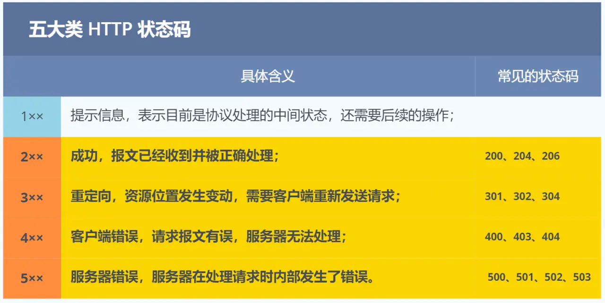
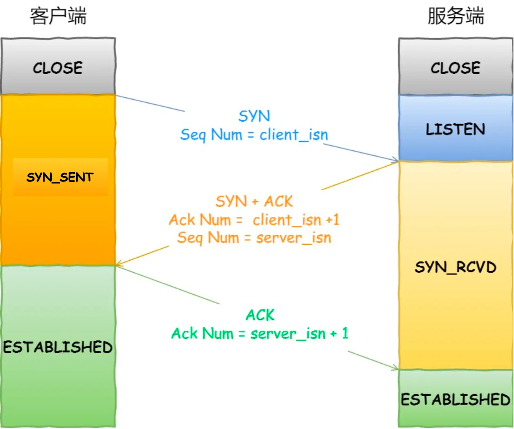

### 1. HTTP常用状态码？



「200 OK」是最常见的成功状态码，表示一切正常。如果是非 HEAD 请求，服务器返回的响应头都会有 body 数据。

「404 Not Found」表示请求的资源在服务器上不存在或未找到，所以无法提供给客户端。

HTTP状态码首先应该知道个大概的分类：

- 1XX：信息性状态码
- 2XX：成功状态码
- 3XX：重定向状态码
- 4XX：客户端错误状态码
- 5XX：服务端错误状态码

几个常用的，面试之外，也应该记住：


之前写过一篇：[程序员五一被拉去相亲，结果彻底搞懂了HTTP常用状态码](https://fighter3.blog.csdn.net/article/details/116464416)，还比较有意思，可以看看。

> **说一下301和302的区别？**

- 301：永久性移动，请求的资源已被永久移动到新位置。服务器返回此响应时，会返回新的资源地址。
- 302：临时性性移动，服务器从另外的地址响应资源，但是客户端还应该使用这个地址。

用一个比喻，301就是嫁人的新垣结衣，302就是有男朋友的长泽雅美。

### 2.强制缓存和协商缓存

**强制缓存不访问服务器、协商缓存需要访问服务器**

- `强制缓存`是浏览器 **自导自演** 的行为，发起请求时看该文件是否过期，没过期直接使用。
- `协商缓存`是浏览器发现文件过期了，需要和 **服务器端通讯** ，让服务器判断是否过期，没过期就还是用浏览器缓存，过期了就用服务器新返回的文件。

## TCP 握手与挥手

### 1. TCP 三次握手？

**过程**：首先客户端向服务器发送连接请求（SYN报文），然后服务器接收到请求后发送确认信息（ACK报文）并同时向客户端发送连接请求（SYN报文），最后客户端接收到服务器的确认和连接请求后，再向服务器发送确认信息（ACK报文）。完成这三次握手后，TCP连接就成功建立，双方可以开始数据传输。



### 2. TCP滑动窗口讲一下？

TCP的滑动窗口是一种核心的流量控制机制。它基于窗口的概念，**窗口实际上是一个缓冲区，在这个缓冲区内，发送方被允许在未收到确认的情况下连续发送数据。**窗口的大小定义了发送方可以发送但还未被确认的数据段的最大数量。

滑动窗口的工作原理可以简要概括为以下几个步骤：

1. **建立连接时的窗口大小协商**：在TCP三次握手建立连接的过程中，双方会交换窗口大小的信息，以确定初始的窗口大小。
2. **数据的发送与确认**：发送方根据窗口大小发送数据。每当接收方成功接收到一个数据段，它就会向发送方发送一个确认（ACK）报文，表明已成功接收到数据并准备好接收更多数据。
3. **窗口的滑动**：随着数据被发送和确认，窗口会“滑动”。具体来说，当发送方收到一个确认报文时，它会将窗口的起始点向前移动到已确认数据的下一个未被确认的数据段。这样，窗口内就包含了新的未发送但可以发送的数据段。
4. **窗口大小的调整**：滑动窗口的大小可以根据接受放的处理能力来进行流量控制。如果处理能力下降，接收方可能会减小窗口大小；如果状况良好，接收方可能会增大窗口大小，以允许更快的数据传输。
5. **数据的重传**：如果发送方在一段时间内没有收到某个数据段的确认，它会假设该数据段丢失，并重新发送该数据段。重新发送的触发通常是基于一个计时器，该计时器会在发送数据段时启动，并在未收到确认时超时。

### 3. TCP三次握手 为什么要3次，两次或者四次不行吗

> TCP 建立连接时，通过三次握手能**防止历史连接的建立，能减少双方不必要的资源开销，能帮助双方同步初始化序列号**。序列号能够保证数据包不重复、不丢弃和按序传输。
>
> **不使用「两次握手」和「四次握手」的原因：**
>
> - 「两次握手」：**无法防止历史连接的建立，会造成双方资源的浪费，**也无法可靠的同步双方序列号；
> - 「四次握手」：**三次握手就已经理论上最少可靠连接建立，**所以不需要使用更多的通信次数。


### 4. 说说 TCP 四次挥手的过程？

PS：问完三次握手，常常也会顺道问问四次挥手，所以也是必须掌握知识点。


TCP 四次挥手过程：

- 数据传输结束之后，通信双方都可以主动发起断开连接请求，这里假定客户端发起
- 客户端发送释放连接报文，**第一次挥手** (FIN=1，seq=u)，发送完毕后，客户端进入 **FIN_WAIT_1** 状态。
- 服务端发送确认报文，**第二次挥手** (ACK=1，ack=u+1,seq =v)，发送完毕后，服务器端进入 **CLOSE_WAIT** 状态，客户端接收到这个确认包之后，进入 **FIN_WAIT_2** 状态。
- 服务端发送释放连接报文，**第三次挥手** (FIN=1，ACK1,seq=w,ack=u+1)，发送完毕后，服务器端进入 **LAST_ACK** 状态，等待来自客户端的最后一个 ACK。
- 客户端发送确认报文，**第四次挥手** (ACK=1，seq=u+1,ack=w+1)，客户端接收到来自服务器端的关闭请求，发送一个确认包，并进入 TIME_WAIT 状态，**等待了某个固定时间（两个最大段生命周期，2MSL，2 Maximum Segment Lifetime）之后**，没有收到服务器端的 ACK ，认为服务器端已经正常关闭连接，于是自己也关闭连接，进入 CLOSED 状态。服务器端接收到这个确认包之后，关闭连接，进入 CLOSED 状态。

> 再来回顾下四次挥手双方发 `FIN` 包的过程，就能理解为什么需要四次了。
>
> - 关闭连接时，客户端向服务端发送 `FIN` 时，仅仅表示客户端不再发送数据了但是还能接收数据。
> - 服务端收到客户端的 `FIN` 报文时，先回一个 `ACK` 应答报文，而服务端可能还有数据需要处理和发送，等服务端不再发送数据时，才发送 `FIN` 报文给客户端来表示同意现在关闭连接。
>
> 从上面过程可知，服务端通常需要等待完成数据的发送和处理，所以服务端的 `ACK` 和 `FIN` 一般都会分开发送，从而比三次握手导致多了一次。

假如单身狗博主有一个女朋友—由于博主上班九九六，下班肝博客，导致没有时间陪女朋友，女朋友忍无可忍。

- 女朋友：狗男人，最近你都不理我，你是不是不爱我了？你是不是外面有别的狗子了？我要和你分手？
- 沙雕博主一愣，怒火攻心：分手就分手，不陪你闹了，等我把东西收拾收拾。

沙雕博主小心翼翼地装起了自己的青轴机械键盘。

- 哼，蠢女人，我已经收拾完了，我先滚为敬，再见！
- 女朋友：滚，滚的远远的，越远越好，我一辈子都不想再见到你。

挥手的故事总充满了悲伤和遗憾！


### 5. TCP 四次挥手过程中，为什么需要等待 2MSL, 才进入 CLOSED 关闭状态？

> **为什么需要等待？**

**1. 为了保证客户端发送的最后一个 ACK 报文段能够到达服务端。** 这个 ACK 报文段有可能丢失，因而使处在 **LAST-ACK** 状态的服务端就收不到对已发送的 **FIN + ACK** 报文段的确认。服务端会超时重传这个 FIN+ACK 报文段，而客户端就能在 2MSL 时间内（**超时 + 1MSL 传输**）收到这个重传的 FIN+ACK 报文段。接着客户端重传一次确认，重新启动 2MSL 计时器。最后，客户端和服务器都正常进入到 **CLOSED** 状态。

**2. 防止已失效的连接请求报文段出现在本连接中**。客户端在发送完最后一个 ACK 报文段后，再经过时间 2MSL，就可以使本连接持续的时间内所产生的所有报文段都从网络中消失。这样就可以使下一个连接中不会出现这种旧的连接请求报文段。

> **为什么等待的时间是2MSL？**

MSL 是 Maximum Segment Lifetime，报⽂最⼤⽣存时间，它是任何报⽂在⽹络上存在的最⻓时间，超过这个时间报⽂将被丢弃。

TIME_WAIT 等待 2 倍的 MSL，⽐较合理的解释是： ⽹络中可能存在来⾃发送⽅的数据包，当这些发送⽅的数据包被接收⽅处理后⼜会向对⽅发送响应，所以⼀来⼀回需要等待 **2** 倍的时间。


⽐如如果被动关闭⽅没有收到断开连接的最后的 ACK 报⽂，就会触发超时重发 Fin 报⽂，另⼀⽅接收到 FIN 后，会重发 ACK 给被动关闭⽅， ⼀来⼀去正好 2 个 MSL。

### 6. CLOSE-WAIT 和 TIME-WAIT 的状态和意义？

> **CLOSE-WAIT状态有什么意义？**

服务端收到客户端关闭连接的请求并确认之后，就会进入CLOSE-WAIT状态。此时服务端可能还有一些数据没有传输完成，因此不能立即关闭连接，而CLOSE-WAIT状态就是为了保证服务端在关闭连接之前将待发送的数据处理完。

> **TIME-WAIT有什么意义？**

TIME-WAIT状态发生在第四次挥手，当客户端向服务端发送ACK确认报文后进入TIME-WAIT状态。

它存在的意义主要是两个：


- **防⽌旧连接的数据包**

  如果客户端收到服务端的FIN报文之后立即关闭连接，但是此时服务端对应的端口并没有关闭，如果客户端在相同端口建立新的连接，可能会导致新连接收到旧连接残留的数据包，导致不可预料的异常发生。

- **保证连接正确关闭**

  假设客户端最后一次发送的ACK包在传输的时候丢失了，由于TCP协议的超时重传机制，服务端将重发FIN报文，如果客户端没有维持TIME-WAIT状态而直接关闭的话，当收到服务端重新发送的FIN包时，客户端就会使用RST包来响应服务端，导致服务端以为有错误发生，然而实际关闭连接过程是正常的。

## 网络分层

### 1. TCP和UDP

UDP和TCP的区别：

1.连接方式：TCP是面向连接的协议，意味着在发送数据之前，需要在发送方和接收方之间建立一条连接。而UDP则是无连接的协议，发送数据之前不需要建立连接，因此可以减少一些额外的开销。

2.可靠性：TCP是可靠的协议，通过校验和、序列号、确认应答、重发控制、连接管理以及窗口控制等机制实现可靠性传输。而UDP则尽最大努力交付，不保证可靠交付，因此可能会出现数据丢失或重复的情况。

3.传输效率：由于TCP需要建立连接、保证数据可靠性和顺序性，所以相对于UDP来说，其传输效率较低。而UDP则由于其简单、无连接的特性，传输效率较高，适用于对高速传输和实时性有较高要求的场景。

4.应用场景：TCP协议适用于需要可靠传输的场景，如文件传输、网页浏览等。而UDP协议则更适用于对实时性要求较高的场景，如在线直播、视频会议、实时游戏等。

### 2. 网络分层

```cmd
+----------------------+  +---------------------+
|      应用层         |    |      应用层         |
+----------------------+  +---------------------+
|      表示层         |    |                     |
+----------------------+  |                     |
|      会话层         |    |       应用层        |
+----------------------+  |                     |
|      传输层         |    +---------------------+
+----------------------+  |       传输层        |
|      网络层         |    +---------------------+
+----------------------+  |       网络层        |
|      数据链路层     |    +---------------------+
+----------------------+  |     网络接口层     |
|      物理层         |    +---------------------+
+----------------------+  |       物理层        |
                          +---------------------+
```


### 2.1 数据传输层、应用层对应的协议

传输层协议就两个，一个TCP，一个UDP，应用层这么多协议，怎么来区分呢。tcp+80标识它是http协议，同理其他的也一样。通过这个tcp+端口实现复用，协议就一个，但是标识的端口不一样，上层的协议也不一样。udp协议也是一样。

通常传输层协议加一个端口号来标识一个应用层协议。


### 3. TCP报文段结构

- **16 位端口号**：源端口号，主机该报文段是来自哪里；目标端口号，要传给哪个上层协议或应用程序
- **32 位序号**：一次 TCP 通信（从 TCP 连接建立到断开）过程中某一个传输方向上的字节流的每个字节的编号。
- **32 位确认号**：用作对另一方发送的 tcp 报文段的响应。其值是收到的 TCP 报文段的序号值加 1。
- **4 位首部长度**：表示 tcp 头部有多少个 32bit 字（4 字节）。因为 4 位最大能标识 15，所以 TCP 头部最长是 60 字节。
- **6 位标志位**：URG(紧急指针是否有效)，ACk（表示确认号是否有效），PST（缓冲区尚未填满），RST（表示要求对方重新建立连接），SYN（建立连接消息标志接），FIN（表示告知对方本端要关闭连接了）
- **16 位窗口大小**：是 TCP 流量控制的一个手段。这里说的窗口，指的是接收通告窗口。它告诉对方本端的 TCP 接收缓冲区还能容纳多少字节的数据，这样对方就可以控制发送数据的速度。
- **16 位校验和**：由发送端填充，接收端对 TCP 报文段执行 CRC 算法以检验 TCP 报文段在传输过程中是否损坏。注意，这个校验不仅包括 TCP 头部，也包括数据部分。这也是 TCP 可靠传输的一个重要保障。
- **16 位紧急指针**：一个正的偏移量。它和序号字段的值相加表示最后一个紧急数据的下一字节的序号。因此，确切地说，这个字段是紧急指针相对当前序号的偏移，不妨称之为紧急偏移。TCP 的紧急指针是发送端向接收端发送紧急数据的方法。


### 4. 网络层的职责是什么？网络接口层的职责是什么？

1. 网络接口层（Network Interface Layer）

- 职责：这一层负责处理与物理网络的接口细节，包括发送和接收数据帧。它对应于OSI模型中的物理层和数据链路层。在这一层，数据的单位称为帧（frame）。
- 功能：负责接收IP数据报并添加头部和尾部，然后通过网络发送；或者从网络上接收物理数据帧，抽出IP数据报交给网络层。此外，它还负责地址解析（如ARP协议）、错误检测和流量控制。

2. 网络层（Network Layer）

- 职责：网络层负责处理数据包在网络中的路由选择，确保数据包能够从源主机传输到目的主机。在这一层，数据的单位称为数据包（packet）。
- 功能：实现数据包的路由选择和转发，处理拥塞控制，以及为传输层提供端到端的逻辑通信。


### 6. TCP 是如何保证可靠性的？

TCP主要提供了检验和、序列号/确认应答、超时重传、最大消息长度、滑动窗口控制等方法实现了可靠性传输。


1. **连接管理**：TCP使用三次握手和四次挥手保证可靠地建立连接和释放连接，这里就不用多说了。
2. **校验和**：TCP 将保持它首部和数据的检验和。这是一个端到端的检验和，目的是检测数据在传输过程中的任何变化。如果接收端的检验和有差错，TCP 将丢弃这个报文段和不确认收到此报文段。


1. **序列号/确认应答**：TCP 给发送的每一个包进行编号，接收方会对收到的包进行应答，发送方就会知道接收方是否收到对应的包，如果发现没有收到，就会重发，这样就能保证数据的完整性。就像老师上课，会问一句，这一章听懂了吗？没听懂再讲一遍。


1. **流量控制：**TCP 连接的每一方都有固定大小的缓冲空间，TCP的接收端只允许发送端发送接收端缓冲区能接纳的数据。当接收方来不及处理发送方的数据，能提示发送方降低发送的速率，防止包丢失。TCP 使用的流量控制协议是可变大小的滑动窗口协议。 （TCP 利用滑动窗口实现流量控制）


1. **最大消息长度**：在建立TCP连接的时候，双方约定一个最大的长度（MSS）作为发送的单位，重传的时候也是以这个单位来进行重传。理想的情况下是该长度的数据刚好不被网络层分块。


1. **超时重传：**超时重传是指发送出去的数据包到接收到确认包之间的时间，如果超过了这个时间会被认为是丢包了，需要重传。


1. **拥塞控制：**如果网络非常拥堵，此时再发送数据就会加重网络负担，那么发送的数据段很可能超过了最大生存时间也没有到达接收方，就会产生丢包问题。为此TCP引入慢启动机制，先发出少量数据，就像探路一样，先摸清当前的网络拥堵状态后，再决定按照多大的速度传送数据。


### 7. 如何理解TCP的拥塞控制、流量控制，两者有什么区别，分别是为了保护谁的？

- **拥塞控制**：在网络出现拥堵时，如果继续发送大量数据包，可能会导致数据包时延、丢失等，这时 TCP 就会重传数据，但是一重传就会导致网络的负担更重，于是会导致更大的延迟以及更多的丢包，这个情况就会进入恶性循环被不断地放大。（所以控制的目的就是避免「发送方」的数据填满整个网络。）（**保护发送方**）
- **流量控制**：发送方不能无脑的发数据给接收方，要考虑接收方处理能力。如果一直无脑的发数据给对方，但对方处理不过来，那么就会导致数据丢失，触发重发机制，从而导致网络流量的无端的浪费。（流量控制是避免「发送方」的数据填满「接收方」的缓存）（**保护接受方**）

| 类别     | TCP拥塞控制                      | TCP流量控制                  |
| -------- | -------------------------------- | ---------------------------- |
| 目的     | 避免网络拥塞，调整发送速率       | 控制数据接收方的数据接收速率 |
| 保护对象 | 数据发送                         | 数据接收方                   |
| 实现原理 | 基于网络拥塞信号进行调整         | 基于接收端的反馈进行调整     |
| 策略     | 慢启动、拥塞避免、快重传、快恢复 | 滑动窗口、确认应答延迟等     |

### 11. 说说Session 和 Cookie 有什么联系和区别?

先来看看什么是 Session 和 Cookie ：

- Cookie 是保存在客户端的一小块文本串的数据。客户端向服务器发起请求时，服务端会向客户端发送一个 Cookie，客户端就把 Cookie 保存起来。在客户端下次向同一服务器再发起请求时，Cookie 被携带发送到服务器。服务端可以根据这个Cookie判断用户的身份和状态。
- Session 指的就是服务器和客户端一次会话的过程。它是另一种记录客户状态的机制。不同的是cookie保存在客户端浏览器中，而session保存在服务器上。客户端浏览器访问服务器的时候，服务器把客户端信息以某种形式记录在服务器上，这就是session。客户端浏览器再次访问时只需要从该session中查找用户的状态。

> Session 和 Cookie 到底有什么不同呢？

- 存储位置不一样，Cookie 保存在客户端，Session 保存在服务器端。
- 存储数据类型不一样，Cookie 只能保存ASCII，Session可以存任意数据类型，一般情况下我们可以在 Session 中保持一些常用变量信息，比如说 UserId 等。
- 有效期不同，Cookie 可设置为长时间保持，比如我们经常使用的默认登录功能，Session 一般有效时间较短，客户端关闭或者 Session 超时都会失效。
- 隐私策略不同，Cookie 存储在客户端，比较容易遭到不法获取，早期有人将用户的登录名和密码存储在 Cookie 中导致信息被窃取；Session 存储在服务端，安全性相对 Cookie 要好一些。
- 存储大小不同， 单个Cookie保存的数据不能超过4K，Session可存储数据远高于 Cookie。

### 12. 说说半连接队列和 SYN Flood 攻击的关系？

> **什么是半连接队列？**

TCP 进入三次握手前，服务端会从 **CLOSED** 状态变为 **LISTEN** 状态, 同时在内部创建了两个队列：半连接队列（SYN 队列）和全连接队列（ACCEPT 队列）。


顾名思义，半连接队列存放的是三次握手未完成的连接，全连接队列存放的是完成三次握手的连接。

- TCP 三次握手时，客户端发送 SYN 到服务端，服务端收到之后，便回复 **ACK 和 SYN**，状态由 **LISTEN 变为 SYN_RCVD**，此时这个连接就被推入了 **SYN 队列**，即半连接队列。
- 当客户端回复 ACK, 服务端接收后，三次握手就完成了。这时连接会等待被具体的应用取走，在被取走之前，它被推入 ACCEPT 队列，即全连接队列。

> **什么是SYN Flood ？**

SYN Flood 是一种典型的 DDos 攻击，它在短时间内，伪造**不存在的 IP 地址**, 向服务器发送大量SYN 报文。当服务器回复 SYN+ACK 报文后，不会收到 ACK 回应报文，那么SYN队列里的连接旧不会出对队，久⽽久之就会占满服务端的 **SYN** 接收队列（半连接队列），使得服务器不能为正常⽤户服务。


> **那有什么应对方案呢？**

主要有 **syn cookie** 和 **SYN Proxy 防火墙**等。

- **syn cookie**：在收到 SYN 包后，服务器根据一定的方法，以数据包的源地址、端口等信息为参数计算出一个 cookie 值作为自己的 SYNACK 包的序列号，回复 SYN+ACK 后，服务器并不立即分配资源进行处理，等收到发送方的 ACK 包后，重新根据数据包的源地址、端口计算该包中的确认序列号是否正确，如果正确则建立连接，否则丢弃该包。
- **SYN Proxy 防火墙**：服务器防火墙会对收到的每一个 SYN 报文进行代理和回应，并保持半连接。等发送方将 ACK 包返回后，再重新构造 SYN 包发到服务器，建立真正的 TCP 连接。

## IP

### 1. ICMP 协议的功能？

ICMP（Internet Control Message Protocol） ，网际控制报文协议。

- ICMP 协议是一种面向无连接的协议，用于传输出错报告控制信息。
- 它是一个非常重要的协议，它对于网络安全具有极其重要的意义。它属于网络层协议，主要用于在主机与路由器之间传递控制信息，包括**报告错误、交换受限控制和状态信息**等。
- 当遇到 IP 数据无法访问目标、IP 路由器无法按当前的传输速率转发数据包等情况时，会自动发送 ICMP 消息。

比如我们日常使用得比较多的 **ping**，就是基于 ICMP 的。

### 2. IP寻址和MAC寻址有什么不同？有了MAC地址为什么还要IP地址？

IP是OSI模型的网络层，是逻辑地址，进行路由的，允许跨越网络通信，MAC是OSI模型的数据链路层，进行帧转转发的，全球每个设备的MAC都不一样，是局域网中直接传输。

因为MAC地址虽然可以唯一标识网络设备，但它无法在不同网络之间进行通信。而IP地址则可以实现跨网络的通信，使得位于不同地理位置、使用不同网络技术的设备都能够相互通信。此外，IP地址还可以提供层次化的地址结构，使得网络管理更加便捷和高效

## 网络安全

### 1. 对称加密与非对称加密有什么区别？

**对称加密**：指加密和解密使用同一密钥，优点是运算速度较快，缺点是如何安全将密钥传输给另一方。常见的对称加密算法有：DES、AES 等。


**非对称加密**：指的是加密和解密使用不同的密钥（即公钥和私钥）。公钥与私钥是成对存在的，如果用公钥对数据进行加密，只有对应的私钥才能解密。常见的非对称加密算法有 RSA。


### 2. 什么是 DoS、DDoS、DRDoS 攻击？


- **DOS**: (Denial of Service), 翻译过来就是拒绝服务, 一切能引起拒绝 行为的攻击都被称为 DOS 攻击。最常见的 DoS 攻击就有**计算机网络宽带攻击**、**连通性攻击**。

- **DDoS**: (Distributed Denial of Service)，翻译过来是分布式拒绝服务。是指处于不同位置的多个攻击者同时向一个或几个目标发动攻击，或者一个攻击者控制了位于不同位置的多台机器，并利用这些机器对受害者同时实施攻击。

  主要形式有流量攻击和资源耗尽攻击，常见的 DDoS攻击有： **SYN Flood、Ping of Death、ACK Flood、UDP Flood** 等。

- **DRDoS**: (Distributed Reflection Denial of Service)，中文是分布式反射拒绝服务，该方式靠的是发送大量带有被害者 IP 地址的数据包给攻击主机，然后攻击主机对 IP 地址源做出大量回应，从而形成拒绝服务攻击。
